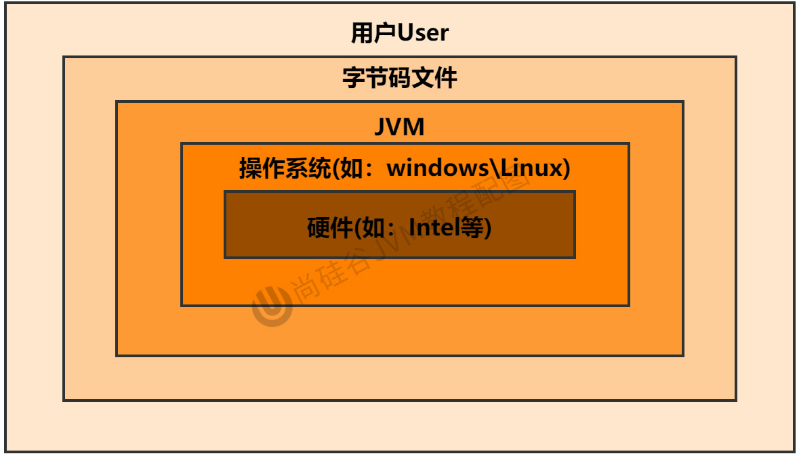

## 1.JVM与Java体系结构

### 1.1 字节码

- 平时说的java 字节码,指的是用java语言编译成的字节码
  - **准确的说,任何在JVM上执行的字节码的格式都是一样的，可以统一称为 “jvm字节码”**
  - 不同语言编译器可以编译出相同的字节码文件,并且也可以在不同的JVM上运行


### 1.2 多语言混合编程

- java平台上的多语言混合编程正成为主流，通过特定领域的语言去解决特定领域的问题是当前软件开发应对日趋复杂的项目需求的一个方向
  - 比如在一个项目之中，并行处理用clojure语言编写，展示层使用JRuby/Rails，中间层则是Java
  - 每个应用层都将使用不同的编程语言来完成，而且接口对每一层的开发者都是透明的，各种语言之间的交互不存在任何困难，就像使用自己语言的原生API一样方便，因为它们最终都运行在一个虚拟机之上

### 1.3 jvm作用

- **jvm就是二进制字节码的运行环境**
  - 负责装载字节码到内部,解释/编译为对应平台的机器指令执行
  - 每一条java 指令，jvm规范中都有详细定义。比如怎么取操作数,处理结果放在哪里
- jvm 的特点？
  - 一处编译，到处运行
  - 自动内存管理
  - 自动垃圾回收功能

### 1.4 JVM位置

- JVM是运行在操作系统之上的，它与硬件没有直接的交互




### 1.5 jvm 整体结构

- HotSpot JVM是目前市面上高性能虚拟机的代表作之一,它`采用解释器与即时编译器并存的架构`
  - <mark>方法区、堆 是多个线程之间共享的(线程共享)</mark>  
  - <mark>java栈、本地方法栈、程序计数器是每个线程独有一份的(线程隔离)</mark>
  - <mark>执行引擎包含三部分：解释器、JIT即时编译器、GC垃圾回收器</mark>
    - 用于将高级语言(字节码文件) 翻译为机器语言


### 1.6 java 代码执行流程


### 1.7 JVM的指令集架构模型

- Java编译器输入的指令集架构有两种

  - `基于栈的指令集架构`
    - 设计和实现更简单，适用于资源受限的系统
    - 避开了寄存器的分配难题：使用零地址指令方式分配。
    - 指令流中的指令大部分是零地址指令，其执行过程依赖于操作栈。指令集更小(8位)，编译器容易实现。
    - 不需要硬件支持，可移植性更好，更好实现跨平台
  - `基于寄存器的指令集架构`
    - 典型的应用是x86的二进制指令集：比如传统的PC以及Android的Davlik虚拟机
    - 指令集架构则完全依赖硬件，可移植性差
    - 性能优秀和执行更高效
    - 花费更少的指令去完成一项操作
    - 在大部分情况下，基于寄存器架构的指令集往往都以一地址指令、二地址指令和三地址指令为主，而基于栈式架构的指令集却是以零地址指令为主
  
- 总结

  - 由于跨平台性的设计，**Java的指令都是根据栈来设计的**。不同平台CPU架构不同，所以不能设计为基于寄存器的
  - 优点是跨平台，指令集小，编译器容易实现
    - 缺点是性能下降，实现同样的功能需要更多的指令


:::danger 同样执行2+3这种逻辑操作，两种指令分别如下

- **基于栈的计算流程(jvm为例)**

①、 java 代码

```java
public class StackStruTest {
    public static void main(String[] args) {
        int i = 2;
        int j = 3;
        int k = i+j;
    }
}
```

②、 对`.class` 文件使用 <font color='#f535e8'>`javap -v`</font> 命令查看对应的字节码文件

```
Classfile /Users/yoey/WorkSpace/Code/JVM/target/classes/com/yoey/C1/StackStruTest.class
  Last modified 2021-3-24; size 472 bytes
  MD5 checksum 721aa620fc0a8dbad354fa1c56ec2832
  Compiled from "StackStruTest.java"
public class com.yoey.C1.StackStruTest
  minor version: 0
  major version: 52
  flags: ACC_PUBLIC, ACC_SUPER
Constant pool:
   #1 = Methodref          #3.#21         // java/lang/Object."<init>":()V
   #2 = Class              #22            // com/yoey/C1/StackStruTest
   #3 = Class              #23            // java/lang/Object
   #4 = Utf8               <init>
   #5 = Utf8               ()V
   #6 = Utf8               Code
   #7 = Utf8               LineNumberTable
   #8 = Utf8               LocalVariableTable
   #9 = Utf8               this
  #10 = Utf8               Lcom/yoey/C1/StackStruTest;
  #11 = Utf8               main
  #12 = Utf8               ([Ljava/lang/String;)V
  #13 = Utf8               args
  #14 = Utf8               [Ljava/lang/String;
  #15 = Utf8               i
  #16 = Utf8               I
  #17 = Utf8               j
  #18 = Utf8               k
  #19 = Utf8               SourceFile
  #20 = Utf8               StackStruTest.java
  #21 = NameAndType        #4:#5          // "<init>":()V
  #22 = Utf8               com/yoey/C1/StackStruTest
  #23 = Utf8               java/lang/Object
{
  public com.yoey.C1.StackStruTest();
    descriptor: ()V
    flags: ACC_PUBLIC
    Code:
      stack=1, locals=1, args_size=1
         0: aload_0
         1: invokespecial #1                  // Method java/lang/Object."<init>":()V
         4: return
      LineNumberTable:
        line 8: 0
      LocalVariableTable:
        Start  Length  Slot  Name   Signature
            0       5     0  this   Lcom/yoey/C1/StackStruTest;

  public static void main(java.lang.String[]);
    descriptor: ([Ljava/lang/String;)V
    flags: ACC_PUBLIC, ACC_STATIC
    Code:
      stack=2, locals=4, args_size=1
         0: iconst_2      // 常量2
         1: istore_1		  // 存储常量到栈，索引1
         2: iconst_3			// 常量3
         3: istore_2      // 存储常量到栈，索引2
         4: iload_1       // 加载栈索引1 数据 
         5: iload_2				// 加载栈索引2 数据
         6: iadd					// 执行数据加指令
         7: istore_3      // 存储相加的结果到栈，索引2
         8: return        
      LineNumberTable:
        line 10: 0
        line 11: 2
        line 12: 4
        line 13: 8
      LocalVariableTable:
        Start  Length  Slot  Name   Signature
            0       9     0  args   [Ljava/lang/String;
            2       7     1     i   I
            4       5     2     j   I
            8       1     3     k   I
}
```


- **基于寄存器的计算流程**

```
mov eax,2 //将eax寄存器的值设为1
add eax,3 //使eax寄存器的值加3
```

:::


### 1.8 JVM的生命周期

::: tip jvm 的生命周期

jvm启动 —> jvm运行 —> jvm 退出

:::

#### 1.8.1 JVM启动

- JVM启动是通过 *引导类加载器（Bootstrap ClassLoader）*  创建一个初始类（initial class）来完成的,这个类是由虚拟机的具体实现指定的

#### 1.8.2 JVM运行

- 一个运行中的Java虚拟机有着一个清晰的任务：执行Java程序。
- 程序开始执行时他才运行，程序结束时他就停止。
- **执行一个所谓的Java程序的时候，真真正正在执行的是一个叫做 "JVM的进程"**
  - 通过 `jps` 可以查看jvm运行着的进程

#### 1.8.3 JVM退出

有如下的几种情况：

- 程序正常执行结束
- 程序在执行过程中遇到了异常或错误而异常终止
- 由于操作系统用现错误而导致Java虚拟机进程终止
- 某线程调用Runtime类或system类的exit方法，或Runtime类的halt方法，并且Java安全管理器也允许这次exit或halt操作。
- 除此之外，JNI（Java Native Interface）规范描述了用JNI Invocation API来加载或卸载 Java虚拟机时，Java虚拟机的退出情况


## 2. JVM 发展历程

### 2.1  Sun Classic VM

- 早在1996年Java1.0版本的时候，Sun公司发布了一款名为Sun classic VM的Java虚拟机，它同时也是世界上第一款商用Java虚拟机，JDK1.4时完全被淘汰。
- 这款虚拟机内部只提供解释器。现在还有即时编译器，因此效率比较低，而及时编译器会把热点代码缓存起来，那么以后使用热点代码的时候，效率就比较高。
  - 解释器和编译器不能配合工作
  - 如果使用JIT编译器，就需要进行外挂。但是一旦使用了JIT编译器，JIT就会接管虚拟机的执行系统，解释器就不再工作
- 现在hotspot内置了此虚拟机

### 2.2 Exact VM

- 为了解决上一个虚拟机问题，jdk1.2时，Sun提供了此虚拟机。 `Exact Memory Management：准确式内存管理`
  - 也可以叫 Non-Conservative/Accurate Memory Management
  - **虚拟机可以知道内存中某个位置的数据具体是什么类型**。

- **具备现代高性能虚拟机的维形**
  - `热点探测（寻找出热点代码进行缓存）`
  - `编译器与解释器混合工作模式`

- 只在solaris平台短暂使用，其他平台上还是classic vm，英雄气短，终被Hotspot虚拟机替换

### 2.3  HotSpot VM

- HotSpot历史
  - 最初由一家名为“Longview Technologies”的小公司设计
  - 1997年，此公司被sun收购；2009年，Sun公司被甲骨文收购。
  - JDK1.3时，HotSpot VM成为默认虚拟机
- 目前Hotspot占有绝对的市场地位
  - 不管是现在仍在广泛使用的JDK6，还是使用比例较多的JDK8中，默认的虚拟机都是HotSpot
  - Sun/oracle JDK和openJDK的默认虚拟机
- HotspotVM 从服务器、桌面到移动端、嵌入式都有应用
- 名称中的HotSpot指的就是它的 **热点代码探测技术**
  - 通过计数器找到最具编译价值代码，触发即时编译或栈上替换
  - 通过编译器与解释器协同工作，在最优化的程序响应时间与最佳执行性能中取得平衡

### 2.4 JRockit

- 专注于服务器端应用
  - 它可以不太关注程序启动速度，因此JRockit内部不包含解析器实现，全部代码都靠即时编译器编译后执行
  - 大量的行业基准测试显示，JRockit JVM是世界上最快的JVM
    - 使用JRockit产品，客户已经体验到了显著的性能提高（一些超过了70%）和硬件成本的减少（达50%）
- 优势：全面的Java运行时解决方案组合
  - JRockit面向延迟敏感型应用的解决方案JRockit Real Time提供以毫秒或微秒级的JVM响应时间，适合财务、军事指挥、电信网络的需要
  - MissionControl服务套件，它是一组以极低的开销来监控、管理和分析生产环境中的应用程序的工具
- 2008年，JRockit被oracle收购
  - oracle表达了整合两大优秀虚拟机的工作，大致在JDK8中完成。整合的方式是在HotSpot的基础上，移植JRockit的优秀特性

### 2.5 IBM的J9

- 目前，有影响力的三大商用虚拟机之一，也号称是世界上最快的Java虚拟机
  - 全称：IBM Technology for Java Virtual Machine，简称IT4J，内部代号：J9
  - 2017年左右，IBM发布了开源J9VM，命名为openJ9，交给EClipse基金会管理，也称为Eclipse OpenJ9
- 市场定位与HotSpot接近，服务器端、桌面应用、嵌入式等多用途VM广泛用于IBM的各种Java产品

### 2.6  Azul VM

- 高性能Java虚拟机中的战斗机。
- Azul VM是Azu1Systems公司在HotSpot基础上进行大量改进，运行于Azul Systems公司的专有硬件Vega系统上的JVM 
  - 每个Azu1VM实例都可以管理至少数十个CPU和数百GB内存的硬件资源
  - 提供在巨大内存范围内实现可控的GC时间的垃圾收集器、专有硬件优化的线程调度等

- 2010年，AzulSystems公司开始从硬件转向软件，发布了自己的zing JVM，可以在通用x86平台上提供接近于Vega系统的特性。
- <mark>饿了么使用的就是Azul Zing Vm</mark>

### 2.7 Taobao VM

- 由AliJVM团队发布。阿里，国内使用Java最强大的公司，覆盖云计算、金融、物流、电商等众多领域，需要解决高并发、高可用、分布式的复合问题
  - 基于OpenJDK开发了自己的定制版本AlibabaJDK，简称AJDK。是整个阿里Java体系的基石
  - 基于openJDK Hotspot VM发布的国内第一个优化、深度定制且开源的高性能服务器版Java虚拟机
- 特点
  - 创新的GCIH（GCinvisible heap）技术实现了off-heap
    - 即将生命周期较长的Java对象从heap中移到heap之外，并且Gc不能管理GCIH内部的Java对象，以此达到降低GC的回收频率和提升Gc的回收效率的目的。
  - GCIH中的对象还能够在多个Java虚拟机进程中实现共享
  - 使用crc32指令实现JVM intrinsic降低JNI的调用开销
  - PMU hardware的Java profiling tool和诊断协助功能
  - 针对大数据场景的ZenGc
- taobao vm应用在阿里产品上性能高，硬件严重依赖inte1的cpu，损失了兼容性，但提高了性能
  - 目前已经在淘宝、天猫上线，把oracle官方JvM版本全部替换了

### 2.8  Graal VM

- 2018年4月，oracle Labs公开了GraalvM
- GraalVM在HotSpot VM基础上增强而成的跨语言全栈虚拟机，可以作为“任何语言” 的运行平台使用
  - 语言包括：Java、Scala、Groovy、Kotlin；C、C++、Javascript、Ruby、Python、R等
  - <mark>支持不同语言中混用对方的接口和对象，支持这些语言使用已经编写好的本地库文件</mark>
- 工作原理是将这些语言的源代码或源代码编译后的中间格式，通过解释器转换为能被Graal VM接受的中间表示
- Graal VM提供Truffle工具集快速构建面向一种新语言的解释器。在运行时还能进行即时编译优化，获得比原生编译器更优秀的执行效率
