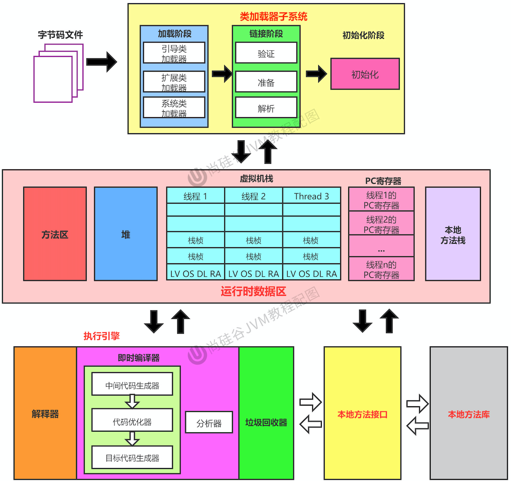
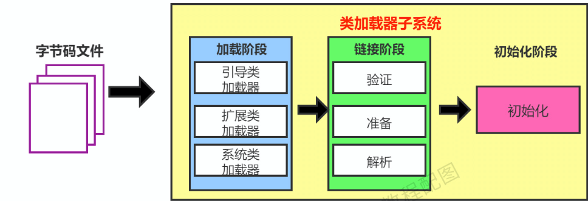
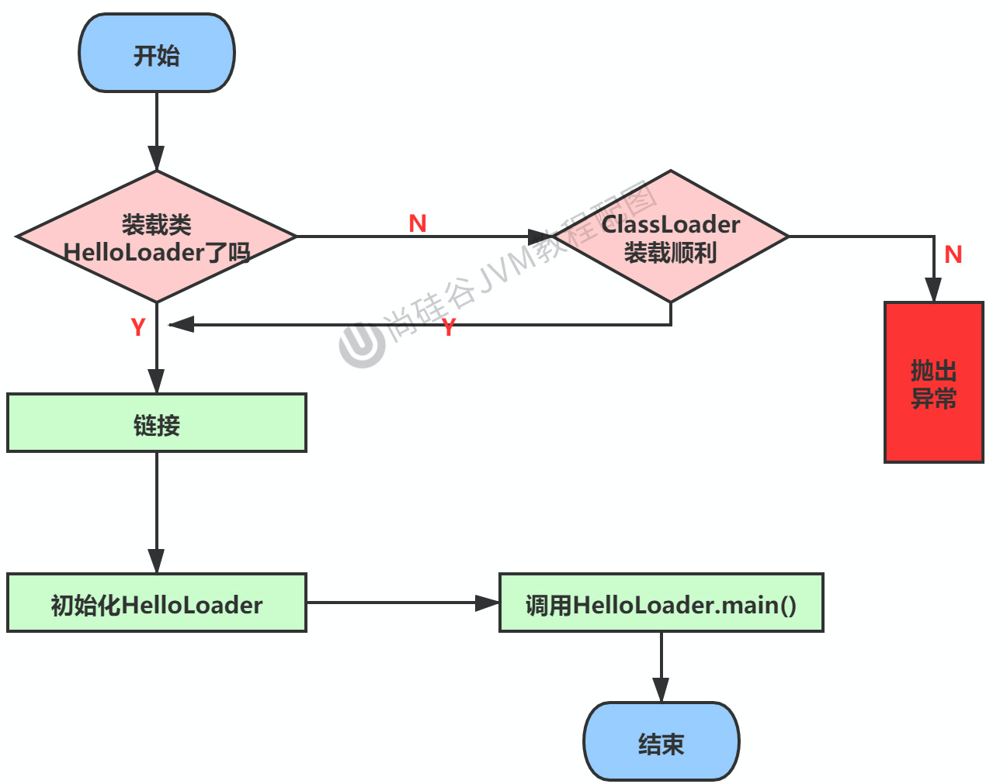
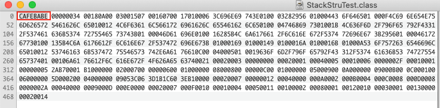
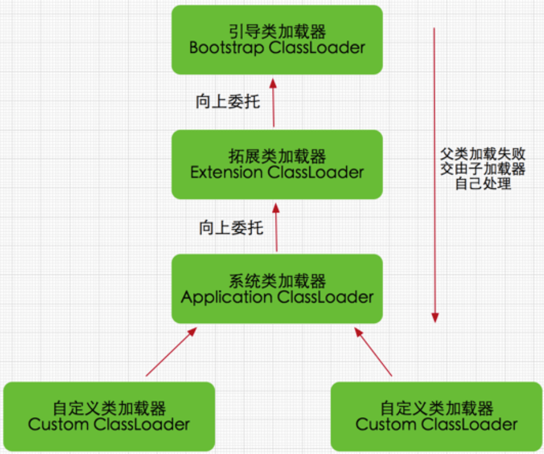

## 1. JVM 内存结构图




## 2. 类加载子系统

### 2.1 类加载子系统的作用

- 类加载器子系统**负责从文件系统或者网络中加载Class文件**,Class文件在文件开头有特定的文件标识
  - ClassLoader 只负责Class文件的加载，至于它是否可以运行，则由`执行引擎` 决定
- 加载的类信息存放在方法区中
  - 类加载器将本地的Class字节码文件加载到JVM中，被称为 `DNA 元数据模板`，放在方法区
  - 除了类的信息外，**方法区中还会存放运行时常量池信息，可能还包括字符串字面量和数字常量**
    - 这部分常量信息是Class文件中常量池部分的内存映射




### 2.2 类加载过程

- 加载阶段 -> 链接阶段 (验证、准备、解析) -> 初始化阶段



#### 2.2.1 类加载过程-加载

- **执行步骤**

  1. 通过一个类的全限定名获取定义此类的二进制字节流

  2. 将这个字节流所代表的静态存储结构转化为方法区的运行时数据结构

  3. **在堆内存中生成一个代表这个类的java.lang.Class对象**，这个类将作为程序访问方法区中类型数据的外部接口
- JVM规范中没有对上述的三步骤进行要求，比如第一步如何获取、怎么获取Class字节码文件的二进制流，有很多方式：
     - `从本地系统中直接加载`
     - `通过网络获取`
          - 典型场景：Web Applet
     - `从zip压缩包中读取，成为日后jar、war格式的基础`
          - 比如Tomcat、第三方的jar包
     - `运行时计算生成`
          - 典型场景: <mark>动态代理技术</mark>
     - `由其他文件生成`
          - 典型场景：JSP应用
     - `从加密文件中获取`
          - 典型的防Class文件被反编译的保护措施
     - ...
- 相对于类加载的其他步骤，加载阶段对开发人员来说是最可控的!既可以通过 JVM内置的类加载器去加载，也可以由用户自定义的类加载器完成
     - <mark>开发人员可以通过定义自己的类加载器去控制字节码文件二进制流的获取方式 ->  重写类加载器的loadClass()方法</mark>
- 加载阶段与连接阶段的部分动作(比如一部分自己吗文件格式校验) 是交叉进行的,**即加载阶段尚未完成，连接阶段可能已经开始了!**


#### 2.2.2 类加载阶段-链接

- 包含了以下的三个步骤
  - `验证(Verify)`
  - `准备(Prepare)`
  - `解析(Resolve)`

##### 2.2.2.1 验证

- **确保Class字节码文件的字节流中包含信息符合当前虚拟机要求，保证被加载类的正确性，不会危害虚拟机自身安全**
- 主要包括四个验证阶段
  - `文件格式校验` -> 验证字节流是否符合Class文件的格式规范
    - **保证加载的字节流能正确的解析并存储到方法区中，只有通过该阶段后，字节流才能进入JVM内存的方法区中!**
      - 后面的三个阶段都是基于方法区的存储结构进行的，不会在直接读取、操作字节流了
    - 常见的校验规则
      - 是否以魔数 `0xCAFEBABE` 开头
      - 主、次版本号是否在当前JVM范围内
      - 常量池中的常量是否有不被支持的常量类型 -> 检查常量的 tag标志
      - 指向常量的各种索引值中是否有指向不存在的常量或者不符合类型的常量
      - Class字节码文件各个部分以及文件本身是否有被删除或者附加的其他信息
      - ...
  - `元数据校验` -> 对字节码的描述信息进行语义分析
    - **对类的元数据信息进行语义分析，保证其不与java语言规范相违背**
    - 常见的校验规则
      - 这个类是否有父类(除了Object，所有的类都有父类)
      - 类是否继承了不被允许继承的类(被final修饰的类)
      - 如果类不是抽象类，是否实现了父类或者接口中的要求实现的方法
  - `字节码校验`
  - `符号引用校验`
    - **发生于JVM 将符号引用转化为直接引用的时候**

**魔数 "CADEBABE"**




##### 2.2.2.2 准备

- **在方法区中为类变量(`静态变量`) 分配内存，并且为该类变量设置默认初始值**
  - 实例变量会随着对象的实例化分配到 堆空间 中
- `static 与 final static的区别？`
  - static 在准备阶段是默认初始值，只有在初始化阶段后，才会通过putstatic 指令设置为指定值
  - final static 在编译时会加上ConstantValue属性，值为指定值。并且分配空间，在准备阶段就会被赋值
    - final static 修饰的变量相当于是常量

```java
public class HelloApp {
  	public static int age = 22;    				// 准备阶段为0，在下个阶段，也就是初始化的时候才是1
    public final static int sal = 33;		  // 编译时会加上ConstantValue属性，值为33，在准备阶段就会被赋值为33
 
  
    public static void main(String[] args) {
        System.out.println(age);
    }
}

/*
	属性age、sal 对应的字节码
	
	  public static int age;
    descriptor: I
    flags: ACC_PUBLIC, ACC_STATIC

  public static final int sal;
    descriptor: I
    flags: ACC_PUBLIC, ACC_STATIC, ACC_FINAL
    ConstantValue: int 33
    
    static {};
    descriptor: ()V
    flags: ACC_STATIC
    Code:
      stack=1, locals=0, args_size=0
         0: bipush        22									//将22压入栈
         2: putstatic     #3                  // Field age:I  --> 通过 putstatic 将 age 赋值为 22
         5: return
      LineNumberTable:
        line 9: 0															// 代码第9行
*/
```


##### 2.2.2.3 解析

- `将常量池内的符号引用转换为直接引用的过程`
  - 事实上，解析操作往往会伴随着JVM在执行完初始化之后再执行
- 符号引用 与 直接引用？
  - `符号引用`
    - 是一组符号来描述所引用的目标,与JVM的内存布局无关，且引用的目标并不一定要加载到JVM的内存中
    - 符号引用的字面量形式明确定义在《java虚拟机规范》的class文件格式中
  - `直接引用`
    - 直接指向目标的指针、相对偏移量或一个间接定位到目标的句柄
    - 有了直接引用，那么引用的目标必须是已经在JVM的内存中存在的
- 解析动作主要针对以下
  - 类或接口 
    - 对应常量池: CONSTANT_Class_info
  - 字段
    - 对应常量池: CONSTANTFieldref_info
  - 类方法   
    - 对应常量池: CONSTANT_Methodref_info
  - 接口方法 
    - 对应常量池: CONSTANT_InterfaceMethodref_info
  - 方法类型
    - 对应常量池: CONSTANT_MethodType_info
  - 方法句柄
    - 对应常量池: CONSTANT_MethodHandle_info
  - ...

#### 2.2.3 类加载阶段-初始化

:::tip 注意

对象实例化执行顺序: 静态代码块(不管是否实例化，只要加载类就会调用该方法) -> 构造块 -> 构造函数

:::

- 初始化阶段就是执行类构造器 `<clinit>()` 方法的过程

  - `<clinit>()`是 javac 编译器的自动生成物 

    - 整合类中的所有`类变量的赋值动作` 和 `静态代码块中的语句`(static{...}) 而来
    - 整合的顺序是语句在源代码中出现的顺序
      - **静态代码块只能访问到定义在静态代码块前面的变量!**
        - 在类加载的链接的准备阶段，所有的类变量以符号引用的方式存储在方法区，而当静态代码块尝试获取类变量确需要通过直接引用，这就导致编译报错
      - **定义在静态代码块后面的变量虽然无法访问，但是可以对其进行赋值！**
        - 类变量定义在静态代码块后面，该类变量定义的值会覆盖前面静态代码块的赋的值

    ```java
    public class ClassInitTest {
        private static int num = 1;
        static {
            num = 2;
            number = 20;
            System.out.println(num);
            System.out.println(number);  //编译报错，非法的向前引用
        }
    
        private static int number = 10;
    
        public static void main(String[] args) {
            System.out.println(ClassInitTest.num); 			// 2
            System.out.println(ClassInitTest.number); 	// 10  
        }
    }
    ```

    

  - JVM保证在子类的`<clinit>()方法执行前，父类的<clinit>()方法已经执行完成`

    - `<clinit>()`方法与类的构造器方法(`<init>()`)不同，不需要显式的调用父类构造器
    - 因此JVM中第一个被执行`<clinit>()` 的类一定是 `Object`

  - 由于父类的`<clinit>`一定先执行，所以父类的静态代码块也一定先执行！

    - `<clinit>` 不是必须的，如果类中没有类变量赋值、静态代码块，javac 编译器就就不会为该类生成 `<clinit>()` 方法

  - JVM保证一个类的 `<clinit>()` 方法在多线程下被同步加锁

    - `<clinit>`只会加载一次，并且JVM通过加锁的方式保证一次只有一个线程可以对类进行初始化！
      - **可以利用该方式实现 单例模式**

    ```java
    public class InitLock {
        public static void main(String[] args) {
            new Thread(() -> {
                System.out.println(Thread.currentThread().getName() + "\t 线程t1开始");
                new TestDemo();
            }, "t1").start();
    
            new Thread(() -> {
                System.out.println(Thread.currentThread().getName() + "\t 线程t2开始");
                new TestDemo();
            }, "t2").start();
        }
    }
    class TestDemo{
        static {
            if (true) {
                System.out.println(Thread.currentThread().getName() + "\t 初始化当前类");          
            }
        }
    }
    
    /*
    	t1	 线程t1开始
      t2	 线程t2开始
      t1	 初始化当前类
    */
    ```


### 2.3 类加载器架构

- JVM支持两种类型的类加载器 
  - `引导类加载器`  
  - `自定义类加载器`
    - 派生于抽象类ClassLoader的类加载器都划分为自定义类加载器

- 通过 xx.class.getClassLoader() 方法获取当前类的类加载器！




#### 2.3.1 获取ClassLoader

- **获取当前ClassLoader**
  - xx.class.getClassLoader()
- **获取当前线程上下文的ClassLoader**
  - Thread.currentThread().getContextClassLoader()
- **获取系统的ClassLoader**
  - ClassLoader.getSystemClassLoader()
- **获取调用者的ClassLoader**
  - DriverManager.getCallerClassLoader()

```java
public class ClassLaoderTest2 {
    public static void main(String[] args) {
        // 1.获取当前的ClassLoader
        ClassLoader classLoader1 = ClassLaoderTest2.class.getClassLoader();
        System.out.println(classLoader1);               // sun.misc.Launcher$AppClassLoader@18b4aac2

        // 2.通过当前线程上下文类获取ClassLoader
        ClassLoader contextClassLoader = Thread.currentThread().getContextClassLoader();
        System.out.println(contextClassLoader);        // sun.misc.Launcher$AppClassLoader@18b4aac2      

        // 3.通过ClassLoader 获取系统 类加载器
        ClassLoader systemClassLoader = ClassLoader.getSystemClassLoader();
        System.out.println(systemClassLoader);        // sun.misc.Launcher$AppClassLoader@18b4aac2

    }
}
```

#### 2.3.2 用户自定义类加载器

- 自定义类加载器的用途？
  - `隔离加载类`
  - `修改类加载方式`
  - `拓展加载源`
  - `防止源码泄露`
- **如何自定义类加载器？**
  1. 继承抽象类 java.1ang.ClassLoader类，实现自己的类加载器 或者继承URIClassLoader类
  2. 重写 `findClass()` 方法,处理自定义的类加载逻辑

#### 2.3.2 三层类加载器 (<=jdk1.8)

- `BootStrap ClassLoader`
  - 引导类加载器
    - 由C/C++编写,嵌套在JVM内部,无法获取
    - 并不继承自 java.lang.ClassLoader，没有父加载器
    - **用来加载Java的核心库**
  - 加载路径
    - `JAVAHOME/jre/1ib/rt.jar、resources.jar`等 或 `sun.boot.class.path` 路径下的类库，用于提供JVM自身需要的类
- `Extension  ClassLoader`
  - 拓展类加载器  -> 自定义类加载器
    - Java语言编写，派生于ClassLoader类 [sun.misc.Launcher$ExtClassLoader]
    - 上层类加载器为启动类加载器
  - 加载路径
    - `JAVA_HOME\lib\ext` 或 `环境变量 java.ext.dirs`路径下的所有类库
- `Application ClassLoader`
  - 应用程序/系统类加载器 -> 自定义类加载器
    - Java语言编写，派生于ClassLoader类 [sun.misc.Launcher$AppClassLoader]
    - 上层类加载器为拓展类加载器
    - **如果没有特殊指定，该加载器则是默认加载器**
  - 加载路径
    - `环境变量classpath`或 `系统属性java.class.path` 指定路径下的类库

```java
public class ClassLoaderTest {
    public static void main(String[] args) {
        // 获取系统类加载器
        ClassLoader systemClassLoader = ClassLoader.getSystemClassLoader();   // sun.misc.Launcher$AppClassLoader@18b4aac2
        System.out.println(systemClassLoader);

        //获取系统类加载器 上层 -> 拓展类加载器
        ClassLoader extClassLoader = systemClassLoader.getParent();           // sun.misc.Launcher$ExtClassLoader@68f7aae2
        System.out.println(extClassLoader);

        // 获取拓展类加载器 上层 -> 引导类加载器
        ClassLoader bootstrapClassLoader = extClassLoader.getParent();
        System.out.println(bootstrapClassLoader);                            //null -> 无法获取到引导类加载器   

        //查看当前类的类加载器是哪一个?
        ClassLoader classLoader = ClassLoaderTest.class.getClassLoader();
        System.out.println(classLoader);                                     //sun.misc.Launcher$AppClassLoader@18b4aac2 
      
      
      
        // 获取引导类加载器加载的类库
        URL[] urLs = Launcher.getBootstrapClassPath().getURLs();
        for (int i = 0; i < urLs.length; i++) {
            System.out.println(urLs[i].getPath());
        }
      	/*
      			/Library/Java/JavaVirtualMachines/jdk1.8.0_171.jdk/Contents/Home/jre/lib/resources.jar
          	/Library/Java/JavaVirtualMachines/jdk1.8.0_171.jdk/Contents/Home/jre/lib/rt.jar
            /Library/Java/JavaVirtualMachines/jdk1.8.0_171.jdk/Contents/Home/jre/lib/sunrsasign.jar
            /Library/Java/JavaVirtualMachines/jdk1.8.0_171.jdk/Contents/Home/jre/lib/jsse.jar
            /Library/Java/JavaVirtualMachines/jdk1.8.0_171.jdk/Contents/Home/jre/lib/jce.jar
            /Library/Java/JavaVirtualMachines/jdk1.8.0_171.jdk/Contents/Home/jre/lib/charsets.jar
            /Library/Java/JavaVirtualMachines/jdk1.8.0_171.jdk/Contents/Home/jre/lib/jfr.jar
            /Library/Java/JavaVirtualMachines/jdk1.8.0_171.jdk/Contents/Home/jre/classes
      	*/
    }
}
```


#### 2.3.4 双亲委派机制

- JVM 对Class文件采用的是 `按需加载` 的方式，即需要使用某个类时才会将它的class文件加载到方法区中生成Class对象
  - JVM采用双亲委派的模式，即把加载请求层层向上交给父级类加载器处理，是一种任务委派的模式!
- 代码逻辑 -> java.lang.ClassLoader#loadClass()
- **工作流程**
  - 如果一个类加载器收到了类加载请求，它并不会自己先去加载，而是把这个请求委托给父类的加载器去执行
  - 每一层次的类加载器都是如此，所以所有的加载请求最终都会传递到引导类加载器上
  - 只有当父加载器无法完成加载的请求，子加载器才会尝试自己去加载
- **存在意义？**
  - <mark>保证Java中的类与类加载器一起具备了层次关系，比如Object这个类存在于rt.jar中，被引导类加载器加载，保证各个类加载器环境中都是唯一的</mark>
- **双亲委派机制的优势**
  - `避免类的重复加载`
  - `保护程序安全，防止核心API被随意篡改`
    - 比如重写一个与 rt.jar类库中类重名(包括包名)的类，会发现可以正常编译，但是永远无法被加载运行 


##### 2.3.4.1 SPI如何“破坏了”双亲委派模型

:::danger 

- 一般来说，双亲委派保证了**越基础的类由越上层的类加载器加载** -> 基础类一般指的是总是作为被用户继承、调用的api存在
  
- 但是在某些情况下，有些基础类内部逻辑需要由用户实现 -> 比如JNDI、JDBC...
  
- 以ServiceLoader为例子 -> java.util.ServiceLoader#load(java.lang.Class)

  - 这里线程上下文类获得的类加载器一般就是 `系统类加载器`

  ```java
  public static <S> ServiceLoader<S> load(Class<S> service) {
      ClassLoader cl = Thread.currentThread().getContextClassLoader();
      return ServiceLoader.load(service, cl);
  }
  ```

:::

**以JDBC的驱动DriverManager为例 -> java.sql.DriverManager#loadInitialDrivers**

- DriverManager与Driver 属于 rt.jar下面的类，由引导类加载器进行加载
- 但是Driver属于接口,具体的实现由各个数据库厂商进行实现，并且再通过 SPI的方式加载到JVM中
  - 这个步骤中，SPI是采用 系统类加载器进行加载的 -> **即引导类加载器委托系统类加载器加载类，"打破了"双亲委派模型**

```java
ServiceLoader<Driver> loadedDrivers = ServiceLoader.load(Driver.class);
Iterator<Driver> driversIterator = loadedDrivers.iterator();
try{
    while(driversIterator.hasNext()) {
        driversIterator.next();
    }
} catch(Throwable t) {
}
return null;
```

- **JDBC连接数据库🌰**
  - 首先我们需要知道的是 jdbc.jar是基于SPI接口进行实现的，所以在加载的时候，会进行双亲委派
  - 最终从根加载器中加载 SPI核心类，然后在加载SPI接口类
  - 接着在进行`反向委派`，通过线程上下文类加载器进行实现类 jdbc.jar的加载


### 2.4 其他

#### 2.4.1 如何判断两个class对象是否相同

- 在JVM中表示两个class对象是否为同一个类存在两个必要条件
  - **类的完整类名必须一致，包括包名**
  - **加载这个类的ClassLoader（指ClassLoader实例对象）必须相同**

#### 2.4.2 类的主动使用与被动使用

- Java程序对类的使用方式分为

  - **主动使用**
    - 创建类的实例
    - 访问某个类或接口的静态变量，或者对该静态变量赋值
    - 调用类的静态方法
    - 反射（比如：Class.forName（"com.demo.Test"））
    - 初始化一个类的子类
    - Java虚拟机启动时被标明为启动类的类
    - JDK7开始提供的动态语言支持：
      - java.lang.invoke.MethodHandle实例的解析结果getStatic、putStatic、invokeStatic句柄对应的类没有初始化，则初始化

  - **被动使用**

    - 被动使用不会导致类的初始化

    

## 总结
```java
/*
*   加载过程
*       -> 加载 : 从文件系统\网络中加载字节码文件(字节流的方式) -> 加载方式:本地/网络/动态代理的/zip文件...
*           -> 通过类的全类名获取类的二进制流
*           -> 将字节流转为符合存储在方法区的格式 -> 通过javap -v 可以看到
*                  -> 比如常量池ConstantPool
*           -> 加载完成后,会在堆内存生成一个Class对象
*       -> 链接
*           -> 验证:
*               -> 文件格式校验: 最重要,保证字节码的二进制流不会对JVM造成安全问题,校验通过后,字节码文件二进制流会存储到方法区中
*                   -> 魔数: 0xCAFEBABE
*               -> 元数据校验:语法校验
*               -> 字节码校验
*               -> 符号引用校验
*           -> 准备 : 为类变量分配内存,并且设置默认初始值
*               -> static 与 final static : 前者在准备时默认为0,需要经过初始化步骤;后者属于常量(有ConstantValue),准备时就会赋上值
*           -> 解析: 将常量池中的符号引用转化为直接引用
*       -> 初始化:
*           -> <clinit>() -> 合并类变量与静态代码块,顺序与源码顺序一致 -> 如果没有就不会生成
*               ->   静态代码块无法访问后面声明的变量,但是可以对其进行赋值
*           -> <clinit>() 总是不断向上的调用,启动java程序时,最先调用的<clinit>()方法一定是Object的
*           -> <clinit>() 只会被调用一次,且加载   -> 可以考虑用这种方式实现单例
*
*   类加载器
*       -> 引导类加载器 -> javahome\lib\rt.jar ...
*       -> 拓展类加载器 -> Javahome\lib\ext 所有的类库
*       -> 系统类加载器 -> classpath下面的类加载器
*               -> clazz.getClassLoader
*               -> ClassLoader.getSystemClassLoader()
*               -> Thread.currentThread().getContextClassLoader()
*
*       -> 双亲委派
*           -> 将加载请求不断向上传递,所有的加载请求都需要由引导类加载器处理,如果无法处理,则交由下面的处理
*           -> 保证最基础的类库是由引导类加载器进行加载的,并且由于加载过Class对象存储在方法区中.即使伪造JVM核心类库的Class对象,也无法被替换
*                   -> 避免重复类的加载 -> 全类名一致+加载该类的类加载器一致(类加载器信息也会存储在方法区中!)
*                   -> 保护程序的安全,避免核心api 被篡改
*           -> spi 破坏?
*               -> 核心类库的某些基础类型没有具体实现,交由开发人员实现,因此无法把Class加载到JVM中
*               -> spi 则是通过系统类加载器去加载Class的,这就导致看起来是引导类加载器去请求下级的系统类加载器,破坏了双亲委派模型
* */
```