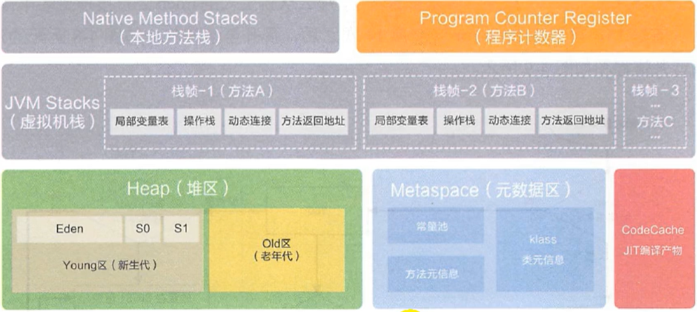
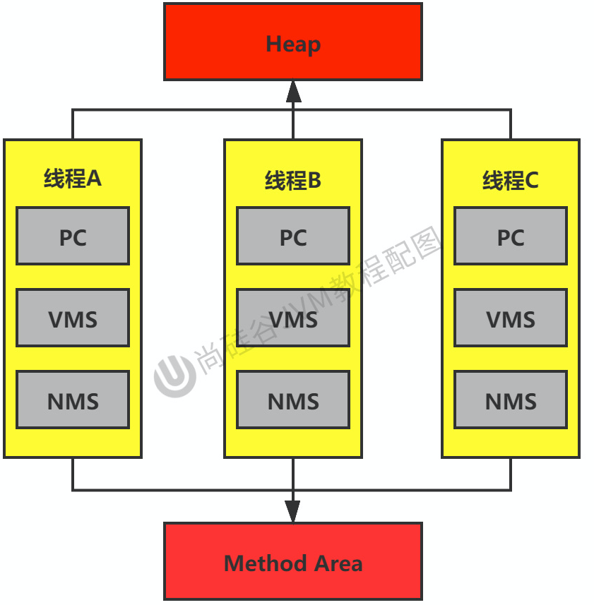
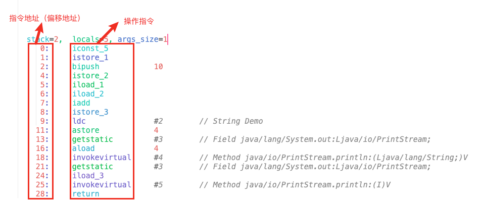
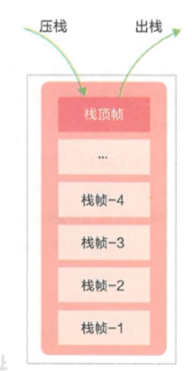
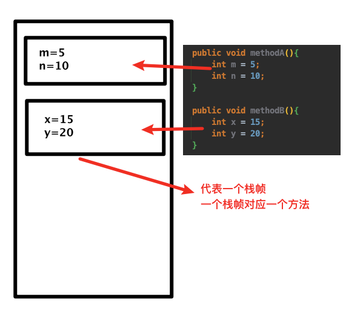
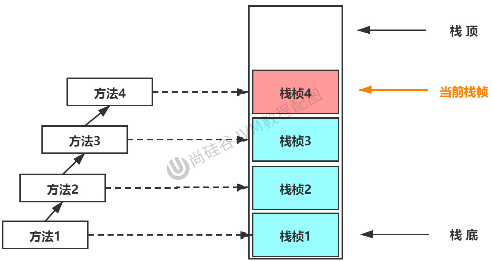
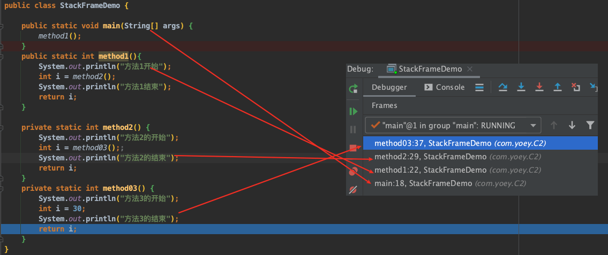
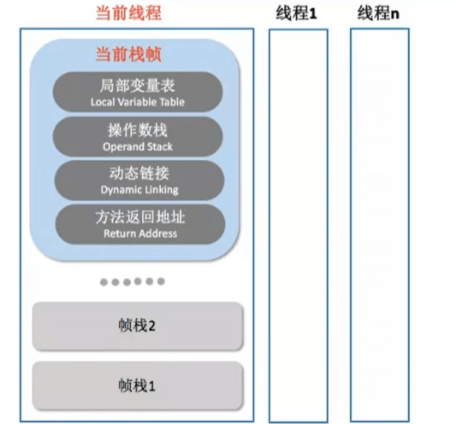
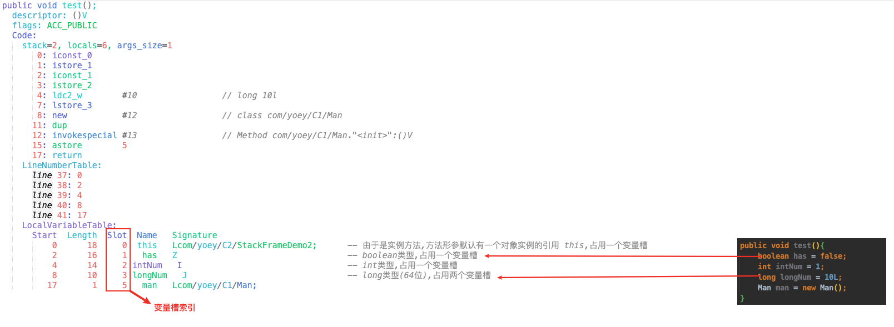

## 1. 运行时数据区(Runtime)

- 内存是非常重要的系统资源，是硬盘和CPU的中间仓库及桥梁，承载着操作系统和应用程序的实时运行
  - 我们通过磁盘或者网络IO得到的数据，都需要先加载到内存中，然后CPU从内存中获取数据进行读取，也就是说内存充当了CPU和磁盘之间的桥梁
- **JVM内存布局规定了Java在运行过程中内存申请、分配、管理的策略，保证了JVM的高效稳定运行**
  - 不同的JVM对于内存的划分方式和管理机制存在着部分差异

**运行时数据区的完整图**





**运行时数据区按是否线程私有划分**

- 灰色的为单独线程私有的，红色的为多个线程共享的。即：
  - <`每个线程私有` 
    - 独立包括程序计数器、虚拟机栈、本地方法栈。
  - `多个线程间共享`
    - 堆、堆外内存（永久代或者元空间）




### 1.1 Runtime数据区内存结构

- JVM 定义了若干种程序运行期间会使用到的运行时数据区
  - 其中有一些会随着虚拟机启动而创建，随着虚拟机退出而销毁
  - 另外一些则是与线程一一对应的，这些与线程对应的数据区域会随着线程开始和结束而创建和销毁
- 按是否线程共享划分
  - `由所有线程共享的区域`
    - **方法区(Non-Heap)**
      - 存储被JVM 加载的 `类型信息、常量、静态变量、JIT即时编译器编译后的代码缓存` 等
      - 运行时常量池也是方法区的一部分,存放编译期间生成的各种字面量、符号引用
      - JDK1.6开始，逐步将方法区从JVM 移动至 `本地内存(堆外内存)`
    - **堆区(Heap)**
      - 在所有的对象实例以及数组都在堆上分配
  - 线程隔离的数据区 —> `线程私有的内存`
    - **虚拟机栈**
    - **程序计数器 ( PC 寄存器 )**
    - **本地方法栈(native方法栈)**
  - `直接内存`
    - 并不是Runtime运行时数据区的一部分

### 1.2 线程

- 线程是一个程序里的运行单元,JVM允许一个应用有多个线程并行的执行
- 在Hotspot JVM里，每个线程都与操作系统的本地线程直接映射
  - 当一个Java线程准备好执行以后，此时一个操作系统的本地线程也同时创建
  - java 线程执行终止后，本地线程也会回收
- 操作系统负责所有线程的安排调度到任何一个可用的CPU上。一旦本地线程初始化成功,它就会调用 java 线程中的 `run()` 方法

#### 1.2.1 JVM系统线程

- 通过 `jconsole`能看到在后台有许多线程在运行
- Hotspot JVM里主有以下几个后台系统线程
  - **虚拟机线程**
    - 这种线程的操作是需要JVM达到安全点才会出现
    - 这些操作必须在不同的线程中发生的原因是他们都需要JVM达到安全点，这样堆才不会变化
    - 这种线程的执行类型包括: *"stop-the-world"的垃圾收集，线程栈收集，线程挂起以及偏向锁撤销*
  - **周期任务线程**
    - 这种线程是时间周期事件的体现（比如中断），他们一般用于周期性操作的调度执行
  - **GC线程**
    - 这种线程对在JVM里不同种类的垃圾收集行为提供了支持
  - **编译线程**
    - 这种线程在运行时会将字节码编译成到本地代码
  - **信号调度线程**
    - 这种线程接收信号并发送给JVM，在它内部通过调用适当的方法进行处理


## 2.程序计数器（Program Counter Register）

:::tip 说明

- 寄存器存储指令相关的现场信息,CPU只有把数据装载到寄存器才能够运行
  - JVM中的PC寄存器是对物理PC寄存器的一种抽象模拟
- 程序计数器是一块很小的内存空间，几乎可以忽略不记,**也是运行速度最快的存储区域** 
- 它是唯一一个在JVM规范中没有规定任何`outofMemoryError`情况的区域

:::

- <mark>程序计数器的作用?</mark> 

  - **存储指向下一条指令的地址**
- 程序计数器可以看作为: **当前线程所执行的字节码的行号指示器, 是程序控制流的指示器**
  - `分支、循环、跳转、异常处理、线程恢复` 等基础功能都需要依赖这个计数器来完成
  - 字节码解释器的工作就是: **通过改变程序计数器的值来选取下一条需要执行的字节码指令**
- <mark>多线程与程序计数器关联?</mark> 

  - 多线程是通过`线程轮流切换、并发的分配处理器执行时间`的方式实现的。
    - 受CPU时间片轮限制，在任意的时刻，`一个CPU中的一个内核,都只会执行一个线程中的指令`
      - CPU时间片: CPU分配给各个程序的时间，每个线程被分配一个时间段，称作它的时间片
    - **为了保证各个线程切换后能恢复到正确的执行位置, `每个线程都需要有一个独立的程序计数器，且各线程的计数器互不影响、独立存储`**




## 3. 虚拟机栈

### 3.1 虚拟机栈概述

:::danger 栈和堆的区别?

- **栈是运行时的单位，而堆是存储的单位**
  - `栈`: 解决程序的运行问题, 即程序如何执行、如何处理数据?
  - `堆`: 解决数据存储的问题, 即数据怎么存放、放在哪里?

:::

- **虚拟机栈是什么?**
  - 是java方法执行的线程内存模型 -> 每个线程在创建时都会创建一个虚拟机栈,是`线程私有`

- 生命周期?
  - 生命周期和线程一致，也就是线程结束了，该虚拟机栈也销毁了
- 虚拟栈的作用?
  - 负责java程序的运行，它保存方法的 局部变量、部分结果，并参与方法的调用和返回
- 虚拟机栈的特点?
  - 虚拟机栈是一种快速有效的分配存储方式，访问速度仅次于程序计数器
  - **对于栈来说,不存在垃圾回收。但是存在栈溢出的问题!!!**




### 3.2 栈的溢出问题？

- **JVM 允许Java栈的大小是动态的或者是固定不变的**

  - `虚拟机栈固定大小`
    - 那每一个线程的虚拟机栈容量可以在线程创建的时候独立选定
    - 如果线程请求分配的栈容量超过虚拟机栈允许的最大容量，Java虚拟机将会抛出一个StackoverflowError 异常
  - `虚拟机栈可以动态拓展`
    - 如果在尝试扩展的时候无法申请到足够的内存，或者在创建新的线程时没有足够的内存去创建对应的虚拟机栈,JVM会抛出 outofMemoryError 异常

  ```java
  public class StatcOverFlowTest {
      private static int count = 1;
      public static void main(String[] args) {
          System.out.println(count++);
          main(args);         // count = 9354时,出现StackOverflowError
      }
  }
  ```

  

- **如何设置栈内存大小?**

  - 通过参数 `-Xss`选项来设置线程的最大栈空间，栈的大小直接决定了函数调用的最大可达深度

    ```java
    -Xss100m
    ```

### 3.3 栈的存储结构(栈帧)

- 每个线程都有自己的栈,栈中的数据以 `栈帧` 的格式存在
  - **是支持虚拟机进行 方法执行调用的数据结构**
  - **在编译java程序源码时，栈帧需要多大的局部变量表，需要分配多大内存，已经被分析计算出来！**
  - **每一个方法从调用到方法返回都对应着`一个栈帧入栈出栈`的过程** —> 每个方法被执行的时候，都会同步创建一个栈帧




- 最顶部的栈帧称为当前栈帧，栈帧所关联的方法称为当前方法，定义这个方法的类称为当前类
  - 当前线程中，虚拟机有且也只会对当前栈帧进行操作 -> **执行引擎运行的字节码指令都是针对当前栈帧**
  - 如果方法中调用了其他方法，对应的新的栈帧会被创建出来，放在栈的顶端，成为新的当前栈帧



**通过IDE的debug查看栈帧**




### 3.4 栈的运行原理

- 不同线程中所包含的栈帧是不允许存在相互引用的，即不可能在一个栈帧之中引用另外一个线程的栈帧
- <mark>如果当前方法调用了其他方法</mark>

  - 方法返回时，当前栈帧会传回此方法的执行结果给前一个栈帧
  - 然后, JVM 会丢弃当前栈帧，使前一个栈帧重新成为当前栈帧
- Java方法有两种返回函数的方式 -> 不管使用哪种方式，都会导致栈帧被弹出
  - 正常的函数返回，使用return指令
  - 抛出异常

## 4. 栈帧




### 4.1 栈帧的内部结构

- **栈帧包含如下的几个部分**
  - `局部变量表 
  - `操作数栈 [表达式栈]`
  - `动态链接 [指向运行时常量池的方法引用]`
  - `方法返回地址`
  - `一些附加信息`

### 4.2 局部/本地变量表(LV)

- 是一组变量值的存储空间，用于存放`方法参数、方法内部的局部变量` -> 一个数组

- 局部变量表的容量以 `变量槽`< 作为最小单位

  - **一个变量槽**需要可以存放以下数据类型(一个变量槽可以存放一个32位的数据类型)
    - byte、char、short、int、float、boolean
    - 对象引用 (reference)
    - 返回地址 (returnAddress)
  - 对于`long、double` 这种 64位的数据类型，JVM**会分配`两个连续的变量槽`**
    - 虽然这种割裂存储破坏了原子性,但由于变量槽建立的线程对应的栈上,是线程私有的数据，所以不会存在数据竞争、线程安全问题
  - **JVM 为每个局部变量表都分配了一个访问索引**

**实例方法字节码解析后的Code属性**




#### 4.2.1 局部变量表数据存储?

- 局部变量表存储的数据
  1. **方法被调用时**
     - 通过局部变量表完成 实参->形参的传递过程
     - 方法参数分配完成后，在为方法体中的变量分配变量槽
  2. **方法被调用，且为实例方法时**
     - 局部变量表第0位索引的变量槽 *默认是用于传递方法所属对象实例的引用* 
       - 其余参数按照参数表顺序排列
     - 方法参数分配完成后，在为方法体中的变量分配变量槽

#### 4.2.2 变量槽Slot重复使用？

- 栈帧中的局部变量表中的槽位是可以重用的
  - 如果一个局部变量过了其作用域，那么在其作用域之后申明的新的局部变就很有可能会复用过期局部变量的槽位,从而达到节省资源的目的

```java
public void test2(){
  {
    int intNum = 1;
    System.out.println(intNum);
  }
  // 此时 intNum的变量槽槽位置会被 age复用
  int age = 10;
}
```


### 4.3 操作数栈(OS)

### 4.4 动态链接

### 4.5 方法返回地址

### 4.6 附加信息


