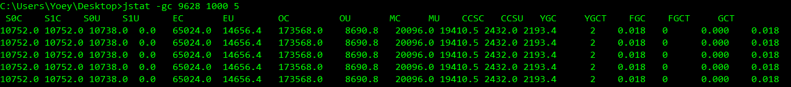

## 常见的JVM参数类型

### 标准参数

- 一般都是很稳定的,在未来的JVM版本中不会改变,可以使用 java -help 检索出所有的标准参数
  - `-help 、 -server -client 、 -showversion 、-cp -classpath`
- **-help : 可以查看所有的标准参数**


#### java -help

```bash
java -help                                                    
用法: java [-options] class [args...]                              
           (执行类)                                                 
   或  java [-options] -jar jarfile [args...]                     
           (执行 jar 文件)                                           
其中选项包括:    
	选项											选项说明
    -d32          								使用 32 位数据模型 (如果可用)                             
    -d64          								使用 64 位数据模型 (如果可用)                             
    -server       						 选择 "server" VM  默认 VM 是 server.                                                         
    -cp  <目录和 zip/jar 文件的类搜索路径>                                   
    -classpath <目录和 zip/jar 文件的类搜索路径>                            
                 						 用 ; 分隔的目录, JAR 档案和 ZIP 档案列表, 用于搜索类文件。                           
    -D<名称>=<值>                          		设置系统属性                                         
    -verbose:[class|gc|jni]                		  启用详细输出                                         
    -version      							输出产品版本并退出                                      
    -version:<值>               警告: 此功能已过时, 将在未来发行版中删除。需要指定的版本才能运行         
    -showversion  							输出产品版本并继续                                      
    -jre-restrict-search | -no-jre-restrict-search               
                  警告: 此功能已过时, 将在                                 
                  未来发行版中删除。                                      
                  在版本搜索中包括/排除用户专用 JRE                            
    -? -help      输出此帮助消息                                        
    -X            输出非标准选项的帮助                                     
    -ea[:<packagename>...|:<classname>]                          
    -enableassertions[:<packagename>...|:<classname>]            
                  按指定的粒度启用断言                                     
    -da[:<packagename>...|:<classname>]                          
    -disableassertions[:<packagename>...|:<classname>]           
                  禁用具有指定粒度的断言                                    
    -esa | -enablesystemassertions                               
                  启用系统断言                                         
    -dsa | -disablesystemassertions                              
                  禁用系统断言                                         
    -agentlib:<libname>[=<选项>]                                   
                  加载本机代理库 <libname>, 例如 -agentlib:hprof          
                  另请参阅 -agentlib:jdwp=help 和 -agentlib:hprof=help
    -agentpath:<pathname>[=<选项>]                                 
                  按完整路径名加载本机代理库                                  
    -javaagent:<jarpath>[=<选项>]                                  
                  加载 Java 编程语言代理, 请参阅 java.lang.instrument       
    -splash:<imagepath>                                          
                  使用指定的图像显示启动屏幕                                  
```


### 使用 -D 设置系统属性

**1. TestJVM 代码**

```java
public class TestJVM{
	public static void main(String[] args) {
		String str = System.getProperty("str");
		if(str==null){
			System.out.println("1111");
		}else{
			System.out.println(str);
		}
	}
}
```

**2. 使用 java -D 设置系统属性**

```bash
C:\Users\Yoey\Desktop>java TestJVM
1111
# 使用-Dstr 设置系统属性
C:\Users\Yoey\Desktop>java -Dstr=Yoey TestJVM
Yoey
C:\Users\Yoey\Desktop>
```


### X 参数

- **通过 java -X 查看所有非标准参数**
  - `-Xint`: 解释执行
  - `-Xcomp`:  第一次使用就编译成本地代码
  - `-Xmixed`: 混合模式,JVM自己决定是否编译长本地代码

#### java -X

```bash
C:\Users\Yoey\Desktop>java -X
    -Xmixed           		混合模式执行 (默认)
    -Xint             		仅解释模式执行
    -Xbootclasspath:<用 ; 分隔的目录和 zip/jar 文件>      设置搜索路径以引导类和资源
    -Xbootclasspath/a:<用 ; 分隔的目录和 zip/jar 文件>    附加在引导类路径末尾
    -Xbootclasspath/p:<用 ; 分隔的目录和 zip/jar 文件>
                      		置于引导类路径之前
    -Xdiag            		显示附加诊断消息
    -Xnoclassgc       		禁用类垃圾收集
    -Xincgc           		启用增量垃圾收集
    -Xloggc:<file>    		将 GC 状态记录在文件中 (带时间戳)
    -Xbatch           		禁用后台编译
    -Xms<size>        		设置初始 Java 堆大小
    -Xmx<size>        		设置最大 Java 堆大小
    -Xss<size>        		设置 Java 线程堆栈大小
    -Xprof            		输出 cpu 配置文件数据
    -Xfuture          		启用最严格的检查, 预期将来的默认值
    -Xrs              		减少 Java/VM 对操作系统信号的使用 (请参阅文档)
    -Xcheck:jni       		对 JNI 函数执行其他检查
    -Xshare:off       		不尝试使用共享类数据
    -Xshare:auto      		在可能的情况下使用共享类数据 (默认)
    -Xshare:on        		要求使用共享类数据, 否则将失败。
    -XshowSettings    		显示所有设置并继续
    -XshowSettings:all		显示所有设置并继续
    -XshowSettings:vm 		显示所有与 vm 相关的设置并继续
    -XshowSettings:properties 		显示所有属性设置并继续
    -XshowSettings:locale 		显示所有与区域设置相关的设置并继续
```


### XX参数

- 非标准化参数,相对不稳定,**主要用于JVM调优 和Debug**
- **两种分类**
  - `Boolean 类型`
    - 格式 :  `-XX:[+-]<name>`
      - `+` : 启用 name 属性
      - `-` : 禁用 name 属性
    - 比如 : 
      - -XX:+UseConcMarkSweepGC : 使用 CMS 垃圾收集器
      - -XX:+UseG1GC  : 使用G1垃圾回收期
  - `非Boolean 类型`
    - 格式 :  `-XX:<name>=<value>`
      - `name` : 属性名
      - `value` :  属性值
    - 比如:
      - -XX:MaxGCPauseMillis=500  : 设置最大GC最大停段时间是500ms
      - -XX:GCTimeRatio=19 : GCTimeRatio=19
- `-Xmx 和 -Xms`
  - -Xmx : 等价于 -XX:InitialHeapSize
    - 设置初始堆内存
  - -Xms : 等价于 -XX:MaxHeapSize
    - 设置最大堆内存


## 查看JVM运行时参数

1. `-XX:+PrintFlagsInitial`  : 查看一些JVM初始值

2. `-XX:+PrintFlagsFinal`  :  查看一些JVM最终值

3. `-XX:+PrinCommandLineFlags`  :  打印命令行参数

4. `-XX:+UnlockExperimentalVMOptions` :  解锁实验参数

5. `-XX:+UnlockDiagnosticVMOptions` :  解锁诊断参数

:::info 使用 -XX:+PrintFlagsInitial

- **查看JVM的初始值**
  - `=` : 表示默认值
  - `:=` : 表示被用户或者JVM修改后的值

```bash
C:\Users\Yoey\Desktop>java -XX:+PrintFlagsInitial
[Global flags]  
    uintx InitialHeapSize                           = 0                                   {product}  
    uintx MarkStackSize                             = 4194304                             {product}
    uintx MarkStackSizeMax                          = 536870912                           {product}
    uintx MarkSweepAlwaysCompactCount               = 4                                   {product}
    uintx MarkSweepDeadRatio                        = 5                                   {product}
     intx MaxBCEAEstimateLevel                      = 5                                   {product}
     intx MaxBCEAEstimateSize                       = 150                                 {product}
    uintx MaxDirectMemorySize                       = 0                                   {product}
     bool MaxFDLimit                                = true                                {product}
    uintx MaxGCMinorPauseMillis                     = 4294967295                          {product}
     bool UseLargePagesIndividualAllocation        := false                               {pd product}  
```

:::


### jps(监视JVM)

- 作用 : **查看Java 进程的启动类,传入参数 以及Java虚拟机参数等**
- 格式 :   `jps [可选参数]`
- **可选参数列表**

  - `-q`：只输出进程 ID

  - `-m`：输出传入 main 方法的参数

  - `-l`：输出完全的包名，应用主类名，jar的完全路径名

  - `-v`：输出jvm参数

  - `-V`：输出通过flag文件传递到JVM中的参数

```bash
# 查看Java进程的包名
C:\Users\Yoey\Desktop>jps -l -m -v
# jps 本身
# 进程ID:8316   
8316 sun.tools.jps.Jps -l -m -v -Denv.class.path=.;D:\JDK1.8\lib\dt.jar;D:\JDK1.8\lib\tools.jar -Dapplication.home=D:\JDK1.8 -Xms8m
# Tomcat服务
# 进程ID:9628   
# 包名:org.apache.catalina.startup.Bootstrap  
# 传入main方法参数:start
9628 org.apache.catalina.startup.Bootstrap start -Djava.util.logging.config.file=D:\Tomcat8\apache-tomcat-8.5.34\conf\logging.properties -Djava.util.logging.manager=org.apache.juli.ClassLoaderLogManager -Djdk.tls.ephemeralDHKeySize=2048 -Djava.protocol.handler.pkgs=org.apache.catalina.webresources -Dignore.endorsed.dirs= -Dcatalina.base=D:\Tomcat8\apache-tomcat-8.5.34 -Dcatalina.home=D:\Tomcat8\apache-tomcat-8.5.34 -Djava.io.tmpdir=D:\Tomcat8\apache-tomcat-8.5.34\temp
```


### jinfo(故障排除)

- 作用 : 
  1. **可以用来查看正在运行的 java 应用程序的扩展参数，包括Java System属性和JVM命令行参数**

  2. **也可以动态的修改正在运行的 JVM 一些参数**

  3. **当系统崩溃时，jinfo可以从core文件里面知道崩溃的Java应用程序的配置信息**

- `Javacore`
  - 也可以称为 "threaddump" 或是 " javadump "
  - 是 Java 提供的一种诊断特性，能够提供一份可读的当前运行的 JVM 中线程使用情况的快照
    - 即在某个特定时刻，JVM 中有哪些线程在运行，每个线程执行到哪一个类，哪一个方法
  - 应用程序如果出现不可恢复的错误或是内存泄露，就会自动触发 Javacore 的生成


- `jinfo 格式 :`
  - `jinfo [可选参数] <pid>`
  - `jinfo [可选参数] <executable core>`
    - 可选参数
      - 没有参数 :   输出全部的参数和系统属性
      - `-flag name` :  输出对应名称的参数
      - `-flag [+|-]name` :  开启或者关闭对应名称的参数
      - `-flag name=value` : 设定对应名称的参数
      - `-flags`  :  输出全部的参数
      - `-sysprops`  :   输出系统属性

**示例1. 没有任何参数**

> `jinfo pid` : 输出系统参数和JVM参数的信息

```bash
C:\Users\Yoey\Desktop>jinfo 9628
Attaching to process ID 9628, please wait...
Debugger attached successfully.
Server compiler detected.
JVM version is 25.171-b11
# Java 系统参数
Java System Properties:
java.vendor = Oracle Corporation
java.vm.specification.vendor = Oracle Corporation
java.runtime.version = 1.8.0_171-b11
java.vm.name = Java HotSpot(TM) 64-Bit Server VM
file.encoding = GBK
java.specification.version = 1.8
# JVM参数
VM Flags:
Non-default VM flags: -XX:CICompilerCount=4 -XX:InitialHeapSize=266338304 -XX:MaxHeapSize=4259315712 -XX:MaxNewSize=1419771904 -XX:MinHeapDeltaBytes=524288 -XX:NewSize=88604672 -XX:OldSize=177733632 -XX:+UseCompressedClassPointers -XX:+UseCompressedOops -XX:+UseFastUnorderedTimeStamps -XX:-UseLargePagesIndividualAllocation -XX:+UseParallelGC
Command line:  -Djava.util.logging.config.file=D:\Tomcat8\apache-tomcat-8.5.34\conf\logging.properties -Djava.util.logging.manager=org.apache.juli.ClassLoaderLogManager -Djdk.tls.ephemeralDHKeySize=2048 -Djava.protocol.handler.pkgs=org.apache.catalina.webresources -Dignore.endorsed.dirs= -Dcatalina.base=D:\Tomcat8\apache-tomcat-8.5.34 -Dcatalina.home=D:\Tomcat8\apache-tomcat-8.5.34 -Djava.io.tmpdir=D:\Tomcat8\apache-tomcat-8.5.34\temp
```


**示例2. -flag name**

> `jinfo -flag name pid` : 输出对应名称的JVM参数

```bash
C:\Users\Yoey\Desktop>jinfo -flag MaxHeapSize 9628
-XX:MaxHeapSize=4259315712
```


**示例3. -flags**

> `jinfo -flags pid` : 输出全部的JVM参数


```bash
C:\Users\Yoey\Desktop>jinfo -flags 9628
Attaching to process ID 9628, please wait...
Debugger attached successfully.
Server compiler detected.
JVM version is 25.171-b11
Non-default VM flags: -XX:CICompilerCount=4 -XX:InitialHeapSize=266338304 -XX:MaxHeapSize=4259315712 -XX:MaxNewSize=1419771904 -XX:MinHeapDeltaBytes=524288 -XX:NewSize=88604672 -XX:OldSize=177733632 -XX:+UseCompressedClassPointers -XX:+UseCompressedOops -XX:+UseFastUnorderedTimeStamps -XX:-UseLargePagesIndividualAllocation -XX:+UseParallelGC
Command line:  -Djava.util.logging.config.file=D:\Tomcat8\apache-tomcat-8.5.34\conf\logging.properties -Djava.util.logging.manager=org.apache.juli.ClassLoaderLogManager -Djdk.tls.ephemeralDHKeySize=2048 -Djava.protocol.handler.pkgs=org.apache.catalina.webresources -Dignore.endorsed.dirs= -Dcatalina.base=D:\Tomcat8\apache-tomcat-8.5.34 -Dcatalina.home=D:\Tomcat8\apache-tomcat-8.5.34 -Djava.io.tmpdir=D:\Tomcat8\apache-tomcat-8.5.34\temp
```

----

## jstat查看JVM统计信息

- **主要利用JVM内建的指令对Java应用程序的资源和性能进行实时的命令行的监控，包括了对Heap size和垃圾回收状况的监控**
- 可以查看以下的信息
  - `类加载`
  - `垃圾收集`
  - `JIT编译`
- 格式  :   `jstat  [可选参数]  [-t] <pid> [<interval> <count>]`
  - 可选参数
    - `-class` 					 :  显示ClassLoad的相关信息
    - `-compiler`  	       :  显示JIT编译的相关信息
    - `-gc`                          : 显示和gc相关的堆信息
    - `-gccapacity`  :   显示各个代的容量以及使用情况
    - `-gcmetacapacity`  :   显示metaspace的大小
    - `-gcnew`                           : 显示新生代信息
    - `-gcnewcapacity `          : 显示新生代大小和使用情况
    - `-gcold `                           : 显示老年代和永久代的信息
    - `-gcoldcapacity`         : 显示老年代的大小
    - `-gcutil`　                    : 显示垃圾收集信息
    - `-gccause`                      : 显示垃圾回收的相关信息（通-gcutil）,同时显示最后一次或当前正在发生的垃圾回收的诱因
    - `-printcompilation`  :  输出JIT编译的方法信息
  - `-t`  :  在打印的列加上Timestamp列，用于显示系统运行的时间
  - `interval`  :  每次执行的间隔时间 , 单位毫秒
  - `count`   :  输出多少条记录,缺省则会一直打印


### -class 参数

- 显示 加载Class 的数量 以及占用空间等信息
- 每个展示值的含义
  - `Loaded` : 已经装载的类的数量
  - `Bytes`    : 装载类所占用的字节数
  - `Unloaded`：已经卸载类的数量
  - `Time`：装载和卸载类所花费的时间

```bash
C:\Users\Yoey\Desktop>jstat -class -t 9628 1000 10
Timestamp       Loaded   Bytes  	Unloaded   Bytes      Time
9824.4   		3324     6344.1        0        0.0       1.61
9825.4   		3324     6344.1        0        0.0       1.61
9826.4   		3324     6344.1        0        0.0       1.61
9827.4   		3324     6344.1        0        0.0       1.61
9828.4   		3324     6344.1        0        0.0       1.61
9829.4   		3324     6344.1        0        0.0       1.61
9830.4   		3324     6344.1        0        0.0       1.61
9831.4   		3324     6344.1        0        0.0       1.61
9832.4   		3324     6344.1        0        0.0       1.61
9833.4   		3324     6344.1        0        0.0       1.61
```


### -gc 参数

- **显示gc相关的堆信息，查看gc的次数以及时间**
- 每个展示值的含义
  - `S0C 、S1C 、S0U 、 S1U ` ： 年轻代中第一个和第二个survivor（幸存区）的总量和使用量 （字节）
  - `EC 、 EU`         :  年轻代中Eden（伊甸园）的总量和使用量 （字节）
  - `OC 、 OU`        ：Old代的总量和使用量 （字节）
  - `MC 、 MU`        ： metaspace(元空间)的总量和使用量 （字节）
  - `CCSC 、CCSU`  ： 压缩类空间的总量和使用量 （字节）
  - `YGC、 YGCT`    ： 从应用程序启动到采样时年轻代中GC (YoungGC) 的 次数和时间
  - `FGC 、 FGCT`  ：从应用程序启动到采样时old代GC(FullGC) 的 次数和时间
  - `GCT`    ：从应用程序启动到采样时 GC 用的总时间(s)




