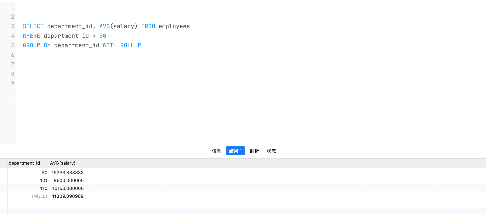

## 函数

### 函数概述

> 函数可以把我们经常使用的代码封装起来， 需要的时候直接调用即可。这样既 `提高了代码效率` ，又`提高了维护性`  。从函数的定义来说,我们可以将函数分为`内置函数` 与 `自定义函数`
>
> **在 SQL 中我们也可以使用函数 对检索出来的数据进行函数操作**

不同的DBMS之间的差异很大,这就导致了只有很少的函数是被DBMS同时支持的,比如大多数DBMS可以使用 `+` 来拼接字符串,但是在MySQL中只能使用 `concat()`函数进行拼接

### MySQL的内置函数分类

- MySQL提供了很多的内置函数,这些函数从**实现的功能角度来说分为：**

  - `数值函数`

  - `字符串函数`

  - `日期时间函数`
  - `流程控制函数`
  - `加密、解密函数`
  - `获取MySQL信息函数`
  - `聚合函数`
  - …

- 或者也可以将函数分为两类: 
  - `单行函数`
    - 操作数据对象
    - 接受参数返回一个结果
    - **只对一行进行变换 **
    - **每行返回一个结果** 
    - 可以嵌套
    - 参数可以是一列或一个值
  - `聚合函数(或分组函数)`

### 数值函数

**常见的数值函数**

| 函数                    | 用法                                                         |
| ----------------------- | ------------------------------------------------------------ |
| `ABS(n)`                | 返回n的绝对值                                                |
| `SIGN(n)`               | 返回n的符号。正数返回1，负数返回-1,0返回0                    |
| `PI()`                  | 返回圆周率                                                   |
| `CEIL(n)、CEILING(n)`   | 返回大于或者等于n的最小整数                                  |
| `FLOOR(n)`              | 返回小于或者等于某个n的最大整数                              |
| `LEAST(n1,n2,n3...)`    | 返回列表中的最小值                                           |
| `GREATEST(n1,n2,n3...)` | 返回列表中的最大值                                           |
| `MOD(x,y)`              | 返回X除以Y后的余数                                           |
| `RAND()`                | 返回0~1的随机值                                              |
| `RAND(n)`               | 返回0~1的随机值，其中n的值用作种子值，相同的n值会产生相同的随机数 |
| `ROUND(x,y)`            | 返回一个对x的值进行四舍五入后最接近X的值，并保留到小数点后面Y位 |
| `ROUND(x)`              | 返回一个对x的值进行四舍五入后的整数                          |
| `TRUNCATE(x,y)`         | 返回数字x截断为y位小数的结果                                 |
| `SQRT(x)`               | 返回x的平方根。当X的值为负数时，返回NULL                     |


### 字符串函数

:::caution MySQL字符串注意点

MySQL中，字符串的位置是从1开始的。

::: 

| 函数                                | 用法                                                         |
| ----------------------------------- | ------------------------------------------------------------ |
| `ASCII(str)`                        | 返回str第一个字符的ASCII码值                                 |
| `CHAR_LENGTH(str)`                  | 返回str 的字符数                                             |
| `LENGTH(str)`                       | 返回字符串s的字节数，和字符集有关(**UTF字符集中 1个中文3个字节**) |
| `CONCAT(s1,s2...)`                  | 拼接字符串                                                   |
| `CONCAT_WS(str, s1,s2,...)`         | 同CONCAT(s1,s2,...)函数，但是每个字符串之间要加上x           |
| `INSERT(str, idx, len, replacestr)` | 将字符串str从第idx位置开始，len个字符长的子串替换为字符串replacestr |
| `REPLACE(str, a, b)`                | 将str中所有出现的a替换为b                                    |
| `UPPER(s) 或 UCASE(s)`              | 将字符串s的所有字母转成大写字母                              |
| `LOWER(s) 或LCASE(s)`               | 将字符串s的所有字母转成小写字母                              |
| `LEFT(str,n)`                       | 返回字符串str最左边的n个字符                                 |
| `RIGHT(str,n)`                      | 返回字符串str最右边的n个字符                                 |
| `LPAD(str, len, pad)`               | 用字符串pad对str最左边进行填充，直到str的长度为len个字符     |
| `RPAD(str ,len, pad)`               | 用字符串pad对str最右边进行填充，直到str的长度为len个字符     |
| `LTRIM(s)`                          | 去掉字符串s左侧的空格                                        |
| `RTRIM(s)`                          | 去掉字符串s右侧的空格                                        |
| `TRIM(s)`                           | 去掉字符串s开始与结尾的空格                                  |
| `TRIM(s1 FROM s)`                   | 去掉字符串s开始与结尾的s1                                    |
| `TRIM(LEADING s1 FROM s)`           | 去掉字符串s开始处的s1                                        |
| `TRIM(TRAILING s1 FROM s)`          | 去掉字符串s结尾处的s1                                        |
| `REPEAT(str, n)`                    | 返回str重复n次的结果                                         |
| `SPACE(n)`                          | 返回n个空格                                                  |
| `STRCMP(s1,s2)`                     | 比较字符串s1,s2的ASCII码值的大小                             |
| `SUBSTR(s,index,len)`               | 返回从字符串s的index位置其len个字符，作用与SUBSTRING(s,n,len)、 MID(s,n,len)相同 |
| `LOCATE(substr,str)`                | 返回指定位置的字符串<br />如果m=1，则返回s1，<br />如果m=2，则返回s2，<br />如 果m=n，则返回sn |
| `FIELD(s,s1,s2,...,sn)`             | 返回字符串s在字符串列表中第一次出现的位置                    |
| `FIND_IN_SET(s1,s2)`                | 返回字符串s1在字符串s2中出现的位置。其中，字符串s2是一个以逗号分 隔的字符串 |
| `REVERSE(s)`                        | 返回s反转后的字符串                                          |
| `NULLIF(value1,value2)`             | 比较两个字符串，如果value1与value2相等，则返回NULL，否则返回 |


### 日期时间函数

#### 获取日期、时间

| 函数                                                         | 用法                            |
| ------------------------------------------------------------ | ------------------------------- |
| `CURDATE()、CURRENT_DATE()`                                  | 返回当前日期，只包含年、 月、日 |
| `CURTIME()、 CURRENT_TIME()`                                 | 返回当前时间，只包含时、 分、秒 |
| `NOW()、SYSDATE()、CURRENT_TIMESTAMP()、LOCALTIME()、LOCALTIMESTAMP()` | 返回当前系统日期和时间          |
| `UTC_DATE()`                                                 | 返回UTC(世界标准时间) **日期**  |
| `UTC_TIME()`                                                 | 返回UTC(世界标准时间) **时间**  |


:::info 获取日期、时间

```sql
-- 通过加0 的方式将时间转为了数字
-- 东八区实际时间比 UTC_TIME() 多8h
SELECT CURDATE(),CURTIME(),NOW(),SYSDATE()+0,UTC_DATE(),UTC_DATE()+0,UTC_TIME(),UTC_TIME()+0 FROM DUAL;
```


:::

#### 日期与时间戳转换

| 函数                       | 用法                                                         |
| -------------------------- | ------------------------------------------------------------ |
| `UNIX_TIMESTAMP()`         | 以UNIX时间戳的形式返回当前时间。SELECT UNIX_TIMESTAMP() - >1634348884 |
| `UNIX_TIMESTAMP(date)`     | 将时间date以UNIX时间戳的形式返回。                           |
| `FROM_UNIXTIME(timestamp)` | 将UNIX时间戳的时间转换为普通格式的时间                       |


####  获取月份、星期、天数等

| 函数                                       | 用法                                            |
| ------------------------------------------ | ----------------------------------------------- |
| `YEAR(date) / MONTH(date) / DAY(date)`     | 返回具体的日期值                                |
| `HOUR(time) / MINUTE(time) / SECOND(time)` | 返回具体的时间值                                |
| `MONTHNAME(date)`                          | 返回月份名称:January，...                       |
| `DAYNAME(date)`                            | 返回星期几名称:MONDAY，TUESDAY.....SUNDAY       |
| `WEEKDAY(date)`                            | 返回周几，注意，周1是0，周2是1，。。。周日是6   |
| `QUARTER(date)`                            | 返回日期对应的季度，范围为1~4                   |
| `WEEKOFYEAR(date) `                        | 返回一年中的第几周                              |
| `DAYOFYEAR(date)`                          | 返回日期是一年中的第几天                        |
| `DAYOFMONTH(date)`                         | 返回日期位于所在月份的第几天                    |
| `DAYOFWEEK(date)`                          | 返回周几，注意:周日是1，周一是2，。。。周六是 7 |

:::info 获取月份、星期等

```sql
/*
	获取月份/天数/星期
*/
Select CURRENT_TIME(), YEAR(CURRENT_TIME()),WEEKOFYEAR(CURRENT_DATE()),DAYOFYEAR(CURRENT_DATE())
```


:::

#### 操作日期

- `EXTRACT(type FROM date)`
  - 返回指定日期中特定的部分，type指定返回的值
  - **type取值及含义**
    - `MICROSECOND` : 返回毫秒数
    - `SECOND` ：返回秒数
    - `MINUTE` ：返回分钟数
    - `HOUR` : 返回小时数
    - `DAY` : 返回天数
    - `WEEK` : 返回一年的第几周
    - `MONTH` :  返回月份
    - `QUARTER` : 返回第几个季度
    - `YEAR` : 返回年份
    - `SECOND_MICROSECOND` ： 返回秒+毫秒值
    - `MINUTE_MICROSECOND` :  返回分钟+毫秒值
    - `MINUTE_SECOND` : 返回分钟+秒值
    - `HOUR_MICROSECOND` : 返回小时+毫秒值
    - `HOUR_SECOND` : 返回小时+秒值
    - `HOUR_MINUTE` : 返回小时+分钟值
    - `DAY_MICROSECOND` : 返回天+毫秒值
    - `DAY_SECOND` : 返回天+秒值
    - `DAY_MINUTE` : 返回天+分钟值
    - `DAT_HOUR` : 返回天+小时
    - `YEAR_MONTH` ： 返回年+月

:::info 操作日期

```sql
Select 
	EXTRACT( YEAR from NOW())  "年",
	EXTRACT( MONTH from NOW()) "月",
	EXTRACT( DAY from NOW()) "日",
	EXTRACT( WEEK from NOW()) "周",
	EXTRACT( QUARTER from NOW()) "季度",
	EXTRACT( YEAR_MONTH from NOW()) "年月",
	EXTRACT( DAY_HOUR from NOW()) "天小时"
```


:::

#### 时间与秒钟转换

| 函数                   | 用法                                          |
| ---------------------- | --------------------------------------------- |
| `TIME_TO_SEC(time)`    | 将 time 转化为秒并返回结果值                  |
| `SEC_TO_TIME(seconds)` | 将 seconds 描述转化为包含小时、分钟和秒的时间 |


#### 计算日期和时间①

| 函数                                     |                                                         |
| ---------------------------------------- | ------------------------------------------------------- |
| `DATE_ADD(datetime, INTERVAL 数值 type)` | 返回给定datetime **加上** 指定INTERVAL时 间段的日期时间 |
| `DATE_SUB(datetime,INTERVAL 数值 type)`  | 返回给定datetime **减去** 指定INTERVAL时 间段的日期时间 |

上述的`type`可以有以下的取值：

1. `HOUR` : 小时
2. `MINUTE` : 分
3. `SECOND` : 秒
4. `YEAR` : 年
5. `MONTH` : 月
6. `DAY` : 日
7. `YEAR_MONTH` : 年+月
8. `DAY_HOUR` : 天+小时
9. `DAY_MINUTE` : 天+分
10. `DAY_SECOND` : 天+秒
11. `HOUR_MINUTE` : 小时+分
12. ` MINUTE_SECOND` : 小时+秒

#### 计算日期和时间②

> time的字符串格式 就是 `'时：分：秒'`

| 函数                           | 用法                                                         |
| ------------------------------ | ------------------------------------------------------------ |
| `ADDTIME(time1,time2)`         | 返回time1加上time2的时间。<br />当time2为一个数字时，代表的是 秒 ，可以为负数 |
| `SUBTIME(time1,time2)`         | 返回time1减去time2后的时间。<br />当time2为一个数字时，代表的 是 秒 ，可以为负数 |
| `DATEDIFF(date1,date2)`        | 返回date1 - date2的日期间隔天数                              |
| `TIMEDIFF(time1, time2)`       | 返回time1 - time2的时间间隔                                  |
| `FROM_DAYS(N)`                 | 返回从0000年1月1日起，N天以后的日期                          |
| `TO_DAYS(date)`                | 返回日期date距离0000年1月1日的天数                           |
| `LAST_DAY(date)`               | 返回date所在月份的最后一天的日期                             |
| `MAKEDATE(year,n)`             | 针对给定年份与所在年份中的天数返回一个日期                   |
| `MAKETIME(hour,minute,second)` | 将给定的小时、分钟和秒组合成时间并返回                       |


:::info 计算日期和时间

```sql
SELECT
		ADDTIME(NOW(),20),
		SUBTIME(NOW(),30),
		SUBTIME(NOW(),'1:1:3'),
		DATEDIFF(NOW(),'2021-10-01'),
		TIMEDIFF(NOW(),'2021-10-25 22:10:10'),
		FROM_DAYS(366),TO_DAYS('0000-12-25'), 
		LAST_DAY(NOW()),
		MAKEDATE(YEAR(NOW()),12),
		MAKETIME(10,21,23)
FROM DUAL;	
```


:::

#### 日期格式化与解析

| 函数                                | 用法                                       |
| ----------------------------------- | ------------------------------------------ |
| `DATE_FORMAT(date,fmt)`             | 按照字符串fmt格式化日期date值              |
| `TIME_FORMAT(time,fmt)`             | 按照字符串fmt格式化时间time值              |
| `GET_FORMAT(date_type,format_type)` | 返回日期字符串的显示格式                   |
| `STR_TO_DATE(str, fmt)`             | 按照字符串fmt对str进行解析，解析为一个日期 |

上述的`fmt`可以有以下的取值：

1. `%Y` : 4位数字表示年份
2. `%y` : 2位数字表示年份
3. `%M` : 月名表示月份(January,....)
4. `%m` : 2位数字表示月份(01,02,03….)
5. `%c` : 数字表示月份(1,2,3,...)
6. `%D` : 英文后缀表示月中的天数(1st,2nd,3rd,...)
7. `%d` : 2位数字表示月中的天数(01,02...)
8. `%e` :  数字形式表示月中的天数 (1,2,3,4,5.....)
9. ….

### 流程控制函数

> 流程处理函数可以根据不同的条件，执行不同的处理流程，可以在SQL语句中实现不同的条件选择。
>
> MySQL中的流程处理函数主要包括IF()、IFNULL()和CASE()函数

| 函数                                                         | 用法                                             |
| ------------------------------------------------------------ | ------------------------------------------------ |
| `IF(value,value1,value2)`                                    | 如果value的值为TRUE，返回value1， 否则返回value2 |
| `IFNULL(value1, value2)`                                     | 如果value1不为NULL，返回value1，否 则返回value2  |
| `CASE WHEN 条件1 THEN 结果1 WHEN 条件2 THEN 结果2 .... [ELSE resultn] END` | 相当于Java的if...else if...else...               |
| `CASE expr WHEN 常量值1 THEN 值1 WHEN 常量值1 THEN 值1 .... [ELSE 值n] END` | 相当于Java的switch...case...                     |


### MySQL信息

| 函数                                                    | 用法                                                         |
| ------------------------------------------------------- | ------------------------------------------------------------ |
| `VERSION()`                                             | 返回当前MySQL的版本号                                        |
| `CONNECTION_ID()`                                       | 返回当前MySQL服务器的连接数                                  |
| `DATABASE()、SCHEMA()`                                  | 返回MySQL命令行当前所在的数据库                              |
| `USER()、CURRENT_USER()、SYSTEM_USER()、SESSION_USER()` | 返回当前连接MySQL的用户名<br />返回结果格式为`主机名@用户名` |
| `CHARSET(value)`                                        | 返回字符串value自变量的字符集                                |
| `COLLATION(value)`                                      | 返回字符串value的比较规则                                    |

### 其他函数

> MySQL中有些函数无法对其进行具体的分类，但是这些函数在MySQL的开发和运维过程中也是不容忽视的。

| 函数                             | 用法                                                         |
| -------------------------------- | ------------------------------------------------------------ |
| `FORMAT(value,n)`                | 返回对数字value进行格式化后的结果数据。n表示 四舍五入 后保留 到小数点后n位 |
| `CONV(value,from,to)`            | 将value的值进行不同进制之间的转换                            |
| `INET_ATON(ipvalue)`             | 将以点分隔的IP地址转化为一个数字                             |
| `INET_NTOA(value)`               | 将数字形式的IP地址转化为以点分隔的IP地址                     |
| `BENCHMARK(n,expr)`              | 将表达式expr重复执行n次。用于测试MySQL处理expr表达式所耗费 的时间 |
| `CONVERT(value USING char_code)` | 将value所使用的字符编码修改为char_code                       |


## 聚合函数

- 聚合函数**作用于一组数据，并对一组数据返回一个值**。聚合函数有有以下的类型：
  - `AVG()`
  - `SUM()`
  - `MAX()`
  - `MIN()`
  - `COUNT()`

- **语法格式**

  ```sql
  Select [columns...], [group function(column)]
  FROM table
  [WHERE 判断条件]
  [GROUP BY 分组字段]
  [HAVING  分组条件]
  [ORDER BY 排序字段]
  ```

- **注意**

  - 聚合函数不能嵌套调用。比如不能出现类似“AVG(SUM(字段名称))”形式的调用

### AVG、SUM

- 可以对`数值型数据`使用AVG 和 SUM 函数
  - `AVG` : 返回一组数据的平均数
  - `SUM` : 返回一组数据的总和

- <mark>注意： AVG和SUM 都不会对NULL的数值进行处理，如果需要处理，自己使用IFNULL函数</mark> 

:::info AVG与SUM的使用

**求员工工资的平均数与总和**

```sql
Select AVG(emp.salary) "工资平均数",SUM(emp.salary) "工资总和"  from  employees emp
```


:::


### MAX、MIN

- 可以对`任意数据类型`的数据使用 MIN 和 MAX 函数
- `MIN` : 返回一组数据的最小值
- `MAX` : 返回一组数据的最大值

:::info

```sql
select min(emp.first_name)  "firstName最小值" , max(emp.salary) "最高工资" from employees  emp 
```


:::


### COUNT

> 1. **count(*)，count(1)，count(列名) 用哪一个？**
>    - 对于`MyISAM 引擎`的表是没有区别的，因为这种引擎内部有一计数器在维护着行数
>    - 对于使用`Innodb引擎`的表用 count(*),count(1)要去数一遍行数，复杂度是O(n)，但好于具体的 count(列名)
>
> 2. **能不能使用count(列名)替换count(*)?**
>
>    - <font color='red'>不要使用count(列名) 代替count(*)  </font>
>    
>      - count(*)是 SQL92 定义的标准统计行数的语法，跟数据库无关，跟 NULL 和非 NULL 无关
>    - <font color='red'>说明:count(*)会统计值为 NULL 的行，而 count(列名)不会统计此列为 NULL 值的行</font>

- `COUNT(*)`
  - 返回表中记录总数,适用于 `任意数据类型`
- `COUNT(expr)`
  - 返回 expr不为空的记录总数

:::info count(*)、count(1)、count(字段名)

```sql
select count(commission_pct) "排除列数据为空的",count(1) "总数据量",count(*) "总数据量" from  employees 
```


:::


## GROUP BY

### 基本使用

- 用于将数据按指定的字段进行分组,通过GROUP BY 可以将数据按指定的字段分为若干组,<mark>由于表中存在指定字段数据相同的情况，所以一组可能包含多条数据</mark>

- <mark>注意</mark> 

  - **分组前会依据该字段进行排序**
  - **一个组中如果包含多条数据，默认最后显示第一条的数据内容,如果select字段中包含聚合函数，会查询出满足聚合函数的结果**

- **基本规则**

  - `Select 列表中所有未包含在组函数中的字段列都应该包含在 GROUP BY子句中`

    ```sql
    -- 正确的
    SELECT department_id, AVG(salary) 
    FROM employees
    GROUP BY department_id ;
    
    -- 错误的,查询字段除了聚合函数中的列，其他必须放在GROUP BY中
    SELECT department_id,job_id, AVG(salary) 
    FROM employees
    GROUP BY department_id ;
    ```

  - `GROUP BY 子句中的字段列 不必包含在SELECT 列表中`

    ```sql
    SELECT AVG(salary) 
    FROM employees
    GROUP BY department_id ;
    ```

- 也可以在 **GROUP BY** 后面加上多个列名，对多个列进行分组

### WITH ROLLUP

- 在所有查询出的分组记录之后增加一条记录，该记录通过`对查询出的所有记录的进行聚合函数计算`得到
  - 这里查询出来的所有数据指的是 <mark>分组后所有组里面的所有数据</mark>
- 当使用ROLLUP时，不能同时使用ORDER BY子句进行结果排序，<font color='red'>即ROLLUP和ORDER BY是互相排斥 的</font>

:::info 使用 WITH ROLLUP

```sql
-- 对部门ID进行分组， AVG(salary) 对每一组的salary进行取平均值
-- 最后的 WITH ROLLUP 会插入一条数据，数据来源于分组前的且满足Where条件的一组数据
SELECT department_id, AVG(salary) FROM employees
WHERE department_id > 80
GROUP BY department_id WITH ROLLUP
```



::: 


## HAVING

### 基本使用(过滤分组)

- **使用原则**
  - `HAVING 必须和 GROUP BY一起使用` (行已经被GROUP BY分组)
  - `使用了聚合函数`
  - `满足HAVING子句中的条件的分组会被展示`(执行完GROUP BY 之后,再对数据进行HAVING 过滤)
- **非法使用聚合函数?**
  - <font color='red'>不能在 WHERE 子句中使用聚合函数</font>

:::info 使用GROUP BY 与HAVING

**案例: 查出每个部门中员工工资大于 1000的**

```sql
-- 对employees表按照部门进行分组后的数据重新进行过滤
select emp.department_id,emp.salary 
from employees emp
group by emp.department_id
having emp.salary>10000
```


:::

### WHERE与HAVING

> where 和 having 都可以对查询结果进行过滤,但是两者的区别很大

:::tip having 与 where 使用的区别

1. **WHERE 可以直接使用表中的字段作为过滤条件,但是不能对分组之后的数据使用计算函数进行过滤;HAVING必须和GROUP BY 一起使用,并且可以对分组之后的数据使用计算函数进行过滤**
   - 这个说明在需要对数据进行分组统计的时候, having 可以完成 where 不能完成的任务
   - 因为在查询语法结构中, where 在 group by 之前预先执行，所以无法对查询结果进行过滤，而 having 是在group by 之后的，所以可以对分组结果进行过滤。当然如果既有 where 也有 group by 的话,不满足where 条件的是不会出现在分组结果中的
2. **如果需要通过连接从关联表中获取需要的数据，WHERE 是先筛选后连接，而 HAVING 是先连接 后筛选**
   - 这个说明`在关联查询中，WHERE 比 HAVING 更高效`
   - WHERE 可以先筛选，用筛选后的较小数据集和关联表进行连接，这样占用的资源比较少，执行效率也比较高
   - HAVING 则需要先把结果集准备好，也就是用未被筛选的数据集进行关联，然后对这个大的数据集进行筛选，这样占用的资源就比较多，执行效率也较低

:::

**开发建议**: Where 和 having 不是互相排斥的，可以在一个查询里面同时使用 where 和 having。包含分组统计函数的条件用 having，普通条件用 Where。这样，我们就既利用了 where 条件的高效快速，又发挥了 having 可以使用包含分组统计函数的查询条件的优点。当数据量特别大的时候，运行效率会有很大的差别。


## SELECT执行过程

### 查询的结构

```sql
#方式1:
SELECT ...
FROM ...
WHERE 多表的连接条件 AND 不包含组函数的过滤条件 
GROUP BY ...  
HAVING 包含组函数的过滤条件 
ORDER BY ... ASC/DESC 
LIMIT ...

#方式2:
SELECT ...
FROM ... JOIN ... ON 多表的连接条件 JOIN ... ON ...
WHERE 不包含组函数的过滤条件 AND/OR 不包含组函数的过滤条件 
GROUP BY ...  
HAVING 包含组函数的过滤条件 
ORDER BY ... ASC/DESC 
LIMIT ....

/*
	其中:
	(1) from:从哪些表中筛选 
	(2) on:关联多表查询时，去除笛卡尔积 
	(3) where:从表中筛选的条件 
	(4) group by:分组依据 
	(5) having:在统计结果中再次筛选 
	(6) order by:排序 
	(7) limit:分页
*/
```


### SELECT 执行顺序

1. 关键字顺序
   - `SELECT -> FROM -> WHERE -> GROUP BY -> HAVING -> ORDER BY -> LIMIT`

2. SELECT 语句的执行顺序
   - `FROM -> ON -> (LEFT/RIGHT JOIN ) -> WHERE -> GROUP BY -> HAVING -> SELECT -> DISTINCT -> ORDER BY -> LIMIT`

下面的查询SQL语句关键字顺序与执行顺序如下:

```sql
SELECT DISTINCT player_id, player_name, count(*) as num # 顺序 5 
FROM player JOIN team ON player.team_id = team.team_id # 顺序 1 
WHERE height > 1.80 # 顺序 2
GROUP BY player.team_id # 顺序 3
HAVING num > 2 # 顺序 4 
ORDER BY num DESC # 顺序 6 
LIMIT 2 # 顺序 7
```

:::caution 注意

在 Select 语句执行这些步骤的时候，每个步骤都会产生一个`虚拟表` ，然后将这个虚拟表传入下一个步骤中作为输入

需要注意的是，这些步骤隐含在 SQL 的执行过程中，对于我们来说是不可见的

:::


### SQL 执行顺序详细

1. Select 是先执行 From 这一步的。在这个阶段，如果是多张表联查，还会经历下面的几个步骤:

   - 首先先通过 CROSS JOIN 求笛卡尔积，相当于得到虚拟表 `Vt1-1`

   - 通过 ON 进行筛选，在虚拟表 `Vt1-1` 的基础上进行筛选，得到虚拟表 `Vt1-2`

   - 添加外部行

     - **如果我们使用的是左连接、右链接或者全连接，就会涉及到外部行**

     - 也就是在虚拟表 `Vt1-2` 的基础上增加外部行，得到虚拟表 `Vt1-3`
2. 此时拿到了From后的查询数据表的原始数据,也就是最终的虚拟表`Vt1`,然后在此基础上执行 `WHERE` 过滤，这一步中会对 `Vt1` 的结果进行过滤,得到虚拟表`Vt2`
2. 然后进入 `GROOP BY`阶段,在这一阶段会对`Vt2`的数据进行分组，并且得到虚拟表`Vt3`
2. 然后进入 `HAVING` 阶段，在这一阶段会对`Vt3`分组后的数据进行过滤，并且得到虚拟表`Vt4`
5. 然后进入 `SELECT ` 阶段, 在这一阶段会查询出想要的字段，并且得到虚拟表`Vt5`
   - 如果查询的字段使用的聚合函数，并且是对分组后的数据使用,那么会对每一组中的数据使用聚合得到结果
6. 然后进入 `DISTINCT ` 阶段, 在这一阶段会过滤掉出重复的行，并且得到虚拟表`Vt6`
7. 然后进入 `ORDER By ` 阶段, 在这一阶段按照指定的字段进行排序，得到虚拟表 `Vt7` 
8. 最后进入 `LIMIT` 阶段，在这一阶段会取出执行行的记录，并且得到最终结果


