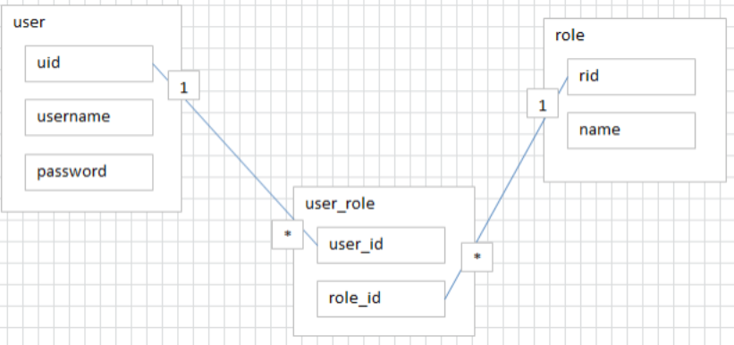
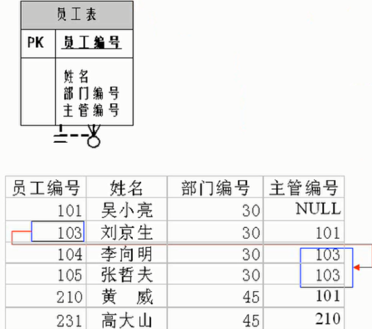
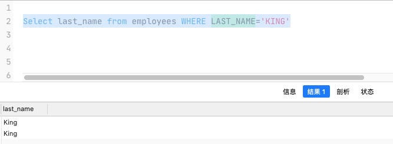
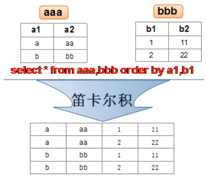
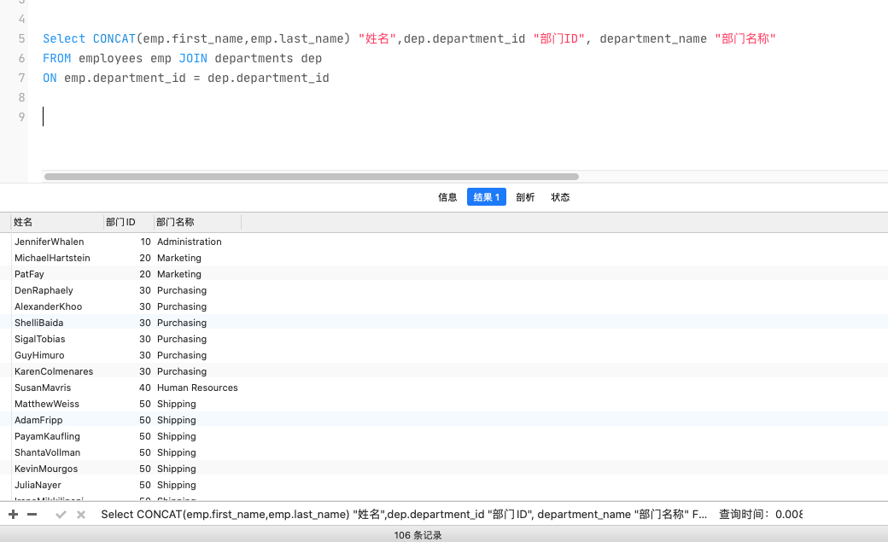
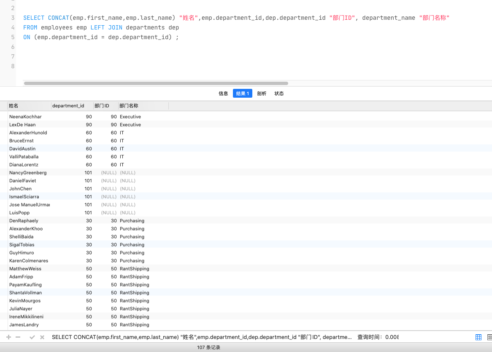
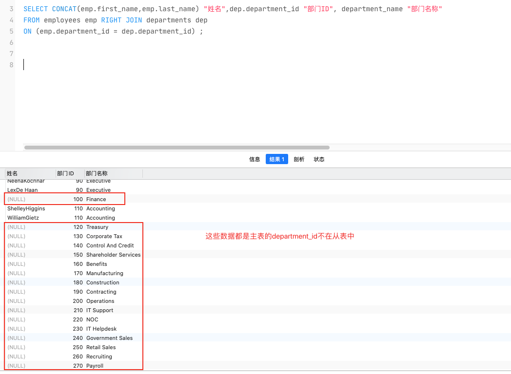
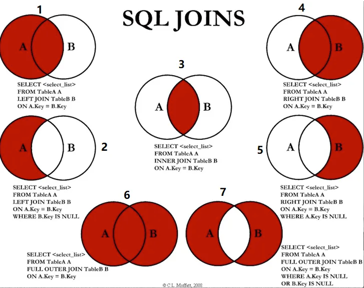
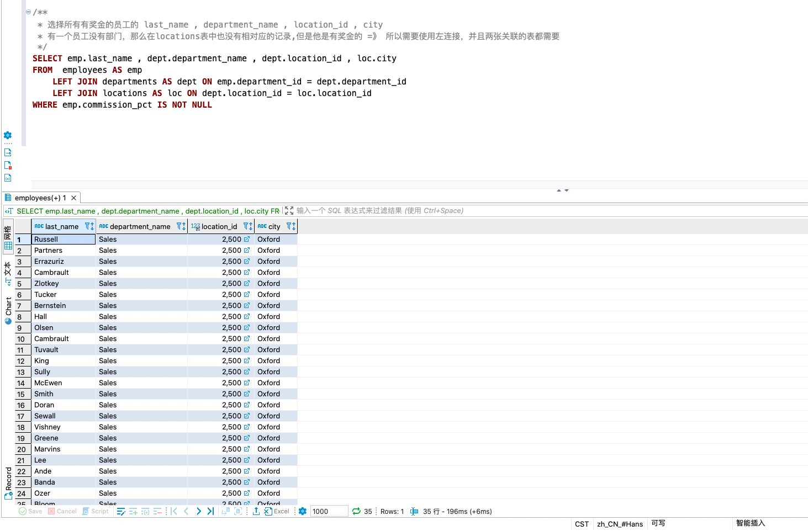

## 表的关联关系

- 表与表之间的数据记录有关系(relationship)。现实世界中的各种实体以及实体之间的各种联系均用关系模型来表示。

- 表的关联关系有四种:
  -  `一对一关联`
  - `一对多关联`
  - `多对多关联`
  - `自我引用`

### 一对一

- 在实际的开发中应用不多，**因为一对一可以创建成一张表**
- 两种建表原则:
  - `外键唯一`: 主表的主键和从表的外键(唯一)，形成主外键关系，外键唯一
  -  `外键是主键`: 主表的主键和从表的主键(主键必定是唯一)，形成主外键关系

### 一对多

- 常见实例场景: 客户表和订单表,分类表和商品表 ,部门表和员工表 
- 一对多建表原则:  <font color='red'>在从表(多方)创建一个字段，字段作为外键指向主表(一方)的主键</font>

### 多对多

- 要表示多对多关系，必须创建第三个表，该表通常称为 `联接表`
- 将多对多关系划分为两个一对多关系,将这两个表的主键都插入到第三个表中

**比如下面的用户权限表**



### 自我引用




## MySQL简单使用

[MariaDB源码位置](https://github.com/MariaDB/server)

:::tip MySQL的系统默认数据库

MySQL 安装完后有以下的几个默认的数据库:`information_schema`、`performance_schema`、`sys`、`mysql`

- **information_schema**
  - 主要保存 MySQL 数据库服务器的系统信息， 比如数据库的名称、数据表的名称、字段名称、存取权限、数据文件 所在的文件夹和系统使用的 文件夹…
- **performance_schema**
  - 可以用来监控 MySQL 的各类性能指标

- **sys**
  - 主要作用是以一种更容易被理解的方式展示 MySQL 数据库服务器的各类性能指标，帮助系统管理员和开发人员监控 MySQL 的技术性能

- **mysql**
  - 保存了 MySQL 数据库服务器运行时需要的系统信息，比如数据文件夹、当前使用的 字符集、约束检查信息…


:::

### 基础命令

1. 查看所有的数据库: `show databases;`
1. 创建自己的数据库: `create database 数据库名;`
1. 使用指定的数据库:  `use 数据库名;`
1. 查看数据库中所有的table:  `show tables from 数据库名;`
1. 创建新的table:  `create table 表名称(...)`
1. 查看表的创建信息:  `show create table 表名称\G`
1. 查看数据库的创建信息:  `show create database 数据库名\G`
1. 删除表\数据库:  `drop table|database 表名|数据库名`

```sql
mysql> show tables;
+---------------------+
| Tables_in_atguigudb |
+---------------------+
| countries           |
| departments         |
| emp_details_view    |
| employees           |
| job_grades          |
| job_history         |
| jobs                |
| locations           |
| order               |
| regions             |
+---------------------+
10 rows in set (0.00 sec)

mysql> show create table countries\G
*************************** 1. row ***************************
       Table: countries
Create Table: CREATE TABLE `countries` (
  `country_id` char(2) NOT NULL,
  `country_name` varchar(40) DEFAULT NULL,
  `region_id` int DEFAULT NULL,
  PRIMARY KEY (`country_id`),
  KEY `countr_reg_fk` (`region_id`),
  CONSTRAINT `countr_reg_fk` FOREIGN KEY (`region_id`) REFERENCES `regions` (`region_id`)
) ENGINE=InnoDB DEFAULT CHARSET=utf8mb3
1 row in set (0.00 sec)
```

### 字符集问题的处理

> 在MySQL5.7 的版本中存在着中文乱码的问题,默认的字符集是latin1。从MySQL 8.0 开始，数据库的默认编码改为 utf8mb4,避免了上述的乱码问题。

步骤1. 查看字符编码

```shell
show variables like 'character_%'; 
show variables like 'collation_%';
```

步骤2. 修改mysql的数据目录下的my.ini配置文件

  ```ini
    [mysql] #大概在63行左右，在其下添加
    ...
    default-character-set=utf8 #默认字符集
    [mysqld] # 大概在76行左右，在其下添加 ...
    character-set-server=utf8 
    collation-server=utf8_general_ci
  ```

步骤3. 重启MySQL服务

### MySQL目录结构(Win版本)

| MySQL目录                                   | 说明                                 |
| ------------------------------------------- | ------------------------------------ |
| bin                                         | 所有MySQL的可执行文件。如:mysql.exe  |
| MySQLInstanceConfig.exe                     | 数据库的配置向导，在安装时出现的内容 |
| data                                        | 系统数据库所在的目录                 |
| my.ini                                      | MySQL的主要配置文件                  |
| c:\ProgramData\MySQL\MySQL Server 8.0\data\ | 用户创建的数据库所在的目录           |

## SQL概述

### SQL分类

SQL语言在功能上主要分为如下3大类:

- `DDL(Data Definition Languages: 数据定义语言)`
  - 定义了不同的数据库、表、视图、索 引等数据库对象，还可以用来创建、删除、修改数据库和数据表的结构
  - 主要的语句关键字包括 `CREATE `、 `DROP` 、 `ALTER` …

- `DML(Data Manipulation Language: 数据操作语言)`
  - 用于添加、删除、更新和查询数据库记 录，并检查数据完整性。
  - 主要的语句关键字包括 `INSERT` 、 `DELETE` 、 `UPDATE` 、 `SELECT` …
  - **SELECT是SQL语言的基础，最为重要**
- `DCL(Data Control Language: 数据控制语言)`
  - 用于定义数据库、表、字段、用户的访问权限和 安全级别
  - 主要的语句关键字包括 `GRANT` 、 `REVOKE` 、 `COMMIT` 、 `ROLLBACK` 、 `SAVEPOINT` …

:::tip SQL分类冷知识

因为查询语句使用的非常的频繁，所以很多人把查询语句单拎出来一类:DQL(数据查询语言)。

还有单独将 COMMIT 、 ROLLBACK 取出来称为TCL (Transaction Control Language: 事务控制语言)。

:::

### SQL规则

1. SQL大小写规范

   - MySQL 在 Windows 环境下是大小写不敏感的 -> MySQL数据不区分大小写

   - MySQL 在 Linux 环境下是大小写敏感的
     - 数据库名、表名、表的别名、变量名是严格区分大小写的
     - 关键字、函数名、列名(或字段名)、列的别名(字段的别名) 是忽略大小写的
   - **推荐采用统一的书写规范**
     - 数据库名、表名、表别名、字段名、字段别名等都小写
     - SQL 关键字、函数名、绑定变量等都大写
2. 命名规则

   - 数据库、表名不得超过30个字符，变量名限制为29个
   - 必须只能包含 A–Z, a–z, 0–9, _共63个字符
   - 数据库名、表名、字段名等对象名中间不要包含空格
   - 必须保证你的字段没有和保留字、数据库系统或常用方法冲突。如果坚持使用，请在SQL语句中使 用`(着重号)引起来

3. 数据导入指令
   - `source d:\mysqldb.sql`

:::tip 提示

MySQL的数据window下不区分大小写：



:::

## 基本 Select 语句

- 查询所有、指定列的数据
  - `Select * | 查询的列 from 数据表名`
  
- 去除重复行
  - `Select distinct 列名 from 数据表名`
  - <mark>distinct 有下面几点需要注意</mark>

    1. **distinct 需要放到所有列名的前面**, 比如写成 *select salary, distinct id  from emp* 会报错
    2. **distinct  其实是对后面所有列名的组合进行去重**
  
- 着重号(**`**)

  - 我们需要保证表中的字段、表名等没有和保留字、数据库系统或常用方法冲突。如果真的相同，请在 SQL语句中使用一对``(着重号)引起来

  ```sql
  -- 错误的，因为 ORDER 是数据库的保留字
  SELECT * FROM ORDER;
  
  -- 正确的, 通过 使用一对着重符 ``避免报错
  SELECT * FROM `ORDER`;
  ```

- 显示表结构

  - `descripe| desc 数据表名`
  - 该 SQL 语句会返回以下的结构
    - `Field`
      - 表示字段名称
    - `Type`
      - 表示字段类型
    - `Null`
      - 表示该列是否可以存储 NULL 值
    - `Key`
      - 表示该列是否被索引
      - **PRI** 表示该列是表主键的一部分
      - **UNI** 表示该列是UNIQUE索引的一 部分
      - **MUL** 表示在列中某个给定值允许出现多次
    - `Default`
      - 表示该列是否有默认值，如果有，那么值是多少。
    - `Extra`
      - 表示可以获取的与给定列有关的附加信息，例如 AUTO_INCREMENT 等
  
- 空值参与运算
  - 所有运算符或列值遇到null值，运算的结果都为null

## 运算符

### 算术运算符

> 算术运算符主要用于数学运算，其可以连接运算符前后的两个数值或表达式，对数值或表达式进行运算

| 运算符 | 名称           | 示例         |
| ---- | -------------- | ----------- |
| +    | 加法运算符       | Select   A+B  |
| -    | 减法运算符       | Select   A-B  |
| *    | 乘法运算符       | Select   A*B  |
| /    | 除法运算符       | Select   A/B  |
| %    | 求模(求余)运算符  | Select   A%B  |

:::danger 运算符的注意点

1. 一个整数类型的值对整数进行加法和减法操作，结果还是一个整数;

2. 一个整数类型的值对浮点数进行加法和减法操作，结果是一个浮点数;

3. 加法和减法的优先级相同，进行先加后减操作与进行先减后加操作的结果是一样的;

4. 在MySQL中 **+ 只表示数值相加。如果遇到非数值类型，先尝试转成数值，如果转失败，就按0计算。**

   - MySQL 中字符串拼接要使用字符串函数CONCAT()实现

   ```sql
   -- 非数值用+相加，转换失败
   Select 'A' + 'B'；   -- 返回0
   
   -- 数值用+相加，转换成功
   Select '1' + '2'；   -- 返回3
   ```

:::

### 比较运算符

> 比较运算符用来对表达式左边的操作数和右边的操作数进行比较。
>
> **比较的结果为真则返回1，比较的结果 为假则返回0，其他情况则返回NULL**

| 运算符 | 名称           | 示例                                   |
| ------ | -------------- | -------------------------------------- |
| `=`    | 等于运算符     | Select  C from  table where  A=B       |
| `!=` | 不等于运算符   | Select  C from  table where  A!=B<br/> |
| `<`    | 小于运算符     | Select  C from  table where  A<B       |
| `<=`   | 小于等于运算符 | Select  C from  table where  A<=B      |
| `>`    | 大于运算符     | Select  C from  table where  A>B       |
| `>=`   | 大于等于运算符 | Select  C from  table where  A>=B      |

#### 等号运算符

- 等号运算符(=)判断等号两边的值、字符串或表达式是否相等，如果相等则返回1，不相等则返回0
- 在使用等号运算符时，遵循如下规则:
  - 如果等号两边的值、字符串或表达式都为字符串，则MySQL会按照字符串进行比较，其比较的是每个字符串中字符的ANSI编码是否相等
  - 如果等号两边的值都是整数，则MySQL会按照整数来比较两个值的大小
  - 如果等号两边的值一个是整数，另一个是字符串，则MySQL会将字符串转化为数字进行比较
  - 如果等号两边的值、字符串或表达式中有一个为NULL，则比较结果为NULL

```sql
mysql> Select '1'=1,'1a'=1,'a'=1,1=NULL,'NULL'=NULL;
+-------+--------+-------+--------+-------------+
| '1'=1 | '1a'=1 | 'a'=1 | 1=NULL | 'NULL'=NULL |
+-------+--------+-------+--------+-------------+
|     1 |      1 |     0 | NULL   | NULL        |
+-------+--------+-------+--------+-------------+
1 row in set (0.01 sec)
```

#### 非符号运算符

| 运算符              | 名称             | 作用                                                         | 示例                                         |
| ------------------- | ---------------- | ------------------------------------------------------------ | -------------------------------------------- |
| `is null`           | 为空运算符       | 判断值、字符串或表达式是否为空                               | Select B from table where A is null          |
| `is not null`       | 不为空运算符     | 判断值、字符串或表达式是否不为空                             | Select B from table where A is not null      |
| `least`             | 最小值运算符     | 在多个值中返回最小值                                         | Select B from table where A least(C,D)       |
| `greatest`          | 最大值运算符     | 在多个值中返回最大值                                         | Select B from table where A greatest(C,D)    |
| `between ...and...` | 两值之间运算符   | 判断一个值是否在两个值之间                                   | Select B from table where A between  C and D |
| `in`                | 属于运算符       | 判断一个值是否在列表中                                       | …                                            |
| `not in`            | 不属于运算符     | 判断一个值是否不在列表中                                     | …                                            |
| `like`              | 模糊匹配运算符   | 判断一个值是否符合模糊匹配规则<br/>**%**: 匹配0个或多个字符<br />**_**: 只能匹配一个字符 | Select B from table where A like C           |
| `regexp`            | 正则表达式运算符 | 判断一个值是否符合正则表达式的规则                           | Select B from table where A regexp C         |
| `rlike`             | 正则表达式运算符 | 判断一个值是否符合正则表达式的规则                           | Select B from table where A rlike C          |

#### 逻辑运算符

| 运算符    | 作用 | 示例           |
| --------- | ---- | -------------- |
| `NOT、!`  | 非   | Select not A   |
| `AND、&&` | 与   | Select A and B |
| `OR`      | 或   | Select A  OR B |
| `XOR`     | 异或 | Select A XOR B |

## 排序

- 使用 ORDER BY 子句排序
  - `DESC` ： 降序
  - `ASC`： 升序
- ORDER BY 子句在 SELECT 语句的结尾
- <mark>注意</mark>

  - 可以使用不在 SELECT 列表中的列排序
  - 如果对多列进行排序，但是有多条数据的第一列是相同的,那么就会按第二列的排序规则再次排序，也叫做多次排序。<font color='red'>但是如第一列数据中所有值都是唯一的、不同的，那么将不再对第二列进行排序</font>

```sql
SELECT last_name, department_id, salary 
FROM employees
ORDER BY department_id, salary DESC
```

## 分页

> 背景1:查询返回的记录太多了，查看起来很不方便，怎么样能够实现分页查询呢?
>
> 背景2:表里有 4 条数据，我们只想要显示第 2、3 条数据怎么办呢

所谓分页显示，就是将数据库中的结果集，一段一段显示出来需要的条件，MySQL 中使用 `LIMIT` 实现分页， 分页语句有下面的几个注意点:

1. **Limit 子句必须放在整个Select 语句的最后!**

2. **语句格式**：`LIMIT [位置偏移量,] 行数`
    - `位置偏移量`
      - 指示MySQL从哪一行开始显示，是一个可选参数
      - 如果不指定“位置偏移量”,将会从表中的第一条记录开始(第一条记录的位置偏移量是0,第二条记录的位置偏移量是 1，以此类推)
    - `行数`
      - 指示返回的记录条数

:::tip 分页公式
假设当前页为 n(n>=1),且每页的数据为 k
第 1 页的数据范围是: [0,k]
第 2 页的数据范围是: [k,2k]
第 3 页的数据范围是: [2k,3k]
      .
      .
      .
总的来说，分页公式可以总结为： `Limit (当前页数-1)*每页条数，每页条数`
:::

```sql
-- 查询前10条
Select * FROM employees LIMIT 0,10

-- 查询 11~15行
Select * FROM employees LIMIT 11,5
```

:::tip MySQL8.0 分页的新语法

MySQL 8.0中可以使用`LIMIT 3 OFFSET 4`，意思是获取从第5条记录开始后面的3条记录，和“LIMIT 4,3”返回的结果相同。

:::

## 多表查询

- 多表查询，也称为关联查询，指两个或更多个表一起完成查询操作
- `前提条件`: 这些一起查询的表之间是有关系的(一对一、一对多)，它们之间一定是有关联字段，这个 关联字段可能建立了外键，也可能没有建立外键。比如:员工表和部门表，这两个表依靠“部门编号”进行关联
- **为什么需要多表查询？**
  - 复杂的查询可能需要执行多次SQL语句才能实现,一次SQL请求需要一次网络请求,会导致效率很低

:::caution 为什么将数据都存入一个单表呢，查询简单

1. 会出现冗余,比如员工部门,可能多个员工都隶属于部门,如果将部门的所有信息都放在员工表中,那么员工表中就会出现大量的冗余字段
2. 查询效率低。查询数据时需要将数据从硬盘通过IO加载到内存,假设单表10个字段一次能加载1万条数据到内存,但是100个字段可能每次只能加载1千条，需要进行10次IO才能将数据加载到内存中,但是涉及到IO的速度都很慢

:::

### 笛卡尔积

> `笛卡尔乘积`是一个数学运算。假设我有两个集合 {X} 和{Y}，那么 {X} 和 {Y} 的笛卡尔积就是 {X} 和 {Y}的所有可能的组合，也就是第一个对象来自于 {X}，第二个对象来自于 {Y} 的所有可能。组合的个数即为两个集合中 元素个数 的乘积数。

在SQL92中，笛卡尔积也称为 `交叉连接` ，英文是 `CROSS JOIN` 。在 SQL99 中也是使用 CROSS JOIN 表示交叉连接。它的作用就是可以把任意表进行连接，即使这两张表不相关。



#### 笛卡尔积的问题

- 导致笛卡尔积错误的一些原因
  - 省略多个表的连接条件(或关联条件)
  - 连接条件(或关联条件)无效
  - 所有表中的所有行互相连接
- 为了避免笛卡尔积， 可以在 **通过 where 添加有效的连接条件**

```sql
-- 案例:查询员工的姓名及其部门名称
SELECT emp.last_name, dep.department_name
FROM employees emp, departments dep
WHERE emp.department_id = dep.department_id;
```

### 多表连接查询分类

连接join 就是从两个关系的笛卡儿积中选取属性间满足一定条件的数据集合，连接里面有两个最常见的连接：`等值连接、外连接`

#### 等值连接

- **通过在连接两张表的指定两个元素相等的条件过滤笛卡尔积的数据**

- 案例:  employees 表的 department_id 与 departments 中的department_id 属于主外键的关系

- <mark>拓展</mark>

  - `区分重复的列名`
  
    - 多个表中有相同列名时，必须在列名之前加上表名前缀
  
    ```sql
    SELECT employees.last_name, departments.department_name,employees.department_id 
    FROM employees, departments
    WHERE employees.department_id = departments.department_id;
    ```
  
  - `使用表的别名`
  
    - 使用别名可以简化查询。
    - 列名前使用表名前缀可以提高查询效率
    - **如果使用了表的别名，在查询字段中、过滤条件中就只能使用别名进行代替， 不能使用原有的表名，否则就会报错。**
  
    ```sql
    SELECT e.employee_id, e.last_name, e.department_id, d.department_id, d.location_id
    FROM employees e , departments d
    WHERE e.department_id = d.department_id;
    ```
  
  - `连接多个表的条件`
    - **连接 n个表,至少需要n-1个连接条件**, 比如连接三个表，至少需要两个连接条件

#### 非等值连接

- 相对于等值连接来说，**非等值连接在连接两张表的时候指定某个元素满足的范围的条件来过滤笛卡尔积的数据**

案例：employees 的 salary 在 job_grades 的 lowest_sal 和 highest_sal 之间，并且对应一个 grade_level

```sql
SELECT e.last_name, e.salary, j.grade_level
FROM employees e, job_grades j
WHERE e.salary BETWEEN j.lowest_sal AND j.highest_sal;
```

#### 自连接

- **表 A 和表 B 是同一张表,但是通过取别名的方式将表A和表B做笛卡尔积**

案例：employees中的employee_id  对应的manager_id 就是employee_id

```sql
-- a 和b 实际上都是  employees表，只不过是取了不同的别名
Select CONCAT(a.first_name,'-',a.last_name)
from employees a,employees b 
where a.employee_id = b.manager_id
```

#### 内连接与外连接

- `内连接`
  - 合并具有同一列的两个以上的表的行, **结果集是所有关联表中共有的数据**
- `外连接`
  - 外连接分为以下两种连接
    - `左外连接` ：连接条件中左边的表也称为 **主表** ，右边的表称为 **从表**
    - `右外连接` ：连接条件中右边的表也称为 **主表** ，左边的表称为 **从表**
  - 两个表在连接过程中除了返回满足连接条件的行以外，还返回左(或右)表中不满足条件的行
  - 当没有匹配的行时, 结果表中相应的列为空(NULL)。

### SQL99 实现多表查询

#### 基础语法

- 使用 JOIN...ON 子句创建连接的语法结构

  ```sql
  SELECT table1.column, table2.column,table3.column 
  FROM table1
    [INNER | LEFT | RIGHT] JOIN table2 ON (table1 和 table2 的连接条件)
    [INNER | LEFT | RIGHT] JOIN table3 ON (table2 和 table3 的连接条件)
  ```

- <mark>语法说明</mark>

  - `可以使用 ON 子句指定额外的连接条件`
  - 连接条件是与其它条件分开的
  - 关键字 `JOIN`、`INNER JOIN`、`CROSS JOIN` 的含义是一样的，都表示内连接

#### 内连接(INNER JOIN)的实现

- **语法格式**

  ```sql
  SELECT 字段列表
  FROM A表 [INNER | CROSS] JOIN B表 ON 关联条件
  WHERE 关联条件
  ...
  ```

:::info 查询employees 和departments表中 部门 Id 相同的数据

```sql
-- 内连接查询不会返回与查询条件不匹配的数据
Select CONCAT(emp.first_name,emp.last_name) "姓名",dep.department_id "部门ID", department_name "部门名称"
FROM employees emp JOIN departments dep
ON emp.department_id = dep.department_id
```



:::

#### 外连接的实现

> 外连接分为左(外)连接与右(外)连接

##### 左(外)连接

- `查询的时候通过左侧表的关联条件字段列A 去 右侧表的关联条件字段列 B 进行查询`

  - **如果字段列A 的数据存在于字段列B，那么正常显示**
  - **如果字段列A 的数据存不在于字段列B，那么从表的字段列B显示为NULL**

- **语法格式**

  ```sql
  -- 实现查询结果是A
  SELECT 字段列表
  FROM A表 LEFT[OUTER] JOIN B表 ON 关联条件
  WHERE 关联条件
  ...
  ```

:::info 案例 查询employees 和departments表中 部门Id相同的数据

**从测试数据可以看到:  案例中employees 存在department_id=NULL获取其他department_id不在 departments中的，但是由于左连接的性质，这条数据从表部分字段会以NULL的形式展示**

```sql
-- 如果与查询条件不匹配，则不会显示，left join左侧主表条件字段不在从表中，这条数据的从表的字段以NULL显示
SELECT CONCAT(emp.first_name,emp.last_name) "姓名",dep.department_id "部门ID", department_name "部门名称"
FROM employees emp LEFT JOIN departments dep
ON (emp.department_id = dep.department_id) ;
```



:::

##### 右(外)连接

- `查询的时候通过右侧表的关联条件字段列A 去 左侧表的关联条件字段列 B 进行查询`

  - **如果字段列A 的数据存在于字段列B，那么正常显示**
  - **如果字段列A 的数据存不在于字段列B，那么从表的字段列B显示为NULL**

- **语法格式**

  ```sql
  -- 实现查询结果是B
  SELECT 字段列表
  FROM A表 RIGHT[OUTER] JOIN B表 ON 关联条件
  WHERE 关联条件
  ...
  ```

:::info**案例:** 查询employees 和departments表中 部门Id相同的数据

**从测试数据可以看到: departments中从120开始的department_idb在employees中找不到，按照右连接的性质，这条数据从表部分字段会以NULL的形式展示**

```sql
-- 如果与查询条件不匹配，则不会显示，但是right join右侧主表条件字段不在从表中，这条数据的从表的字段以NULL显示
SELECT CONCAT(emp.first_name,emp.last_name) "姓名",dep.department_id "部门ID", department_name "部门名称"
FROM employees emp RIGHT JOIN departments dep
ON (emp.department_id = dep.department_id) ;
```



:::

##### 满外连接

- `满外连接的结果 = 左右表匹配的数据 + 左表没有匹配到的数据 + 右表没有匹配到的数据`
- SQL99是支持满外连接的。使用 `FULL[OUTER] JOIN` 来实现
- MySQL不支持FULL JOIN，**但是可以用  Left Join Union Right Join代替**

#### UNION

- `UNOIN` 可以用于<mark>合并查询结果</mark>,将多条SELECT语句的结果组合成单个结果集

  - 合并结果集时，两个表对应的列数和数据类型必须相同，并且相互对应

  - 各个SELECT语句之间使用`UNION`或`UNION ALL`关键字分隔

- **语法格式**

  ```sql
  SELECT column,... FROM table1 
  UNION [ALL]
  SELECT column,... FROM table2
  ```

- **UNION 和UNION ALL 区别?**
  - `UNION`:   返回两个查询的结果集的并集，*去除两个结果集的重复记录*
  - `UNION ALL`： 返回两个查询的结果集的并集。*不会去除两个结果集的重复记录*
- **注意点**
  - <font color='red'>执行UNION ALL 语句时所需要的资源比 UNION 语句少</font>
  - 如果明确知道合并数据后的结果数据 不存在重复数据，或者不需要去除重复的数据，则尽量使用 UNION  ALL 语句，以提高数据查询的效 率。

:::info 案例

**case1: 查询部门编号>90或邮箱包含a的员工信息**

```sql
-- 两个Select 语句出来的结果可能存在重复的数据，需要使用UNION去除重复的数据
#方式1
SELECT * FROM employees WHERE email LIKE '%a%' OR department_id>90;

#方式2
SELECT * FROM employees WHERE email LIKE '%a%' 
UNION
SELECT * FROM employees WHERE department_id>90;
```

**case2: 查询中国用户中男性的信息以及美国用户中年男性的用户信息**

```sql
-- 由于两个Select 语句查询出来的结果是不可能重复的，所以不需要过滤重复数据=>使用UNION ALL
SELECT id,cname FROM t_chinamale WHERE csex='男' 
UNION ALL
SELECT id,tname FROM t_usmale WHERE tGender='male';
```

:::

### 七种JOIN理论

- `内连接 `

  - 两表共有部分  【图中3】

  ```sql
  SELECT e.employee_id,e.last_name,d.department_name 
  FROM employees emp JOIN departments d ON e.department_id = d.department_id;
  ```
  
  
  
- `左外连接`

  - 左表的全部，右表不满足补NULL 【图中1】

  ```sql
  SELECT e.employee_id,e.last_name,d.department_name 
  FROM employees e LEFT JOIN departments d ON e.department_id = d.department_id;
  ```

- `右外连接`

  - 右表的全部，左表不满足的补NULL 【图中4】

  ```sql
  SELECT e.employee_id,e.last_name,d.department_name 
  FROM employees e RIGHT JOIN departments d ON e.department_id = d.department_id;
  ```

- `特殊左连接`

  - 显示为左表的独有的数据 【图中2】

  ```sql
  SELECT e.employee_id,e.last_name,d.department_name 
  FROM employees e LEFT JOIN departments d ON e.department_id = d.department_id;
  WHERE d.department_id IS NULL
  ```
  
- `特殊的右连接`

  - 显示为右表的独有的数据【图中5】

  ```sql
  SELECT e.employee_id,e.last_name,d.department_name 
  FROM employees e RIGHT JOIN departments d ON e.department_id = d.department_id;
  WHERE e.department_id IS NULL
  ```
  
- `全连接`

  - 显示全部数据 【图中6】
  - `mysql 不支持 full outer join`
  
  ```sql
  -- 第一个Select语句查询出左侧独有的数据
  -- 第二个Select语句是右连接的数据
  -- 采用这种方式不需要使用UNION 对中间数据进行去重,效率更高
  SELECT e.employee_id,e.last_name,d.department_name
  FROM employees e LEFT JOIN departments d ON e.department_id = d.department_id
  WHERE d.department_id IS NULL
  UNION ALL
  SELECT e.employee_id,e.last_name,d.department_name
  FROM employees RIGHT JOIN departments d ON e.department_id = d.department_id
  ```
  
- `特殊的全连接`

  - 只显示两表独有的数据 【图中7】

  ```sql
  SELECT e.employee_id,e.last_name,d.department_name
  FROM employees e LEFT JOIN departments d ON e.department_id = d.department_id
  WHERE d.department_id IS NULL
  UNION ALL
  SELECT e.employee_id,e.last_name,d.department_name
  FROM employees e RIGHT JOIN departments d ON e.department_id = d.department_id
  WHERE e.department_id IS NULL
  ```
  
  




### SQL99语法新特性

#### 自然连接

- `NATURAL JOIN`

  - 可以把自然连接理解为 SQL92 中的`等值连接`，它会帮你**自动查询两张连接表中 所有相同的字段 ，然后进行 等值连接 **

  ```sql
  -- SQL92中的写法
  SELECT e.employee_id,e.last_name,d.department_name 
  FROM employees e 
  JOIN departments d ON e.department_id = d.department_idAND e.manager_id = d.manager_id;
  
  -- SQL99的写法
  SELECT employee_id,last_name,department_name 
  FROM employees e 
  NATURAL JOIN departments d;
  ```

#### USING连接

- `USING`

  - `指定数据表里的 同名字段 进行等值连接`，**但是只能配合JOIN一起使用**
  - 与自然连接 NATURAL JOIN 不同的是，USING 指定了具体的相同的字段名称，需要在 USING 的括号()中填入要指定的同名字段

  ```sql
  -- 使用USING连接
  SELECT employee_id,last_name,department_name 
  FROM employees e 
  JOIN departments d USING (department_id);
  
  -- 与之等效的SQL
  SELECT employee_id,last_name,department_name 
  FROM employees e, departments d
  WHERE e.department_id = d.department_id;
  ```


## 总结

表连接的约束条件可以有三种方式: **WHERE, ON, USING**

- `WHERE` 
  - 适用于所有关联查询

- `ON`
  -  只能和 JOIN 一起使用，只能写关联条件。
  - 虽然关联条件可以并到 WHERE 中和其他条件一起写，但分开写可读性更好

- `USING`
  - 只能和 JOIN 一起使用，而且要求 **两个** 关联字段在关联表中名称一致，而且只能表示关联字段值相等


:::danger  注意

- `需要控制连接表的数量 `
  - 多表连接就相当于嵌套 for 循环一样，非常消耗资源，会让 SQL 查询性能下 降得很严重因此不要连接不必要的表
  - 在许多 DBMS 中，也都会有最大连接表的限制

- 阿里开发规约:
  - 【强制】超过三个表禁止 join。需要 join 的字段，数据类型保持绝对一致;多表关联查询时,保证被关联的字段需要有索引
  - 即使双表 join 也要注意表索引、SQL 性能

:::


## 练习

**1. 选择所有有奖金的员工的 last_name , department_name , location_id , city** 

```sql
/**
 * 选择所有有奖金的员工的 last_name , department_name , location_id , city
 * 有一个员工没有部门，那么在locations表中也没有相对应的记录,但是他是有奖金的
 * 			-> 所以需要使用左连接，并且两张关联的表都需要
 */
SELECT emp.last_name , dept.department_name , dept.location_id , loc.city
FROM  employees AS emp 
	LEFT JOIN departments AS dept ON emp.department_id = dept.department_id 
	LEFT JOIN locations AS loc ON dept.location_id = loc.location_id 
WHERE emp.commission_pct IS NOT NULL 

```




**2.查询哪些部门没有员工**

```sql

/**
 * 查询哪些部门没有员工
 * 
 */
SELECT d.*
FROM departments AS d 
	LEFT JOIN employees AS e ON d.department_id =e.department_id 
WHERE  e.department_id IS NULL 

/*
 *  子查询的方式
 *  解析： e.department_id = d.department_id 的条件是说明这个部门有员工，NOT EXISTS就是把满足条件的从结果集剔除
 */
 SELECT department_id 
 FROM  departments AS d 
 WHERE  NOT EXISTS (
   SELECT * 
   FROM employees AS e 
   WHERE e.department_id = d.department_id
 )
```

