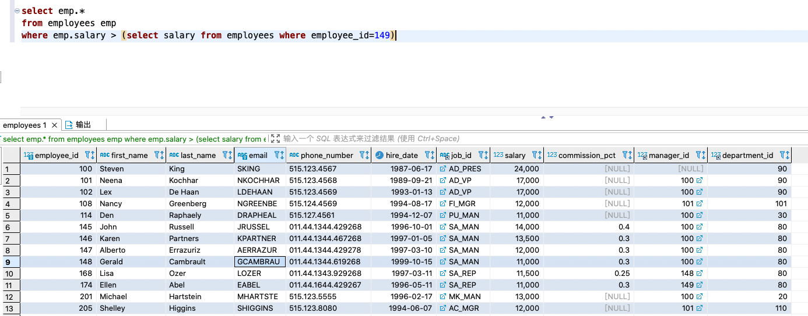
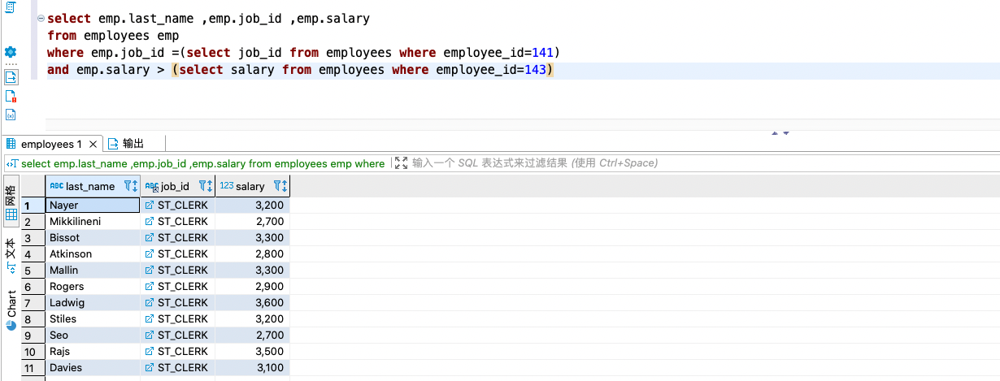

> 子查询是指一个查询语句嵌套在另一个查询语句的内部的查询,这个特性从 MySQL4.1 开始引入,也叫做`内查询`
>
> SQL子查询大大的增强了SELECT查询的能力,因为很多时候查询需要从结果集中获取数据，或者需要从同一个表中先计算得出一个数据结果，然后与这个数据结果(可能是某个标量，也可能是某个集合)进行比较

## 引入

问题: employees中谁的工资比Abel高?

:::info 解决方案

**1.分两次查询(思路最简单),先查询出Abel的工资，再查询比Abel的工资高的**

```sql
-- 查询Abel的工资
SELECT salary
FROM employees
WHERE last_name = 'Abel';  -- 得到结果是11000
-- 查询工资大于11000的
SELECT last_name,salary FROM employees
WHERE salary > 11000;
```

**2.使用自连接**

```sql
-- 使用自连接
select emp2.* 
from  employees emp1 , employees  emp2 
where emp1.last_name ='Abel' and emp2.salary > emp1.salary 
```

**3.使用子查询(将两次查询合并为一次)**

```sql
 select * 
 from  employees  
 where salary  > (select  salary from employees  where last_name ='Abel')
```

:::

## 子查询的基本使用

- **WHERE型子查询的基本语法结构**

  ```sql
  SELECT  查询字段
  FROM	  查询的表
  WHERE   比较字段  操作符(>、=、!=...) (SELECT 语句)   
  ```

- **说明**
  
  - `子查询(内查询)在主查询之前执行完成`
  - 子查询的结果被主查询使用
  - 子查询要包含在括号内

## 子查询的分类(按返回结果数)

**按内查询的结果返回一条还是多条记录,将子查询分为：**

1. `单行子查询`
2. `多行子查询`

### 单行子查询

#### 单行比较操作符

| 操作符 | 含义                     |
| ------ | ------------------------ |
| `=`    | equal to                 |
| `>`    | greater than             |
| `>=`   | greater than or equal to |
| `<`    | less than                |
| `<=`   | less than or equal to    |
| `<>`   | less than or equal to    |

:::info 查询示例

**1. 查询工资大于149号员工工资的员工的信息**

   ```sql
   select emp.*
   from employees emp
   where emp.salary > (select salary from employees where employee_id=149)
   ```

 

<br/>

**2.返回job_id与141号员工相同，salary比143号员工多的员工姓名，job_id和工资**

   ```sql
   select emp.last_name ,emp.job_id ,emp.salary 
   from employees emp
   where emp.job_id =(select job_id from employees where employee_id=141)
   and emp.salary > (select salary from employees where employee_id=143)
   ```

   

<br/>

**3.返回公司工资最少的员工的last_name,job_id和salary**

   ```sql
   select last_name, job_id, salary
   from employees  
   where salary =(select min(salary) from employees)
   ```

<br/>

**4.查询与141号或174号员工的manager_id和department_id相同的其他员工的employee_id， manager_id，department_id**

   - <font color='red'><strong>合并时 where 条件字段与子查询返回的字段必须是一一对应的</strong></font>

   ```sql
   -- 将查询条件manager_id、department_id拆分为两个条件
   select employee_id, manager_id,department_id
   from employees 
   where manager_id in (select manager_id from employees where employee_id in(141,174))
   and  department_id in (select department_id from employees where employee_id in(141,174))
   and employee_id not in(141,174)
   
   -- 将查询条件manager_id、department_id合并为两个条件
   select employee_id, manager_id,department_id
   from employees 
   where (manager_id, department_id) in (select manager_id,department_id from employees where employee_id in(141,174))
   and employee_id not in(141,174)
   ```

:::

####  HAVING 中的子查询

- **执行顺序**
  1. 执行子查询
  2. 向主查询中的HAVING 子句返回结果

**案例：查询最低工资大于50号部门最低工资的部门id和其最低工资** 

```sql
/*
	解析: 
		1. 最低工资大于是对查询结果使用聚合函数过滤，需要使用HAVING
		2. 使用HAVING必须使用GROUP BY,部门最低则说明按部门分组
		
*/
select department_id,min(salary)
from employees 
group by department_id
having min(salary) > (select min(salary) from employees where department_id = 50)
```


#### CASE 中的子查询

**案例：显示员工的employee_id,last_name和location。其中，若员工department_id与location_id为1800 的department_id相同，则location为’Canada’，其余则为’USA’**

```sql
select employee_id,last_name,
	(
		case department_id
			when (select department_id from departments where location_id=1800) then 'Canada'
			else 'USA' end
	) as localtion
from employees 
```


#### 非法使用子查询

> 主要是子查询的结果是多个而不是一个

```sql
-- ❌错误的sql语句，因为子查询返回的结果是多个
-- SQL 错误 [1242] [21000]: Subquery returns more than 1 row
SELECT employee_id, last_name 
FROM employees
WHERE salary = (SELECT MIN(salary) FROM employees GROUP BY department_id);
```


### 多行子查询

> - 也称为集合比较子查询
> - 内查询返回多行
> - 使用多行比较操作符

#### 多行比较操作符

| 操作符 | 含义                                                         |
| ------ | ------------------------------------------------------------ |
| `IN`   | 等于列表中的 `任意一个`                                      |
| `ANY`  | 需要和单行比较操作符一起使用，和子查询返回的 `某一个` 值比较 |
| `ALL`  | 需要和单行比较操作符一起使用，和子查询返回的 `所有` 值比较   |
| `SOME` | 实际上是ANY的别名，作用相同，一般常使用ANY                   |


:::info 多行子查询示例

**1.返回其它job_id中比job_id为‘IT_PROG’部门任一工资低的员工的员工号、姓名、job_id 以及salary**

```sql
select employee_id ,last_name,salary 
from employees 
where salary < ANY(select salary from employees where job_id = 'IT_PROG' ) and job_id <> 'IT_PROG' 
```


**2.返回其它job_id中比job_id为‘IT_PROG’部门所有工资都低的员工的员工号、姓名、job_id以及 salary**

```sql
select employee_id ,last_name,salary 
from employees 
where salary < ALL(select salary from employees where job_id = 'IT_PROG' ) and job_id <> 'IT_PROG' 
```


**3.查询平均工资最低的部门id**

方式一： 使用多层嵌套的子查询找到最低的平均工资部门

```sql
-- 方式一： 使用多层嵌套的子查询找到最低的平均工资部门
SELECT department_id
FROM employees
GROUP BY department_id   #部门的平均工资，所以需要对部门分组
HAVING AVG(salary) = (
  -- 返回最低的平均工资
	SELECT MIN(min_salary) 
	FROM (
	 -- 获取每个部门平均工资
		SELECT AVG(salary) as min_salary 
		FROM employees
		GROUP BY department_id
	) as dept_min_sal
)
```

方式二： 使用多行子查询

```sql
-- 使用多行查询
SELECT *
FROM employees
GROUP BY department_id
HAVING AVG(salary) <= ALL(
		SELECT AVG(salary) as min_salary 
		FROM employees
		GROUP BY department_id 
)
```

:::

## 子查询的分类(按执行循环次数)

**我们按内查询是否被执行多次,将子查询分为：**

1. `相关(或关联)子查询`

2. `不相关(或非关联)子查询`

### 关联子查询

#### 基本使用

> - 如果子查询的执行依赖于外部查询,通常情况是因为在子查询中的表用到了外部的表,并且进行了条件关联。`每执行一次外部查询,子查询都会重新计算一次`,这种的子查询就是`关联子查询`
>
> - **关联子查询按照一行接一行的顺序执行，主查询的每一行都执行一次子查询**

- **WHERE关联子查询的基本语法格式**

  ```sql
  -- 在子查询中使用内部表的字段
  SELECT 查询的字段
  FROM 	 外部表
  WHERE  条件字段  	操作符  （
  	SELECT 子查询字段
  	FROM 内部表
  	WHERE 内部表条件字段 = 外部表的字段
  ）
  ```


:::info 代码示例

**1.查询员工中工资大于本部门平均工资的员工的last_name,salary和其department_id**

```sql
/*
	方式1: 使用WHERE关联子查询
  解析:大于平均工资，说明需要使用带有聚合函数的子查询；而本部门则说明需要关联外面的表
*/
SELECT emp.last_name , emp.salary, emp.department_id
FROM employees emp
WHERE emp.salary > (
		SELECT AVG(salary)
    FROM employees emp_in
    WHERE emp.department_id = emp_in.department_id 
)

/*
	方式2: 使用from型子查询
	解析: from中使用子查询得到每个部门平均工资,然后和employees表关联，得到工资小于子查询得到的表
*/
SELECT emp.last_name , emp.salary, emp.department_id
FROM employees emp
JOIN (
		SELECT department_id, AVG(salary) as avg_salary
    FROM employees
    GROUP BY department_id
) AS emp_avg ON emp.salary > emp_avg.avg_salary
WHERE emp.department_id = emp_avg.department_id

```


**2.查询员工的id,salary,按照department_name 排序**

```sql
/*
	解析: employees中存在department_id,但是需要按照departments中的name排序，所以需要子查询
*/
SELECT employee_id ,salary 
FROM employees AS e 
ORDER BY (
    SELECT department_name
    FROM departments AS d 
    WHERE e.department_id = d.department_id 
)
```


**3.若employees表中employee_id与job_history表中employee_id相同的数目不小于2，输出这些相同 id的员工的employee_id,last_name和其job_id**

```sql
SELECT  emp.employee_id,emp.last_name ,emp.job_id 
FROM employees AS emp
WHERE employee_id IN (
    SELECT employee_id
    FROM job_history
    WHERE emp.employee_id  = employee_id
    GROUP BY employee_id
    HAVING count(employee_id) >= 2 
)

```

:::


#### EXISTS 与 NOT EXISTS关键字

- 关联子查询中通常也会和 `EXISTS` 操作符一起使用,用来检查在子查询中是否存在满足条件的行
  - 如果在子查询中`不存在`满足条件的行
    - 条件返回 `false`
    - 继续在子查询中查找
  - 如果在子查询中存在满足条件的行
    - 条件返回 `true`
    - 停止在子查询中继续查找
- `NOT EXISTS`关键字表示如果不存在某种条件，则返回true，否则返回false

**1.查询公司管理者的employee_id，last_name，job_id，department_id信息**

```sql
-- 使用exists 的方式
SELECT emp.employee_id,emp.last_name,emp.job_id,emp.department_id
FROM employees AS emp
WHERE EXISTS (
    SELECT * 
    FROM employees 
    WHERE emp.employee_id = manager_id 
)


-- 使用自连接的方式
SELECT DISTINCT emp1.employee_id,emp1.last_name,emp1.job_id,emp1.department_id
FROM employees AS emp1 JOIN employees emp2 
ON  emp1.employee_id  = emp2.manager_id 
```


#### 相关更新

- 使用相关子查询依据一个表中的数据更新另一个表的数据

- **基本语法**

  ```sql
  UPDATE table1 alias1
  SET columnName = (
    SELECT expression
    FROM table2 alias2
  	WHERE alias1.columnName = alias2.columnName
  );
  ```


#### 相关删除

- 使用相关子查询依据一个表中的数据删除另一个表的数据

- **基本语法**

  ```sql
  DELETE FROM table1 alias1
  WHERE columnName operator (
    SELECT expression
  	FROM table2 alias2
  	WHERE alias1.columnName = alias2.columnName
  );
  ```


## 思考

> 在引入的问题中，是使用自连接的效率高还是子查询的效率该呢？

实际上<font color='red'>使用自连接的方式更好！</font>如果既可以使用连接查询，也能使用子查询实现SELECT语句,一般`建议使用连接查询`,为在许多 DBMS 的处理过程中，对于自连接的处理速度要比子查询快得多。

因为子查询实际上是通过未知表进行查询后的条件判断，而连接是通过已知的数据表进行条件判断，因此在大部分 DBMS 中都对连接处理进行了优化


