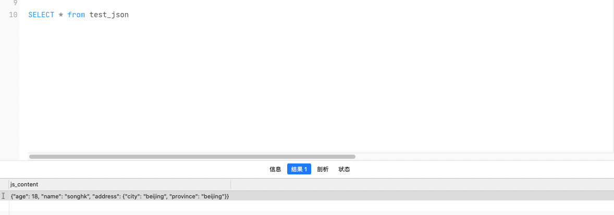
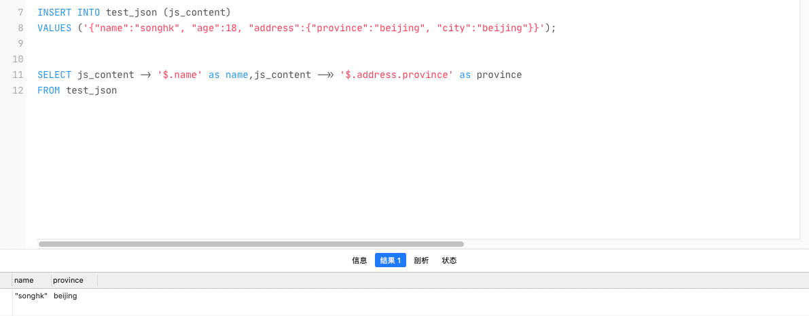
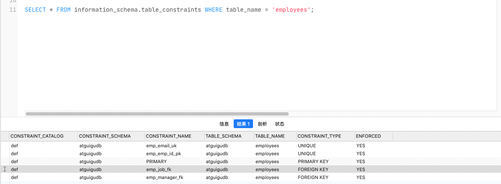
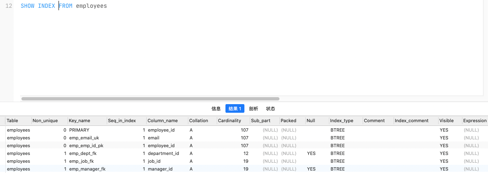

## 数据库对象

| 对象                  | 描述                                                         |
| --------------------- | ------------------------------------------------------------ |
| `表(TABLE)`           | 表是存储数据的逻辑单元，以行和列的形式存在，列就是字段，行就是记录 |
| `数据字典`            | 就是系统表，存放数据库相关信息的表。<br />系统表的数据通常由数据库系统维护， 程序员通常不应该修改，只可查看 |
| `约束(CONSTRAINT)`    | 执行数据校验的规则，用于保证数据完整性的规则                 |
| `视图(VIEW)`          | 一个或者多个数据表里的数据的逻辑显示，视图并不存储数据       |
| `索引(INDEX)`         | 用于提高查询性能，相当于书的目录                             |
| `存储过程(PROCEDURE)` | 用于完成一次完整的业务处理，没有返回值，但可通过传出参数将多个值传给调用环境 |
| `存储函数(FUNCTION)`  | 用于完成一次特定的计算，具有一个返回值                       |
| `触发器(TRIGGER)`     | 相当于一个事件监听器，当数据库发生特定事件后，触发器被触发，完成相应的处理 |

## 数据库管理

### 创建数据库

1. `CREATE DATABASE 数据库名 [CHARACTER SET 字符集];`
   - 创建数据库,通过 character set 设置字符集 

2. `CREATE DATABASE IF NOT EXISTS 数据库名;`
   - 判断数据库是否已经存在，不存在则创建数据库

### 使用数据库

1. `SHOW DATABASE`
   - 查看当前所有的数据库
2. `SELECT DATABASE()`
   - 查看当前正在使用的数据库
3. `SHOW TABLES FROM 数据库名`
   - 查看指定库下所有的表
4. `SHOW CREATE DATABASE 数据库名[\G];`
   - 查看数据库的创建信息
   - 通过 `\G`参数可以格式化显示
5. `USE 数据库名;`
   - 使用指定的数据库
   - DATABASE不能改名。一些可视化工具可以改名，它是建新库，把所有表复制到新库，再删旧库完成的

### 修改数据库

1. `ALTER DATABASE 数据库名 CHARACTER SET 字符集; `
   - 更改数据库字符集,比如gbk、utf8等
2. `DROP DATABASE 数据库名;`
   - 删除指定的数据库
3. `DROP DATABASE IF EXISTS 数据库名;`
   - 删除指定的数据库

## 表管理

### 创建表

#### 基本的创建方式

- **语法格式**

  ```sql
  CREATE TABLE [IF NOT EXISTS] 表名(
    字段1, 数据类型 [约束条件] [默认值], 
    字段2, 数据类型 [约束条件] [默认值], 
    字段3, 数据类型 [约束条件] [默认值], 
    ......
    [表约束条件] 
  );
  ```

#### 根据查询结果集创建

- **语法格式**

  ```sql
  CREATE TABLE [IF NOT EXISTS] 表名
  AS 
  SELECT查询语句
  ```

### 修改表

> - 修改表指的是修改数据库中已经存在的数据表的结构
>
> - 使用 ALTER TABLE 语句可以实现
>   - 向已有的表中添加列
>   - 修改现有表中的列
>   - 删除现有表中的列
>   - 重命名现有表中的列

1. `ALTER TABLE 表名 ADD 【COLUMN】 字段名 字段类型 【FIRST|AFTER 字段名】;`
   - 追加一个列
   - COLUMN 表示追加一列
   - FIRST|AFTER 指定追加在哪
2. `ALTER TABLE 表名 MODIFY 【COLUMN】 字段名1 字段类型 【DEFAULT 默认值】【FIRST|AFTER 字段名 2】;`
   - 修改字段数据类型、长度、默认值、位置
   - **注意**
     - 对默认值的修改只影响今后对表的修改
     - 还可以通过此种方式修改列的约束
3. `ALTER TABLE 表名 CHANGE 【column】 列名 新列名 新数据类型;`
   - 重命名一个列
4. `ALTER TABLE 表名 DROP 【COLUMN】字段名`
   - 删除表中某个字段

### 重命名表

1. ` RENAME TABLE 表名 TO 新表名`
   - 重命名表
2. ` ALTER TABLE 表名 RENAME [TO] 新表名`
   - 重命名表

### 删除表

> 在MySQL中，当一张数据表 没有与其他任何数据表形成关联关系 时，可以将当前数据表直接删除。 
>
> - 数据和结构都被删除
> - 所有正在运行的相关事务被提交
> - 所有相关索引被删除

- **语法格式**
  - `DROP TABLE [IF EXISTS] 数据表1 [, 数据表2, ..., 数据表n];`
- **DROP TABLE 语句不能回滚!**

### 清空表

> 1. 删除表中所有的数据
> 2. 释放表的存储空间

- **语法格式**
  - `TRUNCATE TABLE 数据表;`
- **truncate 和 delete区别?**
  - `truncate 语句清空后无法回滚`
  - `delete语句删除后可以回滚`

:::tip 阿里开发规约

【参考】TRUNCATE TABLE 比 DELETE 速度快，且使用的系统和事务日志资源少，但 TRUNCATE 无事务且不触发 TRIGGER，有可能造成事故，故不建议在开发代码中使用此语句。 

说明:TRUNCATE TABLE 在功能上与不带 WHERE 子句的 DELETE 语句相同。

:::


## 表数据管理

### 插入数据

#### 插入单条数据

1. `INSERT INTO 表名 VALUES (value1,value2,...);`
   - 为表的所有字段按默认顺序插入数据
   - 值列表中需要为表的每一个字段指定值，并且值的顺序必须和数据表中字段定义时的顺序相同
2. ` INSERT INTO 表名(column1 [, column2, ...]) VALUES (value1 [,value2, ...])`
   - 为表的指定字段插入数据，就是在INSERT语句中只向部分字段中插入值，而其他字段的值为表定义时的**默认值**

#### 插入多条数据

INSERT语句可以同时向数据表中插入多条记录，插入时指定多个值列表，每个值列表之间用逗号分隔开始

- **基本语法**

  ```sql
  -- 为表所有字段插入数据
  INSERT INTO table_name
  VALUES
  (value1 [,value2, ..., valuen]), 
  (value1 [,value2, ..., valuen]), 
  ....
  
  -- 为表指定字段插入
  INSERT INTO table_name(column1 [, column2, ..., columnn]) 
  VALUES
  (value1 [,value2, ..., valuen]),
  (value1 [,value2, ..., valuen]),
  ....
  ```


:::tip 注意点

使用INSERT同时插入多条记录时，MySQL会返回一些在执行单行插入时没有的额外信息，这些信息的含义如下:

 	1. `Records`
 	 - 表明插入的记录条数
 	2. `Duplicates`
 	 - 表明插入时被忽略的记录，原因可能是这 些记录包含了重复的主键值
 	3. `Warnings`
 	 - 表明有问题的数据值，例如发生数据类型转换等

:::

#### 将查询结果插入到表中

> INSERT还可以将SELECT语句查询的结果插入到表中
>
> 不需要把每一条记录的值一个一个输入，只需要使用一条INSERT语句和一条SELECT语句组成的组合语句即可快速地从一个或多个表中向一个表中插入多行

- **基本语法**

  ```sql
  INSERT INTO 目标表名 (tar_column1 [, tar_column2, ..., tar_columnn])
  SELECT (src_column1 [, src_column2, ..., src_columnn])
  FROM 源表名
  [WHERE 查询条件]
  ```

- **注意**

  - 在 INSERT 语句中加入子查询
  - 不需要写`VALUES` 子句
  - `子查询中的值列表应与 INSERT 子句中的列名对应`

:::info 示例

```sql
INSERT INTO sales_reps(id, name, salary, commission_pct) 
SELECT employee_id, last_name, salary, commission_pct 
FROM employees
WHERE job_id LIKE '%REP%';
```

:::


### 更新数据

- **基本语法**

  ```sql
  UPDATE 表名
  SET column1=value1, column2=value2, ...
  [WHERE 查询条件]
  ```

- **注意点**

  - 可以一次更新**多条**数据
  - 如果需要回滚数据，需要保证在DML前，进行设置:`SET AUTOCOMMIT = FALSE;`
  - <font color='red'>不加WHERE条件会更新表的所有数据，需要注意!!</font>

### 删除数据

- **基本语法格式**

  ```sql
  DELETE 
  FROM 表名 
  [WHERE <condition>];
  ```


## 数据类型

MySQL中包含以下的数据类型：

| 类型           | 类型举例                                                     |
| -------------- | ------------------------------------------------------------ |
| `整数`         | TINYINT、SMALLINT、MEDIUMINT、INT(或INTEGER)、BIGINT         |
| `浮点`         | FLOAT、DOUBLE                                                |
| `定点`         | DECIMAL                                                      |
| `位`           | BIT                                                          |
| `日期时间`     | YEAR、TIME、DATE、DATETIME、TIMESTAMP                        |
| `文本字符串`   | CHAR、VARCHAR、TINYTEXT、TEXT、MEDIUMTEXT、LONGTEXT          |
| `枚举`         | ENUM                                                         |
| `集合`         | SET                                                          |
| `二进制字符串` | BINARY、VARBINARY、TINYBLOB、BLOB、MEDIUMBLOB、LONGBLOB      |
| `JSON`         | JSON对象、JSON数组                                           |
| `空间数据`     | **单值类型**:GEOMETRY、POINT、LINESTRING、POLYGON; <br />**集合类型**:MULTIPOINT、MULTILINESTRING、MULTIPOLYGON、 GEOMETRYCOLLECTION |

MySQL中还包含以下的数据类型属性:

| MySQL关键字          | 含义                     |
| -------------------- | ------------------------ |
| `NULL`               | 数据列可包含NULL值       |
| `NOT NULL`           | 数据列不允许包含NULL值   |
| `DEFAULT`            | 默认值                   |
| `PRIMARY KEY`        | 主键                     |
| `AUTO_INCREMENT`     | 自动递增，适用于整数类型 |
| `UNSIGNED`           | 无符号                   |
| `CHARACTER SET name` | 指定一个字符集           |


### 整型

- 整数类型一共有 5 种，包括:

  | 整数类型    | 字节 | 有符号取值范围                           | 无符号取值范围         |
  | ----------- | ---- | ---------------------------------------- | ---------------------- |
  | `TINYINT`   | 1    | -128~127                                 | 0~255                  |
  | `SMALLINT`  | 2    | -32768~32767                             | 0~65535                |
  | `MEDIUMINT` | 3    | -8388608~8388607                         | 0~16777215             |
  | `INT`       | 4    | -2147483648~2147483647                   | 0~4294967295           |
  | `BIGINT`    | 8    | -9223372036854775808~9223372036854775807 | 0~18446744073709551615 |

- **可选属性 - 显示宽度 **

  - 显示宽度的取值范围是(0, 255),需要配合` ZEROFILL`使用，表示用“0”填满宽度，否则指定显示宽度无效
  - 比如int(5):当数据宽度小于5位的时候在数字前面需要用字符填满宽度
  - **显示宽度不会影响数据的实际插入，即`插入数据的实际宽度超过显示宽度依旧可以保存`**
  - 在 int(M) 中，M 的值跟 int(M) 所占多少存储空间并无任何关系。
    - int(3)、int(4)、int(8) 在磁盘上都 是占用 4 bytes 的存储空间

- **可选参数 - UNSIGNED**

  - 表示**无符号类型(非负)**
  - 所有的整数类型都有一个可选的属性UNSIGNED(无符号属性)，无符号整数类型的最小取值为0

- **可选参数 - ZEROFILL**

  - 0填充

  - 如果指定了ZEROFILL只是表示不够M位时，用0在左边填充。那么如果超过M位，只要不超过数据存储范围即可

- **适用场景**

  - `TINYINT`: 一般用于枚举数据，比如系统设定取值范围很小且固定的场景。
  - `SMALLINT` : 可以用于较小范围的统计数据，比如统计工厂的固定资产库存数量等
  - `MEDIUMINT`: 用于较大整数的计算，比如车站每日的客流量等
  - `INT`: 取值范围足够大，一般情况下不用考虑超限问题，用得最多。比如商品编号
  - `BIGINT`: 只有处理特别巨大的整数时才会用到。比如双十一的交易量、大型门户网站点击量等
  

### 浮点型

浮点类型包括: 

1. `FLOAT`
   - 单精度浮点数
   - 占用 `4` 字节
2. `DOUBLE`
   - 双精度浮点数
   - 占用`8` 字节

### 定点型[DECIMAL]

> 浮点数的计算是不精准的,所以在一些对精度要求较高的项目中，一定不能使用浮点型。
>
> MySQL提供了精准的数据类型 => `定点型`

- MySQL使用*`DECIMAL(M,D)`* 的方式来表示高精度小数。

  - `M` 被称为**精度**,取值范围: `0<=M<=65`
  - `D` 被称为**标度**，取值范围: `0<=D<=30`，同时 `D < M`
  - 示例: 定义DECIMAL(5,2)的类型，表示该列取值范围是-999.99~999.99

  | 数据类型       | 字节数   | 含义               |
  | -------------- | -------- | ------------------ |
  | `DECIMAL(M,D)` | M+2 字节 | 有效范围由M和D决定 |

- 定点数在MySQL内部是以 `字符串` 的形式进行存储，这就决定了它一定是精准的

- 当DECIMAL类型不指定精度和标度时，其<mark>默认为DECIMAL(10,0)</mark>

### 位类型 [BIT]

- BIT类型中存储的是`二进制值`，类似010110

  | 二进制字符串类型 | 长度 | 长度范围     | 占用空间            |
  | ---------------- | ---- | ------------ | ------------------- |
  | `BIT(M)`         | M    | 1 <= M <= 64 | 约为(M + 7)/8个字节 |

- BIT类型的`M`是表示二进制的 **位数**，位数最小值为1，最大值为64

  - 如果没有指定 **M**，<mark>默认是1位</mark>。即只能存1位的二进制值

### 日期与时间类型

> 日期与时间是重要的信息，在我们的系统中，几乎所有的数据表都用得到。原因是客户需要知道数据的 *时间标签*，从而进行数据查询、统计和处理。

MySQL有多种表示日期和时间的数据类型，不同的版本可能有所差异，MySQL8.0版本支持的日期和时间 类型主要有：

| 类型        | 字节 | 日期格式            |
| ----------- | ---- | ------------------- |
| `YEAR`      | 1    | YYYY、YY            |
| `TIME`      | 3    | HH:MM:SS            |
| `DATE`      | 3    | YYYY-MM-DD          |
| `DATETIME`  | 8    | YYYY-MM-DD HH:MM:SS |
| `TIMESTAMP` | 4    | YYYY-MM-DD HH:MM:SS |

:construction:  **TIMESTAMP和DATETIME的区别**

1. `TIMESTAMP 存储空间比较小`，表示的日期时间范围也比较小
2. `底层存储方式不同`
   - TIMESTAMP底层存储的是毫秒值，距离1970-1-1 0:0:0 0毫秒的毫秒值

3. 两个日期比较大小或日期计算时，TIMESTAMP更方便、更快

4. `TIMESTAMP和时区有关`
   - TIMESTAMP会根据用户的时区不同，显示不同的结果。而DATETIME则只能 反映出插入时当地的时区，其他时区的人查看数据必然会有误差的

:::tip 开发注意

1. 用得最多的日期时间类型是 `DATETIME` 。虽然 MySQL 也支持 YEAR、 TIME、 DATE，以及 TIMESTAMP 类型，但是在实际项目中，尽量用 DATETIME 类型。因为这个 DATETIME 包括了完整的日期和时间信息，取值范围也最大，使用起来比较方便
2. 此外，一般存**注册时间、商品发布时间等**，不建议使用DATETIME存储，而是使用 `时间戳` ，因为 DATETIME虽然直观，但不便于计算

:::


### 文本字符串

MySQL提供了多种文本字符串的数据类型:

| 文本字符串类型 | 长度 | 长度范围         | 占用空间             |
| -------------- | ---- | ---------------- | -------------------- |
| `CHAR(M)`      | M    | 0<=M<=255        | M 个字节             |
| `VARCHAR(M)`   | M    | 0<=M<=65535      | M+1 个字节           |
| `TINYTEXT`     | L    | 0<=L<=255        | L+2 个字节           |
| `TEXT`         | L    | 0<=L<=65535      | L+2 个字节           |
| `MEDIUMTEXT`   | L    | 0<=L<=16777215   | L+3 个字节           |
| `LONGTEXT`     | L    | 0<=L<=4294967295 | L+4 个字节           |
| `ENUM`         | L    | 0<=L<=65535      | 1、2 个字节          |
| `SET`          | L    | 0<=L<=64         | 1、 2 、 4 、8个字节 |

#### CHAR与VARCHAR

- **CAHR**

  - `CHAR(M)` 类型一般需要预先定义字符串长度。如果不指定(M)，则<mark>表示长度默认是1个字符</mark>

  - 如果保存时，数据的实际长度比CHAR类型声明的长度小，则会在 <mark>右侧填充空格</mark> 以达到指定的长度

  - 当MySQL检索CHAR类型的数据时，<mark>CHAR类型的字段会去除尾部的空格</mark>

  - 定义CHAR类型字段时，声明的字段长度即为CHAR类型字段所占的存储空间的字节数

- **VARCHAR**

  - `VARCHAR(M)` 定义时， <mark>必须指定</mark>长度M，否则报错
  - 检索VARCHAR类型的字段数据时，会保留数据尾部的空格
  - VARCHAR类型的字段所占用的存储空间 为字符串实际长度加1个字节。

### JSON类型

> JSON 是一种轻量级的`数据交换格式`,简洁和清晰的层次结构使得 JSON 成 为理想的数据交换语言
>
> JSON `易于人阅读和编写，同时也易于机器解析和生成，并有效地提升网络传输效率`
>
> JSON 可以将 JavaScript 对象中表示的一组数据转换为字符串，然后就可以在网络或者程序之间轻 松地传递这个字符串，并在需要的时候将它还原为各编程语言所支持的数据格式

在 MySQL 5.7中，就已经支持JSON数据类型。**在MySQL 8.x版本中，JSON类型提供了可以进行自动验证的 JSON文档和优化的存储结构**，使得在MySQL中存储和读取JSON类型的数据更加方便和高效


-  **如何检索JSON数据的属性值?**
  - `使用 -> 、->> 可以检索JSON类型的字段中数据的某个具体值`
  - 查询时,`$`表示JSON的根节点

:::info 测试JSON类型

```sql
-- 创建含有JSON类型的表
CREATE TABLE test_json
( 
	js_content json
);
-- 表中插入JSON数据
INSERT INTO test_json (js_content)
VALUES ('{"name":"songhk", "age":18, "address":{"province":"beijing", "city":"beijing"}}');
```


**1.查询JSON完整数据**



**2.查询JSON的某个属性值**

```sql
-- 通过 -> 或者 ->> 获取JSON中的某个属性
SELECT js_content -> '$.name' as name,js_content ->> '$.address.province' as province
FROM test_json
```



:::


## 约束

> 数据完整性包含了两部分: `数据精确性`、`数据可靠性`, 是为了防止数据库中存在不符合语义规定的数据和防止因错误信息的输入输出造成无效操作或错误信息的
>
> 为了保证数据的完整性，SQL规范以约束的方式对 **表数据进行额外的条件限制** 。从以下四个方面考虑：
>
> 1. `实体完整性`: 例如同一个表中，不能存在两条完全相同无法区分的记录
> 2. `域完整性`: 例如:年龄范围0-120，性别范围“男/女”
> 3. `引用完整性`: 例如:员工所在部门，在部门表中要能找到这个部门
> 4. `用于自定义完整性`: 例如:用户名唯一、密码不能为空等

- 约束的分类

  1. **根据约束数据列的限制**

     - **单列约束** :每个约束只约束一列

     - **多列约束** :每个约束可约束多列数据

  2. **根据约束的作用范围**

     - **列级约束** :只能作用在一个列上，跟在列的定义后面 

     - **表级约束** :可以作用在多个列上，不与列一起，而是单独定义

  3. **根据约束起的作用**

     - **NOT NULL** : 非空约束，规定某个字段不能为空

     - **UNIQUE** : 唯一约束，规定某个字段在整个表中是唯一的 

     - **PRIMARY KEY** : 主键(非空且唯一)约束

     - **FOREIGN KEY** : 外键约束

     - **CHECK** : 检查约束

     - **DEFAULT** : 默认值约束

:::tip 查看某个表已经存在的约束

- `information_schema` : 系统级数据库

- `table_constraints` : 系统级数据表 (专门存储各个表的约束)

```sql
SELECT * FROM information_schema.table_constraints WHERE table_name = '表名称';
```



:::

### 非空约束[NOT NULL]

- 限定某个字段/某列的值不允许为空
- **特点**
  - **默认所有的类型的值都可以是NULL**，包括INT、FLOAT等数据类型
  - **只能设置单独的列非空,不能组合非空**
  - 一个表可以多个字段都限定为非空
  - 空字符串 不等于 NULL，0 也不等于NULL

#### 添加非空约束

- **建表时的基本语法**

  ```sql
  CREATE TABLE 表名称( 
    	字段名 数据类型,
    	字段名 数据类型 NOT NULL,
    	字段名 数据类型 NOT NULL 
  );
  ```

- **建表后的基本语法**

  ```sql
  ALTER TABLE 表名称 MODIFY 字段名 数据类型 NOT NULL;
  ```

#### 删除非空约束

- **基本语法**

  ```sql
  -- 去掉 not null，相当于修改某个非注解字段，该字段允 许为空
  ALTER TABLE 表名称 MODIFY 字段名 数据类型 [NULL]
  ```

### 唯一约束[UNIQUE]

- 限制某个字段/某列的值不能重复
- **特点**
  - 一个表可以有多个唯一约束
  - 可以是单独列的值唯一,也可以是组合列的唯一
  - **唯一约束允许出现多个NULL**
  - MySQL会给唯一约束的列默认创建一个`唯一索引`
  - 建立唯一约束可以在列级别创建，也可以在表级别上创建

#### 创建唯一约束

- **建表时的基本语法**

  ```sql
  -- 方式1
  create table 表名称( 
    	字段名 数据类型,
  		字段名 数据类型 unique, 
    	字段名 数据类型 unique key, 
    	字段名 数据类型
  );
  -- 方式2 
  create table 表名称
  (
  	字段名 数据类型,
  	字段名 数据类型,
  	字段名 数据类型,
  	[constraint 约束名] unique key(字段名1,字段名2,...)
  );
  ```

- **建表后的基本语法**

  ```sql
  ALTER TABLE 表名称 ADD UNIQUE KEY(字段名1,字段名2,...);
  ```

#### 删除唯一约束

- **注意**
  - 由于添加唯一约束的时候会在约束的列上自动创建唯一索引,所以`删除唯一约束只能通过删除唯一索引的方式`
  - 删除唯一约束时 需要指定唯一索引名，唯一索引名就和唯一约束名一样

- **基本语法**

  ```sql
  ALTER TABLE USER DROP INDEX 唯一约束名;
  ```

:::tip 查看表的索引

```sql
show index from 表名称;
```



:::


### 主键约束[PRIMARY KEY]

- 唯一标识表中的一行记录
- 主键约束相当于 `唯一约束+非空约束的组合` ，主键约束列不允许重复，也不允许出现空值

- **特点**
  - 一个表最多只能有一个主键约束
  - 主键约束可以对应表中的一列或者多列(复合主键)
  - 建立主键约束可以在列级别创建，也可以在表级别上创建

#### 添加主键约束

- **建表时的基本语法**

  ```sql
  create table 表名称
  (
  	字段名 数据类型 primary key, #列级模式 字段名 数据类型,
  	字段名 数据类型
  );
  
  create table 表名称
  (
  	字段名 数据类型,
  	字段名 数据类型,
  	字段名 数据类型,
  	[constraint 约束名] primary key(字段名1,字段名2,...) #表级模式
  );
  ```

- **建表后的基本语法**

  ```sql
   ALTER TABLE 表名称 ADD PRIMARY KEY(字段名1,字段名2,...);
  ```

#### 删除主键约束

- **基本语法格式**

  ```sql
  -- 删除主键约束不需要指定主键名，因为一个表只能有一个主键约束
  ALTER TABLE 表名称 DROP PRIMARY KEY;
  ```

:::tip 删除主键约束的注意点

1. 删除主键约束，不需要指定主键名，因为一个表只有一个主键
2. `删除主键约束后，非空还存在`

:::


