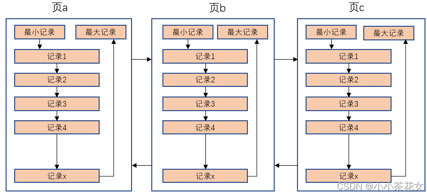
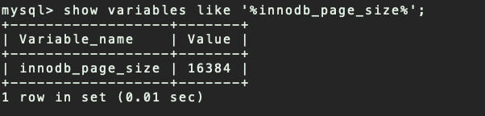
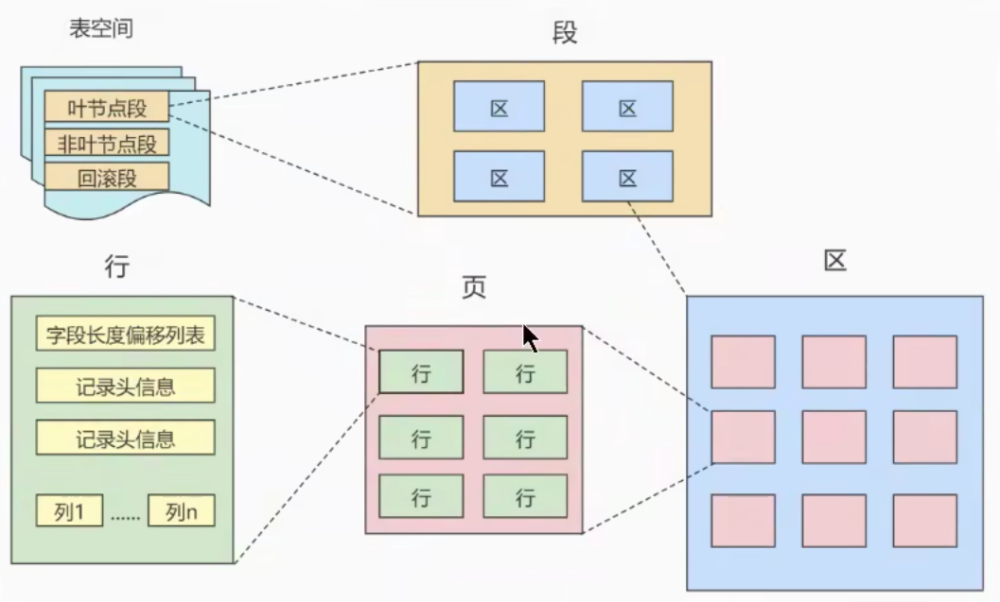
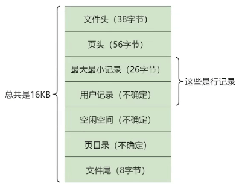

## 存储结构-页

> 索引结构提高了高效的索引方式,不过索引信息以及数据记录都是保存在磁盘文件上的。索引是在存储引擎中实现的,MySQL 服务器上的`存储引擎`负责对表中的数据进行读取和写入。`不同的存储引擎中存放的格式也是不同的`,甚至有的存储引擎使用Memory 来存储数据

### 交互的基本单位-页

1. InnoDB 将数据划分为若干个页,InnoDB 中页的大小默认为`16KB`

2. 以`页`作为磁盘和内存之间交互的`基本单位`,也就是**一次最少从磁盘读取 16KB 的内容到内存中, 一次最少把内存中 16KB 内容刷新到磁盘上**

   - **也就是说`在数据库中,无论读一行还是读多行数据,都是将这些行所在的页加载到内存中`**
   - **也就是说`数据库管理存储空间的基本单位是页(Page),数据库 IO 操作的最小单位是页`**

   - <mark>即记录时按照行来存储,但不是按照行来读取。如果按照行来读取,那么读取一次需要一次 IO,那么效率会变得非常低</mark>

### 页结构

1. 页 a、页 b…这些页`在物理上并不相连`,只要通过`双向链表`关联达到逻辑上的连接即可
2. 每个数据页中的记录会按照索引列从小到大的顺序组成一个`单向链表`
3. 每个数据页都会为存储在它里面的记录生成一个`页目录`,在通过索引列查找某个记录的时候,可以在页目录中使用`二分法`快速定位到对应的槽,然后便利这个槽中的记录即可

### 页的大小

不同的DBMS 的页大小不同,比如在 MySQL 的 InnoDB 存储引擎冲, 默认页的大小是`16KB`,可以通过命令`innodb_page_size` 查看

SQL Server中页的大小为 `8KB`,而在 Oracle 中使用`块(Block)`来代表页,Oracle 支持的块大小为`2KB、4KB、8KB、16KB、32KB、64KB`

###  页的上层结构

在数据库中除了***页*** 之外,还存在着 **`区(Extent)、段(Segment)、表空间(Tablespace)的概念`**,行、页、区、段、表空间的关系如下:

1. **`区(Extent)`** 

   - 比页大一级存储结构, **在 InnoDB 存储引擎中,一个区会分配`64 个连续的页`**
   - 因为 InnoDB 的页大小默认为 16Kb,所以一个区的大小是 64 * 16KB = `1MB`
2. **`段(Segment)`**
    - 由一个或者多个区组成,**区在文件系统中是一个连续分配的空间(InnoDB 中是 64 个连续的页)**
    - **页中不要求区与区之间是连续的**
    - **`段是数据库中的分配单位, 不同类型的数据库对象以不同的段形式存在`**
    - 当创建数据表、索引的时候,就会创建相应的段。比如创建一张表时会创建一个表段, 创建一个索引时会创建一个索引段
3. `表空间(TableSpace)`
    - 一个逻辑容器,表空间存储的对象是段。在一个表空间中可以有一个或者多个段,但是一个段只能属于一个表空间
    - 数据库由一个或者多个表空间组成
    - 表空间从管理上可以划分为: `系统表空间、用户表空间、撤销表空间、临时表空间...`

## 页的内部结构

### 说明

页如果按照类型划分的话,常见的有: `数据页(保存 B+Tree 节点)、系统页、Undo 页、事务数据页等`,  数据页是使我们最长使用的页

数据页的`16KB`大小的存储空间被划分为七大部分:

1. `文件头(File Header)`
2. `页头(Page Header)`
3. `最大最小记录(Infimum + supremum)`
4. `用户记录(User Records)`
5. `空闲空间(Free Page)`
6. `页目录(Page Directory)`
7. `文件尾(File Trailer)`

 

**上面七个部分的作用简单来说:**

|         名称         | 大小(字节) |              说明               |
| :------------------: | :--------: | :-----------------------------: |
|    `File Header`     |   **38**   |        文件头,描述页信息        |
|    `Page Header`     |   **56**   |        页头,页的状态信息        |
| `Infimum + Supremum` |   **26**   | 最大和最小记录,是两个虚拟的记录 |
|    `User Records`    |   不确定   |     用户记录,存储行记录内容     |
|     `Free Space`     |   不确定   |  空闲空间,页中没有被使用的空间  |
|   `Page Directory`   |   不确定   | 页目录,存储用户记录中的相对位置 |
|    `File Trailer`    |   **8**    |      文件尾,检查也是否完整      |

### 文件头

1. **作用:`描述各种页的通用信息(比如页的编号、上一页、下一页等)`**

2. **大小: `38 字节`**

3. **构成**:

   | 名称                               | 大小(字节) | 描述                                                         |
   | ---------------------------------- | ---------- | ------------------------------------------------------------ |
   | `FIL_PAGE_SPACE_ORCHKSUM`          | **4**      | 页的校验和 (checksum值)                                      |
   | `FIL_PAGE_OFFSET`                  | **4**      | 页号(表空间的偏移值) 假设表空间 ID 为 10,那么搜索页(10,1) 就是查询表 a 中的第二个页 |
   | `FIL_PAGE_PREV`                    | **4**      | 当前页的上一页的页号                                         |
   | `FIL_PAGE_NEXT`                    | **4**      | 当前页的下一页的页号                                         |
   | `FIL_PAGE_LSN`                     | **8**      | 页面最后被修改时对应的日志序列位置(Log Sequence Number)      |
   | `FIL_PAGE_TYPE`                    | **2**      | 该页的类型.数据页的值值 `0x45BF`                             |
   | `FIL_PAGE_FILE_FLUSH_LSN`          | **8**      | 仅在系统表空间的一个页中定义,代表文件至少被刷新到了对应的 LSN 值 |
   | `FIL_PAGE_ARCH_LOG_NO_OR_SPACE_ID` | **4**      | 页属于哪个表空间                                             |

4. **页类型(FIL_PAGE_TYPE 可选值)**

   | 名称                        | 十六进制 | 说明                   |
   | --------------------------- | -------- | ---------------------- |
   | **FIL_PAGE_INDEX**          | `0x45BF` | 数据页                 |
   | **FIL_PAGE_TYPE_ALLOCATED** | `0x0000` | 最新分配的页           |
   | **FIL_PAGE_UNDO_LOG**       | `0x0002` | Undo日志页             |
   | **FIL_PAGE_INDOE**          | `0x0003` | 段信息节点             |
   | **FIL_PAGE_IBUF_FREE_LIST** | `0x0004` | Insert Buffer 空闲列表 |
   | **FIL_PAGE_TYPE_SYS**       | `0x0006` | 系统页                 |
   | **FIL_PAGE_TRX_SYS**        | `0x0007` | 事务系统数据           |
   | **FIL_PAGE_TYPE_FSP_HDR**   | `0x0008` | 表空间头部信息         |
   | **FIL_PAGE_TYPE_XDES**      | `0x0009` | 拓展描述页             |
   | **FIL_PAGE_TYPE_BLOB**      | `0x000A` | 溢出页                 |

   