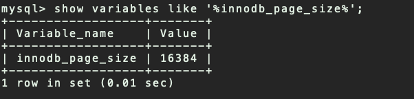
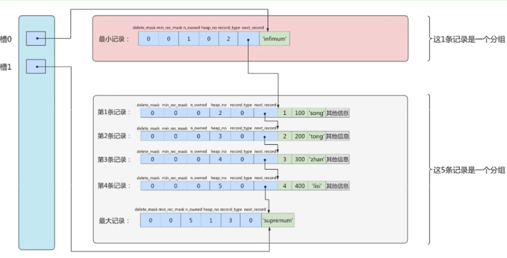

## 存储结构-页

> 索引结构提高了高效的索引方式,不过索引信息以及数据记录都是保存在磁盘文件上的。索引是在存储引擎中实现的,MySQL 服务器上的`存储引擎`负责对表中的数据进行读取和写入。`不同的存储引擎中存放的格式也是不同的`,甚至有的存储引擎使用Memory 来存储数据

### 交互的基本单位-页

1. InnoDB 将数据划分为若干个页,InnoDB 中页的大小默认为`16KB`

2. 以`页`作为磁盘和内存之间交互的`基本单位`,也就是**一次最少从磁盘读取 16KB 的内容到内存中, 一次最少把内存中 16KB 内容刷新到磁盘上**

   - 也就是说`在数据库中,无论读一行还是读多行数据,都是将这些行所在的页加载到内存中`
   - 也就是说`数据库管理存储空间的基本单位是页(Page),数据库 IO 操作的最小单位是页`

   - <mark>即记录时按照行来存储,但不是按照行来读取。如果按照行来读取,那么读取一次需要一次 IO,那么效率会变得非常低</mark>

### 页结构

1. 页 a、页 b…这些页`在物理上并不相连`,只要通过`双向链表`关联达到逻辑上的连接即可
2. 每个数据页中的记录会按照索引列从小到大的顺序组成一个`单向链表`
3. 每个数据页都会为存储在它里面的记录生成一个`页目录(Page Directory)`,在通过索引列查找某个记录的时候,可以在页目录中使用`二分法`快速定位到对应的槽,然后便利这个槽中的记录即可


### 页的大小

不同的DBMS 的页大小不同,比如在 MySQL 的 InnoDB 存储引擎冲, 默认页的大小是`16KB`,可以通过命令`innodb_page_size` 查看



SQL Server中页的大小为 `8KB`,而在 Oracle 中使用`块(Block)`来代表页,Oracle 支持的块大小为`2KB、4KB、8KB、16KB、32KB、64KB`

###  页的上层结构

在数据库中除了***页*** 之外,还存在着 **`区(Extent)、段(Segment)、表空间(Tablespace)的概念`**,行、页、区、段、表空间的关系如下:


#### 表空间

- **概述**
  - 一个逻辑容器,表空间存储的对象是段。在一个表空间中可以有一个或者多个段,但是一个段只能属于一个表空间
  - 数据库由一个或者多个表空间组成
  - 表空间从管理上可以划分为: `系统表空间、用户表空间、撤销表空间、临时表空间...`
- **说明**
  - 表空间可以看作是 InnoDB 存储引擎结构的最高层, 所哟逇数据都存放在表空间中。InnoDB 默认有一个共享表空间 `/var/lib/mysql/ibdata1`,即所有的数据都存放在这个表空间中,但是如果开启了参数`innodb_file_per_table`的话,那么每张表都会单独放到一个表空间内。
  - 需要注意的是,开启了**innodb_file_per_table**参数,只是将`数据、索引和插入缓冲Bitmap 页`放在单独的表空间,其他的诸如`回滚(undo)信息、插入缓冲索引页、系统事务信息、二次写缓冲等`还是存放在原来的共享表空间 ibdata1 中

#### 段

- **概述**
  - 由一个或者多个区组成,**区在文件系统中是一个连续分配的空间(InnoDB 中是 64 个连续的页)**
    - **段中不要求区与区之间是连续的**
  - **`段是数据库中的分配单位, 不同类型的数据库对象以不同的段形式存在`**
    - 当创建数据表、索引的时候,就会创建相应的段。比如创建一张表时会创建一个表段, 创建一个索引时会创建一个索引段
- **说明**
  - 表空间是由各个段组成的,常见的段有`数据段、索引段、回滚段等`
  - InnoDB 中索引即数据,数据即索引,所以`数据段就是 B+Tree 的叶子节点,索引段就是 B+Tree 的非叶子节点`

#### 区

- **概述**
  - 比页大一级存储结构, **在 InnoDB 存储引擎中,一个区会分配`64 个连续的页`**
  - 因为 InnoDB 的页大小默认为 16Kb,所以一个区的大小是 64 * 16KB = `1MB`
    - **注意: InnoDB 1.2.x版本可以控制页的默认大小,但是一个区的大小是固定的 1M**

## 页的内部结构

### 说明

页如果按照类型划分的话,常见的有: `数据页(保存 B+Tree 节点)、系统页、Undo 页、事务数据页等`,  数据页是使我们最长使用的页

数据页的`16KB`大小的存储空间被划分为七大部分:

1. `文件头(File Header)`
2. `页头(Page Header)`
3. `最大最小记录(Infimum + supremum)`
4. `用户记录(User Records)`
5. `空闲空间(Free Page)`
6. `页目录(Page Directory)`
7. `文件尾(File Trailer)`

 

**上面七个部分的作用简单来说:**

|         名称         |  大小(字节)   |              说明               |
| :------------------: | :-----------: | :-----------------------------: |
|    `File Header`     |    **38**     |        文件头,描述页信息        |
|    `Page Header`     |    **56**     |        页头,页的状态信息        |
| `Infimum + Supremum` | **26(13+13)** | 最大和最小记录,是两个虚拟的记录 |
|    `User Records`    |    不确定     |     用户记录,存储行记录内容     |
|     `Free Space`     |    不确定     |  空闲空间,页中没有被使用的空间  |
|   `Page Directory`   |    不确定     | 页目录,存储用户记录中的相对位置 |
|    `File Trailer`    |     **8**     |     文件尾,检查数据是否完整     |


### 文件头(File Header)

1. **作用:`描述各种页的通用信息(比如页的编号、上一页、下一页等)`**

2. **大小: `38 字节`**

3. **构成**:

   | 名称                               | 大小(字节) | 描述                                                         |
   | ---------------------------------- | ---------- | ------------------------------------------------------------ |
   | `FIL_PAGE_SPACE_OR_CHKSUM`         | **4**      | 页的校验和 (checksum值)                                      |
   | `FIL_PAGE_OFFSET`                  | **4**      | 页号(表空间的偏移值)<br />假设表空间 ID 为 10,那么搜索页(10,1) 就是查询表 a 中的第二个页 |
   | `FIL_PAGE_PREV`                    | **4**      | 当前页的上一页的页号                                         |
   | `FIL_PAGE_NEXT`                    | **4**      | 当前页的下一页的页号                                         |
   | `FIL_PAGE_LSN`                     | **8**      | 页面最后被修改时对应的日志序列位置(Log Sequence Number)      |
   | `FIL_PAGE_TYPE`                    | **2**      | 该页的类型.数据页的值值 `0x45BF`                             |
   | `FIL_PAGE_FILE_FLUSH_LSN`          | **8**      | 仅在系统表空间的一个页中定义,代表文件至少被刷新到了对应的 LSN 值 |
   | `FIL_PAGE_ARCH_LOG_NO_OR_SPACE_ID` | **4**      | 页属于哪个表空间                                             |

:::tip **校验和- CheckSum**

- 就是对于一个很长的字符串来说,通过算法得到一个比较短的值来表示这个很长的字符串,这个比较短的值就是`校验和(checksum)`。
  - 在比较两个很长的字符串之前首先比较这两个校验和,如果校验和都不一样,那么这两个字符串肯定也不同,就省去了两个长字符串的比较时间
- **文件头和文件尾都有属性: FIL_PAGE_SPACE_OR_CHKSUM**
- **作用**
  - InnoDB 存储引擎以**页**为单位将数据加载到内存中处理,如果该页中的数据在内存中被修改了,那么在修改后的某个时间点上讲数据同步到磁盘上,但是同步过程中突然出现异常(比如断电),造成该页传输的不完整。
  - 为了检测一个页是否完整(即同步没有同步成功的情况),这时可以通过文件尾校验和与文件头的作比对,如果两个值不同,则说明页的传输有问题,需要重新传输同步。
- **具体**
  - 每当一个页在内存中修改了，在同步之前就要把它的校验和算出来。因为File Header在页面的前边，所以校验和会被首先同步到磁盘，当完全写完时，校验和也会被写到页的尾部
    - 如果完全同步成功，则页的首部和尾部的校验和应该是一致的。
    - 如果写了一半儿断电了，那么在File Header中的校验和就代表着已经修改过的页，而在File Trailer中的校验和代表着原先的页，二者不同则意味着同步中间出了错
  - **这里的校验方式就是采用 `Hash 算法`进行校验**

:::

4. **页类型(FIL_PAGE_TYPE 可选值)**

| 名称                        | 十六进制 | 说明                   |
| --------------------------- | -------- | ---------------------- |
| **FIL_PAGE_INDEX**          | `0x45BF` | 数据页                 |
| **FIL_PAGE_TYPE_ALLOCATED** | `0x0000` | 最新分配的页           |
| **FIL_PAGE_UNDO_LOG**       | `0x0002` | Undo日志页             |
| **FIL_PAGE_INDOE**          | `0x0003` | 段信息节点             |
| **FIL_PAGE_IBUF_FREE_LIST** | `0x0004` | Insert Buffer 空闲列表 |
| **FIL_PAGE_TYPE_SYS**       | `0x0006` | 系统页                 |
| **FIL_PAGE_TRX_SYS**        | `0x0007` | 事务系统数据           |
| **FIL_PAGE_TYPE_FSP_HDR**   | `0x0008` | 表空间头部信息         |
| **FIL_PAGE_TYPE_XDES**      | `0x0009` | 拓展描述页             |
| **FIL_PAGE_TYPE_BLOB**      | `0x000A` | 溢出页                 |


### 文件尾(File Trailer)

> 为了检测也是否已经完整地写入磁盘(比如可能发生的写入过程中磁盘损坏、机器关机等),InnoDB 存储引擎的页设置了 `File Trailer`部分

- File Trailer 只有一个 `FIL_PAGE_END_LSN` 部分,占用`8 字节`。
  - `前4 字节`: 该页的 checksum 值
  - `后 4 字节`: 与 File Header 的 `FIL_PAGE_LSN`相同
- 判断的时候,将这两个值分别与 File Header 的 `FIL_PAFGE_OR_CHKSUM、FIL_PAGE_LSN`比较,判断是否一致,以此保证也得完整性
  - <font color='blue'>注意:校验和 checksum 的比较需要通过 InnoDB 的 checksum 函数进行比较,不是简单的等值比较</font>

- 在默认配置下, InnoDB 每次从磁盘读取一个页到内存,都会检测页的完整性,就是通过这个 File Trailer 进行判断的
  - 当然这个检测有一定的开销,key 已通过`innodb_checksums` 来开启或者关闭这个页完整性检查 (**MySQL8.0 中没有这参数了**)
- MySQL 5.6.6 版本中,新增了参数 `innodb_checksum_algorithm`,用于控制检测 checksum 的算法,有如下的可选值
  - `innodb`
  - `crc32` : **默认值**
  - `none`
  - `strict_innodb`
  - `strict_crc_32`
  - `strict_none`

### 最小最大记录

- 在 InnoDB 存储引擎中,每个数据页中都有两个`虚拟的行记录`,用于限定记录的边界
  - **Infimum 记录是比该页中任何主键值都小的值,Supremum 是任何可能大的值还要大的值**
- `这两个值在页被创建的时候建立,并且在任何情况下都不会被删除`
  - **由于这两条记录不是自定义的记录,所以它不存储在User Record 中,而是单独存储在 Infimum与Supremum中**
  - InnoDB 规定的最小记录与最大记录的构造很简单,都是由 5 个字节大小的[记录头信息](InnoDB存储结构#记录头信息)和 8 字节大小的一个固定部分组成的


### User Records + Free Space

- **User Record** 就是**用户记录**,即`实际存储行记录的内容`。
  - User Records 中的这些记录按照指定的行格式一条一条摆在User Records部分,相互之间形成单链表。 
  - 用户记录里的一条条数据如何记录？可以查看[记录头信息](InnoDB存储结构#记录头信息)
- **Free Space** 就是**空闲空间**
  - 与用户记录一样,也采用了链表的数据结构。在一条记录被删除之后,对应的节点会相互连接成链表(**垃圾链表 **)
    - 用户记录会以指定的`行格式`存储到 **User Records 中**,但是新分配的页中是没有 User Records 部分的。
    - 在新插入一条 User Record 的时候,都会向 Free Space 申请一个记录大小的空间划分到 User Records 中,当 Free Space 的空间不足的时候,就会新分配一个页


### Page Directory

#### 说明

1. 将当前数据页的所有记录`分为几个组`,这些记录`包括用户记录、最大最小记录,但不包含标记为已删除的记录`

   - **第一组** : 最小记录所在的组,只有1 条记录 ( n_owned的值总是 `1` )

   - **最后一组** : 最大记录所在的组,有 1~8 条记录,并且会尽量平分 ( n_owned的取值范围是`[1,8]` )

   - **其余组** : 有 4~8 条记录,并且会尽量平分 (  n_owned的取值范围是`[4,8]` )

2. 在每个组中的最后一条记录的头信息中会存储这个组一共有多少条记录,也就是 `n_owned` 字段

3. `页目录用来存储每组最后一条记录的地址偏移量`,这些地址偏移量会按照`先后顺序存储起来`,每组的地址偏移量也叫做`槽(Slot)`
   - 每个槽相当于指针指向了不同组的最后一个记录
4. 查询的时候,由于一个槽指向一组记录的最后一个记录的地址,且记录之前采用单向链表的方式连接,所以可能需要拿到上一个槽,然后通过上一个槽最后一个记录的**next_record** 获取当前槽的第一个元素
   - **如果第一组有多个,那么由于用户记录采用单链表的形式,所以只能通过槽拿到第一组里面的尾部记录,前面的记录则无法获取**
     - 所以第一组中有一个记录(最小记录)

**页目录中槽、分组的示意图:**




:::tip 为什么需要页目录

在页中,记录是以`单向链表`的形式存储的,单向链表的插入和删除速度很快,但是查询速度慢。最差的情况下,需要对整个链表进行线性遍历才能完成检索。

所以在页结构中专门设置了`页目录`这个模块,`专门给记录做一个目录`,通过二分法的方式进行检索

:::

#### 问题

1. **页目录中分组的个数是如何确定的? 为什么最小记录的 n_owned =1, 最大记录的 n_owned=5?**
   - InnoDB规定：

     - **对于最小记录所在的分组只能有1条记录**
     - **最大记录所在的分组拥有的记录条数只能在1~8条之间**
     - **剩下的分组中记录的条数范围只能在是 4~8 条之间**

   - **分组是按照下边的步骤进行的**

     - 初始情况下一个数据页里只有`最小记录`和`最大记录`两条记录，它们分属于两个分组
     - 之后每插入一条记录，都会从页目录中找到主键值比本该记录的主键值大并且差值最小的槽,然后把该槽对应的记录的n_owned值加1,表示本组内又添加了一条记录,直到该组中的记录数等于8个
     - 在一个组中的记录数等于8个后再插入一条记录时，会将组中的记录拆分成两个组，一个组中4条记录，另一个5条记录
     - 这个过程会在页目录中新增一个槽来记录这个新增分组中最大的那条记录的偏移量
2. B+Tree是如何进行记录检索的?
   - 如果通过 B+Tree 的索引查询行记录,首先从 B+Tree 的根节点开始,逐层检索,直到找到叶子节点,也就是找到指定的数据页为止
   - 然后将数据页加载到内存中
   - 接着对数据页中页目录中的槽(Slots)采用`二分查找`的方式找到一个粗略的分组,然后利用分组进行链表遍历
3. 

### Page Header

为了能得到数据页中存储的记录的状态信息,比如本页中已经存储了多少数据、第一条记录的地址是什么、页目录中存储了多少个槽等等,InnoDB 特意在页中定义了`Page Header`,它由 `14个部分`组成, 占用固定的`56 字节`,**用于存储数据页的状态信息**

1. **`PAGE_N_DIR_SLOTS`**
   - 在页目录 Page Directory 中的槽数量
   - 占用`2 字节`
2. **`PAGE_HEAP_TOP`**
   - 还未使用的空间最小地址,也就是该地址之后就是 Free Space
   - 占用`2 字节`
3. **`PAGE_N_HEAP`**
   - 堆中的记录数
     - 即本页中记录的数量(包括最小记录、最大记录、标记为删除的记录)
   - 占用`2 字节`,但是第 15 位表示行记录格式
4. **`PAGE_FREE`**
   - 指向`可重用空间`的首地址
     - 即第一个被标记为删除(deleted_flag=1) 的记录的地址
     - **每个删除的记录通过 `next_record`也会组成一条单链表,这个单链表中的记录可以被重用(新插入排序后的记录替换该单链表中的记录),原链修改性能比删除后修改高**
   - 占用`2 字节`
5. **`PAGE_GARBAGE`**
   - 已删除记录所占用的字节数,**不是删除的记录的数量!**
     - 即行记录结构中,deleted_flag=1 的记录的大小总数
   - 占用`2 字节`
6. `PAGE_LAST_INSERT`
   - 最后插入记录的位置
   - 占用`2 字节`
7. **`PAGE_DIRECTION`**
   - 最后记录插入的方向,可选值如下
     - **PAGE_LEFT: 0x01**
     - **PAGE_RIGHT: 0x02**
     - **PAGE_SAME_REC: 0x03**
     - **PAGE_SAME_PAGE: 0x04**
     - **PAGE_SAME_NO_DIRECTION: 0x05**
   - 比如新插入的一条记录的主键值比上一条记录的主键值大，我们说这条记录的插入方向是右边，反之则是左边
   - 占用`2 字节`
8. **`PAGE_N_DIRECTION`**
   - 一个方向连续插入记录的数量,**当然,如果某条记录插入的方向改变后,这个值会被清零重新统计**
   - 占用`2 字节`
9. **`PAGE_N_RECS`**
   - 该页中用户记录的数量(不包括最小记录、最大记录、标记为删除的记录)
   - 占用`2 字节`
10. **`PAGE_MAX_TRX_ID`**
    - 修改当前页的最大事务 ID,`仅在二级索引中定义`
    - 占用`8 字节`
11. **`PAGE_LEVEL`**
    - 当前页在 B+Tree 中的层级, **0x00 表示叶子节点**
    - 占用`2 字节`
12. **`PAGE_INDEX_ID`**
    - 索引 ID,表示当前页属于哪个索引
    - 占用`2 字节`
13. `PAGE_BTR_SEG_LEAF`
14. `PAGE_BTR_SEG_TOP`

## 行记录格式

### 指定行格式

- **语法**

  - **查看表的行格式**

    ```sql
    show table status like '表名'
    ```
  
  - **创建表时指定行格式**

    ```sql
    CREATE TABLE 表名 (
    	列的信息
    )  ROW_FORMAT=行格式名称
    ```

  - **修改指定表的行格式**
  
    ```sql
    ALTER TABLE 表名 ROW_FORMAT=行格式名称
    ```
  

### COMPACT行格式

Compact 行格式实在 MySQL5.0 中引入的,用于高效的存储数据,当一个页中存放的数据越多,它的性能越高。包含的内容如下

1. `变长字段长度列表`
2. `NULL 值标志位`
3. `记录头信息`
4. `列数据 1、列数据 2....列数据 n`


#### 记录头信息

> 一共占用 40bit,即 5 字节

##### delete_flag

- 该行是否已被删除,占用**1 字节**
  - `0` : 没有被删除
  - `1` : 已经被删除

:::tip 被删除的记录为什么还要在页中存储呢?

因为删除数据后,其他的数据需要重新排序,导致性能消耗.所以只是打上一个删除标记而已。

所有被删除的记录会组成一个`垃圾链表`,在这个链表中的记录占用的空间称之为`可重用空间`,如果有新的记录插入到表中的话,可以把这些背删除的记录占用的存储空间覆盖掉

:::

##### min_rec_flag

- B+Tree 的每层非叶子节点中的最小记录都会添加该标记,并且值为`1`。占用 **1 bit**
- 手动插入的用户记录的 *min_rec_flag* 的值是`0`

##### record_type

- 记录类型,占用**3 bit**
  - `000(0)` : 普通记录
  - `001(1)` : B+Tree 非叶子节点记录
  - `010(2)` : 最小记录
  - `011(3)` : 最大记录 
  - `1xx`      : 保留

##### heap_no

- 当前记录在记录堆中的排序后的位置信息,占用 **13 bit**
- MySQL 会给每个页里面加两个`虚拟记录`[最小最大记录](InnoDB存储结构#最小最大记录)
  - `heap_no = 0` : 最小记录
  - `heap_no = 1` : 最大记录

##### n_owned

- 页目录中每个组中最后一条记录的头信息中回存储该组一共多少条记录,作为**n_owned**字段。占用**4 bit**
- 参看[页目录(Page Directory)](InnoDB存储结构#page-directory)

##### next_record

- 当前记录到下一条记录的`地址偏移量`,而不是具体的数据地址。占用**16bit **
  - 比如第一条记录的 next_record=32,那么第一条记录的位置后移 32 个字节就是下一条记录的位置
- **注意:**
  1. **下一条记录并不是实际插入的下一条记录,而是按照主键从小到大排序的下一条记录**
  2. **最小记录(Infimum)的下一条记录就是当前页中主键最小的记录**
  3. **当前页中主键最大的用户记录的 next_record 就是最大记录(Supremum)**


