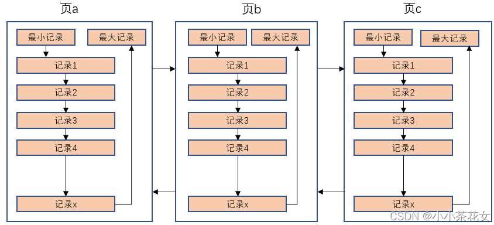
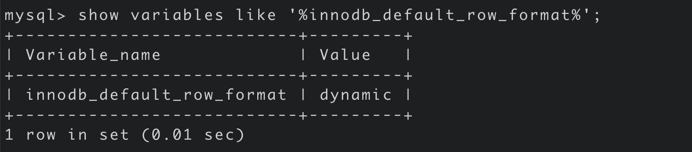

---

id: InnoDB数据页结构
title: InnoDB数据页结构
---

## InnoDB的存储结构

> 索引结构提高了高效的索引方式,不过索引信息以及数据记录都是保存在磁盘文件上的。索引是在存储引擎中实现的,MySQL 服务器上的`存储引擎`负责对表中的数据进行读取和写入。`不同的存储引擎中存放的格式也是不同的`,甚至有的存储引擎使用Memory 来存储数据

### 存储的基本单位-页

1. InnoDB 将数据划分为若干个页,InnoDB 中页的大小默认为`16KB`。它也是`InnoDB管理存储空间的基本单位`

2. 以`页`作为磁盘和内存之间交互的`基本单位`,也就是**一次最少从磁盘读取 16KB 的内容到内存中, 一次最少把内存中 16KB 内容刷新到磁盘上**

   - 也就是说`在数据库中,无论读一行还是读多行数据,都是将这些行所在的页加载到内存中`
   - 也就是说`数据库管理存储空间的基本单位是页(Page),数据库 IO 操作的最小单位是页`

   - <mark>即记录时按照行来存储,但不是按照行来读取。如果按照行来读取,那么读取一次需要一次 IO,那么效率会变得非常低</mark>

### 页结构

1. 页 a、页 b…这些页`在物理上并不相连`,只要通过`双向链表`关联达到逻辑上的连接即可
2. 每个数据页中的记录会按照索引列从小到大的顺序组成一个`单向链表`
3. 每个数据页都会为存储在它里面的记录生成一个`页目录(Page Directory)`,在通过索引列查找某个记录的时候,可以在页目录中使用`二分法`快速定位到对应的槽,然后便利这个槽中的记录即可



### 页的大小

不同的DBMS 的页大小不同,比如在 MySQL 的 InnoDB 存储引擎冲, 默认页的大小是`16KB`,可以通过命令`innodb_page_size` 查看


SQL Server中页的大小为 `8KB`,而在 Oracle 中使用`块(Block)`来代表页,Oracle 支持的块大小为`2KB、4KB、8KB、16KB、32KB、64KB`

###  页的上层结构

在数据库中除了***页*** 之外,还存在着 `区(Extent)、段(Segment)、表空间(Tablespace)`的概念,行、页、区、段、表空间的关系如下:


#### 区(Extent)

- 比页大一级存储结构, **在 InnoDB 存储引擎中,一个区会分配`64 个连续的页`**
- 因为 InnoDB 的页大小默认为 16Kb,所以一个区的大小是 64 * 16KB = `1MB`
  - **注意: InnoDB 1.2.x版本可以控制页的默认大小,但是一个区的大小是固定的 1M**

#### 段(Segment)

- **概述**
  - 由一个或者多个区组成,**区在文件系统中是一个连续分配的空间(InnoDB 中是 64 个连续的页)**, **段中不要求区与区之间是连续的**
  - **`段是数据库中的分配单位, 不同类型的数据库对象以不同的段形式存在`**
    - 当创建数据表、索引的时候,就会创建相应的段。比如创建一张表时会创建一个表段, 创建一个索引时会创建一个索引段
- **说明**
  - 表空间是由各个段组成的,常见的段有`数据段、索引段、回滚段等`
  - InnoDB 中索引即数据,数据即索引,所以`数据段就是 B+Tree 的叶子节点,索引段就是 B+Tree 的非叶子节点`

#### 表空间

- **概述**
  - 一个逻辑容器,表空间存储的对象是段。在一个表空间中可以有一个或者多个段,但是一个段只能属于一个表空间
  - 数据库由一个或者多个表空间组成
  - 表空间从管理上可以划分为: `系统表空间、用户表空间、撤销表空间、临时表空间...`
- **说明**
  - 表空间可以看作是 InnoDB 存储引擎结构的最高层, 所有的数据都存放在表空间中。InnoDB 默认有一个共享表空间 `/var/lib/mysql/ibdata1`,即所有的数据都存放在这个表空间中,但是如果开启了参数`innodb_file_per_table`的话,那么每张表都会单独放到一个表空间内。
  - 需要注意的是,开启了**innodb_file_per_table**参数,只是将`数据、索引和插入缓冲Bitmap 页`放在单独的表空间,其他的诸如`回滚(undo)信息、插入缓冲索引页、系统事务信息、二次写缓冲等`还是存放在原来的共享表空间 ibdata1 中

## 数据页(INDEX)的内部结构

### 说明

- 页如果按照类型划分的话,常见的有: `数据页(保存 B+Tree 节点)、系统页、Undo 页、事务数据页等`,  **数据页是使我们最长使用的页**
- **数据页的 [FILE_TYPE](InnoDB数据页结构#文件头file-header) 是`FIL_PAGE_INDEX`,一般称之为索引页,也可以叫做数据页(索引即数据嘛)**

- **数据页的`16KB`大小的存储空间被划分为七大部分:**

  - `文件头(File Header)`

  - `页头(Page Header)`

  - `最大最小记录(Infimum + supremum)`

  - `用户记录(User Records)`

  - `空闲空间(Free Page)`

  - `页目录(Page Directory)`

  - `文件尾(File Trailer)`

 

**上面七个部分的作用简单来说:**

|         名称         |  大小(字节)   |              说明               |
| :------------------: | :-----------: | :-----------------------------: |
|    `File Header`     |    **38**     |        文件头,描述页信息        |
|    `Page Header`     |    **56**     |        页头,页的状态信息        |
| `Infimum + Supremum` | **26(13+13)** | 最大和最小记录,是两个虚拟的记录 |
|    `User Records`    |    不确定     |     用户记录,存储行记录内容     |
|     `Free Space`     |    不确定     |  空闲空间,页中没有被使用的空间  |
|   `Page Directory`   |    不确定     | 页目录,存储用户记录中的相对位置 |
|    `File Trailer`    |     **8**     |     文件尾,检查数据是否完整     |


### 文件头(File Header)

1. **作用:`描述各种页的通用信息(比如页的编号、上一页、下一页等)`**

2. **大小: `38 字节`**

3. <mark>通过<strong>上一页、下一页实现了多个页之间的双向连接</strong></mark>

4. **构成**:

   | 名称                               | 大小(字节) | 描述                                                         |
   | ---------------------------------- | ---------- | ------------------------------------------------------------ |
   | `FIL_PAGE_SPACE_OR_CHKSUM`         | **4**      | 页的校验和 (checksum值)                                      |
   | `FIL_PAGE_OFFSET`                  | **4**      | 页号(表空间的偏移值)<br />假设表空间 ID 为 10,那么搜索页(10,1) 就是查询表 a 中的第二个页 |
   | `FIL_PAGE_PREV`                    | **4**      | 当前页的上一页的页号                                         |
   | `FIL_PAGE_NEXT`                    | **4**      | 当前页的下一页的页号                                         |
   | `FIL_PAGE_LSN`                     | **8**      | 页面最后被修改时对应的日志序列位置(Log Sequence Number)      |
   | `FIL_PAGE_TYPE`                    | **2**      | 该页的类型.数据页的值值 `0x45BF`                             |
   | `FIL_PAGE_FILE_FLUSH_LSN`          | **8**      | 仅在系统表空间的一个页中定义,代表文件至少被刷新到了对应的 LSN 值 |
   | `FIL_PAGE_ARCH_LOG_NO_OR_SPACE_ID` | **4**      | 页属于哪个表空间                                             |

:::tip **校验和- CheckSum**

- 就是对于一个很长的字符串来说,通过算法得到一个比较短的值来表示这个很长的字符串,这个比较短的值就是`校验和(checksum)`。
  - 在比较两个很长的字符串之前首先比较这两个校验和,如果校验和都不一样,那么这两个字符串肯定也不同,就省去了两个长字符串的比较时间
- **文件头和文件尾都有属性: FIL_PAGE_SPACE_OR_CHKSUM**
- **作用**
  - InnoDB 存储引擎以**页**为单位将数据加载到内存中处理,如果该页中的数据在内存中被修改了,那么在修改后的某个时间点上讲数据同步到磁盘上,但是同步过程中突然出现异常(比如断电),造成该页传输的不完整。
  - 为了检测一个页是否完整(即同步没有同步成功的情况),这时可以通过文件尾校验和与文件头的作比对,如果两个值不同,则说明页的传输有问题,需要重新传输同步。
- **具体**
  - 每当一个页在内存中修改了，在同步之前就要把它的校验和算出来。因为File Header在页面的前边，所以校验和会被首先同步到磁盘，当完全写完时，校验和也会被写到页的尾部
    - 如果完全同步成功，则页的首部和尾部的校验和应该是一致的。
    - 如果写了一半儿断电了，那么在File Header中的校验和就代表着已经修改过的页，而在File Trailer中的校验和代表着原先的页，二者不同则意味着同步中间出了错
  - **这里的校验方式就是采用 `Hash 算法`进行校验**

:::

4. **页类型(FIL_PAGE_TYPE 可选值)**

| 名称                        | 十六进制 | 说明                   |
| --------------------------- | -------- | ---------------------- |
| **FIL_PAGE_INDEX**          | `0x45BF` | 索引页,也叫做数据页    |
| **FIL_PAGE_TYPE_ALLOCATED** | `0x0000` | 最新分配的页           |
| **FIL_PAGE_UNDO_LOG**       | `0x0002` | Undo日志页             |
| **FIL_PAGE_INDOE**          | `0x0003` | 存储段的信息           |
| **FIL_PAGE_IBUF_FREE_LIST** | `0x0004` | Insert Buffer 空闲列表 |
| **FIL_PAGE_TYPE_SYS**       | `0x0006` | 系统页                 |
| **FIL_PAGE_TRX_SYS**        | `0x0007` | 事务系统数据           |
| **FIL_PAGE_TYPE_FSP_HDR**   | `0x0008` | 表空间头部信息         |
| **FIL_PAGE_TYPE_XDES**      | `0x0009` | 拓展描述页             |
| **FIL_PAGE_TYPE_BLOB**      | `0x000A` | 溢出页                 |


### 文件尾(File Trailer)

> 为了检测也是否已经完整地写入磁盘(比如可能发生的写入过程中磁盘损坏、机器关机等),InnoDB 存储引擎的页设置了 `File Trailer`部分

- File Trailer 只有一个 `FIL_PAGE_END_LSN` 部分,占用`8 字节`。
  - `前4 字节`: 该页的 checksum 值
  - `后 4 字节`: 与 File Header 的 `FIL_PAGE_LSN`相同
- 判断的时候,将这两个值分别与 File Header 的 `FIL_PAFGE_OR_CHKSUM、FIL_PAGE_LSN`比较,判断是否一致,以此保证也得完整性
  - <font color='blue'>注意:校验和 checksum 的比较需要通过 InnoDB 的 checksum 函数进行比较,不是简单的等值比较</font>

- 在默认配置下, InnoDB 每次从磁盘读取一个页到内存,都会检测页的完整性,就是通过这个 File Trailer 进行判断的
  - 当然这个检测有一定的开销,key 已通过`innodb_checksums` 来开启或者关闭这个页完整性检查 (**MySQL8.0 中没有这参数了**)
- MySQL 5.6.6 版本中,新增了参数 `innodb_checksum_algorithm`,用于控制检测 checksum 的算法,有如下的可选值
  - `innodb`
  - `crc32` : **默认值**
  - `none`
  - `strict_innodb`
  - `strict_crc_32`
  - `strict_none`

### 最小最大记录

- 在 InnoDB 存储引擎中,每个数据页中都有两个`虚拟的行记录`,用于限定记录的边界
  - **Infimum 记录是比该页中任何主键值都小的值,Supremum 是任何可能大的值还要大的值**
- `这两个值在页被创建的时候建立,并且在任何情况下都不会被删除`
  - **由于这两条记录不是自定义的记录,所以它不存储在User Record 中,而是单独存储在 Infimum与Supremum中**
  - InnoDB 规定的最小记录与最大记录的构造很简单,都是由 5 个字节大小的[记录头信息](InnoDB数据页结构#记录头信息)和 8 字节大小的一个固定部分组成的


### User Records + Free Space

- **User Record** 就是**用户记录**,即`实际存储行记录的内容`。
  - User Records 中的这些记录按照指定的行格式一条一条摆在User Records部分,相互之间形成单链表。 
  - 用户记录里的一条条数据如何记录？可以查看[记录头信息](InnoDB数据页结构#记录头信息)
- **Free Space** 就是**空闲空间**
  - 与用户记录一样,也采用了链表的数据结构。在一条记录被删除之后,对应的节点会相互连接成链表(**垃圾链表 **)
    - 用户记录会以指定的`行格式`存储到 **User Records 中**,但是新分配的页中是没有 User Records 部分的。
    - 在新插入一条 User Record 的时候,都会向 Free Space 申请一个记录大小的空间划分到 User Records 中,当 Free Space 的空间不足的时候,就会新分配一个页


### Page Directory

#### 说明

1. 将当前数据页的所有记录`分为几个组`,这些记录`包括用户记录、最大最小记录,但不包含标记为已删除的记录`

   - **第一组** : 最小记录所在的组,只有1 条记录 ( n_owned的值总是 `1` )

   - **最后一组** : 最大记录所在的组,有 1~8 条记录,并且会尽量平分 ( n_owned的取值范围是`[1,8]` )

   - **其余组** : 有 4~8 条记录,并且会尽量平分 (  n_owned的取值范围是`[4,8]` )

2. 在每个组中的最后一条记录的头信息中会存储这个组一共有多少条记录,也就是 `n_owned` 字段

3. `页目录用来存储每组最后一条记录的地址偏移量`,这些地址偏移量会按照`先后顺序存储起来`,每组的地址偏移量也叫做`槽(Slot)`
   - 每个槽相当于指针指向了不同组的最后一个记录
4. 查询的时候,由于一个槽指向一组记录的最后一个记录的地址,且记录之前采用单向链表的方式连接,所以可能需要拿到上一个槽,然后通过上一个槽最后一个记录的**next_record** 获取当前槽的第一个元素
   - **如果第一组有多个,那么由于用户记录采用单链表的形式,所以只能通过槽拿到第一组里面的尾部记录,前面的记录则无法获取**
     - 所以第一组中有一个记录(最小记录)

**页目录中槽、分组的示意图:**


:::tip 为什么需要页目录

- 在页中,记录是以`单向链表`的形式存储的,单向链表的插入和删除速度很快,但是查询速度慢。最差的情况下,需要对整个链表进行线性遍历才能完成检索。
- 所以在页结构中专门设置了`页目录`这个模块,`专门给记录做一个目录`,通过二分法的方式进行检索
  - 对槽采用二分法,每次二分可以得到**槽的最大记录**,如果不匹配就再二分。
  - 如果匹配的话,我们假设该槽是 slotA1,我们就可以通过它找到前面的槽 slotA0,也就找到了**slotA0 槽的最大记录 slotA0_Max**
  - 找到 **slotA0_Max** 后,就可以利用 slotA0_Max 的 *next_record* 找到 **slotA1 槽的首部记录 slotA1_First**
  - 然后可以利用 slotA1_First 的 *next_record* 进行链表的线性迭代

:::

#### 问题

1. **页目录中分组的个数是如何确定的? 为什么最小记录的 n_owned =1, 最大记录的 n_owned=5?**
   - InnoDB规定：

     - **对于最小记录所在的分组只能有1条记录**
     - **最大记录所在的分组拥有的记录条数只能在1~8条之间**
     - **剩下的分组中记录的条数范围只能在是 4~8 条之间**

   - **分组是按照下边的步骤进行的**

     - 初始情况下一个数据页里只有`最小记录`和`最大记录`两条记录，它们分属于两个分组
     - 之后每插入一条记录，都会从页目录中找到主键值比本该记录的主键值大并且差值最小的槽,然后把该槽对应的记录的n_owned值加1,表示本组内又添加了一条记录,直到该组中的记录数等于8个
     - 在一个组中的记录数等于8个后再插入一条记录时，会将组中的记录拆分成两个组，一个组中4条记录，另一个5条记录
     - 这个过程会在页目录中新增一个槽来记录这个新增分组中最大的那条记录的偏移量
2. B+Tree是如何进行记录检索的?
   - 如果通过 B+Tree 的索引查询行记录,首先从 B+Tree 的根节点开始,逐层检索,直到找到叶子节点,也就是找到指定的数据页为止
   - 然后将数据页加载到内存中
   - 接着对数据页中页目录中的槽(Slots)采用`二分查找`的方式找到一个粗略的分组,然后利用分组进行链表遍历

### Page Header

为了能得到数据页中存储的记录的状态信息,比如**本页中已经存储了多少数据、第一条记录的地址是什么、页目录中存储了多少个槽等等**,InnoDB 特意在页中定义了`Page Header`,它由 `14个部分`组成, 占用固定的`56 字节`,**用于存储数据页的状态信息**

1. **`PAGE_N_DIR_SLOTS`**
   - 在页目录 Page Directory 中的槽数量
   - 占用`2 字节`
2. **`PAGE_HEAP_TOP`**
   - 还未使用的空间最小地址,也就是该地址之后就是 Free Space
   - 占用`2 字节`
3. **`PAGE_N_HEAP`**
   - 堆中的记录数
     - 即本页中记录的数量(包括最小记录、最大记录、标记为删除的记录)
   - 占用`2 字节`,但是第 15 位表示行记录格式
4. **`PAGE_FREE`**
   - 指向`可重用空间`的首地址
     - 即第一个被标记为删除(deleted_flag=1) 的记录的地址
     - **每个删除的记录通过 `next_record`也会组成一条单链表,这个单链表中的记录可以被重用(新插入排序后的记录替换该单链表中的记录),原链修改性能比删除后修改高**
   - 占用`2 字节`
5. **`PAGE_GARBAGE`**
   - 已删除记录所占用的字节数,**不是删除的记录的数量!**
     - 即行记录结构中,deleted_flag=1 的记录的大小总数
   - 占用`2 字节`
6. `PAGE_LAST_INSERT`
   - 最后插入记录的位置
   - 占用`2 字节`
7. **`PAGE_DIRECTION`**
   - 最后记录插入的方向,可选值如下
     - **PAGE_LEFT: 0x01**
     - **PAGE_RIGHT: 0x02**
     - **PAGE_SAME_REC: 0x03**
     - **PAGE_SAME_PAGE: 0x04**
     - **PAGE_SAME_NO_DIRECTION: 0x05**
   - 比如新插入的一条记录的主键值比上一条记录的主键值大，我们说这条记录的插入方向是右边，反之则是左边
   - 占用`2 字节`
8. **`PAGE_N_DIRECTION`**
   - 一个方向连续插入记录的数量,**当然,如果某条记录插入的方向改变后,这个值会被清零重新统计**
   - 占用`2 字节`
9. **`PAGE_N_RECS`**
   - 该页中用户记录的数量(不包括最小记录、最大记录、标记为删除的记录)
   - 占用`2 字节`
10. **`PAGE_MAX_TRX_ID`**
    - 修改当前页的最大事务 ID,`仅在二级索引中定义`
    - 占用`8 字节`
11. **`PAGE_LEVEL`**
    - 当前页在 B+Tree 中的层级, **0x00 表示叶子节点**
    - 占用`2 字节`
12. **`PAGE_INDEX_ID`**
    - 索引 ID,表示当前页属于哪个索引
    - 占用`2 字节`
13. `PAGE_BTR_SEG_LEAF`
14. `PAGE_BTR_SEG_TOP`

## 行记录格式

InnoDB 存储引擎和大多数数据库一样,记录是以行的形式存储的,这些记录在磁盘的存放方式也叫做`行格式`或者`记录格式`

InnoDB 存储引擎设计了 4 种不同类型的`行格式`:

1. `Compact`
2. `Redundant`
3. `Dynamic` 
4. `Compressed`

**查看 MySQL5.7默认的行格式**



### 指定行格式

- **语法**

  - **查看具体表的行格式**

    ```sql
    show table status like '表名'
    ```
  
  - **创建表时指定其他的行格式**

    ```sql
    CREATE TABLE 表名 (
    	列的信息
    )  ROW_FORMAT=行格式名称
    ```

  - **修改指定表的行格式**
  
    ```sql
    ALTER TABLE 表名 ROW_FORMAT=行格式名称
    ```
  

**创建表时指定行格式**


**修改表的行格式**


### COMPACT行格式

Compact 行格式实在 MySQL5.0 中引入的,用于高效的存储数据,当一个页中存放的数据越多,它的性能越高。包含的内容如下

1. `变长字段长度列表`

2. `NULL 值标记位`

3. `记录头信息`

4. `列数据 1、列数据 2....列数据 n`

   

#### 变长字段长度列表

- MySQL 支持一些变长的数据类型,比如 varchar(M)、varbinary(M)、text、blob ,这些数据类型的列被称为`变长字段`。变长字段中存储多少字节的数据不是固定,所以需要在存储真实数据的时候讲这些数据占用的字节数页存储起来。

- **在 Compact 行格式中, 把所有变长字段所占用的字段长度都存放在记录的头部,从而得到一个**`变长字段长度列表`, 同时`里面存储的变长长度与字段的顺序是相反的`。比如两个 varchar 字段在表中顺序是 a(10),b(20), 那么在变长字段长度列表中存储的顺序就是 20、10。
- `变长字段长度列表只会记录值不为 NULL 的,当然这个也很明显` 
- `并不是所有记录都有这个变长字段长度列表部分`，比方说表中所有的列都不是变长的数据类型的话，这一部分就不需要有。
- **所以变长字段占用的存储空间分为两部分:(后面索引的 key_len计算就是这个原因)** 
  - `真正的数据内容`
  - `占用的字节数`

需要注意的是:

1. **若列的长度小于 255 个字节,就用`1`字节表示(1 字节范围 0~255)**
2. **若列的长度大于 255 个字节,就是`2`字节表示(2 字节范围 0~65535)**

<mark>0xFF就是16 进制的一个字节,一个字节最大值以十进制表示为 255,两个字节最大能表示 65535</mark>

:::tip 说明

1. **假设某个字符集中表示一个字符最多需要使用的字节数为`W`(即`SHOW CHARSET`语句的结果中的`Maxlen`列)**
   - 比方说utf8中 W=3，gbk中 W=2，ascii中 W=1
2. **对于变长类型VARCHAR(M)来说，这种类型表示能存储`最多M个字符(注意是字符不是字节)`，所以这个类型能表示的字符串最多占用的`字节数就是M×W`。**

**假设它实际存储的字符串占用的字节数是L,确定使用1个还是2个字节的规则就是这样：**

1. 如果`M×W <= 255`，那么使用1个字节来表示真正字符串占用的字节数。
2. 如果`M×W > 255`，则分为两种情况
   - 如果`L <= 127`，则用1个字节来表示真正字符串占用的字节数
   - 如果`L > 127`，则用2个字节来表示真正字符串占用的字节数。

:::

#### NULL 值标记位

Compact 行格式会将可以为 NULL 的列统一管理起来,存在一个标记为 NULL 值列表中,如果表中没有允许存储 NULL 的列,那么这个 NULL 值列表就不存在了。和和变长字段长度列表类似的是,`NULL 值标记位对应二进制中字段顺序与表中实际字段的顺序是相反的`

**取值如下:**

1. `1` : 表示该列的值为 NULL
2. `0` : 表示该列的值不为 NULL

注意: **如果某个字段定义的时候指明了是非 NULL 的,那么就不会在 NULL 值列表中记录(当然也包含主键)**

:::info 说明与示例

**1.为什么需要 NULL 值标记位**

我们在定义表的时候,某些字段是可以为 NULL 的,但是实际存储数据的时候,如何表示这个位置的列数据是 NULL 呢? 就是通过 NULL 值列表。这样存储列数据的时候,非 NULL 的组合起来,然后利用 NULL 列表确定哪些字段是 NULL,哪些不是 NULL,相当于定位了列的位置

**2.示例**

字段a、b、c, 其中a 是主键,在某一行中存储的记录为(1,null,2),那么此时 NULL 值列表中存储 01(第一个 0 表示 c 不为 NULL,第二个 1 表示 b=null),用 16 进制表示就是**0x01**。**由于 a 是主键,肯定不为 NULL,所以会自动的行忽略跳过**

:::

#### 记录头信息

> 一共占用 40bit,即 5 字节

##### delete_flag

- 该行是否已被删除,占用**1 字节**
  - `0` : 没有被删除
  - `1` : 已经被删除

:::tip 被删除的记录为什么还要在页中存储呢?

因为删除数据后,其他的数据需要重新排序,导致性能消耗.所以只是打上一个删除标记而已。

所有被删除的记录会组成一个`垃圾链表`,在这个链表中的记录占用的空间称之为`可重用空间`,如果有新的记录插入到表中的话,可以把这些背删除的记录占用的存储空间覆盖掉

:::

##### min_rec_flag

- B+Tree 的每层非叶子节点中的最小记录都会添加该标记,并且值为`1`。占用 **1 bit**
- 手动插入的用户记录的 *min_rec_flag* 的值是`0`

##### record_type

- 记录类型,占用**3 bit**
  - `000(0)` : 普通记录
  - `001(1)` : B+Tree 非叶子节点记录
  - `010(2)` : 最小记录
  - `011(3)` : 最大记录 
  - `1xx`    : 保留

##### heap_no

- 当前记录在记录堆中的排序后的`相对位置`,占用 **13 bit**
- MySQL 会给每个页里面加两个`虚拟记录`[最小最大记录](InnoDB数据页结构#最小最大记录),即**新插入的数据 heap_no是从 2 开始的**
  - `heap_no = 0` : 最小记录
  - `heap_no = 1` : 最大记录

##### n_owned

- 页目录中每个组中最后一条记录的头信息中回存储该组一共多少条记录,作为**n_owned**字段。占用**4 bit**
- 参看[页目录(Page Directory)](InnoDB数据页结构#page-directory)

##### next_record

- 当前记录到下一条记录的`地址偏移量`,而不是具体的数据地址。占用**16bit **
  - 比如第一条记录的 next_record=32,那么第一条记录的位置后移 32 个字节就是下一条记录的位置
  - <mark>我们常说页内数据是一个单向链表,就是这个next_record实现的</mark>
- **说明:**
  1. **下一条记录并不是实际插入的下一条记录,而是按照主键从小到大排序的下一条记录(InnoDB默认会为主键生成一个聚簇索引,会按主键从小到大排序)**
  2. **最小记录(Infimum)的下一条记录就是当前页中主键最小的记录**
  3. **当前页中主键最大的用户记录的 next_record 就是最大记录(Supremum)**


#### 记录的真实数据

行记录的真实数据除了自定义的列的数据以外,还会包含下面三个隐藏列:

| 列名           | 是否必须 | 占用空间(字节) | 描述                   |
| -------------- | -------- | -------------- | ---------------------- |
| `ROW_ID`       | ❌        | `6`            | 行 ID,唯一标识一条记录 |
| `ROW_TRX_ID`   | ✅        | `6`            | 事务 ID                |
| `ROW_ROLL_PTR` | ✅        | `7`            | 回滚指针               |

注意: **一个表如果没有手动指定主键,那么会选择一个 Unique 键作为主键,如果连 Unique 也没有,那么就会默认的定义个名为 `row_id` 的隐藏列作为主键**

:::info 查看 MySQL 实际存储

**1. 创建表并且插入数据**

```sql
-- 创建表且指定行格式为 Compact
CREATE TABLE mytest(
	col1 varchar(10),
	col2 varchar(10),
	col3 char(10),
	col4 varchar(10)
) ENGINE=INNODB ROW_FORMAT=COMPACT

-- 插入数据
insert into mytest values
('a','bb','bb', 'ccc'),
('d','ee','ee', 'fff'),
('d',NULL,NULL, 'ccc')

mysql> select * from mytest;
+------+------+------+------+
| col1 | col2 | col3 | col4 |
+------+------+------+------+
| a    | bb   | bb   | ccc  |
| d    | ee   | ee   | fff  |
| d    | NULL | NULL | ccc  |
+------+------+------+------+
3 rows in set (0.00 sec)
```

**2.通过 命令 `hexdump-C-v mytest.ibd > mytest.txt` 用 16 进制方式打开 ibd 文件**


**3.整理梳理**

对不同数据标记了颜色(图中数据与实际的数据不同),**解析时一个每个都是 16 进制的数字,所以转为二进制就可以看出来了**


- 第 1 行数据
  - `03  02  01 `  
    - 变长字段长度列表,可以看出是逆序的
  - `00` 
    - NULL 值标记位
    - 第一行记录没有值为 NULL 的数据
  - `00 00 10 00 2c `
    - 记录头信息(固定 5 字节)
  - `00 00 00 2b  68  00`
    - ROW_ID
  - `00 00 00 00 06 05`
    - ROW_TRX_ID
  - `80 00 00 00 32 01 10`
    - ROW_ROLL_PTR
  - `61` 
    - 数据列 1 的值 a
  - `62 62`
    - 数据列 2 的值 bb
  - `62  62 20 20 20 20 20 20 20 20`
    - 数据列 3 的值 bb
    - **col3 是定长类型 char,当字段长度没有完全占据其长度空间时,使用 0x20 进行填充**
  - ` 63 63 63`
    - 数据列 4 的值 ccc
- 第 3 行数据
  - `03 01`
    - 变长字段长度列表
  - `06`
    - NULL 值标记位
    - 这里的0616 进制的, 转为二进制后为 00000110,第二位和第三位的值是 1, 对应了 col2 和 col3
  - `00 00 20 ff 98`
    - 记录头信息(固定 5 字节)
  - ….

:::

### Dynamic和Compressed行格式

#### 行溢出

> `InnoDB 存储引擎可以将一条记录中的某些数据存储在真正的数据页面之外`

:::info 行溢出示例

我们知道,varchar(M)最大可以存储 65535 个字节,那么按下面的建表语句执行,发现会报错:

```sql
-- 这里的字符集使用 ASCII,一个字符表示一个字节
mysql> create table varchar_size_demo(
    -> c varchar(65535)
    -> )CHARSET=ASCII ROW_FORMAT=COMPACT;   
ERROR 1118 (42000): Row size too large. The maximum row size for the used table type, not counting BLOBs, is 65535. This includes storage overhead, check the manual. You have to change some columns to TEXT or BLOBs
```

在实际测试发现,varchar类型最大能存放 65532 个字节 (少掉的三个字节为: `2 个字节的边长字段的长度 + 1 个字节的 NULL 值标识`)

 ```sql
 mysql> create table varchar_size_demo(
     -> c varchar(65532)
     -> )CHARSET=ASCII ROW_FORMAT=COMPACT
     -> ;
 Query OK, 0 rows affected (0.02 sec)
 ```

当然,如果修改字符集为 GBK,那么一个字节会占用两个字节,那么 65532 长度也无法存储,同样会报错

```sql
mysql> create table varchar_size_demo(
    -> c varchar(65532)
    -> ) CHARSET=GBK ROW_FORMAT=COMPACT;
ERROR 1074 (42000): Column length too big for column 'c' (max = 32767); use BLOB or TEXT instead
```

**需要注意的是: 这里的 65535 长度指的是表中所有 varchar 类型的长度总和!** 比如下面的两个 varchar 类型字段分别都没有超过 65535,但是依旧创建失败,因为两个 varchar 类型字段加起来超过了65535

```sql
mysql> create table size_demo(
    -> c1 varchar(65533) NOT NULL,
    -> c2 varchar(4) NOT NULL
    -> ) CHARSET=ASCII ROW_FORMAT=COMPACT
    -> ;
ERROR 1118 (42000): Row size too large. The maximum row size for the used table type, not counting BLOBs, is 65535. This includes storage overhead, check the manual. You have to change some columns to TEXT or BLOBs
```

:::

我们知道,InnoDB 存储引擎中一个页默认是 16kb,换算为字节就是: `16384字节`, 而一个 Varchar(M)最多可以存放 65535 个字节,那么这就出现一个问题: 一个数据页无法存放一条记录,这种现象就是`行溢出`。

在Compact和Reduntant行格式中，对于占用存储空间非常大的列，**在记录的真实数据处只会存储该列的一部分数据，把剩余的数据分散存储在几个其他的页中进行**`分页存储`，**然后记录的真实数据处用20个字节存储指向这些页的地址**（当然这20个字节中还包括这些分散在其他页面中的数据的占用的字节数），从而可以找到剩余数据所在的页,这称为`页的扩展` 


#### Dynamic 与 Compressed

在 MySQL 8.0 中,默认行格式是`Dynamic`,Dynamic 、Compressed 行格式 和 Compact 行格式类似,但是在处理`行溢出` 的时候有所区分

1. Compressed 、Dynamic 对于存放在 Blob 中的数据采用了**完全的行溢出**。即**在数据页中只存放 20 个字节的指针(溢出页的地址),实际的数据都存放在溢出页(Off Page)中**
2. Compact 和 Redundant 两个行格式会记录真实数据的地方存储一部分存储真实数据(存放 768 个前缀自己)

Compressed 行格式还有一个功能: `存储在 Compressed 行格式中的数据,会以 zlib 的算法进行压缩,`因此可以很好的存储 Blob、Text、varchar 这类大长度类型的数据


## 区、段、碎片区

### 数据页加载的 3 种方式

> InnoDB 从磁盘中读取数据的最小单位是**页,**那么想要得到 id=xxx 的数据,就是很多数据页中的很多行中的一行
>
> 对于 MySQL 存放的数据,逻辑概念上我们称之为表,在物理磁盘上是以数据页的形式存放的,当页加载到内存中,我们称之为`缓存页`

当缓存中没有某个页的数据,那么缓冲池有以下 3 种读取数据的方式:

1. `内存随机读取`
2. `随机 IO 读取`
3. `顺序 IO 读取`

#### 内存随机读取

如果数据存在于内存中,就是直接讲数据从内存读取到缓冲池中,基本在 `1ms`左右


#### 随机IO读取

如果数据不在内存中,那么就需要在磁盘上对该页进行查找,整体时间预估为`10ms`左右,其中 6ms 是磁盘实际繁忙时间,还有3ms 是对可能发生的排队时间的预估值,另外的 1ms 是传输时间,将数据从磁盘服务器传输到数据库缓冲区。10ms 相对于内存的 1ms 慢了 10 倍,而且这个还只是加载一个页的时间


#### 顺序IO读取

顺序读取实际上是一种`批量读取`的方式,因为请求的`数据在磁盘上往往是相邻存储的`,顺序读取可以帮我我们批量的读取页面。这样的话,一次性加载到缓冲池就不需要再次磁盘 IO 了。假设一个磁盘的吞吐量是 40M/s,那么对于一个 16k 的页来说,1 次可以读取 2560 个页,平均下来一个页的读取时间是 0.4ms,比内存读取还要快!

### 区(Extent)

B+Tree 每一层中的页都会形成一个双向链表,如果是以`页`为单位分配存储空间的话,那么即使是双向链表相邻的两个页,在物理磁盘上也可能离的非常远,那么在加载完一个页后,需要通过`随机I/O`找到下一页。但如果在物理磁盘上的两个页是相邻的,那么就只需要一次`顺序 IO `就可以找到对应的页。

引入`区`的概念,就是`一个区 = 磁盘上 64 个连续的页`,那么以区为单位分配空间的话,虽然数据可能无法填满整个区,但是连续的页可以在一定程度上减少了很多的`随机 IO`

### 段(Segment)

对于范围查询,实际上是对 B+Tree 叶子节点中的记录进行顺序遍历,而如果不区分叶子节点和非叶子节点,统统把节点对应的页发在区中的话,那么扫描的效率就会降低。所以 InnoDB 将`叶子节点`和`非叶子节点` 进行了区分,即`叶子节点和非叶子节点分别有自己的独立的区`。**这两个区所在的集合就是段,分别叫做: 叶子节点段(数据段)、非叶子节点段(索引段)**

出了常见的叶子节点段和非叶子节点段以外,InnoDB 还为一些特殊的数据定义了段,比如`回滚段`

段实际不对应表空间中某一个连续的物理区域,而是一种`逻辑概念`,由**若干个零散的页面以及一些完整的区组成**

### 碎片区(Fragment)

默认情况下, 一个使用 InnoDB 存储引擎的表只有一个聚簇索引,一个索引会生成两个段,而段是以区为单位申请的存储空间。一个区默认占用 `1MB`,所以一个只存了几条记录的小表也需要占用 2MB 的存储空间?这个会极大的浪费存储空间。

所以为了考虑**以完整的区为单位给某个段分配空间,但是实际存储数据较少的情况**,InnoDB 使用了`碎片区`的技术。在碎片区中.不是所有的页都是存储同一个段的数据的,而是有些页用于段 A,有些用于段 B。`碎片区直属于表空间,不属于任何一个段`

所以此后为某个段分配存储空间是这样的:

1. 刚开始向表中插入数据的时候,段是从某个碎皮区一单个页面为单位来分配存储空间的
2. 当某个段已经占用了`32 个碎片区` 的时候,就会申请以完整的区为单位来分配存储空间

所以段不能仅仅定义为某些区的集合,而是`某些零散的页面以及完整的区的集合`

### 区的分类

区大体上可以分为 4 种类型:

1. `空闲的区(Free)`
   - 现在还没有用到这个区的任何页面
2. `有剩余空间的碎片区(Free_Fragment)`
   - 表示碎片区中还有可用的页面
3. `没有剩余空间的碎片区(Full_Fragment)`
   - 表示碎片区中所有的页面都已经被使用了
4. `附属于某个段的区(FSEG)`
   - 某个索引都可以分为索引段和数据段

处于`Free、Free_Fragment 和 Full_Fragment`三种状态的区都是独立的,直属于表空间,而处于`FSEG`状态的区则是直属于某个段


