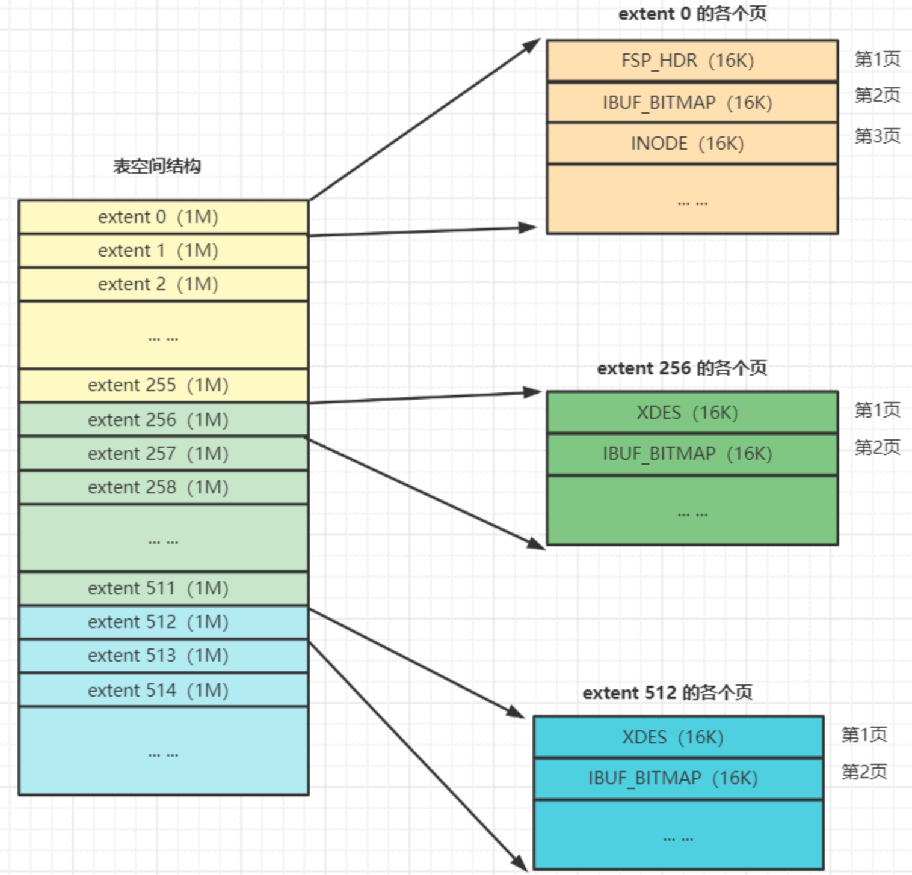
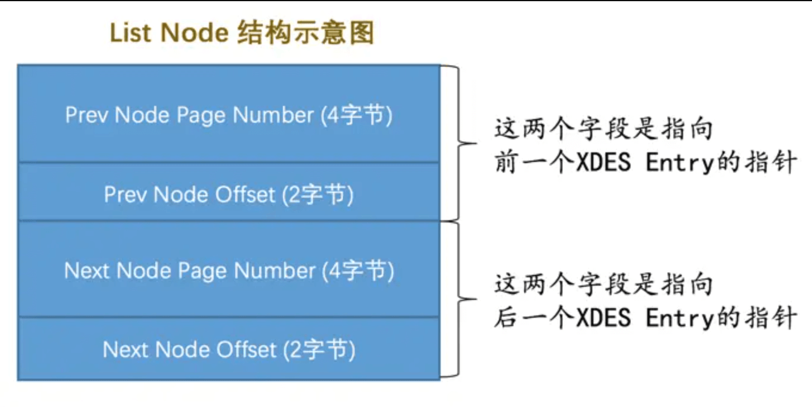

---

id: InnoDB表空间
titile: InnoDB表空间

---

> `表空间`是一个抽象的概念,从管理上可以将表空间分为**系统表空间、独立表空间、临时表空间等**。
> 
> 对于**系统表空间**来说,对应着文件系统中一个或多个实际文件,对于**独立表空间**来说,对应着文件系统中的**ibd文件**

**博客推荐**

[Mysql(独立表空间)数据的存储结构](https://www.cnblogs.com/Godfunc/p/15218704.html)

[MySQL-段、区、组](https://blog.csdn.net/solo_jm/article/details/118962314)

[Innodb表空间](https://blog.csdn.net/jqsfjqsf/article/details/124641547)


## 基本概念

### 页面类型

我们的索引是以 B+Tree 的形式保存到表空间的, **B+Tree 的节点就是索引页,或者叫做数据页**。
在页的 **FILE_HEADER** 中,定义了页面类型 *FILE_PAGE_TYPE*,常见的页面类型有如下的几个

1. **FIL_PAGE_TYPE_ALLOCATED** : 最新分配,还没使用

2. **FIL_PAGE_UNDO_LOG** : Undo 日志页

3. **FIL_PAGE_INODE** : 段信息节点

4. **FIL_PAGE_IBUF_FREE_LIST** : Insert Buffer 空闲列表

5. **FIL_PAGE_IBUF_BITMAP** : Insert Buffer 位图

6. **FIL_PAGE_TYPE_SYS** : 系统页

7. **FIL_PAGE_TYPE_TRX_SYS** : 事务系统数据

8. **FIL_PAGE_TYPE_FSP_HDR** : 表空间头部信息

9. **FIL_PAGE_TYPE_XDES** : 扩展描述页

10. **FIL_PAGE_TYPE_BLOB** : BLOB页

11. **FIL_PAGE_INDEX** : 索引页，也就是我们所说的数据页

### 页通用部分

我们说的数据页就是 FILE_PAGE_TYPE 是 **FILE_PAGE_INDEX** 的页面, 数据页由七部分组成,其中有两部分是**每个页面都有的**

1. `FILE_HEADER`
2. `FILE_TRAILFER`


## 独立表空间结构

### 区(Extent)

表空间的数据页很多,所以引入了区 (extent) 的概念,一个区中包含**连续的 64 个页**,也就是说一个区的默认大小为 1MB。

不管是系统表空间还是独立表空间,都可以看成是由若干个区组成的,然后`按每 256 个区为一组`进行划分。


<br/>

在上述的图中,我们可以看出来, `extent0~extent255` 是第一组,后面同理按照 256 个区分为一组

1. 第一个组最开始的 3 个页面的类型是固定的，也就是说`extent0`这个区最开始的 3 个页面的类型是固定的，分别是:
   
   - `FSP_HDR (FileSpace Header)`
     - 用于记录整个表空间的一些整体属性以及本组所有的区,即**extent0 ~ extent255这 256 个区的属性**
     - <mark>整个表空间只有一个 FSP_HDR 类型的页面。</mark>
   - `IBUF_BITMAP (InsertBuffer BitMap)`
     - 用于存储本组所有的区的所有页面关于`INSERT BUFFER`的信息
   - `INODE`
     - 存储了INODE的数据结构
   
2. 其余各组最开始的 2 个页面的类型是固定的,也就是说extent256、extent512这些区最开始的 2 个页面的类型是固定的,分别是:
   
   - `XDES (Extent Descriptor)`
     - 用来记录本组 256 个区的属性，也就是说对于在extent 256区中的该类型页面存储的就是extent 256 ~ extent 511这些区的属性
     - 作用和第一组的 `FSP_HDR` 类似,只不过 `FSP_HDR` 还额外存储了表空间的一些属性信息
   - `IBUF_BITMAP` : 同上

:::tip 为什么需要区?
我们向表里面插入数据的时候,本质上是往该表的聚簇索引和二级索引中 B+Tree 的各个页中插入数据, 然后多个页之间通过FILE_PAGE_NEXT 和 FILE_PAGE_PREV 形成双向链接。

如果没有引入区,**那么个页之间并不是连续的**, 两个页可能隔得很远, 在涉及到多个页的查询就会变成`随机 IO`。

引入区的概念之后,可以保证**一个区中的页与页之间是连续的**,那么就变成了`顺序 IO`
:::


### 段(Segment)

> 通过引入区可以在一定程度上减少随机IO的次数,但是为啥需要引入段呢?

- **`段不对应表空间的某一连续物理区域,而是一个逻辑概念`。它是由表空间这个物理空间中的若干个零散页面([碎片区](InnoDB表空间#碎片区fragment))和一系列完整的区组成。**

- 拿数据页举例,数据页分为叶子节点和内节点,我们所谓范围查询，其实是对 B+Tree 的叶子节点中的记录进行顺序扫描, 而如果不区分叶子节点和非叶子节点,把所有节点代表的页面放到申请到的区中的话，进行范围扫描的效果就大打折扣了。**所以B+Tree的叶子节点和非叶子节点在存储上是进行一定的区分的,叶子节点有自己独有的区(叶子段),非叶子节点也有自己独有的区(非叶子段)**

### 碎片区(Fragment)

> 默认情况下, 一个使用 InnoDB 存储引擎的表只有一个聚簇索引, 一个索引会生成两个段,而段是以区为单位申请的存储空间。一个区默认占用 `1MB`,所以一个只存了几条记录的小表也需要占用 2MB 的存储空间? 这个会极大的浪费存储空间。

为了优化**以完整的区为单位给某个段分配空间,但是实际存储数据较少的情况**, InnoDB 使用了`碎片区`的技术。在碎片区中,不是所有的页都是存储同一个段的数据的,而是有些页用于段 A,有些用于段 B。`而碎片区直属于表空间,不属于任何一个段`

**所以为某个段分配空间的策略如下:**

1. 刚开始向表中插入数据的时候, B+Tree 的段是从某个碎片区以**单个页面为单位**来分配存储空间的

2. 当某个段已经占用了`碎片区中 32 个页面后`, 就会以**完整的区为单位**分配存储空间, 即直接创建该段附属的空闲区来存储页
   - 注意:  `不会将原来存在碎片区中的复制到新申请的完整的区中, 所以说段是一些完整的区和一些碎片区中的页面组成的` 


### 区的管理

#### 区的分类

**区大体上可以分为 4 种类型:**

1. `Free`
   - **空闲区,只分配了存储空间，但是没使用**
2. `Free_Fragment`
   - **表示某碎片区中还有可用的页面**
3. `Full_Fragment`
   - **表示某碎片区中所有的页面都已经被使用了**
4. `FSEG`
   - **附属于某个段的区,`而不是在碎片区中`**
   - 每个索引都可以分为叶子节点段和非叶子节点段, 除此之外InnoDB还会另外定义一些特殊作用的段,在这些段中的数据量很大时将使用区来作为基本的分配单位

`Free、Free_Fragment 和 Full_Fragment`三种状态的区都是独立的,直属于表空间,而处于`FSEG`状态的区则是直属于某个段, **同时这也是区的 4 种状态,一个区可以在这4种状态间流转**

#### XDES Entry 节点

> 我们知道了区可以分为[Free、Free_Fragment、Full_Fragment、FSEG](InnoDB表空间#区的分类),那么如何管理这些区的呢?

- InnoDb使用**链表**来维护不同类型的区, 链表节点采用 `XDES Entry` 结构,  `每一个区都对应着一个XDES Entry`,**描述了一个区的相关信息**
- <mark>注意: 链表中的节点不是区本身，而是代表区的 XDES Entry</mark>

- **下面这个是XDES Entry 结构:**

  

<br/>

我们可以看到`XDES Entry是一个 40 字节的结构`, 分为下面 4 部分:

1. `Segment ID`
    - `占用 8 字节`
    - **每个段都有唯一的编号, Segment ID用于标识这个区属于哪个段**,当然前提是该区已经被分配给某个段了,比如碎片区就不属于任何段,它属于表空间

2. `List Node`
    - `占用 12 字节`
    - **用于将若干个 XDES Entry 结构串联成一个链表**
    - 下面是 List Node的结构 (**由页号和指定页面内的偏移量组成**):

        

    - 如果想定位表空间内的某一个位置的话,只需`指定页号以及该位置在指定页号中的页内偏移量`即可。所以：
      - Pre Node Page Number + Pre Node Offset : 指向前一个XDES Entry
      - Next Node Page Number + Next Node Offset : 指向后一个XDES Entry


3. `State`
    - `占用 4 字节`
    -  **用于表明区的状态,可选值有`FREE、FREE_FRAG、FULL_FRAG、FSEG`**

4. `Page State Bitmap`
    - `占用 16 字节(128 个比特位)`
    - **描述当前区中64个页的状态，每个页2比特, 第一个比特表示是否空闲，第二个比特位没什么用**

#### XDES Entry 链表

上面我们知道了 XDES Entry 中存在 List Node,可以将多个 XDES Entry 连接形成一个链表,让我们看下向某个段中插入数据的过程:

**`1.当段中存储的页面数量小于 32 的时候, 利用直属于表空间的碎片区进行存储`**

- **FREE 链表、FREE_FRAG 链表、FULL_FRAG 链表**
  - 把状态为 `FREE` 的碎片区对应的 XDES Entry 通过 List Node 来连接成一个 `FREE 链表`
  - 把状态为 `FREE_FRAG` 的碎片区对应的 XDES Entry 结构通过 List Node 来连接成一个 `FREE_FRAG 链表`
  - 把状态为 `FULL_FRAG` 的碎片区对应的 XDES Entry 结构通过 List Node 来连接成一个 `FULL_FRAG 链表`
- **流程**
  - **首先查看表空间中的碎片区中是否有状态为 FREE_FRAG 的区**
    - 如果有的话, 就从该区中取一些零散的页把数据插进去
    - 如果没有的话, 就到表空间下申请一个状态为 FREE 的区, 并把该区的状态变为FREE_FRAG, 然后从该新申请的区中取一些零散的页把数据插进去
  - **之后不同的段使用零散页的时候都会从该区中取,直到该区中没有空闲空间,然后该区的状态就变成了 FULL_FRAG**
- **修改区的状态?** 
  - 比如想找插入数据时(找 FREE_FRAG 状态的区),就直接把 FREE_FRAG 链表的头节点拿出来, 然后**从这个节点中取一些零散的页来插入数据**,当节点的区用完之后,就**修改这个节点的 STATE 字段值为 FULL_FRAG, 然后从FREE_FRAG链表中移到FULL_FRAG链表中**
  - 如果插入数据的时候, 发现 FREE_FRAG 链表中一个节点都没有,就从 FREE 链表中取一个节点移动到 FREE_FRAG链表中, 并修改该节点的 STATE 字段值为 FREE_FRAG, 然后从这个节点对应的区中获取零散的页就好了

**`2.当某个段占用了碎片区中32个页面后, 就申请直属于该段空间的区(FSEG)进行存储`**

- **FREE 链表、NOT FULL 链表、FULL 链表**
  - 段中页包含空闲的区、未使用的区、占满的区, 所以在插入数据的时候需要确定哪些区是空闲的, 哪些是未使用的,哪些是用完的,所以 **InnoDB 为段中 FSEG 类型的区建立了三种链表**
    - `FREE链表`
      - 同一个段中, `所有页面都是空闲的区`对应的 XDES Entry 结构会被加入到这个链表
      - <mark>注意和直属于表空间的 FREE 链表区别开, <strong>此处的FREE链表是附属于某个段的</strong></mark>
    - `NOT_FULL链表`
      - 同一个段中, `仍有空闲空间的区`对应的 XDES Entry 结构会被加入到这个链表
    - `FULL链表`
      - 同一个段中, `已经没有空闲空间的区`对应的 XDES Entry 结构会被加入到这个链表

- **每一个索引都对应两个段, 每个段都会维护上述的 3 个链表**

:::info 示例

**表 t 共有两个索引: 一个聚簇索引，一个二级索引 idx_c2**

```sql
-- 定义一张表,有两个索引
CREATE TABLE t (
    c1 INT NOT NULL AUTO_INCREMENT,
    c2 VARCHAR(100),
    c3 VARCHAR(100),
    PRIMARY KEY (c1),
    KEY idx_c2 (c2)
)ENGINE=InnoDB;
```

这个表共有 4 个段，每个段都会维护上述 3 个链表,总共是 12 个链表, 以及直属于表空间的 3 个链表,整个独立表空间共需要维护 15 个链表

所以段在数据量比较大时插入数据的话，会先获取`NOT_FULL`链表的头节点，直接把数据插入这个头节点对应的区中即可，如果该区的空间已经被用完，就把该节点移到`FULL`链表中。

:::
