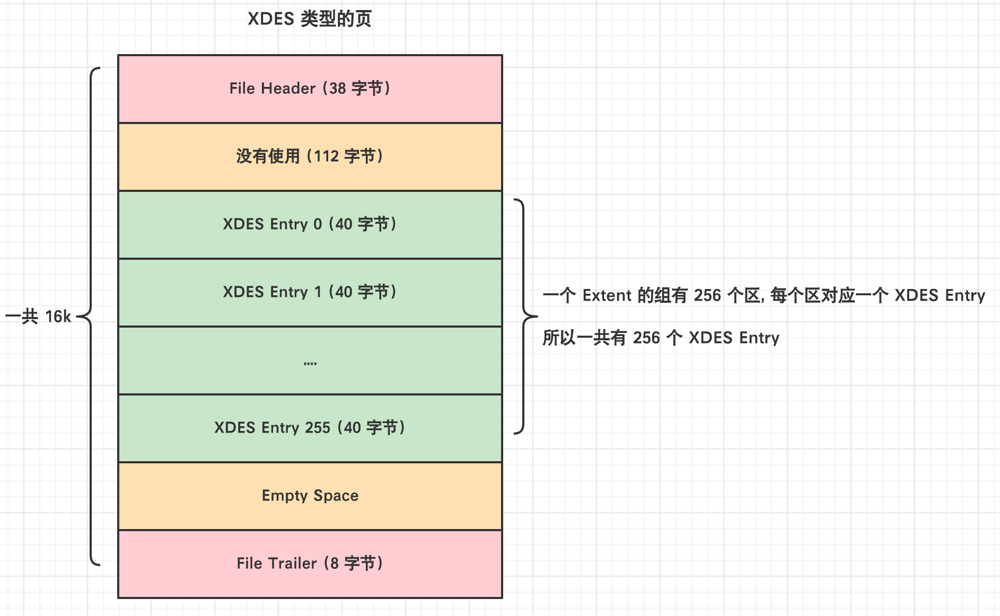

---

id: InnoDB表空间
titile: InnoDB表空间

---

> `表空间`是一个抽象的概念,从管理上可以将表空间分为**系统表空间、独立表空间、临时表空间等**。
> 
> 对于**系统表空间**来说,对应着文件系统中一个或多个实际文件,对于**独立表空间**来说,对应着文件系统中的**ibd文件**

**博客推荐**

[Mysql(独立表空间)数据的存储结构](https://www.cnblogs.com/Godfunc/p/15218704.html)

[MySQL-段、区、组](https://blog.csdn.net/solo_jm/article/details/118962314)

[Innodb表空间](https://blog.csdn.net/jqsfjqsf/article/details/124641547)

[Innodb表空间、段、区描述页分析与磁盘存储空间管理](https://www.cnblogs.com/devsong/p/14848466.html#:~:text=xdes_ent,p_header), [原版站点(英文)](https://blog.jcole.us/innodb/)


## 基本概念

### 页面类型

我们的索引是以 B+Tree 的形式保存到表空间的, **B+Tree 的节点就是索引页,或者叫做数据页**。
在页的 **FILE_HEADER** 中,定义了页面类型 *FILE_PAGE_TYPE*,常见的页面类型有如下的几个

1. **FIL_PAGE_TYPE_ALLOCATED** : 最新分配,还没使用

2. **FIL_PAGE_UNDO_LOG** : Undo 日志页

3. **FIL_PAGE_INODE** : 段信息节点

4. **FIL_PAGE_IBUF_FREE_LIST** : Insert Buffer 空闲列表

5. **FIL_PAGE_IBUF_BITMAP** : Insert Buffer 位图

6. **FIL_PAGE_TYPE_SYS** : 系统页

7. **FIL_PAGE_TYPE_TRX_SYS** : 事务系统数据

8. **FIL_PAGE_TYPE_FSP_HDR** : 表空间头部信息

9. **FIL_PAGE_TYPE_XDES** : 扩展描述页

10. **FIL_PAGE_TYPE_BLOB** : BLOB页

11. **FIL_PAGE_INDEX** : 索引页，也就是我们所说的数据页

### 页通用部分

我们说的数据页就是 FILE_PAGE_TYPE 是 **FILE_PAGE_INDEX** 的页面, 数据页由七部分组成,其中有两部分是**每个页面都有的**

1. `FILE_HEADER`
2. `FILE_TRAILFER`


## 独立表空间结构

### 区(Extent)

表空间的数据页很多,所以引入了区 (extent) 的概念,一个区中包含**连续的 64 个页**,也就是说一个区的默认大小为 1MB。

**不管是系统表空间还是独立表空间,都可以看成是由若干个区组成的**,然后`按每 256 个区为一组`进行划分。


<br/>

在上述的图中,我们可以看出来, `extent0~extent255` 是第一组,后面同理按照 256 个区分为一组

1. 第一个组最开始的 3 个页面的类型是固定的，也就是说`extent0`这个区最开始的 3 个页面的类型是固定的，分别是:
   
   - `FSP_HDR (FileSpace Header)`
     - 用于记录整个表空间的属性以及本组所有的区(即**extent0 ~ extent255这 256 个区的属性**)
     - **整个表空间只有一个 FSP_HDR 类型的页面**
   - `IBUF_BITMAP (InsertBuffer BitMap)`
     - 用于存储本组所有的区的所有页面关于`INSERT BUFFER`的信息
   - `INODE`
     - 存储了INODE的数据结构
   
2. 其余各组最开始的 2 个页面的类型是固定的,也就是说extent256、extent512这些区最开始的 2 个页面的类型是固定的,分别是:
   
   - `XDES (Extent Descriptor)`
     - 用来记录本组 256 个区的属性，也就是说对于在extent 256区中的该类型页面存储的就是extent 256 ~ extent 511这些区的属性
     - 作用和第一组的 `FSP_HDR` 类似,只不过 `FSP_HDR` 还额外存储了表空间的一些属性信息
   - `IBUF_BITMAP` : 同上

:::tip 为什么需要区?
我们向表里面插入数据的时候,本质上是往该表的聚簇索引和二级索引中 B+Tree 的各个页中插入数据, 然后多个页之间通过FILE_PAGE_NEXT 和 FILE_PAGE_PREV 形成双向链接。

如果没有引入区,**那么个页之间并不是连续的**, 两个页可能隔得很远, 在涉及到多个页的查询就会变成`随机 IO`。

引入区的概念之后,可以保证**一个区中的页与页之间是连续的**,那么就变成了`顺序 IO`
:::


### 段(Segment)

> 通过引入区可以在一定程度上减少随机IO的次数,但是为啥需要引入段呢?

- **`段不对应表空间的某一连续物理区域,而是一个逻辑概念`。它是由表空间这个物理空间中的若干个零散页面([碎片区](InnoDB表空间#碎片区fragment))和一系列完整的区组成。**

- 拿数据页举例,数据页分为叶子节点和内节点,我们所谓范围查询，其实是对 B+Tree 的叶子节点中的记录进行顺序扫描, 而如果不区分叶子节点和非叶子节点,把所有节点代表的页面放到缓冲区中的话，进行范围扫描的性能就大大降低了。**所以B+Tree的叶子节点和非叶子节点在逻辑存储上是有区分的,叶子节点有自己独有的区(叶子段),非叶子节点也有自己独有的区(非叶子段)**

### 碎片区(Fragment)

> 默认情况下, 一个使用 InnoDB 存储引擎的表只有一个聚簇索引, 一个索引会生成两个段,而段是以区为单位申请的存储空间。一个区默认占用 `1MB`,所以一个只存了几条记录的小表也需要占用 2MB 的存储空间? 这个会极大的浪费存储空间。

为了优化**以完整的区为单位给某个段分配空间,但是实际存储数据较少的情况**, InnoDB 使用了`碎片区`的技术。在碎片区中,不是所有的页都是存储同一个段的数据的,而是有些页用于段 A,有些用于段 B。`而碎片区直属于表空间,不属于任何一个段`

**所以为某个段分配空间的策略如下:**

1. 刚开始向表中插入数据的时候, B+Tree 的段是从某个碎片区以**单个页面为单位**来分配存储空间的

2. 当某个段已经占用了`碎片区中 32 个页面后`, 就会以**完整的区为单位**分配存储空间, 即直接创建该段附属的空闲区来存储页
   - 注意:  `不会将原来存在碎片区中的复制到新申请的完整的区中, 所以说段是一些完整的区和一些碎片区中的页面组成的` 


### 区的管理

#### 区的分类

**区大体上可以分为 4 种类型:**

1. `Free`
   - **空闲区,只分配了存储空间，但是没使用**
2. `Free_Fragment`
   - **表示某碎片区中还有可用的页面**
3. `Full_Fragment`
   - **表示某碎片区中所有的页面都已经被使用了**
4. `FSEG`
   - **附属于某个段的区,`而不是在碎片区中`**
   - 每个索引都可以分为叶子节点段和非叶子节点段, 除此之外InnoDB还会另外定义一些特殊作用的段,在这些段中的数据量很大时将使用区来作为基本的分配单位

`Free、Free_Fragment 和 Full_Fragment`三种状态的区都是独立的,直属于表空间,而处于`FSEG`状态的区则是直属于某个段, **同时这也是区的 4 种状态,一个区可以在这4种状态间流转**

#### XDES Entry 节点

> 我们知道了区可以分为[Free、Free_Fragment、Full_Fragment、FSEG](InnoDB表空间#区的分类),那么如何管理这些区的呢?

- InnoDb使用**链表**来管理不同类型的区, 链表节点采用 `XDES Entry` 结构,  `每一个区都对应着一个XDES Entry`,**描述了一个区的相关信息**
- <mark>注意: 链表中的节点不是区本身，而是代表区的 XDES Entry</mark>

- **下面这个是XDES Entry 结构:**

  

<br/>

我们可以看到`XDES Entry是一个 40 字节的结构`, 分为下面 4 部分:

1. `Segment ID`
    - `占用 8 字节`
    - **每个段都有唯一的编号, Segment ID用于标识这个区属于哪个段**,当然前提是该区已经被分配给某个段了,比如碎片区就不属于任何段,它属于表空间

2. `List Node`
    - `占用 12 字节`
    - **用于将若干个 XDES Entry 结构串联成一个链表**
    - 下面是 List Node的结构 (**由页号和指定页面内的偏移量组成**):

        

    - 如果**想定位表空间内的某一个位置**的话,只需`指定页号以及该位置在指定页号中的页内偏移量`即可(意味着可以定位到具体的页)。所以：
      - Pre Node Page Number + Pre Node Offset : 指向前一个XDES Entry
      - Next Node Page Number + Next Node Offset : 指向后一个XDES Entry

3. `State`
    - `占用 4 字节`
    -  **用于表明区的状态,可选值有`FREE、FREE_FRAG、FULL_FRAG、FSEG`**

4. `Page State Bitmap`
    - `占用 16 字节(128 个比特位)`
    - **描述当前区中64个页的状态，每个页2比特, 第一个比特表示是否空闲，第二个比特位没什么用**

#### XDES Entry 链表

上面我们知道了 XDES Entry 中存在 List Node,可以将多个 XDES Entry 连接形成一个链表,让我们看下向某个段中插入数据的过程:

**`1.当段中存储的页面数量小于 32 的时候, 利用直属于表空间的碎片区进行存储`**

- **FREE 链表、FREE_FRAG 链表、FULL_FRAG 链表**
  - 把状态为 `FREE` 的碎片区对应的 XDES Entry 通过 List Node 来连接成一个 `FREE 链表`
  - 把状态为 `FREE_FRAG` 的碎片区对应的 XDES Entry 结构通过 List Node 来连接成一个 `FREE_FRAG 链表`
  - 把状态为 `FULL_FRAG` 的碎片区对应的 XDES Entry 结构通过 List Node 来连接成一个 `FULL_FRAG 链表`
- **插入数据的流程**
  - **首先查看表空间中的碎片区中是否有状态为 FREE_FRAG 的区**
    - 如果有的话, 就从该区中取一些零散的页把数据插进去
    - 如果没有的话, 就到表空间下申请一个状态为 FREE 的区, 并把该区的状态变为FREE_FRAG, 然后从该新申请的区中取一些零散的页把数据插进去
  - **之后不同的段使用零散页的时候都会从该区中取,直到该区中没有空闲空间,然后该区的状态就变成了 FULL_FRAG**
- **修改区的状态?** 
  - 比如想找插入数据时(找 FREE_FRAG 状态的区),就直接把 FREE_FRAG 链表的头节点拿出来, 然后**从这个节点中取一些零散的页来插入数据**,当节点的区用完之后,就**修改这个节点的 STATE 字段值为 FULL_FRAG, 然后从FREE_FRAG链表中移到FULL_FRAG链表中**
  - 如果插入数据的时候, 发现 FREE_FRAG 链表中一个节点都没有,就从 FREE 链表中取一个节点移动到 FREE_FRAG链表中, 并修改该节点的 STATE 字段值为 FREE_FRAG, 然后从这个节点对应的区中获取零散的页就好了

**`2.当某个段占用了碎片区中32个页面后, 就申请直属于该段空间的区(FSEG)进行存储`**

- **FREE 链表、NOT FULL 链表、FULL 链表**
  - 段中页包含空闲的区、未使用的区、占满的区, 所以在插入数据的时候需要确定哪些区是空闲的, 哪些是未使用的,哪些是用完的,所以 **InnoDB 为段中 FSEG 类型的区根据区的空间利用率建立了三种链表**
    - `FREE链表`
      - 同一个段中, `所有页面都是空闲的区`对应的 XDES Entry 结构会被加入到这个链表
      - <mark>注意和直属于表空间的 FREE 链表区别开, <strong>此处的FREE链表是附属于某个段的</strong></mark>
    - `NOT_FULL链表`
      - 同一个段中, `仍有空闲空间的区`对应的 XDES Entry 结构会被加入到这个链表
    - `FULL链表`
      - 同一个段中, `已经没有空闲空间的区`对应的 XDES Entry 结构会被加入到这个链表

  - **每一个索引都对应两个段, 每个段都会维护上述的 3 个链表**

- **怎么确定区属于哪个段呢?**
  - <mark>XDES Entry 中不是有 Segment ID么?利用这个可以确定链表属于哪个段</mark>


:::info 示例

**表 t 共有两个索引: 一个聚簇索引，一个二级索引 idx_c2**

```sql
-- 定义一张表,有两个索引
CREATE TABLE t (
    c1 INT NOT NULL AUTO_INCREMENT,
    c2 VARCHAR(100),
    c3 VARCHAR(100),
    PRIMARY KEY (c1),
    KEY idx_c2 (c2)
)ENGINE=InnoDB;
```

这个表共有 4 个段，每个段都会维护上述 3 个链表,总共是 12 个链表, 以及直属于表空间的 3 个链表,整个独立表空间共需要维护 15 个链表

所以段在数据量比较大时插入数据的话，会先获取`NOT_FULL`链表的头节点，直接把数据插入这个头节点对应的区中即可，如果该区的空间已经被用完，就把该节点移到`FULL`链表中。

:::

#### 链表基节点
> 我们了解了,区可以通过不同的链表"连接"起来, 并且可以将区的XDES Entry 挂链表的尾部,也可以从链表开始遍历。那么这个链表在哪呢? 换句话说,链表的头节点、尾节点在哪?

InnoDB 设计了 `List Base Node` 的结构,也就是**链表的基节点**, 这个结构中包含了`链表的节点数、首尾XDES节点的地址(页号和页内偏移)`的信息,具体结构图如下:

​	

<br/>

**List Base Node结构说明**
1. `List Length` : 该链表一共有多少节点
2. `First Node Page Number + First Node Offset` : 该链表的头节点在表空间中的位置
3. `Last Node Page Number + Last Node Offset` : 该链表的尾节点在表空间中的位置

<mark>一般我们把某个链表对应的 List Base Node 结构放置在表空间中固定的位置</mark>

#### 链表小结

1. 表空间是由若干个区组成的,每个区都 `对应`一个 XDES Entry
    - **直属于表空间的区对应的 XDES Entry 可以分成 FREE、FREE_FRAG、FULL_FRAG 这 3 个链表**
    - **每个段可以附属若干个区, 每个段中的区对应的 XDES Entry 可以分成FREE、NOT_FULL、FULL 这 3 个链表**

2. 每个链表都对应一个 List Base Node 的, 这个结构里记录了链表的头、尾节点的位置以及该链表中包含的节点数

### 段结构(INODE Entry)

我们知道段是一个逻辑概念, InnoDB 使用 `INODE Entry` 结构将段这个抽象概念具象化。像每个区都有对应的 XDES Entry 来记录这个区中的属性一样, InnoDB 为`每个段`都定义了一个 `INODE Entry `结构来记录一下段中的属性:


**INODE Entry 的各个部分含义如下：**

1. `Segment ID`
    - **指 INODE Entry 结构对应的段的编号(ID)**

2. `NOT_FULL_N_USED`
    - **在 NOT_FULL 链表中已经使用了多少个页面**

3. `List Base Node`
    - **有三个 List Base Node, 分别为段的 FREE链表、NOT_FULL链表、FULL链表的链表[基节点](InnoDB表空间#链表基节点)**
    - 想查找某个段的某个链表的头节点和尾节点的时候, 就可以直接到这个部分找到对应链表的List Base Node

4. `Magic Number`
    - **魔数, 用来标记这个 INODE Entry 是否已经被初始化(即把各个字段的值都填进去)**
    - 如果这个数字是值的 97937874,表明该INODE Entry已经初始化，否则没有被初始化

5. `Fragment Array Entry`
    - 段是由**完整的区和碎片区中零散的页面**组成的, **每个Fragment Array Entry 都对应着一个零散的页面的**
    - `一共有32 个, 每个占用 4 个字节表示一个碎片区零散页面的页号`

### 各类型页面

> 我们知道了,通过 XDES Entry 可以将不同类型的区连接起来,也可以使用 INODE Entry 来描述段结构
> 
> 那么,每个区的 XDES Entry 存储在哪里? 
> 
> 直属于表空间的FREE、FREE_FRAG、FULL_FRAG链表的基节点到底存储在表空间的什么地方?
>
> 每个段对应的 INODE Entry 到底存在表空间的什么地方?

#### FSP_HDR页
表空间中以 `256` 个区为一组,其中第一组中的 extend0 的第一个页是 `FSP_HDR` 页,它存储了**表空间的一些整体属性以及第一个组内 256 个区的对应的 XDES Entry**

**下面是 FSP_HDR 类型页面的结构:**


<br/>

**可以看到,一个完整的 FSP_HDR 页面由下面五个部分组成:**
1. `File Header`
    - [文件头部,这个是页的通用部分](InnoDB数据页结构#文件头file-header)
    - 定义了页面的简单描述信息
2. `File Space Header`
    - **表空间头部,定义了表空间的一些整体的[描述信息](InnoDB表空间#file-space-header)**
3. `XDES Entry`
    - 区描述信息,存储本组 256 个区对应的[属性信息](InnoDB表空间#xdes-entry-节点)
4. `Empty Space`
   - **没有使用空间,用于页结构的填充,没有实际意义**

5. `File Trailer`
   - [文件尾部,这个是页的通用部分](InnoDB数据页结构#文件尾file-trailer)


##### File Space Header

**File Space Header 中有下面几个主要的属性:**

1. `List Base Node for FREE | FREE_FRAG | FULL_FRAG List`
    - **分别是直属于表空间的 FREE 链表、FREE_FRAG链表、FULL_FRAG链表的基节点**
    - 也就是说这三个链表的基节点在表空间的位置是固定的, 在表空间的第一个页面(FSP_HDR)的File Space Header部分

2. `FREE Limit`
    - 表空间实际上对应着磁盘的一个文件,一开始创建表空间的时候对应的磁盘文件是没有数据的,所以`需要对表空间进行初始化`
      - **为表空间中的区建立 XDES Entry 结构**
      - **为每个段建立 INODE Entry 结构**
      - **建立各种链表**
      - ...
    - **InnoDB 将一部分空闲区的 XDES Entry 放在 FREE 链表中,如果后面 FREE 链表中 XDES Entry 对应的区不够用了,再把之前没有加入 FREE 链表的空闲区对应的 XDES Entry 结构加入FREE链表**
    - `在该字段表示的页号之前的区都被初始化了, 之后的区尚未被初始化`

3. `Next Unused Segment ID`
    - **表明当前表空间中最大的段 ID 的下一个 ID**
    - 每个索引对应两个段,那么每次新加一个索引都会"创建"两个段,那么如何保证表空间中`段 ID` 的唯一呢?如果遍历所有的段那么会耗费相当的时间, 所以InnoDB 在表空间属性中定义了 *Next Unused Segment ID* 字段
    - **每次新加一个段的时候,只需要直接使用这个属性值, 然后再自增一下就可以了**

4. `List Base Node for SEG_INODES_FULL | SEG_INODES_FREE List`
   
    - **默认情况下,每个段对应的 INODE Entry 会放在`INODE`页中**, 但是在表空间段特别多的情况下,一个 INODE 页中放不下 INODE Entry , 这些 INODE 类型的页会组成两种列表
      - `SEG_INODES_FULL 链表` 
        - 该链表中的 INODE 类型的页面都已经被INODE Entry 结构填充满了，没空闲空间存放额外的INODE Entry了
      - `SEG_INODES_FREE 链表`
       - 该链表中的 INODE 类型的页面仍有空闲空间来存放 INODE Entry 结构
     <br/>

**FileSpace Header结构表格说明:**

   | 属性                               | 大小(字节) | 描述                                                         |
   | ---------------------------------- | ---------- | ------------------------------------------------------------ |
   | `Space ID`                          | **4**      | 表空间的 ID                               |
   | `Not Used`                          | **4**      | 这 4 个字节未被使用，可以忽略 |
   | `Size`                              | **4**      | **当前表空间拥有的页的数量**                                         |
   | `Free Limit`                        | **4**      | 没有被初始化的最小页号,大于或等于该页号所在的区的 XDES Entry 都没有被加入 FREE 链表|
   | `Space Flags`                       | **4**      | 表空间的一些占用存储空间比较小的属性                            |
   | `FRAG_N_USED`                       | **4**      | **FREE_FRAG 链表中已使用的页面数**                              |
   | `List Base Node for FREE List`      | **16**     | **FREE 链表的基节点**|
   | `List Base Node for FREE_FRAG List` | **16**     | **FREE_FRAG 链表的基节点**|
   | `List Base Node for FULL_FRAG List` | **16**     | **FULL_FRAG 链表的基节点**|
   | `Next Unused Segment ID`            | **8**      | **当前表空间中下一个未使用的 Segment ID**|
   | `List Base Node for SEG_INODES_FULL List`            | **16**     | **SEG_INODES_FULL 链表的基节点**|
   | `List Base Node for SEG_INODES_FREE List`            | **16**     | **SEG_INODES_FREE 链表的基节点**|


##### XDES Entry

紧接着File Space Header部分的就是 `XDES Entry` 了, 每一组区里面第一个页都会存储 XDES Entry,extent0 中的`FSP_HDR` 也不例外, 并且**每个区对应的 XDES Entry 的地址是固定的**


#### XDES页
> 每一个 XDES Entry 都会对应一个区,并且可以通过其中的 List Node 中的 `Page Number` 和 `Offset` 定位到具体的页中的具体位置,而这些 XDES Entry 信息就存储在 XDES 页中

- 在实际开发中,**表空间中会有大量的区,那随之也会有大量的 XDES Entry 节点,那么一个页肯定无法存储这么多的 XDES Entry,因此 InnoDB 以 256 个区为一组对表空间进行划分**, 然后**每一组的第一个区的第一个页**中存储着当前组中 `256` 个区的 XDES Entry

- 上面提到的 `FSP_HDR页` 比较特殊,除了记录了 **XDES Entry** 的信息,还记录了**表空间的属性**, 当然了整个表空间只有这一个这种类型的页, **随后的每一组区的 XDES Entry 都会被存储该分组的第一个页,**也就是`XDES 页`

**XDES 页 除了没有 FSP_HDR 页的 FileSpace Header 以外,其他都是一样的:**




#### INODE页

> 在前面的表空间结构图中说过,第一组的第一个区 (extent0) 的最前面的三个页是固定的(FSP_HDR、IBUF_BITMAP、INODE)。
> 
> 每个表在表空间中默认有两个段,而且某些特殊功能还有一些特殊的段,为了便于管理这些段, InnoDB 还设计了 INODE Entry 用于存储段的信息,那这些 INODE Entry 就存储在 INODE 页中

**INODE页的结构图:**


<br/>

从上面的结构图可以看出来, INODE 页有下面几部分组成:

  | 属性                               | 大小(字节) | 描述                                                         |
  | ---------------------------------- | ---------- | ------------------------------------------------------------ |
  | `File Header`                      | **38**      | 页的一些通用信息                               |
  | `List Node for INODE Page List`    | **12**     | **通用链表节点,存储上一个 INODE 页面和下一个 INODE 页面的指针**|
  | `INODE Entry`                      | **16320**      | **段描述信息**|
  | `Empty Space`                      | **6**     | 用于页结构的填充，没啥实际意义|
  | `File Trailer`                     | **8**     | 校验页是否完整 |

<br/>

**下面是几个常见的部分:**

1. `INODE Entry`
   - [详细可见](/InnoDB表空间#段结构inode-entry)
   - 主要包含了**附属于该段的 FREE、FULL、NOT_FULL 链表的基节点以及该段的零散页面的地址(Fragmen Array Entry)**

2. `List Node for INODE Page List`
   - 一个 INODE 页最多存储 `85` 个 INODDE Entry,所以一个 INODE 页不足以存储所有的段对应的 INODE Entry,所以需要额外的 INODE 页面来存储这些结构
   - InnoDB 为了管理 INODE 页, 和XDES Entry 类似的,页将这些INODE 页**串联成两个不同的列表**
     - `SEG_INODES_FULL` : 该链表中的 INODE 页中已经没有空闲空间来存储额外的 INODE Entry
     - `SEG_INODES_FREE` : 该链表中的 INODE 页中还有空闲空间来存储额外的INODE Entry
   - 在 `FSP_HDR` 的 [File Space Header](InnoDB表空间#file-space-header)中存储了 *SEG_INODES_FULL、SEG_INODES_FREE* 的基节点

:::info 创建段

每次新创建一个段(比如创建索引)时,都会创建一个INODE Entry与之对应，存储 INODE Entry的大致过程就是这样的:

- 先看 `SEG_INODES_FREE` 链表是否为空
   - **如果不为空**,直接从该链表中获取一个节点,也就相当于获取到一个仍有空闲空间的 INODE 页, 然后把该 INODE Entry 存储到该页面中。当该页面中无剩余空间时,就把该页放到 `SEG_INODES_FULL 链表`
   - **如果为空**, 则从`表空间的 FREE_FRAG 链表` 中申请一个页面, `修改该页面的类型为 INODE`, 把该页面`放到 SEG_INODES_FREE 链表中`, 与此同时把该 INODE Entry 存储到该页面中
   :::

### Segment Header
## 系统表空间

> 我们知道,InnoDB 的表空间除了独立表空间之外,还有很多的表空间,比如`系统表空间`。

### 表空间的结构

系统表空间与独立表空间的一个非常明显的不同之处就是在`系统表空间开头有许多记录整个系统属性的页面`,如图:


<br/>

可以看到, `系统表空间`和独立表空间的前三个页面(页号分别为 `0、1、2`，类型分别是 `FSP_HDR、IBUF_BITMAP、INODE` )的类型是一致的,只是页号为 `3~7` 的页面是系统表空间特有的：


  |页号         | 页面类型                    | 英文描述                     | 描述                                                         |
  | ---------- | -------------------------- | --------------------------- | ------------------------------------------------------------ |
  | **3**      | `SYS`                      | **Insert Buffer Header**    | **存储 Insert Buffer 的头部信息**                              |
  | **4**      | `INDEX`                    | **Insert Buffer Root**      | **存储 Insert Buffer 的根页面**                                |
  | **5**      | `TRX_SYS`                  | **Transction System**       | **事务系统的相关信息**                                          |
  | **6**      | `SYS`                      | **First Rollback Segment**  | **第一个回滚段的页面**                                          |
  | **7**      | `SYS`                      | **Data Dictionary Header**  | **数据字典头部信息**                                            |


#### InnoDB 数据字典

- 使用 `INSERT` 语句向表中插入的那些记录称之为**用户数据**, MySQL 只是作为一个软件来为我们来保管这些数据,提供方便的增删改查接口而已。

- 但是每当我们向一个表中插入一条记录的时候, **MySQL 先要校验一下插入语句对应的表存不存在,插入的列和表中的列是否匹配**。如果语法没有问题的话, 还需要知道**该表的聚簇索引和所有二级索引对应的根页面是哪个表空间的哪个页面**,然后把记录插入对应索引的B+树中

- 所以 MySQL 除了保存着插入的用户数据之外, 还需要保存许多额外的信息,比方说：
  - 某个表属于哪个表空间，表里边有多少列
  
  - 表对应的每一个列的类型是什么

  - 该表有多少索引，每个索引对应哪几个字段，该索引对应的根页面在哪个表空间的哪个页面
  
  - 该表有哪些外键，外键对应哪个表的哪些列
  
  - 某个表空间对应文件系统上文件路径是什么

  - ...

这些数据并不是使用 INSERT 语句插入的用户数据, 实际上是为了更好的管理我们这些用户数据而不得已引入的一些额外数据, 这些数据也称为`元数据`。InnoDB 存储引擎特意定义了一些列的内部系统表(`internal system table`)来记录这些这些元数据:

  |表名                 | 描述                                   | 
  | ------------------ | -------------------------------------- | 
  | `SYS_TABLES	`      | **所有的表的信息**                       | 
  | `SYS_COLUMNS`      | **所有的列的信息**                       | 
  | `SYS_INDEXES`      | **所有的索引的信息**                     | 
  | `SYS_FIELDS`       | **所有的索引对应的列的信息**              | 
  | `SYS_FOREIGN`      | **所有的外键的信息**                     | 
  | `SYS_FOREIGN_COLS` | **所有的外键对应列的信息**                | 
  | `SYS_TABLESPACES`  | **所有的表空间信息**                     | 
  | `SYS_DATAFILES`    | **所有的表空间对应文件系统的文件路径信息**   | 
  | `SYS_VIRTUAL`      | **所有的虚拟生成列的信息**                | 

<br/>

这些**系统表也被称为`数据字典`**, 它们都是以 B+Tree 的形式保存在系统表空间的某些页面中,其中` SYS_TABLES、SYS_COLUMNS、SYS_INDEXES、SYS_FIELDS` 这四个表尤其重要,称之为`基本系统表`(basic system tables)


## 总结

