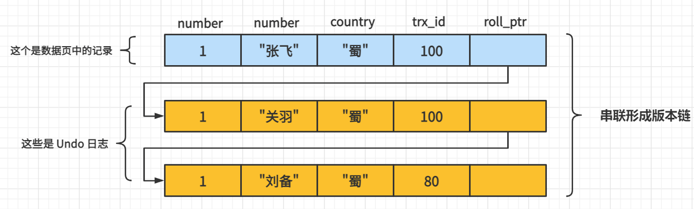

> 为了保证并发事务下,解决读-写操作下的脏读、不可重复读、幻读的并发问题,MySQL 的 InnoDB 可以加锁,同时也引入了 MVCC(Multiversion Concurrency Control)来提升并发性能, 也就是多版本并发控制。
>
> MVCC 的实现依赖于**隐藏字段、Undo 日志和 ReadView**

## 什么是 MVCC

MVCC 是通过 **管理数据行的多个版理来实现数据库的并发控制**, 利用 MVCC 可以保证在 InnoDB 的事务隔离级别下执行 **一致性读**操作。

也就是说: **为了查询一些正在被另一个事务更新的行, 并且可以看到它们被更新之前的值，这样在做查询的时候就不用等待另一个事务释放锁**

:::tip 拓展说明

MVCC 没有正式的标准,所以在不同的 DBMS 上也有不同的实现,也不是普通使用的

MVCC的两种不同实现方式:

1. **将数据记录的多个版本保存在数据库中,当这些不同版本数据不再需要时,垃圾收集器回收这些记录**
   - 这个方式被PostgreSQL和Firebird/Interbase采用
   - Sql Server使用的类似机制, 不同的是旧版本数据不是保存在数据库中, 而是保存在不同于主数据库的另外一个数据库*tempdb*中
2. **只在数据库保存最新版本的数据，但是会在使用undo时动态重构旧版本数据**
   - 这种方式被Oracle和MySQL/InnoDB使用

:::

## 快照读与当前读

- **快照读** 
  - MVCC在 MySQL InnoDB中的实现主要是**为了提高数据库并发性能**，用更好的方式去处理`读-写冲突`，做到即使有读写冲突时，也能做到不加锁，非阻塞并发读，而这个读指的就是`快照读`,而非当前读 
- **当前读** 
  - **实际上是一种加锁的操作,是悲观锁的实现**。而MVCC本质是采用乐观锁思想的一种方式

### 快照读

- 也叫做`一致性读`,读取的是`快照数据`,而不是当前的数据。**不加锁的简单的 Select 都属于快照读, 即不加锁的非阻塞读**

  ```sql
  -- 比如:
  select * from player where ...
  ```

- 之所以使用快照读,是为了提高并发性能。快照读是**基于 MVCC** 的,在一定程度上避免了**加锁的操作**,降低的开销

- 由于是多版本,那么快照读可能读到的不一定是最新的数据,而是历史数据

- **能够使用快照读的基本条件是: 隔离级别不是串行化,串行化的快照读会退化为当前读**

### 当前读

- 当前读读取的是记录是最新版本(最新数据,而不是历史版本数据),**读取的时候还需要保证其他并发的事务不能修改当前的记录,所以会对读取的记录加锁**

- 加锁的 SELECT、对数据进行增删改都会进行当前读

  ```sql
  -- 比如:
  
  # S锁
  select * from player lock in share mode;  
  
  # X 锁
  select * from player for update;
  insert into player(...) values ...;
  delete from player where ...;
  update player set ...;
  
  ```

## 隔离级别与 MVCC

### MySQL 隔离级别

> 
>
> <br/>
>
> 我们知道,SQL有四种隔离级别:*Read Uncommitted、Read Committed、Repeatable Read、Serializable*,分别能处理四种事务并发问题:*脏写、脏读、不可重复读、幻读*

在 MySQL 中,默认的隔离级别是`repeatable read [可重复读]`, 可以解决**脏读和不可重复读**的问题。从SQL 标准上来说,该隔离级别无法处理`幻读`的问题,如果需要处理幻读的问题,需要提高事务的隔离级别,也就是使用`serializable [串行化]`的隔离级别,但是**会降低事务的并发能力**

MySQL 中 InnoDB 存储引擎实现的`MVCC 机制`可以在`不加锁`(不使用悲观锁)的情况下,而是使用`乐观锁`的方式解决**不可重复读和幻读的问题**, MVCC 在大多数的情况下可以代替加锁的方式,从而降低加锁带来的系统开销


### 隐藏字段与 Undo日志版本链

我们知道 InnoDB 每个数据页的**聚簇索引**的记录中一定包含下面[两个隐藏字段:ROW_TRX_ID、ROW_ROLL_PTR](InnoDB数据页结构#记录的真实数据)

1. `row_trx_id`

   - **最近一次更新该记录的事务 ID**

   - 一个事务每次对某条聚簇索引的记录进行修改时,都会将该事务的 事务ID 赋值给 *row_trx_id*

2. `row_roll_ptr`

   - **回滚指针**,通过回滚指针可以将多个 undo 日志以链表的方式连接起来
   - 每次对某条聚簇索引的记录进行修改时,都会把就得版本写入到 undo 日志中, 这个隐藏列就相当于是一个**指针**,通过它可以**找到该记录修改前的值**

:::info 版本链示例

**假设我们有表 hero,里面的数据如下:**

```sql
mysql> SELECT * FROM hero;
+--------+--------+---------+
| number | name   | country |
+--------+--------+---------+
|      1 | 刘备   | 蜀      |
+--------+--------+---------+
1 row in set (0.07 sec)
```

假设需要插入一条新的记录,且插入的新记录的`事务id`为`80`，那么此刻该条记录的示意图如下所示：


<br/>

假设之后两个`事务id`分别为`100`、`200`的事务对这条记录进行`UPDATE`操作，操作流程如下：


<br/>

每次对记录进行改动,都会记录一条`undo日志`，每条`undo日志`也都有一个`roll_pointer`属性（`INSERT`操作对应的`undo日志`没有该属性，因为该记录并没有更早的版本），可以将这些`undo日志`都连起来，串成一个链表，所以现在的情况就像下图一样：


<br/>

- 对该记录每次更新后，都会将旧值放到一条`undo日志`中，就算是该记录的一个旧版本，随着更新次数的增多，所有的版本都会被`roll_pointer`属性连接成一个链表，我们把这个链表称之为`版本链`，版本链的头节点就是当前记录最新的值
- 每个版本中还包含生成该版本时对应的`事务id`

**说明**

1. **实际上 insert undo 只在事务回滚时起作用**

   - 当事务提交后，该类型的 undo 日志就没用了，它占用的 Undo Log Segment 也会被系统回收

   - 也就是该 undo 日志占用的 Undo 页面链表要么被重用，要么被释放

2. **不能在两个事务中交叉的更新同一条记录,因为 X 锁的存在**

3. <mark>update产生的 undo日志中只会记录一些索引列以及被更新的列的信息,而不是所有列的信息。</mark> 

     - 比如对于**trx_id=80**的版本记录来说,是没有 country 列的信息的
     - **如果某个列的信息不存在于 undo日志中,那么说明该版本的该列信息与上一个版本是一致的**
       - 所以,如果某条记录的某个列从未被更新过,那么该列的值就是聚簇索引中该记录对应的值

:::

## ReadView

> 在 MVCC 机制中,多个事务对同一个记录进行更新就会产生多个历史快照,这些历史快照保存在 Undo日志中。如果一个事务需要查询这行记录,那么需要读取哪个版本的行记录呢?这个就需要使用 ReadView

#### 概述

- ReadView 就是**一个事务在 MVCC 机制下进行[`快照读操作`](MVCC#快照读)产生的`读试图`**

- **当事务启动时,会自动的生成数据库系统当前的快照, 而 InnoDB 为“存储”每个事务构造了一个`数组`,用于记录并且维护系统当前`活跃事务的 ID`**
  - **活跃事务:启动了但是没有提交的事务**

### 设计思路

1. 使用 `read uncommitted` 隔离级别的事务, 由于可以读到未提交事务修改过的记录，所以**直接读取记录的最新版本**

2. 使用 `serializable` 隔离级别的事务，InnoDB 规定使用**加锁**的方式来访问记录
3. 使用 `read committed` 和 `repeatable read` 隔离级别的事务, 都**必须保证读到已经提交了的 事务修改 过的记录**
   - 假如另一个事务已经修改了记录但是尚未提交，是不能直接读取最新版本的记录的，**核心问题就是需要判断一下版本链中的哪个版本是当前事务可见的，这是ReadView要解决的主要问题**

**ReadView中包含 4 个重要的部分,分别是:**

1. `m_ids`

   - 表示在生成 ReadView 时, 当前系统中所有活跃的读写事务的`事务id`列表

2. `min_trx_id`

   - 创建 ReadView 时,当前系统中所有活跃的读写事务中最小的`事务id`，也就是`m_ids`中的最小值
   - 如果 *m_ids* 为空,则为 **max_trx_id**

3. `max_trx_id`

   - 创建 ReadView 时, 系统中应该分配给`下一个事务的id`值

     :::caution max_trx_id说明

     **max_trx_id并不是 m_ids 中的最大值, 事务id是递增分配的**

     比方说现在有id为1，2，3这三个事务, 之后id为3的事务提交了。那么一个新的读事务在生成ReadView时，trx_ids 就包括1和2，min_trx_id=1，max_trx_id = 4

     :::

4. `creator_trx_id`

   - 创建该 ReadView 的事务的`事务id`

     :::tip 说明

     只有在对表中的记录做改动时（执行INSERT、DELETE、UPDATE这些语句时）才会为事务分配事务id，否则在一个只读事务中的事务id值都默认为0

     :::

### ReadView 规则

有了 *ReadView*，这样在访问某条记录时,只需要按照下边的步骤**判断记录的某个版本是否可见**：

1. 被访问版本的`trx_id` **=**  *ReadView* 中的`creator_trx_id`
   - **当前事务在访问它自己修改过的记录,所以该版本可以被当前事务访问**
2. 被访问版本的`trx_id` **<**  *ReadView* 中的`min_trx_id`
   - **生成该版本的事务在当前事务创建 *ReadView* 前已经提交，所以该版本可以被当前事务访问**
3. 被访问版本的`trx_id` **>=**  *ReadView* 中的`max_trx_id`
   - **生成该版本的事务在当前事务生成 *ReadView* 后才开启，所以该版本不可以被当前事务访问**
4. 被访问版本的`trx_id`  在  *ReadView*  `(min_trx_id, max_trx_id)`之间
   - 需要判断一下`trx_id`属性值是不是在`m_ids`列表中
     - 如果在,  说明创建 *ReadView* 时生成该版本的事务还是活跃的，该版本不可以被访问
     - 如果不在, 说明创建 *ReadView* 时生成该版本的事务已经被提交，该版本可以被访问

### MVCC整体操作流程

当查询一条记录的时候,系统利用 MVCC 通过以下步骤找到它:
1. 首先获取事务自己的**事务 ID**
2. 获取 ReadView
3. 查询得到的数据, 然后与 ReadView 中的事务版本号进行比较
4. 如果不符合 ReadView 规则, 就需要从 Undo Log 中获取历史快照
5. 最后返回符合规则的数据

:::caution 注意

1. 如果某个版本的数据对当前事务不可见的话，那就顺着版本链找到下一个版本的数据，继续按照上边的步骤判断可见性，依此类推，直到版本链中的最后一个版本

2. 如果最后一个版本也不可见的话，那么就意味着该条记录对该事务完全不可见，查询结果就不包含该记录

3.   InnoDB 中, MVCC 是通过 Undo日志 + ReadView 进行数据读取。Undo日志保存了历史快照,而 ReadView 则帮助判断当前版本的数据是否可见

:::

### ReadView 生成时机

在 MySQL 中, *READ COMMITTED*  和 *REPEATABLE READ* 隔离级别的的一个非常大的区别就是它们生成 ReadView 的时机不同。以表`hero`为例来，假设现在表`hero`中只有一条由`事务id`为`80`的事务插入的一条记录：

```sql
mysql> SELECT * FROM hero;
+--------+--------+---------+
| number | name   | country |
+--------+--------+---------+
|      1 | 刘备    | 蜀      |
+--------+--------+---------+
1 row in set (0.07 sec)
```

#### Read Committed

- Read Committed 隔离级别 `在每次读取数据前都创建一个 ReadView`

:::info 示例说明

**假设当前系统的中有两个事务(T1、T2)正在执行,它们的 事务id 分别是:trx_100,trx_200:**

```sql title="T1: trx_100"
-- 事务并没有提交
BEGIN;

UPDATE hero SET name = '关羽' WHERE number = 1;
UPDATE hero SET name = '张飞' WHERE number = 1;

```

```sql title="T2: trx_200"
-- 事务并没有提交
BEGIN;

# 更新了一些别的表的记录
...

```

<mark><strong>注意:</strong>事务执行过程中,只有在第一次真正修改记录时（比如使用INSERT、DELETE、UPDATE),才会被分配一个单独的事务id，这个事务id是递增的。所以在 T2 中更新一些别的表的记录,目的是让它分配事务id。</mark>

<br/>

那么此时经过事务 T1 中的两次 *update* 之后, number=1 的记录对应的版本链如下:



<br/>

假设现在有一个使用 `READ COMMITTED` 隔离级别的事务开始执行:

```sql
-- 使用READ COMMITTED隔离级别的事务
BEGIN;

-- SELECT1: 由于T1、T2 未提交,所以得到的列name的值为'刘备'
SELECT * FROM hero WHERE number = 1; 

```

上面的这个 **SELECT1** 的执行过程如下:

1. 首先在执行 Select 语句(使用快照读)的时候会创建一个 *ReadView* , 该 readview 的属性如下:
   - *m_ids*: [100, 200]
   - *min_trx_id*: 100
   - *max_trx_id*: 201
   - *creator_trx_id*: 0

2. 然后会**从版本链中挑选可见的记录**, 从上面的图中可以看到,最新版本的 name='张飞', 该版本的 trx_id=100, **在m_ids列表内，所以不符合可见性要求,所以根据roll_pointer跳到下一个版本**

3. 下一个版本的 name='关羽', 该版本的 trx_id=100。也在m_ids列表内，所以也不符合要求，继续跳到下一个版本。

4. 下一个版本的列name的内容是'刘备'，该版本的 trx_id=80，**小于 ReadView 中的 min_trx_id(100)**，所以这个版本是符合要求的。

5. 最后返回给用户的版本就是满足版本可见的第 4 步中的记录 

<br/>

**假设提交事务 T1,并且事务 T2 对 hero 表进行更新**

```sql title="T1、T2"
-- T1(trx_100):最后提交了事务
BEGIN;

UPDATE hero SET name = '关羽' WHERE number = 1;
UPDATE hero SET name = '张飞' WHERE number = 1;

COMMIT;

-- T2(trx_200): 事务最后没有提交

# Transaction 200
BEGIN;

-- 更新了一些别的表的记录
...

UPDATE hero SET name = '赵云' WHERE number = 1;
UPDATE hero SET name = '诸葛亮' WHERE number = 1;

```

此时, hero 表中 number=1 的记录的版本连变成了下面的形式:


<br/>

然后再使用隔离级别为 `READ COMMITTED` 的事务中继续查找这个 number=1 的记录，如下：

```sql
-- 使用READ COMMITTED隔离级别的事务
BEGIN;

-- SELECT1: 由于T1、T2 未提交,所以得到的列name的值为'刘备'
SELECT * FROM hero WHERE number = 1; 

-- SELECT2: 由于T1提交了,但是 T2 未提交,所以得到的列 name 的值为'张飞'
SELECT * FROM hero WHERE number = 1; 

```

上面的这个 **SELECT2** 的执行过程如下:

1. 在执行 SELECT2 语句的时候,又会`单独的`创建一个 *readview*,该 readview 的属性如下:
   - *m_ids*: [200]
     - trx_100 的那个事务 T1 已经提交了, 所以再次生成快照时就没有它了
   - *min_trx_id*: 200
   - *max_trx_id*: 201
   - *creator_trx_id*: 0
   
2. 然后**从版本链中挑选可见的记录**, 从图中可以看出，最新版本的列name='诸葛亮',该版本的 trx_id=200,**在m_ids列表内，所以不符合可见性要求,根据roll_pointer跳到下一个版本**

3. 下一个版本的列name ='赵云'，该版本的 trx_id=200,也在m_ids列表内，所以也不符合要求，继续跳到下一个版本。

4. 下一个版本的列name的内容是'张飞'，该版本的 trx_id = 100，**小于 ReadView 中的 min_trx_id(200)**, 所以这个版本是符合要求的

5. 最后返回给用户的版本就是满足版本可见的第 4 步中的记录 


**以此类推,如果之后事务 T2(trx_200) 的记录也提交了, 再次在使用 *READ COMMITTED* 离级别的事务中查询表 hero 中 number=1 的记录时，得到的结果就是'诸葛亮'了**

<mark><strong>总结一下就是:</strong>使用 READ COMMITTED 隔离级别的事务在每次查询开始时都会创建一个独立的 ReadView</mark>

:::


#### Repeatable Read

- Repeatable Read 隔离级别 `在第一次读取数据时创建一个 ReadView,之后的查询就不会重复创建了`

:::info 示例说明

**假设当前系统的中有两个事务(T1、T2)正在执行,它们的 事务id 分别是:trx_100,trx_200:**

```sql title="T1: trx_100"
-- 事务并没有提交
BEGIN;

UPDATE hero SET name = '关羽' WHERE number = 1;
UPDATE hero SET name = '张飞' WHERE number = 1;

```

```sql title="T2: trx_200"
-- 事务并没有提交
BEGIN;

# 更新了一些别的表的记录
...

```

那么此时经过事务 T1 中的两次 `UPDATE` 之后, number=1 的记录对应的版本链如下:


<br/>

假设现在有一个使用 `REPEATABLE READ` 隔离级别的事务开始执行:

```sql
-- 使用READ COMMITTED隔离级别的事务
BEGIN;

-- SELECT1: 由于T1、T2 未提交,得到的列name的值为'刘备'
SELECT * FROM hero WHERE number = 1; 

```

上面的这个 **SELECT1** 的执行过程如下:

1. 首先在执行 Select 语句(使用快照读)的时候会创建一个 *ReadView* , 该 readview 的属性如下:
   - *m_ids*: [100, 200]
   - *min_trx_id*: 100
   - *max_trx_id*: 201
   - *creator_trx_id*: 0

2. 然后会**从版本链中挑选可见的记录**, 从上面的图中可以看到,最新版本的 name='张飞', 该版本的 trx_id=100, **在m_ids列表内，所以不符合可见性要求,所以根据roll_pointer跳到下一个版本**

3. 下一个版本的 name='关羽', 该版本的 trx_id=100。也在m_ids列表内，所以也不符合要求，继续跳到下一个版本。

4. 下一个版本的列name的内容是'刘备'，该版本的 trx_id=80，**小于 ReadView 中的 min_trx_id(100)**，所以这个版本是符合要求的。

5. 最后返回给用户的版本就是满足版本可见的第 4 步中的记录 

<br/>

**假设提交事务 T1,并且事务 T2 对 hero 表进行更新**

```sql title="T1、T2"
-- T1(trx_100):最后提交了事务
BEGIN;

UPDATE hero SET name = '关羽' WHERE number = 1;
UPDATE hero SET name = '张飞' WHERE number = 1;

COMMIT;

-- T2(trx_200): 事务最后没有提交

# Transaction 200
BEGIN;

-- 更新了一些别的表的记录
...

UPDATE hero SET name = '赵云' WHERE number = 1;
UPDATE hero SET name = '诸葛亮' WHERE number = 1;

```

此时, hero 表中 number=1 的记录的版本连变成了下面的形式:


<br/>

然后再使用隔离级别为 `REPEATABLE READ` 的事务中继续查找这个 number=1 的记录，如下：

```sql
-- 使用READ COMMITTED隔离级别的事务
BEGIN;

-- SELECT1: 由于T1、T2 未提交,得到的列name的值为'刘备'
SELECT * FROM hero WHERE number = 1; 

-- SELECT2: 由于T1提交了,但是 T2 未提交,得到的列 name 的值还是'刘备'
SELECT * FROM hero WHERE number = 1; 
```

上面的这个 **SELECT2** 的执行过程如下:

1. 因为当前事务的隔离级别是 `REPEATABLE READ`,而在执行 SELECT1 的时候已经创建了一个 *ReadView* 了,所以此时直接复用之前的ReadView。之前的ReadView的m_ids列表的属性:
   - *m_ids*: [100, 200]
   - *min_trx_id*: 100
   - *max_trx_id*: 201
   - *creator_trx_id*: 0

2. 然后**从版本链中挑选可见的记录**, 从图中可以看出: 最新版本的列 name='诸葛亮',该版本的 trx_id=200,在m_ids列表内,所以不符合可见性要求,根据roll_pointer跳到下一个版本 

3. 下一个版本的 name='赵云',该版本的 trx_id=200,也在m_ids列表内,所以不符合可见性要求,继续跳到下一个版本

4. 下一个版本的 name='张飞',该版本的 trx_id=100,也在m_ids列表内,所以不符合可见性要求,继续跳到下一个版本

5. 下一个版本的 name='关羽',该版本的 trx_id=100,也在m_ids列表内,所以不符合可见性要求,继续跳到下一个版本

6. 下一个版本的 name='关羽',该版本的 trx_id=80, **小于 ReadView 中的 min_trx_id(100)**，所以这个版本是符合要求的。

7. 最后返回给用户的版本就是满足版本可见的第 6 步中的记录 

**也就是说两次SELECT查询得到的结果是重复的, 记录的列 name='刘备'，这就是可重复读的含义。如果再把事务id为200的记录提交了,然后再到刚才使用 REPEATABLE READ 隔离级别的事务中继续查找这个number为1的记录,得到的结果还是'刘备'**

<mark><strong>总结一下就是:</strong>使用 REPEATABLE READ 隔离级别的事务只有第一次会创建 ReadView,后面的查询都会复用最开始的</mark>

:::

