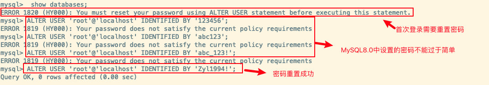
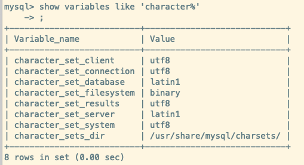
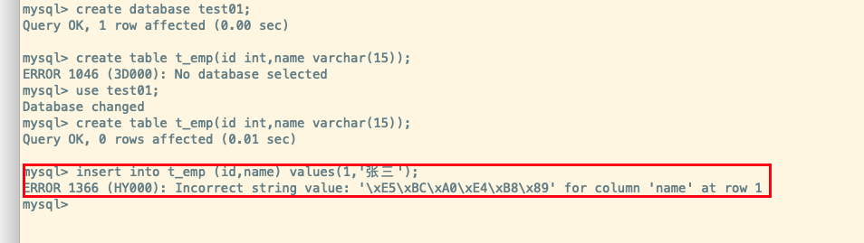
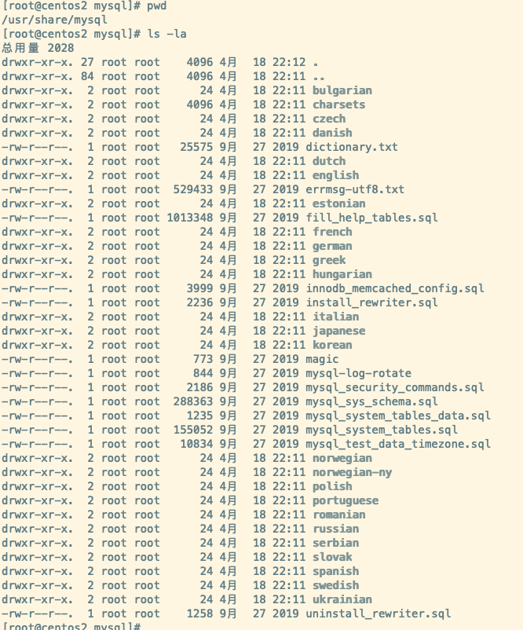

## Linux环境准备

### 卸载MySQL

1. **查看是否安装过MySQL的两种方式(rpm或者yum)**

   - **`rpm -qa | grep -i mysql`**
   - **`yum list installed | grep mysql`**

2. **检查mysql service**

   - **`systemctl status mysqld.service`**

3. **卸载MySQL**

   ```bash
   # 1.关闭 MySQL服务
   systemctl stop mysqld.service
   
   # 2.查看当前 mysql 安装状况
   yum list installed | grep mysql
   # 或者 
   rpm -qa | grep -i mysql
   
   # 3.卸载上述命令查询出的已安装程序
   yum remove mysql-xxx mysql-xxx mysql-xxx mysqk-xxxx
   
   # 4.删除 mysql 相关文件
   # 4.1 查找相关文件
   find / -name mysql
   # 4.2 删除上述命令查找出的相关文件
   rm -rf xxx
   
   # 删除 my.cnf
   rm -rf /etc/my.cnf
   ```

### 安装MySQL

#### 使用`RPM` 安装

1. 将rpm 包传入linux中
   - `scp 本地文件地址  root@目标机器:目标文件地址`
2. 检查依赖
   - `rpm -qa | grep libaio`
   - `rpm -qa | grep net-tools`

3. 解压缩rpm 包

   - `rpm -ivh rpm包名` 

   - 安装顺序： common -> client-plugins -> libs -> client -> server

   - 注意: 安装报错的话通过 `yum remove mysql-libs` 清除之前安装的依赖

4. 查看MySQL版本
   - `mysql --version`

5. 服务的初始化
   - 如果以 root 身份运行 mysql 服务，需要执行初始化命令`mysqld --initialize --user = mysql`
     - `--initialize` 默认以“安全”模式来初始化，会为 root 用户生成一个密码并将**密码标记为已过期**,登录后需要设置一个新的密码。生成的 **临时密码** 会往日志中记录一份。
   - 通过`cat /var/log/mysqld.log` 可以找到生成的密码
6. MySQL操作
   - **启动MySQL**
     - `systemctl start mysqld.service`
   - **关闭MySQL**
     - `systemctl stop mysqld.service`
   - **重启MySQL**
     - `systemctl restart mysqld.service`
   - **查看MySQL状态**
     - `systemctl status mysqld.service`
   - **设置/禁用 MySQL自启动**
     - `systemctl enable|disable  mysqld.service`
7. 查看MySQL是否服务自启动
   - `systemctl list-unit-files | grep mysqld.service`

:::tip mysqld说明

mysqld 这个可执行文件就代表着 MySQL 服务器程序，运行这个可执行文件就可以直接启动一个 服务器进程

:::

### MySQL登录

1. **MySQL首次登录**
   - `mysql -h localhost -P 3306 -u root -p`
   - 注意：首次登录需要输入初始化密码
2. **修改密码**
   - 因为初始化密码默认是过期的，查看数据库会报错。所以需要重新设置密码
     - `ALTER USER 'root'@'localhost' IDENTIFIED BY 'new_password';`
   - 注意: **MySQL 5.7版本之后，加入了密码安全机制,设置的密码太简单会报错**
3. **设置远程登录**
   - 问题: 使用Navicat等连接数据库链接不上
   - **开放端口**
     - 查看开放的端口号
       - `firewall-cmd --list-all`
     - 设置开放的端口号
       - `firewall-cmd --add-service=http --permanent`
       - `firewall-cmd --add-port=3306/tcp --permanent`
     - 重启防火墙
       - `firewall-cmd --reload`
   - 除了开放端口，还需要修改 Linux 下 MySQL 的配置
     - **修改MySQL系统表`User` 的数据指定用户的host为 `%`**
       - `update user set host = '%' where user ='root';`
       - `flush privileges;` 【刷新配置】
     -  因为 Host 字段指定了允许用户登录所使用的IP

:::info MySQL登录

**1.启动服务后，会在 /var/log/mysqld.log中看到生成的临时密码**


**2.使用临时密码登录进去后修改生成的默认密码**


**3.设置远程登录-设置开放端口号**


**3.设置远程登录-修改允许其他ip访问**


:::


### 字符集的操作

> 在MySQL8.0之前,字符集默认为`latin1`, **utf8**字符集指向的是 **utf8mb3**, 如果设计数据库的时候没有修改数据库的编码,就会出现乱码的问题
>
> 从 MySQL8.0开始,数据库的默认编码为`utf8mb4`
>
> 通过 `show variables like 'character%';` 可以查看默认使用的字符集
>
> 通过 `show variables like 'collation%';` 可以查看默认的比较规则

#### 查看字符集

:::info MySQL不同版本的默认字符集和排序规则

**MySQL 8.0**


**MySQL 5.7**

可以看到 MySQL 5.7中默认的客户端与服务端都使用的是 *latin1* ,并且在插入中文会报错 




<br/>



:::

#### 修改MySQL字符集

1. **打开MySQL 配置文件**
   - `vim /etc/my.conf`
2. **在配置文件中加入 utf-8 字符集的设置**
   - `character_set_server=utf8`

3. **重新启动MySQL服务**

:::caution 修改MySQL字符集的注意点

虽然修改了 MySQL 的字符编码, 但是原库、原表的设定不会发生变化，参数修改只对新建的数据库生效。

:::

#### 修改已有库&表字符集

1. 修改已经创建的数据库的字符集
   - `alter database 数据库名称 character set 'utf8';`
2. 修改已经创建的数据表的字符集
   - `alter table 数据表名 convert to character set 'utf8';`

注意: 如果原有数据使用的不是*UTF-8* 的编码的话,数据局本身编码不会发生改变,需要重新导入数据才可以!

### 字符集的级别

- MySQL 分别有4个级别的*字符集*与*比较规则*，分别是:

  - `服务器级别`
  - `数据库级别`
  - `表级别`
  - `列级别`
- 我们通过查看字符集编码语句可以看到有以下的几个字符集:

  - `character_set_server`
    - 服务器级别的字符集

  - `character_set_database`
    - 当前数据库的字符集

  - `character_set_client`
    - 服务器解码请求时使用的字符集

  - `character_set_connection`
    - 服务器处理请求时会把请求字符串从character_set_client转为 character_set_connection 

  - `character_set_results`
    - 服务器向客户端返回数据时使用的字符集


#### 服务器级别

> `character_set_server` 就是服务器级别的字符集

有两种可以修改服务器级别的的字符集和排序规则

1. 修改配置文件,服务器启动的时候读取配置后修改系统变量
2. 在服务器运行的时候使用 `SET` 语句修改

**修改配置文件**

```ini
[server]
# 默认字符集
character_set_server=gbk 
#对应的默认的比较规则
collation_server=gbk_chinese_ci 
```

**使用 SET 语句**

```sql
set character_set_server = gbk
```


#### 数据库级别

> `character_set_database ` : 当前数据库的字符集

一般来说,可以在创建和修改数据库的时候指定数据库的字符集和比较规则

```sql
# 创建数据库
CREATE DATABASE 数据库名 
	[[DEFAULT] CHARACTER SET 字符集名称]
	[[DEFAULT] COLLATE 比较规则名称 ]

# 修改数据库
ALTER DATABASE 数据库名
	[[DEFAULT] CHARACTER SET 字符集名称] 
	[[DEFAULT] COLLATE 比较规则名称];
```


#### 表级别

可以在创建和修改表的时候指定表的字符集与比较规则,如果没有指定的话,则使用所在数据库的字符集与比较规则

```sql
CREATE TABLE 表名 (列的信息)
		[[DEFAULT] CHARACTER SET 字符集名称] [COLLATE 比较规则名称]]

ALTER TABLE 表名
		[[DEFAULT] CHARACTER SET 字符集名称] [COLLATE 比较规则名称]
```


#### 列级别

> 对于存储字符串的列，同一个表中的不同的列也可以有不同的字符集和比较规则

在创建和修改列定义的时候可以指定该列的字符集和比较规则,如果没有指定的话,则使用所在数据表的字符集与比较规则

```sql
CREATE TABLE 表名(
		列名 字符串类型 [CHARACTER SET 字符集名称] [COLLATE 比较规则名称], 
  	其他列...
);

ALTER TABLE 表名 MODIFY 列名 字符串类型 [CHARACTER SET 字符集名称] [COLLATE 比较规则名称];
```

:::tip 提示

在转换列的字符集时需要注意，如果转换前列中存储的数据不能用转换后的字符集进行表示会发生错误。比方说原先列使用的字符集是utf8，列中存储了一些汉字，现在把列的字符集转换为ascii的 话就会出错，因为ascii字符集并不能表示汉字字符。

:::

#### 请求到响应字符集的变化

| 系统变量                   | 描述                                                         |
| -------------------------- | ------------------------------------------------------------ |
| `character_set_client`     | 服务器解码请求时使用的字符集                                 |
| `character_set_connection` | 服务器处理请求时会把请求字符串从 *character_set_client* 转为 *character_set_connection* |
| `character_set_results`    | 服务器向客户端返回数据时使用的字符集                         |

:::caution 分析请求从发送到结果返回过程中字符集的变化

> 首先设置*character_set_connection* 为 gbk
>
> 假设客户端发出的请求是 select *  from t where s=‘我‘,并且客户端使用的是 utf-8 字符集

1. **客户端发送请求所使用的字符集**
   - 一般情况下客户端所使用的字符集和当前操作系统一致，不同操作系统使用的字符集可能不一样，如下
     - 类 Unix 系统使用的是 utf-8
     - Windows 使用的是 gbk
   - 当然如果使用的是可视化工具,比如 Navicat 等,这些工具就会使用自定义的字符集来编码发送给服务器,而不是 OS 默认的字符集
2. 服务器接收到客户端发送来的请求其实是一串二进制的字节, 服务器会认为这串字节采用的字符集是 `character_set_client`,在解码后把这串字节转换为 `character_set_connection` 字符集编码的字符
   - 这里 由于 character_set_client 是 utf-8,那么会按照 utf-8 对请求的字节进行解码
   - 然后按照 character_set_connection 的 gbk 进行编码

3. 表 t 的列使用 gbk 字符集,与 character_set_connection 一致,所以可以找到对应记录
   - 所以某个列的字符集与 character_set_connection 不一致的话需要进行一次字符集的转换
4. 找到数据后将数据解码,然后数据用 `character_set_results` 对应的字符集进行编码,这里就是 utf-8
5. 由于客户端也是用 utf-8 的字符集,所以客户端使用 utf-8 解码,那么最后也就可以显示正常


:::


## MySQL 数据目录

### 主要目录

#### 数据库文件路径

MySQL 的数据库文件的存放路径: `/var/lib/mysql`

```sql
mysql> show variables like 'datadir';
+---------------+-----------------+
| Variable_name | Value           |
+---------------+-----------------+
| datadir       | /var/lib/mysql/ |
+---------------+-----------------+
1 row in set (0.00 sec)
```

#### 相关命令目录

MySQL 相关命令所在的目录:

1. `/usr/bin`
   - 存放 *mysqladmin、mysqlbinlog、mysqldump* 等命令
2. `/usr/sbin`
   - 存放 mysqld 等命令


#### 配置文件目录

MySQL 配置文件所在的目录

- `/usr/share/mysql-8.0  或 /usr/share/mysql `
  - 命令及配置文件
- `/etc/my.cnf`
  - mysql 的配置文件



### 数据库与文件系统

#### 默认的数据库

MySQL 在安装完成之后,会有 4 个默认的数据库:

1. `mysql`
2. `information_schema`
3. `performance_schema`
4. `sys`

##### mysql

- MySQL 系统自带的核心数据库，它存储了:
  - MySQL的用户账户和权限信息
  - 一些存储过程、事件的定义信息
  - 一些运行过程中产生的日志信息
  - 一些帮助信息以及时区信息
  - ……

##### information_schema

- MySQL 系统自带的数据库，这个数据库保存着 **MySQL 服务器维护的所有其他数据库的信息**
  - 比如有 哪些表、哪些视图、哪些触发器、哪些列、哪些索引
- 这些信息并不是真实的用户数据，而是一些**描述性信息**，有时候也称之为 `元数据` 
- 该数据库中也提供了一些以`innodb_sys` 开头的表，用于表示内部系统表


##### performance_schema

- MySQL 系统自带的数据库，这个数据库里主要保存**MySQL服务器运行过程中的一些状态信息**,可以用来 `监控 MySQL 服务的各类性能指标` 
  - 统计最近执行了哪些语句
  - 在执行过程的每个阶段都花费了多长时间
  - 内存的使用情况
  - ……

##### sys

- MySQL 系统自带的数据库
- 这个数据库主要是通过`视图`的形式把 information_schema 和 performance_schema 结合起来，帮助系统管理员和开发人员监控 MySQL 的技术性能

#### 数据库在文件系统中的表示

有个用户自定义的数据库*tmp*,并且有用户的数据表*t_emp*,在 */var/lib/mysql*中可以看到有对应的文件目录

**MySQL 8.0文件目录**


**MySQL 5.7 文件目录**


#### InnoDB 存储引擎模式

##### 表结构

- 为了保存表结构,Innodb 在数据目录下的数据库目录下创建了一个用于**描述表结构的文件**: `表名.frm`
- frm 文件的格式在不同的平台上是一样的,且这个文件是以`二进制`存储的,无法直接打开

##### 数据和索引

###### 系统表空间

- 系统表空间(**system tablespace**)
- 默认情况下,InnoDB 会在数据目录中创建一个`12M ` 的`ibdata1`文件,这个就是`系统表空间`在文件系统上的表示,并且这个文件是`可拓展的(autoextend)`

:::caution my.cnf 配置调整

如果想让系统表空间对应文件系统上多个实际文件,或者修改文件的名字以及文件初始大小,可以修改 MySQL 配置文件

```ini
[server]
# 让系统表空间对应的文件名称为 data1 和 data2,并且默认大小为 512M
innodb_data_file_path=data1:512M;data2:512M:autoextend
```

:::

###### 独立表空间

- 独立表空间(**file-per-table tablespace**)
- 在 MySQL5.6.6 及之后的版本中,InnoDB 默认不会将各个表的数据存储到**系统表空间**中,而是`为每个表建立一个独立表空间`,也就是创建了多少张表,就会有多少个独立表空间

- 使用`独立表空间`来存储数据的话,会在该表所属的数据库目录下创建一个表示该独立表空间的文件,且文件名和表名字一致: `表名.ibd`

###### 设置表空间

- 我们可以设置存储数据数据的时候使用系统表空间还是使用独立表空间,这个功能通过参数`innodb_file_per_table`控制
  - `0` : 表示使用系统表空间
  - `1` : 表示使用独立表空间
- 默认情况下, *innodb_file_per_table* 的值是`ON`

###### 其他表空间

除了系统表空间与独立表空间,还有其他的一些表空间,比如通用表空间(general tableplace),临时表空间(temporary tableplace)等

#### MyISAM 存储引擎模式

##### 表结构

和 InnoDB 一样,MyISAM也在数据库目录下创建了一个用于描述表结构的文件: `表名.frm`

##### 数据和索引

- MyISAM 的索引都是`二级索引`,存储引擎的`数据和索引是分开存放`的
- <mark>所以文件系统中使用不同的文件来存储数据文件和索引文件,同时表数据都存放在对应的数据库子目录下</mark>

```sql
# 假如 test 表使用MyISAM存储引擎的话,test 数据表下的文件系统结构是如下的:

#存放表结构
test.frm

# 存储数据(MYData)
test.MYD

# 存储索引(MYIndex)
test.MYI

```


#### 总结

> 举例: 数据库a ,表b 

1. 如果表b采用 InnoDB ，data\a中会产生1个或者2个文件:

   - b.frm :描述表结构文件，字段长度等
   - 如果采用 **系统表空间** 模式的，数据信息和索引信息都存储在 ibdata1 中
   - 如果采用 **独立表空间** 存储模式，data\a中还会产生 b.ibd 文件(存储数据信息和索引信息) 此外:

   - **此外**:
     - MySQL5.7 中会在data/a的目录下生成 db.opt 文件用于保存数据库的相关配置。比如:字符集、比较 规则。而MySQL8.0不再提供db.opt文件
     - `MySQL8.0中不再单独提供b.frm，而是合并在b.ibd文件中`

2. 如果表b采用 MyISAM ，data\a中会产生3个文件:

   - 表结构文件
     - MySQL5.7 中: b.frm :描述表结构文件，字段长度等
     - MySQL8.0 中 b.xxx.sdi :描述表结构文件，字段长度等

   - b.MYD (MYData):数据信息文件，存储数据信息(如果采用独立表存储模式)

   - b.MYI (MYIndex):存放索引信息文件

:::info MySQL 8.0 下查看 ibd 文件内容

- Oracle 提供了**ibd2sdi**命令解析 MySQL8.0 的 ibd 文件
  - 命令位于: `/usr/bin/ibd2sdi`
  - 命令格式: `ibd2sdi --dump-file=解析后的文件路径  要解析的表名.ibd`

```bash
# 使用示例
/usr/bin/ibd2sdi --dump-file=/home/yoey/1.txt t_dept.ibd
```


:::
