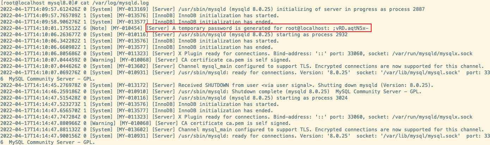
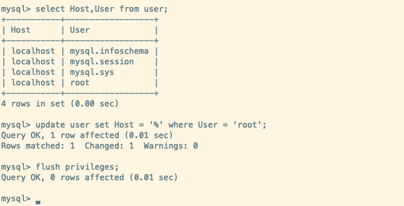

## Linux环境准备

### 卸载MySQL

1. **查看是否安装过MySQL的两种方式(rpm或者yum)**

   - **`rpm -qa | grep -i mysql`**
   - **`yum list installed | grep mysql`**

2. **检查mysql service**

   - **`systemctl status mysqld.service`**

3. **卸载MySQL**

   ```bash
   # 1.关闭 MySQL服务
   systemctl stop mysqld.service
   
   # 2.查看当前 mysql 安装状况
   yum list installed | grep mysql
   # 或者 
   rpm -qa | grep -i mysql
   
   # 3.卸载上述命令查询出的已安装程序
   yum remove mysql-xxx mysql-xxx mysql-xxx mysqk-xxxx
   
   # 4.删除 mysql 相关文件
   # 4.1 查找相关文件
   find / -name mysql
   # 4.2 删除上述命令查找出的相关文件
   rm -rf xxx
   
   # 删除 my.cnf
   rm -rf /etc/my.cnf
   ```

### 安装MySQL

#### 使用`RPM` 安装

1. 将rpm 包传入linux中
   - `scp 本地文件地址  root@目标机器:目标文件地址`
2. 检查依赖
   - `rpm -qa | grep libaio`
   - `rpm -qa | grep net-tools`

3. 解压缩rpm 包

   - `rpm -ivh rpm包名` 

   - 安装顺序： common -> client-plugins -> libs -> client -> server

   - 注意: 安装报错的话通过 `yum remove mysql-libs` 清除之前安装的依赖

4. 查看MySQL版本
   - `mysql --version`

5. 服务的初始化
   - 如果以 root 身份运行 mysql 服务，需要执行初始化命令`mysqld --initialize --user = mysql`
     - `--initialize` 默认以“安全”模式来初始化，会为 root 用户生成一个密码并将**密码标记为已过期**,登录后需要设置一个新的密码。生成的 **临时密码** 会往日志中记录一份。
   - 通过`cat /var/log/mysqld.log` 可以找到生成的密码
6. MySQL操作
   - **启动MySQL**
     - `systemctl start mysqld.service`
   - **关闭MySQL**
     - `systemctl stop mysqld.service`
   - **重启MySQL**
     - `systemctl restart mysqld.service`
   - **查看MySQL状态**
     - `systemctl status mysqld.service`
   - **设置/禁用 MySQL自启动**
     - `systemctl enable|disable  mysqld.service`
7. 查看MySQL是否服务自启动
   - `systemctl list-unit-files | grep mysqld.service`

:::tip mysqld说明

mysqld 这个可执行文件就代表着 MySQL 服务器程序，运行这个可执行文件就可以直接启动一个 服务器进程

:::

### MySQL登录

1. **MySQL首次登录**
   - `mysql -h localhost -P 3306 -u root -p`
   - 注意：首次登录需要输入初始化密码
2. **修改密码**
   - 因为初始化密码默认是过期的，查看数据库会报错。所以需要重新设置密码
     - `ALTER USER 'root'@'localhost' IDENTIFIED BY 'new_password';`
   - 注意: **MySQL 5.7版本之后，加入了密码安全机制,设置的密码太简单会报错**
3. **设置远程登录**
   - 问题: 使用Navicat等连接数据库链接不上
   - **开放端口**
     - 查看开放的端口号
       - `firewall-cmd --list-all`
     - 设置开放的端口号
       - `firewall-cmd --add-service=http --permanent`
       - `firewall-cmd --add-port=3306/tcp --permanent`
     - 重启防火墙
       - `firewall-cmd --reload`
   - 除了开放端口，还需要修改 Linux 下 MySQL 的配置
     - **修改MySQL系统表`User` 的数据指定用户的host为 %**
       - `update user set host = '%' where user ='root';`
       - `flush privileges;` -> 刷新配置
     - 因为 Host 字段指定了允许用户登录所使用的IP

:::info MySQL登录

**1.启动服务后，会在 /var/log/mysqld.log中看到生成的临时密码**



**2.使用临时密码登录进去后修改生成的默认密码**


**3.设置远程登录-设置开放端口号**


**3.设置远程登录-修改允许其他ip访问**



:::

 


