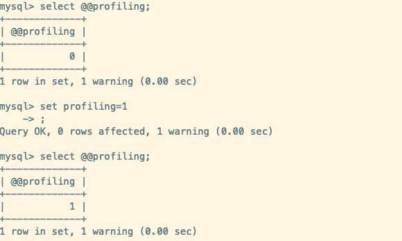
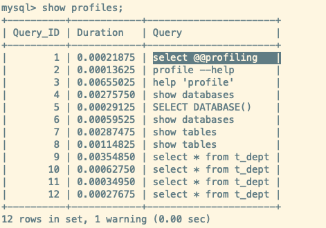

## 逻辑架构

MySQL 服务器进程对客户端进程做了什么处理,才能得到最终的结果呢?对于查询请求有如下的过程:


### MySQL 逻辑架构

MySQL 大致分为 4 层架构:

1. `连接层`
2. `服务层`
3. `引擎层`
4. `存储层`


#### 连接层(Connectors)

> MySQL 服务器提供给外界客户端连接的接口,不同客户端可以使用自己的 API 连接 MySQL,包括但不限于:
>
> 1. 建立连接
> 2. 认证授权
> 3. 维持和管理连接
> 4. …

- 客户端连接层 Connectors，位于MySQL体系架构的最上层，提供与MySQL服务器建立连接的能力,主要包括一些客户端和连接服务。其中包含`本地服务的 Socket 通信` 和 大多数`基于 C/S 实现的 TCP/IP 通信`。通过 Connectors 主要完成一些`连接处理`、`授权认证`等操作

- 客户端在访问 MySQL 服务器之前,首先就是需要 *建立 TCP 连接*，然后进过 TCP 的 3 次握手建立成功之后，MySQL 服务器会对 TCP 传输过来的账号密码做身份认证、权限获取。
  - 用户名或密码不对，会收到一个 *Access denied for user* 错误，客户端程序结束执行
  - 用户名密码认证通过，会从权限表查出账号拥有的权限与连接关联，之后的权限判断都将依赖于此时读到的权限

##### MySQL 驱动

MySQL 是一个网络程序,和 <font color='blue'><em>smtp、http、dns</em></font> 等协议一样，MySQL 在 TCP 上定义了自己的 **MySQL协议**。我们需要与数据库建立`TCP`连接,然后在这个 TCP 连接上按照自定义的 **MySQL协议**进行交互。

最为简单的方式就是通过调用 **MySQL 驱动**，即 MySQL 驱动就是将上述的操作封装为 SDK 给开发者调用,所以 MySQL 驱动的本质上也还是通过 `TCP` 与 MySQL 服务器连接，并且基于 **MySQL协议**与 MySQL服务器进行交互

##### TCP连接池

> 一次 SQL 请求就会建立一个TCP连接，而事实上MySQL 服务器会与多个客户端建立连接, 所以每和连接都需要经历`新建连接->销毁连接`,这个开销非常大,会造成不必要的浪费。所以**需要提供一些固定数量的用来连接的线程**
>
> 通过**TCP连接池**可以`维护一定数量的连接数`，在需要进行TCP连接的时候就去TCP连接池中获取。并且也不必关心TCP连接是如何创建和销毁的，这些由TCP连接池内部去处理。
>
> 当然也可以通过通过限制 TCP 连接池最大连接数、使用`长连接模式` 复用 TCP 连接，从而减少频繁创建 TCP 连接导致的资源消耗、性能下降

TCP连接池主要负责`存储和管理客户端与数据库的连接信息，连接池里的一个线程负责管理一个客户端到数据库的连接信息`

TCP连接池会监听对 MySQL 服务器的各种请求，接收TCP 连接请求，转发所有连接请求到线程管理模块。每一个连接上 MySQL 服务器的客户端请求都会被分配（或创建）一个**连接线程**为其单独服务。而**连接线程**的主要工作就是负责 MySQL 服务器与客户端的通信,接受客户端的命令请求，传递 服务端的结果信息等。

线程池则负责管理维护这些连接线程。包括线程的创建、线程的 cache 等。每一个连接都从线程池中获取线程，省去了创建和销毁线程的开销。

#### SQL 服务层

<mark>第二层架构主要完成大多数的核心服务功能,比如SQL 接口、缓存的查询、SQL 分析和优化、部分内置函数的执行。</mark>

在这一层 MySQL 服务器会解析查询并创建相应的内部解析树，并对其完成相应的优化。比如确定查询表的顺序、是否利用索引等，最后生成相应的执行操作。如果是执行查询语句,MySQL 服务器还会查询内部的缓存。

##### SQL 接口(SQL Interface)

<mark>用于接收用户的SQL命令，并且返回用户需要查询的结果</mark>，比如SELECT ... FROM就是调用 SQL 接口

MySQL 支持 DML(数据操作语言)、DDL(数据定义语言)、存储过程、视图、触发器、自定义函数等多种SQL语言接口。

##### 查询缓存(Cache&Buffer)

> 查询缓存主要是将客户端 query请求的 SELECT 查询语句返回的结果缓存到内存中, 并且与该query请求的 hash值做一个对应。当然,query 请求获取的数据发生变更后，MySQL 会让这个 query 对应的缓存生效。
>
> 在频繁读写的系统中，查询缓存可以显著的提高查询性能,但是由于查询很依赖于内存，所以对内存的消耗很高

- MySQL 内部维持着一些 Cache 和 Buffer,比如 Query Cache用来缓存一个 SELECT 语句的执行结果。如果可以在 Query Cache 中找到对应的查询结果,那么就不必要进行下面的 查询解析、优化、执行的整个过程了，而是直接将结果返回给客户端

- 这个缓存机制是由一系列小缓存组成的。比如`表缓存`、`记录缓存`、`key缓存`、`权限缓存`等 
- 这个查询缓存基于MySQL 服务器内存, 所以可以在不同客户端之间共享 
- <mark>从MySQL 5.7.20开始，不推荐使用查询缓存，并在 MySQL 8.0中删除</mark>

##### 解析器(Parser)

> SQL命令传递到解析器的时候会被解析器验证和解析。解析器是由 Lex 和 YACC 实现的一个很长的脚本

- <mark>用于对 SQL 语句进行<strong>词法分析、语法分析、解析树、预处理器、新解析树</strong></mark>
  - `词法分析` : 将整个语句拆分成一个个字段
  - `语法分析` : 将词法分析拆分出的字段，按照 MySQL 定义的语法规则，生成对应的数据结构解析树
  - `解析树` 
  - `预处理器` : 进一步的检查解析树是否合法，比如就是去查看表是否存在/列是否存在
  - `新解析树` : 通过预处理器核对之后生成的新的解析树，新解析树可能和旧解析树结构一致

- 解析器会将SQL 语句分解成数据结构,并且将这个结构传递到后续步骤中,以后SQL语句的传递和处理就是基于这个结构的。但如果在解析的过程中发生错误, 那么说明**这个 SQL 语句是不合理的**, SQL 语句将不会再执行下去

- 当 SQL 命令传递到 Parser 的时候会被解析器验证并解析,并为其创建一个`语法树`, 会`验证该客户端是否具有执行该查询的权限`。创建完语法树之后，MySQL 服务器会对 SQL 查询进行语法上的优化,进行`查询重写`

##### 查询优化器(Optimizer)

- SQL 语句在语法解析后、查询之前会通过查询优化器确定一个`SQL 语句执行路径`, 生成一个`执行计划`。 

- `执行计划`表明了应该`使用哪些索引`进行查询(**全表检索还是索引检索**)、表之间的连接顺序如何。 最后会按照执行计划中的步骤调用存储引擎提供的方法执行真正的查询, 并最终返回查询结果
- MySQL 根据自己的优化规则，将查询的`IO成本`和`CPU成本`消耗降到最低
  - **IO 成本** :  从磁盘把数据加载到内存的成本
  - **CPU成本** : 数据在内存中查找和排序等 CPU 操作的成本


:::info 查询策略

查询优化器使用 `选取 - 投影 - 连接` 策略进行查询

```sql
SELECT id,name FROM student WHERE gender = '女';
```

1. Select 查询语句首先根据 WHERE 进行`选取`,而不是将表全部查询出来再根据 gender过滤

2. 然后 SELECT 查询根据 id 与 name 进行属性的`投影`,而不是将属性全部取出以后再进行过滤
3. 最后将上述的两个查询条件 `连接` 起来得到最终的查询结果

:::

:::tip 总结

1. 客户端发生请求给 MySQL TCP连接池后，MySQLTCP连接池处理请求、完成身份权限验证

2. 创建线程获取请求中的 SQL 语句，将语句交给 SQL 接口

3. 如果是查询语句先从查询缓存中查找是否有命中，有就直接返回结果集，没有就走解析器

4. 解析器将 SQL 语句按规则解析成各个字段，并生成对应的数据结构解析树，然后交给查询优化器，找到最优查找路径，例如选择哪个索引成本最低
5. 最后交给执行器去调用存储引擎对应的结构

:::

#### 引擎层

<mark>用于负责 <strong>MySQL 中数据的存储与提取、对物理服务器级别维护的底层数据执行操作</strong>，服务器通过API与存储引擎进行通信</mark>。不同的存储具有不同的功能，需要按照实际需求选择

MySQL 引擎层的架构模式是: `插件式存储引擎层(Storage Engines)`, 支持 `InnoDB、MyISAM、Memory等多个存储引擎`

MySQL 8.0.25默认支持的存储引擎如下:


#### 存储层

所有的数据，数据库、表的定义、表的每一行的内容、索引等, 都是存在 `文件系统` 上，以 文件 的方式存 在的，并完成与存储引擎的交互

有些存储引擎比如InnoDB，也支持不使用文件系统直接管理裸设备，但现代文件系统的实现使得这样做没有必要了。在文件系统之下，可以使用本地磁盘，可以使用 DAS、NAS、SAN等各种存储系统


#### 小结

MySQL逻辑架构可以简化为三层结构:

1. **连接层** : 客户端和服务器端建立连接，客户端发送 SQL 至服务器端;
2. **SQL 层(服务层)** : 对 SQL 语句进行查询处理;与数据库文件的存储方式无关;

3. **存储引擎层** :与数据库文件打交道，负责数据的存储和读取。


## SQL 执行流程

### MySQL 执行流程

SQL 语句在 MySQL 中的流程是: `SQL语句->查询缓存->解析器->优化器->执行器`


**SQL 执行流程**


#### 查询缓存

> MySQL 服务器如果在查询缓存中发现了某个 SQL 查询语句，就会直接将结果返回给客户端;如果没有,就进入到解析器阶段。 
>
> 需要说明的是，因为查询缓存往往效率不高，所以在 MySQL8.0 之后就抛弃了这个功能。

在 MySQL5.7中，可以通过设置 `query_cache_type=0` 关闭查询缓存。

:::caution 为什么查询缓存是一个鸡肋功能？

1. 查询缓存是提前把查询结果缓存起来，与 query 请求的 hash 值对应起来, 这样下次不需要执行就可以直接拿到结果。但是这个只有在相同查询操作才能命中缓存。

2. 首先,如果SQL 查询语句中包含一些系统函数，可能会导致查询结果出错。比如函数`Now()`,虽然 query查询语句是一样的,得到的 hash 值是一样的，意味着可以在查询缓存命中，但是实际上每次执行 Now() 返回的结果是不一样的, 导致返回的结果是错误的。

3. 其次,缓存一定有`失效`的时候, 查询缓存的失效需要 MySQL 对库中每张表的每个数据进行监控。如果每个数据被缓存在查询缓存中，就要让该缓存失效。对于写操作频繁的系统来说,会对 MySQL 服务器造成更大的压力,但是在效果上却意义不大。

:::

#### 解析器

> 在解析器中对 SQL 语句进行语法分析、语义分析

1. 解析器首先会做**词法分析**，将整个语句拆分为一个个字段
2. 语法分析器(比如 BiSon)会根据语法规则，客户端请求的 SQL 语句是否满足 MySQL 语法，如果符合会得到一个语法树

:::info 语法树示例

```sql
Select username,ismale from userinfo where 1=1 and age > 20 and level > 5
```


:::

####  优化器

> 在优化器中会确定 SQL 语句的执行路径，比如是根据 全表检索 ，还是根据 索引检索 等

在查询优化器中，可以分为 `逻辑查询` 优化阶段和 `物理查询` 优化阶段

####  执行器

> 从查询缓存-> 优化器的过程中,还没有去读写真实的表，仅仅只是得到了一个执行计划。在执行器阶段就会去读写表

- 在执行之前会判断该用户`是否具备权限`。如果没有的话，就会返回权限错误; 如果有，就执行 SQL 查询并返回结果
  - 注意: 在 MySQL 8.0 以下的版本中，如果开启了查询缓存,此时会缓存查询结果

### MySQL8 SQL 执行原理

#### 开启 profiling

- 确认`profiling` 是否开启, **profiling = 0 | OFF**  表示关闭

  ```sql
  select @@profiling;
  show variables like 'profiling';
  ```

- 开启 `profiling` 

  ```sql
  # 开启 Session 级别的 profiling
  set  profiling = 1
  ```

  

#### 查看 profiles

- <mark>查看当前会话产生的所有 profiles</mark>

- 基本语法

  ```sql
  show profiles;
  ```

  

####  **查看**profile

- 基本语法

  ```sql
  show profile [type [, type] ... ]
  [FOR QUERY query_id]      
  [LIMIT row_count [OFFSET offset]]
  ```

- 命令参数说明

  - `type`
    - `ALL`  : 显示所有的开销信息
    - `BLOCK IO ` : 显示块IO相关开销
    - `CONTEXT SWITCHES` : 上下文切换相关开销
    - `CPU` : 显示CPU相关开销信息
    - `IPC` : 显示发送和接收相关开销信息
    - `MEMORY` ： 显示内存相关开销信息
    - `PAGE FAULTS ` : 显示页面错误相关开销信息
    - `SOURCE` : 显示和Source_function，Source_file，Source_line相关的开销信息
    - `SWAPS` : 显示交换次数相关开销的信息
  - `query_id`
    - 如果不指定，只是显示最近执行的语句，如果指定会显示语句的 profile
    - 可以通过 `show profiles;` 得到 query_id

  :::info 使用 show profile

  

  :::

### MySQL5.7 执行原理

- 测试步骤
  - **开启查询缓存**
    - 在配置文件中设置 `query_cache_type=1` 开启查询缓存
  - **重启 MySQL 服务**
  - **开启profiling**
  - 执行两次 SQL
  - 查看 profiles
  - 查看两次 SQL 对应的 profile

**1.开启查询缓存**


**2.执行两次 SQL，并查看profiles**


**3.分别查看两次 query_Id 的profile**


## 数据缓冲池(buffer pool)

- `InnoDB` 存储引擎是以**`页`**为单位来管理存储空间的。我们进行的增删改查操作其实本质上都是在`访问页面`(包括读页面、写页面、创建新页面等操作)。
- 磁盘 I/O 需要较多的时间,而在内存中进行操 作，效率则会高很多。DBMS 会`申请内存作为数据缓冲池`
  - 在真正访问页面之前，需要把在磁盘上的页缓存到内存中的`buffer pool`之后才可以访问
- 这样做,可以尽可能的`减少与磁盘直接 I/O 的时间`, 可以提升 SQL 的查询性能

### 缓冲池与查询缓存

> 首先两个并不是一个东西🙅🏻‍♀️

在 InnoDB 存储引擎中有一部分数据会放到内存中，缓冲池则占了这部分内存的大部分，它用来存储各种数据的缓存(`数据页、索引页、插入缓存、锁信息、自适应索引 Hash、数据字典信息`等)，如下图所示：


