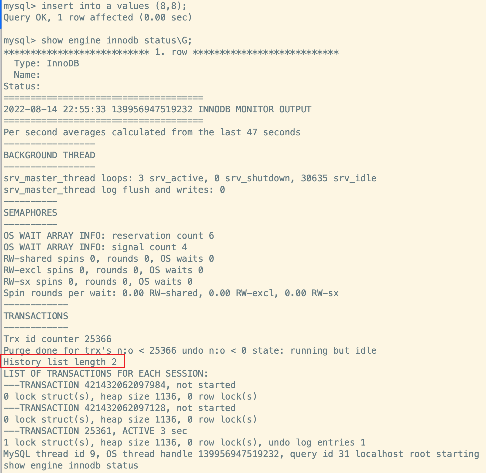
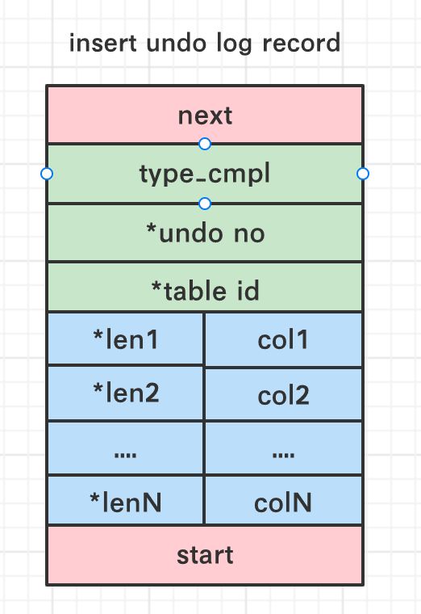
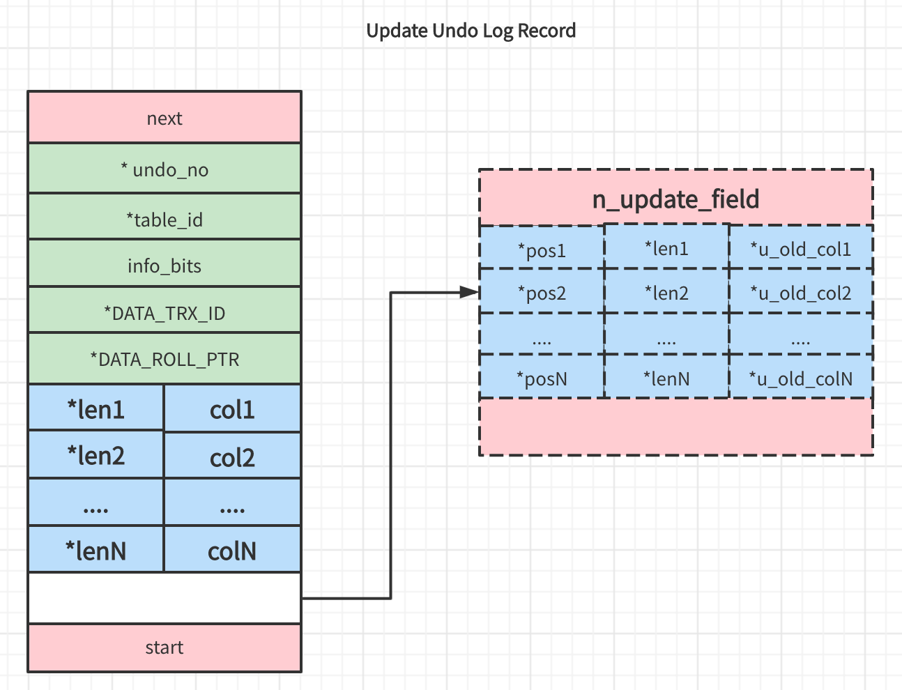
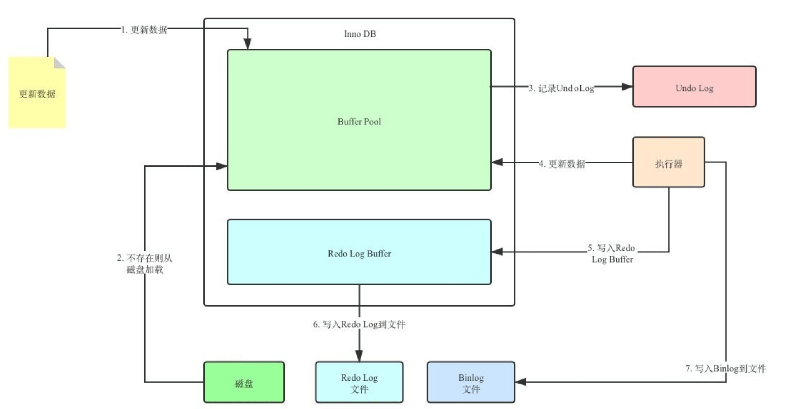
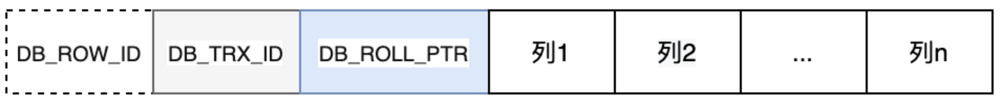
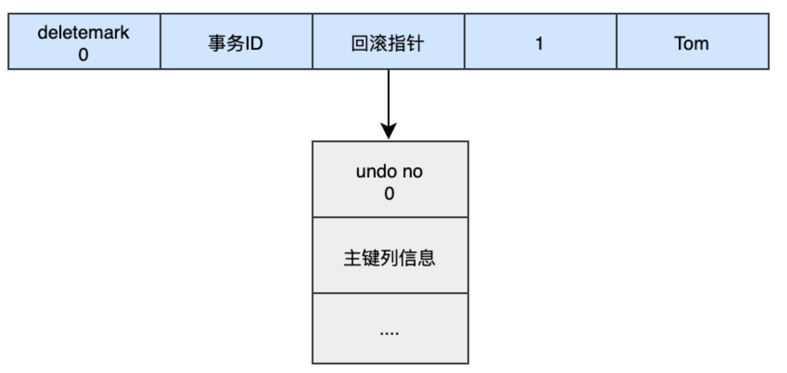
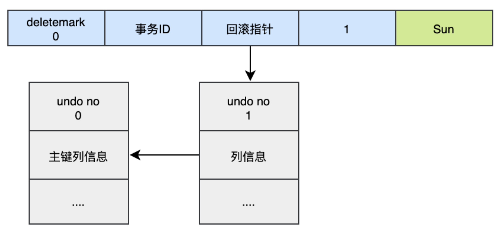
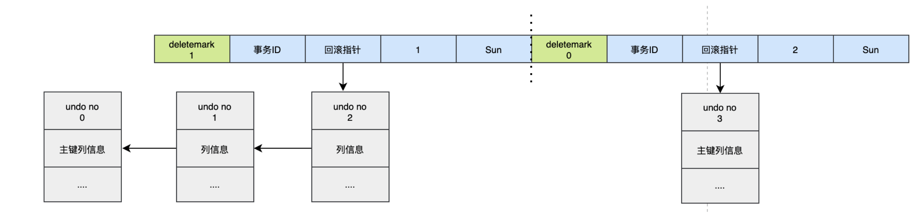

> redo 日志记录的事务的行为,可以很好的**对页进行“重做”**, 但是事务除了能提交,还可以回滚,这个时候就需要`undo日志`
>
> 在对数据库进行修改的时候,除了会产生 redo 日志,InnoDB还会生成undo 日志。
>
> redo 日志是事务持久性的保证,undo 日志则是事务原子性的保证,**在事务中 `更新数据` 的 `前置操作 `其实是要先写入一个 undo log **


## 理解 undo 日志

> 我们需要承认

事务需要保证 `原子性`, 也就是事务中的操作要么全部完成,要么什么也不做。但有时候事务执行到一半会出现一些情况,比如:

1. 事务执行过程中可能遇到各种错误，比如 服务器本身的错误、操作系统错误, 甚至是突然断电导致的错误
2. 程序员可以在事务执行过程中手动输入 **ROLLBACK** 语句结束当前事务的执行

以上情况出现,我们需要**把数据改回原先的样子**, 这个过程称之为`回滚` , 这样就可以造成一个假象:这个事务**看起来什么都没做**, 所以符合**原子性要求**

每当我们要对一条记录做改动时(指`INSERT`、`DELETE`、`UPDATE`)，都需要留一手, 把回滚时所需的东西都给记下来:

1. **插入一条记录时,至少要把这条记录的主键值记下来，之后回滚的时候只需要把这个主键值对应的记录删掉就好了**
2. **删除了一条记录,至少要把这条记录中的内容都记下来,这样之后回滚时再把由这些内容组成的记录插入到表中就好了**
3. **修改了一条记录,至少要把修改这条记录前的旧值都记录下来,这样之后回滚时再把这条记录更新为旧值就好了**

这些**为了回滚而记录的内容称为撤销日志(undo日志)**,<mark>需要注意的一点是, 由于查询操作 <strong>SELECT</strong> 并不会修改任何用户记录, 所以在查询操作执行时, 并不需要记录相应的<strong>undo 日志</strong></mark>

## undo日志的作用

undo 日志有下面两个作用

1. `回滚数据`
2. `MVCC`

**1. 回滚数据**

开发者对 undo 可能有`误解`: **undo 无法将数据库物理地址恢复到执行语句或者事务之前的样子**, 但事实上`undo 日志是逻辑日志`,因此只是**将数据库逻辑的恢复到原来的样子, 所有的修改都被逻辑的取消了,`但是数据结构和页本身在回滚之后可能并不相同`**。因为在多用户并发系统中,会有成百上千的并发事务,事务 A 修改了页中的某几条记录,同时事务 B 也对这个数据页进行修改,那么回滚的时候**就不能直接将页恢复到事务开始的样子,这样会影响到其他的事务**

比如 insert 了 10w 条数据, 这个时候表空间会变大,在执行*ROLLBACL* 时,会将插入的数据进行回滚,但是**表空间的大小不会因此而收缩**

**2. MVCC**

除了回滚之外,undo 日志另外一个作用就是`MVCC`。**当用户读取一行记录的时候,如果该记录已经被其他事务占用,当前事务可以通过读取 undo 日志获取之前的信息,以实现** `非锁定读取`

## undo 存储管理

### 回滚段与 UNDO 页

InnoDB存储引擎对 undo页 的管理同样采用`段`的方式, 也就是`回滚段(Rollback Segment)`, 回滚段默认放在`共享表空间`中。每个回滚段中有`1024 个 Undo Log Segment`, 然后`在 Undo Log 中进行 Undo 页的申请`

1. 在 InnoDB `1.1版本 ` 之前 (不包括1.1版本)，`只有一个回滚段`, 因此支持同时在线的事 限制为 `1024` 。虽然对绝大多数的应用来说都已经够用,但是也还是个瓶颈
2. 从InooDB `1.1版本`开始支持`最大 128个回滚段` ，故其支持同时在线的事务限制提高到 了 `128*1024` 

虽然 InnoDB1.1 版本支持了 128 个回滚段,但是**这些回滚段都存储在`共享表空间`**, 从InnoDB`1.2 版本`开始,可以通过下面的参数做出进一步的设置(当然很少修改):

1. `innodb_undo_directory`
   - **用于设置回滚段文件所在的路径**
     - 这个意味着回滚段可以放在共享表空间以外的位置,即**可以设置为独立表空间**
   - **默认值是`./` ,表示当前 InnoDB 存储引擎的目录**
2. `innodb_undo_logs`
   - **设置回滚段的个数,默认值是 128**
   - <mark>用于代替之前版本的 <strong>innodb_rollback_segments</strong></mark> 
3. `innodb_undo_tablespaces`
   - **设置构成回滚段文件的数量**
   - **设置该参数后会在 innodb_undo_directory 下看到以 undo 开头的文件,这些就是回滚段文件**

<mark>需要注意的是: <strong>事务在 undo log segment 分配页并且写入 undo log 的过程中同样需要写入 redo 日志</strong></mark> 

### undo页的重用

> 当我们开启一个事务需要写入 undo 日志的时候,就需要先去 **Undo Log Segment** 中申请一个空闲的 Undo 页,然后将 undo 日志写入其中, MySQL 一个页默认大小为 16kb

当事务提交时,InnoDB 存储引擎会做下面两件事:

1. 将 undo 日志放入列表中,以便之后的`Purge`操作
2. 判断 undo 日志所在的页是否可以重用,如果可以就分配给下个事务使用

**事务提交之后`不会立即删除` undo 日志以及 undo 日志所在的页**,因为可能还有其他事务需要通过该 Undo 页获取之前的版本数据。所以事务提交后将 undo 日志放在一个`链表`中, 是否可以删除 undo 日志需要由`Purge 线程`来判断

但如果为每一个事务分配一个单独的 Undo 页又十分浪费存储空间(除非是长事务), **因为事务提交的时候, 可能不会立即释放页**。假设某个应用的 TPS 是 1000,那么如果为每个事务,1 分钟就需要60000 个页,大约需要 1G 的存储空间

所以 Undo 页就被设计成了`可重用的`,当事务提交之后: **首先将 undo 日志放入链表中,然后判断 Undo 页的使用空间是否小于 `3/4`, 如果小于 3/4,那么就表示该 Undo 页可以被重用,之后新的 undo 日志就记录在当前 undo 日志后面**

**由于存放 undo 日志的列表示意记录的形式组织的,而 Undo 页中可能存放着不同事务的 undo 日志, 因此Purge 线程进行`清理的时候无法顺序执行`, 而是要离散的操作, 是一个缓慢的过程 **

:::tip 查看链表中 undo 日志的数量

**通过 ` show engine innodb status\G;`查看存储引擎的状态**,其中`History list length` 就是 undo 日志的数量, purge 操作会减少该值



:::

### 回滚段与事务

1. 一个事务只会使用一个回滚段, 一个回滚段在同一时刻可以被多个事务使用

2. 当一个事务开始的时候, 会指定一个回滚段, 在事务进行的过程中,当数据被修改时,**原始的数据会被复制到回滚段**

3. 在回滚段中,事务会不断填充盘区,直到事务结束或所有的空间被用完
	  - **如果当前的盘区不够用**, 事务会在段中请求扩展下一个盘区
	  - **如果所有已分配的盘区都被用完**, 事务会覆盖最初的盘区或者在回滚段允许的情况下扩展新的盘区来使用
4. 回滚段可以配置独立的表空间(即 undo 表空间), 在数据库中可以存在多个undo表空间，但同一时刻只能使用一个 undo 表空间

5. 当事务提交时，InnoDB存储引擎会做以下两件事情:
    - 将 undo log 放入列表中, 以供之后的purge操作
    - 判断 undo log 所在的页是否可以重用,若可以分配给下个事务使用

### 回滚段中的数据分类

1. `未提交的回滚数据 (uncommitted undo information)`
    - 该数据所关联的事务尚未提交, 用于实现读一致性,所以该数据不能被其他事务的数据覆盖

2. `已经提交但未过期的回滚数据 (committed undo information)`
    - 该数据所关联的事务已经提交, 但是仍受到 `undo retention` 参数的保持时间的影响

3. ` 事务已经提交并过期的数据 (expired undo information)`
    - 事务已经提交,而且数据保存时间已经超过 `undo retention` 参数指定的时间,属于已经过期的数据
    - 当回滚段满了之后,会优先覆盖该分类的数据

**事务提交之后不能马上删除 undo 日志以及 undo 日志所在的页**,因为可能还有其他事务需要通过 undo 日志来得到行记录之前的数据。所以事务提交的时候将 undo 日志放在链表中, 最终是否可以删除 undo 日志以及 undo 日志所在的页由 **Purge 线程**判断

## Undo类型

**在 InnoDB 存储引擎中, undo 日志分为:**

1. `Insert undo 日志`

2. `Update undo 日志`

### Insert undo 日志

- Insert Undo Log 是指在 insert 操作产生的  undo 日志
- 由于 **insert 操作的记录只对当前事务可见,对其他事务不可见(`事务隔离性的要求`)**, 所以  Insert undo 日志在事务提交之后会`直接删除,不需要 purge 操作`

#### Insert undo 日志的记录格式

如下图所示 (`*` 表示对存储的字段进行了压缩 ):

1. `next`
    - **占用 2 字节**
    - `下一个 undo 日志的位置`,通过该字段可以知道当前 undo 日志的大小

2. `type_cmpl`
    - **占用 1 字节**
    - `undo 日志的类型`, 对于 insert undo 日志,该字段的值为 `11`

3. `undo_no`
    - **压缩后保存的**
    - `记录事务的 ID`

4. `table_id`
    - **压缩后保存的**
    - `记录 undo 日志所对应的表对象`

5. `记录主键的列和值`
    - <mark>在进行 rollback 的时候, 根据主键的列和值可以定位到具体的记录,然后删除即可!</mark> 



### Update undo 日志
- **Update undo 日志针对的不仅仅是 `Update`, 还有`Delete` 操作产生的日志**
- 这个 undo 日志可能需要 `MVCC` 机制, 因此提交事务的时候`不能直接删除`, **需要放在链表中,等待 purge 线程进行最后的删除**

#### Update undo 日志的记录格式

如下图所示 (`*` 表示对存储的字段进行了压缩 ):

- 相对于之前的 *insert undo 日志* 来说记录的内容更多,所占用的空间也更大。*next、start 、undo_no、table_id* 部分与insert undo 日志 是一致的





## undo 日志的生命周期

### 简单的生成过程

> 在更新 Buffer Pool 的时候, 需要先将该数据事务开始之前的状态写入 undo 日志中, 如果更新出错了,就可以通过 undo 日志回滚到事务开始前



### 详细的生成过程
> 对 InnoDB 引擎来说,每个行记录除了本身的数据以外,还有几个隐藏列:
> - `DB_ROW_ID`
>   - 如果没有显式的为表指定主键,并且表中页没有唯一列,那么 InnoDB 会自动的为表添加这个列
>
> - `DB_TRX_ID`
>   - **每个事务都会分配额一个事务 ID, 当某条记录变更时,就会将这个事务ID 写入到 `trx_id` 中**
>
> - `DB_ROLL_PTR`
>   - **回滚指针,本质上就是指向 undo 日志的指针**
>
> 

<br/>

**1. 执行 Insert 时**

插入的数都会生成一条 **Insert undo 日志**, 并且数据的回滚指针会指向它。在进行回滚的时候,直接通过 Insert Undo Log Record 将对应的数据删除

```sql
START TRANSACTION;
INSERT INTO userInfo (name) VALUES ('tom');
```




<br/>

**2. 执行Update 时(不更新主键)**

>  对于更新操作会产生 *udpate undo 日志*, 并且会分`更新主键`和`不更新主键`

会将老的记录写入新的 undo 日志,让`回滚指针`指向新的 undo 日志,它的 `undo_no=1`,并且新的 undo 日志会指向老的 undo 日志

```sql
UPDATE userInfo SET name='Sun' WHERE id=1;
```



<br/>

**3. 执行Update 时(更新主键)**

对于更新主键的操作, 会把原来的数据的`delete_flag` 标记设置为 `1`, 这个时候没有真正的删除数据,真正的删除数据需要交给`Purge 线程` 区处理。然后再后面插入一条新的数据, `新的数据也会产生 undo 日志`, 并且 undo 日志的序号会`递增` 

可以看出来,每次对数据的变更都会产生一个 undo 日志,**当一条记录被变更多次时, 就会产生多条 undo 日志**。undo 日志记录的是变更前的日志,并且由于每个 undo 日志的序号是递增的,按照序号是`依次向前推`, 就可以找到这条记录的原始数据了

```sql
UPDATE userInfo SET id=2 WHERE id =1;
```



