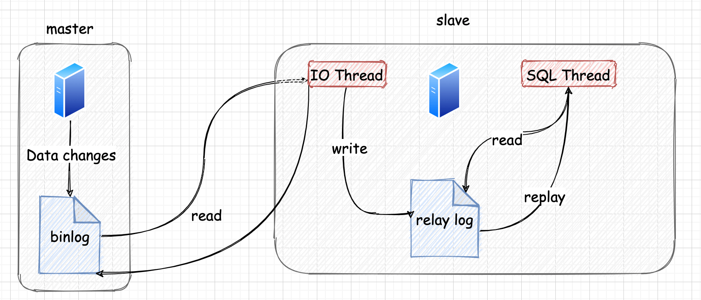

## 引入

>  在实际的开发中,通常会引入*Redis* 作为缓存中间件与 MySQL 一起使用,当有请求过来的时候,首先会去*Redis*中检查是否有缓存数据
>
> - 如果有的话,直接取出使用
> - 如果没有的话,再去访问数据库
>
> 

一般应用对数据库而言都是**读多写少**,也就说对数据库读取数据的压力比较大, 那么有一个思路就是采用数据库集群的方案，做`主从架构`, 进行 `读写分离` , 这样同样可以提升数据库的并发处理能力。但并不是所有的应用都需要对数据库进行主从架构的设置，毕竟设置架构本身是有成本的。

如果我们的目的在于提升数据库高并发访问的效率:

- 那么首先考虑的是如何 `优化SQL和索引`, 这种方式简单有效
- 其次才是采用 `缓存策略`, 比如将热点数据保存在 Redis 中,提升读取的效率,
- 最后才是对数据库采用`主从架构`,进行读写分离

## 主从复制的作用

**主从同步设计不仅可以提高数据库的吞吐量**,还有以下 3 个方面的作用:

1. `读写分离`

   - master 负责写入数据,slave 负责读取数据

   - 当master 更新更新后,会自动的将数据通过binlog 方式复制到slave 中,而读取数据的时候,会从 slave 中进行读取

   - 在读多写少的情况下,采用读写分离的方式可以提高并发访问性能。同时,还可以对服务器进行`负载均衡`,让不同的请求按策略分发到不同的 slave 服务器上

     

   

2. `数据备份`

3. `实现高可用(HA)`

## 主从概述

**slave 从 master 读取 binlog 来进行数据同步**

### 三个线程

实际上主从同步的原理就是基于 *binlog* 进行数据同步的。在主从复制过程中, 会基于 `3 个线程` 来操作 (**一个主库线程，两个从库线程**)

1. `二进制日志转储线程 [Binlog dump thread]`
   - **主库线程** 
   - 当从库线程连接的时候, 主库可以将 binlog 发送给从库
   - 当主库读取事件(Event)的时候, 会在 binlog 上 加锁, 读取完成之后，再将锁释放掉
2. `slave的 IO 线程`
   - 会连接到 master, 向 master 发送请求更新 binlog。这时 slave 的I/O线程就可以读取到主库的 **二进制日志转储线程**发送的 binlog 更新部分, **并且拷贝到本地的中继日志 (Relay log)** 
3. `slave的 SQL 线程`
   - 会读取slave 中的中继日志(relay log), 并且执行日志中的事件, **将从库中的数据与主库保持同步**

:::tip 说明

1. 不是所有版本的 MySQL 都默认开启 binlog,在进行主从同步的时候,需要确认MySQL **是否开启的 binlog 功能**
2. 除非特殊指定,默认情况下 slave 会执行 master 中所有保存的所有事件。**也可以通过配置,让 slave 执行指定的事件**

:::

### 复制三个步骤

1. master 将写操作记录到 binlog 文件中,这些操作记录我们称之为 [binlog 事件(*binlog events*)](其他日志#binlog-事件)
2. slave 将 master 的 *`binlog events`* 拷贝到它的中继日志 ` relay log`中
3. slave 重做中继日志中的事件,将改变应用到自己的数据库中。MySQL 复制是**异步的且串行化** 的，而且重启后从`接入点` 开始复制

:::caution 复制的问题

主从复制的一个很难忽略的问题就是`延迟`

假设 master 将 binlog 传递给 slave 并且执行数据同步操作Op1,这个需要 500ms,在此期间用户对数据库进行了更新操作,这个操作并不会写入到上一次Op1 的 binlog 中,也就是此时 slave 中没有该用户的更新记录,此时用户立即从 slave 中查询数据,查询出的数据就和 master 不一致了

:::

### 基本原则

1. 每个 *Slave* 只有一个*Master*
2. 每个*Slave* 只能有一个唯一的服务器 ID (唯一的身份 id)
3. 每个*Master* 可以有多个 *Slave*

## 环境搭建(ONE-ONE)

### 主机配置文件

