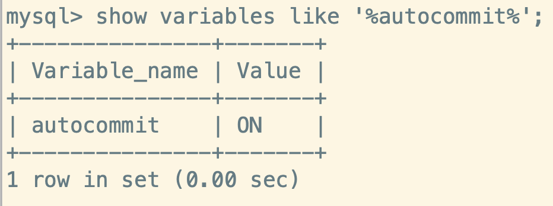
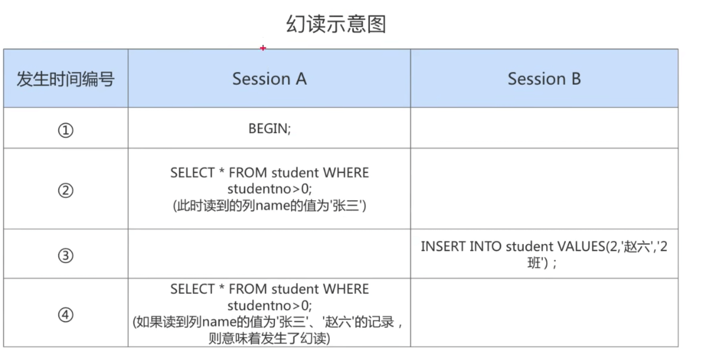
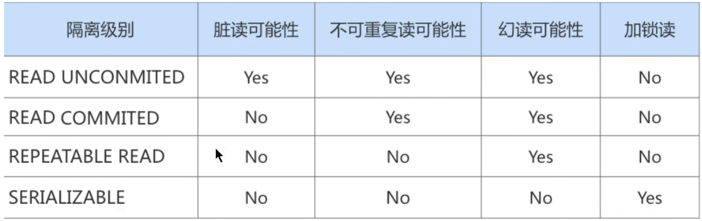
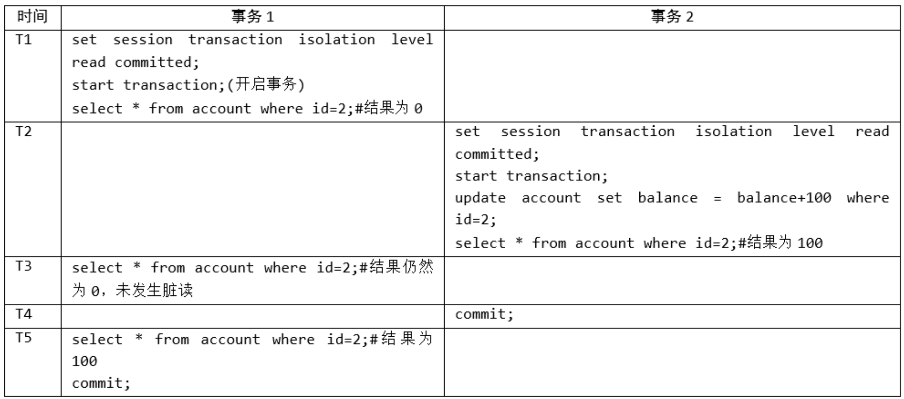
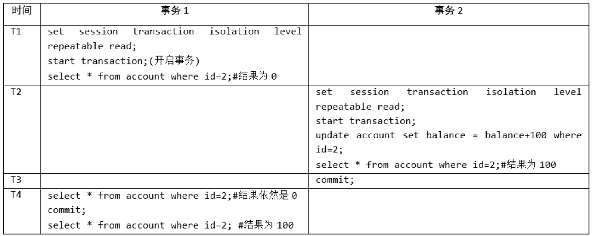

## 数据库事务

**事务是数据库区别的文件系统的重要特性之一**

1. 事务就可以让数据库始终保持`一致性`
2. 可以通过事务的机制`恢复到某个时间点`,这样可以保证提交到数据库的修改不会因为系统崩溃而丢失

### 存储引擎的支持情况

> MySQL 只有**InnoDB** 支持事务

`SHOW ENGINES` 命令来查看当前MySQL支持的存储引擎都有哪些，以及这些存储引擎是否支持事务


### 基本概念

1. 事务是 **一组逻辑操作单元，使数据从一种状态变换到另一种状态**
2. `事务处理的原则`
   - 保证所有事务都作为`一个工作单元` 来执行, 即使出现了故障,都不能改变这种执行方式。
   - 当在一个事务中执行多个操作时 :
     - 要么所有的事务都被提交`Commit`,那么这些修改就 `永久` 地保存下来
     - 要么数据库管理系统将 `放弃` 所作的所有`修改`, 整个事务回滚`rollback`

### ACID

事务的 ACID 指的是:

1. **原子性 (atomicity)**
2. **一致性 (consistency)**
3. **隔离型 (isolation)**
4. **持久性 (durability)**

:::tip 说明

ACID 是事务的 4 大特性,这四个特性中:**原子性是基础,一致性是约束条件,隔离性是手段,持久性是最终目标**

:::

#### atomicity

> 多个操作不可分割

- **原子性是指事务是一个不可分割的工作单位。要么全部提交,要么全部失败回滚**
- 即要么转账成功,要么失败,不存在一种中间状态。如果没有事务,就会出现 A 账户增加 100,但是 B 账户没有扣除 100

#### consistency

> 用设定的目标规则是否一致

- **一致性是指事务执行前后，数据从一个`合法性状态` 变换到另外一个 `合法性状态`。这种状态是` 语义`上的而不是语法上的,跟具体的业务有关**

- 那么什么事合法的数据状态呢?
  - 满足`预定的约束` 的状态就叫做合法的状态。这状态是自定义的。**满足这个状态,数据就是一致的，不满足这个状态，数据就是不一致的**
  - **如果事务中某个操作失败了,系统就会自动撤销当前正在执行的事务,返回到执行事务之前的状态**

**示例:**

比如 A 账户只有 200 元,但是却转出去 300 元,账户余额变成了 -100元。这个就是不一致的体现,因为定义了一个状态**余额>=0**

#### isolation

> 多个事务互不影响

- **事务的隔离性是指一个事务的执行不能被其他事务干扰**
  - 即一个事务内部的操作及使用的数据对`并发的其他事务`是隔离的，并发执行的各个事务之间不能互相干扰
- 隔离性还有其他的称呼: **并发控制(concurrency control)、可串行化(serializability)、锁(locking)等**

:::info 示例

如果无法保证隔离性会怎么样?假设A账户有200元，B账户0元。A账户往B账户转账两次，每次金额为50 元，分别在两个事务中执行

```sql
UPDATE accounts SET money = money - 50 WHERE NAME = 'AA'; 
UPDATE accounts SET money = money + 50 WHERE NAME = 'BB';
```

如果无法保证隔离性，会出现下面的情形:


:::

#### durability

- **持久性是指一个事务一旦被提交(刷新到磁盘了)，它对数据库中数据的改变就是**`永久性的`**,接下来的其他操作和数据库故障不应该对其有任何影响**

- 持久性是通过`事务日志` 来保证的,日志包括了 `重做日志` 和 `回滚日志`
- **当我们通过事务对数据进行修改 的时候，首先会将数据库的变化信息记录到重做日志中，然后再对数据库中对应的行进行修改**
  - 这样做即使数据库系统崩溃，**数据库重启后也能找到没有更新到数据库系统中的重做日志,重新执行,从而使事务具有持久性**

### 事务的状态

我们现在知道`事务`是一个抽象的概念，它**其实对应着一个或多个数据库操作**,MySQL根据这些操作所执行的不同阶段把事务大致划分成几个状态:

1. `活动的 (active)`
   - **事务对应的数据库操作正在执行过程中时**，我们就说该事务处在`活动的`状态
2. `部分提交的 (partially committed)`
   - 当事务中的最后一个操作执行完成,但由于操作都在内存中执行，所造成的影响并`没有刷新到磁盘`时，我们就说该事务处在`部分提交的`状态
3. `失败 (failed)`
   - 当事务处在`活动的`或者`部分提交的`状态时,**可能遇到了某些错误(数据库自身的错误、操作系统 错误或者直接断电等)而无法继续执行，或者人为的停止当前事务的执行**，我们就说该事务处在`失败的`状态
4. `终止的 (aborted)`
   - 如果事务执行了一部分而变为`失败的` 状态，那么就需要**把已经修改的事务中的操作还原到事务执行前的状态**
     - 即要撤销失败事务对当前数据库造成的影响。我们把这个撤销的过程称之为 `回滚` 
   - **当`回滚`操作执行完毕时，也就是数据库恢复到了执行事务之前的状态,我们就说该事务处在了 `中止的` 的状态**
5. `提交的 (committed)`
   - **当一个处在`部分提交的`状态的事务将修改过的数据都 `同步到磁盘` 上之后，我们就可以说该事务处在了**`提交`**状态**


**基本的事务状态转换图如下所示:**


## 使用事务

**使用事务有两种方式:**

1. `显式事务`
2. `隐式事务`

<mark>默认使用隐式事务,如果指定了显式事务,就使用显式事务</mark>

### 显式事务

指定一个显式的事务有以下的操作步骤:

1. 使用`START TRANSACTION `或 `BEGIN` 显式开启一个事务

2. 指定事务中的一系列的操作 (**主要是 DML,不含 DDL**)

3. **提交事务**或者**终止事务(回滚)**

#### 开启事务

- **基本语法格式**

  ```sql
  BEGIN;
  #或者
  START TRANSACTION;
  ```

- **START TRANSACTION 语句相较于 BEGIN 特别之处在于,后边能跟随几个修饰符:**

  - `READ ONLY`
    - 标识当前事务是一个`只读事务`,也就是属于该事务的数据库操作只能读取数据,而不能修改数据
  - `READ WRITE`
    - 标识当前事务是一个`读写事务`,也就是属于该事务的数据库操作既可以读取数据,也可以修改数据
    - **默认的**
  - `WITH CONSISTENT SNAPSHOT`
    - 启动一致性读, 还能和 *read only 和 read write*搭配

#### 提交/回滚事务

- `COMMIT`   : 提交
- `ROLLBACK` : 回滚 

```sql
 # 提交事务。当提交事务后，对数据库的修改是永久性的。 
 COMMIT;
 
 
 # 回滚事务,即撤销正在进行的所有没有提交的修改
 ROLLBACK
```

#### SavePoint

- **可以在一个事务中创建多个保存点,方便后续针对保存点进行回滚。**

- `有两个回滚点 A、B,当回滚到 A 在回滚到 B 后,回滚点 A 就不存在了`

- <mark>回滚到指定的保存点并不是让事务进入 <strong>中止状态</strong>,而是可以接着往下执行,最后选择 COMMIT、rollback</mark>

  ```sql
  # 在事务中创建一个保存点
  SAVEPOINT 保存点名称
  
   
   # 将事务回滚到某个保存点
   ROLLBACK TO [保存点名称]
  
  # 删除某个保存点
  RELEASE SAVEPOINT 保存点名称
  ```


:::info SavePoint 的试验

**1.回滚savepoint操作**

我们可以看到,通过 savepoint 可以保存一个时间点,并且让事务回到该时间点,然后可以指定提交还是整体回滚。


<br/>

**2.重复回滚问题**


:::

### 隐式事务

MySQL 中有一个系统变量 `autocommit`用于控制自动提交,开启这个参数意味着**每一个 DML 语句都是一个独立的事务**



当然，如果我们想关闭这种`自动提交` 的功能，可以使用下边两种方法之一:

1. **显式的的使用 START TRANSACTION 或者 BEGIN 语句开启一个事务**。这样在本次事务提交或者回滚前会暂时关闭掉自动提交的功能

2. **把系统变量 `autocommit` 的值设置为 `OFF`**

   ```sql
   # 关闭自动提交
   SET autocommit = OFF;
   
   #  开启自动提交
   SET autocommit = ON;
   ```


### 隐式提交事务的情况

1. `DDL:数据定义语言`

   - 数据库对象就是**数据库、表、视图、存储过程等结构**,当我们使用**CREATE、ALTER、DROP、TRUNCATE 等**语句去修改数据库对象的时候,就会`隐式提交`该语句前的事务

     ```sql
     /* 示例 */
     BEGIN
     
     # 事务的第一条语句
     SELECT ....
     # 事务的第二条语句
     UPDATE ...
     #事务的其他语句
     ...
     
     # 执行下面 DDL 的语句时,会自动提交上面语句所属的事务
     CREATE / ALTER / DROP ...
     ```

2. `隐式的使用或修改 mysql 数据库中的表`

   - 当我们使用**ALTER USER、CREATE USER、DROP USER、GRANT、SETPASSWORD**等语句时,也会`隐式提交`该语句前面的事务

3. `事务控制 或 关于锁定的语句 `

   - **在一个事务还没 提交或回滚时 就又手动(START TRANSACTION 或者 BEGIN)开启了另一个事务时**，会 `隐式的提交` 上一个事务

     ```sql
     # 开启事务 A
     BEGIN
     
     
     SELECT ....  # 事务A的第一条语句
     UPDATE ...	 # 事务A的第二条语句
     ...					 # 事务A的其他语句
     
     
     /* highlight-start */
     # 开启事务 B,此时会将事务 A 提交
     BEGIN
     ...
     /* highlight-end */
     ```

   - **当前的 autocommit 系统变量的值为 OFF, 我们手动把它调为 ON 时，也会 隐式的提交前面的事务**

   - 使用`LOCK TABLES、UNLOCK TABLES` 等关于**锁定的语句**也会`隐式提交`前边语句所属的事务。

4. `加载数据的语句`
   - 使用`LOAD DATA` 向数据库中批量的导入数据时,也会`隐式提交`前边语句所属的事务

5. `MySQL复制的语句`
   - 使用`START SLAVE、STOP SLAVE 、RESET SLAVE、CHANGE MASTER TO`等语句时也会`隐式提交`前边语句所属的事务。

6. `其他的语句`
   - **使用analyze table、cache index、check table** 等语句时,也会`隐式提交`前边语句所属的事务


## 事务隔离级别

- MySQL 是基于**客户端/服务器** 架构的,对于同一个服务器来说,可以同时和若干个客户端连接，每个客户端与服务器连接上之后,就是一个`会话 (Session)`。 每个客户端都可以在自己的会话中向服务器发出请求语句,**一个请求语句可能是某个事务的一部分,也就是对于服务器来说会同时处理多个事务**
- 事务有`隔离性`的特性，理论上**在某个事务对某个数据进行访问时，其他事务应该进行`排队`**, 当该事务提交之后其他事务才可以继续访问这个数据,这种方式**对性能影响很大**
- 我们既想拥有**事务的隔离性**,又想让服务器**在处理访问同一个数据的多个事务时保持`高性能`**,这时候就需要`事务隔离级别` (鱼和熊掌如何兼得?)

### 数据准备

```sql
# 创建表
CREATE TABLE student ( 
  studentno INT,
	name VARCHAR(20),
	class varchar(20), 
  PRIMARY KEY (studentno)
) Engine=InnoDB CHARSET=utf8;

# 插入一条数据
INSERT INTO student VALUES(1, '小谷', '1班');
```

### 四种事务并发问题

**针对事务的隔离性和并发性**,我们怎么做取舍呢?先看一下访问相同数据的事务在**不保证串行执行** (也就是执行完一个再执行另一个)的情况下可能会出现哪些问题:

1. `脏写 (Dirty Write)`

   - **对于两个事务 T1、T2, 如果 T1 修改了另一个`未提交`T2 修改过的数据，那就意味着发生了`脏写`** 

2. `脏读 (Direty Read)`

   - **对于两个事务 T1、T2,`T1读取了`已经被`T2 更新但还没有被提交` 的字段,如果之后 T2 回滚,那么 `T1读取的内容就是临时无效的`**
   - 即 T1、T2 各开启一个事务,T2 修改了字段 A 的值,但是还没有提交,此时 T1 读取了这个没有提交的值。然后 T2 回滚了之前的对字段 A 的修改,那么此时 T1 读取的字段A 的值就是错误的,也就是**脏读**

3. `不可重复读 (Non-Repeatable Read)`

   - **对于两个事务 T1、T2, `T1 读取了某个字段A`,之后`T2 又更新这个字段A `,之后 `T1再次读取字段 A`时发现与`值上次读取的值不一样`了,也就是`不可重复读`**
   - 我们在T1 中提交了几个**隐式事务**,这些事务中都对字段 A 进行了更新,每次提交完事务之后,T1 都可以读取到的值都是最新的值,这也是**不可重复读**

4. `幻读 (Phantom)`

   - **对于两个事务 T1、T2,`T1 从表中读取了一些数据`,然后`T2 往该表中插入了一些数据`,然后 `T1 再次读取该表`时发现`表的数据多了`,这就是`幻读`,我们称 T2 插入的数据为`幻影记录`**

   - T1 先根据查询条件查询某表得到结果集 A,然后 T2 向该表中又插入了几条数据,当 T1 再次查询的时候发现结果集变多了
   - <mark>注意: 如果 T2 是删除了几条数据,那不算是幻读!</mark>

:::info 问题的示意图

**1、脏写**

SessionA 的提交的数据被 SessionB 覆盖了(通过提交、回滚)


<br/>

**2.脏读**

SessionA读到了 SessionB 没有提交的事务中更新的数据


<br/>

**3.不可重复读**

SessionA 每次读表中的某条数据都不一样,因为 SessionB 一致在更新数据并提交事务


<br/>

**4.幻读**

SessionA 通过相同的查询条件去查询,每次得到的结果**数量**都会增加,因为SessionB **插入**了条数据




:::


### SQL的四种隔离级别

> 上面的几种并发事务执行过程的一些问题按照严重性来排序:`脏写 > 脏读 > 不可重复读 > 幻读`

- 我们可以舍弃一部分隔离性来换取一部分性能,在这里就体现在:**设立一些隔离级别，隔离级别越低，并发问题发生的就越多**

- SQL标准中设立了4个隔离级别 :

  - `READ UNCOMMITTED `
    - **读未提交**
    - 在该隔离级别,所有事务都可以看到其他未提交事务的执行结果。
    - **不能避免脏读、不可重复读、幻读**
  - `READ COMMITTED`
    - **读已提交 => 类似于多线程直接读取共享数据**
    - 满足了隔离的简单定义:**一个事务只能看见已经提交事务所做的改变**。这是大多数数据库系统的默认隔离级别(但**不是MySQL默认的**)
    - **可以避免脏读, 但不可重复读、幻读问题仍然存在**
  - `REPEATABLE READ `
    - **可重复读 [MySQL的默认隔离级别] => 类似于多线程将共享数据存入本地栈操作**
    - 事务A在读到一条数据之后,此时事务B对该数据进行了修改并提交，那么事务A再读该数据，读到的还是原来的内容
    - **可以避免脏读、不可重复读，但幻读问题仍然存在**
  - `SERIALIZABLE`
    - **可串行化**
    - 确保事务可以从一个表中读取相同的行, **在这个事务持续期间,禁止其他事务对该表执行插入、更新和删除操作。所有的并发问题都可以避免，但性能十分低下**
    - **能避免脏读、不可重复读和幻读**

  - 不同的隔离级别有不同的现象,并且**有不同的锁和并发机制,隔离级别越高,数据库的并发性能越低**



### MySQL 支持的四种隔离级别

- **MySQL的默认隔离级别为`REPEATABLE READ`**，我们可以手动修改一下事务的隔离级别

- **查看 MySQL 的隔离级别**

  - 5.7.20的版本之前:

    ```sql
    SHOW VARIABLES LIKE 'tx_isolation';
    ```

  - 5.7.20版本之后:

    ```sql
    SHOW VARIABLES LIKE 'transaction_isolation';
    ```

  - 各个版本都支持的

    ```sql
    SELECT @@transaction_isolation;
    ```

### 如何设置事务隔离级别

- **语法格式1**

  ```sql
  /*
  	隔离级别可选值:
  		 1. READ UNCOMMITTED
  		 2. READ COMMITTED
  		 3. REPEATABLE READ
  		 4. SERIALIZABLE
  */
  SET [GLOBAL|SESSION] TRANSACTION ISOLATION LEVEL 隔离级别;
  ```

- **语法格式2**

  ```sql
  /*
  	隔离级别可选值:
  		 1. READ-UNCOMMITTED
  		 2. READ-COMMITTED
  		 3. REPEATABLE-READ
  		 4. SERIALIZABLE
  */
  SET [GLOBAL|SESSION] TRANSACTION_ISOLATION = '隔离级别'
  ```


:::info 设置隔离级别的示例


:::

### 不同隔离级别演示

#### 1.读未提交

> 将事务的隔离级别设置为 **READ-UNCOMMITTED**


<br/>

#### 2.读已提交

> 将事务的隔离级别设置为 **READ-COMMITTED**



#### 3.可重复读

> 将事务的隔离级别设置为 **REPEATABLE-READ**




## 事务分类

从事务的理论上说,可以把事务分为几种类型:

1. `扁平事务 (Flat Transactions)`
2. `带有保存点的扁平事务 (Flat Transactions With Savepoints )`
3. `链式事务 (Chained Transactions)`
4. `嵌套事务 (Nested Transactions)`
5. `分布式事务 (Distributed Transactions)`

### 扁平事务

- 是事务类型中最简单的一种,但是在实际生产环境中使用最为频繁的事务
- 在扁平事务中,所有的操作都处于同一个层次,有**BEGIN WORK 开始,由 COMMIT WORK、ROLLBACK WORK 结束**,中间的操作是原子的
  - 要么一起执行成功,要么一起执行失败
  - **由于使用简单和频繁,所以每个数据库都支持 扁平事务**
- **扁平事务的主要限制是不能提交或者回滚事务的某一部分,或者分步骤提交**
- 扁平事务一般有三种结果
  - 事务成功完成
  - 应用程序要求停止事务,比如在程序中捕获到异常后回滚事务
  - 外界因素强制终止事务,比如超时连接、连接断开

### 带保存点的扁平事务

- **除了支持扁平事务外,还允许事务执行过程中回滚到该事务中较早的一个状态(保存点)**
  - 因为某些事务可能在执行过程中不会导致所有的操作都无效,放弃整个事务相对不合理且开销大
- **保存点(SavePoint)**
  - **用于通知事务系统记住事务的当前状态**,以便当之后发生错误时,事务能回到保存点当时的状态
  - 对于扁平事务来说**,隐式的设置了一个保存点,且整个事务中只有这一个保存点**,所以回滚只能回到事务最开始的时候

### 链式事务

- 是指**一个事务由多个子事务链式组成,可以被视为保存点模式的一个变种**。带有保存点的扁平事务,当系统崩溃时,所有的保存点都会消失,意味着系统从崩溃恢复之后,事务需要从头开始重新执行,而不能从最近的一个保存点继续执行
- **链式事务的思想:**
  - 在提交一个事务时,释放不需要的数据对象,将必要的处理上下文隐式的传给下一个要开始的事务,前一个子事务的提交操作和下一个子实物的开始操作合并成一个原子操作
  - **下一个事务可以看到上一个事务的结果,就好像在一个事务中进行一样,这样在提交子事务是就释放不需要的数据对象,而不是等整个事务完成后释放**

- **链式事务与带保存点的扁平事务的区别?**
  - 带保存点的扁平事务可以回滚到任意的正确的保存点,但是**链式事务仅限于当前事务,只能回滚到最近的一个保存点**
  - `对锁的处理,两个事务也不同`
    - **链式事务在执行 COMMIT 之后就释放了当前持有的锁**
    - **带有保存点的扁平事务不影响迄今为止所持有的锁**


#### completion_type

`completion_type`有三种取值

1. **completion_type = 0  [默认情况]** 
   - 当执行 COMMIT 的时候会提交事务,执行下一个事务的时候还需要 BEGIN、START TRANSACTION 开启

2. **completion_type = 1**

   - 这种情况,我们提交事务之后,相当于执行了`COMMIT AND CHAIN`,也就是**开启了一个链式事务**

   - **即提交事务之后,还会自动开启一个相同隔离级别的事务**

3. **completion_type = 2**

   - 这种情况下`COMMIT = COMMIT AND RELEASE`

   - **也就是我们提交事务后,会自动与服务器断开连接**

:::info 测试链式事务


:::

### 嵌套事务

- 是一个层次结构框架,由一个**顶层事务(Top-Level Transaction)**控制各个层次的事务,顶层事务之下嵌套的事务被称为**子事务(Subtransaction)**
- 它控制着每一个局部的变换,子事务本身也可以是嵌套事务。 

### 分布式事务

通常是在**分布式环境**下运行的**扁平事务**,需要根据数据所在位置访问网络中不同节点的数据库资源

