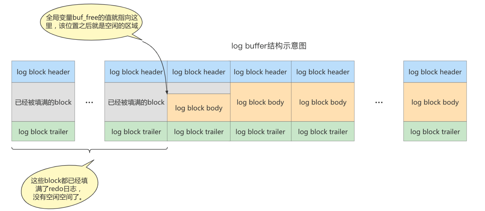

> 事务有4种特性: **原子性、一致性、隔离性和持久性**。那么事务的四种特性到底是基于什么机制实现呢?
>
> 1. 事务的隔离性由 **锁机制** 实现
> 2. **事务的原子性、一致性和持久性由事务的 Redo 日志和 Undo 日志来保证**
>    - REDO LOG
>      - `重做日志` 
>      - 提供再写入操作，恢复提交事务修改的页操作,用来保证事务的持久性
>    - UNDO LOG
>      - `回滚日志`
>      - 回滚行记录到某个特定版本，用来保证事务的原子性、一致性

**Redo 和 Undo 日志都可以视为恢复操作:**

- redo_log 是存储引擎(InnoDB)生成的日志,记录的是`物理级别`上的页的`修改操作`,比如页号xxx、偏移量 xxx写入了xxx 数据,**主要为了保证数据的可靠性 **
- undo_log 是存储引擎(InnoDB)生成的日志,记录的是`逻辑操作`日志,比如对某一行数据进行了 insert 语句操作,**undo_log 就记录一条与之相反的delete 语句操作,主要用于`事务的回滚`**

 

**一些博客推荐**

1. [WAL机制及脏页刷新](https://segmentfault.com/a/1190000020835301)

## Redo日志

- InnoDB 存储引擎是`以页为单位`来管理存储空间的
- 在真正访问页面之前,需要把`磁盘上`的页缓存的内存里的缓冲区(BufferPool)中才可以访问
  - **所有的变更都必须`先更新缓冲池`中的数据,然后缓冲池中的脏页会以一定的频率被刷入磁盘(`checkpoint 机制`)**
  - 通过缓冲池来优化 CPU 和磁盘之间的鸿沟,来保证整体的性能不会下降的太快

### 为什么需要Redo

- **可能出现的问题:**

  - **缓冲池可以帮助我们消除CPU和磁盘之间的鸿沟，Checkpoint机制可以保证数据的最终落盘**, 但checkpoint 并不是每次变更的时候就触发的,而是master线程隔一段时间去处理的
    - 最坏的情况就是事务提交后，刚写完缓冲池数据库就宕机了,那么这段数据就会丢失无法恢复

  - 事务包含`持久性`的特性，就是说对于一个已经提交的事务，在事务提交后即使系统发生了崩溃，这个事务对数据库中所做的更改也不能丢失

- **解决上述问题的方案1**

  - 在事务提交完成之前把该事务所修改的所有页面都刷新到磁盘,但是一个页面默认有 16kb,刷新完整的数据页性能很差 ❌

- **解决上述问题的方案2 => redo log**

  - 只是想让已经提交了的事务对数据库中数据所做的修改永久生效，即使后来系统崩溃，在重启后也能把这种修改恢复出来而已,所以**没有必要在每次事务提交时就把该事务在内存中修改过的全部页面刷新到磁盘**，只需要把 `修改了哪些东西记录一下`就好

    - 比如某个事务将系统表空间中 第10号 页面中偏移量为 100 处的那个字节的值 1 改成 2。我们只需要记录一下:将第0号表 空间的10号页面的偏移量为100处的值更新为 2

- **预写式日志: WAL (Write Ahead Log)**

  - InnoDB 存储引擎的事务使用了`WAL 技术`
  - 这个技术就是`当前事务提交时,先写Redo日志,再更新磁盘页,只有当 Redo 日志写入成功后,才算事务提交成功!`
  - **当服务器宕机且数据没有更新到磁盘的时候,可以通过 redo log 恢复,以此来保证数据的一致性**

### Redo Log 好处与特点

- **Redo Log优点**

  - **占用的空间非常小**
  - **降低了刷盘的频率**
  
- **Redo Log特点**

  - `Redo日志是顺序写入磁盘的`

    - 执行事务的过程中,每执行一条语句就会产生若干的 redo log,这些日志是按照`产生顺序写入磁盘的`
    - 使用的是顺序 IO,比随机 IO 快

  - `事务执行过程中，Redo日志不断记录`

    - redo log 和 binlog的区别在于: **redo log是`存储引擎层`产生的,而 binlog 是`MySQL 数据库层`产生的**
    - 假设一个事务对表进行 10万行记录的插入时,**会不断地向 redo log 顺序记录,但是 binlog不会,只有事务提交完成后,才会一次写入 binlog中**

    

### Redo Log的组成

Redo Log可以简单分为以下两个部分:

1. `重做日志缓冲 (redo log buffer)`
2. `重做日志文件 (redo log file) `

#### 重做日志缓冲

- **保存在内存中，是易失的**
- 在服务器启动时就会想操作系统申请一大片叫做`redo log buffer`的`连续内存`空间,这个空间被划分为若干个连续的`redo log block`
  - 一个 redo log block 占用`512 字节`大小
- **参数设置**
  - `innodb_log_buffer_size`
    - 默认为`16M`
    - 最大值为`4096M`,最小为`1M`

#### 重做日志文件

- 保存在磁盘上,是持久化的

**redo log日志文件在磁盘上的体现:**

### redo的流程

以一个更新事务为例,redo log 流转过程如下图所示:

1. **先将原始数据从磁盘中读入内存中来，修改数据的内存拷贝**
2. **生成一条重做日志并写入redo log buffer，记录的是数据被修改后的值**
3. **当事务commit时，将redo log buffer中的内容刷新到 redo log file。对 redo log file采用追加写的方式**
4. **定期将内存中修改的数据刷新到磁盘中**

:::tip 说明

WAL(Write-Ahead-Log)是在内存中数据页刷新到本地磁盘文件前,需要**现将内存中的日志文件持久化到本地**。

:::

### 事务提交时的刷盘(fsync)策略

> redo log file 的的写入不是直接写入的,InnoDB 引擎会在写redo log的时候,先写入 redo log buffer,之后以`一定的频率`刷入到真正的 redo log file 中,这个**一定的频率就是刷盘策略**

- redo log buffer刷盘到redo log file的过程并不是真正的刷到磁盘中去，只是刷入到`文件系统缓存(Page Cache)`中去,这是现代操作系统为了提高文件写入效率做的一个优化。但就会存在 OS 宕机的了,数据丢失的情况
- 参数`innodb_flush_log_at_trx_commit`
  - **控制 commit提交事务时，如何将 redo log buffer 中的日志刷新到 redo log file 中**, 有**3种策略** 
    - `0`
      - **表示每次事务提交时不进行刷盘操作, 而是让后台线程master thread每隔1s进行一次重做日志的同步**
      - 即master thread 处理每隔 1s 将日志从 redo log buffer写入 page Cache,然后再从 page cache 同步写入磁盘
    - `1`
      - **表示每次事务提交时都将进行同步,刷盘操作 (默认值)**
    - `2`
      - **表示每次事务提交时都只把 redo log buffer 内容写入 page cache，不进行同步**
      - master thread 处理每隔 1s 进行刷盘操作,将page Cache数据同步写入磁盘
      - **如果期间 mysql 服务器宕机了,没有 master thread,由于写入了 pache Cache,IO 也可以将其写入文件**
  - <mark>master thread的将数据从缓冲池同步到磁盘的操作是默认行为,与该参数无关!</mark> 

**1. innodb_flush_log_at_trx_commit = 0**

> 一旦 MySQL 宕了,那么数据就丢失了,因为redo log buffer没有写入到 page cache 中

**2. innodb_flush_log_at_trx_commit = 1**

> 这种方式效率最低,但也最安全, **只要事务提交成功了,那么 redo log 记录一定在磁盘中,不会有任何数据的丢失**
>
> 当然,如果事务执行期间 MySQL 宕了,事务没有执行成功,那这部分日志也就丢失了 

**3. innodb_flush_log_at_trx_commit = 2**

> 只要事务提交成功,redo log buffer 中内容只会写入文件系统缓存(Page Cache)。
>
> 如果仅仅是 MySQL 服务器宕机了,那么不会丢失任何数据,因为数据还在 OS 的项文件系统缓存中,但如果是 OS 宕机了,那么数据就不存在了

### 写入 redo log buffer过程

#### Mini-Transaction

MySQL 把**对底层页面(不止数据页)的一次原子访问的过程称之为`Mini-Transaction`,简称 MTR**。比如向某个索引对应的 B+Tree 中插入一条记录的过程就是一个`Mini-Transaction`。**一个mtr中可以包含`一组` redo日志,在进行崩溃恢复时,这一组 redo日志作为一个不可分割的整体**

**一个事务可以包含若干条语句，每一条语句其实是由若干个 mtr 组成，每一个 mtr 又可以包含若干条redo日志。**如图:

#### redo日志 写入log buffer

- 向log buffer中写入 redo日志的过程是**顺序的**,也就是**先往前面的 block 中写,当该block 的空闲空间用完之后再往下一个 block 中写**

- 有个问题: 想往 log buffer中写入 redo 日志时,应该写在哪个 block 的哪个偏移量处?(写在哪)
  - **MySQL 有一个全局变量`buf_free`,指明了后续写入的 redo 日志应该写在 log buffer的哪个位置**
- 一个 mtr执行过程中可能会产生若干条 redo 日志,`这些 redo 日志是不可分割的组`
  - **并不是每生成一条 redo 日志就将其插入到 log buffer中,而是将每个 MTR 运行过程中的日志暂存到一个地方,然后在该 MTR 结束的时候,再将过程中产生的一组 redo 日志全部复制到 log buffer中**

:::info 示例示意图

> **假设有两个事务 T1、T2,每个事务包含两个 MTR:**
>
> 事务 T1 的两个 MTR 分别是 mtr_t1_1、mtr_t1_2
>
> 事务 T2 的两个 MTR 分别是 mtr_t2_1、mtr_t2_2

每个 MTR 会产生一组 redo 日志,即:

 

**不同事务是可能`并发`执行的、所以 T1、T2 的 MTR 可能是`交替执行`的。每当一个 MTR 执行完成时,该 MTR 对应的一组 redo日志就会被复制到 log buffer中**,即不同事务的 MTR 可能是交替写入 log buffer的:

:::