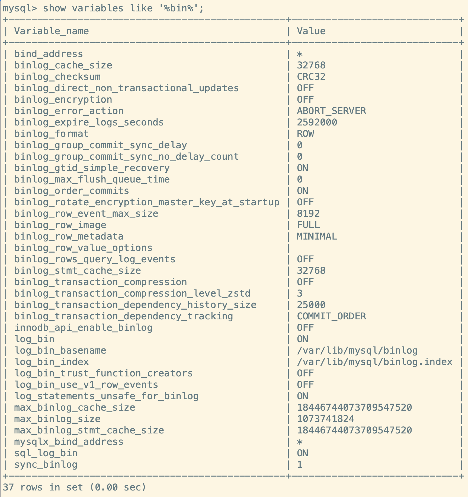
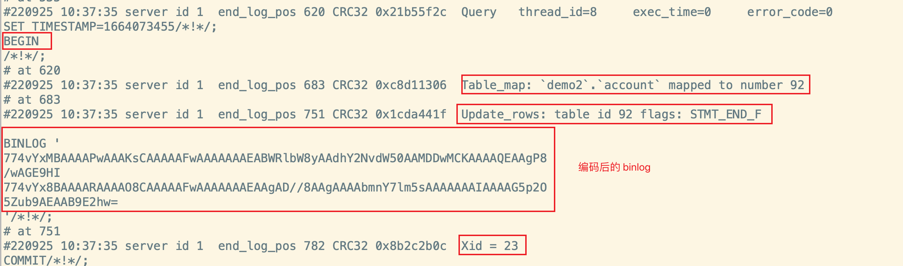

> 在前面的数据库的事务中,我们遇到了两种日志: **redo日志、undo日志**
>
> 对于线上的数据库遇到了宕机怎么办?我们可以通过查看数据库的`错误日志`。因为日志中包含了错误、警告等信息,比如可以通过日志发现某个 SQL 发生了死循环导致内存不足等
>
> 除了发现错误,日志在`数据复制、数据恢复、操作审计以及确保数据的永久性、一致性`等方面,有着很重要的作用
>
> [MySQL8.0 日志官网](https://dev.mysql.com/doc/refman/8.0/en/server-logs.html )

## MySQL 日志类型

MySQL 有很多类型的日志,最常用的有**二进制日志、错误日志、通用查询日志、慢查询日志**。MySQL8.0 又新加了两种日志**中继日志、数据定义语句日志**,即:

1. `慢查询日志 [slow query log]`
   - **记录所有执行时间超过 *long_query_time* 的所有查询,方便我们对 SQL 语句进行优化**
2. `通用查询日志 [general query log]`
   - **记录所有连接的起始时间和终止时间,以及连接发送给数据库服务器的所有指令** 
   - 对我们复原操作的实际场景、发现问题，甚至是对数据库操作的审计都有很大的帮助
   - [相关信息](其他日志#通用查询日志)
3. `错误日志 [error log]`
   - **记录MySQL服务的启动、运行或停止MySQL服务时出现的问题**
   - 方便我们了解服务器的 状态，从而对服务器进行维护
   - [相关信息](其他日志#错误日志)
4. `二进制日志 [bin log]`
   - **记录所有更改数据的语句**
   - 可以用于主从服务器之间的数据同步,以及服务器遇到故障时数据的无损失恢复
5. `中继日志 [relay log]`
   - <mark>MySQL 8.0 新增</mark> 
   - **从服务器通过读取中继日志的内容,来同步主服务器上的操作**
   - 用于主从服务器架构中,从服务器用来存放主服务器二进制日志内容的一个中间文件
6. `数据定义语句日志`
   - **记录数据定义语句执行的元数据操作**

除二进制日志外, 其他日志都是`文本文件`。默认情况下, 所有日志创建于 `MySQL数据目录` 中

:::caution 日志的缺点

1. 日志功能会降低数据库的性能

2. 日志会占用大量的磁盘空间

:::

## 慢查询日志

[慢查询日志的详细信息](性能分析工具#定位慢sql慢查询日志)

## 通用查询日志

> 通用查询日志用来`记录用户的所有操作`, 包括**启动和关闭MySQL服务、所有用户的连接开始时间和截止 时间、发给 MySQL 数据库服务器的所有 SQL 指令等**
>
> 当我们的数据发生异常时, **查看通用查询日志, 然后还原操作时的具体场景** ,可以帮助我们准确定位问题

### 查看参数状态

通过下面的命令可以查看通用查询日志功能是否开启:

```sql
/*
	通用查询日志默认是关闭的
*/
SHOW VARIABLES LIKE '%general%';
```

:::info 使用示例


:::

### 参数配置

**和大多数的变量配置类似的,也有两种方式进行启用和关闭:**

1. `修改配置文件 (my.cnf | my.ini)`

   - **在[mysqld]组下加入*general_log*选项,并重启MySQL服务**

     ```ini title="my.cnf"
     [mysqld]
     
     # 开启或者关闭通用查询日志
     general_log=ON | OFF
     
     # 设置日志文件保存位置 (filename为日志文件名)
     general_log_file=path[filename]
     ```

   - <mark>如果不指定目录和文件名, 通用查询日志将默认存储在MySQL数据目录中的 hostname.log 文件中， hostname表示主机名</mark> 

2. `临时方式 (SQL 语句)`

   ```sql
   # 开启或者关闭通用查询日志
   SET GLOBAL general_log=on | off; 
   
   # 设置日志文件保存位置
   SET GLOBAL general_log_file=’path[/filename]’; 
   ```

   :::info 使用示例

   先开启通用查询日志(这里采用临时方式), 然后执行 SQL 语句,最后观察通用查询日志文件的内容:

   

   :::

## 错误日志

> 错误日志记录了 MySQL 服务器启动、停止运行时间以及系统启动、运行和停止过程中的诊断信息。包括错误、警告和提示等

### 查看参数状态

MySQL数据库中，错误日志功能是 `强制开启` 的。而且**错误日志无法被禁止**, 通过下面的命令可以查看错误日志的参数:

```sql
SHOW VARIABLES LIKE '%log_err%';
```

:::info 使用示例


:::

### 参数配置

- 默认情况下,错误日志存储在 MySQL 的数据文件夹下,名称默认为 `mysqld.log` (Linux系统)或 `hostname.err` (mac系统)

- **修改错误日志的路径:**

  ```ini title="my.cnf"
  [mysqld]
  # path为日志文件所在的目录路径，filename为日志文件名
  log-error=path/[filename]
	```

:::info 使用示例


:::

## 二进制日志

> Binlog 可以说是 MySQL 中比较重要的日志了,在日常开发与运维中经常会用到

- `binlog`(binary log) 也就是`二进制日志文件`,也叫做`变更日志(update log)`。它记录了数据库中所有执行的`DDL、DML 等数据库更新语句`,但是不包含没有修改任何数据数据,比如*select、show…*

- binlog 会以`事件形式`记录并保存在`二进制文件`中,通过 binlog 可以再现数据更新操作的全过程

  :::tip 小贴士

  如果记录所有的语句,那么需要使用**通用查询日志**

  :::

- **binlog的主要使用场景**

  1. `数据恢复`
     - 如果 MySQL 因为意外而停止,可以通过 *binlog* 查看用户执行了哪些操作,对数据库服务器文件进行了哪些修改,然后根据 *binlog* 文件中的记录来恢复 MySQL 服务器
  2. `数据复制`
     - master 会把它的 *binlog* 传递给 slaves 来保证主从数据库数据的一致性
     - 可以说**MySQL 的数据备份,主备、主主、主从都需要使用 *binlog* 来同步数据,保证数据的一致性**

### 查看参数状态

MySQL 中可以通过下面的语句查看 *binlog* 的参数状态 (默认 binLog 功能是开启的):

```sql
SHOW VARIABLES LIKE '%bin%';
```

**binlog 常见的参数说明**

1. `log_bin`
   - 是否开启 binlog,默认是开启的
2. `log_bin_basename`
   - binlog 的日志前缀
   - binlog 不是单独的一个文件,会被分割为多个文件,比如 binlog00001、binlog00002…
3. `log_bin_index`
   - binlog 的索引文件
4. `log_bin_trust_function_creators`
   - 是否信任创建函数
   - 因为在主从复制的时候,函数在主从机执行的时候结果可能是不一样的,会导致主从机数据不一致的情况
5. `sql_log_bin`
   - 是否支持 SQL 写入
6. `binlog_expire_logs_seconds` 
   - 设置 binlog 文件的有效期,单位是**秒**
7. `max_binlog_size` 
   - 设置单个 binlog 文件的最大值
8. `sync_binlog`
   - 刷盘策略,类似于[redolog也有刷盘策略](Redo日志#事务提交时的刷盘fsync策略)

:::info 使用示例



:::

### 参数配置

1. `修改MySQL 配置文件 [my.ini、my.cnf]`

   ```ini
   [mysqld]
   # binlog的前缀名
   log-bin=my_binlog
   binlog_expire_logs_seconds=600 
   max_binlog_size=100M
   ```

   :::tip 说明

   - 配置文件中的 `log-bin` 参数是用以来设置 binlog 的前缀名的,**也可以加上路径**
     - 比如 */home/www/binlog/my_binlog*

   :::

2. `临时方式 [sql语句]`

   ```sql
   -- 仅支持 SESSION 级别
   SET sql_log_bin=OFF
   ```

### 查看日志

> MySQL 服务每次启动时, 都会创建一个 binlog 文件

#### 日志列表

我们可以通过`show binary logs`命令查看当前已有的 binlog 列表信息

```sql
mysql> show binary logs;
+------------------+-----------+-----------+
| Log_name         | File_size | Encrypted |
+------------------+-----------+-----------+
| my_binlog.000001 |       156 | No        |
+------------------+-----------+-----------+
1 row in set (0.00 sec)
```

#### binlog 分析工具

和[slow_query_log](性能分析工具#慢日志分析工具) 一样,binlog也有自己的解析工具: **mysqlbinlog**

- **基本格式** 
  - `mysqlbinlog [options] 日志路径` 

- **常用语句**

  ```sql
  # 可查看参数帮助
  mysqlbinlog --no-defaults --help
  # 查看最后100行
  mysqlbinlog --no-defaults --base64-output=decode-rows -vv 日志名 |tail -100
  # 根据position查找
  mysqlbinlog --no-defaults --base64-output=decode-rows -vv 日志名 |grep -A 20 'pos位置'
  ```

:::info 示例

**1.使用命令:  *mysqlbinlog 日志路径* : 可以看到binlog 后面的内容都是经过编码后的,但是可以看到一个 update 语句含有下面的几个事件:**

1. `Query 事件`: 负责开始一个事务(Begin)
2. `Table_map 事件` : 负责映射需要的表
3. `Update_rows事件` : 负责写入数据
4. `Xid 事件` : 负责结束事务



<br/>

**2. 我们用 base64 解码的方式去解析得到伪 SQL**


:::

#### binlog 事件

- 通过*mysqlbinlog* 得到的日志内容比较多,可以指定查询 binlog 的 pos 点
- **基本格式**
  - `show binlog events [IN 'log_name'] [FROM pos] [LIMIT [offset,] row_count];`
    - **IN  logName** 
      - 指定要查询的binlog文件名(不指定就是第一个binlog文件) 
    - **FROM pos**
      - 定从哪个pos起始点开始查起(不指定就是从整个文件首个pos点开始算)
    - **LIMIT [offset]**
      - 偏移量(不指定就是0)
    - **row_count**
      - 查询总条数(不指定就是所有行)

:::info  示例


<br/>


:::

### 恢复数据

MySQL 可以通过*mysqlbinlog* 来恢复数据,基本语法如下:

- `mysqlbinlog [option] 日志文件名|mysql –u用户 -p密码;`
  - option 可选项有两对重要的参数
    - `--start-date、--stop-date` 
      - 指定恢复数据库的起始时间点和结束时间点
    - `--start-position、-- stop-position` 
      - 指定恢复数据的开始位置和结束位置
    - `--database` 
      - 指定在哪个数据库执行恢复操作
- <mark><strong>注意:</strong>使用mysqlbinlog命令进行恢复操作时,必须是编号小的先恢复</mark> 

:::info 示例

**1. 我们先查看表中原有的数据是什么**

```sql
mysql> select * from account;
+----+--------+------+
| id | name   | sal  |
+----+--------+------+
|  1 | 张三   |  200 |
|  2 | 李四   |  500 |
|  3 | 王五   | 1000 |
|  4 | 赵六   | 1000 |
+----+--------+------+
4 rows in set (0.00 sec)
```

**2.然后插入一条数据,再将该数据删除**

```sql
mysql> # 插入一条数据
mysql> insert into account values(5,'测试','100000')
    -> ;
Query OK, 1 row affected (0.01 sec)

mysql> #删除新加的数据
mysql> delete from account where id=5;
Query OK, 1 row affected (0.08 sec)
```

**3.查看 binlog 的记录,可以看到:**

- <mark>Pos [235, 456] 区间的操作就是 INSERT 操作对应的 binlog 记录</mark> 

```sql
mysql> # 查看 binlog
mysql> show binary logs;
+------------------+-----------+-----------+
| Log_name         | File_size | Encrypted |
+------------------+-----------+-----------+
| my_binlog.000001 |       805 | No        |
| my_binlog.000002 |       756 | No        |
+------------------+-----------+-----------+
2 rows in set (0.01 sec)

mysql> # 查看最新 binlog 的pos
mysql> show binlog events in 'my_binlog.000002';
+------------------+-----+----------------+-----------+-------------+--------------------------------------+
| Log_name         | Pos | Event_type     | Server_id | End_log_pos | Info                                 |
+------------------+-----+----------------+-----------+-------------+--------------------------------------+
| my_binlog.000002 |   4 | Format_desc    |         1 |         125 | Server ver: 8.0.25, Binlog ver: 4    |
| my_binlog.000002 | 125 | Previous_gtids |         1 |         156 |                                      |
| my_binlog.000002 | 156 | Anonymous_Gtid |         1 |         235 | SET @@SESSION.GTID_NEXT= 'ANONYMOUS' |
/* highlight-start */
| my_binlog.000002 | 235 | Query          |         1 |         311 | BEGIN                                |
| my_binlog.000002 | 311 | Table_map      |         1 |         374 | table_id: 91 (demo2.account)         |
| my_binlog.000002 | 374 | Write_rows     |         1 |         425 | table_id: 91 flags: STMT_END_F       |
| my_binlog.000002 | 425 | Xid            |         1 |         456 | COMMIT /* xid=30 */                  |
| my_binlog.000002 | 456 | Anonymous_Gtid |         1 |         535 | SET @@SESSION.GTID_NEXT= 'ANONYMOUS' |
/* highlight-end */
| my_binlog.000002 | 535 | Query          |         1 |         611 | BEGIN                                |
| my_binlog.000002 | 611 | Table_map      |         1 |         674 | table_id: 91 (demo2.account)         |
| my_binlog.000002 | 674 | Delete_rows    |         1 |         725 | table_id: 91 flags: STMT_END_F       |
| my_binlog.000002 | 725 | Xid            |         1 |         756 | COMMIT /* xid=31 */                  |
+------------------+-----+----------------+-----------+-------------+--------------------------------------+
12 rows in set (0.00 sec)

```

**4.利用 mysqlbinlog 恢复数据**

- <mark>需要注意的是: 一般都需要指定恢复 pos位置或者时间范围,否则可能会将一些误操作的 binlog 记录也执行,导致恢复失败</mark> 

```sh
[root@localhost mysql]# mysqlbinlog --start-position=235 --stop-position=456 my_binlog.000002 |mysql -uroot -p   
Enter password: 
[root@localhost mysql]# # 这里恢复完成
```

**5.查看 MySQL 数据,可以看到删除的 *id=5* 的数据恢复成功了** 

```sql
mysql> select * from account;
+----+--------+--------+
| id | name   | sal    |
+----+--------+--------+
|  1 | 张三   |    200 |
|  2 | 李四   |    500 |
|  3 | 王五   |   1000 |
|  4 | 赵六   |   1000 |
/* highlight-start */
|  5 | 测试   | 100000 |
/* highlight-end */
+----+--------+--------+
5 rows in set (0.00 sec)
```

:::

### 删除日志

MySQL 的 binlog 文件可以配置**自动删除**, 同时 MySQL 也支持**安全的手动删除**

1. `PURGE MASTER LOGS`
   - 只删除指定部分 binlog 文件
2. `RESET MASTER`
   - 删除所有的 binlog 文件

#### purge

可以删除指定的 binlog 文件,基本语法如下:

1. ` PURGE {MASTER | BINARY} LOGS TO ‘指定日志文件名’ `
   - 删除指定日志文件之前的 binlog, 但是<mark>不包含指定的日志文件</mark> 
2. ` PURGE {MASTER | BINARY} LOGS BEFORE ‘指定日期’`
   - 删除指定时间之前的 binlog, 但是<mark>不包含指定时间的日志文件</mark> 

#### reset 🚧

使用`reset master` 语句会清空所有的 binlog 文件,并且 MySQL 会重新创建 binlog文件,**新的日志拓展名也将从 *.00001* 开始**

### 其他场景

通过数据库的`全量备份` 和 binlog 中保存的 `增量信息` , 可以完成数据库的 `无损失恢复` 。 但如果遇到数据量大、数据库和数据表很多(比如分库分表的应用)的场景, 用二进制日志进行数据恢复, 是很有挑战性的, 因为**起止位置不容易管理**。

在这种情况下, 一个有效的解决办法是 `配置主从数据库服务器`, 甚至是 `一主多从` 的架构, **把binlog 文件的内容通过中继日志, 同步到从数据库服务器中**, 这样就可以**有效避免数据库故障导致的数据异常等问题**

### 写入机制

- binlog 的写入时机很简单,**在事务执行过程中,先把日志写到**`binlog cache`**,事务提交的时候,再把 binlog cache 写入到 binlog 文件中。**
  - 由于一个事务的 binlog 无法被拆开,所以不论这个事务多大,都要保证能一次性的写入,所以 MySQL 会给**每个线程分配一块内存作为 *binlog cache***
- 我们可以通过 `binlog_cache_size` 参数控制单个线程 *binlog cache* 大小。如果超过这个阈值,就需要将暂存到 *磁盘(Swap)*

**binlog 刷盘流程:**


:::caution 说明

binlog cache 写入到**page cache** 和 刷盘**fsync** 的时机由参数 `sync_binlog` 控制,默认是 `0`

1. `sync_binlog = 0`
   - **每次提交事务都只写入到 *page cache* , 具体什么时候执行 fsync刷盘由 OS 决定** 
   - 这种方式虽然性能得到提升，但是机器宕机，page cache里面的 binglog 会丢失
2. `sync_binlog = 1`
   - **表示每次提交事务都会执行刷盘 *fsync***, 就和 redo日志刷盘流程一样

3. `sync_binlog = N [N>1]`
   - **表示每次提交事务都将 binlog cache 写入到 page cache中, 但累积了N个`事务`后才刷盘 fsync** 
   - 在出现IO瓶颈的场景里, 可以将 sync_binlog 设置成一个比较大的值来提升性能。但如果机器宕机,会丢失最近N个事务的 binlog

:::

### binlog 与 redo log

- `redo log` 它是`物理日志`, 记录内容是**在某个数据页上做了什么修改**, 属于 InnoDB `存储引擎层`产生的
- `binlog`是 `逻辑日志`, 记录内容是语句的原始逻辑, 类似于**给 ID=2 这一行的 c 字段加 1**,  属于MySQL `Server 层`
- 虽然两者都保证了持久化,但是**侧重点不同**
  - **redo log 让 InnoDB 存储引擎有了崩溃恢复的能力**
  - **binlog 保证了MySQL 集群架构下的数据一致性**

### 内部 XA 事务

在执行更新语句时, 会记录 *`redo log`* 与 *`binlog`* 两块日志, **以基本的事务为单位**, **redo log在事务执行过程 中可以不断写入，而binlog只有在提交事务时才写入**, 所以redo log 与 binlog 的**写入时机不一样**


#### 两阶段提交(2PC)

- 两阶段提交就是将 redo 日志的写入拆分成两个步骤`prepare、commit` 
  1. 当事务提交的时候, 会将`事务 id`写入 redo 日志。此时InnoDB 会给 redo 日志做一个 *prepare* 操作,处于*prepare* 阶段
  2. server 层的执行器 `写入 binlog`,同时也会将`事务 id`写入
  3. InnoDB 给 redo 日志做 *commit* 操作
- **数据库重启之后只要判断 redo 日志的**`事务 id` **是否有对应的 binlog 即可**


:::tip 为什么需要两阶段提交?

- 在事务提交的时候,先写 binlog, 再写InnoDB 存储引擎的 redo日志,对于这两个操作的也需要是原子的
  - 如果binlog 先写了,而在写入 redo 日志的时候发生了宕机,那么 slave 就可能会收到 master 传过去的 binlog 并执行,然后 master 没有 redo 日志,所以无法恢复
  - 上面的操作就会导致主从机的数据不一致
- <mark>两阶段提交, 其实是为了保证 redo log 和 binlog 的逻辑一致性</mark> 

:::

## 中继日志

- **中继日志只在 *master-slave*架构的从服务器上存在**。slave 为了与master 保持一致, 要从master 服务器上读取binlog, 并且把读取到的信息写入`本地日志文件`中，这个slave 服务器的本地日志文件就叫`中继日志(relay log)`。
  - 然后, slave 服务器读取中继日志, 并根据中继日志的内容对 slave 服务器的数据进行更新,完成主从服务器的`数据同步` 

- 搭建好主从服务器之后, **中继日志默认会保存在 slave服务器的数据目录下**
  - 文件名的格式是 `slave服务器名-relay-bin.序号`
  - 中继日志还有一个索引文件: `slave服务器名-relay-bin.index`, 用来定位当前正在使用的中继日志
- **中继日志与二进制日志的格式相同，可以用`mysqlbinlog`工具进行查看**

## 日志的通用操作

### 刷新日志

**通过下面的命令可以刷新日志:**

```sql
mysqladmin -uroot -p flush-logs

# 或者在 MySQL 控制台
mysql> flush logs
```

