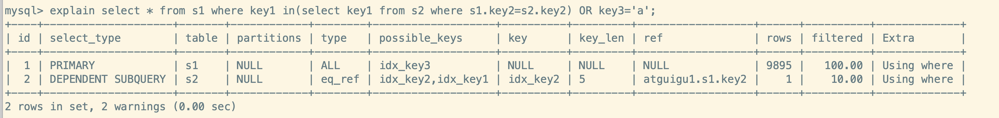

在数据库调优中,我们的目标是`响应时间快、吞吐量大`,利用监测工具和日志分析可以帮我们快速的找到调优的思路和方式

## 数据库的优化步骤

当我们遇到数据库调优问题的时候，该如何思考呢?这里把思考的流程整理成下面这张图

整个流程划分成了`观察(Show status)`和`行动(Action)`两个部分。**字母S的部分代表观察(会使用相应的分析工具)，字母 A 代表的部分是行动(对应分析可以采取的行动)**

**


## 查看系统性能参数

### 概述

- 在 MySQL,我们可以使用`SHOW STATUS`语句查看一些 MySQL 数据库服务器的`性能参数、执行频率`
- **语法格式**
  - `SHOW [GLOBAL | SESSION] STATUS LIKE '参数'`
- <mark>我们可以使用<strong>慢查询次数</strong>参数,结合慢查询日志找出慢查询语句,然后针对慢查询语句进行<strong>表结构优化</strong>或者<strong>查询语句优化</strong></mark>
***常用的参数列表**

| 参数名                 | 说明                                                       |
| ---------------------- | ---------------------------------------------------------- |
| `Connections`          | 连接MySQL服务器的次数                                      |
| `Uptime`               | MySQL服务器的上线时间,单位**秒**                           |
| `Slow_queries`         | 慢查询的次数                                               |
| `Innodb_rows_read`     | Select查询返回的行数                                       |
| `Innodb_rows_inserted` | 执行INSERT操作插入的行数                                   |
| `Innodb_rows_updated`  | 执行UPDATE操作更新的行数                                   |
| `Innodb_rows_deleted`  | 执行DELETE操作删除的行数                                   |
| `Com_select`           | 查询操作的次数                                             |
| `Com_insert`           | 插入操作的次数。**对于批量插入的 INSERT 操作，只累加一次** |
| `Com_update`           | 更新操作的次数                                             |
| `Com_delete`           | 删除操作的次数                                             |

:::info 示例

**1.查看 MySQL 服务器连接次数**

```sql
mysql> show status like 'Connections';
+---------------+-------+
| Variable_name | Value |
+---------------+-------+
| Connections   | 11    |
+---------------+-------+
```


**2. 查看MySQL 服务器上线时间**

```sql
-- 时间的单位是 s
mysql> show status like 'Uptime';
+---------------+-------+
| Variable_name | Value |
+---------------+-------+
| Uptime        | 11945 |
+---------------+-------+
```


**3.查看CRUD 的行数**

```sql
mysql> show status like 'innodb_rows_%';
+----------------------+-------+
| Variable_name        | Value |
+----------------------+-------+
| Innodb_rows_deleted  | 0     |
| Innodb_rows_inserted | 0     |
| Innodb_rows_read     | 0     |
| Innodb_rows_updated  | 0     |
+----------------------+-------+

mysql> select * from course;        
+-----+-----------+-------------+
| id  | course_id | course_name |
+-----+-----------+-------------+
|   1 |     10073 | jNmVQs      |
|   2 |     10035 | JuUoLL      |
|  98 |     10035 | YQkAXl      |
/*..............................*/
|  99 |     10022 | zOuFVM      |
| 100 |     10094 | yDxAkA      |
+-----+-----------+-------------+
100 rows in set (0.00 sec)

mysql> show status like 'innodb_rows_%';
+----------------------+-------+
| Variable_name        | Value |
+----------------------+-------+
| Innodb_rows_deleted  | 0     |
| Innodb_rows_inserted | 0     |
| Innodb_rows_read     | 100   |
| Innodb_rows_updated  | 0     |
+----------------------+-------+
4 rows in set (0.00 sec)
```

:::

### SQL查询成本(last_query_cost)

>  一条SQL 查询语句在执行前需要确定一个**执行计划**,如果存在多种执行计划, 那么MySQL 会计算每个执行计划所需要的成本, 最后从中选择**成本最小**的一个作为最终执行的执行计划

- 如果想查看某条 SQL 语句的执行成本,**可以在执行完这个 SQL 语句之后,通过查看`当前会话`中的性能参数 `last_query_cost`的变量值来得到执行成本 **。SQL 查询成本通常也是我们**评价一个查询的执行效率的常用指标**, 这个查询成本对应的是`SQL 语句所需要读取的页的数量`

- **在对于比较开销是非常有用的，特别是我们有好几种查询方式可选的时候,我们可以采用这种方式**

:::info 示例

**查询student_info 中指定 student_id 的学生信息,观察是否有索引的区别**

```sql
-- 没有为 student_id加上索引,耗时 0.24s
mysql> select * from  student_info where student_id=1234;    
+--------+------------+--------+-----------+----------+---------------------+
| id     | student_id | name   | course_id | class_id | create_time         |
+--------+------------+--------+-----------+----------+---------------------+
| 505843 |       1234 | OTdMwX |     10025 |    10150 | 2022-07-17 16:35:45 |
+--------+------------+--------+-----------+----------+---------------------+
1 row in set (0.24 sec)

-- 这里加载了 100489 个数据页
mysql> show status like 'last_query_cost';
+-----------------+---------------+
| Variable_name   | Value         |
+-----------------+---------------+
| Last_query_cost | 100488.649000 |
+-----------------+---------------+
1 row in set (0.00 sec)

-- 为 student_id加上索引
mysql> create index idx_sid on student_info (student_id);
Query OK, 0 rows affected (2.71 sec)
Records: 0  Duplicates: 0  Warnings: 0

mysql> select * from  student_info where student_id=1234;
+--------+------------+--------+-----------+----------+---------------------+
| id     | student_id | name   | course_id | class_id | create_time         |
+--------+------------+--------+-----------+----------+---------------------+
| 505843 |       1234 | OTdMwX |     10025 |    10150 | 2022-07-17 16:35:45 |
+--------+------------+--------+-----------+----------+---------------------+
1 row in set (0.00 sec)

-- 这里加载了 1 个数据页
mysql> show status like 'last_query_cost';
+-----------------+----------+
| Variable_name   | Value    |
+-----------------+----------+
| Last_query_cost | 0.349000 |
+-----------------+----------+
1 row in set (0.00 sec)
```

<mark>我们可以看到加上索引后,SQL 查询成本很低,相差了数十万个数量级。但是在查询时间上并没有这个数量级的体现</mark>

实际上这两个 **SQL 查询的时间基本上相差相对不大**， 就是因为采用了`顺序读取`的方式将页面一次性加载到缓冲池中，然后再进行查找。虽然 `last_query_cost增加了不少 `，但是通过`缓冲池`的机制，并 **没有增加多少查询时间** 

:::

### 小结说明

SQL 查询是一个动态的过程,从页加载的角度上说,可以有两点结论:

1. `位置决定效率`
   - 如果页就在数据库`缓冲池`,那么效率是最好的,否则还需要从`内存`或者`磁盘`中进行读取
   - 当然了,对于单个页来说,从内存中读取肯定比从磁盘读取效率高得多
2. `批量决定效率`
   - 如果我们从磁盘中对单一页进行随机读取,那么效率是很低的,差不多 10ms。而采用顺序读取的方式,批量对页进行读取,平均每页的读取效率会提升很多,甚至要快于单个页面在内存中的随机读取

所以说,遇到 IO 不用担心,如果方法对的话,效率也是很高的。

**我们首先需要考虑数据存放的位置,如果是经常使用的数据就要尽量放在**`缓冲池`**中,然后可以充分利用磁盘的吞吐能力,一次性批量读取数据,这样单个页的读取效率就得到了提升**

## 定位慢SQL(慢查询日志)

- MySQL 的慢查询日志,用于记录 MySQL 中`响应时间超过阈值`的语句,具体指运行时间超过`long_query_time`值的 SQL,就会被记录到慢查询日志中。
  - **long_query_time** 的默认值是`10`,意思是执行 10s以上的语句,就是一个慢 SQL

- 慢查询日志主要作用是,帮助发现那些执行时间特别长的 SQL 查询,并且针对这些 SQL 语句进行优化。当我们的数据库发生阻塞、运行变慢的时候,可以检查一些慢查询日志,找出那些慢查询
- **默认情况下,MySQL 数据库`没有开启慢查询日志`,需要手动的设置这个参数**,`如果不是调优需要的话,一般不建议启动这个参数`,因为开启慢查询日志本身会有一些性能的影响
- <mark>慢查询支持将日志记录写入到文件中</mark>

:::tip 补充

实际上,**控制慢查询日志的还有一个系统变量:**`min_examined_row_limit`, 这个变量的意思是,查询`扫描过的最少记录数`

这个变量和查询时间(long_query_time),共同组成了判断一个查询是否是慢查询的条件,即**查询扫描的记录数大于等于min_examined_row_limit,且查询执行时间超过 long_query_time 的 SQL 查询就是慢查询**

<mark>min_examined_row_limit 的默认值是 0</mark> 

```sql
mysql> show variables like '%min_examined_row_limit%';   
+------------------------+-------+
| Variable_name          | Value |
+------------------------+-------+
| min_examined_row_limit | 0     |
+------------------------+-------+
1 row in set (0.00 sec)
```

:::

### 查看慢查询日志参数

1. **查看slow_query_log 参数**

   ```sql
   -- 查看 slow_query_log 参数
   show variables like '%slow_query_log%'
   ```

2. **查看 long_query_time 参数**

   ```sql
   -- 查看 long_query_time 参数值
   show variables like '%long_query_time%'
   ```

:::info 演示示例

```sql
mysql> show variables like '%long_query_time%';
+-----------------+-----------+
| Variable_name   | Value     |
+-----------------+-----------+
| long_query_time | 10.000000 |
+-----------------+-----------+
1 row in set (0.00 sec)

mysql> show variables like '%long_query_log%';
Empty set (0.00 sec)

mysql> show variables like '%slow_query_log%';    
+---------------------+-----------------------------------+
| Variable_name       | Value                             |
+---------------------+-----------------------------------+
| slow_query_log      | OFF                               |
| slow_query_log_file | /var/lib/mysql/localhost-slow.log |
+---------------------+-----------------------------------+
2 rows in set (0.00 sec)
```


:::

### 开启慢查询日志(临时)

分为以下两个步骤:

1. `开启 slow_query_log 参数`

   ```sql
   SET GLOBAL slow_query_log='ON';
   ```

2. `修改 long_query_time 阈值`

   ```sql
   -- 设置 long_query_time 值,这里设置为 1s
   SET long_query_time=1;
   ```

### 查看慢查询数量

我们可以查询当前系统中有多少条满查询记录

```sql
SHOW STATUS LIKE '%slow_queries%';
```

:::info 演示示例

**1.准备数据**

```sql
-- 准备的表
CREATE TABLE `student` (
  `id` INT(11) NOT NULL AUTO_INCREMENT, `stuno` INT NOT NULL ,
  `name` VARCHAR(20) DEFAULT NULL,
  `age` INT(3) DEFAULT NULL,
  `classId` INT(11) DEFAULT NULL, PRIMARY KEY (`id`)
) ENGINE=INNODB AUTO_INCREMENT=1 DEFAULT CHARSET=utf8;


-- 准备的存储过程,其他两个存储过程再前一章节
CREATE PROCEDURE insert_stu1( START INT , max_num INT ) 
BEGIN
	DECLARE i INT DEFAULT 0;
	SET autocommit = 0; #设置手动提交事务
	REPEAT #循环
	SET i=i+1; #赋值
	INSERT INTO student (stuno, NAME ,age ,classId ) VALUES
	((START+i),rand_string(6),rand_num(10,100),rand_num(10,1000)); 
	UNTIL i = max_num
	END REPEAT;
	COMMIT; #提交事务
END

-- 调用存储过程
CALL insert_stu1(100001,4000000)
```


**2.执行一段耗时长的 SQL,并查看是否被慢查询记录**

```sql
-- 执行 SQL 语句之前看到没有慢查询记录
mysql> show status like '%slow_queries%';
+---------------+-------+
| Variable_name | Value |
+---------------+-------+
| Slow_queries  | 0     |
+---------------+-------+
1 row in set (0.00 sec)


-- 执行一段耗时长的 SQL 语句
mysql> SELECT * FROM student WHERE stuno = 3455655;
+---------+---------+--------+------+---------+
| id      | stuno   | name   | age  | classId |
+---------+---------+--------+------+---------+
| 5503915 | 3455655 | bHfJQl |   69 |     584 |
+---------+---------+--------+------+---------+
1 row in set (1.00 sec)

-- 这里可以看到记录了一条慢查询
mysql> show status like '%slow_queries%';
+---------------+-------+
| Variable_name | Value |
+---------------+-------+
| Slow_queries  | 1     |
+---------------+-------+
1 row in set (0.00 sec)

```

:::


### 慢日志分析工具(mysqldumpslow)

> 在生产环境中，如果要手工分析日志，查找、分析SQL，显然是个体力活，MySQL提供了日志分析工具`mysqldumpslow`

- `mysqldumpslow [ OPTS... ] [ LOGS... ]`
  - OPT 可选参数
    - `-a`
      - **不将数字抽象成N，字符串抽象成S**
    - `-s`
      - **表示按照何种方式排序**,有以下可选值
        - **c**: 访问次数 
        - **l**: 锁定时间 
        - **r**: 返回记录 
        - **t**: 查询时间 
        - **al**:平均锁定时间  
        - **ar**:平均返回记录数  
        - **at**:平均查询时间 (默认方式)  
        - **ac**:平均查询次数
    - `-t`
      - **返回前面多少条的数据**
    - `-g`
      - **后边搭配一个正则匹配模式，大小写不敏感的**
  - <mark>这里日志路径可以通过 参数 slow_query_log_file 看到</mark> 

- **工作常用参考**

  ```sql
  #得到返回记录集最多的10个SQL
  mysqldumpslow -s r -t 10 logPath
  
  #得到访问次数最多的10个SQL
  mysqldumpslow -s c -t 10 logPath
  
  #得到按照时间排序的前10条里面含有左连接的查询语句
  mysqldumpslow -s t -t 10 -g "left join"logPath
  
  #另外建议在使用这些命令时结合 | 和more 使用 ，否则有可能出现爆屏情况 
  mysqldumpslow -s r -t 10 logPath | more
  ```

   

:::info 示例


:::


### 关闭慢查询日志

关闭 MySQL 服务器的慢查询日志功能有两种方法:

1. **修改 MySQL配置文件(永久的)**

   ```ini
   [mysqld]
   # slow_query_log=OFF
   ```

2. **语句修改(临时的)**

   ```sql
   SET GLOBAL slow_query_log=off;
   ```

###  重置慢查询日志

- 语法格式
  - `mysqladmin -uroot -p flush-logs slow`

## 查看 SQL 执行成本

### 开启 profiling

- 确认`profiling` 是否开启, **profiling = 0 | OFF**  表示关闭

  ```sql
  select @@profiling;
  show variables like 'profiling';
  ```

- 开启 `profiling` 

  ```sql
  # 开启 Session 级别的 profiling
  set  profiling = 1
  ```


### 查看 profiles

- <mark>查看当前会话产生的所有 profiles</mark>

- 基本语法

  ```sql
  show profiles;
  ```

  

###  **查看**profile

- 基本语法

  ```sql
  show profile [type [, type] ... ]
  [FOR QUERY query_id]      
  [LIMIT row_count [OFFSET offset]]
  ```

- 命令参数说明

  - `type`
    - `ALL`  : 显示所有的开销信息
    - `BLOCK IO ` : 显示块IO相关开销
    - `CONTEXT SWITCHES` : 上下文切换相关开销
    - `CPU` : 显示CPU相关开销信息
    - `IPC` : 显示发送和接收相关开销信息
    - `MEMORY` ： 显示内存相关开销信息
    - `PAGE FAULTS ` : 显示页面错误相关开销信息
    - `SOURCE` : 显示和Source_function，Source_file，Source_line相关的开销信息
    - `SWAPS` : 显示交换次数相关开销的信息
  - `query_id`
    - 如果不指定，只是显示最近执行的语句，如果指定会显示语句的 profile
    - 可以通过 `show profiles;` 得到 query_id

  :::info 使用 show profile

  

  :::

### 小结说明

日常开发需要注意:

1. `converting HEAP ti MyISAM`
   - 结果内存太大,内存不够,数据向磁盘上搬
2. `creating tmp table`
   - 创建临时表,先拷贝数据到临时表,用完再删除临时表
3. `copying to tmp table on disk`
   - 把内存中临时表复制到磁盘上✋
4. `locked`

**如果在 show_profile诊断结果中出现了上述 4 条中的任意一条,则 sql 需要优化**

:::caution 注意

SHOW PROFILE 命令将被弃用,可以从 `information_schema` 中的 profiling 数据表中进行查看

:::

## 分析查询语句(Explain)

### 概述

> 定位了慢 SQL 之后,我们可以使用`Explain` 或`Describe` 工具做针对性的分析,**Describe**的使用方法和 Explain 是一样的,且分析结果也是一样的
>
> MySQL 中有专门负责优化 Select 语句的优化器模块,为客户端请求的 Sql 查询提供它认为的最优的`执行计划`
>
> 这个执行计划展示了接下来具体执行查询的方式,比如多表连接的顺序是什么、对于每个表采用什么访问方法来具体执行查询等。MySQL 为我们提供了`Explain`语句帮助我们查看某个查询语句的具体执行计划是什么

- 可以做什么
  1. 表的读取顺序
  2. 数据读取操作的操作类型
  3. 哪些索引可以被使用
  4. **哪些索引被实际使用**
  5. 表之间的引用
  6. **每张表有多少行被优化器查询**
- 官网介绍
  - [MySQL5.7](https://dev.mysql.com/doc/refman/5.7/en/explain-output.html)
  - [MySQL8.0](https://dev.mysql.com/doc/refman/8.0/en/explain-output.html)
- **版本说明**
  - MySQL 5.6.3 之前只能 **Explain Select 语句**,之后就可以使用**Explain Delete/Update/Insert**

### 基本语法

- `Explain SELECT | DELETE | INSERT | UPDATE语句`
- **Explain 输出说明**
  - `id`
    - 在一个大的查询语句中每个SELECT关键字都对应一个 **唯一的id**
  - `select_type`
    - Select 关键字对应的那个查询的类型
  - `table`
    - 表名
  - `partitions`
    - 匹配的分区信息
  - `type`
    - 针对单表的访问方法
  - `possible_keys`
    - 可能用到的索引
  - `key`
    - 实际用到的索引
  - `key_len`
    - 实际使用到的索引长度
  - `ref`
    - 当使用索引列等值查询时，与索引列进行等值匹配的对象信息
  - `rows`
    - 预估的需要读取的记录条数
  - `filtered`
    - 某个表经过搜索条件过滤后剩余记录条数的百分比
  - `Extra`
    - 一些额外的信息

### 准备数据

```sql
-- 建立表
CREATE TABLE s1 (
	id INT AUTO_INCREMENT,
	key1 VARCHAR(100),
	key2 INT,
	key3 VARCHAR(100),
	key_part1 VARCHAR(100),
	key_part2 VARCHAR(100),
	key_part3 VARCHAR(100),
	common_field VARCHAR(100),
	PRIMARY KEY (id),
	INDEX idx_key1 (key1),
	UNIQUE INDEX idx_key2 (key2),
	INDEX idx_key3 (key3),
	INDEX idx_key_part(key_part1, key_part2, key_part3)
) ENGINE=INNODB CHARSET=utf8;


CREATE TABLE s2 (
	id INT AUTO_INCREMENT,
	key1 VARCHAR(100),
	key2 INT,
	key3 VARCHAR(100),
	key_part1 VARCHAR(100), 
	key_part2 VARCHAR(100),
	key_part3 VARCHAR(100), 
	common_field VARCHAR(100), 
	PRIMARY KEY (id),
	INDEX idx_key1 (key1),
	UNIQUE INDEX idx_key2 (key2),
	INDEX idx_key3 (key3),
	INDEX idx_key_part(key_part1, key_part2, key_part3) 
) ENGINE=INNODB CHARSET=utf8;


-- 设置变量
set global log_bin_trust_function_creators=1;

-- 创建函数,该函数会返回一个字符串
CREATE FUNCTION rand_string1(n INT) RETURNS VARCHAR(255)  
BEGIN
	DECLARE chars_str VARCHAR(100) DEFAULT 'abcdefghijklmnopqrstuvwxyzABCDEFJHIJKLMNOPQRSTUVWXYZ';
	DECLARE return_str VARCHAR(255) DEFAULT ''; DECLARE i INT DEFAULT 0;
WHILE i < n DO
	SET return_str =CONCAT(return_str,SUBSTRING(chars_str,FLOOR(1+RAND()*52),1));
	SET i = i + 1; END WHILE;
	RETURN return_str; 
END 

-- 定义存储过程1,向 s1 插入数据
CREATE PROCEDURE insert_s1 (IN min_num INT (10),IN max_num INT (10)) 
BEGIN
  DECLARE i INT DEFAULT 0; SET autocommit = 0; 
  REPEAT
  	SET i = i + 1;
  		INSERT INTO s1 VALUES( (min_num + i), 
                            rand_string1(6),
                            (min_num + 30 * i + 5), 
                            rand_string1(6),
                            rand_string1(10), 
                            rand_string1(5),
                            rand_string1(10),
                            rand_string1(10)); 
      UNTIL i = max_num
  END REPEAT;
  COMMIT;
 END 

-- 定义存储过程2,向 s2 插入数据
CREATE PROCEDURE insert_s2 (IN min_num INT (10),IN max_num INT (10)) 
  BEGIN
    DECLARE i INT DEFAULT 0; SET autocommit = 0;
    REPEAT
      SET i = i + 1;
      INSERT INTO s2 VALUES( (min_num + i),
      rand_string1(6), 
      (min_num + 30 * i + 5), 
      rand_string1(6), 
      rand_string1(10), 
      rand_string1(5),
      rand_string1(10), 
      rand_string1(10));
      UNTIL i = max_num 
      END REPEAT; 
    COMMIT;
	END 
	
-- 执行存储过程 1
CALL insert_s1(10001,10000);

-- 执行存储过程 2
CALL insert_s2(10001,10000);
```


### 输出结果列作用

#### table

- 表名, `查询的每一行记录都对应一个单表(包括临时表)`

- 不论我们的查询语句有多复杂，包含了多少个表 ，**到最后也是需要对每个表进行`单表访问`的**
  - 所以 MySQL 规定 `EXPLAIN语句输出的每条记录都对应着某个单表的访问方法`
  - 该条记录的table列代表着该表的表名(有时不是真实的表名字，可能是简称)
- <mark>多表关联查询中,会有多行记录,前面的表称为:驱动表,后面的的表称为:被驱动表</mark>

:::info 示例

**1、只查询一个单表**


**2、多表关联查询**

**这里的 s1 就是驱动表,s2 就是被驱动表**


:::

#### id

- **说明**
  - 在一个大的查询语句中**每个 SELECT 关键字**都对应一个**唯一的 id**,即复杂的子查询会有多个 id
  - **查询优化器可能会对涉及子查询的查询语句进行重写,转变为一个多表查询的操作**
- **小结**
  - <mark><strong>id如果相同，可以认为是一组，从上往下顺序执行</strong></mark>
  - <mark>在所有组中，<strong>id值越大，优先级越高，越先执行</strong></mark>
  - <mark><strong>关注点:id号每个号码，表示一趟独立的查询, 一个sql的查询次数越少越好</strong></mark>

:::info

**1.单表查询,只有一个 Select 关键字**

很明显只有一条记录,也只有一个 id


**2. 多表关联,但是也只有一个 Select 关键字**

我们看到,虽然多表关联查询了,但由于只有一个 Select 语句,所以 id 都是一样的 **1**


**3.子查询,包含了两个 Select 关键字**


**4.查询可能对子查询语句重写的**

这里优化器将子查询优化为一个多表查询,可能是 **Select s1.* from s1 inner join s2 on s1.key1=s2.key2 where s2.common_field = 'a' **, 这样就只有一个 Select 关键字


**5.Union 和 Union All**

union 去重需要使用临时表,所以有 3条记录,最后一条的 table 是<union1,2>, 但是 Union All 不需要,所以只有两条记录。它们都有两个 Select 关键字,所以id 有[1,2]


:::

#### select_type

> 一个查询语句中可以包含若干个 SELECT 关键字,**每个SELECT关键字代表着一个小的查询语句**,而每个 SELECT 关键字的 FROM 子句中都可以包含若干张表(用于连接查询)。**每张表都对应着执行计划(explain)输出中的一条记录**, 对于在同一个 SELECT 关键字中的表来说,它们的 id 值是相同的

MySQL 为每个 SELECT 关键字代表的“小查询” 都定义了一个`select_type`的属性。通过这个属性值,我们可以知道`小查询在大查询中起了什么作用`

**select_type 有以下的取值:**

- `SIMPLE`
- `PRIMARY`
- `UNION`
- `UNION RESULT`
- `DEPENDENT UNION`
- `SUBQUERY`
- `DEPENDENT SUBQUERY`
- `DERIVED`
- `MATERIALIZED`
- `UNCACHEABLE SUBQUERY	`
- `UNCACHEABLE UNION`

##### SIMPLE

- 简单的查询
- 没有使用 union 和 子查询,当然<mark>连接查询也算是 simple 类型</mark> 


##### PRIMARY、UNION、UNION RESULT

1. 对于包含 `UNION、UNION ALL、子查询`的大查询来说,它是由几个小查询组成的,其中最左边的查询的 query_type 值就是`PRIMARY`

2. 对于包含 `UNION、UNION ALL`的大查询来说,它是由几个小查询组成的,除了最左边的小查询,其他小查询的 query_type 值就是`UNION`

3. MySQL 使用临时表来完成`UNION`的去重工作,针对该临时表的查询的query_type 值就是`UNION RESULT`

:::info 示例

我们可以看到,UNION 与 UNION ALL 最左侧的查询(s1) 都是 **PRIMARY**的,其他的是**UNION**。然后UNION 由于需要去重,还增加了一个临时表的查询(**UNION RESULT**)


:::

##### SUBQUERY

**如果包含子查询的查询语句不能转为对应的多表 join 连接查询,并且该子查询是`不相关子查询`,那么该子查询的第一个 SELECT 关键字对应的查询就是`SUBQUERY`**


##### DEPENDENT SUBQUERY

**如果包含子查询的查询语句不能转为对应的多表 join 连接查询,并且该子查询是`相关子查询`,那么该子查询的第一个 SELECT 关键字对应的查询就是` DEPENDENT SUBQUERY`**

<mark>需要注意的是: DEPENDENT SUBQUERY的子查询可能会被执行多次!</mark>




##### DEPENDENT UNION

- 