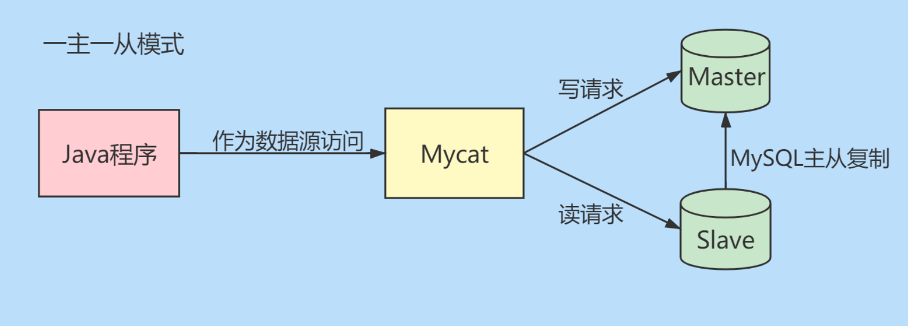
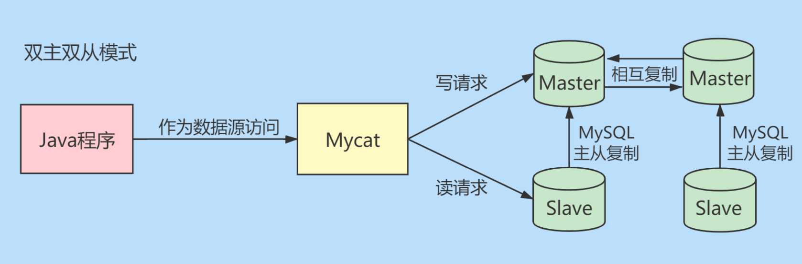
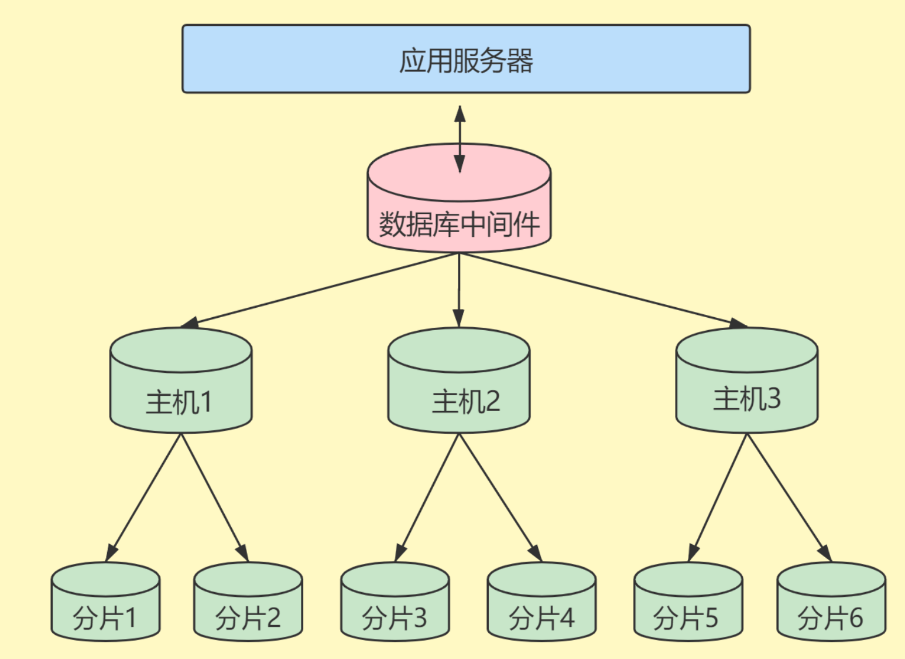
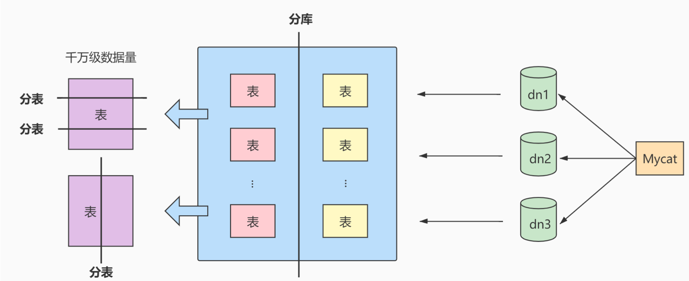

## 数据库调优的策略

### 调优的目标

1. 尽可能`节省系统资源`,以便系统可以提供更大负荷的服务(吞吐量更大)
2. 合理的结构设计和参数调整，以提高用户操作`响应的速度`(响应速度更快)
3. 减少系统的瓶颈，提高MySQL数据库整体的性能

### 如何定位调优问题

> 随着用户量的不断增加,以及应用程序复杂度的提升,我们很难用**更快**去定义数据库调优的目标,因为用户在不同时间段访问数据库遇到的瓶颈是不同的
>
> 比如双十一促销有大规模的`并发访问`;还有用户在进行不同业务操作的时候,数据库的`事务处理、SQL 查询`都会有所不同
>
> 我们需要更加精细的定位,去确定调优的目标

如何确定呢?一般情况下，有如下几种方式:

1. **用户的反馈(主要)**
2. **日志分析(主要)**
   - 我们可以通过**查看数据库日志和操作系统日志等方式**找出异常情况,通过它们来定位遇到的问题
3. 服务器资源使用监控
   - 通过监控服务器的 CPU、内存、IO 等使用状况,可以实时了解服务器的性能使用
4. 数据库内部状况监控
   - 在数据库的监控中,`活动会话(Active Session)监控`是一个重要的指标,通过它可以了解当前数据库是否处于繁忙状态,是否存在 SQL 堆积

5. **其他**
   - 除了活动会话监控以外，我们也可以对`事务、锁等待` 等进行监控，这些都可以帮助我们对数据库的**运行状态**有更全面的认识

### 调优的维度和步骤

> 我们需要调优的对象是整个数据库管理系统，它不仅包括 SQL 查询，**还包括数据库的部署配置、架构等**。我们思考的维度不仅仅局限在 SQL 优化


#### 1.选择合适的 DBMS

- 如果对`事务性处理`以及`安全性要求高`的话,可以选择商业化的数据库产品。这些数据库在**事务处理和查询性能**上都比较强,比如采用`SQL Server、Oracle`,那么`单表存储上亿条数据`是没有问题的。如果数据表设计的好,即使不采用`分库分表`的方式,查询效率也不低

- 除此,还可以使用开源的 MySQL 进行存储,它**提供了很多的存储引擎可以选择**。如果进行**事务处理**的话可以选择**InnoDB**,非事务的话可以选择**MyISAM**

- NoSQL 还有`键值型数据库、文档型数据库、搜索引擎、列式存储、图数据`,这些数据库的优缺点各有不同。比如列式数据库可以大幅度的降低系统 IO,适用于分布式,但是数据需要频繁的增删改就不适合了

- **DBMS 的选择关系到后面的整个设计过程,所以第一步就是需要选择合适的 DBMS**

#### 2.优化表设计

- 选择 DBMS 之后就需要进行表设计了,而表设计的方式也会影响后续的 SQL 查询。如果使用 MySQL,还可以为不同的表选择使用不同的存储引擎
  - 表结构尽量遵守`三范式原则`,这样可以让数据结构更加的清晰规范,减少冗余字段,同时减少了增删改出现的问题
  - 如果`查询`应用比较多,尤其是进行`多表连接`的时候,可以使用`反范式`进行优化(以空间换时间)
  - `表字段的数据类型`选择,关系到了查询效率的高低以及存储空间的大小
- 数据表的结构设计很基础,也很关键

#### 3.优化逻辑查询

- 当我们建立好数据表之后,就可以对数据表进行增删改查了。这时候我们需要考虑逻辑查询的优化
  - SQL 查询优化,可以分为`逻辑查询优化`和`物理查询优化`
- 逻辑查询优化就是通过**改变 SQL 语句的内容让 SQL 的执行效率更高,采用的方式是对 SQL 语句进行等价变换,对查询重写**
  - <mark>SQL 的查询重写包含了 子查询优化、等价谓词重写、视图重写、条件简化、连接消除、嵌套连接消除等</mark>

#### 4.优化物理查询

- 物理查询优化是在确定了逻辑查询优化之后，**采用物理优化技术(比如索引等)**，通过计算代价模型对**各种可能的访问路径进行估算，从而找到执行方式中代价最小的作为执行计划**。在这个部分中，我们需要掌握的重点是`对索引的创建和使用`
- 但是索引**不是万能的**,我们需要更具实际情况来创建索引

#### 5.使用缓存

- 除了可以对 SQL 本身进行优化以外，我们还可以使用缓存提升查询的效率
- 数据都是存放到数据库中，我们需要从数据库层中取出数据放到内存中进行业务逻辑的操作，**当用户量增大的时候**，如果频繁地进行数据查询，会消耗数据库的很多资源**如果我们将常用的数据直接放到内存中，就会大幅提升查询的效率**
  - **键值存储数据库可以帮我们解决这个问题 (比如 Redis、Memcached)**
- <mark>通常我们对于查询响应高的场景(响应时间短、吞吐量大),可以考虑使用内存数据库</mark>

#### 6.库级别优化

> 库级的优化是站在数据库的维度上进行的优化策略,比如控制一个库中的数据表数量
>
> 另外,单一的数据库总会遇到各种的限制,通过`主从架构`优化我们的读写策略,通过对数据进行`垂直、水平切分`,突破单一数据库或者 数据表的访问限制

**1.读写分离**

**2.数据分片**

对`数据库分库分表`。当数据量达到千万级别以上时,有时我们需要**把一个数据库切成多份,放到不同的数据库服务器上,减少单一数据库的访问压力**

如果使用的是 MySQL 服务器,可以使用自带的**分区表功能**,也可以考虑自己做:

1. `垂直拆分 [分库]`
2. `水平拆分 [分表]`
3. `垂直 + 水平拆分  [分库分表]`

## 优化 MySQL 服务器

### 优化服务器硬件

- `服务器的硬件性能直接决定着MySQL数据库的性能`
- 硬件的性能瓶颈直接决定MySQL数据库的**运行速度和效率**。针对性能瓶颈提高硬件配置,可以提高MySQL数据库查询、更新的速度
  1. **配置较大的内存**
     - 通过加大内存,可以用于增加`缓冲区容量`,让数据在内存中停留更久,`减少磁盘IO`
  2. **配置高速磁盘系统**
     - 减少读盘的时间,提高响应速度。磁盘的 IO 能力,就是它的**寻道能力**
     - 现在 SSD的随机访问与顺序访问性能几乎差不多
  3. **合理分布磁盘 IO**
     - 将磁盘 IO 分散在各个设备上,减少资源竞争
  4. **配置多处理器**
     - MySQL 是多线程服务器,多处理器可以同时执行多个线程

### 优化 MySQL 参数

> 通过优化 MySQL 的参数可以提高资源利用率,从而达到提高 MySQL 服务器性能的目的

MySQL 服务器配置参数都在 `my.cnf#[mysqld]`中,配置完成后需要重启

**下面是几个对性能影响较大的参数:**

1. `innodb_buffer_size`
   - InnoDB类型的`表和索引的最大缓存`, **是Mysql数据库最重要的参数之一**
     - 不仅缓存`索引缓存`,还会缓存`表的数据`
   - 值越大查询的速度就会越快,但是这个值太大会影响操作系统的性能
2. `key_buffer_szie`
   - `索引缓冲区大小`, 索引缓冲区是所有的`线程共享` 
     - **增加索引缓冲区可以得到更好处理的索引**
   - 值不是越大越好，它的大小**取决于内存大小**。 这个值太大，就会导致操作系统频繁换页，也会降低系统性能
   - 对于内存是`4G`左右的服务器设置在`256Mb、384Mb`
3. `table_cache`
   - `同时打开的表的个数`
     - **这个值越大，能够同时打开的表的个数越多**
   - 物理内存越大,设置就越大。**默认为2402, 调到512~1024最佳**
4. `sort_buffer_size`
   - `每个需要进行排序的线程分配的缓冲区大小`
     - 增加这个参数的值可以提高`Order By`或`Group By`操作的速度
   - **默认数值是2097144字节(约2MB), 对于内存在4GB 左右的服务器推荐设置为6-8M**
   - 该参数对应的分配内存也是每个连接独享
     - 如果有100个连接，那么实际分配的总共排序缓冲区大小为100 × 6 = 600MB
5. `join_buffer_size`
   - `联合查询操作所能使用的缓冲区大小`
   - 和*sort_buffer-size*一样,该参数对应的分配内存也是每个连接独享
6. `read_buffer_size`
   - `每个线程连续扫描时为扫描的每个表分配的缓冲区的大小(字节)`
   - **当线程从表中连续读取记录时需要用到这个缓冲区**
   - `SET SESSION read_buffer_size=n` 可以临时设置该参数的值
   - 默认为64K，可以设置为4M。
7. `innodb_flush_log_at_trx_commit`
   - `何时将缓冲区的数据写入日志文件,并且将日志文件写入磁盘中`
   - 该参数对于innoDB引擎非常重要。该参数有3个值
     - **可选值: 0**
       - 表示 `每秒1次`的频率将数据写入日志文件并将日志文件写入磁盘,每个事务的 commit并不会触发前面的任何操作
       - **该模式速度最快，但不太安全**,mysqld进程的崩溃会导致上一秒钟所有事务数据的丢失
     - **可选值: 1 [默认]**
       - 表示`每次提交事务时` 将数据写入日志文件并将日志文件写入磁盘进行同步
       - **该模式是最安全的，但也是最慢的一种方式**, 因为每次事务提交或事务外的指令都需要把日志写入(flush)硬盘
     - **可选值: 2**
       - 表示`每次提交事务时` 将数据写入日志文件, `每隔1秒` 将日志文件写入磁盘
       - **该模式速度较快，也比0安全**，只有在操作系统崩溃或者系统断电的情况下，上一秒钟所有事务数据才可能丢失
8. `innodb_log_buffer_size`
   - InnoDB 存储引擎的 `事务日志所使用的缓冲区`
   - 为了提高性能,也是**先将信息写入 Innodb Log Buffer 中，当满足 innodb_flush_log_trx_commit 参数所设置的相应条件(或者日志缓冲区写满)之后，才会将日志写到文件(或者同步到磁盘)中**
9. `max_connections`
   - `允许连接到MySQL数据库的最大数量 `
   - 这个连接数不是越大越好,因为**这些连接会浪费内存的资源,过多的连接可能会导致MySQL服务器僵死**。
   - 默认值是`151` 
10. `wait_timeout`
    - **一个请求的最大持续时间** 
    - **对于4GB左右内存的服务器可以设置为5-10**
11. `interactive_timeout`
    - 表示服务器在关闭连接前等待行动的秒数


:::info my.cnf的参考配置

```ini
[mysqld]
ort = 3306
serverid = 1
socket = /tmp/mysql.sock 

#避免MySQL的外部锁定,减少 出错几率增强稳定性
skip-locking = OFF

# 禁止MySQL对外部连接进行DNS解析，使用这一选 项可以消除MySQL进行DNS解析的时间
# 但需要注意，如果开启该选项，则所有远程主机连接授权 都要使用IP地址方式，否则MySQL将无法正常处理连接请求!
skip-name-resolve = OFF

back_log=384
key_buffer_size = 256M
max_allowed_packet = 4M
thread_stack = 256K
table_cache = 128K
sort_buffer_size = 6M
read_buffer_size = 4M
read_rnd_buffer_size=16M
join_buffer_size = 8M
myisam_sort_buffer_size = 64M
thread_cache_size = 64
query_cache_size = 64M
tmp_table_size = 256M
max_connections = 768
max_connect_errors = 10000000
wait_timeout = 10

#该参数取值为服务器逻辑CPU数量*2
thread_concurrency = 8

# 开启该选项可以彻底关闭MySQL的TCP/IP连接方式
# 如果WEB服务器是以远程连接的方式访问MySQL数据库服务器则不要开启该选项!否则将无法正常连接!
skip-networking = OFF

#默认为2M
innodb_additional_mem_pool_size=4M

innodb_flush_log_at_trx_commit=1

# 默认为 1M
innodb_log_buffer_size = 2M

# 服务器CPU有几个就是几,建议用默认一般为8
innodb_thread_concurrency = 8

# 默认为16M，调到64-256最挂
tmp_table_size = 64M

thread_cache_size = 120
query_cache_size = 32M

```

:::


## 优化数据库结构

### 1.拆分表(冷热数据分离)

> 将一个包含很多字段的表拆分为两个及以上的较小的表
>
> 因为大表中某些字段的使用频率很高(`热数据`),需要经常进行更新或者查询,而另外一些字段的使用频率很低(`冷数据`)

`冷热数据分离`,可以减少表的宽度,如果放在一个表里面,每次查询都要读取大记录,会消耗较多的资源

MySQL 限制每张表最多`4096 `列,并且每一行数据的大小不能超过`65535 字节`。**表越宽,把表加载到内存缓冲池所占用的内存也就越大,也会消耗更多的 IO**

**冷热数据分离的目的:**

1. **减少磁盘 IO,保证热数据的内存命中率**
2. **更有效的利用缓存,避免读入无用的冷数据**


:::info 示例

会员members表**存储会员登录认证信息**, 该表中有很多字段，如id、姓名、密码、地址、电话、个人描述字段。其中地址、电话、个人描述等字段并不常用，可以将这些不常用的字段分解出另一个表。将这个表取名叫**members_detail**,表中有member_id、address、telephone、description等字段

创建这两个表的SQL语句如下:

```sql
CREATE TABLE members (
		id int(11) NOT NULL AUTO_INCREMENT, 
	  username varchar(50) DEFAULT NULL, 
  	`password` varchar(50) DEFAULT NULL,
  	last_login_time datetime DEFAULT NULL,
  	last_login_ip varchar(100) DEFAULT NULL,
  	PRIMARY KEY(Id)
);
CREATE TABLE members_detail (
			Member_id int(11) NOT NULL DEFAULT 0,
  		address varchar(255) DEFAULT NULL,
  		telephone varchar(255) DEFAULT NULL,
  		description text
);
```


:::

### 2.增加中间表

> 对于需要经常联合查询的表,可以建立中间表以提高查询效率

建立中间表,**把需要经常查询的数据插入中间表中将原来需要的关联查询的改为对中间表的单表查询**

这种方式需要`保证数据的一致性`。比如中间表依赖的表数据更新后,怎么保持同步呢?

1. 清空数据,重新添加数据
2. 使用视图

### 3.增加冗余字段

> 设计数据库表时应尽量遵循范式理论的规约，尽可能减少冗余字段，让数据库设计看起来精致、优雅。但合理地加入冗余字段可以提高查询速度。
>
> 表的规范化程度越高，表与表之间的关系就越多，需要连接查询的情况也就越多。尤其在数据量大，而 且需要频繁进行连接的时候，为了提升效率，我们也可以考虑增加冗余字段来减少连接

就是和前面的反范式,当然我们也需要考虑如何保证数据的一致性

### 4.优化数据类型

> 在改进表的设计时,可以考虑优化字段的数据类型。**`优先选择符合存储需要的最小的数据类型`**

**列的字段越大,建立索引时所需要的**`空间越大`,数据页中能存储的叶子节点的`数量也越少`。在遍历时需要的`IO次数越多,索引性能也越差`

<br/>

**情况1:对整数类型数据进行优化。**

- 遇到**整数类型**的字段可以用 `INT` 型 。因为INT 型数据有足够大的取值范围，不用担心数据超出取值范围的问题

- 对于`非负型`的数据(如自增ID、整型IP)来说，`要优先使用无符号整型 UNSIGNED 来存储`,**因为无符号相对于有符号，同样的字节数，存储的数值范围更大**
  - 如tinyint有符号为-128-127，无符号为0-255，多出一倍的存储空间


**情况2:既可以使用文本类型也可以使用整数类型的字段，要选择使用整数类型**

- **跟文本类型数据相比，大整数往往占用更少的存储空间**, 在存取和比对的时候，可以占用更少的内存空间
- 在二者皆可用的情况下，**尽量使用整数类型，这样可以提高查询的效率**
  - 如:将IP地址转换成整型数据

**情况3: 避免使用TEXT、BLOB数据类型**

**情况4: 避免使用ENUM数据类型**


### 5.优化插入记录的速度

#### **禁用索引**

> 对于非空表,插入记录时,MySQL 会根据表的索引对插入的记录建立索引。如果插入大量的数据,建立索引就会降低插入记录的速度

**我们可以在插入记录前禁用索引,然后等到数据插入完毕之后在开启索引**

```sql
-- 禁用索引
ALTER TABLE table_column DISABLE KEYS;

-- 开启索引
ALTER TABLE table_name ENABLE KEYS;
```

#### 禁用唯一性检查

插入数据是,MySQL 会对插入的记录进行**唯一性校验**, 这种唯一性校验会降低插入记录的速度。

我们可以**在插入记录之前禁用唯一性检查,等到数据插入完毕之后再开启**

```sql
# 关闭唯一性检查
SET UNIQUE_CHECK=0;

# 开启唯一性检查
SET UNIQUE_CHECK=1;
```

#### 使用批量插入

插入多条记录的时候,可以使用一条INSERT 语句插入多条记录

```sql
-- 示例
INSERT INTO T1 VALUES
(1,'name1'), (2,'name2'), (3,'name3')
```


#### 禁用自动提交

**插入数据之前禁止事务的自动提交**,数据插入完成之后,执行回复自动提交的操作

```sql
# 禁止自动提交事务
SET AUTOCOMMIT=0;

# 开启自动提交事务
SET AUTOCOMMIT=1;
```

### 使用非空约束

**在设计字段的时候，如果业务允许，建议尽量使用非空约束**


### 分析表、检查表与优化表

MySQL提供了 **分析表、检查表与优化表**的语句

- **分析表**: 分析关键字的分布

- **检查表**: 检查是否存在错误 

- **优化表**: 消除删除或者更新造成的空间浪费 

#### 优化表

- 使用`ANALYZE TABLE`语句分析表

- ANALYZE TABLE语句能够分析**InnoDB、MyISAM**类型的表，**但是不能作用于视图**

- **基本语法**

  ```sql
  ANALYZE [LOCAL | NO_WRITE_TO_BINLOG] TABLE 表名1 [,表名2,...]
  ```

- **默认MySQL服务会将 ANALYZE TABLE语句写到binlog中，以便在主从架构中，从服务能够同步数据**

  - 可以通过参数`LOCAL` 或者 `NO_WRITE_TO_BINLOG` 取消将语句写到binlog中

- 使用 ANALYZE TABLE 分析表的过程中，**数据库系统会自动对表加一个`只读锁`**。分析期间只能读取表中的记录,不能更新和插入记录

- ANALYZE TABLE分析后的统计结果会更新到`Cardinality`列

  - **统计了表中某一键所在的列不重复的值的个数 [`区分度`]**

  - **该值越接近表中的总行数，则在表连接查询或者索引查询时，就越优先被优化器选择使用** 

- Cardinality 可以通过`SHOW INDEX FROM 表名`查看


#### 检查表

- 使用`CHECK TABLE`语句来检查表

- CHECK TABLE 语句能够检查 **InnoDB、MyISAM类型** 的表是否存在错误,**还可以检查视图**

  - **对于MyISAM类型的表，CHECK TABLE语句还会更新关键字统计数据**
  - **CHECK TABLE也可以检查视图是否有错误(比如在视图定义中被引用的表已不存在)**

- CHECK TABLE 语句在执行过程中也会给表加上 `只读锁` 

- **基本语法**

  ```sql
  CHECK TABLE  表名1 [,表名2,...] [option1,option2,...]
  ```

  - OPTION 参数有5个取值:
    - `QUICK`
      - 不扫描行，不检查错误的连接
    - `FAST`
      - 只检查没有被正确关闭的表
    - `CHANGED`
      - 只检查上次检查后被更改的表和没有被正确关闭的表
    - `MEDIUM`
      - 扫描行以验证被删除的连接是有效的。也可以计算各行的关键字校验和，并使用计算出的校验和验证这一点
    - `EXTENED`
      - 对每行的所有关键字进行一个全面的关键字查找
      - 这可以确保表是100%一致的，但是花的时间较长
  - <mark>option只对MyISAM类型的表有效，对InnoDB类型的表无效</mark> 

#### 优化表

- 使用`OPTIMIZE TABLE`语句来优化表

- 对 **InnoDB、MyISAM** 类型的表都有效。该语句在执行过程中也会给表加上`只读锁`

- MySQL中使用**OPTIMIZE TABLE**语句来优化表。但是，OPTILMIZETABLE语句**只能优化表中的 VARCHAR 、 BLOB 或 TEXT 类型的字段**

- **基本语法**

  ```sql
  -- LOCAL | NO_WRITE_TO_BINLOG 关键字的意义和分析表相同，都是指定不写入二进制日志。
  OPTIMIZE [LOCAL | NO_WRITE_TO_BINLOG] TABLE 表名1 [,表名2,...]
  ```

### 小结

上述这些方法都是有利有弊的。比如:

1. 修改数据类型: 节省存储空间的同时,要考虑到数据不能超过取值范围
2. 增加冗余字段: 不要忘了确保数据一致性
3. 把大表拆分: 意味着查询会增加新的连接，从而增加额外的开销和运维的成本


## 大表优化

> 当 MySQL 单表记录数过大的时候,数据库 CRUD 的性能会明显下降

### 限定查询的范围

**禁止不带任何限制数据范围条件的查询语句**。比如:我们当用户在查询订单历史的时候，我们可以控制在一个月的范围内


### 读写分离

- 经典的数据库拆分方案，**主库负责写,从库负责读**

- 有两种模式:
  - `一主一从`
  - `多主多从`


**1. 一主一从**




<br/>

**2.多主多从**




### 垂直拆分

> 当数据量级达到`千万级`以上时,有时候我们需要**把一个数据库切成多份，放到不同的数据库服务器上减少对单一数据库服务器的访问压力**

- **垂直分库**
  - 如果数据库中数据包过多,可以使用`垂直分库`的方式, 将相关联的数据表部署在同一个数据库上
- **垂直分表**
  - 如果数据表中的列过多,可以使用`垂直分表`的方式, 将一张表分拆成多个表(冷热数据分离)
- **垂直拆分的优点**
  - **可以使得列数据变小,在查询时减少读取的Block数,减少I/O次数**
  - 可以简化表的结构,易于维护
- **垂直拆分的缺点**
  - **主键会出现冗余,需要管理冗余列,并会引起 JOIN 操作**
  - **垂直拆分会让事务变得更加复杂**




### 水平拆分

> **尽量控制单表的数据量的大小**,建议控制在`1000 万以内`。1000 万不是 MySQL 数据库的限制,而是过大会造成修改表结构、备份、恢复都有很大问题
>
> 可以使用`历史数据归档`、`水平分表`来控制数据量大小

- 水平拆分将大的数据表按照 `某个属性维度`分成不同的小表,每个小表保持相同的表结构
- **水平拆分仅仅是解决单一表数据过大的问题,但由于数据还是在同一个机器上,对提高 MySQL 并发能力提升不大**,最好还是`水平拆分 + 分库`

- **数据库分片的两种常见方案**
  - `客户端代理`
    - **分片逻辑在应用端，封装在jar包中，通过修改或者封装JDBC层来实现**
    - 当当网的 **Sharding-JDBC** 、阿里的**TDDL**是两种比较常用的实现
  - `中间件代理`
    - **在应用和数据中间加了一个代理层,分片逻辑统一维护在中间件服务中**
    - **Mycat**、360的**Atlas**、网易的**DDB**等等



