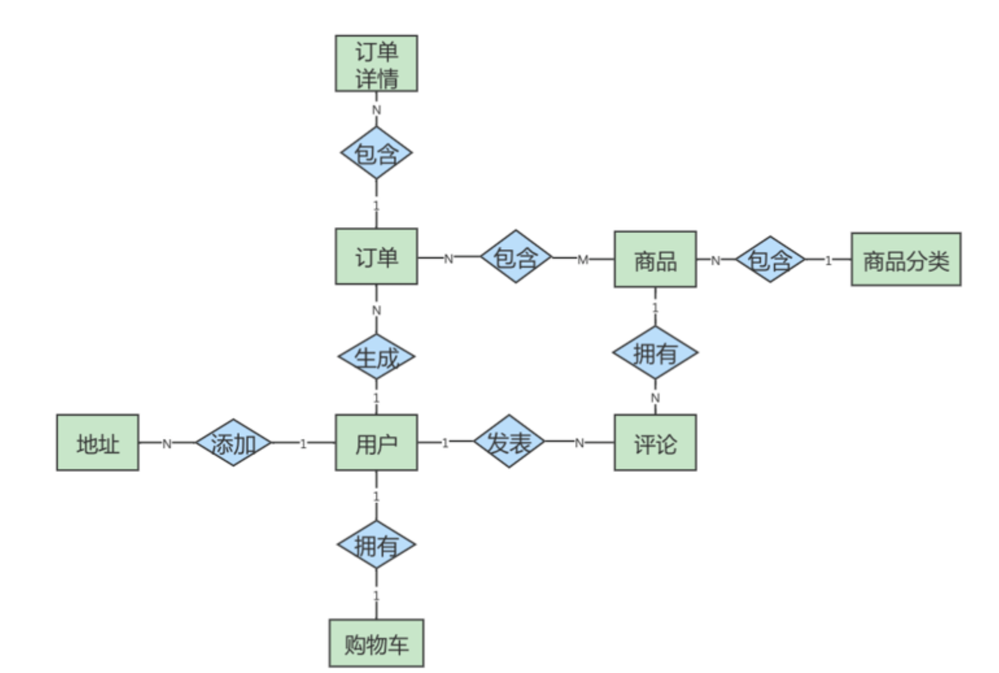
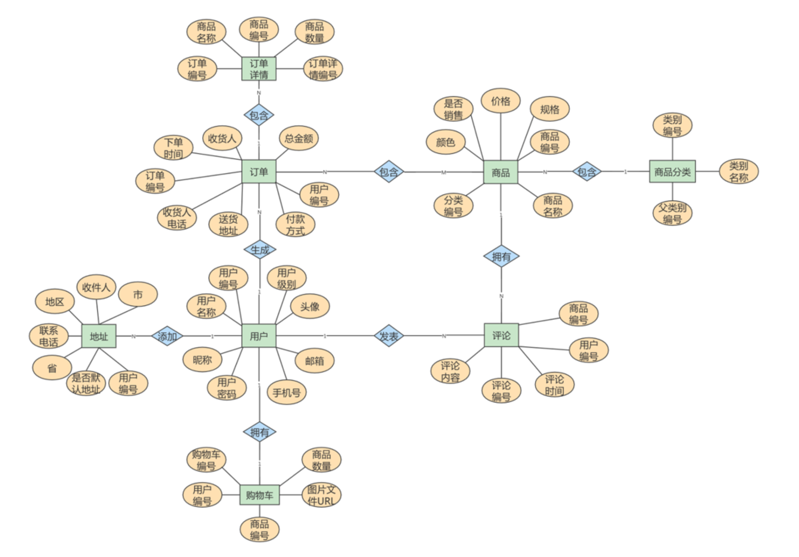

## 为什么需要数据库设计

**我们再设计数据表的时候,需要考虑很多的问题。**比如:

- 用户都需要什么数据?需要在哪些表中保存哪些数据?
- 如何保证数据表中数据的**正确性**,当插入、删除、更新的时候该进行什么`约束检查`
- 如何降低数据表的`数据冗余度`,保证数据表不会应为用户量的增加而迅速扩张
- 如何让负责数据库维护的人员**更方便的**使用数据库
- 使用数据库的应用场景也不同,可以说针对不同的情况,设计出的数据表也是**千差万别**的

**以下是糟糕的数据库设计可能造成的问题:**

- 数据冗余、信息重复、存储空间浪费
- 数据更新、插入、删除的异常
- 无法正确的表示信息
- 丢失有效信息

**良好的数据库设计有下面的优点**

- 节省数据的存储空间
- 保证数据的完整性
- 方便进行数据库应用系统的开发

## 范式(Normal Form,NF)

**在关系型数据库中，关于数据表设计的基本原则、规则就称为范式。** 

一张数据表的设计结构需要满足的某种设计标准的`级别`,要想设计一个结构合理的关系型数据库，必须满足一定的范式

### 有哪些范式

目前关系型数据库有六种常见范式，按照范式级别，从低到高分别是

- **第一范式(**1NF)
- **第二范式 (**2NF)
- **第三范式(**3NF)
- **巴斯**-**科德范式(**BCNF)
- **第四范式**(4NF**)**
- **第五范式(**5NF**，又称完美范式)** 

`数据库的范式设计越高阶,冗余度就越低`,同时高阶的范式一定满足低阶范式的要求

一般来说,在关系型数据库设计中,最高也就遵守到`BCNF`,普遍还是`3NF`。但也不一定,有时候**为了查询性能,需要破坏范式规则,**也就是`反范式化`

### 键和相关属性的概念

范式的定义会使用到主键和候选键,数据库中的键(key)由一个或者多个属性组成。

数据表中常用的几种键和属性的定义:

1. `超键`
   - 能唯一标识元组(数据行)的属性集
   - 即**唯一键**
2. `候选键`
   - 如果超键不包含多余的属性,那么这个超键就是候选键
   - 即**唯一键中不包含多余的其他属性**
3. `主键`
   - 可以从候选键哪种选择一个作为主键
4. `外键`
   - 如果数据表 R1 的某个属性集不是 R1 的主键,而是另外一个表 R2 的主键,那么这个属性集就是 R1 的外键
5. `主属性`
   - 包含在任一候选键中的属性
6. `非主属性`
   - 与主属性相对,不包含在任一候选键中的属性

通常,我们将候选键称之为`码`,把主键也叫做`主码`。因为键可能由多个属性组成,针对单个属性,还可以用**主属性和非主属性来进行区分** 

:::info 举例

```
这里有两个表:
	​	球员表(player) : 球员编号 | 姓名   | 身份证号   | 年龄 | 球队编号
	​	球队表(team) 	: 球队编号 | 主教练 | 球队所在地
```

**超键**

- 对于球员表来说，超键就是包括球员编号或者身份证号的任意组合，比如(球员编号) (球员编号，姓名)(身份证号，年龄)等。

**候选键**

- 就是最小的超键，对于球员表来说，候选键就是(球员编号)或者(身份证号)。 

**主键**

- 我们自己选定，也就是从候选键中选择一个，比如(球员编号)

**外键**

- 球员表中的球队编号

**主属性 、 非主属性**

- 在球员表中，主属性是球员编号、身份证号, 其他的属性:姓名、年龄、球队编号、都是非主属性。

:::

### 第一范式(1NF)

> 表的字段属性需要是原子性的

- 第一范式主要确保`数据表中的每个字段的值必须具有原子性`,也就是说数据表中的每个字段值为`不可再次拆分`的**最小数据单元**
  - 即我们在设计某个字段的时候,对于字段 X 来说,不能把它拆分为 X-1、X-2
  - **事实上,任何的 DBMS 都会满足第一范式的要求,不会对字段进行拆分**

- <mark>属性的原子性是<strong> 主观的 </strong>,比如用户信息包含住址,那是否需要将住址继续拆分为省市区呢?</mark> 

**举例: user 表的设计不符合第一范式**

其中user_info字段为用户信息，可以进一步拆分成更小粒度的字段，不符合数据库设计对第一范式的要求

| 字段      | 字段类型     | 是否主键 | 说明                                |
| --------- | ------------ | -------- | ----------------------------------- |
| id        | INT          | ✅        | 主键id                              |
| username  | VARCHAR(30)  | ❌        | 用户名                              |
| password  | VARCHAR(30)  | ❌        | 密码                                |
| user_info | VARCHAR(255) | ❌        | 用户信息 (包含真实姓名、电话、住址) |

### 第二范式(2NF)

> 一张表就是一个独立的对象，一张表只表达一个意思

- 在第一范式即基础上,还需要满足`数据表需要有主键,而且所有非主键字段都必须完全依赖主键,不能只依赖主键的一部分`
  - 如果知道主键的所有属性的值,就可以检索到任何元组(行)的任何属性值

:::info 举例

比赛表 player_game,里面包含 [**球员编号、姓名、年龄、比赛编号、比赛时间和比赛场地**]属性,这里**候选键和主键都为(球员编号，比赛编号)**，我们可以通过候选键(或主键)来决定如下的关系:

```
[球员编号, 比赛编号] → (姓名, 年龄, 比赛时间, 比赛场地，得分)
```

但是这个数据表不满足第二范式，因为数据表中的字段之间还存在着如下的对应关系:

```
球员编号 → (姓名，年龄)
比赛编号 → (比赛时间, 比赛场地)
```

**对于非主属性来说，并非完全依赖候选键。这样会产生怎样的问题呢?**

1. `数据冗余`
   - 一个球员可以参加 m 场比赛，那么球员的姓名和年龄就重复了 m-1 次。
   - 一个比赛 也可能会有 n 个球员参加，比赛的时间和地点就重复了 n-1 次
2. `插入异常`
   - 如果我们想要添加一场新的比赛，但是这时还没有确定参加的球员都有谁，那么就没法插入
3. `删除异常`
   - 如果我要删除某个球员编号，如果没有单独保存比赛表的话，就会同时把比赛信息删除掉
4. `更新异常 `
   - 如果我们调整了某个比赛的时间，那么数据表中所有这个比赛的时间都需要进行调 整，否则就会出现一场比赛时间不同的情况

**为了避免出现上述的情况，我们可以把球员比赛表设计为下面的三张表**

| **表名**                   | 属性(字段)                         |
| -------------------------- | ---------------------------------- |
| 球员 player 表             | 球员编号、姓名和年龄等属性         |
| 比赛 game 表               | 比赛编号、比赛时间和比赛场地等属性 |
| 球员比赛关系 player_game表 | 球员编号、比赛编号和得分等属性     |

:::

### 第三范式(3NF)

> 即非主键属性之间不能有依赖关系,必须相互独立

- 在第二范式的基础上,确保数据表中的每一个**非主键字段**都和主键字段直接相关,也就是说`要求表的所有非主键字段不能依赖于其他非主键字段`
  - 比如不存在非属性 A 依赖于非属性 B,非属性 B 依赖于主键 C 

## 反范式化

### 概述

> 有时候不能简单的按照范式要求设计数据表,因为有的数据看似冗余,但是对业务来说很重要。这个时候需要遵守`业务优先`的原则,首先需要满足**业务要求**,再尽量减少冗余
>
> 如果数据库的数据量比较大,那完全按照三范式设计数据表,查询数据的时候会造成大量的关联查询,在一定程度上会影响性能。这个时候就可能需要`增加冗余字段`来提高数据库的读性能

**规范化还是性能?**

1. 为满足某种商业目标,数据库性能比规范化数据库更重要
2. 在数据规范化的同时,要综合考虑数据库的性能

3. 通过在给定的表中添加额外的字段,以大量减少需要从中搜索信息所需的时间 
4. 通过在给定的表中插入计算列,以方便查询

### 应用举例

员工的信息存储在**employees 表**中，部门信息存储在**departments 表**中。通过 employees 表中的 department_id字段与 departments 表建立关联关系。**如果要查询一个员工所在部门的名称:**

```sql
select employee_id,department_name 
from employees e 
join departments d on e.department_id = d.department_id;
```

**如果经常需要进行这个操作，连接查询就会浪费很多时间**。可以在 employees 表中增加一个冗余字段 department_name，这样就不用每次都进行连接操作了


### 反范式的新问题

1. **存储空间变大了**
2. 一个表中字段做了修改，另一个表中冗余的字段也需要做同步修改，否则`数据不一致`
   - 若采用存储过程来支持数据的更新、删除等额外操作，如果更新频繁，会`非常消耗资源`
3. 在`数据量小` 的情况下，反范式不能体现性能的优势，可能还会让数据库的设计更加`复杂`

## ER模型


### ER 模型的组成

ER 模型中有三个要素，分别是**实体、属性和关系**

1. `实体`
   - 可以看做是数据对象，往往对应于现实生活中的真实存在的个体, 在 ER 模型中，用`矩形` 来表示
   - 实体分为两类，分别是 `强实体`和`弱实体` 
     - **强实体是指不依赖于其他实体的实体** 
     - **弱实体是指对另一个实体有很强的依赖关系的实体** 
2. `属性`
   - **实体的特性** 
   - 比如超市的地址、联系电话、员工数等。在 ER 模型中用`椭圆形` 来表示

3. `关系`
   - **实体之间的联系** 
   - 比如超市把商品卖给顾客，就是一种超市与顾客之间的联系。在 ER 模型中用 `菱形` 来表示

### 示例

我们设计的案例是 `电商业务` ，简单的划分电商业务有8个实体:

1. 地址实体
2. 用户实体
3. 购物车实体
4. 评论实体
5. 商品实体
6. 商品分类实体
7. 订单实体
8. 订单详情实体

`用户、商品分类` 是强实体，因为它们不需要依赖其他任何实体。而其他属于弱实体，因为它们虽然都可以独立存在，但是它们都依赖用户这个实体，因此都是弱实体



在这个图中，地址和用户之间的添加关系，是一对多的关系，而商品和商品详情示一对1的关系，商品和订单是多对多的关系。 这个 ER 模型，包括了 8个实体之间的 8种关系

1. 用户可以在电商平台添加多个地址
2. 用户只能拥有一个购物车
3. 用户可以生成多个订单
4. 用户可以发表多条评论
5. 一件商品可以有多条评论
6. 每一个商品分类包含多种商品
7. 一个订单可以包含多个商品，一个商品可以在多个订单里
8. 订单中又包含多个订单详情，因为一个订单中可能包含不同种类的商品


### ER 模型的细化

进一步去设计一下这个 ER 模型的各个局部，也就是细化下电商的具体业务流程，然后把它们综合到一起，形成一个完整的 ER 模型。再分析一下各个实体都有哪些属性,如下所示:

1. ` 地址实体` 包括用户编号、省、市、地区、收件人、联系电话、是否是默认地址
2. `用户实体` 包括用户编号、用户名称、昵称、用户密码、手机号、邮箱、头像、用户级别
3. ` 购物车实体` 包括购物车编号、用户编号、商品编号、商品数量、图片文件url。
4. `订单实体` 包括订单编号、收货人、收件人电话、总金额、用户编号、付款方式、送货地址、下单 时间
5. `订单详情实体` 包括订单详情编号、订单编号、商品名称、商品编号、商品数量
6. `商品实体` 包括商品编号、价格、商品名称、分类编号、是否销售，规格、颜色
7. `评论实体` 包括评论id、评论内容、评论时间、用户编号、商品编号
8. `商品分类实体` 包括类别编号、类别名称、父类别编号




## 数据库对象编写建议

### 关于库

1. 【强制】库的名称必须控制在32个字符以内**，只能使用英文字母、数字和下划线，建议以英文字母开头**

2. 【强制】库名中英文一律小写 ，不同单词采用`下划线`分割。须见名知意。

3. 【强制】库的名称格式:业务系统名称_子系统名

4. 【强制】库名禁止使用关键字(如type,order等)

5. 【强制】创建数据库时必须`显式指定字符集`,并且字符集只能是utf8或者utf8mb4。

   ```sql
   CREATE DATABASE crm_fund DEFAULT CHARACTER SET 'utf8' ;
   ```

6. 【建议】对于程序连接数据库账号，遵循 `权限最小原则`

   - 使用数据库账号只能在一个DB下使用，**不准跨库**
   - 程序使用的账号 **原则上不准有drop权限** 

7. 【建议】临时库以 `tmp_` 为前缀，并以日期为后缀;备份库以` bak_` 为前缀，并以日期为后缀。

### 关于表、列

1. 【强制】表和列的名称必须控制在32个字符以内，**表名只能使用英文字母、数字和下划线，建议以英文字母开头**
2. 【强制】表名、列名一律小写,**不同单词采用下划线分割**,须见名知意
3. 【强制】表名要求有模块名强相关，**同一模块的表名尽量使用统一前缀** ,比如:crm_fund_item
4. 【强制】创建表时必须 `显式指定字符集` 为utf8或utf8mb4
5. 【强制】表名、列名禁止使用关键字(如type,order等)
6. 【强制】创建表时必须 显式指定表存储引擎 类型。如无特殊需求，一律为InnoDB。
7. 【强制】**建表必须有comment**
8. 【强制】**字段命名应尽可能使用表达实际含义的英文单词或缩写**
   - 如:公司 ID，不要使用 corporation_id, 而用corp_id 即可。
9. 【强制】**布尔值类型的字段命名为 is_描述**
   - 如member表上表示是否为enabled的会员的字段命 名为 is_enabled。
10. 【强制】禁止在数据库中存储图片、文件等大的二进制数据
    - 通常文件很大，短时间内造成数据量快速增长，数据库进行数据库读取时，通常会进行大量的随机IO操作，文件很大时，IO操作很耗时
    - 通常存储于文件服务器，数据库只存储文件地址信息。
11. 【建议】**建表时关于主键: 表必须有主键 **
    - 强制要求主键为id，类型为int或bigint，且为 auto_increment 建议使用unsigned无符号型。
    - 标识表里每一行主体的字段不要设为主键，建议 设为其他字段如user_id，order_id等，并建立unique key索引。因为如果设为主键且主键值为随机 插入，则会导致innodb内部页分裂和大量随机I/O，性能下降。
12. 【建议】**核心表(如用户表)必须有行数据的创建时间字段和 最后更新时间字段**，便于查问题。
13. 【建议】表中所有字段尽量都是 NOT NULL 属性，业务可以根据需要定义 DEFAULT值 
    - **因为使用 NULL值会存在每一行都会占用额外存储空间、数据迁移容易出错、聚合函数计算结果偏差等问题**。
14. 【建议】所有`存储相同数据的列名和列类型必须一致`
    - 一般作为关联列，如果查询时关联列类型不一致会自动进行数据类型`隐式转换`，会造成列上的索引失效
15. 【建议】中间表(或临时表)用于保留中间结果集，名称以 `tmp_` 开头。
16. 【建议】备份表用于备份或抓取源表快照，名称以 `bak_` 开头,中间表和备份表定期清理


### 关于索引

1. 【强制】**InnoDB表必须主键为id int/bigint auto_increment，且`主键值禁止被更新`** 

2. 【强制】InnoDB和MyISAM存储引擎表，索引类型必须为 `BTREE` 。

3. 【建议】主键的名称以 `pk_` 开头，唯一键以 `uni_ 或 uk_` 开头，普通索引以 `idx_` 开头，一律

   使用小写格式，**以字段的名称或缩写作为后缀**

4. 【建议】多单词组成的columnname，取前几个单词首字母，加末单词组成column_name

   - 如:sample 表 member_id 上的索引:idx_sample_mid。

5. 【建议】单个表上的索引个数 `不能超过 6 个`

6. 【建议】在建立索引时，多考虑建立`联合索引`，并**把区分度最高的字段放在最前面**

7. 【建议】**在多表 JOIN 的SQL里，保证被驱动表的连接列上有索引，这样JOIN 执行效率最高**

8. 【建议】建表或加索引时，保证表里互相不存在`冗余索引`

   - 比如:如果表里已经存在key(a,b)，则key(a)为冗余索引，需要删除

### SQL编写

1. 【强制】程序端SELECT语句必须指定具体字段名称，`禁止写成 *`。

2. 【建议】**程序端insert语句指定具体字段名称**，不要写成INSERT INTO t1 VALUES(...)。
3. 【建议】除静态表或小表(100行以内)，DML语句必须有WHERE条件，且使用索引查找。
4. 【建议】INSERT INTO...VALUES(XX)这里XX的值不要超过5000个。
   - `值过多会引起主从同步延迟`
5. 【建议】SELECT语句**不要使用UNION，推荐使用UNION ALL**，并且UNION子句个数限制在`5`个以内
6. 【建议】**线上环境, 多表 JOIN 不要超过5个表** 
7. 【建议】**减少使用ORDER BY**，和业务沟通能不排序就不排序，或将排序放到程序端去做
    - ORDER BY、GROUP BY、DISTINCT 这些语句较为耗费CPU，数据库的CPU资源是极其宝贵的。
8. 【建议】包含了**ORDER BY、GROUP BY、DISTINCT** 这些查询的语句，WHERE 条件过滤出来的结果集请保持在1000行以内，否则SQL会很慢。
9. 【建议】**对单表的多次alter操作必须合并为一次**
    - 对于超过100W行的大表进行alter table，必须经过DBA审核,并在业务低峰期执行,多个alter需整合在一起

    - 因为alter table会产生`表锁`,期间阻塞对于该表的所有写入,对于业务可能会产生极大影响
10. 【建议】**批量操作数据时，需要控制事务处理间隔时间，进行必要的sleep**
11. 【建议】**事务里包含SQL不超过5个**
    - 因为**过长的事务会导致锁数据较久，MySQL内部缓存、连接消耗过多等问题**
12. 【建议】**事务里更新语句尽量基于主键或UNIQUE KEY**

