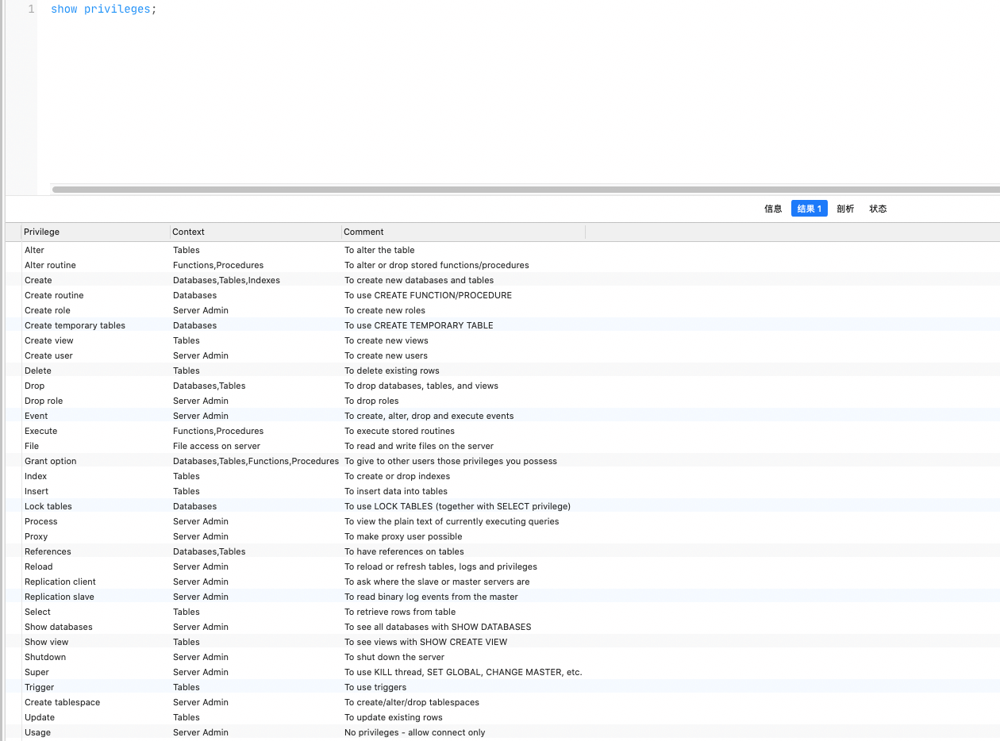
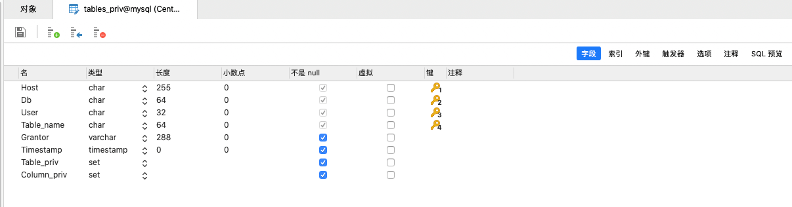
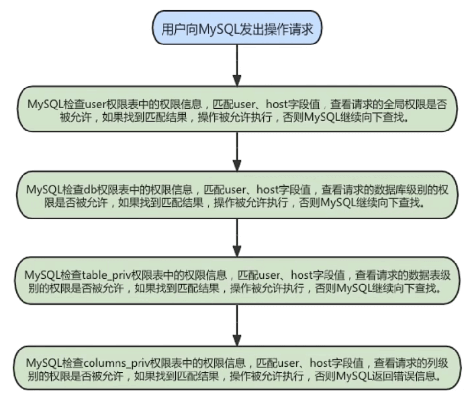

## 用户管理

### 登录 MySQL 服务器

我们启动 MySQL 服务之后,一般通过mysql 命令登录MySQL 服务器:

- `mysql -h hostName|hostIp -P port -u userName -p dbName [–e "SQL语句"]`
  - 命令中参数表示的含义:
    - `-h` : 指定 MySQL 服务器主机名或者主机IP，hostname为主机名，hostIP为主机IP
    - `-P` : 指定 MySQL 服务的端口号,如果不使用该参数,则使用 MySQL 默认的 3306 端口号
    - `-u` : 指定登录 MySQL 服务器的用户名
    - `-p` : 会提示输入登录 MySQL 服务器的密码
    - `dbName` : 指定登录到哪一个数据库中,如果不指定,则登录后需要手动选择一个数据库
    - `-e` : 指定登录 MySQL 服务器后执行的 sql 语句,执行完后退出 MySQL 服务器

### 创建用户

- `CREATE USER 用户1 [identified by '密码'] [,用户2 [identified by '密码2'] ,...];`

  - 命令中参数表示的含义:
    - `用户` 
      - 表示新建用户的账户
      - 由 `用户名(UserName)` 和 `主机名(Host)` 组成(**下面所有的用户都是这个结构**)
    - `[identified by '密码']` 
      - 表示可选项,可以指定用户登录时使用的密码。如果不指定,则用户可以直接登录
  - 可以同时创建多个用户
  - <mark>创建的用户信息会插入到 mysql.user 表中,并且默认只有 usage权限</mark>

  

### 修改用户

> 上面创建完用户之后,会将数据插入到 mysql.user 表中

```sql
UPDATE mysql.user SET USER='新用户名' WHERE USER='旧用户名';
FLUSH PRIVILEGES;
```


### 删除用户

删除用户用有两种方式

1. 使用 DROP 删除
2. 使用 DELETE 方式删除

#### DROP 删除

- 基本语法

  ```sql
  DROP USER 用户1 [,用户2 ,...];
  FLUSH PRIVILEGES;
  ```

- 命令中参数表示的含义:
  - `用户` 
    - 表示要删除的用户, 由 `用户名(UserName)` 和 `主机名(Host)` 组成
    - 如果没有指定主机名,默认使用 ‘%’

- 可以同时删除多个

#### DELETE 删除🙅

- 基本语法

  ```sql
  DELETE  mysql.user  where Host='主机名' and User='用户名';
  FLUSH PRIVILEGES;
  ```

:::caution 注意

一般来说不建议通过 DELETE 的方式删除用户,因为系统会存在残留的信息,而使用 DROP 的方式则不会有这个问题

:::

### 设置当前用户密码

- 设置当前用户的密码有两种方式

  - 使用 ALTER USER 的命令

    ```sql
    # user() 可以返回当前用户
    ALTER USER USER() identified by '新密码';
    ```
    
  - 使用 SET 语句修改
  
    ```sql
    # 这种方式会自动将密码加密后赋值给当前用户
    SET PASSWORD='新密码';
    ```

### 修改其他用户密码

> 参考修改当前用户,也可以修改其他用户的密码

- 设置其他用户也有两种方法

  - 使用 ALTER USER 的命令

    ```sql
    ALTER USER 用户1 [IDENTIFIED BY '新密码'] [,用户2[IDENTIFIED BY '新密码'] ,...];
    ```

  - 使用 SET 语句修改

    ```sql
    SET PASSWORD FOR 用户='新密码';
    ```

## 权限管理

### 权限列表

通过 `show privileges;` 可以查看 MySQL 的权限列表,常见的权限如下:

| 权限                                               | 说明                                                         |
| -------------------------------------------------- | ------------------------------------------------------------ |
| `CREATE / DROP`                                    | 可以创建新的数据库和表，或删除已有的数据库和表               |
| `SELECT`<br />`INSERT`<br />`DELETE`<br />`UPDATE` | 允许在一个数据库现有的表上实施操作                           |
| `INDEX`                                            | 允许创建或删除索引，INDEX适用于已有的表<br />如果具有某个表的CREATE权限，就可以在CREATE TABLE语句中包括索引定义 |
| `ALTER`                                            | 可以使用 ALTER TABLE来更改表的结构和重新命名表               |
| `CREATE ROUTINE`                                   | 可以更改和删除保存的存储过程                                 |
| `EXECUTE`                                          | 可以执行保存的存储过程                                       |
| `GRANT`                                            | 允许授权给其他用户，可用于数据库、表和保存的存储过程         |
| `FILE`                                             | 可以使用LOAD DATA INFILE 和 SELECT ... INTO OUTFILE 语句读或写服务器上的文件<br />任何被授予 FILE 权限的用户都能读或写 MySQL 服务器上的任何文件 |



:::

:::caution 授予权限的原则

权限控制主要是出于安全因素，因此需要遵循以下几个**经验原则** 

1. 只授予能满足需要的`最小权限` ，防止用户干坏事
   - 比如用户只是需要查询，那就只给select权限就可 以了，不要给用户赋予update、insert或者delete权限
2. 创建用户的时候`限制用户的登录主机` ，一般是限制成指定IP或者内网IP段。
3. 为每个用户 `设置满足密码复杂度的密码` 
4. `定期清理不需要的用户`，回收权限或者删除用户

:::

### 授予权限

- MySQL 给用户授权一般有两种方式: `角色赋予给用户` 和 `直接给用户授权`。

- 授权命令

  ```sql
  # 如果该用户不存在,那么就会新建一个用户
  # ALL [PRIVILEGES] 表示所有权限
  GRANT 权限1,权限2,...权限n ON 数据库名称.表名称 TO 用户 [IDENTIFIED BY ‘密码’];
  ```

:::info 示例

**1.给lisi用户用本地命令行方式，授予test这个库下的所有表的插删改查的权限。**

```sql
GRANT SELECT,INSERT,DELETE,UPDATE ON test.* TO lisi@localhost ;
```

**2.授予通过网络方式登录的joe用户 ，对所有库所有表的全部权限，密码设为123**

```sql
# 不包括grant的权限
GRANT ALL PRIVILEGES ON *.* TO joe@'%' IDENTIFIED BY '123'
```

:::

### 查看权限

- 查看当前用户的权限

  ```sql
  SHOW GRANTS;
  # 或者
  SHOW GRANTS FOR CURRENT_USER();
  # 或者
  SHOW GRANTS FOR CURRENT_USER;
  ```

- 查看其他用户的权限

  ```sql
  SHOW GRANTS FOR 用户;
  ```

### 回收权限

> 所谓的回收权限就是取消已经赋予用户的某些权限,回收用户不必要的权限在一定程度上可以保证系统的安全性

MySQL 中使用`REVOKE 语句`来取消用户的某些权限。

回收权限后,用户账户的记录将从 db、host、tables_priv和columns_priv表中删除,但是用户账户记录仍然在user表中保存

**回收权限的命令**

```sql
REVOKE 权限1,权限2,...权限n ON 数据库名称.表名称 FROM 用户;
```

:::info 回收权限示例

**收回全库全表的所有权限**

```sql
REVOKE ALL PRIVILEGES ON *.* FROM joe@'localhost';
```

**收回mysql库下的所有表的插删改查权限**

```sql
REVOKE SELECT,INSERT,UPDATE,DELETE ON mysql.* FROM joe@localhost;
```

:::

## 权限表

所有的权限表都位于 `mysql`库中

### user

> mysql.user 是 MySQL 中最重要的一张权限表,记录了`用户账号与权限信息`
>
> 使用DESCRIBE查看user表的基本结构:
>
> 


user表有 45 个字段,这些字段可以分为 4 类,分别是: `范围列(用户列)`,`权限列`,`安全列`,`资源控制列`

#### 范围列

> 范围列也可以叫做用户列,存储了MySQL 用户信息

- `Host` : 表示连接类型
  - `%`
    - 表示所有远程通过TCP方式的连接
  - `Ip 地址` 
    -  通过指定ip地址进行的TCP方式的连接
  - `机器名`
    - 通过指定网络中的机器名进行的TCP方式的连接
  - `::1`
    - IPv6的本地ip地址，等同于IPv4的127.0.0.1
  - `localhost`
    - 本地方式通过命令行方式的连接
- `user` : 表示用户名,和 *Host* 配合可以实现同一个账户不同连接方式的权限不同

- `password `: 表示密码
  - 所有密码串通过 password(明文字符串) 生成的密文字符串
  - MySQL8.0 在用户管理方面增加了角色管理，默认的密码加密方式也由之前的 SHA1 改为了 SHA2[不可逆]
  - MySQL5.7及之后版本的密码保存到 `authentication_string` 字段中不再使用password字段

#### 权限列

- `Grant_priv`
  - 表示是否拥有GRANT权限 
- `Shutdown_priv`
  - 表示是否拥有停止MySQL服务的权限 
- `Super_priv字段`
  - 表示是否拥有超级权限 
- `Execute_priv`
  - 表示是否拥有EXECUTE权限。拥有EXECUTE权限，可以执行存储过程和函数。 
- `Select_priv` , `Insert_priv`等
  - 为该用户所拥有的权限。

#### 安全列

- `ssl_type` 和 `ssl_cipher`
  - 与 SSL 有关,用于**加密**
- `x509_issuer、x509_subject`
  - 与x509有关,用于**标识用户**

#### 资源控制列

- `max_questions`
  - 用户每小时允许执行的查询操作次数
- `max_updates`
  - 用户每小时允许执行的更新操作次数
- `max_connections`
  - 用户每小时允许执行的连接操作次数
- `max_user_connections`
  - 用户允许同时建立的连接次数

### db

> 使用DESCRIBE查看db表的基本结构:
>
> 

- db 表中共有 22 个字段,大致可以分为两类:`用户列`和`权限列`。

  - **用户列**
    - `Host` : 表示主机名
    - `Db` : 表示数据库名
    - `User` : 表示用户名

  - **权限列**
    - `Create_routine_priv`
    - `Alter_routine_priv`
    - …

- db 表主要用与控制某个主机连接某个用户对某个数据库的操作权限

### tables_priv 与 columns_priv

> tables_priv表用来 `对表设置操作权限` ，columns_priv表用来对表的` 某一列设置权限`z

- tables_priv表有8个字段
  - `Host、Db、User、Table_name`
    - 表示主机名、数据库名、用户名和表名
  - `Grantor`
    - 表示修改该记录的用户
  - `Timestamp`
    - 表示修改该记录的时间
  - `Table_priv`
    - 表示对象的操作权限
    - 包括Select、Insert、Update、Delete、Create、Drop、Grant、 References、Index和Alter
  - ` Column_priv`
    - 表示对表中的列的操作权限
    - 包括Select、Insert、Update和References

:::info 查看table_priv 与 columns_priv结构




:::

### procs_priv

> procs_priv表可以对 存储过程和存储函数设置操作权限
>
> 


## 访问控制

> 访问控制分为两个阶段: **连接核实阶段** 和 **请求核实阶段**

### 连接核实阶段

> 这个阶段在用户登录的时候判断用户登录信息是否正确

- 当用户试图连接 MySQL 服务器时，服务器基于用户的身份以及用户是否能提供正确的密码验证身份来确定接受或者拒绝连接
  - 即客户端用户会在连接请求中提供用户名、主机地址、用户密码，MySQL 服务器接收到用户请求后，会使用user表中的host、user和authentication_string这3个字段匹配客户端提供信息
  - 服务器只有在user表记录的Host和User字段匹配客户端主机名和用户名，并且提供正确的密码时才接受连接。

### 请求核实阶段

- 在用户成功登录建立连接之后,MySQL 会对这个连接上的每个请求进行检查,判断是否有足够的权限执行它
  - 这些权限来自user、db、table_priv和column_priv表
- 确认权限的时候,MySQL 会 通过 `user -> db -> tables_priv -> columns_priv` 的顺序逐步向下检查
  - 如果最后都没有找到请求对应的权限,那么就任务没有足够的权限(操作失败)



## 角色管理

> 在 MySQL8.0中引入角色,目的是为了方便管理有相同权限的用户,就是对相同权限的封装集合

### 创建角色

- 基本语法

  ```sql
  CREATE ROLE '角色名称1' [@'主机名1'] [, '角色名称2' [@'主机名2'], ... ]
  ```

- 基本规则

  - 如果host_name省略,默认为%
  - role_name不可省略,不可为空

:::info 创建一个角色

```sql
create role 'manager'@'%';
```

:::

### 给角色授权

- 创建的角色默认是乜有任何权限的,需要给角色授权

- 基本语法

  ```sql
  GRANT [权限1,权限2,...] ON 数据库名.表名 TO '角色名'[@'主机名'];
  ```

:::info 给角色授权示例

```sql
grant all privileges on *.* to 'manager'@'%';
```

:::

### 查看角色的权限

- 基本语法

  ```sql
  show grants for '角色名'@'主机名';
  ```

### 回收角色权限

> 和用户权限一样,通过`REVOKE` 语句回收角色的权限
>
> 需要注意的是,回收角色权限会影响拥有该角色的用户

- 基本语法

  ```sql
  REVOKE 权限1, 权限2, ... on 数据库名.表名 from '角色名'[@'主机名'];
  ```

- 注意:默认 root 也没有  *SYSTEM_USER* 的权限,无法回收角色权限,需要手动授权

### 删除角色

- 基本语法

  ```sql
  DROP ROLE  '角色名1'@'主机名1' [,'角色名2'@'主机名2',...];
  ```

### 用户赋予角色

- 基本语法

  ```sql
  GRANT '角色名1'@'主机名1' [,'角色名2'@'主机名2',...] TO 用户1 [,用户2,...]
  ```

- 通过 `SELECT CURRENT_ROLE();` 可以查看当前角色

- <mark>注意:当用户被赋予某个角色后,默认这个角色处于非激活状态</mark> 

### 激活角色

有两种方式可以激活角色

1. 使用`SET DEFAULT ROLE '角色名1'@'主机名1' [,'角色名2'@'主机名2',...]  TO 用户1 [,用户2,...]`
   - 这种方法会激活所有指定用户的指定角色
   - 可以将角色列表替换为 `ALL`,会激活用户的所有角色
2. 修改配置文件 `activate_all_roles_on_login = ON`,在登录时激活所有的角色

:::info 使用 SET DEFAULT ROLE

```sql
set default role ALL to zyl@'%';
```

:::

### 撤销用户角色

- 基本语法

  ```sql
  REVOKE '角色名1'@'主机名1' [,'角色名2'@'主机名2',...] from 用户1 [,用户2,...]
  ```

### 设置强制角色

- 方式1: `服务启动前设置`

  ```ini
  # 修改 my.cnf
  [mysqld]
  mandatory_roles='role1,role2@localhost,r3@%.atguigu.com'
  ```

- 方式2: `运行时设置`

  ```sql
  #系统重启后仍然有效
  SET PERSIST mandatory_roles = 'role1,role2@localhost,r3@%.example.com'; 
  
  #系统重启后失效
  SET GLOBAL mandatory_roles = 'role1,role2@localhost,r3@%.example.com'; 
  ```


## 配置文件

### 配置文件格式

和命令行中指定启动选项不一样的是，配置文件中的启动选项被划分为若干个小组，每个小组有一个组名,并且用中括号`[]`包起来

```ini
[server]
# ...

[mysqld]
#....

[mysqld_safe]
#...

[client]
#...

[mysql]
#...

[mysqladmin]
#...
```


### 启动命令与选项组

配置文件中不同的选项组是给不同的启动命令使用的,不过有两个选项组比较特别

- `[server]` : 作用于<font color='red'>所有的服务器</font>程序
- `[client]` : 作用于<font color='red'>所有的客户端</font>程序

下面是启动命令能读取的选项组

| 启动命令       | 类别       | 能读取的组                           |
| -------------- | ---------- | ------------------------------------ |
| `mysqld`       | 启动服务器 | `[mysqld]、[server]`                 |
| `mysqld_safe`  | 启动服务器 | `[mysqld]、[server]、[mysqld_safe]`  |
| `mysql.server` | 启动服务器 | `[mysqld]、[server]、[mysql.server]` |
| `mysql`        | 启动客户端 | `[mysql]、[client]`                  |
| `mysqladmin`   | 启动客户端 | `[mysqladmin]、[client]`             |
| `mysqldump`    | 启动客户端 | `[mysqldump]、[client]`              |

:::info 修改配置文件

比如在 /etc/mysql/my.cnf 中添加下面的内容

```ini
[server]
skip-networking
default-storage-engine=MyISAM
```

然后直接用 `mysqld` 启动 MySQL 服务器。虽然没有在命令行中添加启动选项,但是在**启动服务器**的时候,会找到配置文件对应的选项组,包括这里的 *skip-networking、default-storage-engine*。但如果将配置放在 client 选项组中就不会生效。

:::

### 选项组优先级

> 在服务器启动的时候，执行 mysqld 的命令，可以读取*mysqld、server* 选项组的配置数据，那么以哪一个为准?或者说哪一个优先级更高?
>
> ```ini
> [server]
> default-storage-engine = InnoDB
> 
> [mysqld]
> default-storage-engine = MyISAM
> ```

如果在同一个配置文件中出现了相同的的配置项(<font color='red'>前提是执行的命令同时获取两个配置项</font>)的话,`那么以出现在最后一个选项组中的配置项为准！！`

### 命令行与配置文件区别

> 命令行中的绝大部分可选项都可以放在配置文件中，但是有些选项是为命令行单独设计的,比如说: *``default-extra-file、default-file`* 本身就是执行配置文件路径,再放在配置文件中就没有任何意义！

如果同一个启动选项既在配置文件中配置了，也在命令行中指定了,那么`以命令行中的启动选项为准！`
