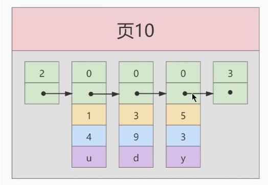
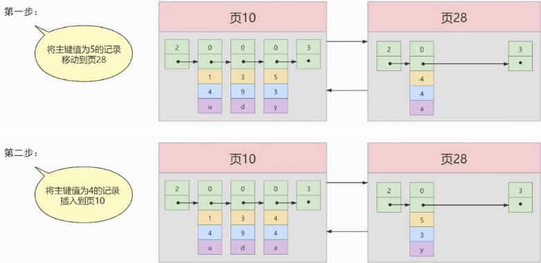
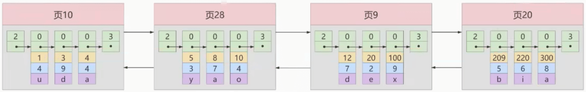
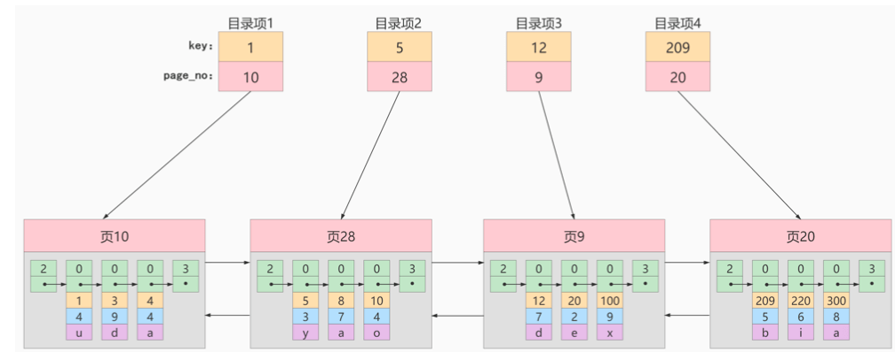
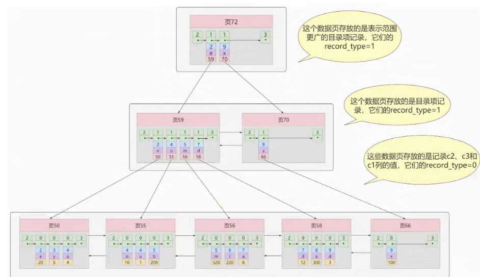
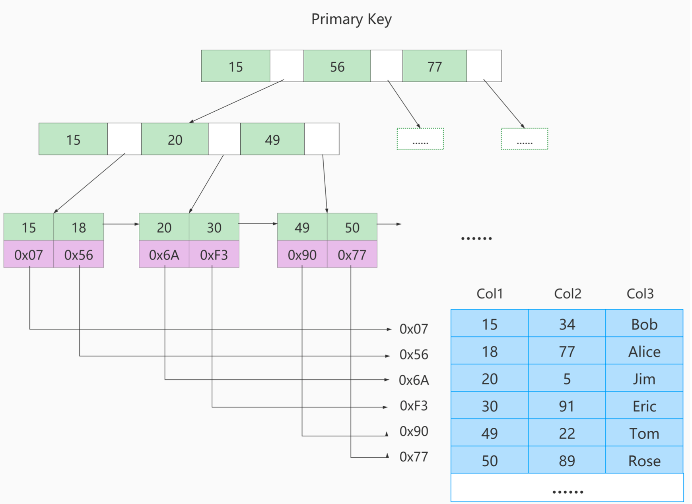
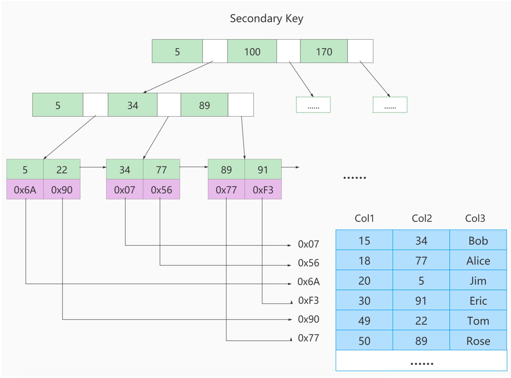
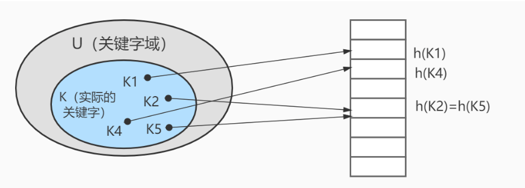
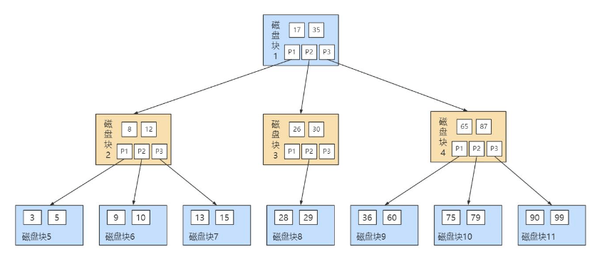
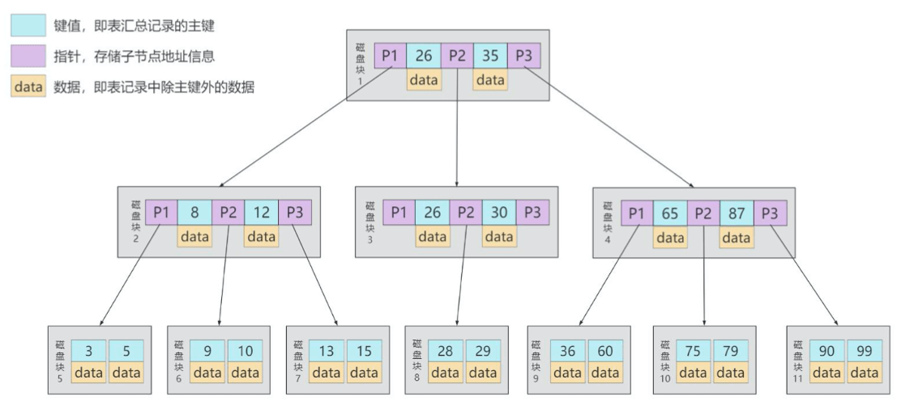

## 为什么使用索引

> 索引是存储引擎用于快速找到数据记录的一种数据结构 , MySQL 在进行数据查询的时候,首先查看查询条件是否命中某条索引。如果命中则`通过索引查找数据`,如果不符合就`全表扫描`,直到找到为止!


1. 最左边数据库没有索引的情况下,`数据分散在磁盘的不同位置`,读取数据的时候，摆臂需要前后摆动查询数据，非常耗时
2. 按中间的方式对上面的一种方式优化,如果`数据顺序存储`,那么也需要从第一行开始逐行读取,将数据从磁盘加载到内存中。那么查询 第六行数据也需要进行 N 次的磁盘 IO 操作，仍然十分耗时
3. 最后一种方式对 Col2 添加了索引,`相当于在磁盘上为 Col2 维护了一个索引的数据结构 -> 二叉搜索树`。二叉搜索树是的每个节点存储的是`K-V 结构`, key 是 Col2，value 是该 key 对应的`文件指针(地址)`

<mark>所以建立索引的目的就是: 减少<strong>磁盘 IO</strong> 的次数，加快查询效率</mark>

## 索引优缺点

> MySQL 官方对索引的定义为: `索引(index)是帮助 MySQL 高效获取数据的数据结构`

- 索引的本质是`数据结构`, 可以简单的理解为**`排好序`**的快速查找数据结构,满足特定查找算法。这些数据结构以某种方式执行数据,这样就可以在这些数据结构的基础上实现`高级查找算法`

- `索引是在存储引擎中实现的`, 所以每种存储引擎的索引不一定完全相同，并且每种存储引擎不一定支持所有的索引类型。同时存储引擎可以定义每个表的`最大索引数、最大索引长度`。

- **所有存储引擎支持每个表至少 `16` 个索引,总索引长度至少为 `256` 个字节**

- **索引的优点**
  1. **通过建立索引,可以提高检索效率,从而降低数据库IO 的成本**
  2. **通过创建索引来保证每一行数据的唯一性**
  3. 可以加速表与表之间的连接,即**对于有依赖关系的父子表联合查询时,可以提高查询速度**
  4. 在使用分组和排序子句进行数据查询时,可以显著**减少查询中分组和排序的时间**,降低了 CPU 的消耗
- **索引的缺点**
  1. **创建和维护索引需要耗费时间,耗费的时间会随着数据量的增加而增加**
  2. **索引需要占用磁盘空间, 如果有大量的索引,索引文件就可能比数据文件更快达到最大文件尺寸**
  3. **索引虽然可以提高查询速度,但是会降低表更新速度。因为对表数据进行增删改时,索引也需要动态的维护**

:::tip 提示

索引可以提高查询的速度,但是会影响插入速度，因为每次插入数据都需要动态的维护索引。这种情况下,最好的办法就是先删除表中的索引后再插入数据,插入完成后再创建索引

:::

## InnoDb 索引的推演

### 索引前的查找

> 一个精确匹配的 Sql 语句: 
>
> ```sql
> SELECT [列名列表] FROM 表名 WHERE 列名 = xxx;
> ```


**一个页中查询**

假设表的数据较少,所有的记录都可以放到一个页中,在查询记录的时候可以按照搜索条件的不同分为下面两种情况

1. **以主键为搜索条件**
   - 可以在页目录使用`二分法` 快速定位到对应的槽,然后再遍历该槽对应分组中的记录就可以快速找到指定的记录
2. **以其他列作为搜索条件**
   - 因为数据页中没有对非主键列建立页目录,所以无法通过二分法快速定位槽，这样只能从`最小记录`开始`依次遍历`单链表中的每条记录，然后对比每条记录是否符合搜索条件
   - 这里单链表指的是某条数据记录下一条数据的内存地址

**很多页中查询**

大部分情况下,表中存放的数据是很多的,需要很多的数据页来存储数据。在很多页中查询的话分为两个步骤

1. 定位到记录的页
2. 从所在的页中查找相应的记录

在没有索引的情况下，无论是否按照主键列还是其他列进行查询。由于无法快速定位到记录所在的数据页,所以`只能从第一页开始沿着双向链表一致往下找`,每一页都会按照上面单页的方式查询指定的记录。由于要遍历所有的数据页,那么所以效率极其低下。

### 设计索引

>建一个表
>
>```sql
>CREATE TABLE index_demo( 
>  	c1 INT,
>	c2 INT,
>	c3 CHAR(1), 
>  	PRIMARY KEY(c1)
>) ROW_FORMAT =Compact;
>```

新建的 index_demo 表有 2 个 INT 类型的列，1个 Char(1) 类型的列,并且c1为主键。这个表使用`Compact`行格式来实际存储数据


**Compact行格式展示记录的这几个部分(部分信息)**

1. `record_type`
   - 记录头信息的一项属性，**表示记录的类型**
     - `0` : 表示普通记录
     - `1` : B+树节点指针
     - `2` : 表示最小记录
     - `3` : 表示最大记录

2. `next_record`
   - 记录头信息的一项属性，**表示下一条地址相对于本条记录的地址偏移量**
3. `各个列的值`
   - 记录在表中列

**基本数据页的模型：**

> 如下图所示：
>
> 1. head 头部的 record_type=2，说明 next_record 指向当前页的最小记录
>
> 2. 中间的 record_type=0,说明都是普通的记录,并且 next_record指向下一条记录。并且最后一条普通记录指向 record_type=3 的最大记录
> 3. tail 尾部的 record_type=3，说明 next_record 指向**下一页**的最小记录(对于当前页面来说是最大值)


#### 简单的索引方案

由于各页中的数据没有规律,所以在查询的时候不得不遍历所有的数据。如果我们想要快速的定位到记录所在的数据页,需要建立一个**目录**,建立目录需要完成一下的事情:

1. **下一个数据页中记录的主键值必须大于上一页中所有记录的主键值**
   - 在对记录进行增删改的时候,我们需要通过一些比如`记录移动` 的操作来保证当前数据页的最小记录的主键值大于上一页的最大记录的主键值,这个过程称为**`页分裂`**
2. **给所有的页建立一个目录项**
   - 数据页在物理存储上是不连续的,但是为了保证连续性,需要建立`目录(索引)`,每一个数据页对应一个`目录项`
     - `目录项` 记录了: **页号** 和 **数据页中用户记录的最小值**
   - 通过维护目录可以得到一个 **在逻辑上连续存储的数据页**

:::info 简单索引方案示例

**1. 下一个数据页中记录的主键值必须大于上一页中所有记录的主键值**

向 index_demo的表中添加数据

```sql
# 插入的数据中主键不是递增的
insert into index_demo values 
(1,4,'u'),(5,3,'y', 3,9,'d')
```

在插入的数据中主键不是递增的,但是数据页中数据递增的，便得到下面的图:



此时我们再插入一条数据:

```sql
insert into index_demo values  (4,4,'a')
```

我们假设数据页最多只能存储 3 条数据,那么需要在分配一个数据页。当然数据页在物理上不一定是连续的,只需要在逻辑上保持连续即可。


上图中 页28 的主键最大值是 4，而 页10 的主键最大值为 5，这个不符合要求，所以在插入这条 主键值=4 的记录时,需要伴随着一次`记录移动`,将 主键值=5 的数据移动到 页28 里面,插入的这条主键值=4的记录移动到 页10 里面,得到的模型图如下:




**2.给所有目录建立一个目录项**

由于数据页的`编号不一定是连续的`,所以在向index_demo 表中插入多条数据的时候,可能得到的结果是这样的:



因为这些`16kb`的页在物理存储上是不连续的,如果想从多个数据页中根据主键值`快速定位某些记录所在的页`,我们需要给这些数据页做一个**`目录`**，每个页对应一个`目录项`，每个目录项包含一下的内容

- **页的用户记录中最小的主键值，我们用`key` 来表示**
- **页号,我们用`page_no`来表示**

那么上述的几个数据页得到的命令就如图所示:



以页28 为例,它对应目录项2,包含了该页的 `页号28` 以及`该页中用户记录的最小主键值 5`。

**我们只需要把几个目录项在物理存储器上连续存储(比如:数组)，就可以实现根据主键值快速查找某条记录的功能了**

比如:查找主键值为 20 的记录，具体查找过程分两步:

- 先从目录项中根据 `二分法` 快速确定出主键值为 20 的记录在 目录项3 中(因为 12 < 20 < 209 )，它对应的页是`页9`

- 再根据前边说的在页中查找记录的方式去 `页9` 中定位具体的记录

至此，针对数据页做的简易目录就搞定了。这个目录有一个别名，称为 **`索引`** 。

:::

#### InnoDb索引方案(1)

> 到这里我们认识到,通过建立逻辑连续的索引，以及目录项可以帮助我们快速的定位到查询的数据。但是我们有需要如何存储索引呢?

**目录项纪录的页**

我们把前边使用到的目录项放到数据页中的样子就是这样:


从图中可以看出来，我们新分配了一个编号为30的页来专门存储目录项记录,这里`目录项记录` 和 `普通的用户记录`的不同点在于:

- `目录项的 record_type = 1`,而 普通的用户记录 record_type = 0

- 目录项记录只有`主键值` 和 `页编号`两个列，而普通的用户记录的列是用户自己定义的，可能包含很多列 ，另外还有InnoDB自己添加的隐藏列

两个记录的**相同点**:

- 两者用的是一样的数据页，都会为主键值生成 `Page Directory(页目录)`, 通过**页目录**可以按照主键值进行查找时可以使用 `二分法` 来加快查询速度

:::info 查询示例

现在以查找主键为 20 的记录为例，根据某个主键值去查找记录的步骤就可以大致拆分成下边两步:

1. 先到存储 **目录项记录** 的页，也就是页30中通过 **二分法** 快速定位到对应目录项，因为 *12 < 20 < 209* ，所以定位到对应的记录所在的页就是页9
2. 再到存储用户记录的页9中根据 **二分法** 快速定位到主键值为 20 的用户记录。

:::

#### InnoDb索引方案(2)

> 上述的方案中,将目录项存储到了数据页中,但是当目录项很多以至于一个数据页中存储不了的时候，会分配一个新的数据页来存储目录项

**多个目录项纪录的页**


从图中可以看出，我们插入了一条主键值为320的用户记录之后需要两个新的数据页:

- 为存储该用户记录而新生成了 **页31** 
- 因为原先存储目录项记录的 页30 的容量已满 (我们前边假设只能存储4条目录项记录)，所以需要一个新的 页32 来存放 页31 对应的目录项

:::info 查询示例

现在因为存储目录项记录的页不止一个，所以如果我们想根据主键值查找一条用户记录大致需要3个步骤，以查找主键值为 20 的记录为例：

1. 确定 **目录项记录页**, 我们现在的存储目录项记录的页有两个: 页30 和 页32 

2. 通过 目录项记录页 确定用户记录真实所在的页

3. 在真实存储用户记录的页中定位到具体的记录

:::

#### InnoDb索引方案(3)

经历上述的推演后,我们对目录页在创建一个数据页，维护目录信息，最后大致推演出一个索引的数据的数据结构，这个数据结构就是 **`B+树`**

- **B+ 树底层节点(叶子节点)存储的是用户记录,其他节点(非叶子节点、内节点)存储的是目录项记录，最顶上的称为根节点**
- **单个数据页中的记录之间采用单链表的形式连接**
- **多个数据页之间使用双链表连接**


#### B+树

1. 一个 B+ 树可以分为好几层，`规定最下边的那层，也就是存放我们用户记录的那层为 第 0 层`, 之后依次往上加
2. 实际上`B+树一般都不会超过4层`，因为 4 层已经存储到很大的数据量了，并且树层次越低，磁盘 IO 的次数越少
3. 通过主键值去查找某条记录最多只需要做4个页面内的查找(查找3个目录项页和一个用户记录页)，又因为在每个页面内有`Page Directory(页目录)`,所以在页面内也可以通过 `二分法` 实现快速定位记录。

### 常见索引概念

> 索引按照**物理实现方式**，索引可以分为 2 种:
>
> 1. **聚簇(聚集)索引**
> 2. **非聚簇(非聚集)索引**，也加做二级索引或者是辅助索引

#### 聚簇索引

> **聚簇** 表示数据行和相邻的键值聚簇的存储在一起

- **聚簇索引不是单独的索引类型，而是一种`数据存储方式`**(所有的用户记录都存储在叶子节点)，也就是所谓的 **数据即索引，索引即数据**
  - 比如 InnoDb 的索引中，底层叶子节点存储的是数据，上层存储的是目录项组成的目录(索引)。所以说索引也是数据
  
- **特点**
  
  1. <mark>使用记录主键值的大小进行记录和页的排序</mark>，这包括三个方面的含义

     - **`数据页`内的记录是按照 `主键的大小顺序` 排成一个 `单向链表`**
     - **各个存储 `用户记录的数据页` 也是根据页中`用户记录的主键大小顺序`排成一个`双向链表`**
     - **存放 `目录项记录的页`, 分为不同的层次，在同一层次中的页也是根据页中`目录项记录的主键大小顺序`排成一个 `双向链表`**
  2. <mark>B+树的<strong>叶子节点</strong>存储的是完整的用户记录</mark> 

     - 所谓完整的用户记录，就是指这个记录中存储了所有列的值(包括隐藏列)
  
  
  :::tip 说明
  
  把具有上面两种特性的的 B+树称之为`聚簇索引`,所有完整的用户记录都会放在这个`聚簇索引`的叶子节点处。
  
  这种聚簇索引不需要再 MySQL 语句中显式的使用`INDEX`语句去创建,`InnoDB`存储引擎会`自动`的为我们创建聚簇索引 =》 添加数据的时候 InnoDb 引擎会适时的维护索引数据，而不是等所有数据插入完成后最后区分数据与索引
  
  :::
  
- **优点**
  - `数据访问更快`,因为聚簇索引将 **索引和数据保存在同一个 B+ 树中**，所以从聚簇索引中获取数据比非 聚簇索引更快
  - 聚簇索引对于主键的 `排序查找` 和 `范围查找` 速度非常快
    - 按照聚簇索引排列顺序，查询一定范围数据的时候，由于数据都是紧密相连，数据库不用从多个数据块中提取数据,所以节省了大量的磁盘 IO

- **缺点**
  - `插入速度严重依赖于插入顺序`, 按照主键的顺序插入是最快的方式，否则将会出现`页分裂`，严重影响性能
    - 对于InnoDB表，我们一般都会定义一个 **自增主键 ID**

  - `更新主键的代价很高`, 因为将会导致被更新的用户记录移动到其他数据页
    - 对于InnoDB表，我们一般定义 **主键不可更新**

  - `二级索引需要两次索引查找`, 第一次找到主键值，第二次根据主键值找到行数据
  
- **限制**
  - 对于 MySQL 来说,目前只有**InnoDB**支持聚簇索引,而**MyISAM**不支持聚簇索引
  - 由于数据在物理存储上只能有一种,所以`每个 MySQL 表只能有一个聚簇索引`。一般情况来说就是主键
  - **如果表中没有定义主键,那么 InnoDb 会选择`非空的唯一索引`代替。如果也没有这样的索引，那么 InnoDb 会`隐式的定义一个主键来作为聚簇索引`**
  - **为了充分的利用聚簇索引的特性，所以 InnoDB 表的主键应该尽量的使用`有顺序的ID`,而不建议使用无需的ID(UUID、MD5、HASH、字符串…)作为主键**

#### 非聚簇索引

##### 概述

> `聚簇索引`只能在搜索条件是**`主键值`**的时候才能发挥作用，因为 B+树中的数据是按照主键进行排序的。
>
> 如果需要以其他列作为搜索条件呢？肯定不能按照 B+树从头到尾依次遍历。
>
> 这个时候就需要`二级索引`,我们可以`多建几个 B+树`,不同树中的数据采用不同的`排序规则`，**此时叶子节点`不再存储表中的所有数据`，而是存储 `索引列的数据 + 主键列的数据`**

:::info 非聚簇索引 B+树示例

比如我们需要对 C2 列进行查询，那我们可以对 C2 建立索引，再建一个 B+树。下图中的 B+树中，叶子节点就是存储了索引列C2，以及主键列 C1


:::

**非聚簇索引的 B+树与聚簇索引有下面的几个区别**

1. 使用指定的记录列的大小进行记录和页的排序
   - 数据页内的数据按照 `指定列`的大小排序形成`单向链表`
   - 各个`数据页` 也是按照页中记录的`指定列`大小顺序形成的双向链表
2. B+树的叶子节点存储的并不是完整的用户记录,而只是`指定列 + 主键列` 的值
3. 目录项记录的不再是`主键+页号`了,也变成了`指定列 + 主键列 + 页号`

##### 回表

**我们可以考虑执行下面的 sql 语句**

```sql
-- 假设需要执行下面的 SQL 语句
Select * from index_demo where c2=4
```

上面的这个 sql 的在 B+树的执行就是，先根据 c2 的二级索引找到对应的数据,但是 c2索引列查询出来仅包含 c2 的值 和 主键列 c1 的值,而这里是查询所有的字段，包含 c3， 所以再拿主键列 c1 的值去聚簇索引中查询，这时候就可以查询到完整的用户记录，并将所有的数据查询并返回,这个过程就被称为**`回表`, 回表完成后再根据其余的 WHERE 条件过滤记录**

因为这种按照`非主键列`建立的 B+树需要一次回表操作才可以定位到完整的用户记录,所以这种 B+树也叫做`二级索引、辅助索引`

<mark>注意：<strong>非聚簇索引的存在不会影响聚簇索引中的结构,所以一张表可以有多个非聚簇索引</strong></mark>

:::caution 为什么需要回表?

**为什么还需要一次回表呢?不能干脆将完整的用户记录放在非聚簇索引的叶子节点中吗?**

如果将完整的用户记录放在叶子节点中的话,那么就太`占用地方`了。相当于每次建立一颗 B+树,都需要将所有的用户记录都拷贝一遍,有点太浪费存储空间了。

:::

##### 回表的代价

- **使用二级索引执行查询的时候,每获取一条二级索引的记录,就会立刻对它进行回表,而不是将所有的二级索引记录的主键值汇总后统一进行回表**
- 对于非聚簇索引来说,直接访问它是`顺序 IO`,因为记录之间是连续的
- 回表访问聚簇索引使用`随机I/O`,因为回表时主键值是毫无规律的,只能依赖随机 IO
  - 需要执行的回表操作越多,那么非聚簇索引的查询性能就越低

#### 联合索引

我们也可以同时将多个列的大小作为排序规则,也就是**`同时为多个列建立索引`** ,比如想让 B+树按照 (C2、C3) 的大小进行排序,对应的排序操作是:

1. **先把各个记录和页按照 C2 列进行排序**
2. **在记录的 C2 列相同的时候,采用 C3 列进行排序**


为 C2 和 C3 列建立的索引示意图如下:



<br/>
**以 C2 和 C3 列的大小为排序规则建立的 B+树被称为 `联合索引`**, <mark>可以看出来,<strong>它的本质上也是二级索引</strong></mark>。查询的时候也会将查询条件与 C2 和 C3 同时比较,并找到对应的叶子节点

###  B+树注意点(InnoDB)

#### 1. 根页面位置不变

前面在推演 B+树的时候,**先将存储用户记录的叶子节点画出来,再接着画目录项记录的内节点**,实际上 B+树不是这样形成的，而是下面的过程

1. 每为一个表创建 B+树索引(**聚簇索引是不是人为创建的,默认就有**)的时候,都会为这个索引创建一个**`根节点`**页面。一开始表中没有数据的时候,每个 B+树中的`根节点`中没有用户记录,也没有目录项
2. 之后向表中插入数据的时候,先把用户记录存储在`根节点`中 (开始的时候只有*叶子节点*，然后数据都存放在根节点中)
3. 当`根节点中的可用空间用完时`继续插入数据,此时会将**`根节点中的所有记录复制得到一个新分配的页中，而不是直接新分配一个新的数据页`**，比如页 A ，然后对这个新页(页 A)进行`页分裂`的操作，得到一个新页,比如页 B。这时新插入的记录根据索引列值的大小排序，并被分配到页 A 或者 页 B 中,而`根节点` 便**升级**为存储目录项记录的页，**同时更新根节点中的记录值，从用户记录变为目录项记录**
   - **即 B+树的节点是`自上而下`逐渐生成的**

:::tip 说明

1. 开始的时候只有一个**根节点**存储用户记录,当**根节点**中存储的数据满了之后,会复制一份根节点作为**叶子节点存储数据**。

2. 然后根节点去维护叶子节点的**目录项信息**，之后叶子节点数据满了之后,进行**页分裂**的操作

3. 当根节点维护的**目录项**记录满了之后,再次复制根节点得到第二层维护**目录项**的内节点,根节点转而维护内节点信息

所以一个 B+树索引的根节点从生成开始,就不会再移动。这样在对某个表建立索引之后，那么根节点的页号就会被记录存储。然后 InnoDb 需要用到这个索引时，就可以通过这个页号找到并使用对应的索引

:::

#### 2.目录项记录的唯一性

我们知道了 B+树索引的内节点中目录项记录的内容是`索引列 + 页号` 的形式，但其实对二级索引来说并不严谨,因为二级索引可以有指定非唯一的字段列

| C1   | C2   | C3   |
| ---- | ---- | ---- |
| 1    | 1    | ‘u’  |
| 3    | 1    | ‘d’  |
| 5    | 1    | ‘y’  |
| 7    | 1    | ‘a’  |


问题: **我们需要新插入一行数据(9,1,c)的数据,那么问题来了:在添加数据的时候,由于索引列的数据都相同，而 页3 中只存储了索引列数据与页号,所以不知道数据应该添加到 页4 还是 页5**

为了保证新的数据可以找到并插入到所在的数据页,需要保证**`B+树的同一层内节点的目录项记录除去页号以外是唯一的`**,所以二级索引的内节点的目录项记录的内容有三部分组成

1. `索引列的值`
2. `主键的值`
3. `页号`

通过将**主键值**页添加到二级索引的内节点的目录项记录中,可以保证 B+树内节点中**各个目录项记录的唯一性**, 实际上二级索引的 B+树结构图大致如下:


####  3.一个页面最少存储2条记录

一个 B+树只需要很少的层级就可以轻松存储数亿条记录,并且查询速度相当不错。本质上因为 B+树这种**`多层级目录`**的设计。每经过一个目录就可以过滤掉很多无效的目录,直到找到最终的数据。**一般来说一个数据页最少也会有两层**


## MyISAM 索引方案

B树索引适用存储引擎如表所示(都支持 B 树索引,但是它们的实现原理是不同的):

| 索引/存储引擎 | MYISAM             | InooDB             | Memory             |
| ------------- | ------------------ | ------------------ | ------------------ |
| B+树索引      | :white_check_mark: | :white_check_mark: | :white_check_mark: |

- **`InnoDb、MyISAM 默认使用 B+树索引,Memroy默认使用 Hash 索引`**

- **MyISAM使用 B+树索引,叶子节点的 data 域存放的是`数据记录的地址`**

### MyISAM 索引原理

在 InnoDB 中**索引即数据**,也就是聚簇索引的 B+树的叶子节点存储了完整的用户记录,而 MyISAM 索引方案是将*`数据和索引分开存储`*：

1. 将表中的记录`按照记录的插入顺序`单独存储在**`数据文件(MYD)`**中。在数据文件中不会去划分若干个数据页,而是一股脑的将数据存储在文件中。由于在插入数据的时候`没有按照主键进行排序`,所以也无法通过二分法查询数据
2. 使用 MyISAM 存储引擎会将索引信息存储在**`索引文件(MYI)`**中。MyISAM默认会为表的主键创建一个索引,**不过索引的叶子节点存储的不是完整的用户记录**,而是**`主键值 + 数据记录的地址`**

:::tip 索引示意图

①、**主键为索引键**

在 MyISAM 引擎中,叶子节点存储的是数据的地址。聚簇索引中存储就是主键的数据的地址



这里假设表一共有 3 列,假设我们以 Col1 为主键,上图就是一个 MyISAM表的`主索引(Primary Key)`的示意图。可以看出**`MyISAM 的索引文件仅仅保存数据记录的地址`**。在 MyISAM 中主键索引和二级索引没有任何区别,**只是主键索引要求 Key 是唯一的,而二级索引的 key 是可以重复的。**

如果我们再 Col2 上建立一个二级索引,那么索引的结构如下图所示:

②、**非主键为索引键的二级索引**

​	

:::

### MyISAM 与 InnoDB对比

> 同样也是一棵 B+树,MyISAM 中的 data 域保存数据记录的地址。因此 MyISAM 中索引检索的算法为: 
>
> 1. **`首先按照 B+树搜索算法去上搜索索引,如果指定的 key 存在，就取出其 data 域的值`**
> 2. **`然后按照 data 域的值作为地址,去 MYD 文件中找到并读取相应的数据记录`**

小结两种引擎中索引的区别:

1. **MyISAM的索引方式都是 “非聚簇” 的，与InnoDB包含1个聚簇索引是不同的** 
2. 在 InnoDB 存储引擎中, 我们可以通过主键值对`聚簇索引`进行一次查询并找到对应的记录。而在 MyISAM 中需要多进行一次`回表`的操作,这个是因为 MyISAM 中建立的索引相当于都是`二级索引`
3. InnoDB的数据文件本身就是索引文件,而 MyISAM 的索引文件和数据文件是`分开的`, 索引文件仅仅保存数据文件中数据记录的地址
4. InnoDB中索引 data 域存储的是`索引列的值`,而MyISAM 索引记录的是`索引列的地址`。
5. MyISAM 的回表操作是十分`快速`的,因为是**直接拿着地址去数据文件中读取数据的。**但是 InnoDB通过获取主键值后，再去**聚簇索引**中找记录，虽然也不慢,但是也还是需要通过多次二分查询去查找数据,比不上用地址直接去访问
6. InnoDB 要求表`必须有主键(MyISAM 可以没有)`
   - 如果没有显式指定的话,则 MySQL 会自动选择一个非空且唯一标识数据记录的列作为主键
   - 如果也没有,则 MySQL 会自动为 InnoDB 生成一个隐含字段作为主键, **这个字段有 6 个字节,类型为长整型**


:::tip 小结

了解不同存储引擎的实现方式对于正确使用和优化索引都非常有帮助,比如:

1. 知道 InnoDB 的索引本质以后,就会明白**为什么不建议使用过长的字段作为主键**,因为所有的二级索引中都包含主键，过长的主键会让二级索引变得过大
2. 用非单调递增的字段作为主键在 InnoDB 中不是一个好主意。因为非单调的主键会在插入新记录时，为了维持 B+树的特性而频繁的进行页分裂操作，十分低效。而使用`自增字段作为主键是一个很好的选择`。

:::

## 索引的代价

> 索引是加快查询的速度,但是不能乱建索引,它在时间和空间上都有所消耗

1. **`空间的代价`**
   - **每建立一个索引都要为其建立一棵 B+树, 每一棵B+树的每一个节点都是一个数据页，一个页默认会 占用 `16KB` 的存储空间**
   - 一棵很大的B+树由许多数据页组成，那就是很大的一片存储空间
2. **`时间上的代价`**
   - 每次对表中数据进行增、删、改的时候,都需要去修改各个 B+树索引,而且 B+树中每层节点都是按照索引列的值`从小到大顺序排序`形成的`双向链表`。
   - 不论是叶子节点的记录还是内节点中的记录,都是按照索引列的值从小到大的顺序形成的单向链表，而增、删、改的操作会对节点和记录造成破坏,**所以存储引擎需要额外的时间进行一些`记录位移、页面分裂、页面回收`等操作来维护节点和记录的排序**
   - 如果我们建立了许多的索引,每个索引对应的 B+树都要进行相关的维护操作,就会对性能拖后腿

## MySQL数据结构选择的合理性

从 MySQL 的角度上说,不得不考虑与一个现实的问题:**磁盘 IO**。如果我们可以上索引的数据结构尽量减少磁盘 IO 的次数,那么所消耗的时间就越小。可以说**磁盘 IO 的次数对索引的使用效率至关重要**。

`查询都是索引操作`,一般来说索引非常大,特别是关系型数据库。当数据量比较大的时候,索引的大小可能达到几个 G 甚至更多。为了减少索引在内存中的占用,`数据库索引是存储在外部磁盘上的`。当利用索引查询的的时候,**也不会把整个索引全部加载到内存中**,只能**逐一加载**。那么MySQL 衡量查询效率的标准就是**磁盘 IO 次数**

### 全表遍历

索引从头到尾全都加载一遍,性能极差

### Hash结构

#### 基本概述

> Hash 本身是一个函数,也被称为**散列函数**,可以帮我们大幅提高检索数据的效率
>
> Hash 算法通过某种确定性算法(比如 MD5、SHA1…)将输入变为输出,**相同的输入一定能得到相同的输出**。假设内容有细微的偏差,通常就会输出不同的结果
>
> **`Hash结构查询、插入、修改、删除的平均时间复杂度都是O(1)`**

采用 Hash 进行检索效率非常高，基本上一次检索就可以找到数据,而 B+树需要从上往下依次查找,多次访问节点才能找到数据,中间需要多次 IO 操作,**`从效率上来说 Hash 比 B+树更快`**。在 Hash 的方式下,一个元素 k 位于 h(k) 中, **即利用哈希函数 h计算出槽的位置**, 哈希函数 h 将关键字域映射到哈希表的槽位上。



上图中,**Hash 函数计算得到的输出不同,但是在计算槽位置时将两个结果进行映射的时候,有可能会映射到相同的位置，这个叫做`Hash碰撞`**,在数据库中一般采用`拉链法(也叫做链接法)`，在拉链法中,**将散列到同一个槽位的元素放在一个链表中**


:::tip 体验数组与 Hash 表的遍历速度

查询数组或者 Hash 表中是否有相同的数据

```java
public class TestArrayAndHash {
    public static void main(String[] args) {
        test01();
        test02();
    }
    public static void test01() {
        int[] arr = new int[100000];
        for(int i = 0;i < arr.length;i++) {
            arr[i] = i + 1;
        }
        long start = System.currentTimeMillis();
        for(int j = 1; j<=100000;j++) {
            int temp = j;
            for(int i = 0;i < arr.length;i++) {
                if(temp == arr[i]){
                    break;
                }
            }
        }
        long end = System.currentTimeMillis();
        System.out.println("time: " + (end - start));   // 1184
    }
    public static void test02() {
        HashSet<Integer> set = new HashSet<>(100000);
        for(int i = 0; i < 100000; i++) {
            set.add(i + 1);
        }
        long start = System.currentTimeMillis();
        for(int j = 1; j<=100000;j++) {
            int temp = j;
            boolean contains = set.contains(temp);
        }
        long end = System.currentTimeMillis();
        System.out.println("time: " + (end - start)); // 6
    }
}
```

可以看到利用了 Hash 之后效率得到了极大的提高

:::

#### 问题

**Hash 结构的效率很高,为什么索引结构要设计成树型呢?**

1. Hash 索引仅仅能满足**等于、不等于和 IN 的高效查询**, 如果需要进行`范围查询`,也是需要遍历每个槽位,时间复杂度为 O(n)。而B+树的`有序`特性,依然可以保证O(log2N)的高效率
2. Hash 存储的数据是没有顺序的,即在 ORDER BY 的时候还需要对数据重新排序
3. 对于联合索引的情况, Hash 值是将联合索引键合并后一起计算的,无法单独对一个键或者几个索引键进行查询
4. 对于等值查询来说,通常是 Hash 索引的效率更高。但如果`索引列重复的值很多，查询效率就会降低`。因为遇到 Hash 碰撞时，需要遍历桶中的数据，也是十分耗时的 

**Hash 索引适用的存储引擎**

这里 InnoDB 支持 Hash 索引,但是`不支持手动指定使用 Hash 索引,而是自动创建的`

| 索引/存储引擎 | MyISAM | InnoDB | Memory |
| ------------- | ------ | ------ | ------ |
| Hash 索引     | ❌      | ✅      | ✅      |

#### 适用性

1. Hash 索引存在着很多的限制,相比之下在数据库中 B+树索引的使用面会更广。不过也有一些场景使用 Hash 的效率更高, 比如一些 K-V 型数据库，`Redis 存储的核心就是 Hash 表`

2. MySQL 中的 Memory 存储引擎支持 Hash 存储,**如果需要用到查询的临时表时,就可以选择 Memory 存储引擎,把某个字段设置为 Hash 索引**，比如字符串类型的字段。**当某个字段的重复度很低，且需要进行`等值查询`的时候,采用 Hash 索引是个不错的选择**

#### 自适应哈希索引(AHI)

> InnoDB支持 Hash 索引,但是不能手动创建 Hash 索引,只能由存储引擎自动创建,即提供了`自适应 Hash 索引(Adaptive Hash Index,AHI)`
>
> 说明:
>
> 1. *InnoDB是支持哈希索引的，但需要启动，也可以关闭*
> 2. *InnoDB创建哈希索引不能人为指定，是内部的，自主的行为*

##### **概述**

1. InnoDB 存储引擎会监控对表上各索引页的查询,会自动根据访问的频率和模式来自动的为某些热点页建立 Hash 索引,我们称之为**自适应哈希索引**

2. AHI 是通过缓冲池的 B+Tree 页构造而来的,所以建立的速度很快。而且不需要对整张比较建立哈希索引

3. AHI 有一个要求,即访问模式需要是一样(`查询的条件是一样的`),**如果每次查询都使用不同的访问模式,那么InnoDB也不会构造 AHI**

   ```sql
   -- 假设某表有联合索引(a,b),那么其访问模式可以是下面两种:
   WHERE a=xxx;
   WHERE a=xxx and b=xxx;
   ```

4. 除了上面`访问模式需要一致`,AHI 还有下面的要求
   - `以该模式访问了 100 次`
   - `页通过该模式访问了 N 次,其中 N=页中记录 * 1/16`
5. 我们可以通过`show engine innodb status` 查看 AHI 的使用状况

6. **哈希索引只能用来搜索等值的查询,如果是范围查询,则不行。**

   ```sql
   -- 	✅
   SELECT * from table where index_col=‘xxx’ 
   
   --  ❌
   select * from table where index_col > xxx
   ```

7. **采用自适应 Hash 索引目的是方便根据 SQL 的查询条件加速定位到叶子节点**，特别是当 B+ 树比较深的时候，通过自适应 Hash 索引可以明显提高数据的检索效率

8. **通过`innodb_adaptive_hash_index`可以看到是否开启了自适应 Hash索引,默认是开启的**


**自适应 Hash 索引的示意图**


### 二叉搜索树

> 如果我们利用二叉树作为索引结构，那么**磁盘的IO次数和索引树的高度是相关的**

#### 特点

1. **二叉树的特点**
   - 一个子节点只能有两个子节点
   - 左子节点 < 当前节点 ， 右子节点 >= 当前节点
2. **查找规则 - 最基础的二叉搜索树(binary search tree)**
   - 如果 key 大于当前节点,则在右子树中查找
   - 如果 key 小于当前节点,则在左子树中查找
   - 如果 key 等于当前节点,也就找到了结果，返回该节点即可

#### 示例

假设对数列 [34,22,89,5,23,77,91]创建的二分查找树如下所示，即使查询底层的数据,也只需要 3 次 IO 加载


但是存在一种极端的情况,**让二叉树变成了链表**,假设给出顺序是递增的: [5,22,23,34,77,89,91],按照二叉搜索树的定义,得到的二叉树结构图如下所示，这种书也属于二分查找树,但是在性能上已经退化成了一条链表，时间复杂度由 O(log2^N^) 变成了 O(n)


为了提高查询效率就需要减少**磁盘 IO 次数**,而为了减少磁盘 IO 次数,就需要尽可能的**减少数的高度**。

### AVL 树

> 由于普通的二叉搜索树在某些情况下性能低下的问题,后来提出了`平衡二叉搜索树(Balanced Binary Tree)`，也叫所**`AVL树`**，在普通二叉搜索树的基础上增加了约束

1. **AVL 树: `它是一颗空树或者它的左右了两个子树的高度差的绝对值不超过 1 , 并且左右两个子树都是一颗平衡二叉树`**
2. 常见的平衡二叉树有很多种，包括了`平衡二叉搜索树(AVL)、红黑树、数堆、伸展树`


上面的这个平衡二叉树,访问一次叶子节点需要进行`5次 I/O操作`。**虽然二叉树的效率高，但如果树的深度也很高,那么也意味着 IO 次数多，会影响查询效率**。对此,我们可以将二叉树转为`M叉树(M > 2)`,这样树就变得矮胖,树的深度降低了，从而 IO 次数减少了

### B-Tree

> B 树 (Balance Tree),也就是**`多路平衡查找树`**，它的高度远低于平衡二叉树的高度

B-Tree 树的结构图如下:



一个 M 阶的 B-Tree(M>2) 有以下的特性:

1. **根节点的子节点树的范围是`[2, M]`**
2. **每个中间节点包含`k-1`个关键字和`k`个子节点, k的取值范围`[ceil(M/2), M]`**
3. **叶子节点中有`k-1` 个关键字(叶子节点没有子节点了), k的取值范围`[ceil(M/2), M]`**
4. **假设中间节点中的关键字为: N[1]~N[k-1], 并且按照指定关键字升序排序,那么`k-1` 个关键字相当于划分了 `k`个范围, 也就是对应着 k 个指针,即为:P[1]~P[k]  **
   - **`P[1] 指向关键字小于 N[1] 的子树, P[i] 指向关键字在 N[i-1]~N[i] 之间的子树, P[k]指向关键字大于 N[k-1] 的子树`**
5. **所有的叶子节点都位于同一层, 即树的高度差h = 0**

:::info 浅析 B-Tree 查询

> 上面那张图所表示的 B-Tree 就是一棵 3 阶的 B-Tree, 可以看下磁盘块 2，里面的关键字为 { 8, 12 }，它有 3 个子节点 { 3, 5 } 、{ 9, 10 } 和 { 13, 15 }，而且 { 3, 5 } < 8,  { 9, 10 } 在 8 和 12 之间，而 { 13, 15 } > 12

假设我们想要查找的关键字是 9，那么步骤可以分为以下几步:

1. 我们与根节点的关键字 { 17, 35 }进行比较，9 < 17 那么得到指针 P1
2. 按照指针 P1 找到磁盘块 2, 关键字为 { 8, 12 }，因为 9 在 8 和 12 之间，所以我们得到指针 P2
3. 按照指针 P2 找到磁盘块 6, 关键字为{ 9, 10 }，然后我们找到了关键字 9

可以看出来在 B 树的搜索过程中, 我们比较的次数并不少, 但如果把数据读取出来然后在内存中进行比较，这个时间就是可以忽略不计的。**因为读取磁盘块本身需要进行 I/O 操作，消耗的时间比在内存中进行比较所需要的时间要多。**

`B-Tree 相比于平衡二叉树来说磁盘 I/O 操作要少`, 在数据查询中比平衡二叉树效率要高。所以`只要树的高度足够低,IO 的次数会越少, 就可以提高查询效率`

**再举例:**



:::

**注意**

1. B-Tree 在插入和删除节点的时候如果导致树的不平衡, 就通过**自动调整的位置保持树的自平衡**
2. 关键字集合分布在整棵树中,即**`叶子节点和非叶子节点都会存放数据`(与 B+ Tree不一样),**搜索可能在非叶子节点就结束了

### B+Tree

> B+Tree也是一种`多路搜索树`,但是`基于 B-Tree 做了改进`,主流的 DBMS 都支持 B+Tree,比如 MySQL
>
> 相比于 B-Tree,B+Tree 更加`适合文件索引系统`

#### B+Tree Vs B-Tree

1. **有 k 个子节点就有 k 个元素。也就是`子节点数 = 节点内关键字数`，而 B-Tree中 `子节点数 = 节点内关键字数 + 1`**
2. **非叶子节点的关键字也会同时存在于子节点中，并且关键字是在子节点中所有关键字的最大(或最小)**
3. **非叶子节点仅用于索引，不保存数据记录，数据都放在叶子节点中。而 `B-Tree中，所有的节点既保存索引,也保存数据记录` **
4. **所有关键字都在叶子节点出现，叶子节点之间构成一个有序链表，而且叶子节点本身按照关键字的大小`从小到大`顺序链接**

#### B+Tree 优势

1. **`B+Tree 查询效率更稳定`**, 因为 B+Tree 只有访问到叶子节点才能找到对应的数据。而在 B-Tree 中由于所有的节点都可以存储数据,那么就会导致查询不稳定的情况
   - 即 B-Tree 有时访问到非叶子节点就可以获取到数据, 但是有时候需要访问到叶子节点才能获取到数据
2. **`B+Tree查询效率更好`**, 因为通常 B+Tree比 B-Tree 更加的矮胖,查询所需要的 IO 次数越少。由于只有叶子节点存储数据,所以同样的磁盘页大小,B+Tree 可以存储更多的关键字
3. 不仅在单个关键字的查询上,`在范围查询上,B+Tree的效率也比-Tree 高`

#### 思考

1. **为了减少IO，索引树会一次性加载吗**
   - 数据库索引存储在磁盘上,如果数据量很大的就会导致索引也很大,**所以我们在利用索引查询的时候, 是不可能将索引全都加载进内存的.`只能逐一的加载磁盘页,因为磁盘页对应索引的节点`**
2. **B+树的存储能力如何? 为何说一般查找行记录，最多只需1~3次磁盘IO**
   - InnoDB 存储引擎中页的大小默认为`16KB`,一般表中主键类型为 INT(4 字节)、BIGINT(8 字节),指针类型一般为 4/8 字节,也就是说一个页(B+Tree 中的一个节点)大概存储`16KB/16B = 1K`个键值,那么深度为 3 的 B+Tree 可以维护 `1000*1000*1000=10 亿条记录`(这里假设一个数据页存储 1000 条数据) 
     - 根节点存储 对应 1000 个中间节点,1 个中间节点对应 1000 个叶子节点,一共有 1 百万个叶子节点, 每个叶子节点中存储 1000 条数据,那么可以存储 100,0000 * 1000 = 10 亿条数据
   - 实际上,B+Tree 的高度一般在 2~4 层,且MySQL 的根节点常驻在内存中, 也就是查询某一个键值的数据是最多只要 1~3 次的磁盘 IO
3. **Hash 索引与 B+Tree 索引的区别**
   - `Hash 索引不能进行范围查询`,因为 Hash 索引的指向是无序的,是通过算法给 索引一个位置,而 B+Tree 的叶子节点是有序的链表
   - `Hash 索引不支持联合索引的最左侧元素(联合索引的部分索引无法使用)`
     - 对于联合索引来说,Hash 索引计算Hash 值的时候是讲多个索引值合并后再一起计算 Hash 值,那么查询部分索引的时候就无法匹配到该 Hash 值
   - `Hash 索引不支持 Order By 排序`,同样是因为 Hash 索引的指向是无序的,是通过算法得到其位置的。而 B+Tree 索引本身就是通过关键字排序的,同样的,`Hash 索引也不支持模糊查询`,模糊查询本身也是范围查询,所以想要模糊查询需要遍历Hash 索引的每个节点


