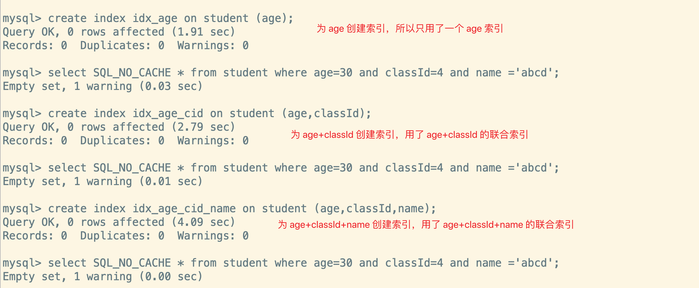
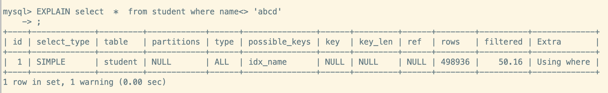
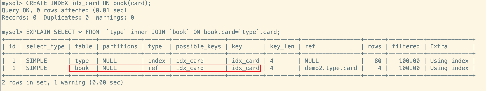
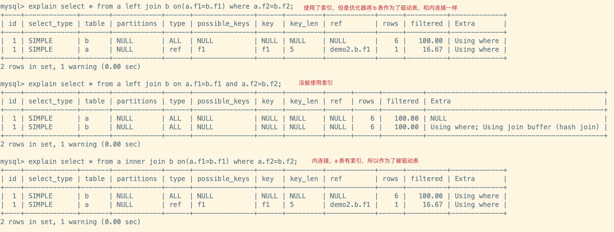
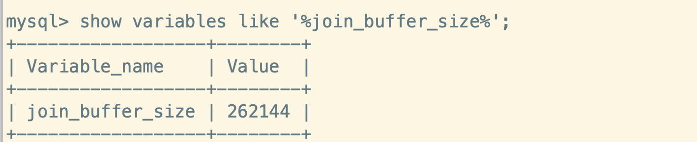
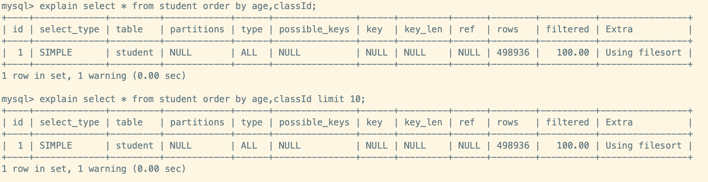
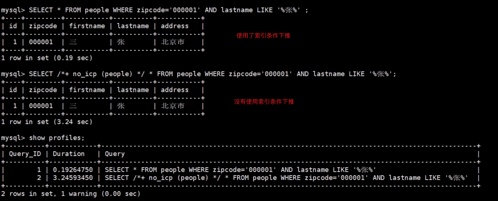

> 都有哪些维度可以进行数据库调优?大体上说:
>
> 1. 索引失效或没有充分利用到索引 – 建立/优化索引
> 2. 关联太多的 JOIN (设计缺陷或不得已的需求) - sql 优化
> 3. 服务器调优及各个参数的设置(缓冲、线程池等) - 调整 my.cnf
> 4. 数据过多 – 分库分表

关于数据库调优的策略比较散,不同的 DBMS 都不一样。但是大方向主要分为`物理查询优化`和`逻辑查询优化`两块:

1. 物理查询优化: 通过`索引`或者 `表连接方式`等技术来进行优化,重点就是索引的使用
2. 逻辑查询优化: 通过 sql`等价变化`来提升查询效率,也就是换种效率更高一点的 sql 查询

**相关的博客内容**

1. [MySQL索引问题](https://juejin.cn/post/6844903967193825294#heading-0)
2. [MySQL实验](https://juejin.cn/post/6844903692966215693#heading-0)
3. [MySQLSQL排序优化](https://blog.csdn.net/weixin_37692493/article/details/115050308)

## 数据准备

**1.建表**

```sql
CREATE TABLE `class` (
		`id` INT(11) 	NOT NULL PRIMARY KEY AUTO_INCREMENT, 
  	`className` 	VARCHAR(30) DEFAULT NULL, 
  	`address` 		VARCHAR(40) DEFAULT NULL, 
  	`monitor` 		INT NULL 
) ENGINE=INNODB AUTO_INCREMENT=1

CREATE TABLE `student` (
    `id` 		INT(11) NOT NULL PRIMARY KEY AUTO_INCREMENT,
    `stuno` INT 		NOT NULL ,
    `name` 	VARCHAR(20) DEFAULT NULL,
    `age` 	INT(3) 		DEFAULT NULL,
    `classId` INT(11) DEFAULT NULL
) ENGINE=INNODB AUTO_INCREMENT=1
```

**2.创建函数**

```sql
-- 设置信任函数创建
set global log_bin_trust_function_creators=1;

# 随机产生字符串
CREATE FUNCTION rand_string(n INT) RETURNS VARCHAR(255)
BEGIN
	DECLARE chars_str VARCHAR(100) DEFAULT 		'abcdefghijklmnopqrstuvwxyzABCDEFJHIJKLMNOPQRSTUVWXYZ';
	DECLARE return_str VARCHAR(255) DEFAULT '';
  DECLARE i INT DEFAULT 0;
  WHILE i < n DO
    SET return_str =CONCAT(return_str,SUBSTRING(chars_str,FLOOR(1+RAND()*52),1)); 
    SET i = i + 1;
  END WHILE;
	RETURN return_str; 
END 

# 随机产生班级编号
CREATE FUNCTION rand_num (from_num INT ,to_num INT) RETURNS INT(11) 
BEGIN
  DECLARE i INT DEFAULT 0;
  SET i = FLOOR(from_num +RAND()*(to_num - from_num+1)) ;
  RETURN i;
END
```

**3.创建存储过程**

```sql
# 往stu表中插入数据的
CREATE PROCEDURE insert_stu( START INT , max_num INT ) 
BEGIN
	DECLARE i INT DEFAULT 0;
	SET autocommit = 0; #设置手动提交事务
    REPEAT #循环
      SET i=i+1; #赋值
      INSERT INTO student (stuno, name ,age ,classId ) VALUES
        ((START+i),
         rand_string(6),
         rand_num(1,50),
         rand_num(1,1000)); 
      UNTIL i = max_num
    END REPEAT;
	COMMIT; #提交事务
END

# 往class表添加随机数据
CREATE PROCEDURE `insert_class`( max_num INT )
BEGIN
	DECLARE i INT DEFAULT 0;
	SET autocommit = 0;
		REPEAT
      SET i = i + 1;
      INSERT INTO class ( classname,address,monitor ) VALUES
        (rand_string(8),
         rand_string(10),
         rand_num(1,100000)); 
      UNTIL i = max_num
		END REPEAT;
	COMMIT;
END
```

**4.调用存储过程**

```sql
 #执行存储过程，往class表添加1万条数据 
 CALL insert_class(10000);
 
 #执行存储过程，往stu表添加50万条数据
 CALL insert_stu(100000,500000);
```

## 索引匹配与失效

> MySQL 中**提高性能**的最有效的方式就是对数据库`设计合理的索引`,索引提供了高效的访问数据的方法,并且可以加快查询的速度,因此索引对查询的速度有很重要的影响
>
> - 使用索引可以`快速的定位`表中的记录,从而提高查询的速度和数据库的性能
> - 如果查询的时候没有使用索引,查询语句就会`扫描表中的所有记录`,在数据量大的时候,这样的查询效率会很低
>
> 大多数情况下(默认)都采用`B+Tree`来构建索引

1. 用不用索引是由`优化器`决定的,优化器是基于`cost 开销`,而不是基于`规则`,也不是基于`语义`。所以说哪种开销小,优化器就使用哪种执行计划。另外,sql 语句是否使用索引,和**数据库版本、数据量、数据选择度**都有关系
2. <mark>某些失效的情况,也可以使用一些方法让它变得可以使用索引</mark>

### 1.全值匹配法则

- 概述
  - `where 条件字段按照顺序在索引中都可以匹配到`
  - 需要注意的是,理论上<code>索引对顺序是敏感的</code>,但是<mark>查询优化器会<strong>在不影响 SQL 执行结果的情况下,自动调整 where 子句的条件顺序以使用适合的索引</strong></mark>

:::info 示范使用非全值匹配与全值匹配的区别

**系统中经常使用下面的 sql**

```sql
-- 这里的 sql_no_cache 是放置从查询缓存中取数据,MySQL8.0 已经没 Query Cache 了
select SQL_NO_CACHE * from student where age=30;
select SQL_NO_CACHE * from student where age=30 and classId=4;
select SQL_NO_CACHE * from student where age=30 and classId=4 and name ='abcd';
```

<br/>

**1.首先看下没有创建索引前的执行速度**

可以看到查询速度在 0.11s 左右

```sql
mysql> select SQL_NO_CACHE * from student where age=30 and classId=4 and name ='abcd';
Empty set, 1 warning (0.11 sec)
```

<br/>

**2.我们分别看下创建 age、age+classId、age+classId、age+classId+name索引的执行速度**

我们可以看到,当 where 条件列都包含在联合索引(age+classId+name)中的时候,查询速度是最快的



<br/>

**3.我们也可以看到不同索引下的sql 执行分析**

在全值匹配的时候,我们可以看到:

- key_len = 93,使用了全部的索引列(因为数据库使用的是 `utf8mb4` 编码,占用 4 字节)
- row 最少,且 filtered 是最高的


<br/>

**4.我们在条件列中添加一个没有索引的字段隔断了索引列**

可以看到优化器还是用上了联合索引 *idx_age_cid_name*,是因为查询优化器会自动调整条件列的顺序以满足索引


:::

### 2.最左侧列匹配法则

- 在 MySQL 中建立**联合索引**时会遵守`最佳左前缀原则`
- **在检索数据时从联合索引的最左边开始匹配**,**如果左边的值未确定，那么无法使用此索引**
  - `如果条件列中没有联合索引列的第一个字段,那么不会使用联合索引`
  - `如果条件列中少了联合索引列的中间字段,那么只能使用联合索引列前面的字段`
- <mark><strong>注意:</strong></mark>MySQL 可以为多个字段建立联合索引,但对联合索引来说:<code>过滤条件使用索引必须按照索引建立时索引列的顺序依次满足,一旦某个索引列不满足,该索引列后面的索引列都无法被使用</code>

:::info 试验最左前缀

**首先定义一个联合索引 (age, classId, name),完整的索引列 key_len=93**

**1. 查询语句中只包含了索引列后面两个字段(classId,name)**

由于条件列中没有联合索引列的第一个字段,所以无法使用该联合索引


<br/>

**2.查询语句中包含了前面两个字段(age,classId)**

条件列中包含了联合索引列的第一、第二个字段,可以使用索引,但不是全值匹配,所以只能使用部分的联合索引(age+classId)


<br/>

**3.查询语句中不包含中间的字段(age,name)**

条件列中不包含联合索引列的中间字段,所以联合索引只能使用中间字段前面的部分索引列(age),我们通过 **key_len=5 **也可以很明显的看出来只用了一个 age(int null)的索引列


:::

### 3.主键插入顺序

> 对于一个使用`InnoDB`存储引擎的表来说,在我们没有显式的创建索引时,表中的数据实际上都是存储在`聚簇索引`的叶子节点的,而记录又是存储在数据页中的,数据页和记录又是按照记录`主键值从小到大`的顺序进行排序
>
> - 如果我们`插入`的记录的`主键值是依次增大的话`,那我们每次插满一个数据页就换到下一个数据页继续插
> - 如果我们插入的`主键值忽大忽小,没有顺序`,那么就比较麻烦,就可能的出现`页分裂`

比如我们一个数据页的叶子节点存储的记录已经满了,此时插入一个中间数据,那么就会出现**页分裂**(将当前页分裂为两个,然后把本页中的一些记录移动到新创建的这个页中),这样会发生`性能损耗`

如果想`尽量避免`这样无谓的性能损耗，最好让插入的记录的`主键值依次递增` ,让主键具有 `AUTO_INCREMENT` ，让存储引擎自己为表生成主键,而不是手动插入

### 4.索引列的计算、函数导致索引失效

> 因为函数作用于索引,存储引擎就无法默认的通过索引定位记录的位置了,可能函数计算的结果与默认索引定位的结果并不一致,那就只能扫描全表来确定了,简单来说就是不要干预利用索引查询的步骤

- `不要在索引列上做任何操作,包括计算，函数，自动或者手动类型转换,会导致索引失效而转向全表扫描`

:::info 操作索引列失效的试验

**首先对 name 创建一个索引,用于试验**

**1.没有对索引列name进行操作**

可以看到我们使用到了索引*idx_name*


<br/>

**2.对索引列name进行操作**

很明显,我们对 name 进行了计算之后,索引*idx_name* 失效了。优化器一看到索引列被操作了,那么就放弃使用索引


:::

### 5.类型转换(自动或手动)导致索引失效

- `索引类型与条件列的类型需要一致,类型不一致会导致索引失效`,因为这个相当于在索引列上作用了一个隐式的转换函数
- <mark>代码编写实体类的时候,需要注意属性类型与数据库字段类型一致!</mark>

:::info 自动类型转换的试验

**首先对 name 创建一个索引,用于试验**

**1.索引列 name 的隐式(自动)转换**

可以看到,并没有能使用索引*idx_name*。优化器根据语句推算出可能使用*idx_name*,但是后面发现类型不匹配,只能转而扫描全表


:::

### 6.范围条件右边的列索引失效

- **概述**
  - `范围列可以用到索引（必须是最左前缀），但是范围列后面的列无法用到索引`,所以**设计索引的时候一般将确定的列放在索引的最左侧**
    - <mark>实际开发中应该尽量将索引列中可能使用范围查询的列定义在最后面</mark>
- **说明**
  - 这里的范围包括`< 、 <= 、> 、 >= 、<>等`
  - 这的右侧指的是`定义联合索引时索引列的顺序`

:::info 范围查询后索引失效试验

**首先创建一个联合索引(age,name,classId),如果完全使用索引,那么 key_len=93**

**1.查询语句中第一个字段是等值,后面一个是范围查询** 

可以看到,ken_len=88,即只用了索引列**age和 name**。即使我们把 classId 与 name 的位置交换,也无法消除索引失效,因为定义的索引时字段列位置就是: age->name->classId


**2.查询语句中第一个字段是范围查询,后面的值等值** 

可以看到,最左侧的索引列age 使用了索引,后面都没有使用上


:::

### 7.不等于(!= 或者 < >)导致索引失效

> 索引需要的是确定的值,不等于就意味着所有的记录都可能是不等于条件值的,那么这种情况还需要一个一个的回表获取完整的数据(Select *), 所以优化器任务不如直接全表扫描

- `在使用不等于的场景下，可能无法使用索引导致全表扫描`

:::info 不等于导致索引失效

**创建一个索引(name),查询语句中条件列时不等于**



:::

### 8.IS NULL 和 IS NOT NULL

> IS NULL 只需要记录值是 NULL,通过索引可以定位到哪些是 NULL。但是 IS NOT NULL 则需要全表扫描判断是否不等于 NULL

- `IS NULL 可以使用索引,IS NOT NULL 无法使用索引`
  - 和 NOT NULL类似的,`NOT LIKE、NOT IN...`也无法使用索引
- <mark>最好在设计数据的时候讲字段设置 NOT NULL 约束,比如 INT 类型的默认值是 0,字符串类型的默认值是空字符串</mark>

:::info IS NUll 和 IS NOT NUll区别

**创建一个索引(age), 查询语句分别带有 is null 和 is not null**

可以看到,查询带有is not null的话,索引失效了


:::

### 9.Like以通配符%开头索引

> 因为如果以%开头,那么所有记录都可能满足查询条件,所以引擎需要全表扫描。但如果以确定的开头,那么就只有确定的那些数据满足条件,即**可以通过索引确定这些满足条件的数据**

- 在使用模糊查询的时候,如果匹配字符串的时,`第一个字符是%`,那么索引不会起作用
- **[阿里开发规则]: 页面搜索进制做模糊或者全模糊,如果业务需要,请使用搜索引擎** 

:::info 模糊匹配索引失效示例

**首先创建一个索引(name)**

**1.查询语句中%在最左侧**

可以看到,当通配符%位于最左侧的时候,索引失效了


<br/>

**2.查询语句中%不在最左侧**

可以看到使用了索引


:::

### 10.OR 前后存在非索引的列

> 虽然有一个条件满足索引列,但是其他的没有对应的索引,就意味着需要扫描全面。既然要扫描全表了,那么满足索引列的那个索引就失去了意义(反正都要全表扫描咯,干嘛还要用索引呢?),**所以就不使用索引咯**

- `用 OR 分开的条件，如果 OR 前(后)的条件中的列有索引，而后(前)的列中没有索引，那么涉及的索引都不会被用到`
- <mark>如果 OR 前后都有索引的话,就会将两个索引都用上 </mark>, **当然由于是 OR,为了保证数据的准确性,那么需要将两个索引进行合并匹配查询**

:::info OR 前/后存在非索引列

**创建一个 age 的索引,查询语句中,OR 前有索引,后面没有索引**


:::

### 11.数据库和表的字符集统一使用utf8mb4

统一使用 utf8mb4 的兼容性很好,统一字符集可以避免字符集转换而产生的乱码,不同的`字符集`进行比较前需要进行`转换`导致索引失效(这个就是)

### 12. order by时规则不一致,索引失效

> 即要某个列升序,又要对某个列降序,优化器认为不如直接内存文件排序来快

- `Order By 的时候,如果排序字段的排序方式不同,那么索引会失效`
- <mark>但是在 MySQL8.0 中支持降序索引,可以利用降序索引实现排序字段排序方式不一致</mark> 

:::info order by索引失效试验

**1.建立索引(age,classId,stuno)**


<br/>

**2.重建索引(age asc,classId desc,stuno)**

可以看到,利用到了索引


:::

### 小结

> `总结`: **索引条件需要是确定的,正向的值(反向的话需要遍历看下是否不满足反向值),否则就需要全表扫描。联合索引前面的满足,后面的索引失效,根据最左侧列匹配原则,后面的索引无法使用,前面的可以使用。**
>
> `口诀`:
>
> 1. 全值匹配法则 + 最左侧列匹配法则 => 带头大哥不能死,中间兄弟不能断
>
> 2. 索引列的计算、函数 + 类型转换 + 统一字符集 => 索引列上少操作 + 索引类型要一致
>
> 3. 不等于(< >,!=) + IS NOT NULL + OR 前后存在非索引的列 => 不等空值还有 OR + 负向查询会失效
>
> 4. 范围查询右侧 + like以通配符%开头 => 范围之后全失效 + Like百分要靠右
>
> `说明`: `如果 MySQL 估计使用索引比全表扫描更慢，则不使用索引`

:::tip 建议

1. 对于单列索引,尽量选择针对当前 query 过滤性好的索引
2. 在选择联合索引的时候, 当前 query 中过滤性最好的字段最好放在索引列的最左侧
3. 在选择联合索引的时候, 索引列中尽可能包含当前 query 中 where 子句中的条件列
4. 在选择联合索引的时候, 如果某个字段可能出现范围查询的时候, 尽可能将这个字段放在索引列的最后

:::

## 关联查询优化

### 数据准备

```sql
# 分类
CREATE  TABLE `type` (
	id   INT(10) 	UNSIGNED PRIMARY KEY  AUTO_INCREMENT ,
	card  INT(10) 	UNSIGNED NOT NULL
)

# 图书
CREATE TABLE book (
	bookid  INT(10) UNSIGNED PRIMARY KEY  AUTO_INCREMENT ,
	card 	INT(10) UNSIGNED NOT NULL
)

INSERT INTO `type`(card) values( Floor( 1 + rand()*20 ) );
INSERT INTO `book`(card) values( Floor( 1 + rand()*20 ) );
```


### 小表驱动大表

**连接查询中不一定左侧的就是驱动表,右侧的就是被驱动表。需要根据实际查看哪张表是被驱动表**,即`小表作为驱动表,大表作为被驱动表`

### 采用外连接

- <mark>建议: 左外连接中,左边放小表;右外连接中,右边放小表</mark>

- `驱动表数量确定时,我们需要尽可能通过索引减少加快被驱动表的查询`
- 外连接分为左外连接和右外连接
  1. **左外连接**
     - 左表数据一定都有,LEFT JOIN 条件`用于确定如何从右表搜索记录,所以右表一定要建立连接`
  2. **右外连接**
     - 右表数据一定都有,RIGHT JOIN 条件`用于确定如何从左表搜索记录,所以左表一定要建立连接`

:::info 左外连接查询优化试验

**1.关联表都没有索引的情况下**

可以看到 左驱动表 type 是全表扫描,右被驱动表 book 也是全表扫描,由于被驱动表没有使用索引,所以 InnoDB 分配了块*join buffer*的内存以加快查询

也需要明白,关联查询类似于嵌套循环,外层数量确定时,我们就需要减少内部查询的数量、加快内部查询的速度


**2.被驱动表 book 建立索引以及为驱动表建立索引**

可以看到为**被驱动包建立索引**之后,book 表的 type 变成了 ref,使用了索引。同时 rows 的数量从 52-> 2,表示连外层“大致循环 104 次”


:::

### 采用内连接

1. `对于内连接来说,查询优化器会自动选择驱动表 `

2. `如果表的连接条件中只有一个字段作为索引,则有索引的表会被作为被驱动表`
3. `如果两个表都有索引的话,会选择小表作为驱动表`

:::info 内连接查询优化试验

**驱动比较与被驱动表都没有任何的索引条件**

此时 type 是驱动表,book 是被驱动表


<br/>

**1.为 type 表建立索引,book 表没有索引**

我们看到:

- 之前都没有索引的时候,book 是被驱动表
- 当为 type 表的 card 加上索引后,type 表变成了被驱动表 => `MySQL 选择加索引的表作为被驱动表`

这个说明**内连接会自动选择驱动、被驱动表**


<br/>

**2.在上面的基础上,为 book 建立索引**

我们看到,**type 表由上一步的被驱动表又重新变成了驱动表**




**3.我们向 type 表中插入20 条数据**

插入数据后,type 表时大表,book表是小表,基于**小表驱动大表**的原则,此时 book 表又变成了驱动表


:::


### join 语句原理

> join 方式连接多个表,**本质就是各个表之间数据的循环匹配**。
>
> MySQL5.5 版本之前,MySQL 只支持一种表间关联方式,就是`嵌套循环(Nested Loop Join)`。如果关联表的数据量大,则 join 关联的执行时间会非常长
>
> 在MySQL5.5 之后的版本中,MySQL 引入了`Block Nested-Loop join 算法`来优化嵌套执行

#### 驱动表与被驱动表

<mark>驱动表就是主表,被驱动表就是从表</mark>

**1、对于内连接来说**

A 表虽然在前面,但不一定是驱动表,查询优化器会决定哪张表是驱动表,哪张表是被驱动表

```sql
SELECT * FROM A INNER JOIN B ON...
```

**2.对于外连接来说**

通常会认为 A 表是驱动表,B 表是被驱动表。但并不一定是这样的

```sql
SELECT * FROM A LEFT JOIN B ON ...
SELECT * FROM B RIGHT JOIN A ON...
```


:::info 测试

**1.准备测试数据**

```sql
/*
	a.f1 是索引
	b 表没有索引
*/
CREATE TABLE a (
	f1 int,
	f2 int,
	INDEX (f1)
)
INSERT INTO a VALUES (1,1),(2,2),(3,3),(4,4),(5,5),(6,6)

CREATE TABLE b (
	f1 int,
	f2 int
)
INSERT INTO b VALUES (3,3),(4,4),(5,5),(6,6),(7,7),(8,8)
```


**2.分别查看下面的 sql 语句执行**



:::


#### 简单嵌套循环连接

> 简单嵌套循环连接: Simple Nested-Loop join

- 这种算法很简单,从表 A 种取出一条数据,然后将表 B 加载到内存中进行遍历,然后将匹配到的数据放在结果集 result 中,然后从表 A 中去下一条数据,并重新将表 B 加载到内存中进行遍历匹配
- `驱动表中的每一条记录都会与被驱动表的记录进行判断`

可以看到这种方式的效率很低,假设 A 表 100 条数据,B 表1000 条数据:

- 外表扫描全表次数: 1
- 内表扫描全表次数: A
- 读取记录数: A+A*B
- JOIN 比较次数: A*B
- 回表读取记录次数: 0

但是我们也能从中看到,A 表的影响因子较大,所以需要**小表驱动大表**


#### 索引嵌套循环连接

> 索引嵌套循环连接: Index Nested-Loop join

优化思路主要是为了`减少内表数据的匹配次数`,所以要求被驱动表上`必须有索引`才可以

通过外表匹配条件直接与内表`索引`进行匹配,**避免与内表每条记录进行比较,这样极大的减少了对内表的匹配次数**

驱动表每条记录通过被驱动表的索引进行匹配,因为索引的成本相对固定,所以优化器`一般选择小表作为驱动表(外表),从而进一步提升 join 的效率`

- 外表扫描全表次数: 1
- 内表扫描全表次数: 0
- 读取记录数: A + B(match index)
- JOIN 比较次数: A * 索引高度
- 回表读取记录次数: [B(match)] if possible 


#### 块嵌套循环连接

##### 概述

> 块嵌套循环连接: Block Nested-Loop join
>
> 如果存在索引,那么会使用 Index Nested-Loop join 的方式进行 join
>
> **如果 join 的列没有索引**,被驱动表要扫描的次数就太多了,每次访问被驱动表,其表中的记录会全部的加载内存中,然后驱动表中的每条记录与之进行匹配(复杂度 n^2^),这样大大的增加了 IO 的次数,**为了减少 IO 的次数,就出现了Block Nested-Loop join的方式**

1. 不再是逐条的获取**驱动表**的数据,而是`一块一块的获取驱动表的数据`,引入了`join buffer缓冲区`,将`驱动表`join 相关的部分数据列(**大小受 join buffer 的限制**)缓存到 join buffer 中,然后全表扫描`被驱动表`,`被驱动表的每条记录一次性和 join buffer 中所有驱动表的记录进行匹配(内存中)`,**将简单嵌套循环的多次比较合并成一次,降低了对被驱动表的访问频率**

2. <mark>一对关联表就需要一个 join buffer</mark>


:::tip 说明

1. <mark>这里缓存的不仅仅是关联表的列,SELECT 子句中的列也会被缓存起来</mark>

2. 在一个有 `N 个 join 关联的查询中`,会分配 `N-1` 个 join buffer,所以查询的时候尽量减少不必要的字段,可以让 join buffer 可以存放更多的列

:::

##### 参数设置

> 块嵌套循环连接受到相关参数的影响,主要是

1. `block_nested_loop`
   - 通过`show variables like '%optimizer_switch%'`查看该状态
   - 默认是开启的
2. `join_buffer_size`
   - 驱动表一次性能加载多少,就需要看 join_buffer 的参数值的多少
   - 默认情况下,`join_buffer_size=256k(262144 B)`
   - **join_buffer_size的最大值在 32 位系统可以申请4G,在 64位操作系统可以申请大于 4G**




#### 小结

1. 整体效率比较: **Index > Block > Simple**

2. **永远用小结果集驱动大结果集**(本质就是`减少外层循环的数量`),小的度量是通过 `表行数 * 每行大小`  

   - 即两个表`按照各自的条件过滤，过滤完成之后，计算参与的各个字段的总数据量`，数据量小的那个，就是“小结果集”，应该作为驱动表

   ```sql
   -- 推荐的
   SELECT t1.b,t2.* 
   /* highlight-start */
   from t1 straight_join t2 
   /* highlight-end */
   on (t1.b=t2.b) 
   where t2.id <100
   
   
   /*
   	不推荐的
   	此时是将 t2 作为驱动表,但是对 t2 表是查询所有的字段,如果存储到 join_buffer 中,
   	那么就导致join_buffer 一次能加载的数据很少
   */
   SELECT t1.b,t2.*
   /* highlight-start */
   from t2 straight_join t1
   /* highlight-end */
   on (t1.b=t2.b) 
   where t2.id <100
   ```

   

3. **为被驱动表匹配的条件增加索引(减少内表的循环匹配次数)**

4. **增加 join_buffer_size 的大小(外表一次性缓存的数据越多,那么内表的加载次数越少,扫描次数也越少)**

5. **减少驱动表不必要的查询字段(字段越少,join buffer 能缓存的数据就越多)**


## 子查询优化

> MySQL从4.1版本开始支持子查询，使用子查询可以进行 SELECT 语句的嵌套查询，即一个SELECT查询的结果作为另一个SELECT语句的条件。
>
> **子查询可以一次性完成很多逻辑上需要多个步骤才能完成的 SQL 操作**

子查询可以帮助我们通过一个 SQL 语句实现比较复杂的查询,但子查询的执行效率不高

1. 执行子查询时，MySQL需要为内层查询语句的查询结果`建立一个临时表` , 然后外层查询语句从临时表中查询记录,查询完毕后，再`撤销这些临时表`。这样会消耗过多的CPU和IO资源，产生大量的慢查询
2. 子查询的结果集存储的临时表，不论是内存临时表还是磁盘临时表都`没有临时表`，所以查询性能会受到一定的影响
3. 对于返回结果集比较大的子查询，其对查询性能的影响也就越大

4. <mark>可以使用连接(JOIN)查询代替子查询,连接查询<strong>不需要建立临时表,速度比子查询快,而且查询中如果使用索引,性能会更高</strong></mark>

:::info 查询班长的信息示例

**1.使用子查询的方式**


<br/>

**2.使用多表查询**


:::


:::tip 结论

尽量不要使用NOT IN 或者 NOT EXISTS，用 *LEFT JOIN xxx ON xx WHERE xx IS NULL*替代

:::

## 排序优化

### 优化建议

1. 可以在 WHERE 子句和 ORDER BY 子句中使用索引

   - 在 WHERE 子句中是为了`避免全表扫描`
   - 在 ORDER BY 子句中是为了`避免使用FileSort 排序`

2. 尽量使用 Index 完成 ORDER BY 排序

   - **如果 WHERE 和 ORDER BY 后面是相同的列就使用单索引列** 

   - **如果不同就使用联合索引**

3. **无法使用 Index 时，需要对 FileSort 方式进行调优**

### 测试

> 删除 student表和 class 表中已经创建的索引信息

**1.过程一**




**2.过程二: order by时不 limit,索引失效**

- 为什么有索引,但是没有 limit,最后执行次查询语句的时候没有使用索引呢?
  - **查询优化器认为没有 limit,而且需要查询所有字段(SELECT *), 使用索引后还需要一个个的回表查询所有的字段,性能还没有直接在内存中filieSort 高,所以干脆全表扫描了**
  - **而使用 limit 虽然与索引无关,但是在数据量小之后,利用索引找到前十条数据再进行回表查看数据比直接内存中filesort 效率更高,所以就用索引了**
- 还有其他方案么?
  - **满足的索引的索引列 放在 SELECT 查询字段中,而不是 SELECT * **


**2.1 覆盖索引避免回表**


**3.过程三: Order By时顺序出错,索引失效**

```sql
# 创建索引(age,classId,stuno) + 已有的索引(age,classId,name)
CREATE INDEX idx_age_cid_stuno ON student(age,classId,stuno);

#以下哪些索引失效
-- ❌
EXPLAIN SELECT * from student order BY classId LIMIT 10;

-- ❌
EXPLAIN SELECT * from student order by classId,name LIMIT 10;

-- ✅
EXPLAIN SELECT * from student order BY age,classId,stuno LIMIT 10;
-- ✅
EXPLAIN SELECT * from student order BY age,classId LIMIT 10;
-- ✅
EXPLAIN SELECT * from student order BY age LIMIT 10;
```

我们注意到,后面两个的使用索引的 key_len都是 93


**4.过程四: order by时规则不一致,索引失效**

- 在 MySQL 8.0 中有降序索引打破这个问题

```sql
-- ❌
EXPLAIN SELECT * FROM student ORDER BY age DESC,classId ASC LIMIT 10;

-- ❌
EXPLAIN SELECT * FROM student ORDER BY classId DESC,name DESC LIMIT 10;

-- ❌
EXPLAIN SELECT * FROM student ORDER BY age ASC,classId DESC LIMIT 10;

-- ✅
EXPLAIN SELECT * FROM student ORDER BY age DESC,classId DESC LIMIT 10;
```


**5.过程五: 没有过滤,不索引**

- 第三个没有用到索引,发现过滤完还有很多数据,而且需要一个个回表,所以干脆使用文件排序了

```sql
-- ✅
EXPLAIN SELECT * FROM student WHERE age=45 ORDER BY classId;

-- ✅
EXPLAIN SELECT * FROM student WHERE age=45 ORDER BY classId,name;

-- ❌
EXPLAIN SELECT * FROM student WHERE classId=45 ORDER BY age;

-- ✅
EXPLAIN SELECT * FROM student WHERE classId=45 ORDER BY age limit 10;
```


**5.1 为什么第四个走索引了? **

- [官方文档](https://dev.mysql.com/doc/refman/8.0/en/limit-optimization.html)
- **对于一些单表查询的Order By(Group By) + Limit 查询，MySQL 优化器一般会优先考虑通过Order By(Group By)字段索引进行排序优化**
  - `当where条件不具有较大过滤性时，这种做法往往是比较好的`
  - `当where条件过滤性较好时，优先通过where条件进行条件过滤优化`
- 从MySQL 8.0.21开始，可以通过将`optimizer_switch`系统变量的`prefer_ordering_index`标志设置为`OFF`，来关闭这种优化 


### fileSort 算法

- 排序的字段如果不在索引列上,则 filesort 会有两种算法:
  - `双路排序`
  - `单路排序`

#### 双路排序(慢)

- `MySQL4.1 之前使用的双路排序算法`,字面意思就是`两次扫描磁盘,最终得到数据`。读取行指针和`order by字段`,然后对他们进行排序。然后扫描已经排好序的列表,按照列表中的值重新从列表读取对应的数据
- 反馈在磁盘上就是,`从磁盘取排序字段 -> 在 buffer 进行排序 -> 再从磁盘获取其他字段`
- **问题** : 需要进行两次磁盘扫描,IO消耗大

##### 单路排序(快)

- **概述**
  - 从磁盘读取查询需要的`所有列`,然后在 sort_buffer中对order by 字段进行排序,最后输出数据
    - 这样的效率更加的高一点(以空间换时间)
    - 同时将随机 IO 变成了顺序 IO
- **结论**
  - 总体上说,单路优于双路
  - 但是单路有问题:
    - 在 sort_buffer中,单路需要比多路`占用更多的空间`。如果超出了`sort_buffer`的容量,就需要分批的排序(每批排序需要建立 tmp 文件),最后进行`多路合并`。本来想省一次 IO,但是最后却带来了`大量的 IO`

##### 优化策略

1. `提高 sort_buffer_size`
2. `提高 max_length_for_sort_data`

3. `Order By时 SELECT * 是一个大忌,最好是查询需要的字段`


## Group By 优化

1. Group By 使用索引的原则几乎跟Order By一致 ，Group By 即使没有过滤条件用到索引，也可以直接使用索引。
2. Group By 先排序再分组，遵照索引建的最佳左前缀法则
3. 当无法使用索引列，增大 `max_length_for_sort_data` 和 `sort_buffer_size` 参数的设置
4. WHERE 效率高于 HAVING ,能写在 WHERE 限定的条件就不要写在 HAVING 中了
5. 减少使用ORDER BY，和业务沟通能不排序就不排序，或将排序放到程序端去做。Order by、group by、distinct这些语句较为耗费CPU，数据库的CPU资源是极其宝贵的
6. 包含了order by、group by、distinct这些查询的语句，where条件过滤出来的结果集请保持在1000行 以内，否则SQL会很慢 


## 分页优化

> **一般分页查询时,通过创建覆盖索引可以较好的提高性能**


**如何优化下面的 分页查询?**

```sql
explain select * from student limit 2000000,10
```


**优化思路1**

`在索引上完成排序分页操作，最后根据主键关联回原表查询所需要的其他列内容。`

```sql
EXPLAIN SELECT * 
FROM student t,(SELECT id FROM student ORDER BY id LIMIT 2000000,10) a
WHERE t.id = a.id;
```


**优化思路2**

**该方案适用于主键自增的表，**`可以把Limit 查询转换成某个位置的查询`

```sql
EXPLAIN SELECT * FROM student WHERE id > 2000000 LIMIT 10;
```


## 优先考虑覆盖索引

### 什么是覆盖索引

> 简单说就是，` 索引列+主键` 包含 `SELECT 到 FROM之间查询的列` 

- **理解方式一**
  - 索引是高效找到行的一个方法，但是一般数据库也能使用索引找到一个列的数据，因此它不必读取整个行。毕竟索引叶子节点存储了它们索引的数据;
  - 当能通过读取索引就可以得到想要的数据，那就不需要读取行了。 `一个索引包含了满足查询结果的数据就叫做覆盖索引`
- **理解方式二**
  - 非聚簇联合索引的一种形式，索引列包含查询里的SELECT、JOIN、WHERE子句用到的所有列 
    - **即建索引的字段正好是覆盖查询条件中所涉及的字段**
- `索引覆盖就是不需要回表!`

:::info 覆盖索引优化

**为 student 建立索引(age,name)**

**示例 1:观察覆盖和非覆盖索引**

- 没有使用覆盖索引:
  - 虽然 age 上有索引,但是失效了。因为where 过滤后的结果很多,还需要一次一次的回表获取所有的字段数据,优化器认为不如直接全表扫描来的快
- 使用了覆盖索引:
  - 通过 Select 限定了获取索引列对应的字段数据,这样就不需要回表了,优化器就可以安心的利用 age 索引进行 < > 的操作


**示例 2: 模糊匹配,建立单值索引(name)**


:::


### 覆盖索引的利弊

**好处**

1. 避免Innodb表进行索引的二次查询(回表)
2. 可以把随机IO变成顺序IO加快查询效率
   - 回表找数据的时候,数据不一定在同一个页,那么要确定的页的位置,就是随机 IO 了
   - 而不回表的话,由于分配的时候多个页是连续的,所以就是顺序 IO

**弊端**

`索引字段的维护`总是有代价的。因此，在建立**冗余索引**来支持覆盖索引时就需要权衡考虑了

## 索引条件下推(ICP)

> 用于减少回表次数

### 使用示例与前后对比

- **概述**

  - `索引条件下推`(Index Condition Pushdown)是MySQL 5.6中新特性，是一种`在存储引擎层使用索引过滤数据的一种优化方式`
  - **ICP可以减少存储引擎访问基表的次数以及MySQL服务器访问存储引擎的次数**
- <mark>ICP 一般来说是对联合索引的,而且存在索引失效的情况</mark>
- **是否开启 ICP 的区别?**
  - **没有 ICP**
    - 当进行索引查询的时候,首先根据索引查找记录(`进行回表`),然后再根据`WHERE`条件来过滤记录

  - **启用 ICP 后**
    - 当进行索引查询的时候,MySQL 在取出索引的同时,判断是否可以按照 WHERE 条件进行过滤,也就是**将 WHERE 的部分过滤放在了存储引擎层**,最后在根据索引查找记录(`进行回表`)

- **好处**
  - ICP 可以**减少存储引擎必须访问基表的次数和 MySQL 服务器必须访问存储引擎的次数**
- **缺点**

  - ICP 的`加速效果`取决于在存储引擎中通过`ICP 筛选`掉的数据比例

:::info 索引下推的试验

这里的`index condition`就是索引条件下推

- 如果没有索引条件下推
  - 就是先通过**key_part1 > ‘a’**找到数据后回表,然后利用回表的数据在过滤 **key_part2 like ‘%a’**的
- 使用索引条件下推
  - 就是通过**key_part1 > ‘a’**找到数据后,`没有直接回表`,而是**再过滤 key_part2 like ‘%a’**的数据,最后在回表
    - <mark>注意:由于 common_field不在索引列,所以无法享受 ICP</mark> 
  - **这种方式需要回表的数量比乜有 ICP 小很多** 


:::

### ICP 开启/关闭

默认情况下**启用索引条件下推**,可以通过设置系统变量`optimizer_switch`的`index_condition_pushdown`

```sql
-- 关闭
set optimizer_switch = 'index_condition_pushdown=off';

-- 开启
set optimizer_switch = 'index_condition_pushdown=on';
```





### 使用条件

1. 表的访问类型需要为`range、ref、eq_ref、ref_or_null` 可以使用 ICP
2. ICP 可以用于`InnoDB、MyISAM`
3. 对于`InnoDB`,ICP 仅适用于`二级索引`。**ICP 的目标是减少回表次数,从而减少 IO 操作次数**
4. **当 SQL 使用索引覆盖时,不支持 ICP**
5. **相关子查询的条件不能使用 ICP**


## 普通索引还是二级索引

> **从性能的角度考虑，你选择唯一索引还是普通索引呢?选择的依据是什么呢?**
>
> 假设，我们有一个主键列为ID的表，表中有字段k，并且在k上有索引，假设字段 k 上的值都不重复。
>
> 这个表的建表语句是:
>
> ```sql
> create table test( 
>   id 		int primary key,
> 	k 		int not null,
> 	name 	varchar(16),
> 	index (k) 
> )engine=InnoDB;
> ```

### 查询过程

> 假设，执行查询的语句是 select id from test where k=5

1. **对于普通索引来说**
   - 查找到满足条件的第一个记录之后,会继续往下查询,直到碰到下一个不满足条件的,因为后面的也不会满足条件了
2. **对于唯一索引来说**
   - 查找到满足条件的第一个记录之后,就会停止查询了

<mark>但是这种不同的策略带来的性能差距是微乎其微的!</mark>

### Change buffer

> **缓存更新操作,然后逐步 merge 更新**

当需要更新一个数据页时，如果数据页在内存中就直接更新，而如果这个数据页还没有在内存中的话,在不影响数据一致性的前提下, `InooDB会将这些更新操作缓存在change buffer中`,这样就不需要从磁盘中读入这个数据页了。在下次查询需要访问这个数据页的时候，将数据页读入内存，然后执行change buffer中与这个页有关的操作。**通过这种方式就能保证这个数据逻辑的正确性**

将Change buffer中的操作应用到原数据页，得到最新结果的过程称为`merge` 。除了`访问这个数据页` 会触发merge外，系统有 后`台线程会定期 merge`。在`数据正常关闭(shutdown)`的过程中，也会执行merge 操作。

如果能够将更新操作先记录在change buffer,`减少读磁盘`,语句的执行速度会得到明显的提升。而且，数据读入内存是需要占用 buffer pool 的，所以这种方式还能够`避免占用内存` ，提高内存利用率。

<mark>唯一索引的更新就不能使用change buffer ，实际上也只有普通索引可以使用</mark>

## 其他查询优化策略

### Exists 和 IN

> **问题: 哪种情况应该使用 Exists,哪种用 IN。选择的标准是看能否使用索引么**
>
> **回答:**索引是一个前提,实际上选择与否还是要看表的大小。可以把选择标准理解为`小表驱动大表`

- <mark>IN 后面加小表,Exists 后面跟大表</mark>
- `A exists B `
  - A 里面是否包含 B,即 **小表 exists 大表**
  - 执行时循环着从 A 里面取出数据去 B 里面看有没有匹配的
- `A IN B` 
  - B 里面是否包含 A,即 **大表 IN 小表**
  - 执行时循环着从 B 里面取出数据去 A 里面看有没有匹配的

比如下面的两种 SQL:

```sql
-- 方式 1:使用 IN
SELECT * FROM A WHERE cc in (SELECT cc FROM B)

-- 方式 2:使用 EXISTS
SELECT * FROM A WHERE EXISTS (SELECT cc FROM B WHERE B.cc=A.cc)
```

1. **当 A 小于 B 的时候,使用 EXISTS的方式,因为 Exists 相当于外层循环,实现逻辑相当于**

   ```sql
   for m in A
   	for n in B
   		if m=cc=n.cc then ...
   ```

2. **当 A 大于 B 的时候,使用 IN的方式,因为 IN 相当于层层循环,实现逻辑相当于**

   ```sql
   for m in B
   	for n in A
   		if m=cc=n.cc then ...
   ```


### COUNT(*) 与 COUNT(字段)

> **问题:MySQL 中统计标的行数,可以使用 COUNT(1)、COUNT(*)、COUNT(字段),这三种方式查询效率怎样?**
>
> **回答: 前提是要统计的是某个字段的非空数据行数,那另当别论**

**环节 1:**

`COUNT(1)`和`COUNT(*)`都是对所有结果进行 `COUNT`,两者没有本质上的区别。

**环节 2:**

如果是 **MyISAM 存储引擎**,那么统计数据表的行数只需要 `O(1)`的复杂度,因为每张 MyISAM 的数据表都有一个 meta 信息存储了`row_count`字段,且一致性由`表锁`保证

如果是**InnoDB 存储引擎**,因为 InnoDB 支持事务,采用`行级锁 + MVCC 机制`,无法向 MyISAM 一样维护一个*row_count*变量,所以需要`扫描全表`

**环节 3**

在 InnoDB 存储引擎中:

- 如果使用`COUNT(字段)`的方式统计行数,应该尽量使用`二级索引`,因为主键的聚簇索引包含的信息多,占用的空间多,加载的成本高
- 如果使用`COUNT(1)、COUNT(*)`,他们不需要查找具体的行,只是统计行数,优化器会`自动选择占用空间更小的二级索引`进行统计


### 关于SELECT(*)

在表查询中建议明确字段，不要使用 * 作为查询的字段列表。**推荐使用SELECT <字段列表> 查询**。原因如下:

1. MySQL 在解析的过程中，会通过 `查询数据字典` 将"*"按序转换成所有列名，这会大大的耗费资源和时间
2. 无法使用`覆盖索引`

### LIMIT 1 对优化的影响

1. **针对的是会扫描全表的SQL语句，如果你可以确定结果集只有一条，那么加上LIMIT 1的时候，当找到一条结果的时候就不会继续扫描了，这样会加快查询速度**

2. 如果数据表已经对字段建立了唯一索引，那就不需要加上 LIMIT 1了

### 多用 COMMIT

- 只要有可能，在程序中尽量多使用 COMMIT，这样程序的性能得到提高，因为 `COMMIT 会所释放一些资源`
- COMMIT 所释放的资源:
  - 回滚段上用于恢复数据的信息
  - 被程序语句获得的锁
  - redo log buffer、  undo log buffer 中的空间
  - 管理上述 3 种资源中的内部花费


## 淘宝数据库,主键如何设计

> 聊一个实际问题:**淘宝的数据库，主键是如何设计的?**
>
> 某些错的离谱的答案还在网上年复一年的流传着，甚至还成为了所谓的MySQL军规。其中，一个最明显的错误就是关于MySQL的主键设计。
>
> **大部分人的回答如此自信: 用8字节的 BIGINT 做主键，而不要用INT。 错 !**
>
> 这样的回答，只站在了数据库这一层，而没有`从业务的角度`思考主键。主键就是一个自增ID吗?站在 2022年的新年档口，用自增做主键，架构设计上可能`连及格都达不到`。

### 自增 ID 的问题

自增ID做主键,简单易懂,几乎所有数据库都支持自增类型,只是实现上各自有所不同而已。

自增ID除了简单，其他都是缺点，总体来看存在以下几方面的问题:

1. `可靠性不高`
   - **存在自增ID回溯的问题**,这个问题直到最新版本的MySQL 8.0才修复

2. `安全性不高`
   - 对外暴露的接口可以非常容易猜测对应的信息
   - 比如:/User/1/这样的接口，可以非常容易猜测用户ID的值为多少，总用户数量有多少，也可以非常容易地通过接口进行数据的爬取

3. `性能差`
   - **自增ID的性能较差，需要在数据库服务器端生成**
4. `交互多`
   - 业务还需要额外执行一次类似 `last_insert_id()` 的函数才能知道刚才插入的自增值，这需要多一次的网络交互
   - 在海量并发的系统中，多1条SQL，就多一次性能上的开销
5. `局部唯一性`
   - 最重要的一点,**自增ID是局部唯一,只在当前数据库实例中唯一,而不是全局唯一**,于目前分布式系统来说，这简直就是噩梦。

### 淘宝的主键设计

> 在淘宝的电商业务中，订单服务是一个核心业务。请问 `订单表的主键` 淘宝是如何设计的呢?是自增ID吗?

我们打开淘宝，看一下订单信息:


从上图可以发现，订单号不是自增ID!我们详细看下上述4个订单号:

```
2749132548444 644054
2736836496798 644054
2735489341599 644054
```

订单号是19位的长度，且订单的最后5位都是一样的，都是644054。且订单号的前面14位部分是`单调递增` 的,我们可以大胆的推测,淘宝的订单 ID 设计应该是:

```init
订单ID = 时间 + 去重字段 + 用户ID后6位尾号
```

**这样的设计能做到全局唯一，且对分布式系统查询及其友好。**


### 推荐的主键设计

- `非核心业务`

  - 对应表的主键自增ID，如告警、日志、监控等信息

- `核心业务`

  - `主键设计至少应该是全局唯一且是单调递增`
    - **全局唯一保证在各系统之间都是唯一的，单调递增是希望插入时不影响数据库性能**

  


