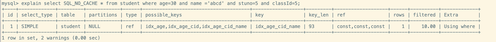

> 都有哪些维度可以进行数据库调优?大体上说:
>
> 1. 索引失效或没有充分利用到索引 – 建立/优化索引
> 2. 关联太多的 JOIN (设计缺陷或不得已的需求) - sql 优化
> 3. 服务器调优及各个参数的设置(缓冲、线程池等) - 调整 my.cnf
> 4. 数据过多 – 分库分表

关于数据库调优的策略比较散,不同的 DBMS 都不一样。但是大方向主要分为`物理查询优化`和`逻辑查询优化`两块:

1. 物理查询优化: 通过`索引`或者 `表连接方式`等技术来进行优化,重点就是索引的使用
2. 逻辑查询优化: 通过 sql`等价变化`来提升查询效率,也就是换种效率更高一点的 sql 查询

## 数据准备

**1.建表**

```sql
CREATE TABLE `class` (
		`id` INT(11) 	NOT NULL PRIMARY KEY AUTO_INCREMENT, 
  	`className` 	VARCHAR(30) DEFAULT NULL, 
  	`address` 		VARCHAR(40) DEFAULT NULL, 
  	`monitor` 		INT NULL 
) ENGINE=INNODB AUTO_INCREMENT=1

CREATE TABLE `student` (
    `id` 		INT(11) NOT NULL PRIMARY KEY AUTO_INCREMENT,
    `stuno` INT 		NOT NULL ,
    `name` 	VARCHAR(20) DEFAULT NULL,
    `age` 	INT(3) 		DEFAULT NULL,
    `classId` INT(11) DEFAULT NULL
) ENGINE=INNODB AUTO_INCREMENT=1
```

**2.创建函数**

```sql
-- 设置信任函数创建
set global log_bin_trust_function_creators=1;

# 随机产生字符串
CREATE FUNCTION rand_string(n INT) RETURNS VARCHAR(255)
BEGIN
	DECLARE chars_str VARCHAR(100) DEFAULT 		'abcdefghijklmnopqrstuvwxyzABCDEFJHIJKLMNOPQRSTUVWXYZ';
	DECLARE return_str VARCHAR(255) DEFAULT '';
  DECLARE i INT DEFAULT 0;
  WHILE i < n DO
    SET return_str =CONCAT(return_str,SUBSTRING(chars_str,FLOOR(1+RAND()*52),1)); 
    SET i = i + 1;
  END WHILE;
	RETURN return_str; 
END 

# 随机产生班级编号
CREATE FUNCTION rand_num (from_num INT ,to_num INT) RETURNS INT(11) 
BEGIN
  DECLARE i INT DEFAULT 0;
  SET i = FLOOR(from_num +RAND()*(to_num - from_num+1)) ;
  RETURN i;
END
```

**3.创建存储过程**

```sql
# 往stu表中插入数据的
CREATE PROCEDURE insert_stu( START INT , max_num INT ) 
BEGIN
	DECLARE i INT DEFAULT 0;
	SET autocommit = 0; #设置手动提交事务
    REPEAT #循环
      SET i=i+1; #赋值
      INSERT INTO student (stuno, name ,age ,classId ) VALUES
        ((START+i),
         rand_string(6),
         rand_num(1,50),
         rand_num(1,1000)); 
      UNTIL i = max_num
    END REPEAT;
	COMMIT; #提交事务
END

# 往class表添加随机数据
CREATE PROCEDURE `insert_class`( max_num INT )
BEGIN
	DECLARE i INT DEFAULT 0;
	SET autocommit = 0;
		REPEAT
      SET i = i + 1;
      INSERT INTO class ( classname,address,monitor ) VALUES
        (rand_string(8),
         rand_string(10),
         rand_num(1,100000)); 
      UNTIL i = max_num
		END REPEAT;
	COMMIT;
END
```

**4.调用存储过程**

```sql
 #执行存储过程，往class表添加1万条数据 
 CALL insert_class(10000);
 
 #执行存储过程，往stu表添加50万条数据
 CALL insert_stu(100000,500000);
```

## 索引匹配与失效

> MySQL 中**提高性能**的最有效的方式就是对数据库`设计合理的索引`,索引提供了高效的访问数据的方法,并且可以加快查询的速度,因此索引对查询的速度有很重要的影响
>
> - 使用索引可以`快速的定位`表中的记录,从而提高查询的速度和数据库的性能
> - 如果查询的时候没有使用索引,查询语句就会`扫描表中的所有记录`,在数据量大的时候,这样的查询效率会很低
>
> 大多数情况下(默认)都采用`B+Tree`来构建索引
>
> 实际上,用不用索引是由`优化器`决定的,优化器是基于`cost 开销`,而不是基于`规则`,也不是基于`语义`。所以说哪种开销小,优化器就使用哪种执行计划。另外,sql 语句是否使用索引,和**数据库版本、数据量、数据选择度**都有关系

### 1.全值匹配法则

- 概述
  - `where 条件字段按照顺序在索引中都可以匹配到`
  - 需要注意的是,理论上<code>索引对顺序是敏感的</code>,但是<mark>查询优化器会<strong>在不影响 SQL 执行结果的情况下,自动调整 where 子句的条件顺序以使用适合的索引</strong></mark>

:::info 示范使用非全值匹配与全值匹配的区别

**系统中经常使用下面的 sql**

```sql
-- 这里的 sql_no_cache 是放置从查询缓存中取数据,MySQL8.0 已经没 Query Cache 了
select SQL_NO_CACHE * from student where age=30;
select SQL_NO_CACHE * from student where age=30 and classId=4;
select SQL_NO_CACHE * from student where age=30 and classId=4 and name ='abcd';
```

<br/>

**1.首先看下没有创建索引前的执行速度**

可以看到查询速度在 0.11s 左右

```sql
mysql> select SQL_NO_CACHE * from student where age=30 and classId=4 and name ='abcd';
Empty set, 1 warning (0.11 sec)
```

<br/>

**2.我们分别看下创建 age、age+classId、age+classId、age+classId+name索引的执行速度**

我们可以看到,当 where 条件列都包含在联合索引(age+classId+name)中的时候,查询速度是最快的


<br/>

**3.我们也可以看到不同索引下的sql 执行分析**

在全值匹配的时候,我们可以看到:

- key_len = 93,使用了全部的索引列(因为数据库使用的是 `utf8mb4` 编码,占用 4 字节)
- row 最少,且 filtered 是最高的


<br/>

**4.我们在条件列中添加一个没有索引的字段隔断了索引列**

可以看到优化器还是用上了联合索引 *idx_age_cid_name*,是因为查询优化器会自动调整条件列的顺序以满足索引



:::

### 2.最左侧列匹配法则

- 在 MySQL 中建立**联合索引**时会遵守`最佳左前缀原则`
- **在检索数据时从联合索引的最左边开始匹配**,**如果左边的值未确定，那么无法使用此索引**
  - `如果条件列中没有联合索引列的第一个字段,那么不会使用联合索引`
  - `如果条件列中少了联合索引列的中间字段,那么只能使用联合索引列前面的字段`
- <mark><strong>注意:</strong></mark>MySQL 可以为多个字段建立联合索引,但对联合索引来说:<code>过滤条件使用索引必须按照索引建立时索引列的顺序依次满足,一旦某个索引列不满足,该索引列后面的索引列都无法被使用</code>

:::info 试验最左前缀

**首先定义一个联合索引 (age, classId, name),完整的索引列 key_len=93**

**1. 查询语句中只包含了索引列后面两个字段(classId,name)**

由于条件列中没有联合索引列的第一个字段,所以无法使用该联合索引


<br/>

**2.查询语句中包含了前面两个字段(age,classId)**

条件列中包含了联合索引列的第一、第二个字段,可以使用索引,但不是全值匹配,所以只能使用部分的联合索引(age+classId)


<br/>

**3.查询语句中不包含中间的字段(age,name)**

条件列中不包含联合索引列的中间字段,所以联合索引只能使用中间字段前面的部分索引列(age),我们通过 **key_len=5 **也可以很明显的看出来只用了一个 age(int null)的索引列


:::

### 3.主键插入顺序

> 对于一个使用`InnoDB`存储引擎的表来说,在我们没有显式的创建索引时,表中的数据实际上都是存储在`聚簇索引`的叶子节点的,而记录又是存储在数据页中的,数据页和记录又是按照记录`主键值从小到大`的顺序进行排序
>
> - 如果我们`插入`的记录的`主键值是依次增大的话`,那我们每次插满一个数据页就换到下一个数据页继续插
> - 如果我们插入的`主键值忽大忽小,没有顺序`,那么就比较麻烦,就可能的出现`页分裂`

比如我们一个数据页的叶子节点存储的记录已经满了,此时插入一个中间数据,那么就会出现**页分裂**(将当前页分裂为两个,然后把本页中的一些记录移动到新创建的这个页中),这样会发生`性能损耗`

如果想`尽量避免`这样无谓的性能损耗，最好让插入的记录的`主键值依次递增` ,让主键具有 `AUTO_INCREMENT` ，让存储引擎自己为表生成主键,而不是手动插入

### 4.索引列的计算、函数导致索引失效

> 因为函数作用于索引,存储引擎就无法默认的通过索引定位记录的位置了,可能函数计算的结果与默认索引定位的结果并不一致,那就只能扫描全表来确定了,简单来说就是不要干预利用索引查询的步骤

- `不要在索引列上做任何操作,包括计算，函数，自动或者手动类型转换,会导致索引失效而转向全表扫描`

:::info 操作索引列失效的试验

**首先对 name 创建一个索引,用于试验**

**1.没有对索引列name进行操作**

可以看到我们使用到了索引*idx_name*


<br/>

**2.对索引列name进行操作**

很明显,我们对 name 进行了计算之后,索引*idx_name* 失效了。优化器一看到索引列被操作了,那么就放弃使用索引


:::

### 5.类型转换(自动或手动)导致索引失效

- `索引类型与条件列的类型需要一致,类型不一致会导致索引失效`,因为这个相当于在索引列上作用了一个隐式的转换函数
- <mark>代码编写实体类的时候,需要注意属性类型与数据库字段类型一致!</mark>

:::info 自动类型转换的试验

**首先对 name 创建一个索引,用于试验**

**1.索引列 name 的隐式(自动)转换**

可以看到,并没有能使用索引*idx_name*。优化器根据语句推算出可能使用*idx_name*,但是后面发现类型不匹配,只能转而扫描全表


:::

### 6.范围条件右边的列索引失效

- **概述**
  - `范围列可以用到索引（必须是最左前缀），但是范围列后面的列无法用到索引`,所以**设计索引的时候一般将确定的列放在索引的最左侧**
    - <mark>实际开发中应该尽量将索引列中可能使用范围查询的列定义在最后面</mark>
- **说明**
  - 这里的范围包括`< 、 <= 、> 、 >= 、<>等`
  - 这的右侧指的是`定义联合索引时索引列的顺序`

:::info 范围查询后索引失效试验

**首先创建一个联合索引(age,name,classId),如果完全使用索引,那么 key_len=93**

**1.查询语句中第一个字段是等值,后面一个是范围查询** 

可以看到,ken_len=88,即只用了索引列**age和 name**。即使我们把 classId 与 name 的位置交换,也无法消除索引失效,因为定义的索引时字段列位置就是: age->name->classId


**2.查询语句中第一个字段是范围查询,后面的值等值** 

可以看到,最左侧的索引列age 使用了索引,后面都没有使用上


:::

### 7.不等于(!= 或者 < >)导致索引失效

> 索引需要的是确定的值,不等于就意味着所有的记录都可能是不等于条件值的,那么这种情况就需要扫描全表的来判定

- `在使用不等于的场景下，无法使用索引导致全表扫描`

:::info 不等于导致索引失效

**创建一个索引(name),查询语句中条件列时不等于**


:::

### 8.IS NULL 和 IS NOT NULL

> IS NULL 只需要记录值是 NULL,通过索引可以定位到哪些是 NULL。但是 IS NOT NULL 则需要全表扫描判断是否不等于 NULL

- `IS NULL 可以使用索引,IS NOT NULL 无法使用索引`
  - 和 NOT NULL类似的,`NOT LIKE、NOT IN...`也无法使用索引
- <mark>最好在设计数据的时候讲字段设置 NOT NULL 约束,比如 INT 类型的默认值是 0,字符串类型的默认值是空字符串</mark>

:::info IS NUll 和 IS NOT NUll区别

**创建一个索引(age), 查询语句分别带有 is null 和 is not null**

可以看到,查询带有is not null的话,索引失效了


:::

### 9.Like以通配符%开头索引

> 因为如果以%开头,那么所有记录都可能满足查询条件,所以引擎需要全表扫描。但如果以确定的开头,那么就只有确定的那些数据满足条件,即**可以通过索引确定这些满足条件的数据**

- 在使用模糊查询的时候,如果匹配字符串的时,`第一个字符是%`,那么索引不会起作用
- **[阿里开发规则]: 页面搜索进制做模糊或者全模糊,如果业务需要,请使用搜索引擎** 

:::info 模糊匹配索引失效示例

**首先创建一个索引(name)**

**1.查询语句中%在最左侧**

可以看到,当通配符%位于最左侧的时候,索引失效了


<br/>

**2.查询语句中%不在最左侧**

可以看到使用了索引


:::

### 10.OR 前后存在非索引的列

> 虽然有一个条件满足索引列,但是其他的没有对应的索引,就意味着需要扫描全面。既然要扫描全表了,那么满足索引列的那个索引就失去了意义(反正都要全表扫描咯,干嘛还要用索引呢?),**所以就不使用索引咯**

- `用 OR 分开的条件，如果 OR 前(后)的条件中的列有索引，而后(前)的列中没有索引，那么涉及的索引都不会被用到`
- <mark>如果 OR 前后都有索引的话,就会将两个索引都用上 </mark>, **当然由于是 OR,为了保证数据的准确性,那么需要将两个索引进行合并匹配查询**

:::info OR 前/后存在非索引列

**创建一个 age 的索引,查询语句中,OR 前有索引,后面没有索引**


:::

### 11.数据库和表的字符集统一使用utf8mb4

统一使用 utf8mb4 的兼容性很好,统一字符集可以避免字符集转换而产生的乱码,不同的`字符集`进行比较前需要进行`转换`导致索引失效(这个就是)

### 小结

> `总结`: **索引条件需要是确定的,正向的值(反向的话需要遍历看下是否不满足反向值),否则就需要全表扫描。联合索引前面的满足,后面的索引失效,根据最左侧列匹配原则,后面的索引无法使用,前面的可以使用。**
>
> `口诀`:
>
> 1. 全值匹配法则 + 最左侧列匹配法则 => 带头大哥不能死,中间兄弟不能断
>
> 2. 索引列的计算、函数 + 类型转换 + 统一字符集 => 索引列上少操作 + 索引类型要一致
>
> 3. 不等于(< >,!=) + IS NOT NULL + OR 前后存在非索引的列 => 不等空值还有 OR + 负向查询会失效
>
> 4. 范围查询右侧 + like以通配符%开头 => 范围之后全失效 + Like百分要靠右

:::tip 一般性建议

1. 对于单列索引,尽量选择针对当前 query 过滤性好的索引
2. 在选择联合索引的时候, 当前 query 中过滤性最好的字段最好放在索引列的最左侧
3. 在选择联合索引的时候, 索引列中尽可能包含当前 query 中 where 子句中的条件列
4. 在选择联合索引的时候, 如果某个字段可能出现范围查询的时候, 尽可能将这个字段放在索引列的最后

:::

## 关联查询优化

### 数据准备

```sql
# 分类
CREATE  TABLE `type` (
	id   INT(10) 	UNSIGNED PRIMARY KEY  AUTO_INCREMENT ,
	card  INT(10) 	UNSIGNED NOT NULL
)

# 图书
CREATE TABLE book (
	bookid  INT(10) UNSIGNED PRIMARY KEY  AUTO_INCREMENT ,
	card 	INT(10) UNSIGNED NOT NULL
)

INSERT INTO `type`(card) values( Floor( 1 + rand()*20 ) );
INSERT INTO `book`(card) values( Floor( 1 + rand()*20 ) );
```


### 采用外连接

