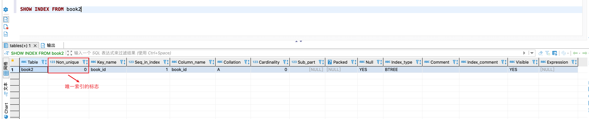

## 使用索引

### 索引的分类

MySQL的索引包括 **普通索引、唯一性索引、全文索引、单列索引、多列索引**等

1. 从 **功能逻辑**上划分

   - `普通索引`
     - 在创建索引时,不附加任何限制条件,只是用于提高查询效率,这类索引可以创建在`任何数据类型`中,**其值是否唯一和非空,要由字段本身的完整性约束条件决定**
     - 建立索引后可以通过索引进行查询
     
     - 比如在表 student 的字段 name 上建立一个普通索引,查询记录的时候就可以根据该索引进行查询
     
   - `唯一索引`
     - 使用`UNIQUE`参数可以设置索引为唯一索引,在创建唯一索引时,限制该索引的值必须是唯一的,但是允许有空值
     - 在一张表中`可以有多个唯一索引`
     - 比如在表 student 的字段 email 中创建唯一索引,那么字段 email 的值就必须是唯一的。
     
   - `主键索引`

     - 主键索引就是一种`特殊的唯一索引`,在唯一索引的基础上加上了**不为空**的约束,也就是 *NOT NULL + UNIQUE*
     - 在一张表中`最多只能有一个主键索引`

   - `全文索引` 
     - 是目前搜索引擎使用的关键技术,可以充分的利用`分词技术`等多种算法智能分析出文本文字中关键词的频率和重要性,然后按照一定的算法规则筛选出需要的搜索结果
       - 全文索引很适合大型数据集。对于小的数据集,用处较小
     - 使用参数`FULLTEXT` 可以设置为全文索引

2. 从**物理实现方式**上划分
   - `聚簇索引`
   - `非聚簇索引`
3. 从**作用字段个数**上划分
   - `单列索引`
     - **在表中的单个字段上创建索引,单列索引只根据该字段进行索引**
     - 单列索引可以是普通索引,也可以是唯一索引,还可以是全文索引,**只要保证该索引只对应一个字段即可**
     - 在一张表中`可以有多个单列索引`
   - `多列(组合、联合)索引`
     - 多列索引是表的`多个字段组合`上创建一个索引,该索引指向多个字段,**可以通过这几个字段进行查询**, `只有查询条件中使用了这些字段的第一个字段才会被使用`
     - 比如:表中的字段 id、name 和 gender 上建立一个 联合索引*idx_id_name_gender*, 那么只有查询条件中使用了字段 id 时,该索引才会被使用
     - 使用组合索引时组训`最左前缀集合`

### 查看索引

- **语法格式**

  ```sql
  SHOW INDEX FROM 表名
  ```

### 删除索引

- **ALTER TABLE的方式**

  ```sql
  -- 非主键索引
  ALTER TABLE 表名 DROP INDEX 索引名;
  
  -- 主键索引
  ALTER TABLE 表名 DROP PRIMARY KEY
  ```

- **DROP INDEX的方式**

  ```sql
  DROP INDEX 索引名 ON 表名;
  ```

:::tip 说明

1. 删除表中的列时,如果要删除的列为索引的组成部分,则该列也会从索引中删除。**如果组成 索引的所有列都被删除，则整个索引将被删除**

2. **添加了 AUTO_INCREMENT 约束字段的唯一索引不能被删除**

:::

### 创建索引

> MySQL 支持多种方法在单个或者多个列上建立索引:
>
> 1. **在创建表的 create table 中指定索引列**
> 2. **使用 alter table 语句在已经存在的表上建立索引**
> 3. **使用 create index 语句在已经存在的表上建立索引**

#### 创建表时

使用 Create Table 创建表时,除了可以指定列的数据类型,还可以定义主键约束、外键约束或者唯一约束,不论指定哪种约束,`定义约束时相当于给指定列上建立了一个索引`

**当然,也可以在创建表的时候,显式的建立索引,格式如下:**

```sql
CREATE TABLE 表名 (
  	字段列表,
  	[UNIQUE | FULLTEXT | SPATIAL] [INDEX | KEY] [indexName] (col_name [length] [ASC | DESC], ...) [INVISIBLE]
)
```

1. `[UNIQUE | FULLTEXT | SPATIAL]` 
   - **可选参数**
   - 分别表示主键索引、唯一索引、全文索引和空间索引
2. `INDEX | KEY`
   - 两者的作用相同，用来指定创建索引
3. `[indexName]`
   - 指定索引的名称，为可选参数。如果不指定，那么 MySQL 默认 col_name 为索引名
4. `col_name`
   - 为需要创建索引的字段列，该列必须从数据表中定义的多个列中选择
5. `[length]`
   - **可选参数**
   - 表示索引的长度，只有字符串类型的字段才能指定索引长度
6. `[ASC | DESC]`
   - **可选参数**
   - 指定升序或者降序的索引值存储
7. `[INVISIBLE]`
   - **可选参数**
   - MySQL 8.0中支持,设置索引为隐藏索引

##### 基于表约束

```sql
CREATE TABLE dept(
	dept_id INT PRIMARY KEY AUTO_INCREMENT,	 -- 主键约束 => 主键索引
	dept_name VARCHAR(20)
);

CREATE TABLE emp(
  	emp_id INT PRIMARY KEY AUTO_INCREMENT,   -- 主键约束 => 主键索引
  	emp_name VARCHAR(20) UNIQUE,  -- 唯一约束 => 唯一索引
  	dept_id INT,
  	CONSTRAINT emp_dept_id_fk FOREIGN KEY(dept_id) REFERENCES dept(dept_id) -- 外键约束 => 外键索引
);
```


##### 显式创建

**1.普通索引**

即 index 前未指定索引类型的可选参数

```sql
-- 在book表中的year_publication字段上建立普通索引
CREATE TABLE book (
  -- 字段信息
	book_id			INT,
  book_name		VARCHAR(100),
  authors 		VARCHAR(100),
  info				VARCHAR(100),
  comment			VARCHAR(100),
  year_publication YEAR,
  -- 索引信息
  INDEX(year_publication)
)
```

**2. 唯一索引**

即 index 前指定索引类型的可选参数 unique, **且唯一索引和唯一约束一样,索引中不允许有重复的记录,即不允许插入重复的数据**

```sql
-- 在book2表中的book_id字段上建立唯一索引
CREATE  TABLE book2 (
  -- 字段信息
	book_id			INT,
  book_name		VARCHAR(100),
  authors 		VARCHAR(100),
  info				VARCHAR(100),
  comment			VARCHAR(100),
  year_publication YEAR,
  -- 索引信息
  UNIQUE INDEX(book_id)
)
```




**3.主键索引**

- 和其他索引不同的是, **主键索引只能通过主键约束(Primary Key)去创建**
- **修改主键索引:** `必须先删除掉(drop)原索引，再新建(add)索引`

```sql
-- 在book3表中的book_id字段上建立主键索引
CREATE  TABLE book3 (
  -- 字段信息
	book_id			INT,
  book_name		VARCHAR(100),
  authors 		VARCHAR(100),
  info				VARCHAR(100),
  comment			VARCHAR(100),
  year_publication YEAR,
  -- 主键约束
  PRIMARY KEY(book_id)
)

-- 删除主键索引
ALTER TABLE book3 DROP PRIMARY KEY

-- 修改主键索引
-- 1.先删除
ALTER TABLE book3 DROP PRIMARY KEY
-- 2.再添加新的
ALTER TABLE book3 ADD PRIMARY KEY(comment)
```


**4.组合索引**

```sql
-- 在book3表中的 book_name, authors 字段上建立组合索引(唯一)
CREATE  TABLE book4 (
  -- 字段信息
	book_id			INT,
  book_name		VARCHAR(100),
  authors 		VARCHAR(100),
  info				VARCHAR(100),
  comment			VARCHAR(100),
  year_publication YEAR,
  -- 组合索引信息
   UNIQUE KEY book4_combine_key(book_name, authors)
)
```


#### 已有表

对于已经存在的表,需要创建、添加索引的,有下面两种方式:

1. 使用`ALTER TABLE ... ADD...` 创建索引

   ```sql
   -- 基本语法
   ALTER TABLE 表名 ADD 
   [UNIQUE | FULLTEXT | SPATIAL] [INDEX | KEY] [indexName] (col_name[length] [ASC | DESC] ,...) [INVISIBLE]
   ```

2. 使用`CREATE INDEX` 创建索引

   ```sql
   -- 基本语法,在MySQL中， CREATE INDEX被映射到一个ALTER TABLE语句上
   CREATE [UNIQUE | FULLTEXT | SPATIAL] [INDEX | KEY] [indexName] 
   ON 表名 (col_name[length] [ASC | DESC],...) [INVISIBLE]
   ```

:::info 示例

**1.先创建表**

```sql
CREATE  TABLE book5 (
	book_id			INT,
	book_name		VARCHAR(100),
	authors 		VARCHAR(100),
	info			VARCHAR(100),
	comment			VARCHAR(100),
	year_publication YEAR
)
```

**2.此时表中是没有索引的,使用 alter table 的方式新加一个索引**

```sql
ALTER TABLE book5 ADD UNIQUE INDEX idx_book_id (book_id)
```


**3.使用 create index 的方式再创建一个索引**

```sql
CREATE INDEX idx_name_author ON book5 (book_name,authors)
```


:::

## 索引新特性

MySQL 8.0 索引支持下面几个新特性:

1. **支持降序索引**
2. **支持隐藏索引**

### 降序索引(InnoDB)

> 降序索引是以**降序**的方式存储键值,MySQL8.0之前创建的是升序索引,使用时进行**反向扫描**,降低了数据库的效率。
>
> 在某些场景下,降序索引很有意义,比如某个查询就是需要对某个字段进行降序,索引一般都是升序的,**数据库就需要使用额外的文件排序操作**,而使用降序索引可以避免这个问题

我们在 MySQL5.7 和 MySQL8.0 中同样的创建一个降序索引:

```sql
CREATE TABLE ts1(
  a INT,
  b INT,
  index idx_a_b(a,b desc)
);
```

然后看下在 MySQL8.0 该表的索引信息,可以看到字段 b 的排序规则 collation的值为 **D**(desc)


再看下 MySQL5.7 下面的该表的索引信息,可以看到虽然为组合索引中字段 b 排序规则设置为 desc,但实际依然是 asc


我们写一段存储过程去生成测试数据:

```sql
CREATE PROCEDURE ts_insert() BEGIN
    DECLARE i INT DEFAULT 1;
    WHILE i < 800
    DO
insert into ts1 select rand()*80000,rand()*80000;
SET i = i + 1; END WHILE;
    commit;
END

-- 执行存储过程
call ts_insert
```

**MySQL5.7中查看执行计划**

可以看到计划扫描的数量(`rows`) 为 799,并且使用了`Using filesort`, 也就是文件排序。

**Using filesort 是一种速度比较慢的外部排序,可以通过优化索引来尽量避免出现Using filesort**


**MySQL8.0中查看执行计划**

可以看到计划扫描的数量(`rows`) 为 5,并且乜有出现 **using filesort**


:::caution 问题

**如果我们对所有的字段都进行降序查询呢?**

**MySQL5.7中查看执行计划**

可以看到计划扫描的数量(`rows`) 为 5,并且乜有出现 **using filesort**


**MySQL8.0中查看执行计划**

可以看到计划扫描的数量(`rows`) 为 799,并且使用了`Using filesort`


**我们可以看到,MySQL 5.7的执行计划要明显好于MySQL 8.0**

:::

### 隐藏索引

> 在 MySQL5.7 及之前的版本中,只能通过显式的方式删除索引。如果删除后需要重新创建的话就需要通过显式创建索引的方式将删除的索引创建回来,如果表数据很多,那么这个操作就会消耗系统过多的资源，操作成本非常高。
>
> 从 MySQL 8.x 开始支持`隐藏索引(invisible indexes)`。 **只需要将待删除的索引设置为隐藏索引，使查询优化器不再使用这个索引**,即使使用**force index**(强制使用索引)，优化器也不会使用该索引。确认将索引设置为隐藏索引后系统不受任何响应，就可以彻底删除索引。
>
> 这种`先将索引设置为隐藏索引,再删除索引的方式就是软删除`

#### 创建隐藏索引

1. **创建表时直接创建**

   ```sql
   CREATE TABLE tablename (
   	字段列表,
    	[UNIQUE | FULLTEXT | SPATIAL]  INDEX|KEY [index_name] (索引字段 [(length)] [ASC | DESC], ...) INVISIBLE
   )
   ```

2. **通过CREATE INDEX语句创建**

   ```sql
   CREATE [UNIQUE | FULLTEXT | SPATIAL] INDEX index_name ON tablename 
   (索引字段 [(length)] [ASC | DESC], ...) INVISIBLE
   ```

3. **通过ALTER TABLE语句创建**

   ```sql
   ALTER TABLE tablename ADD [UNIQUE | FULLTEXT | SPATIAL] INDEX index_name 
   (索引字段 [(length)] [ASC | DESC], ...) INVISIBLE
   ```

4. `切换索引可见状态`

   -  已存在的索引可通过如下语句切换可见状态:

   ```sql
   -- 切换成隐藏索引 
   ALTER TABLE tablename ALTER INDEX index_name INVISIBLE;
   -- 切换成非隐藏索引
    ALTER TABLE tablename ALTER INDEX index_name VISIBLE; 
   ```

:::caution 注意

当索引被隐藏时，它的内容仍然是和正常索引一样实时更新的。如果一个索引需要长期被隐藏，那么可以将其删除，因为索引的存在会影响插入、更新和删除的性能。

:::

#### 对优化器可见

> 我们可能会对某个索引进行测试,查看这个有这个索引与没有这个索引前后的性能,那么就可以利用这个特性,控制某个查询中开启隐藏索引对优化器可见或者不可见来进行测试

- **参数设置**
  - **`use_invisible_indexes`**
    - **查询优化器的参数, 可以控制隐藏索引对查询优化器是否可见**
    - 默认值为`off`
    - 如果设置为`on`, 即使隐藏索引不可见，优化器在生成执行计划时仍会考虑使用隐藏索引
  - `select @@optimizer_switch \G`
    - 查看查询优化器的开关设置
- **注意**
  - **主键以及具有非空唯一约束的字段,都不能被设置为隐藏索引**

**1. 首先查看查询优化器的开关参数设置**

默认 `use_invisible_indexes=off`

```sql
mysql> #查看查询优化器的开关设置
mysql> select @@optimizer_switch \G;
*************************** 1. row ***************************
@@optimizer_switch: index_merge=on,index_merge_union=on,index_merge_sort_union=on,index_merge_intersection=on,
engine_condition_pushdown=on,index_condition_pushdown=on,mrr=on,mrr_cost_based=on,
block_nested_loop=on,batched_key_access=off,materialization=on,semijoin=on,loosescan=on,
firstmatch=on,duplicateweedout=on,subquery_materialization_cost_based=on,use_index_extensions=on,
condition_fanout_filter=on,derived_merge=on,
# highlight-start
use_invisible_indexes=off,
# highlight-end
skip_scan=on,hash_join=on,
subquery_to_derived=off,prefer_ordering_index=on,hypergraph_optimizer=off,
derived_condition_pushdown=on
```

**2.设置session级别的查询中隐藏索引对查询优化器可见**

```sql
set session optimizer_switch="use_invisible_indexes=on";
```

**3.再次查看查询优化器的开关设置**

```sql
mysql> select @@optimizer_switch \G;
*************************** 1. row ***************************
@@optimizer_switch: index_merge=on,index_merge_union=on,index_merge_sort_union=on,index_merge_intersection=on,
engine_condition_pushdown=on,index_condition_pushdown=on,mrr=on,mrr_cost_based=on,
block_nested_loop=on,batched_key_access=off,materialization=on,semijoin=on,loosescan=on,
firstmatch=on,duplicateweedout=on,subquery_materialization_cost_based=on,
use_index_extensions=on,condition_fanout_filter=on,derived_merge=on,
# highlight-start
use_invisible_indexes=on,
# highlight-end
skip_scan=on,hash_join=on,subquery_to_derived=off,prefer_ordering_index=on,
hypergraph_optimizer=off,derived_condition_pushdown=on
1 row in set (0.00 sec)
```


## 设计原则

> 为了索引的使用效率更高,在创建索引的时候,必须考虑在哪些字段上创建索引、创建什么类型的索引等等,**索引设计不合理或者缺少索引都会影响数据库和系统的性能**

### 准备数据

**1.准备表**

```sql
-- 学生信息
CREATE TABLE student_info (
  id  INT(11) NOT NULL AUTO_INCREMENT, 
  student_id  INT 		NOT NULL ,
  name  VARCHAR(20) DEFAULT NULL, 
  course_id  INT 		NOT NULL ,
  class_id  INT(11) DEFAULT NULL,
  create_time  DATETIME DEFAULT CURRENT_TIMESTAMP ON UPDATE CURRENT_TIMESTAMP,
  PRIMARY KEY (id)
) ENGINE=INNODB AUTO_INCREMENT=1 DEFAULT CHARSET=utf8;

-- 课程表
CREATE TABLE course (
  id INT(11) NOT NULL AUTO_INCREMENT,
  course_id INT NOT NULL ,
  course_name VARCHAR(40) DEFAULT NULL,
  PRIMARY KEY (id)
) ENGINE=INNODB AUTO_INCREMENT=1 DEFAULT CHARSET=utf8;
```

**2. 创建函数用于生成数据**

```sql
 #该函数会随机返回一个字符串
CREATE FUNCTION rand_string(n INT)  RETURNS VARCHAR(255)
BEGIN
    DECLARE chars_str VARCHAR(100) DEFAULT 'abcdefghijklmnopqrstuvwxyzABCDEFJHIJKLMNOPQRSTUVWXYZ';
    DECLARE return_str VARCHAR(255) DEFAULT ''; 
 		DECLARE i INT DEFAULT 0;
      WHILE i < n DO
    			SET return_str =CONCAT(return_str,SUBSTRING(chars_str,FLOOR(1+RAND()*52),1));
    			SET i = i + 1;
    	END WHILE;
    RETURN return_str; 
END


# 随机数函数
CREATE FUNCTION rand_num (from_num INT ,to_num INT) RETURNS INT(11) 
BEGIN
	DECLARE i INT DEFAULT 0;
	SET i = FLOOR(from_num +RAND()*(to_num - from_num+1)) ;
	RETURN i;
END

```

**3.问题处理**

在创建函数的过程中报错:  `This function has none of DETERMINISTIC......`

- 问题说明:
  - 由于开启过慢查询日志 bin-log, 我们就必须为function指定一个参数。
  - 主从复制，主机会将写操作记录在bin-log日志中。从机读取bin-log日志，执行语句来同步数据。如果使用函数来操作数据，会导致从机和主键操作时间不一致。所以，**默认情况下，mysql不开启创建函数设置**

- 问题处理

  1. **查看mysql是否允许创建函数**

     ```sql
     show variables like 'log_bin_trust_function_creators';
     ```

  2. **命令开启:允许创建函数设置**

     ```sql
     -- 如果不加 global 就只对当前窗口会话有效
     set global log_bin_trust_function_creators=1;
     ```

  3. **mysqld 的参数配置**

     ```ini
     # /etc/my.cnf
     [mysqld]
     log_bin_trust_function_creators=1
     ```

  4. **创建并执行插入模拟数据的存储过程**

     ```sql
     # 存储过程1:插入课程表存储过程
     CREATE PROCEDURE insert_course( max_num INT ) 
     BEGIN
     	DECLARE i INT DEFAULT 0;
     	SET autocommit = 0; #设置手动提交事务
     	REPEAT #循环
         SET i=i+1; #赋值
         INSERT INTO course (course_id, course_name ) 
         VALUES  (rand_num(10000,10100),rand_string(6)); 
         UNTIL i = max_num
       END REPEAT;
       COMMIT; #提交事务
      END
     
     # 存储过程2: 插入学生信息表存储过程
     CREATE PROCEDURE insert_stu( max_num INT )
     BEGIN
     	DECLARE i INT DEFAULT 0;
     	SET autocommit = 0; #设置手动提交事务
     	REPEAT #循环
     		SET i=i+1; #赋值
     		INSERT INTO student_info (course_id, class_id ,student_id ,NAME ) 
     		VALUES (rand_num(10000,10100),rand_num(10000,10200),rand_num(1,200000),rand_string(6)); 
     		UNTIL i = max_num
     	END REPEAT;
     	COMMIT; #提交事务
     END 
     
     # 调用存储过程
     CALL insert_course(100)
     CALL insert_stu(1000000)
     ```

### 适合创建索引

下面集中情况是创建索引的合适条件:

1. **字段的数值具有唯一的限制**
2. **频繁作为 where 查询条件的字段**
3. **经常 Group By、Order By 的字段**
4. **Update、Delete 的 where 条件列**
5. **Distinct 字段需要创建索引**
6. **多表 Join 连接操作时，创建索引注意事项**
7. **使用列的类型小的创建索引**
8. **使用字符串前缀创建索引**
9. **区分度高(散列性高)的列适合作为索引**
10. **使用最频繁的列放到联合索引的左侧**
11. **在多个字段都要创建索引的情况下，联合索引优于单值索引**

#### 1. 字段数值唯一

**索引本身可以起到约束的作用**,比如唯一索引、主键索引都可以起到唯一约束的作用。那么我们在创建数据表的时候,**如果某个字段或者组合字段是唯一的,就可以**`直接创建唯一性索引或主键索引`。这样子,我们可以更快的通过该索引查询到指定的数据。

比如: 学生表中的学号是具有唯一性的字段, 所以可以为该字段建立唯一索引。

:::caution 注意

业务上具有唯一特性的字段，即使是组合字段，也必须建成唯一索引。(来源:Alibaba) 

不要以为唯一索引影响了 insert 速度，这个速度损耗可以忽略，但提高查找速度是明显的。

:::

#### 2.频繁作为 where条件

**某个字段在 Select 语句的 Where 条件中经常被使用,那么就需要给这个字段创建索引**,尤其在数据量大的情况下,即使创建普通索引也可以显著的提高查询的效率了。

:::info 测试

**我们在 student_id 没有索引的情况下进行查询** : 可以看到查询耗时 0.25s


<br/>

**为 student_id 加上索引,然后再查询**: 可以看到查询时间得到了极为明显的优化


:::

#### 3.频繁分组排序的列

**索引就是然数据按照某种顺序进行存储或者检索,因此当我们使用 group by 或者 order by 进行分组排序的时候, 就可以**`对分组、排序的字段进行索引`。如果分组排序的列有多个,`就用这些列建立组合索引`

:::info 测试

**我们根据 student_id 进行分组,查看每组的学生数量**

```sql
SELECT student_id,count(*) 
FROM student_info
GROUP BY student_id 
LIMIT 100
```


:::
