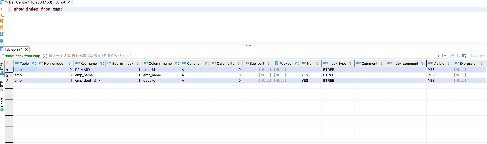
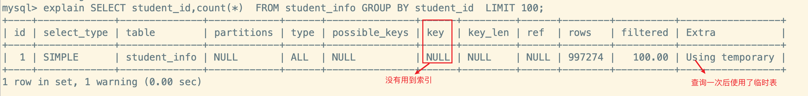
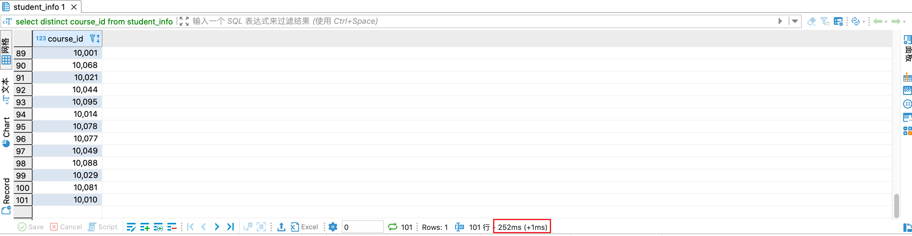

## 使用索引

### 索引的分类

MySQL的索引包括 **普通索引、唯一性索引、全文索引、单列索引、多列索引**等

1. 从 **功能逻辑**上划分

   - `普通索引`
     - 在创建索引时,不附加任何限制条件,只是用于提高查询效率,这类索引可以创建在`任何数据类型`中,**其值是否唯一和非空,要由字段本身的完整性约束条件决定**
     - 建立索引后可以通过索引进行查询
     
     - 比如在表 student 的字段 name 上建立一个普通索引,查询记录的时候就可以根据该索引进行查询
     
   - `唯一索引`
     - 使用`UNIQUE`参数可以设置索引为唯一索引,在创建唯一索引时,限制该索引的值必须是唯一的,但是允许有空值
     - 在一张表中`可以有多个唯一索引`
     - 比如在表 student 的字段 email 中创建唯一索引,那么字段 email 的值就必须是唯一的。
     
   - `主键索引`

     - 主键索引就是一种`特殊的唯一索引`,在唯一索引的基础上加上了**不为空**的约束,也就是 *NOT NULL + UNIQUE*
     - 在一张表中`最多只能有一个主键索引`

   - `全文索引` 
     - 是目前搜索引擎使用的关键技术,可以充分的利用`分词技术`等多种算法智能分析出文本文字中关键词的频率和重要性,然后按照一定的算法规则筛选出需要的搜索结果
       - 全文索引很适合大型数据集。对于小的数据集,用处较小
     - 使用参数`FULLTEXT` 可以设置为全文索引

2. 从**物理实现方式**上划分
   - `聚簇索引`
   - `非聚簇索引`
3. 从**作用字段个数**上划分
   - `单列索引`
     - **在表中的单个字段上创建索引,单列索引只根据该字段进行索引**
     - 单列索引可以是普通索引,也可以是唯一索引,还可以是全文索引,**只要保证该索引只对应一个字段即可**
     - 在一张表中`可以有多个单列索引`
   - `多列(组合、联合)索引`
     - 多列索引是表的`多个字段组合`上创建一个索引,该索引指向多个字段,**可以通过这几个字段进行查询**, `只有查询条件中使用了这些索引字段的第一个字段才会被使用`
       - 比如:表中的字段 id、name 和 gender 上建立一个 联合索引*idx_id_name_gender*, 那么只有**查询条件**中使用了字段 id 时,该索引才会被使用
     - 使用组合索引时遵循`最左前缀集合`

### 查看索引

- **语法格式**

  ```sql
  SHOW INDEX FROM 表名
  ```

### 删除索引

- **ALTER TABLE的方式**

  ```sql
  -- 非主键索引
  ALTER TABLE 表名 DROP INDEX 索引名;
  
  -- 主键索引
  ALTER TABLE 表名 DROP PRIMARY KEY
  ```

- **DROP INDEX的方式**

  ```sql
  DROP INDEX 索引名 ON 表名;
  ```

:::tip 说明

1. 删除表中的列时,如果要删除的列为索引的组成部分,则该列也会从索引中删除。**如果组成 索引的所有列都被删除，则整个索引将被删除**

2. **添加了 AUTO_INCREMENT 约束字段的唯一索引不能被删除**

:::

### 创建索引

> MySQL 支持多种方法在单个或者多个列上建立索引:
>
> 1. **在创建表的 create table 中指定索引列**
> 2. **使用 alter table 语句在已经存在的表上建立索引**
> 3. **使用 create index 语句在已经存在的表上建立索引**

#### 创建表时

使用 Create Table 创建表时,除了可以指定列的数据类型,还可以定义主键约束、外键约束或者唯一约束,不论指定哪种约束,`定义约束时相当于给指定列上建立了一个索引`

**当然,也可以在创建表的时候,显式的建立索引,格式如下:**

```sql
CREATE TABLE 表名 (
  	字段列表,
  	[UNIQUE | FULLTEXT | SPATIAL] [INDEX | KEY] [indexName] (col_name [length] [ASC | DESC], ...) [INVISIBLE]
)
```

1. `[UNIQUE | FULLTEXT | SPATIAL]` 
   - **可选参数**
   - 分别表示主键索引、唯一索引、全文索引和空间索引
2. `INDEX | KEY`
   - 两者的作用相同，用来指定创建索引
3. `[indexName]`
   - 指定索引的名称，为可选参数。如果不指定，那么 MySQL 默认 col_name 为索引名
4. `col_name`
   - 为需要创建索引的字段列，该列必须从数据表中定义的多个列中选择
5. `[length]`
   - **可选参数**
   - 表示索引的长度，只有字符串类型的字段才能指定索引长度(`前缀索引`)
6. `[ASC | DESC]`
   - **可选参数**
   - 指定升序或者降序的索引值存储
7. `[INVISIBLE]`
   - **可选参数**
   - MySQL 8.0中支持,设置索引为隐藏索引

##### 基于表约束

```sql
CREATE TABLE dept(
	dept_id INT PRIMARY KEY AUTO_INCREMENT,	 -- 主键约束 => 主键索引
	dept_name VARCHAR(20)
);

CREATE TABLE emp(
  	emp_id INT PRIMARY KEY AUTO_INCREMENT,   -- 主键约束 => 主键索引
  	emp_name VARCHAR(20) UNIQUE,  -- 唯一约束 => 唯一索引
  	dept_id INT,
  	CONSTRAINT emp_dept_id_fk FOREIGN KEY(dept_id) REFERENCES dept(dept_id) -- 外键约束 => 外键索引
);
```




##### 显式创建

**1.普通索引**

即 index 前未指定索引类型的可选参数

```sql
-- 在book表中的year_publication字段上建立普通索引
CREATE TABLE book (
  -- 字段信息
	book_id			INT,
  book_name		VARCHAR(100),
  authors 		VARCHAR(100),
  info				VARCHAR(100),
  comment			VARCHAR(100),
  year_publication YEAR,
  -- 索引信息
  INDEX(year_publication)
)
```

**2. 唯一索引**

即 index 前指定索引类型的可选参数 unique, **且唯一索引和唯一约束一样,索引中不允许有重复的记录,即不允许插入重复的数据**

```sql
-- 在book2表中的book_id字段上建立唯一索引
CREATE  TABLE book2 (
  -- 字段信息
	book_id			INT,
  book_name		VARCHAR(100),
  authors 		VARCHAR(100),
  info				VARCHAR(100),
  comment			VARCHAR(100),
  year_publication YEAR,
  -- 索引信息
  UNIQUE INDEX(book_id)
)
```


**3.主键索引**

- 和其他索引不同的是, **主键索引只能通过主键约束(Primary Key)去创建**
- **修改主键索引:** `必须先删除掉(drop)原索引，再新建(add)索引`

```sql
-- 在book3表中的book_id字段上建立主键索引
CREATE  TABLE book3 (
  -- 字段信息
	book_id			INT,
  book_name		VARCHAR(100),
  authors 		VARCHAR(100),
  info				VARCHAR(100),
  comment			VARCHAR(100),
  year_publication YEAR,
  -- 主键约束
  PRIMARY KEY(book_id)
)

-- 删除主键索引
ALTER TABLE book3 DROP PRIMARY KEY

-- 修改主键索引
-- 1.先删除
ALTER TABLE book3 DROP PRIMARY KEY
-- 2.再添加新的
ALTER TABLE book3 ADD PRIMARY KEY(comment)
```


**4.组合索引**

```sql
-- 在book3表中的 book_name, authors 字段上建立组合索引(唯一)
CREATE  TABLE book4 (
  -- 字段信息
	book_id			INT,
  book_name		VARCHAR(100),
  authors 		VARCHAR(100),
  info				VARCHAR(100),
  comment			VARCHAR(100),
  year_publication YEAR,
  -- 组合索引信息
   UNIQUE KEY book4_combine_key(book_name, authors)
)
```


#### 已有表

对于已经存在的表,需要创建、添加索引的,有下面两种方式:

1. 使用`ALTER TABLE ... ADD...` 创建索引

   ```sql
   -- 基本语法
   ALTER TABLE 表名 ADD 
   [UNIQUE | FULLTEXT | SPATIAL] [INDEX | KEY] [indexName] (col_name[length] [ASC | DESC] ,...) [INVISIBLE]
   ```

2. 使用`CREATE INDEX` 创建索引

   ```sql
   -- 基本语法,在MySQL中， CREATE INDEX被映射到一个ALTER TABLE语句上
   CREATE [UNIQUE | FULLTEXT | SPATIAL] [INDEX | KEY] [indexName] 
   ON 表名 (col_name[length] [ASC | DESC],...) [INVISIBLE]
   ```

:::info 示例

**1.先创建表**

```sql
CREATE  TABLE book5 (
	book_id			INT,
	book_name		VARCHAR(100),
	authors 		VARCHAR(100),
	info			VARCHAR(100),
	comment			VARCHAR(100),
	year_publication YEAR
)
```

**2.此时表中是没有索引的,使用 alter table 的方式新加一个索引**

```sql
ALTER TABLE book5 ADD UNIQUE INDEX idx_book_id (book_id)
```


**3.使用 create index 的方式再创建一个索引**

```sql
CREATE INDEX idx_name_author ON book5 (book_name,authors)
```


:::

## 索引新特性

MySQL 8.0 索引支持下面几个新特性:

1. **支持降序索引**
2. **支持隐藏索引**

### 降序索引(InnoDB)

> 降序索引是以**降序**的方式存储键值,MySQL8.0之前创建的是升序索引,使用时进行**反向扫描**,降低了数据库的效率。
>
> 在某些场景下,降序索引很有意义,比如某个查询就是需要对某个字段进行降序,索引一般都是升序的,**数据库就需要使用额外的文件排序操作**,而使用降序索引可以避免这个问题

我们在 MySQL5.7 和 MySQL8.0 中同样的创建一个降序索引:

```sql
CREATE TABLE ts1(
  a INT,
  b INT,
  index idx_a_b(a,b desc)
);
```

然后看下在 MySQL8.0 该表的索引信息,可以看到字段 b 的排序规则 collation的值为 **D**(desc)


再看下 MySQL5.7 下面的该表的索引信息,可以看到虽然为组合索引中字段 b 排序规则设置为 desc,但实际依然是 asc


我们写一段存储过程去生成测试数据:

```sql
CREATE PROCEDURE ts_insert() BEGIN
    DECLARE i INT DEFAULT 1;
    WHILE i < 800
    DO
insert into ts1 select rand()*80000,rand()*80000;
SET i = i + 1; END WHILE;
    commit;
END

-- 执行存储过程
call ts_insert
```

**MySQL5.7中查看执行计划**

可以看到计划扫描的数量(`rows`) 为 799,并且使用了`Using filesort`, 也就是文件排序。

**Using filesort 是一种速度比较慢的外部排序,可以通过优化索引来尽量避免出现Using filesort**


**MySQL8.0中查看执行计划**

可以看到计划扫描的数量(`rows`) 为 5,并且也没有出现 **using filesort**


:::caution 问题

**如果我们对所有的字段都进行降序查询呢?**

**MySQL5.7中查看执行计划**

可以看到计划扫描的数量(`rows`) 为 5,并且乜有出现 **using filesort**


**MySQL8.0中查看执行计划**

可以看到计划扫描的数量(`rows`) 为 799,并且使用了`Using filesort`


**我们可以看到,MySQL 5.7的执行计划要明显好于MySQL 8.0**

:::

### 隐藏索引

> 在 MySQL5.7 及之前的版本中,只能通过显式的方式删除索引。如果删除后需要重新创建的话就需要通过显式创建索引的方式将删除的索引创建回来,如果表数据很多,那么这个操作就会消耗系统过多的资源，操作成本非常高。
>
> 从 MySQL 8.x 开始支持`隐藏索引(invisible indexes)`。 **只需要将待删除的索引设置为隐藏索引，使查询优化器不再使用这个索引**,即使使用**force index**(强制使用索引)，优化器也不会使用该索引。确认将索引设置为隐藏索引后系统不受任何响应，就可以彻底删除索引。
>
> 这种`先将索引设置为隐藏索引,再删除索引的方式就是软删除`

#### 创建隐藏索引

1. **创建表时直接创建**

   ```sql
   CREATE TABLE tablename (
   	字段列表,
    	[UNIQUE | FULLTEXT | SPATIAL]  INDEX|KEY [index_name] (索引字段 [(length)] [ASC | DESC], ...) INVISIBLE
   )
   ```

2. **通过CREATE INDEX语句创建**

   ```sql
   CREATE [UNIQUE | FULLTEXT | SPATIAL] INDEX index_name ON tablename 
   (索引字段 [(length)] [ASC | DESC], ...) INVISIBLE
   ```

3. **通过ALTER TABLE语句创建**

   ```sql
   ALTER TABLE tablename ADD [UNIQUE | FULLTEXT | SPATIAL] INDEX index_name 
   (索引字段 [(length)] [ASC | DESC], ...) INVISIBLE
   ```

4. `切换索引可见状态`

   -  已存在的索引可通过如下语句切换可见状态:

   ```sql
   -- 切换成隐藏索引 
   ALTER TABLE tablename ALTER INDEX index_name INVISIBLE;
   -- 切换成非隐藏索引
    ALTER TABLE tablename ALTER INDEX index_name VISIBLE; 
   ```

:::caution 注意

当索引被隐藏时，它的内容仍然是和正常索引一样实时更新的。如果一个索引需要长期被隐藏，那么可以将其删除，因为索引的存在会影响插入、更新和删除的性能。

:::

#### 对优化器可见

> 我们可能会对某个索引进行测试,查看这个有这个索引与没有这个索引前后的性能,那么就可以利用这个特性,控制某个查询中开启隐藏索引对优化器可见或者不可见来进行测试

- **参数设置**
  - **`use_invisible_indexes`**
    - **查询优化器的参数, 可以控制隐藏索引对查询优化器是否可见**
    - 默认值为`off`
    - 如果设置为`on`, 即使隐藏索引不可见，优化器在生成执行计划时仍会考虑使用隐藏索引
  - `select @@optimizer_switch \G`
    - 查看查询优化器的开关设置
- **注意**
  - **主键以及具有非空唯一约束的字段,都不能被设置为隐藏索引**

**1. 首先查看查询优化器的开关参数设置**

默认 `use_invisible_indexes=off`

```sql
mysql> #查看查询优化器的开关设置
mysql> select @@optimizer_switch \G;
*************************** 1. row ***************************
@@optimizer_switch: index_merge=on,index_merge_union=on,index_merge_sort_union=on,index_merge_intersection=on,
engine_condition_pushdown=on,index_condition_pushdown=on,mrr=on,mrr_cost_based=on,
block_nested_loop=on,batched_key_access=off,materialization=on,semijoin=on,loosescan=on,
firstmatch=on,duplicateweedout=on,subquery_materialization_cost_based=on,use_index_extensions=on,
condition_fanout_filter=on,derived_merge=on,
# highlight-start
use_invisible_indexes=off,
# highlight-end
skip_scan=on,hash_join=on,
subquery_to_derived=off,prefer_ordering_index=on,hypergraph_optimizer=off,
derived_condition_pushdown=on
```

**2.设置session级别的查询中隐藏索引对查询优化器可见**

```sql
set session optimizer_switch="use_invisible_indexes=on";
```

**3.再次查看查询优化器的开关设置**

```sql
mysql> select @@optimizer_switch \G;
*************************** 1. row ***************************
@@optimizer_switch: index_merge=on,index_merge_union=on,index_merge_sort_union=on,index_merge_intersection=on,
engine_condition_pushdown=on,index_condition_pushdown=on,mrr=on,mrr_cost_based=on,
block_nested_loop=on,batched_key_access=off,materialization=on,semijoin=on,loosescan=on,
firstmatch=on,duplicateweedout=on,subquery_materialization_cost_based=on,
use_index_extensions=on,condition_fanout_filter=on,derived_merge=on,
# highlight-start
use_invisible_indexes=on,
# highlight-end
skip_scan=on,hash_join=on,subquery_to_derived=off,prefer_ordering_index=on,
hypergraph_optimizer=off,derived_condition_pushdown=on
1 row in set (0.00 sec)
```


## 设计原则

> 为了索引的使用效率更高,在创建索引的时候,必须考虑在哪些字段上创建索引、创建什么类型的索引等等,**索引设计不合理或者缺少索引都会影响数据库和系统的性能**

### 准备数据

**1.准备表**

```sql
-- 学生信息
CREATE TABLE student_info (
  id  INT(11) NOT NULL AUTO_INCREMENT, 
  student_id  INT 		NOT NULL ,
  name  VARCHAR(20) DEFAULT NULL, 
  course_id  INT 		NOT NULL ,
  class_id  INT(11) DEFAULT NULL,
  create_time  DATETIME DEFAULT CURRENT_TIMESTAMP ON UPDATE CURRENT_TIMESTAMP,
  PRIMARY KEY (id)
) ENGINE=INNODB AUTO_INCREMENT=1 DEFAULT CHARSET=utf8;

-- 课程表
CREATE TABLE course (
  id INT(11) NOT NULL AUTO_INCREMENT,
  course_id INT NOT NULL ,
  course_name VARCHAR(40) DEFAULT NULL,
  PRIMARY KEY (id)
) ENGINE=INNODB AUTO_INCREMENT=1 DEFAULT CHARSET=utf8;
```

**2. 创建函数用于生成数据**

```sql
 #该函数会随机返回一个字符串
CREATE FUNCTION rand_string(n INT)  RETURNS VARCHAR(255)
BEGIN
    DECLARE chars_str VARCHAR(100) DEFAULT 'abcdefghijklmnopqrstuvwxyzABCDEFJHIJKLMNOPQRSTUVWXYZ';
    DECLARE return_str VARCHAR(255) DEFAULT ''; 
 		DECLARE i INT DEFAULT 0;
      WHILE i < n DO
    			SET return_str =CONCAT(return_str,SUBSTRING(chars_str,FLOOR(1+RAND()*52),1));
    			SET i = i + 1;
    	END WHILE;
    RETURN return_str; 
END


# 随机数函数
CREATE FUNCTION rand_num (from_num INT ,to_num INT) RETURNS INT(11) 
BEGIN
	DECLARE i INT DEFAULT 0;
	SET i = FLOOR(from_num +RAND()*(to_num - from_num+1)) ;
	RETURN i;
END

```

**3.问题处理**

在创建函数的过程中报错:  `This function has none of DETERMINISTIC......`

- 问题说明:
  - 由于开启过慢查询日志 bin-log, 我们就必须为function指定一个参数。
  - 主从复制，主机会将写操作记录在bin-log日志中。从机读取bin-log日志，执行语句来同步数据。如果使用函数来操作数据，会导致从机和主键操作时间不一致。所以，**默认情况下，mysql不开启创建函数设置**

- 问题处理

  1. **查看mysql是否允许创建函数**

     ```sql
     show variables like 'log_bin_trust_function_creators';
     ```

  2. **命令开启:允许创建函数设置**

     ```sql
     -- 如果不加 global 就只对当前窗口会话有效
     set global log_bin_trust_function_creators=1;
     ```

  3. **mysqld 的参数配置**

     ```ini
     # /etc/my.cnf
     [mysqld]
     log_bin_trust_function_creators=1
     ```

  4. **创建并执行插入模拟数据的存储过程**

     ```sql
     # 存储过程1:插入课程表存储过程
     CREATE PROCEDURE insert_course( max_num INT ) 
     BEGIN
     	DECLARE i INT DEFAULT 0;
     	SET autocommit = 0; #设置手动提交事务
     	REPEAT #循环
         SET i=i+1; #赋值
         INSERT INTO course (course_id, course_name ) 
         VALUES  (rand_num(10000,10100),rand_string(6)); 
         UNTIL i = max_num
       END REPEAT;
       COMMIT; #提交事务
      END
     
     # 存储过程2: 插入学生信息表存储过程
     CREATE PROCEDURE insert_stu( max_num INT )
     BEGIN
     	DECLARE i INT DEFAULT 0;
     	SET autocommit = 0; #设置手动提交事务
     	REPEAT #循环
     		SET i=i+1; #赋值
     		INSERT INTO student_info (course_id, class_id ,student_id ,NAME ) 
     		VALUES (rand_num(10000,10100),rand_num(10000,10200),rand_num(1,200000),rand_string(6)); 
     		UNTIL i = max_num
     	END REPEAT;
     	COMMIT; #提交事务
     END 
     
     # 调用存储过程
     CALL insert_course(100)
     CALL insert_stu(1000000)
     ```

### 适合创建索引

下面集中情况是创建索引的合适条件:

1. **字段的数值具有唯一的限制**
2. **频繁作为 where 查询条件的字段**
3. **经常 Group By、Order By 的字段**
4. **Update、Delete 的 where 条件列**
5. **Distinct 字段需要创建索引**
6. **多表 Join 连接操作时，创建索引注意事项**
7. **使用列的类型小的创建索引**
8. **使用字符串前缀创建索引**
9. **区分度高(散列性高)的列适合作为索引**
10. **使用最频繁的列放到联合索引的左侧**
11. **在多个字段都要创建索引的情况下，联合索引优于单值索引**

#### 1.字段数值唯一

**索引本身可以起到约束的作用**,比如唯一索引、主键索引都可以起到唯一约束的作用。那么我们在创建数据表的时候,**如果某个字段或者组合字段是唯一的,就可以**`直接创建唯一性索引或主键索引`。这样子,我们可以更快的通过该索引查询到指定的数据。

比如: 学生表中的学号是具有唯一性的字段, 所以可以为该字段建立唯一索引。

:::caution 注意

业务上具有唯一特性的字段，即使是组合字段，也必须建成唯一索引。(来源:Alibaba) 

不要以为唯一索引影响了 insert 速度，相对于查找速度来说,这个速度损耗可以忽略的。

:::

#### 2.频繁作为WHERE条件

**某个字段在 Select 语句的 Where 条件中经常被使用,那么就需要给这个字段创建索引**,尤其在数据量大的情况下,即使创建普通索引也可以显著的提高查询的效率了。

:::info 测试

**我们在 student_id 没有索引的情况下进行查询** : 可以看到查询耗时 0.25s


<br/>

**为 student_id 加上索引,然后再查询**: 可以看到查询时间得到了极为明显的优化


:::

#### 3.频繁分组排序的列

**索引就是然数据按照某种顺序进行存储或者检索,因此当我们使用 group by 或者 order by 进行分组排序的时候, 就可以**`对分组、排序的字段进行索引`。如果分组排序的列有多个,`就用这些列建立组合索引`

**说明:** <mark>表中有多个索引的时候,当多个查询条件中使用了某个索引之后,一般就不使用其他索引了,并且注意 sql 执行顺序与索引字段顺序</mark>


:::info 测试

**我们根据 student_id 进行分组,查看每组的学生数量**

```sql
SELECT student_id,count(*) 
FROM student_info
GROUP BY student_id 
LIMIT 100
```

可以看到耗时在 0.7s 左右,并且我们通过 explain 分析看到





我们为需要 Group By 的字段*student_id* 建立索引信息,然后 explain 可以看到使用了索引


同时查询的耗时也从 750ms 降到了 10ms


**如果同时使用 Group By 和 Order By呢?** 这里我们对 student_id 进行分组,按 create_time 进行排序

**方案一: 分别对 student_id 和 create_time 建立索引**

```sql
create index idx_sid on student_info (student_id);
create index idx_ctime on student_info (create_time);
```

使用 explain 分析可以看到只使用了 studen_id 的相关索引


**方案二: 对 student_id 和 create_time 建立联合索引**

```sql
create index idx_sid_ctime on student_info (student_id, create_time);
```

可以看到使用了联合索引(student_id, create_time), 并且耗时在 0.2s, **即这种的建立索引方式的性能更好**


:::

#### 4.UPDATE、DELETE 的 WHERE 条件列

实际上,**当我们对某条数据进行 UPDATE、DELETE操作的时候,也可以为 WHERE 条件列建立索引 **。因为删除也需要找到指定的数据,使用索引可以更快的定位到需要更新、删除的数据。

当数据按照某个条件需要某个条件进行查询之后,再进行 UPDATE、DELETE 的操作, 如果对 WHERE 字段创建了索引,就可以大幅度的提高效率,因为本质上就是根据带索引的 WHERE 条件列进行检索,检索出来之后再进行删除。

**如果是进行更新操作,且更新的字段是非索引字段,那么效率的提升会更加的明显,**`因为非索引字段的更新不会触发索引的维护。`

#### 5.DISTINCT 字段

有时候我们需要使用 distinct 对某个字段进行去重,对这个字段建立索引,也可以提升查询效率。`因为索引是排序后的数据,而排序会提升去重的效率,可能不需要完整的线性迭代`

::: info 测试

**测试 case: 查询 student_info 表中不同的 course_id 有哪些?**

**1. 正常没有为 course_id 建立索引**

我们看到查询需要 265ms



**2. 为 course_id 建立索引之后**

查询速度从 265ms 降低到了 14ms


:::


#### 6.多表JOIN

多表连接操作时,创建索引的话有以下的注意点:

1. `连接表的数量尽量不要超过 3 张`
   - **因为每增加一张表就相当于增加一层嵌套的循环,数量级增长的很快**
2. `对 WHERE 条件建立索引`
   - 因为 WHERE 条件才是对数据条件的过滤,如果在数据量极大的情况下,没有WHERE 条件是很可怕的
3. `对用于连接的字段建立索引,并且该字段在多张表之间的类型必须一致`
   - **数据类型一致是为了避免出现类型的隐式转换**

#### 7.列类型小的建索引

> 这里说明的`类型大小` 指的是该类型表的数据范围的大小

我们在定义表结构的时候需要显式的指定列的类型,以整数类型为例,有TINYINT、MEDIUMINT、INT、BIGINT 等,它们占用的存储空间依次递增,能表示的整数范围也是依次递增。**如果我们想要对某个整数列建立索引的话,尽量让索引列选择使用较小的类型列**,比如我们能使用 *INT* 就不要使用*BIGINT*,因为:

1. 数据类型越小,在查询的时候进行的比较操作就越快
2. 数据类型越小,索引所占据的存储空间就越小,一个数据页中可以`存放更多的记录`,从而减少磁盘 IO 的次数

对于这个`一般适用于表的主键`, 因为不仅是聚簇索引中会存储主键值,在非聚簇索引中也会存储主键值,如果主键能选择适当的数据类型,可以节省更多的存储空间

#### 8.使用字符串前缀创建索引

假设我们的字符串很长,那么存储一个字符串就需要占用很大的空间。我们为这个字符串列建立索引意味着:

1. B+Tree 索引中的记录需要将该列的完整字符串记录下来,那么索引就会占用很大的存储空间
2. 如果字符串很长,那么在字符串比较的时候会占用更多的时间

**我们可以截取字段前面的一部分内容建立索引,这个就是**`前缀索引`。这样在查询记录时虽然无法精确的定位到记录的位置,但是能定位到索引前缀的位置,再通过主键值进行回表操作拿到完整字符串的位置

```sql
-- 示例
create index idx_address on shop(address(12))
```

问题是,我们应该如何界定这个索引长度呢? <mark>如果索引长度太短,那么重复的内容就会很多,区分度就会很低;如果索引长度很长,虽然区分度搞了,但又会占用很多的存储空间</mark>。我们有下面的公式:

1. 字段在全部数据中的区分度,越接近于 1 区分度就越高

   ```sql
   -- 非重复的字段数 / 字段总数
   select count(discint 字段名) / count(*) from 表名
   ```

2. 通过不同字段长度查看区分度

   ```sql
   -- 截断指定长度后非重复的字段数 / 字段总数
   select count(discint left(字段名,长度)) / count(*) from 表名
   ```


另外需要注意的是, 如果这个字段`使用前缀索引且需要排序`的话,就可能会出现一个问题: 前缀索引的值是一样的,那么就无法利用`索引排序`,需要使用`文件排序`,这种的速度较慢

:::caution 阿里开发规约

[**强制**] : 在 varchar 字段上建立索引,必须指定索引的长度,没必要对全字段建立索引,根据实际的文本区分度决定索引长度

说明: 索引的长度与区分度是不可兼得的,一般字符串类型的数据,长度为 20 的索引,区分度可以高达 **90%** 以上

:::

#### 9.区分度高的列建索引

> `列的基数` 指的是某一列中不重复数据的个数

比如某个列包含的值有 [2,5,8,2,5,8,2,5,8],虽然有 9 个数据,但是该列的基数却只有 3。也就是说**<mark>在记录行数一定的情况下,列的基数越大,该列中的值越分散;列的基数越小,该列中的值越集中</mark>**。

列的基数的这个指标很重用,会影响到我们是否能高效的利用好索引,**最好为列的基数大的列作为索引**。

当然,可以使用公式`select count(distinct 字段) / count(*) from table` 去计算区分度,越接近于 1 越好,但`一般超过 33%` 就是比较高效的索引了

#### 10.高频列放在组合索引左侧

可以为使用很频繁的列建立一个联合索引,并且按频繁度从`从左到右`排列(依据`最左前缀法则`),这样可以建立较少的索引。

#### 11.多字段索引,联合优于单值

因为查询的时候,当满足并使用了某个索引后,一般就不会使用其他索引,那么联合索引可以保证锁哥字段使用索引,查询效率会更好,并且在更新的时候,只需要维护一个索引就行。要求就是:**查询条件的字段中必须含有索引列中的第一个字段**

### 限制索引数量

虽然索引很好使,但是我们也需要明白索引也是有成本的(空间成本、维护成本等),所以我们需要注意平衡,即**索引的数量不是越多越好好,我们需要限制单表上的索引数量**,建议单表索引树不超过`6` 个,原因:

1. 每个索引都需要占用**磁盘空间**,索引越多,需要的磁盘空间就越多
2. 索引会影响**INSERT、DELETE、UPDATE** 语句的性能,因为表中数据修改后,索引也需要进行调整和更新,属于额外的维护成本
3. **优化器在选择如何优化查询的时候,会根据已有的信息,对每个可以用到索引的索引进行评估,以生成一个最好的执行计划**,如果有很多的索引,那么优化器就需要花更多的时间去生成执行计划
   - 通过 explain 我们可以看到有一个`possible_keys`,这个是查询可能使用的索引,后面的`key` 就是优化器选择使用的索引

### 不适合建索引

下面集中情况不适合建立索引:

1. **where中使用不到的字段**
2. **数据量小的表最好不要使用索引**
3. **有大量重复数据的列上不要建立索引**
4. **避免对经常更新的表创建过多的索引**
5. **不建议用无序的值作为索引**
6. **删除不再使用或者很少使用的索引**
7. **不要定义冗余或重复的索引**

#### 1.where中使用不到的字段

WHERE 条件(也包括 GROUP BY、ORDER BY)里用不到的字段不需要建立索引,因为索引的意义就是快速定位,如果起不到快速定位的字段通常是不需要建立索引的,比如:

```sql
-- 比如这里使用 student_id作为检索,可以为其加上索引
-- 但是其他 course_id,student_id,create_time 字段则不需要建立索引
-- 因为这些字段仅仅出现在 Select 中
SELECT course_id,student_id,create_time
FROM student_info
WHERE student_id=1231
```


#### 2.数据量小的表

如果表的记录太少,比如说小于 1000 个,那么是不需要建立索引的。表的记录太少,是否创建索引**对查询效率的影响并大**,甚至可能比索引还要快(比如非聚簇索引还需要回表)

#### 3.有大量重复数据

<mark>与区分度高的列适合建索引相对的,如果某列字段的有大量的重复数据,那么就不适合创建索引</mark>

比如在学生表的**性别**字段上只有“男”和“女”两个不同的值,所以不需要建立索引,建立索引反而会**严重降低数据更新速度**

**举例**: 要在 100 万条数据中查找其中的 50 万行(比如性别为男的数据),一旦建立索引就需要访问 50 万次索引,而且由于性别是非聚簇索引,所以每次索引都需要一次回表,也就是需要 50 万次回表操作,这种开销可能比不使用索引还高。

#### 4.经常更新的表

> 对于经常更新的表,我们不应该创建过多的索引

有两层的含义:

1. `频繁更新的字段不一定要创建索引`
   - 因为更新数据的时候,也需要更新索引。如果索引太多,维护索引的成本也很高
2. `避免对经常更新的表创建过多的索引, 并且索引中的尽可能的少`
   - 经常更新表,意味着需要频繁的更新索引信息,就会降低表的更新速度

#### 5.不用无序的值作为索引

索引中的用户记录是经过排序的,如果记录是无序的(比如 UUID、身份证、MD5、Hash、无序长字符串…),那么就意味着可能会造成`页分裂`

#### 6. 删除不再使用或者很少使用的索引

索引是需要维护成本的,如果一个索引很少或者不被使用,那么这些索引应该被清除掉,从而减少索引对更新操作的影响,并且可以释放磁盘空间。

#### 7.不定义冗余或重复索引

> 冗余的索引可能会导致无法利用到其他组合索引,导致效率降低

**1.冗余索引**

有时会对同一个列建立多个索引,比如 **index(a,b,c) 相当于 index(a)、index(b)、index(c)**

```sql
/*
	比如这里的 idx_name_birth_phone 索引就可以对 name 列进行快速检索,
	后面的idx_name就是一个冗余索引
*/
CREATE TABLE person_info(
  id INT UNSIGNED NOT NULL PRIMARY KEY  AUTO_INCREMENT ,
  name VARCHAR(100) NOT NULL,
  birthday DATE NOT NULL,
  phone_number CHAR(11) NOT NULL,
  country varchar(100) NOT NULL,
  KEY idx_name_birth_phone (name(10), birthday, phone_number), 
	KEY idx_name (name(10))
);
```


**2.重复索引**

```sql
/*
	我们已经为 col1定义了主键约束,就会有主键索引(唯一的),
	后面又分别创建了 uk_idx_c1 和 idx_c1,就属于是重复的索引
*/
CREATE TABLE repeat_index_demo ( 
  col1 INT PRIMARY KEY,
	col2 INT,
	UNIQUE uk_idx_c1 (col1), 
  INDEX idx_c1 (col1)
);
```

