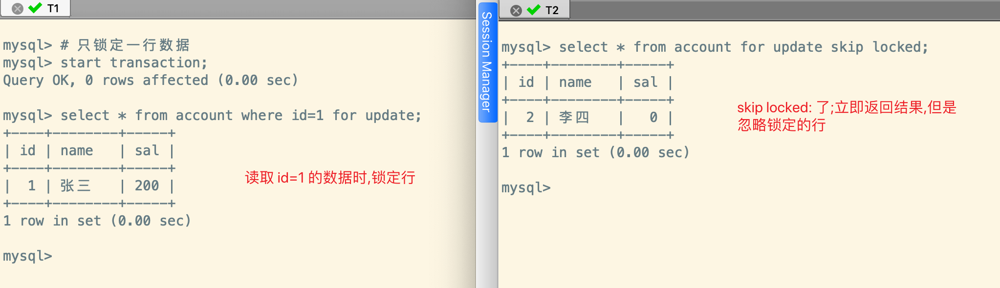

> 事务的隔离性由`锁`来实现

## 概述

在数据库中,除传统的计算资源(如CPU、RAM、I/O等)的争用以外,`数据也是一种供许多用户共享的资源`。**为保证数据的一致性，需要对并发操作进行控制**, 因此产生了`锁`了, 同时`锁机制` 也为实现 MySQL 的各个隔离级别提供了保证。 

`锁冲突` 也是影响数据库`并发访问性能`的一个重要因素。所以锁对数据库而言显得尤其重要、复杂

## 并发事务访问相同记录

**MySQL 中,并发事务访问相同记录的情况大致可以划分为3种:**

1. `读-读`

2. `写-写`

3. `读-写、写-读`

### 读-读
- `并发事务相继读取相同的记录`
- 读取操作本身不会对记录有任何影响，并不会引起什么问题，所以允许这种情况的发生。

### 写-写

`并发事务相继对相同的记录做出改动`, 在这种情况下会发生`脏写` 的问题,任何一种隔离级别都不允许这种问题的发生。所以在**多个未提交事务相继对一条记录做改动时,需要让它们 `排队执行`** ，这个**排队**的过程其实是通过 `锁` 来实现的


锁其实是一个`内存中的结构`, 在事务执行前本来是没有锁的, 也就是说**一开始是没有锁结构 和记录进行关联的**, 如图所示:


<br/>

**当一个事务想对这条记录做改动时,首先会看看内存中有没有与这条记录关联的 `锁结构` **, 当没有的时候就会在内存中**生成一个锁结构 与之关联**。比如，事务 T1 要对这条记录做改动, 就需要生成一个锁结构与之关联

1. `trx信息` : 表示锁结构和哪个事务关联
2. `is_waiting` ： 表示当前事务是否在等待

当事务 T1 改动这条记录的时候,就会生成一个锁结构与该记录进行关联。由于之前没有别的事务为这个记录加锁,所以 `is_waiting = false` ,我们把这个称之为`获取锁成功 (加锁成功)`,然后就可以继续操作了


<br/>

在事务 T1 提交之前,另外一个事务 T2 也想对该记录进行改动, 那么 T2 先去看有没有锁结构与这条记录关联。发现 T1 已经加锁了,那么 T2 此时`也会生成一个锁结构与该记录关联`, 和 T1 不同的是,这个锁结构的 `is_waiting = true`, **表示需要等待**。我们称之为`获取锁失败(加锁失败)`


<br/>

事务 T1 提交之后,会`释放它生成的锁结构`, 然后查看这个记录是否还有其他锁结构与之关联。结果发现 T2 还在等待获取锁,所以就把事务 T2 锁结构的 is_waiting 修改为 true, 然后将事务 T2 对应的线程唤醒,那么 T2 此时就可以获取到锁了


:::tip 小结一下

1. `获取锁成功(加锁成功)`
   - 在内存中生成了对应的锁结构,而且锁结构的 `is_wating = false`, 也就是**事务可以继续执行**
   - 当然不是所有的加锁都会生成对应的锁结构, 有时候会有`加隐式锁`的情况,它不会生成对应的锁结构, 但是仍可以起到保护记录的作用
2. `获取锁失败(加锁失败)`
   - 在内存中生成了锁结构, 但是锁结构的 `is_waiting = true`,也就是**事务需要等待,不可以继续执行**
3. `不加锁`
   - 不需要在内存中生成对应的锁结构,可以直接执行操作,**不包括隐式锁的情况**

:::

### 读-写

**一个事务进行读操作, 另外的事务进行写操作**, 这个时候会出现脏读、不可重复读、幻读的现象。不同数据库厂商对 SQL 标准的支持并不同, 比如 MySQL 的默认隔离级别是`Repeatable Read`

### 并发问题解决

怎么解决 脏读 、 不可重复读 、 幻读 这些问题呢?其实有两种可选的解决方案:

1. 读操作利用 `多版本并发控制 (MVCC)`, 写操作进行 `加锁` 

   - MVCC 就是生成一个 `ReadView`(可以简单的理解为是一个**历史快照**),  通过 ReadView 找到符合条件的记录版本(历史版本由 undo 日志构建)
   - 查询语句只能`读`到在生成 ReadView 之前`已提交事务所做的更改`, 在生成 ReadView 之前**未提交的事务或者之后开启的事务所做的更改是看不到的**
   - `写操作` 肯定针对的是`最新版本的记录`, 读记录的历史版本和最新版本不冲突,所以 采用 MVCC 时, **读写操作不冲突**

   :::info 说明

   普通的查询语句在 `READ COMMITTED` 和 `REPEATABLE READ` 隔离级别下会**使用 MVCC 读取记录**

   - 在 *read committed* 隔离级别下, 一个**事务在执行过程中**每次执行 *select* 操作时都会生成*Read View*, Read View 本身就保证了`事务不可以读取到未提交的事务所做的更改`, 也就是避免得了脏读的问题
   
   - 在 *repeatable read* 隔离级别下,一个**事务在执行过程中**只有`第一次执行 select` 才会生成一个 ReadView, 之后的 select 操作都`复用` 这个 ReadView, 也就是避免得了不可重复读、幻读的问题

   :::

2. **读、写操作**都采用`加锁` 的方式

   - 如果业务中不允许读取记录的旧版本,而是每次都会读取记录的最新版本。
   - 比如银行存款中,我们需要先把账户的余额查询出来,然后将其加上本次存储的金额,最后再写入到数据库中。从查询余额开始就开启事务了,此时不想让其他事务进行写操作,只有当金额存入完毕,即事务提交完成后,其他事务才允许访问账户余额,那么**在进行读操作的时候也需要加锁**

   :::info 说明
    - 脏读是因为当前事务读取了另一个事务没有提交的记录,如果另一个事务在写记录的时候对这个记录加锁,那么当前事务就无法在读取记录的时候获取到锁了

    - 不可重复读是因为当前事务先读取一条记录,另一个事务对这条记录进行了修改并且提交了。如果当前事务读取记录的时候先对该记录加锁,那么另外一个事务就无法修改该记录了
   
    - 幻读是因为某个事务读取了符合某些搜索条件的记录,之后其他事务又插入了符合相同搜索条件的记录,导致事务按相同的查询条件再次查询的时候,多了几条记录。采用加锁的方式避免幻读有点麻烦,因为当前事务第一次读取记录的时候,你并不知道是否有其他事务会插入新的记录,即使有也不知道什么时候插入,**也就是说不知道什么时候加锁,也不知道给谁加锁**
   :::

<br/>

**我们发现:**
- 使用 `MVCC` 方式的话, `读写`操作并不冲突,性能更好
- 使用 `加锁` 方式的话,`读写`操作就需要依次排队,影响性能

一般的情况下,我们更愿意使用 `MVCC` 的方式来解决并发读写的问题,但是有时候基于特殊的业务场景,就需要采用`加锁`的方式处理并发读写的问题

## 锁的不同角度分类


### 数据操作类型划分

> 对于数据库中并发事务的**读-读**不会引起并发问题,但是对于`写-写、读-写、写-读` 就可能会引起并发问题,需要使用`MVCC` 或者 `加锁` 的方式解决 

####  读锁、写锁

在使用加锁的处理并发问题的时候,存在 `读以及写` 两种操作, 并且这两个操作`不能相互影响`, 所以 MySQL 根据这两个操作设计了两种锁:

1. **读锁** 
   - 也叫做`共享锁 (Share Lock)、S 锁`
   - **在事务要读取一条记录的时候,需要先获取这个记录的 S 锁**
2. **写锁**
   - 也叫做 `排它锁 (Exclusive Lock), X 锁`
   - 在事务需要修改一条记录的时候,需要先获取这个记录的 X 锁

需要注意的是,<mark>S 锁和 X 锁既可以加在表上,也可以加在数据行上(这个就是按照<strong>锁粒度进行划分</strong>)</mark> 

:::info 举个例子🌰

1. **假设事务 T1首先获取了一条记录的 S 锁,之后事务 T2 也需要访问这条记录:**
   - 如果事务 T2 是**读取数据**, 需要再获取一条记录的 S 锁,那么事务 T2 也会获取这个 S 锁,意味着 事务 T1、T2 在这个记录上`同时持有 S 锁`
   - 如果事务 T2 是**写入数据**, 需要获取这条记录的 X 锁,那么这个**写操作会被阻塞**, 直到事务 T1 释放了读操作的 S 锁为止
2. **假设事务 T1首先获取了一条记录的 X 锁,之后事务 T2 也需要访问这条记录:**
   - 无论什么操作,**都会被阻塞**, 直到事务 T1 释放了写操作的 X 锁为止

:::

#### 锁定读

- 使用**加锁**可以处理**脏读、不可重复读、幻读** 的事务并发问题,在上面我们说**读取一条记录的时候,需要获取一个 S 锁**,这个实际上是不严谨的,**有时候需要再读取数据的时候不让其他事务读取**,所以 MySQL 提供了`给读操作加锁的禁止其他事务读的功能`, 称之为`锁定读`

- **对读加 S 锁**

  - 默认的读取就是获取的 S 锁

    ```sql
    SELECT .... LOCK IN SHARE MODE;
    -- 基于 MySQL8.0 的新语法
    SELECT .... FOR SHARE;
    ```

    

- **对读加 X 锁**

  - 某些情况的下,我们需要再读操作的时候获取 X 锁,让后面的读操作和写操作一样被阻塞

    ```sql
    SELECT ... FOR UPDATE
    ```

:::tip 🌟MySQL8.0 新特性

**假设事务 T1锁定读,那么事务 T2 会处于阻塞状态,当是 T1 提交事务释放 X 锁之后,T2 才能读取数据,如果 T1 执行时间过长, 并且阻塞的事务就会超时**


<br/>

1. 在 5.7 版本之前, *SELECT … FOR UPDATE* 如果一直没有获取到锁,会在指定的参数 ` innodb_lock_wait_timeout` 秒后超时

2. 在 **8.0** 版本中,支持在*SELECT … FOR UPDATE | SHARE* 后面加上参数`NOWAIT、SKIP LOCKED` 参数来**跳过锁等待或者跳过锁定** 
   - `NOWAIT` 
     - **如果查询的行已经加锁,那么立即报错返回**
   - `SKIP LOCKED`
     - **如果查询的行已经加锁,那么返回,但是返回结果中不包含被锁定的行**

**1. NOWAIT**

可以看到,事务 T1 对表中id=1 的行锁定了,事务 T2 获取所有数据的时候会立即报错返回


<br/>

**2. SKIP LOCKED**

可以看到,事务 T1 对表中id=1 的行锁定了,事务 T2 获取所有数据的时候,不会因为读操作加了 X 锁就阻塞住,而是立即返回结果(**忽略锁定的行**)



:::

#### 写操作

> 日常开发中的写操作无非是: *DELETE、UPDATE、INSERT* 这 3 种

1. `	DELETE`
   - 对一条记录进行 DELETE 操作就是在索引中定位到这行记录的位置, 然后**获取这行记录的 X 锁,再执行 delete_mark(修改行记录的标志位)操作**
   - 也可以将删除操作看成是<mark>对某行记录获取其 X 锁的锁定读</mark> 
2. `UPDATE`
   - **情况 1**: 没有修改主键,且被更新的列所占用的存储空间没有变化
     - 定位记录的在 B+Tree 的位置,然后**获取这行记录的X 锁,最后再原记录的位置进行修改操作**
     - 也可以将其看成是<mark>对某行记录获取其 X 锁的锁定读</mark> 
   - **情况 2:** 没有修改主键值,但是更新的列所占用的存储空间发生了变化
     - 位记录的在 B+Tree 的位置,然后**获取这行记录的X 锁,将这条记录彻底删除(不是修改行记录的标志位),最后插入一条细你的记录**
     - 也可以将其看成是<mark>对某行记录获取其 X 锁的锁定读,然后新记录的插入由<strong>INSERT</strong>操作提供<strong>隐式锁</strong>进行保护</mark> 
   - **情况 3:** 修改了主键值
     - 对原来的记录进行`DELETE`操作,然后再进行一次`INSERT` 操作,加锁操作由 insert、delete 的规则控制
3. `INSERT`
   - 新插入记录的操作不加锁,通过`隐式锁`的结构来保护这条新插入的记录在事务提交之前不被其他事务访问到
   - **一般不会在内存中生成对应的锁结构,当然也有特殊情况**

### 数据操作的粒度划分

> 锁既可以针对于某条记录,也可以针对于整张表。
>
> - 如果是针对某行记录, 那么影响的只有这几条记录而已,那么这个锁的粒度就是比较细。
>
> - 如果锁是针对整张表, 那么影响的就是这张表里面的**所有记录**,那么这个锁的粒度就很粗

为了尽可能的提高数据库的并发性能,每次锁定的范围越小越好,理论上**每次只锁定当前行记录可以获取到最大的最大的并发度**, 所以有`锁粒度` 的概念,锁粒度可以大致分为: `表锁 -> 页锁 -> 行锁`

#### 表锁 (Table Lock)

> 会锁住整张表, 是 MySQL 中**最基本的锁策略, 不依赖于存储引擎**,并且**锁的开销最小,粒度最大**。且由于会锁住整张表,可以很好的避免死锁的问题, 但是问题是: **并发性能是最差的,相当于是串行的**

##### 表级的 S 锁和 X 锁

> - 如果给表加了 S 锁
>   - 其他事务可以获取该表的 S 锁
>   - 其他事务可以获取该表中某些记录的 S 锁
>   - 其他事务无法获取该表的 X 锁
>   - 其他事务无法获取该表中某些记录的 X 锁
> - 如果给表加了 X 锁
>   - 其他事务无法继续获取该表的 S 锁
>   - 其他事务无法继续获取该表中某些记录的 S 锁
>   - 其他事务无法获取该表的 X 锁
>   - 其他事务无法获取该表中某些记录的 X 锁

- 对某个表执行 *SELECT、INSERT、DELETE、UPDATE* 语句时, InnoDB 存储引擎是 **不会为表添加表级别的 S 锁或者 X 锁的**, 但是对表执行 `ALTER TABLE、DROP TABLE`这类 **DDL** 语句的时候, 其他事务对这个表发起 *select、insert、delete、update* 的语句会被阻塞住

- 同样的,在事务中对某个表执行 `SELECT、INSERT、DELETE、UPDATE`的时候,在其他事务中对该表执行 **DDL** 语句也会发生阻塞

- 上面两个的过程是通过在 `Server 层` 使用一种 `元数据锁(Metadata Lock,简称 MDL)` 的结构来实现的

- **一般情况下也不会使用 InnoDB 提供的表级别的 S 锁和 X 锁**, 只有一些特殊情况下才会用到(比如系统崩溃恢复的时候),比如在系统变量 *autocommit = 0, innodb_table_locks=1* 时,要手动获取表 T 的 S 锁或者 X 锁,可以按下面的方式获取:

  ```sql
  -- InnoDB 存储引擎会对表 T 加上表级别的 S 锁
  LOCK TABLES T READ
  
  -- InnoDB 存储引擎会对表 T 加上表级别的 X 锁
  LOCK TABLES T WRITE
  ```

##### 意向锁(Intention Lock)

> 我们提到事务可以为表的某些记录上加 S 锁和 X 锁, 如果其他事务需要加上表级锁,那么**InnoDB 存储引擎是如何确定表中是否已经有数据被锁住了呢?** 肯定不能遍历吧?毕竟表中的数据可能会很多,这时候就需要意向锁,相当于是一个标志位

**InnoDB** 提供了两种`意向锁`,通过意向锁可以很快的确定表中是否有记录已经被锁住

1. `意向共享锁(Intention Shared Lock,简称 IS锁)`
   - **当事务准备在某条记录上加上 S 锁的时候,先在表级别上加上 IS 锁**
2. `意向排它锁(Intention Exclusive Lock,简称 IX 锁)`
   - **当事务准备在某条记录上加上 X 锁的时候,先在表级别上加上 IX 锁**

:::tip 说明

1. **在加 IS 锁的时候, 不会关心表上面是否有 IX 锁。同样的,在加 IX 锁的时候, 不会关心表上面是否有 IS 锁**
   - 即 **IS 锁、 IX 锁是表级锁,它们的存在仅仅是为了确定表中的记录上是否存在 S 锁 、X 锁, 从而避免用遍历的方式** 
   - <mark>意向锁之间是互相兼容, 即 IS 锁和 IX 锁可以同时存在</mark> 
2. **意向锁是由存储引擎控制的, 用户无法手动操作意向锁**。在为数据行加S 锁、X 锁之前,  InnoDB 会 **先获取该数据行所在数据表的意向锁 **
3. **意向锁可以协调行锁与表锁的关系, 支持多粒度(表锁与行锁同时存在)**

:::

##### 自增锁(AUTO-INC 锁)

> 开发中,可以为某个字段设置 自增属性(*auto_increment*),之后插入记录的时候,就会自动的为其赋值

系统为自增列
