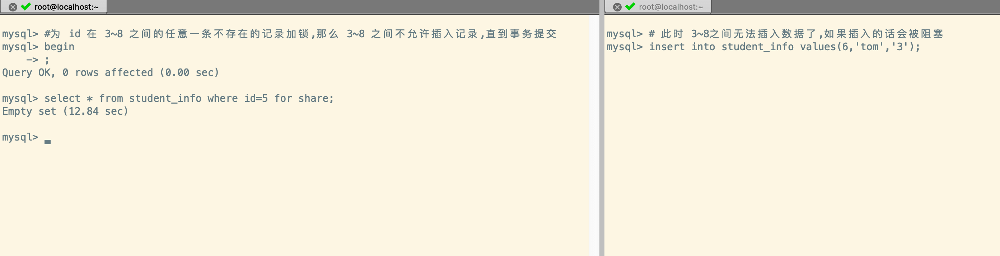

> 事务的隔离性由`锁`来实现

## 概述

在数据库中,除传统的计算资源(如CPU、RAM、I/O等)的争用以外,`数据也是一种供许多用户共享的资源`。**为保证数据的一致性，需要对并发操作进行控制**, 因此产生了`锁`了, 同时`锁机制` 也为实现 MySQL 的各个隔离级别提供了保证。 

`锁冲突` 也是影响数据库`并发访问性能`的一个重要因素。所以锁对数据库而言显得尤其重要、复杂

## 并发事务访问相同记录

**MySQL 中,并发事务访问相同记录的情况大致可以划分为3种:**

1. `读-读`

2. `写-写`

3. `读-写、写-读`

### 读-读

- `并发事务相继读取相同的记录`
- 读取操作本身不会对记录有任何影响，并不会引起什么问题，所以允许这种情况的发生。

### 写-写

`并发事务相继对相同的记录做出改动`, 在这种情况下会发生`脏写` 的问题,任何一种隔离级别都不允许这种问题的发生。所以在**多个未提交事务相继对一条记录做改动时,需要让它们 `排队执行`** ，这个**排队**的过程其实是通过 `锁` 来实现的


锁其实是一个`内存中的结构`, 在事务执行前本来是没有锁的, 也就是说**一开始是没有锁结构 和记录进行关联的**, 如图所示:


<br/>

**当一个事务想对这条记录做改动时,首先会看看内存中有没有与这条记录关联的 `锁结构` **, 当没有的时候就会在内存中**生成一个锁结构 与之关联**。比如，事务 T1 要对这条记录做改动, 就需要生成一个锁结构与之关联

1. `trx信息` : 表示锁结构和哪个事务关联
2. `is_waiting` ： 表示当前事务是否在等待

当事务 T1 改动这条记录的时候,就会生成一个锁结构与该记录进行关联。由于之前没有别的事务为这个记录加锁,所以 `is_waiting = false` ,我们把这个称之为`获取锁成功 (加锁成功)`,然后就可以继续操作了


<br/>

在事务 T1 提交之前,另外一个事务 T2 也想对该记录进行改动, 那么 T2 先去看有没有锁结构与这条记录关联。发现 T1 已经加锁了,那么 T2 此时`也会生成一个锁结构与该记录关联`, 和 T1 不同的是,这个锁结构的 `is_waiting = true`, **表示需要等待**。我们称之为`获取锁失败(加锁失败)`


<br/>

事务 T1 提交之后,会`释放它生成的锁结构`, 然后查看这个记录是否还有其他锁结构与之关联。结果发现 T2 还在等待获取锁,所以就把事务 T2 锁结构的 is_waiting 修改为 true, 然后将事务 T2 对应的线程唤醒,那么 T2 此时就可以获取到锁了


:::tip 小结一下

1. `获取锁成功(加锁成功)`
   - 在内存中生成了对应的锁结构,而且锁结构的 `is_wating = false`, 也就是**事务可以继续执行**
   - 当然不是所有的加锁都会生成对应的锁结构, 有时候会有`加隐式锁`的情况,它不会生成对应的锁结构, 但是仍可以起到保护记录的作用
2. `获取锁失败(加锁失败)`
   - 在内存中生成了锁结构, 但是锁结构的 `is_waiting = true`,也就是**事务需要等待,不可以继续执行**
3. `不加锁`
   - 不需要在内存中生成对应的锁结构,可以直接执行操作,**不包括隐式锁的情况**

:::

### 读-写

**一个事务进行读操作, 另外的事务进行写操作**, 这个时候会出现脏读、不可重复读、幻读的现象。不同数据库厂商对 SQL 标准的支持并不同, 比如 MySQL 的默认隔离级别是`Repeatable Read`

### 并发问题解决

怎么解决 脏读 、 不可重复读 、 幻读 这些问题呢?其实有两种可选的解决方案:

1. 读操作利用 `多版本并发控制 (MVCC)`, 写操作进行 `加锁` 

   - MVCC 就是生成一个 `ReadView`(可以简单的理解为是一个**历史快照**),  通过 ReadView 找到符合条件的记录版本(历史版本由 undo 日志构建)
   - 查询语句只能`读`到在生成 ReadView 之前`已提交事务所做的更改`, 在生成 ReadView 之前**未提交的事务或者之后开启的事务所做的更改是看不到的**
   - `写操作` 肯定针对的是`最新版本的记录`, 读记录的历史版本和最新版本不冲突,所以 采用 MVCC 时, **读写操作不冲突**

   :::info 说明

   普通的查询语句在 `READ COMMITTED` 和 `REPEATABLE READ` 隔离级别下会**使用 MVCC 读取记录**

   - 在 *read committed* 隔离级别下, 一个**事务在执行过程中**每次执行 *select* 操作时都会生成*Read View*, Read View 本身就保证了`事务不可以读取到未提交的事务所做的更改`, 也就是避免得了脏读的问题
   
   - 在 *repeatable read* 隔离级别下,一个**事务在执行过程中**只有`第一次执行 select` 才会生成一个 ReadView, 之后的 select 操作都`复用` 这个 ReadView, 也就是避免得了不可重复读、幻读的问题

   :::

2. **读、写操作**都采用`加锁` 的方式

   - 如果业务中不允许读取记录的旧版本,而是每次都会读取记录的最新版本。
   - 比如银行存款中,我们需要先把账户的余额查询出来,然后将其加上本次存储的金额,最后再写入到数据库中。从查询余额开始就开启事务了,此时不想让其他事务进行写操作,只有当金额存入完毕,即事务提交完成后,其他事务才允许访问账户余额,那么**在进行读操作的时候也需要加锁**

   :::info 说明
    - 脏读是因为当前事务读取了另一个事务没有提交的记录,如果另一个事务在写记录的时候对这个记录加锁,那么当前事务就无法在读取记录的时候获取到锁了

    - 不可重复读是因为当前事务先读取一条记录,另一个事务对这条记录进行了修改并且提交了。如果当前事务读取记录的时候先对该记录加锁,那么另外一个事务就无法修改该记录了
   
    - 幻读是因为某个事务读取了符合某些搜索条件的记录,之后其他事务又插入了符合相同搜索条件的记录,导致事务按相同的查询条件再次查询的时候,多了几条记录。采用加锁的方式避免幻读有点麻烦,因为当前事务第一次读取记录的时候,你并不知道是否有其他事务会插入新的记录,即使有也不知道什么时候插入,**也就是说不知道什么时候加锁,也不知道给谁加锁**
   :::

<br/>

**我们发现:**
- 使用 `MVCC` 方式的话, `读写`操作并不冲突,性能更好
- 使用 `加锁` 方式的话,`读写`操作就需要依次排队,影响性能

一般的情况下,我们更愿意使用 `MVCC` 的方式来解决并发读写的问题,但是有时候基于特殊的业务场景,就需要采用`加锁`的方式处理并发读写的问题

## 锁的不同角度分类


### 数据操作类型划分

> 对于数据库中并发事务的**读-读**不会引起并发问题,但是对于`写-写、读-写、写-读` 就可能会引起并发问题,需要使用`MVCC` 或者 `加锁` 的方式解决 

####  读锁、写锁

在使用加锁的处理并发问题的时候,存在 `读以及写` 两种操作, 并且这两个操作`不能相互影响`, 所以 MySQL 根据这两个操作设计了两种锁:

1. **读锁** 
   - 也叫做`共享锁 (Share Lock)、S 锁`
   - **在事务要读取一条记录的时候,需要先获取这个记录的 S 锁**
2. **写锁**
   - 也叫做 `排它锁 (Exclusive Lock), X 锁`
   - **在事务需要修改一条记录的时候,需要先获取这个记录的 X 锁**

需要注意的是

1. <mark>S 锁和 X 锁既可以加在表上,也可以加在数据行上(这个就是按照<strong>锁粒度进行划分</strong>)</mark> 
2. <mark>S 锁之间是不冲突的,X 锁与 S 锁或者 X 锁之间是否冲突,需要看是锁的粒度以及锁住的是否是同一行数据</mark> 

:::info 举个例子🌰

1. **假设事务 T1首先获取了一条记录的 S 锁,之后事务 T2 也需要访问这条记录:**
   - 如果事务 T2 是**读取数据**, 需要再获取一条记录的 S 锁,那么事务 T2 也会获取这个 S 锁,意味着 事务 T1、T2 在这个记录上`同时持有 S 锁`
   - 如果事务 T2 是**写入数据**, 需要获取这条记录的 X 锁,那么这个**写操作会被阻塞**, 直到事务 T1 释放了读操作的 S 锁为止
2. **假设事务 T1首先获取了一条记录的 X 锁,之后事务 T2 也需要访问这条记录:**
   - 无论什么操作,**都会被阻塞**, 直到事务 T1 释放了写操作的 X 锁为止

:::

#### 锁定读

- 使用**加锁**可以处理**脏读、不可重复读、幻读** 的事务并发问题,在上面我们说**读取一条记录的时候,需要获取一个 S 锁**,这个实际上是不严谨的,**有时候需要再读取数据的时候不让其他事务读取**,所以 MySQL 提供了`给读操作加锁的禁止其他事务读的功能`, 称之为`锁定读`

- **获取 S 锁的锁定读**

    ```sql
    SELECT .... LOCK IN SHARE MODE
    -- 基于 MySQL8.0 的新语法
    SELECT .... FOR SHARE
    ```

- **获取 X 锁的锁定读**

  - 某些情况的下,我们需要再读操作的时候获取 X 锁,让后面的读操作和写操作一样被阻塞

  ```sql
  SELECT ... FOR UPDATE
  ```

:::tip 🌟MySQL8.0 新特性

**假设事务 T1锁定读,那么事务 T2 会处于阻塞状态,当是 T1 提交事务释放 X 锁之后,T2 才能读取数据,如果 T1 执行时间过长, 并且阻塞的事务就会超时**


<br/>

1. 在 5.7 版本之前, *SELECT … FOR UPDATE* 如果一直没有获取到锁,会在指定的参数 ` innodb_lock_wait_timeout` 秒后超时

2. 在 **8.0** 版本中,支持在*SELECT … FOR UPDATE | SHARE* 后面加上参数`NOWAIT、SKIP LOCKED` 参数来**跳过锁等待或者跳过锁定** 
   - `NOWAIT` 
     - **如果查询的行已经加锁,那么立即报错返回**
   - `SKIP LOCKED`
     - **如果查询的行已经加锁,那么返回,但是返回结果中不包含被锁定的行**

**1. NOWAIT**

可以看到,事务 T1 对表中id=1 的行锁定了,事务 T2 获取所有数据的时候会立即报错返回


<br/>

**2. SKIP LOCKED**

可以看到,事务 T1 对表中id=1 的行锁定了,事务 T2 获取所有数据的时候,不会因为读操作加了 X 锁就阻塞住,而是立即返回结果(**忽略锁定的行**)


:::

#### 写操作

> 日常开发中的写操作无非是: *DELETE、UPDATE、INSERT* 这 3 种

1. `	DELETE`
   - 对一条记录进行 DELETE 操作就是在索引中定位到这行记录的位置, 然后**获取这行记录的 X 锁,再执行 delete_mark(修改行记录的标志位)操作**
   - 也可以将删除操作看成是<mark>对某行记录获取其 X 锁的锁定读</mark> 
2. `UPDATE`
   - **情况 1**: 没有修改主键,且被更新的列所占用的存储空间没有变化
     - 定位记录的在 B+Tree 的位置,然后**获取这行记录的X 锁,最后再原记录的位置进行修改操作**
     - 也可以将其看成是<mark>对某行记录获取其 X 锁的锁定读</mark> 
   - **情况 2:** 没有修改主键值,但是更新的列所占用的存储空间发生了变化
     - 位记录的在 B+Tree 的位置,然后**获取这行记录的X 锁,将这条记录彻底删除(将记录移入垃圾链表),最后插入一条新的记录**
     - 也可以将其看成是<mark>对某行记录获取其 X 锁的锁定读,然后新记录的插入由<strong>INSERT</strong>操作提供<strong>隐式锁</strong>进行保护</mark> 
   - **情况 3:** 修改了主键值
     - 对原来的记录进行`DELETE`操作,然后再进行一次`INSERT` 操作,加锁操作由 insert、delete 的规则控制
3. `INSERT`
   - 新插入记录的操作不加锁,通过`隐式锁`的结构来保护这条新插入的记录在事务提交之前不被其他事务访问到
   - **一般不会在内存中生成对应的锁结构,当然也有特殊情况**

### 数据操作的粒度划分

> 锁既可以针对于某条记录,也可以针对于整张表。
>
> - 如果是针对某行记录, 那么影响的只有这几条记录而已,那么这个锁的粒度就是比较细。
>
> - 如果锁是针对整张表, 那么影响的就是这张表里面的**所有记录**,那么这个锁的粒度就很粗

为了尽可能的提高数据库的并发性能,每次锁定的范围越小越好,理论上**每次只锁定当前行记录可以获取到最大的最大的并发度**, 所以有`锁粒度` 的概念,锁粒度可以大致分为: `表锁 -> 页锁 -> 行锁`

#### 表锁 (Table Lock)

> 会锁住整张表, 是 MySQL 中**最基本的锁策略, 不依赖于存储引擎**,并且**锁的开销最小,粒度最大**。且由于会锁住整张表,可以很好的避免死锁的问题, 但是问题是: **并发性能是最差的,相当于是串行的**

##### 表级的 S 锁和 X 锁

> - 如果给表加了 S 锁
>   - 其他事务可以获取该表的 S 锁
>   - 其他事务可以获取该表中某些记录的 S 锁
>   - 其他事务无法获取该表的 X 锁
>   - 其他事务无法获取该表中某些记录的 X 锁
> - 如果给表加了 X 锁
>   - 其他事务无法继续获取该表的 S 锁
>   - 其他事务无法继续获取该表中某些记录的 S 锁
>   - 其他事务无法获取该表的 X 锁
>   - 其他事务无法获取该表中某些记录的 X 锁

- 对某个表执行 *SELECT、INSERT、DELETE、UPDATE* 语句时, InnoDB 存储引擎是 **不会为表添加表级别的 S 锁或者 X 锁的**, 但是对表执行 `ALTER TABLE、DROP TABLE`这类 **DDL** 语句的时候, 其他事务对这个表发起 *select、insert、delete、update* 的语句会被阻塞住

- 同样的,在事务中对某个表执行 `SELECT、INSERT、DELETE、UPDATE`的时候,在其他事务中对该表执行 **DDL** 语句也会发生阻塞

- 上面两个的过程是通过在 `Server 层` 使用一种 `元数据锁(Metadata Lock,简称 MDL)` 的结构来实现的

- **一般情况下也不会使用 InnoDB 提供的表级别的 S 锁和 X 锁**, 只有一些特殊情况下才会用到(比如系统崩溃恢复的时候),比如在系统变量 *autocommit = 0, innodb_table_locks=1* 时,要手动获取表 T 的 S 锁或者 X 锁,可以按下面的方式获取:

  ```sql
  -- InnoDB 存储引擎会对表 T 加上表级别的 S 锁
  LOCK TABLES 表名 READ
  
  -- InnoDB 存储引擎会对表 T 加上表级别的 X 锁
  LOCK TABLES 表名 WRITE
  
  # 查看哪些表被锁住
  show open tables where in_use > 0
  
  # 解除表的 LOCk
  UNLOCK TABLES
  ```

##### 意向锁(Intention Lock)

> 我们提到事务可以为表的某些记录上加 S 锁和 X 锁, 如果其他事务需要加上表级锁,那么**InnoDB 存储引擎是如何确定表中是否已经有数据被锁住了呢?** 肯定不能遍历吧?毕竟表中的数据可能会很多,这时候就需要意向锁,相当于是一个标志位

**InnoDB** 提供了两种`意向锁`,通过意向锁可以在`需要锁表的时候`, 很快的确定表中是否有记录已经被锁住

1. `意向共享锁(Intention Shared Lock,简称 IS锁)`
   - **当事务准备在某条记录上加上 S 锁的时候,先在表级别上加上 IS 锁**
2. `意向排它锁(Intention Exclusive Lock,简称 IX 锁)`
   - **当事务准备在某条记录上加上 X 锁的时候,先在表级别上加上 IX 锁**

:::tip 说明

1. **在加 IS 锁的时候, 不会关心表上面是否有 IX 锁。同样的,在加 IX 锁的时候, 不会关心表上面是否有 IS 锁**
   - 即 **IS 锁、 IX 锁是表级锁,它们的存在仅仅是为了确定表中的记录上是否存在 S 锁 、X 锁, 从而避免用遍历的方式** 
   - <mark>意向锁之间是互相兼容, 即 IS 锁和 IX 锁可以同时存在</mark> 

     - 如果 IX 锁不兼容,那么就意味着无法同时对表的**不同记录**进行修改,那就相当于变成了表锁
2. **意向锁是由存储引擎控制的, 用户无法手动操作意向锁**。在为数据行加S 锁、X 锁之前,  InnoDB 会 **先获取该数据行所在数据表的意向锁 **
3. **意向锁可以协调行锁与表锁的关系, 支持多粒度(表锁与行锁同时存在)**
   - **对`表`加 S 锁的时候 (LOCK TABLES T  READ)**, 首先检查表是否有 IX 锁, 有的话就需要等 IX 锁撤销后再为表加 S 锁
   - **对`表`加 X 锁的时候(LOCK TABLES T  WRITE)**, 首先检查表是否有 IX 锁或 IS 锁, 有的话就需要等 IX 锁或 IS 锁撤销后再为表加 X 锁

<br/>

**1. IS 锁与表的 S 锁和表的 X 锁**


<br/>

**2. IX 锁与表的 X 锁和表的 S 锁**

可以看出来为有 IX 锁的表加表级别的 X 锁和 S 锁都会被阻塞住,直到 IX 锁被撤销(表记录的 X 锁被释放)


:::

##### 自增锁(AUTO-INC 锁)

> 开发中,可以为某个字段设置 自增属性(*auto_increment*),之后插入记录的时候,就会自动的为其赋值
>
> ```sql
> -- 比如我们创建一个表
> CREATE TABLE t (
> 		id 		INT NOT NULL AUTO_INCREMENT,
>   	name			VARCHAR(100),
>   	PRIMARY KEY(id)
> ) ENGINE=InnoDB CHARSET=utf8;
> ```
>
> 由于这个表的 id 字段声明了 *AUTO_INCREMENT*, 意味着在书写插入语句时不需要为其赋值,SQL语句修改 如下所示:
>
> ```sql
> INSERT INTO t (name) VALUES ('zhangsan'), ('lisi');
> ```

MySQL插入数据有三种模式:

1. **简单插入 (simple inserts)**
   - 最基本的插入方式, 预先知道需要插入几条数据
   - 比如 **INSERT...VALUES()** 
2. **批量插入 (bulk inserts)**
   - 事先不知道需要插入几条数据以及需要递增的数量
   - **INSERT … SELECT、LOAD DATA** 
   - <mark>注意:<strong>批量插入模式不包括纯INSERT</strong></mark> 
3. **混合插入 (mixed-mode inserts)**
   - 指定部分新行的自动递增值
   - 比如: **INSERT INTO USER_INFO VALUES (1,'a'), (NULL, 'b'), (3,'c')**

对应上面 3 种插入模式,MySQL 的参数`innodb_autoinc_lock_mode` 可以进行控制, 分别对应与不同锁定模式

1. `innodb_autoinc_lock_mode = 0  [传统锁定模式]`
   - 在此锁定模式下, **每一条 insert 语句都会获得一个特殊的表级 `AUTO-INC 锁`，用于插入具有 AUTO_INCREMENT列的表**
   - 这种模式下, 每次执行 insert 的时候，都会得到一个 **表级锁(AUTO-INC锁)**, 使得语句中生成的 auto_increment 是递增的, 且在binlog中重放的时候，可以保证 master与slave中数据的 auto_increment 是相同的
   - 因为是表级锁, 当在同一时间多个事务中执行insert的 时候，对于AUTO-INC锁的争夺会 `限制并发` 能力
2. `innodb_autoinc_lock_mode = 1 [连续锁定模式]`
   - 在 MySQL 8.0 之前, 连续锁定模式是**默认**的
   - 在这个模式下,  **批量插入依旧使用 AUTO-INC 表级锁，并保持到语句结束**, **同一时刻只有一个语句可以持有AUTO-INC锁**
   - 但是对于简单的插入语句(预先知道插入的行数), **则通过在 Mutex (轻量锁) 的控制下获得所需数量的 自动递增值来避免表级AUTO-INC锁, **它`只在分配过程的持续时间内保持，而不是直到语句完成`
3. `innodb_autoinc_lock_mode = 2 [交错锁定模式]`
   - 从 MySQL 8.0 开始，交错锁模式是**默认**设置
   - 在此锁定模式下，**所有的 INSERT 语句都不会使用 AUTO_INC 表级锁,自动递增值保证在所有并发执行的所有类型的 INSERT 语句中是 `唯一` 且 `单调递增` 的**
   - 但由于多个语句可以同时生成自增数字 (即**跨语句交叉编号**)， **为任何给定语句插入的行生成的值可能不是连续的**
     - 即执行的是简单插入模式的话(插入行数已知), 那么插入数据的自增列是连续的,但如果是批量插入模式的话,插入语句的递增值可能不是连续的

:::caution 说明

1. AUTO_INC 锁的作用范围是`单条执行语句`, 在插入语句执行完成之后就会释放掉该锁
2. 轻量级 mutex 锁的作用范围是`在为插入语句获取自增值时`

:::


##### 元数据锁(MDL锁)

- MySQL5.5 引入了*meta data lock*，简称 `MDL 锁`, 属于**表锁范畴**。`不需要显式使用`,在访问一个表的时候会 MySQL 会自动加上

- `MDL 的作用是保证读写的正确性`
  - 比如，如果一个查询正在遍历一个表中的数据,而执行期间另一个事务对这个表结构做变更, 增加了一列，那么查询事务拿到的结果跟表结构对不上,肯定是不行的。

- 因此, **当对一个表做增删改查操作的时候，加** `MDL 读锁`; **当要对表做结构变更操作的时候，加** `MDL 写锁`
  - **MDL 读锁之间互不排斥**,所以可以有多个事务对一张表的数据进行 CRUD 
  - MDL 读锁与 MDL写锁、MDL 写锁与 MDL 写锁之间是**互斥的** ,用于保证变更表结构操作的安全性
- <mark>MDL 锁解决了 DML 和 DDL 操作的一致性问题</mark> 


#### InnoDB 的行级锁

- 行级锁,也叫做**记录锁**, 也就是在记录上加的锁, MySQL 服务器层没有实现行锁机制, **行锁的实现需要由不同存储引擎去实现** 
- **行级锁的优缺点**
  - **优点**: 锁定粒度小,发生锁冲突的概率小,可以很好的实现高并发 
  - **缺点**: 每行记录都需要**检查、加锁、解锁**, 会导致**锁的开销比较大** , 还可能会出现**死锁**的问题
- <mark>InnoDB 相对于 MyISAM 来说,一方面是支持事务,另一方面就是支持行级锁</mark> 

##### 记录锁(Record Lock)

- **记录锁就是仅仅把一条记录锁上, 对其他的数据没有影响**, 也可以叫做`LOCK_REC_NOT_GAP`
- 记录锁也分为 **S 锁和 X 锁**, 可以称为 S 型记录锁 和 X 型记录锁
  - **当一个事务获取了一条记录的 S 型记录锁后, 其他事务也可以继续获取该记录的S型记录锁，但不可以继续获取该记录 X 型记录锁**
  - **当一个事务获取了一条记录的X型记录锁后, 其他事务既不可以继续获取该记录的S型记录锁, 也不可以继续获取该记录 X 型记录锁**

:::info 示例

**1. X 型记录锁与 S 型记录锁**


**2. X 型记录锁与 X 型记录锁**


:::

##### 间隙锁(Gap Lock)

> **间隙锁的提出仅仅是为了防止插入幻影记录而提出的**

MySQL 的`Repeatable Read` 隔离级别下可以解决幻读问题,有两种解决方案:

1. 使用 `MVCC`
2. 使用`加锁` 的方式

但是使用加锁的方式如何处理没有插入的**幻影记录**呢? 换句话说就是此时并不知道下面需要插入的记录的是哪一个, 所以就**无法为幻影记录加锁**。 InnoDB 使用了一种叫 `Gap Locks` 的锁，官方的类型名称为`LOCK_GAP`, 可以简称为 `GAP 锁`

<mark>间隙锁不允许在加锁记录的前面插入新的记录, 所以说间隙锁并不是针对某条记录.而是一个范围</mark>

:::info 示例

**把id值为8的那条 记录加一个gap锁的示意图如下:**


<br/>

图中 id 值为8的记录加了 间隙锁，意味着 **不允许别的事务在id值为8的记录前边的间隙插入新记录**, 其实就是 id 列的值(3, 8)这个区间的新记录是不允许立即插入的

比如，有另外一个事务再想插入一条 id=4 的新记录, 它定位到该条新记录的下一条记录的id值为8，而这条记录上又有一个 间隙锁, 所以就会**阻塞插入**操作，直到拥有这个间隙锁的事务提交了之后, id 列的值在区间(3, 8)中的新记录才可以被插入

<br/>

**示例**



<br/>

<mark>那么手动锁定的值大于表中的最大记录的值呢?比如这里的 20,那么20 后面空间的都插入不了,因为给数据页中的 Supremum 最大记录加上了间隙锁</mark> 

<br/>

**间隙锁还可能导致死锁**,比如事务 T1、T2中的间隙锁都是8, 导致(3,8) 之间不允许插入数据了,所以事务 T1插入 id=5 的出现了阻塞,那么此时事务 T2 再插入 id=7 的就会出现死锁问题, 因为 T1的id=5的记录在等待 T2的 id=7的记录释放锁, T2的id=7的记录在等待 T1的 id=5的记录释放锁,导致死锁

:::


##### 临键锁(Next-Key Locks)

有时既需要`锁住某条记录`, 也需要阻止其他事务在某条记录前面的`间隙中插入新的记录`,所以 InnoDB 提供了一种`Next-Key Locks`,官方称之为: `LOCK_ORDINARY`

*next-key lock* 是事务级别为*repeatable read* 下使用的锁,`InnoDB 默认的锁就是 next-key lock`。 

*next-key lock* 本质上是一个`记录锁和间隙锁 的结合`, 因为它**既可以保护本条记录,也可以阻止其他事务在该记录前插入新的记录**

:::info 示例

**可以看到 Next-Key lock 兼具 记录锁与间隙锁的功能**


:::

##### 插入意向锁(Insert Intention Lock)

- **一个事务在插入一条记录的时候,需要判断插入的位置是否被其他事务加了间隙锁(临键锁也包含间隙锁), 如果有的话,则插入操作需要等待,直到间隙锁的事务提交**
- InnoDB中`事务即使在等待中,也需要生成一个锁结构`。这种需要向某个间隙中插入数据,但是锁结构处于等待状态,这种类型的锁就是`插入意向锁`, 官方称之为`LOCK_INSERT_INTENTION`
  - 插入意向锁是在插入一条记录之前,由 插入操作产生的一种`间隙锁`, 不是意向锁,并且是在 insert 操作中产生
  - 这个锁用于表示有插入的意图,当多个事务在同一区间插入不同位置的多条数据时, 事务之间不需要相互等待。
- 假设表中已经存在两条记录为 4、7 的记录,有两个事务 T1、T2 分别想插入 5、6 两条记录,那每个事务在获取插入行的 X 锁前,都会获取 (4,7) 的间隙锁,但由于两个事务操作的数据行不同,所以 T1 和 T2 之间不会冲突(阻塞等待)

- **插入意向锁的主要特性**
  - 插入意向锁是一种`特殊的间隙锁`,所以也是`行锁`。可以锁定区间内的部分记录
  - 插入意向锁可以将一个意向锁划分出多个区间
  - `插入意向锁之间不冲突`,所以即使多个事务在同一区间插入多个记录,只要记录本身不冲突,那么多个事务之间就不会冲突等待

#### 页锁

- **页锁就是在`页的粒度`上进行锁定**, 锁定的数据资源比行锁要多，因为一个页中可以有多个行记录。
- 当使用页锁的时候, 会出现数据浪费的现象,但这样的浪费最多也就是一个页上的数据行。 **页锁的开销 介于表锁和行锁之间，会出现死锁。锁定粒度介于表锁和行锁之间,并发度一般。**

- **每个层级的锁数量是有限制的, 因为锁会占用内存空间,锁空间的大小是有限的** 。**当某个层级的锁数量 超过了这个层级的阈值时**, 就会进行 `锁升级` 
  - **锁升级就是用更大粒度的锁替代多个更小粒度的锁**
  - 比如 InnoDB 中行锁升级为表锁, 这样做的好处是占用的锁空间降低了,但同时数据的并发度也下降了。

### 对待锁的态度划分

对待锁的态度来看锁的话, 可以将锁分成**乐观锁和悲观锁**, 需要注意的是: **乐观锁和悲观锁并不是锁，而是锁的设计思想 **

#### 悲观锁(Pessimistic Lock)

- 悲观锁就是 **对数据被其他事务的修改持保守态度, 会通过`数据库自身的锁机制来实现`,从而保证数据操作的排它性**
- 悲观锁总是假设最坏的情况: 每次去拿数据的时候都认为其他事务会修改，所以每次在拿数据的时候都会上锁，这样别人想拿这个数据就会 `阻塞` 直到它拿到锁
  - 比如行锁、表锁等、读锁、写锁等, 都是在做操作之前先上锁, 当其他事务想要访问数据时，都需要阻塞挂起

- 悲观锁适用的场景不是很多,它存在很多不足,因为悲观锁大多数情况下都是依赖于数据库本身的锁机制实现的,这个会对数据库性能造成影响,特别是`长事务`

#### 乐观锁(Optimistic Lock)

- **乐观锁认为对同一数据的并发操作不会总发生, 不用每次都对数据上锁, 但是在更新的时候会判断一下在此期间别人有没有去更新这个数据, 也就是`不采用数据库自身的锁机制`，而是通过程序来实现**
  - 在程序上可以使用`版本号` 或者 `CAS机制` 实现

##### 版本号机制

- 在表中设计一个`版本字段 Version` 
- 第一次读的时候获取 version 字段的取值, 然后对数据进行更新或删除操作时,会执行 *update… set version=version+1 where version=第一次读取的version*。 如果已经有事务对这条数据进行了更改, 那么修改就不会成功

##### 时间戳机制

- 时间戳和版本号机制一样, **也是在更新提交的时候，将当前数据的时间戳和更新之前取得的时间戳进行比较，如果两者一致则更新成功，否则就是版本冲突**
- 乐观锁就是开发人员自己控制数据并发操作的权限, 基本是通过给数据行增加一个字段(版本号或者时间戳),从而证明当前拿到的数据是否最新

:::info 两种锁的适用场景

从这两种锁的设计思想中，我们总结一下乐观锁和悲观锁的适用场景:

1. `乐观锁适合读操作多` 的场景, 相对来说写的操作比较少。它的优点在于程序实现,不存在死锁问题，不过适用场景也会相对乐观，因为它阻止不了除了程序以外的数据库操作。

2. `悲观锁 适合 写操作多` 的场景,因为写的操作具有 `互斥性`。 采用悲观锁的方式，可以在数据库层 面阻止其他事务对该数据的操作权限，防止读-写的冲突

:::

### 加锁的方式

#### 显式锁

通过特定的语句进行加锁, 我们一般称之为显示加锁，例如:

1. 显式加 S 锁

   ```sql
   SELECT  ... LOCK IN SHARE MODE
   # 或者
   SELECT ... FOR SHARE
   ```

2. 显式加 X 锁

   ```sql
   SELECT ... FOR UPDATE
   ```

#### 隐式锁

> 在内存中生成并且维护锁结构需要一定的成本,为了节约成本,InnoDB 中便有了**隐式锁** 的概念

一般情况下执行 *INSERT* 语句不需要再内存中生成锁结构的 (如果被插入的间隙被其他事务加了 gap 锁,那么 insert 就会被阻塞,加上插入意向锁), 但是这可能导致某些问题的出现: 比如一个事务首先插入一条记录(没有锁结构),另一个事务执行下面的操作:

1. 立即使用 *select … for share* 获取这条记录的 S 锁, 如果允许出现这种情况会出现`脏读`的问题
2. 立即修改这条记录, 获取这条记录的 X 锁,如果允许出现这种情况会出现`脏写`的问题

这个时候就需要使用`事务 ID`,在**聚簇索引 和 二级索引** 中:

1. 对于`聚簇索引的记录`来说: 有一个 `ROW_TRX_ID` 隐藏列, **该隐藏列记录着最后改动该记录的 事务 id** 
   - 如果在当前事务 T1 中新插入一条聚簇索引记录后, 该记录的 *ROW_TRX_ID* 隐藏列代表的的就是**当前事务 T1 的事务id**
   - 如果其他事务 T2 此时想对该记录添加 S 锁 或者 X 锁时,首先会看一下该记录的 *ROW_TRX_ID* 隐藏列代表的事务是否是当前的活跃事务,如果是的话:
     - 首先帮助当前事务 T1 创建一个 X锁(也就是为当前事务 T1 创建一个锁结构，*is_waiting=false*)
     - 然后为自己进入等待状态(也就是为自己创建一个锁结构, *is_waiting=true*)
2. 对于`二级索引记录`来说,本身并没有`ROW_TRX_ID`隐藏列，但是在二级索引的数据页的`Page Header`上有一个[`PAGE_MAX_TRX_ID`](InnoDB数据页结构#page-header)属性，该属性代表对该页面做改动的最大的`事务 ID`
   - 如果*PAGE_MAX_TRX_ID* 值**小于**当前**最小的活跃事务 ID**,那么说明对该页面修改的事务都已经提交了
   - 如果*PAGE_MAX_TRX_ID* 值**大于**当前**最小的活跃事务 ID**,那么就通过回表操作定位到聚簇索引记录的位置,然后按聚簇索引的方式执行

也就是说: **一个事务T1 对新插入的记录可以不显式的加锁(不生成锁结构), 但是由于事务 ID 的存在,相当于加了一个隐式锁,然后别的事务T2 在尝试对这个记录加 S 锁或者 X 锁的时候,会实现帮助事务 T1 生成一个锁结构,然后事务 T2 进入锁等待的状态**

- 隐式锁起到了 `延迟生成锁` 的功能, 只有在其他事务与当前事务冲突的时候才会生成锁
- 这种方式可以尽量的避免在插入的时候生成内存的锁结构

:::tip 隐式锁的逻辑过程

1. InnoDB 的每条记录中都一个隐含的 *ROW_TRX_ID* 字段，这个字段存在于聚簇索引的B+Tree中

2. 在操作一条记录前,首先根据记录中的 *ROW_TRX_ID* 检查该事务是否是活动的事务(未提交或回滚)
   - 如果是活动的事务，**首先将隐式锁转换为显式锁 (就是为该事务添加一个锁)**

3. **检查是否有锁冲突**
   - 如果有冲突就创建锁，并设置为waiting状态
   - 如果没有冲突不加锁，跳到第 5 步
4. 等待加锁成功,被唤醒或者超时
5. 写数据，并将自己的事务 ID写入 *ROW_TRX_ID* 字段

:::

### 全局锁

- 全局锁就是对 **整个数据库实例加锁 **

- 当需要让整个库处于**只读状态** 的时候,可以使用这个命令, 之后 其他线程的以下语句会被阻塞

  - DML(数据的增删改)
  - DDL(包括建表、修改表结 构等)
  - 更新类事务的提交语句

- 全局锁的典型使用场景是: ` 全库逻辑备份`

- **全局锁的命令**

  ```sql
    flush tables with read lock
  ```

### 死锁

#### 概念

- 死锁是指**两个或多个事务在同一资源上相互占用,并请求锁定对方占用的资源,但是不释放本身持有的锁,从而导致死锁**


<br/>

上图中，事务1 在等待事务2释放 id=2的行锁, 而事务2在等待事务1释放id=1的行锁。 事务1和事务2在互 相等待对方的资源释放，就是进入了死锁状态

:::info 转账示例

```sql
# 事务 1
update account set balance = balance - 100 where name='A'  #执行顺序 1
update account set balance = balance + 100 where name='B'  #执行顺序 3

# 事务 2
update account set balance = balance - 100 where name='B'  #执行顺序 2
update account set balance = balance + 100 where name='A'  #执行顺序 4
```

上述的示例中,事务 1 先对 *执行顺序 1* 加了 X 锁,然后事务 2 对 *执行顺序 2* 加了 X 锁,此时两个事务分别持有 A 行的锁与 B 行的 X 锁。

当事务 1 尝试获取 B 行的锁就会被阻塞等待,事务 2 尝试获取 A 行的锁也会被阻塞等待,两个事务互相等待对方释放锁,但不释放本身的锁,这就导致了死锁

:::

#### 产生死锁的必要条件

1. **至少有两个事务**
2. **每个事务都持有锁并且尝试获取新的锁**
3. **锁只能被同一个事务持有,比如 X 锁**
4. **事务之间持有对方需要的锁,但是不释放该锁**

:::tip 死锁关键

多个 Session 会话的加锁顺序不一致

:::

#### 处理死锁

当出现死锁后, 一般有 **两种策略 **:

1. **直接进入等待直到超时**
   - 通过参数`innodb_lock_wait_timeout`来设置,  **默认时间是`50s`**
   - 即两个事务之间相互等待, 当一个事务的等待时间超过设置的阈值,就会*回滚* , 另外的事务继续进行
   - 这种方式虽然是简单有效,但是性能很差
2. **主动发起死锁检测, 发现死锁后,InnoDB 选择 *回滚Undo 量最小的事务*，让其他事务得以继续执行**
   - 通过参数 `innodb_deadlock_detect` 设置是否开启该功能 , **默认值是`ON `**
   - 是一种`主动的死锁检测机制`, 这需要数据库保存`锁的信息链表`和`事务等待链表` 两部分信息
   - 但是每个事务都需要检测是否有死锁,会对 MySQL 服务器造成压力

#### 避免死锁

1. 合理设计索引,使业务 SQL 尽可能通过索引定位更少的行,减少锁的竞争
2. 调整业务逻辑的 SQL 执行顺序,避免 update/delete 长时间持有锁的 SQL 在事务前面
3. 避免长事务,尽可能将事务拆分为多个小事务。小事务可以缩短锁定的时间,降低锁冲突的几率
4. 在并发比较高的系统中,不要显式加锁
5. 如果业务允许的话, 可以适当的降低隔离级别

## 锁结构

### 概览

> 我们知道,对一条记录加锁的本质就是**在内存中生成一个与该记录相关联的锁结构 (隐式锁除外)**, 但如果我们在一个事务中需要**对多个记录加锁的话**, 那么是否需要在内存中生成多个锁结构呢?
>
> 比如下面的 SQL 语句查询所有的记录时加上了 S 锁:
>
> ```sql
> -- 这条 SQL 语句显然需要为 student_info 表中的所有记录都加上锁
> SELECT * FROM student_info lock in share mode;
> ```
>
> **理论上,我们可以在内存中创建多个锁结构,并且每为一条记录加锁,都在内存中生成一个锁结构,这种方式 “看起来很简单”**, 但是这种方式对于内存的消耗貌似比较大(难道一个事务中需要对 1000 条记录加锁,就在内存中生成 1000 个锁结构?)

InnoDB 为了**避免过多的锁结构对内存的消耗**, 于是将**同时**满足下面条件的记录,**放在同一个锁结构中**:

1. `在同一个事务中进行加锁操作`
2. `被加锁的记录在同一个数据页中`
3. `加锁的类型是一样的`
4. `等待状态是一样的`

### 锁结构解析

InnoDB 存储引擎中的`锁结构`如图所示:


<br/>

1. `锁所在的事务信息`

   - **无论是行锁还是表锁,一个锁属于一个事务,那么这部分就记录了该锁对应的事务的相关信息**

     :::tip 拓展知识

     这个锁所在的事务信息,从内存结构上说,就只是一个`指针`,所以不会占用太多的内存空间。通过这个指针可以从内存中找到该事务的详细信息(比如 事务ID)。**下面的索引信息本质上也是一个指针**

     :::

2. `索引信息`

   - **对于行锁来说,需要记录一下该记录对应的索引信息**

3. `表锁 / 行锁信息`

   - 这部分根据锁的类型(表锁还是行锁),存储的是不同的数据。
   
   - **对表锁来说,存储的是对哪个表进行加锁,以及一些其他的信息**
   
   - **对于行锁来说,记录了下面的三部分信息:**
     1. `Space ID`
     
        - 表空间 ID
     
     2. `Page Number`
     
        -  记录所在的页号
     
     3. `n_bits`
     
        - **对于行锁来说,一条记录就对应一个比特位**。由于一个页面中包含很多记录,所以用不同的比特位来区分到底是哪一条记录加了锁
     
        - 为此**行锁会在其锁结构的尾部放上一堆比特位,** 而这个 *n_bits* 属性代表使用了多少比特位,**是一个值**
     
          :::tip 拓展知识
     
          并不是数据页中有多少条记录,n_bits 的值就是多少, 一般情况下,**n_bits的值比页面中记录条数多一些**。主要是为了之后在页面中插入了新记录后也不至于重新分配锁结构
     
          :::
     
     4. `type_mode`
     
        - **32 bit大小**,被分成了 `lock_mode` 、 `lock_type` 和 `rec_lock_type` 三个部分:如图所示
     
          
     
      <br/>
     
        - `lock_mode [锁模式]` 占用**低 4 比特**,可选值如下
          - `LOCK_IS [十进制的 0]`: 表示共享意向锁,即 *IS 锁* 
          - `LOCK_IX [十进制的 1]` : 表示共享排他锁,即 *IX 锁* 
          - `LOCK_S [十进制的 2]` : 表示共享锁, 即 *S 锁* 
          - `LOCK_X [十进制的 3]` : 表示排它锁, 即 *X 锁* 
          - `LOCK_AUTO_INC [十进制的 4]` : 表示自增锁,即 *AUTO_INC锁*
     
        - `lock_type  [锁类型]` 占用**中间 5~8 比特 (目前只用了 5~6比特)**,可选值如下
          - `LOCK_TABLE [十进制的 16]`
            - 也就是占用**第 5 比特位**的值
            - 如果值等于`1`,表示**表锁**
     
          - `LOCK_REC [十进制的 32]` 
            - 也就是占用**第 6 比特位**的值
            - 如果值等于`1`,表示**行锁**
     
        - `rec_lock_type [行锁的具体类型]` 用**剩余的比特位表示 (只有在 lock_type=lock_rec 的时候有效)**
          - [LOCK_ORDINARY [十进制的 0]](锁#临键锁next-key-locks) : 表示临键锁(next-key lock)
          - [LOCK_GAP [十进制的 512]](锁#间隙锁gap-lock) 
            - 也就是占用**第 10 比特位**的值
            - 如果值为 1,表示间隙锁(gap 锁)
     
          - [LOCK_REC_NOT_GAP [十进制的 1024]](锁#记录锁record-lock)
            - 也就是占用**第 11 比特位**的值
            - 如果值为 1,表示正常的记录锁
     
          - [LOCK_INSERT_INTENTION [十进制的 2048]](锁#插入意向锁insert-intention-lock) 
            - 也就是占用**第 12 比特位**的值
            - 如果值为 1, 表示插入意向锁
     
          - `LOCK_WAIT [十进制的 256]` 
            - 也就是占用**第 9 比特位**的值
            - 如果值为 1,那么锁的*is_waiting=true*, 即当前事务没有获取到锁,处于等待状态
            - 如果值为 0,那么锁的*is_waiting=false*, 即当前事务获取到了锁
     
          - 其他信息…
     
     
     5. `一堆比特位`
        - 如果是行锁,会在锁结构的尾部加上这一堆比特位,而比特位的数量用 *n_bits* 表示
        - 我们知道,数据页的记录中有一个[heap_no](InnoDB数据页结构#heap_no) 
          - 最小记录 Infimum 对应的 *heap_no=0*, 最大记录 Supremum 对应的 *heap_no=1*,然后每新增一条记录,对应的 heap_no 都会递增加 1
          - **锁结构最后一堆比特位就对应这个数据页的记录,一个比特位对应一个记录的 heap_no**

## 锁的监控

### 行锁竞争分析

关于MySQL锁的监控，我们一般可以通过检查 `InnoDB_row_lock` 等状态变量来分析系统上的行锁的争夺情况:


<br/>

对各个状态量的说明如下:

1. `Innodb_row_lock_current_waits`
   - 当前正在等待锁定的数量
2. `Innodb_row_lock_time`
   - 从系统启动到现在锁定总时间长度, 即 **等待总时长**
3. `Innodb_row_lock_time_avg`
   - 每次等待所花平均时间, 即 **等待平均时长** 
4. `Innodb_row_lock_time_max`
   - **从系统启动到现在等待最常的一次所花的时间**
5. `Innodb_row_lock_waits`
   - 系统启动后到现在总共等待的次数, 即 **等待总次数**

### 其他监控方法

> MySQL把事务和锁的信息记录在了 *information_schema* 库中，涉及到的三张表分别是 `INNODB_TRX` 、 **INNODB_LOCKS** 和 **INNODB_LOCKS_WAITS**
>
> `MySQL5.7 之前`: 可以通过 *information_schema.INNODB_LOCKS* 查看事务的锁情况，但只能看到阻塞事务的锁;如果事务并未被阻塞，则在该表中看不到该事务的锁情况
>
> `MySQL8.0`: 删除了 information_schema.INNODB_LOCKS，添加了 `performance_schema.data_locks` ,可以通过 performance_schema.data_lock s查看事务的锁情况。
>
> 和MySQL5.7及之前不同，**performance_schema.data_locks不但可以看到阻塞该事务的锁，还可以看到该事务所持有的锁**
>
> 同时: **information_schema.INNODB_LOCK_WAITS也被 `performance_schema.data_lock_waits` 所代替**


1. **查询正在被锁阻塞的sql语句**

   ```sql
   SELECT * FROM information_schema.INNODB_TRX\G;

2. **查询锁等待情况**

   ```sql
   SELECT * FROM performance_schema.data_lock_waits\G;
   ```

3. **查询锁的情况**

   ```sql
   SELECT * from performance_schema.data_locks\G;
   ```

   
