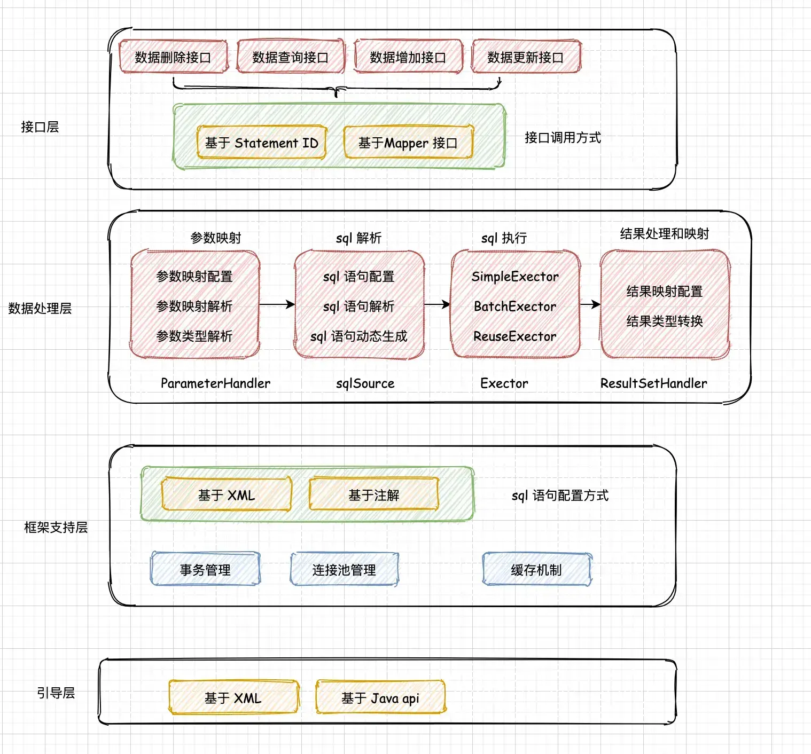

## Mybatis 架构



## 基本结构

一些基本的类

1. `SqlSession`: 一个数据库会话
   - 它表示一个数据库会话, **包含了所有执行语句、提交或回滚事务以及获取映射器实例的方法**
   - 默认实现类: `DefaultSqlSession`
     - 包含: `Configuration` 和 `Executor`
   - **注意**: SqlSession 通过 `SqlSessionFactory` 创建,但是在和**依赖注入框架**(Spring、Guice)使用的时候, **SqlSession 将被依赖注入框架创建并注入**
2. `Configuration`
   - Mybatis 的"配置类", 与 XML 配置文件配置属性相互对应
   - 在调用`SqlSessionFactoryBuilder#build` 方法的时候,会通过 `XMLConfigBuilder#parse()` 将 XML 配置文件转为"配置类”
   - **注意:** 对 Mapper 接口来说,会通过 `MapperRegistry#addMapper` 方法,利用 Mapper 接口创建 `MapperProxyFactory` 对象
3. `Executor`
   - sql 语句执行器
   - 基本抽象类: `BaseExecutor`, 并且有以下的实现类
     - `SimpleExector`
     - `BatchExector`
     - `ClosedExecutor`
     - `ReuseExecutor`
4. `MapperProxy`
   - Mapper 代理类, 继承自 `InvocationHandler`
   - **实际处理 Mapper 接口方法的地方**
   - **注意:** Mybatis 通过 JDK 动态代理计机制为 Mapper 接口创建一个代理对象
5. `MapperMethodInvoker`
   - 有两个实现类:
     - `PlainMethodInvoker`
     - `DefaultMethodInvoker`
6. `MapperMethod`
   - 接口方法的封装, 提供 `execute` 方法,作为执行 sql 语句的入口
   - 还包含以下内部类:
     - `SqlCommand` : 表示一个 sql 命令对象
       - 包含 sql 语句的类型: select、delete、insert、update
       - **通过 Mapper 接口和接口方法名,去 sql 映射文件中解析出对应的 sql 语句**
     - `MethodSignature`: 用于描述、处理 Mapper 接口方法
       - 可以获取 `@MapKey` 的值
       - **将接口方法参数解析封装为 sql 语句需要的参数**
7. `ParamNameResolver`
   - 参数名称处理器,用于处理 Mapper 接口方法的参数

### 配置类 Configuration

在 `SqlSessionFactoryBuilder#build` 的时候,会通过 `XMLConfigBuilder`创建根据配置 XML 文件构建 Configuration  对象,有如下的处理步骤:

```java
// XMLConfigBuilder#parseConfiguration
private void parseConfiguration(XNode root) {
  try {
    // 加载 properties 标签
    propertiesElement(root.evalNode("properties"));
    // 加载 settings 标签
    Properties settings = settingsAsProperties(root.evalNode("settings"));
    loadCustomVfs(settings);
    loadCustomLogImpl(settings);
    // 加载 typeAliases 标签
    typeAliasesElement(root.evalNode("typeAliases"));
    // 加载 plugins 标签
    pluginElement(root.evalNode("plugins"));
    objectFactoryElement(root.evalNode("objectFactory"));
    objectWrapperFactoryElement(root.evalNode("objectWrapperFactory"));
    reflectorFactoryElement(root.evalNode("reflectorFactory"));
    settingsElement(settings);
    environmentsElement(root.evalNode("environments"));
    databaseIdProviderElement(root.evalNode("databaseIdProvider"));
    typeHandlerElement(root.evalNode("typeHandlers"));
    mapperElement(root.evalNode("mappers"));
  } catch (Exception e) {
    throw new BuilderException("Error parsing SQL Mapper Configuration. Cause: " + e, e);
  }
}
```

## 参数解析

> 关于参数处理,可以参见[这里](SQL映射#参数)。这里给出参数解析的基本过程

### 大致流程

1. 在获取 Mapper 接口的时候, 实际上会得到一个代理工厂 `MapperProxyFactory`,并通过 `MapperProxyFactory#newInstance` 返回代理对象

2. Mybatis 执行 Mapper 接口方法的时候, 实际上会通过调用 `MapperProxy#invoke` 方法, 即通过代理对象执行接口方法

3. 上一步的本质上是通过 `MapperMethodInvoker#invoke` 执行接口方法,并最终通过 `MethodSignature#execute` 执行 sql 语句

   ```java
   public Object execute(SqlSession sqlSession, Object[] args) {
       Object result;
     	// sql 语句的类型: select、delete、update、insert
       switch (command.getType()) {
         case INSERT: {
           // ...执行插入的 sql 语句
         }
         case UPDATE: {
          // ....[执行更新的 sql 语句]
         }
         case DELETE: {
           // ....[执行删除的 sql 语句]
         }
         case SELECT:
           if (method.returnsVoid() && method.hasResultHandler()) {
             executeWithResultHandler(sqlSession, args);
             result = null;
           } else if (method.returnsMany()) {
             result = executeForMany(sqlSession, args);
           } else if (method.returnsMap()) {
             result = executeForMap(sqlSession, args);
           } else if (method.returnsCursor()) {
             result = executeForCursor(sqlSession, args);
           } else {
             Object param = method.convertArgsToSqlCommandParam(args);
             result = sqlSession.selectOne(command.getName(), param);
             if (method.returnsOptional()
                 && (result == null || !method.getReturnType().equals(result.getClass()))) {
               result = Optional.ofNullable(result);
             }
           }
           break;
         case FLUSH:
           result = sqlSession.flushStatements();
           break;
         default:
           throw new BindingException("Unknown execution method for: " + command.getName());
       }
       // ...
       return result;
     }
   ```


4. 上一步就是处理各种类型的 sql 语句(select、insert…),其中在执行 sql 语句之前,会执行 `convertArgsToSqlCommandParam` 方法,**将方法参数转为 sql 语句需要的参数**

### 关于参数解析转换

> 关于参数的解析转换,是通过上面的 `convertArgsToSqlCommandParam` 方法进行处理的,下面详细解析下该方法

参数解析本质上是通过 `ParamNameResolver#getNamedParams(Object[] args)` 处理的:

1. 首先 names 就是在创建 ParamNameResolver 的时候赋值处理的,也就是下面的第 4 步
2. 如果没有 `@Param` 注解,并且只有一个参数
   - 如果方法参数是 Collection, 那么 key 就是 *collection*, 同时如果方法参数是 List, 那么还会添加一个 key 为 *list*
   - 如果方法参数是 Array, 那么 key 就是 *array*
3. 标记了 @Param 注解或者有多个参数, 遍历所有的方法参数
   - 首先添加参数名 key : `argN` (N 从 0 开始)
   - 然后添加通用的参数名 key : `paramN` (N 从 1 开始)
   - **对于 @Param 标记的参数来说,参数名就是第 4 步中确定了的**

```java
// ParamNameResolver#getNamedParams
public Object getNamedParams(Object[] args) {
  final int paramCount = names.size();
  if (args == null || paramCount == 0) {
    return null;
  } else if (!hasParamAnnotation && paramCount == 1) {
    Object value = args[names.firstKey()];
    return wrapToMapIfCollection(value, useActualParamName ? names.get(0) : null);
  } else {
    final Map<String, Object> param = new ParamMap<>();
    int i = 0;
    for (Map.Entry<Integer, String> entry : names.entrySet()) {
      // add arg0,arg1 ...
      param.put(entry.getValue(), args[entry.getKey()]);
      // add generic param names (param1, param2, ...)
      final String genericParamName = "param" + (i + 1);
      // ensure not to overwrite parameter named with @Param
      if (!names.containsValue(genericParamName)) {
        param.put(genericParamName, args[entry.getKey()]);
      }
      i++;
    }
    return param;
  }
}

// ParamNameResolver#wrapToMapIfCollection
public static Object wrapToMapIfCollection(Object object, String actualParamName) {
  if (object instanceof Collection) {
    ParamMap<Object> map = new ParamMap<>();
    map.put("collection", object);
    if (object instanceof List) {
      map.put("list", object);
    }
    Optional.ofNullable(actualParamName).ifPresent(name -> map.put(name, object));
    return map;
  } else if (object != null && object.getClass().isArray()) {
    ParamMap<Object> map = new ParamMap<>();
    map.put("array", object);
    Optional.ofNullable(actualParamName).ifPresent(name -> map.put(name, object));
    return map;
  }
  return object;
}
```

4. 对于 `@Param` 注解的处理,实际是在创建 `ParamNameResolver` 的时候处理
   - 获取方法参数上的所有注解,遍历所有的注解, 如果是 `@Param` 注解,  那么参数名 name  = value 值
   - 如果没有标记 @Param 注解
     - 如果使用了则 `Configuration#useActualParamName = true`,那么就会使用方法形参名作为参数名
     - 否则就使用当前参数的索引(从 0 开始)

```java
public ParamNameResolver(Configuration config, Method method) {
    this.useActualParamName = config.isUseActualParamName();
    final Class<?>[] paramTypes = method.getParameterTypes();
  	// 获取方法参数上的所有注解
    final Annotation[][] paramAnnotations = method.getParameterAnnotations();
    final SortedMap<Integer, String> map = new TreeMap<>();
    int paramCount = paramAnnotations.length;
    // get names from @Param annotations
    for (int paramIndex = 0; paramIndex < paramCount; paramIndex++) {
      // ...
      String name = null;
      for (Annotation annotation : paramAnnotations[paramIndex]) {
        if (annotation instanceof Param) {
          hasParamAnnotation = true;
          name = ((Param) annotation).value();
          break;
        }
      }
      if (name == null) {
        if (useActualParamName) {
          name = getActualParamName(method, paramIndex);
        }
        if (name == null) {
          name = String.valueOf(map.size());
        }
      }
      map.put(paramIndex, name);
    }
    names = Collections.unmodifiableSortedMap(map);
  }
```

:::tip 说明

参数解析就是将Mapper 接口方法参数封装为一个 Map 对象,key 就是参数名,而 value 就是参数值

:::

## 插件机制

Mybatis 提供了4 中插件类型:

- `ParameterHandler`
- `ResultSetHandler`
- `StatementHandler`
- `Executor`
