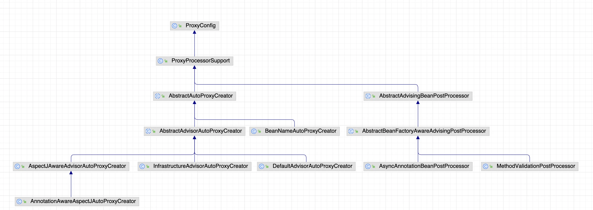

> 由于 Spring 不同版本 [Advice 执行顺序的问题](advice-执行顺序的问题),这里 SpringAop 演示版本是 5.2.2.RELEASE

## 代理与 Aspect

首先需要激活 @AspectJ 模块, 一般来说有两种方式:

1. 注解
    - 激活 AspectJ 自动代理: `@EnableAspectJAutoProxy`
    - 声明切面: `@Aspect`
2. XML 配置
    - 激活 AspectJ 自动代理: `<aop:aspectj-autopeoxy/>`
    - 声明切面: `<aop:aspect/>`

### 注解驱动

可以通过 `@EnableAspectJAutoProxy` 来自动创建 AOP 代理, 通过 `@Aspect` 注解可以声明一个 Aspect 切面

下面是通过注解来激活 AspectJ 模块的示例:

```java
/**
 * AspectJ 的简单Demo
 * @author <a href="mailto:zhuyuliangm@gmail.com">yuliang zhu</a>
 * @see EnableAspectJAutoProxy 用于启动 AspectJ 的自动代理
 * @see Configuration 声明一个配置类
 * @see Aspect 声明一个切面
 */
@Aspect
@EnableAspectJAutoProxy
@Configuration
public class AspectJDemo {
  public static void main(String[] args) {
      AnnotationConfigApplicationContext ctx = new AnnotationConfigApplicationContext();
      ctx.register(AspectJDemo.class);
      ctx.refresh();
      // 是被 CGLIB 提升的
      AspectJDemo aspectJDemo = ctx.getBean(AspectJDemo.class);
      ctx.close();
  }
}
```

### 底层 API

使用 API 的方式可以**为指定的对象创建代理对象**

- AspectJ 在 Spring AOP 的底层实现类: `AspectJProxyFactory`
- 一般 API 编程步骤如下:
  1. 创建 Proxy 工厂,并且设置目标对象
  2. 添加 Aspect 切面配置, 且切面中的 Advice 会被添加到 *advisors* 列表中
  3. 添加 Advice 中的增强操作
  4. 获取代理对象,并且利用代理对象进行"操作"

```java
// 声明一个 Aspect 切面
@Aspect
public class AspectConfig {
  // ...
}


/**
 * 利用 API 创建 AspectJ 代理
 *
 * @author <a href="mailto:zhuyuliangm@gmail.com">yuliang zhu</a>
 */
public class AspectJAPIDemo {
  public static void main(String[] args) {
      // 定义目标对象,假设为 Map
      Map<String,Object> cache = new HashMap<>();

      // 创建代理工厂,并且设置目标对象
      AspectJProxyFactory proxyFactory = new AspectJProxyFactory(cache);

      // 添加切面(Aspect)配置
      proxyFactory.addAspect(AspectConfig.class);

      // 设置 Advice,并且指定增强操作
      proxyFactory.addAdvice(new MethodBeforeAdvice() {
          @Override
          public void before(Method method, Object[] args, Object target) throws Throwable {
              if (method.getName().equals("put")) {
                  System.out.printf("当前存入的数据:key:%s,value:%s\r\n", args[0], args[1]);
              }
          }
      });

      // 获取代理对象,并利用代理对象进行操作
      Map proxy = (Map)proxyFactory.getProxy();
      //out: 当前存入的数据:key:1,value:pacos
      proxy.put("1", "pacos");
      // out: pacos
      System.out.println(proxy.get("1"));
  }
}

```

### 标准代理工厂API(ProxyFactory)

基本实现类: `ProxyFactory`,它也是基于 API 层面去做的,基本使用方式和[AspectJProxyFactory](AOP基础#底层-api) 很类似

下面是使用示例:

```java
/**
 * 通过建标准代理工厂 {@link ProxyFactory} 创建代理的示例
 *
 * @author <a href="mailto:zhuyuliangm@gmail.com">yuliang zhu</a>
 * @see ProxyFactory
 */
public class ProxyFactoryDemo {
  public static void main(String[] args) {
      Map<String,Object> cache = new HashMap<String, Object>();
      // 创建标准代理工厂
      ProxyFactory proxyFactory = new ProxyFactory(cache);

      proxyFactory.addAdvice(new MethodBeforeAdvice() {
          @Override
          public void before(Method method, Object[] args, Object target) throws Throwable {
              if (method.getName().equals("put")) {
                  System.out.printf("当前存入的数据:key:%s,value:%s\r\n", args[0], args[1]);
              }
          }
      });

      // 获取代理对象
      Map proxy = (Map)proxyFactory.getProxy();
      proxy.put("1", "pacos");
      System.out.println(cache.get("1"));
  }
}
```

### XML 配置驱动

> 需要引入 AOP 相关的 Schema

有下面两种实现方法:

1. 配置容器上下文配置文件:
    - `<aop:config>`
    - `<aop:aspectj-autoproxy/>`

2. 使用 `ProxyFactoryBean`

#### 基于 ProxyFactoryBean

ProxyFactoryBean 可以对某个 Bean 创建代理对象,并利用代理对象执行方法

基本步骤:

1. 注册Advice 实现类
2. 配置 ProxyFactoryBean
    - 通过 `target | targetName` 属性指定目标对象
    - 通过 `interceptorNames` 属性指定 "Advice" 增强操作,有下面的注意点:
      - 这个 interceptorNames 是一个**List** , 可以将 *Advisor* 、*Interceptor | Advice* 接口的实现类名称添加进入
      - <mark>interceptorName 中可以包含星号,比如 global* 会匹配所有 beanName 以 global 开头的 interceptor</mark>

:::tip 说明
Interceptor 是 Advice 的子接口
:::

下面是基本示例:

首先创建一个 Advice 的实现类:

```java
/**
 * 前置处理(BeforeAdvice)
 *
 * @author <a href="mailto:zhuyuliangm@gmail.com">yuliang zhu</a>
 * @see MethodBeforeAdvice
 */
public class EchoServiceMethodBeforeAdvice implements MethodBeforeAdvice {
    @Override
    public void before(Method method, Object[] args, Object target) throws Throwable {
        System.out.println("[EchoServiceMethodBeforeAdvice] 进入方法:" + method.getName());
    }
}
```

然后在 XML 中进行配置:

```xml
<!--创建目标对象-->
<bean id="echoService" class="aop.domain.DefaultEchoService"/>

<!--注册Advice增强处理-->
<bean id="echoServiceMethodBeforeAdvice" class="aop.features.XML.EchoServiceMethodBeforeAdvice"/>

<!--创建ProxyFactoryBean-->
<bean id="echoServiceProxyFactoryBean"
      class="org.springframework.aop.framework.ProxyFactoryBean">
    <!-- 设置目标对象 -->
    <property name="target" ref="echoService"/>

    <!-- 添加拦截处理 -->
    <property name="interceptorNames">
      <list>
          <value>echoServiceMethodBeforeAdvice</value>
      </list>
    </property>
</bean>
```

最后进行测试:

```java
/**
 *  使用 XML 配置 的方式创建 Aspect 代理
 *
 * @author <a href="mailto:zhuyuliangm@gmail.com">yuliang zhu</a>
 *
 * @see ProxyFactoryBean
 */
public class AspectJByProxyFactoryBeanDemo1 {
  public static void main(String[] args) {
      String xmlPath = "/META-INF/aop.xml";
      ClassPathXmlApplicationContext ctx= new ClassPathXmlApplicationContext(xmlPath);
      ctx.refresh();
      EchoService defaultEchoService = ctx.getBean("echoServiceProxyFactoryBean", EchoService.class);
      System.out.println(defaultEchoService.echo("Hello,World"));
  }
}
/**
 * out:
 *    [EchoServiceMethodBeforeAdvice] 进入方法:echo
 *    [Echo]:Hello,World
 */
```

## Pointcut 指令与表达式

pointcut 确定了一个或者多个连接点, 由于 SpringAOP 仅支持方法级别的连接点,所以**可以认为 pointcut 是与 Bean 的方法相匹配**。

一个 pointcut 声明包含两部分: `签名` 和 `pointcut 表达式`, pointcut 并不负责执行,而是负责`过滤`,真正的执行动作在 `Advice` 中

有两种方式可以配置 Pointcut:

1. **内置配置**
    - 第一个参数(签名)由方法提供,并且该方法返回类型必须是 *void*
    - 第二个参数(pointcut 表达式) 定义在 advice 中

  ```java
  @Before("execution(* transfer(..))")
  public void doBefore() {
      // 自定义逻辑
  }
  ```

2. **注解配置**
    - 第一个参数(签名)由方法提供,并且该方法返回类型必须是 *void*
    - 第二个参数(pointcut 表达式)则通过使用 `@Pointcut` 注解来表示

  ```java
  // 简单的示例:
  @Pointcut("execution(* transfer(..))") // pointcut 表达式
  private void anyOldTransfer() {       // pointcut 签名,返回值必须是 void
    // ...
  }
  ```

### pointcut 指令

1. `execution`
2. `within`
3. `this`
4. `args`
5. `bean`
6. `target`
7. `@target`
8. `@args`
9. `@within`
10. `@annotation`

其中: @target、@args、@within、@annotation 表示用注解进行过滤

#### execution

> 最通用的表达式类型

- **用于匹配方法**

- 格式: **execution([modifier] return-type [declaring-type]name-pattern(param-pattern) [throws-pattern])**
  - `modifier`
    - 匹配修饰符 [可选的]。**如果省略,则匹配任意修饰符**
    - 可选值: public、private...

  - `return-type`
    - 匹配返回类型(类路径)
    - 匹配规则:
      - `void` : 表示方法没有返回值
      - `..` : 表示在类全名下,匹配当前包及其子包的所有类
      - `*`  : 一般表示任意类型, 但如果在类全名中,则表示任意数量的字符
  - `declaring-type`
    - 匹配类型(类路径) [可选的]。**如果省略, 则匹配所有类路径**
    - 匹配规则:
      - `..` : 表示在类全名下,匹配当前包及其子包的所有类
      - `*` : 表示任意数量的字符
    - **注意: 如果该匹配字符串不是空, 那么需要在方法名匹配前加上 "."**

  - `name-pattern`
    - 匹配方法名称
    - 匹配规则:
      - `*` : 表示任意数量的字符

  - `param-pattern`
    - 匹配参数类型和数量
    - 匹配规则:
      - `()` :   匹配没有参数的方法
      - `(..)`:  匹配有任意数量参数的方法
      - `(*)` :  匹配有一个任意类型参数的方法
      - `(*,java.lang.String)`:  匹配有两个参数的方法，并且第一个为任意类型，第二个为 String 类型

  - `throws-pattern`
    - 抛出异常类型匹配 [可选值]。**如果省略, 则匹配任意类型**

下面是基本示例:

```java
// 匹配所有的 public 方法
execution(public * *(..))

// 匹配所有类中方法名以 set 开头的方法
execution(* set*(..))

// 匹配 com.xyz.service.AccountService 中的所有方法
execution(* com.xyz.service.AccountService.*(..))

// 匹配 com.xyz.service 包下面所有的方法
execution(* com.xyz.service.*.*(..))

// 匹配 com.xyz.service 包以及子孙包中的所有方法
execution(* com.xyz.service..*.*(..))
```

:::tip 其他匹配语法

1. `+`: 表示类层次结构，只适用于类型(类路径)
    - 以当前类为树的根，所有该类的子类，子孙类

2. 详细 [Spring AOP的基本使用](https://juejin.cn/post/7256964915134742584)
3. [Pointcut 表达式](https://www.cnblogs.com/rain144576/p/14708717.html)

:::

#### within

- **用于匹配指定类型内的所有方法,或者指定包路径下所有的具体实现类中的所有方法, 不会拦截子类和接口**
- 格式: **within(declaring-type)**
  - 匹配规则:
    - `..` : 表示在类全名下,匹配当前包及其子包的所有类
    - `*` : 表示任意数量的字符

```java
// 只能是实现类,匹配 ServiceImpl 中的所有方法
within(com.xyz.service.impl.ServiceImpl)

// 匹配包以及子包内的所有类中的所有方法
within(com.xyz.service..*)
```

#### args

- **用于通过方法参数(数量、类型)匹配方法**
- 格式: **args(param-pattern)**
  - `()` : 匹配所有不带参数的方法
  - `(String)` : 匹配只带一个参数,而且这个参数的类型是 String 的方法
  - `(..)` : 匹配任意数量、类型的参数
  - `(..,String)` : 匹配任意数量、类型的参数,但是最后一个参数的类型是 String
  - `(String, ..)` : 匹配任意数量、类型的参数,但是第一个参数的类型是 String

#### target

- **用于匹配 AOP 被代理对象的类型**
- 格式: **target(declaring-type)**
  - 匹配规则:
    - `..` : 表示在类全名下,匹配当前包及其子包的所有类
    - `*` : 表示任意数量的字符

```java
// 匹配目标对象类型为 service 包下的类
target(com.xyz.service.*)

// 匹配目标对象类型为 service 包及其子包下的类
target(com.xyz.service..*)

// 匹配目标对象类型为 AccountServiceImpl 的类
target(com.xyz.service.AccountServiceImpl)
```

#### this

- **用于匹配 AOP 返回的代理对象的类型**
- 格式: **this(declaring-type)**
  - 匹配规则:
    - `..` : 表示在类全名下,匹配当前包及其子包的所有类
    - `*` : 表示任意数量的字符

```java
// 匹配返回的代理对象类型为service包下的类
this(com.xyz.service.*)

// 匹配返回的代理对象类型为service包及其子包下的类
this(com.xyz.service..*)

// 匹配返回的代理对象类型为 AccountServiceImpl 的类
this(com.xyz.service.AccountServiceImpl)
```

#### bean

> 该表达式是 SpringAOP 所特有的

- **用于匹配 bean 的 id 或者 name**
- 格式: **bean(name-pattern)**
  - 匹配规则:
    - `*` : 表示任意数量的字符

```java
// 匹配名称以 Service 结尾的 bean
bean(*Service)

// 匹配名称为 serviceImpl 的 bean
bean(serviceImpl)
```

### 注解

关键步骤:

1. 在类上标注 `@Aspect` 注解标识为一个切面类
2. 在空方法 `@Pointcut` 注解标识一个点切,这个方法的名称就是 pointcut 的名称
3. 在指定的 Advice 注解上指定 pointcut 的名称(方法名)

下面就是对[注解驱动的示例](AOP基础#注解驱动) 进行修改:

首先定义一个 Aspect, 并在其中定义 pointcut 和 advice

```java
/**
 * 定义切面以及 Pointcut、advice
 *
 * @author <a href="mailto:zhuyuliangm@gmail.com">yuliang zhu</a>
 */

@Aspect
public class AspectConfig {
  // 仅匹配 DefaultEchoService#echo 方法
  @Pointcut("execution(public String aop.domain.DefaultEchoService.*(..))")
  private void echoMethod(){}

  // 匹配所有方法
  @Pointcut("execution(public * *(..))")
  private void allMethod(){}


  @Before("echoMethod()")
  public void execEcho(){
      System.out.println("执行 echo 方法");
  }

  @Before("allMethod()")
  public void execAll() {
      System.out.println("执行所有方法 ...");
  }
}

```

然后,将 Aspect 配置注册到 IOC 容器中

```java
/**
 * Pointcut 注解使用示例
 * @author <a href="mailto:zhuyuliangm@gmail.com">yuliang zhu</a>
 * @see EnableAspectJAutoProxy 用于启动 AspectJ 的自动代理
 * @see Configuration 声明一个配置类
 */

@EnableAspectJAutoProxy
@Configuration
public class AspectJPointcutAnnotationDemo {
    public static void main(String[] args) {
        AnnotationConfigApplicationContext ctx = new AnnotationConfigApplicationContext();
        ctx.register(AspectJPointcutAnnotationDemo.class, AspectConfig.class);
        // 需要将目标对象注册到 IOC 容器中
        ctx.register(DefaultEchoService.class);
        ctx.refresh();

        EchoService echoService =  (EchoService)ctx.getBean("defaultEchoService");
        System.out.println( echoService.echo("Hello,World"));

        AspectJPointcutAnnotationDemo aspectJDemo = ctx.getBean(AspectJPointcutAnnotationDemo.class);
        aspectJDemo.execute();
        ctx.close();
    }

    public void execute() {
        System.out.println("执行 AspectJPointcutAnnotationDemo#execute 方法");
    }
}
/**
 * out: 
 *     执行所有方法 ...
 *     执行 echo 方法
 *     [Echo]:Hello,World
 *     执行所有方法 ...
 *     执行 AspectJPointcutAnnotationDemo#execute 方法
 */
```

:::caution 注意
这种自动生成代理的方式,在 Spring AOP 中对某个目标对象进行增强处理的时候,这个目标对象一定要在  IOC 容器中存在
:::

### XML 配置

> 除了通过注解的方式配置 Pointcut,还可以通过 XML 的方式进行配置

关键步骤:

1. 将 aspect 类注册为一个 Bean
2. 通过 `<aop:aspect>` 的 `ref` 属性来指定切面类
3. 通过 `<aop:pointcut>` 来定义一个 pointcut
4. 通过 `<aop:before>` 等 Advice 配置来设置增强动作,这些动作需要配置 aspect 类中

首先定义一个 Aspect 配置类:

```java
/**
 * Aspect 配置类
 * @author <a href="mailto:zhuyuliangm@gmail.com">yuliang zhu</a>
 */
public class AspectConfig2 {

  public void execEcho(){
      System.out.println("执行 echo 方法");
  }
}
```

然后在 XML 配置文件中进行配置:

```xml
<!-- 激活 AOP 的自动代理 -->
  <aop:aspectj-autoproxy/>

  <!--注册目标对象-->
  <bean id="echoService" class="aop.domain.DefaultEchoService"/>

  <!-- 注册 aspect 切面 -->
  <bean id="echoServiceAspect" class="aop.feature.aspect.AspectConfig2"/>

  <!-- 进行 AOP 的配置 -->
  <aop:config>
    <aop:pointcut id="echoMethod"
                  expression="execution(public String aop.domain.DefaultEchoService.*(..))"/>
    <aop:aspect ref="echoServiceAspect">
      <!-- 配置 Advice -->
      <aop:before pointcut-ref="echoMethod" method="execEcho"/>
    </aop:aspect>
  </aop:config>
```

最后进行测试:

```java
/**
 * 通过 XML 配置的方式使用 Pointcut、Advice
 *
 * @author <a href="mailto:zhuyuliangm@gmail.com">yuliang zhu</a>
 */
public class AspectWithPointcutDemo {
    public static void main(String[] args) {
        String xmlPath = "/META-INF/aop2.xml";
        ClassPathXmlApplicationContext ctx= new ClassPathXmlApplicationContext(xmlPath);
        ctx.refresh();
        EchoService defaultEchoService = ctx.getBean("echoService", EchoService.class);
        System.out.println(defaultEchoService.echo("Hello,World"));
    }
}
/**
 * out:
 *   执行 echo 方法
 *   [Echo]:Hello,World
 */
```

### API 编程

> 除了可以使用注解、XML 的方式配置 Pointcut ,还可以通过 API 的方式进行配置

- 核心 API 接口: `Pointcut`
  - `ClassFilter`
  - `MethodMatcher`
- 抽象类: `StaticMethodMatcherPointcut`
- 适配实现:
  - `DefaultPointcutAdvisor`

首先创建一个 Pointcut 的实现类,传入需要判断的类和方法:

```java
/**
 *  {@link Pointcut} 的实现,实现默认的 {@link StaticMethodMatcherPointcut}
 *
 * @author <a href="mailto:zhuyuliangm@gmail.com">yuliang zhu</a>
 * @see StaticMethodMatcherPointcut
 */
public class DefaultPointcut extends StaticMethodMatcherPointcut {
    private String methodName;
    private Class targetClass;

    public DefaultPointcut(String methodName, Class targetClass) {
        this.methodName = methodName;
        this.targetClass = targetClass;
    }

    @Override
    public boolean matches(Method method, Class<?> targetClass) {
        return Objects.equals(methodName, method.getName()) && this.targetClass.isAssignableFrom(targetClass);
    }
}
```

然后通过适配实现`DefaultPointcutAdvisor` 将 Pointcut 实现类添加到 代理工厂:

```java
/**
 * {@link Pointcut} API 的实现方式
 *
 * @author <a href="mailto:zhuyuliangm@gmail.com">yuliang zhu</a>
 * @see Pointcut
 * @see DefaultPointcutAdvisor
 * @see AspectJProxyFactory
 */
public class PointcutAPIDemo {
  public static void main(String[] args) {

    // 创建 Pointcut 的实现
    DefaultPointcut pointcut = new DefaultPointcut("echo", EchoService.class);

    // 通过创建代理工厂
    AspectJProxyFactory proxyFactory = new AspectJProxyFactory(new DefaultEchoService());

    // 在 AP 的方式中,Pointcut 无法直接添加到 proxyFactory 中,需要使用适配实现: DefaultPointcutAdvisor

    proxyFactory.addAdvisor(new DefaultPointcutAdvisor(pointcut, new MethodBeforeAdvice() {
        @Override
        public void before(Method method, Object[] args, Object target) throws Throwable {
            System.out.println("[PointcutAPIDemo] 执行...");
        }
    }));

    EchoService echoService = (EchoService) proxyFactory.getProxy();
    System.out.println(echoService.echo("Hello,World"));
  }
}
/**
 * out: 
 *  [PointcutAPIDemo] 执行...
 *  [Echo]:Hello,World
 */
```

:::caution 注意
这种通过 API 的 方式实现 Pointcut 需要注意: 代理工厂无法直接添加 *Pointcut*, 需要通过适配实现: `DefaultPointcutAdvisor`
:::

## Advice 执行顺序的问题

- 对于注解来说:
  - 在 Spring 5.2.7 以前:执行顺序是 `@Around -> @Before-> @Around -> @After -> @AfterReturning | @AfterThrowing`
  - 在 Spring 5.2.7 之后:执行顺序是 `@Around -> @Before-> @AfterReturning | @AfterThrowing -> @After ->@Around`

- 对于 XML 配置来说: **和在 XML 中定义的 <aop: before | around ...> 位置有关**

## 环绕拦截动作(Around)

- 和其他的拦截动作不同的是, Around 拦截动作**需要手动去触发后续的拦截动作或者目标对象的方法**
- Around 对应的方法签名中需要传入一个 `ProceedingJoinPoint` 类型的参数,然后调用 `proceed()` 方法

### 注解

下面是使用 *@Around* 注解的一个简单示例:

```java
@Aspect
public class AspectConfig {
  // ...
  // echoMethod 拦截 EchoService#echo 方法

  @Before("echoMethod()")
  public void execEcho(){
      System.out.println("@Before 执行 echo 方法");
  }

  // highlight-start
  @Around("echoMethod()")
  public Object execEchoAround(ProceedingJoinPoint joinPoint) throws Throwable {
      System.out.println("@Around 执行 echo 方法 [开始]");
      // 通过 proceed 方法执行后的操作
      Object res = joinPoint.proceed();
      System.out.println("@Around 执行 echo 方法 [结束");
      return res
  }
  // highlight-end
}
```

然后进行测试:

```java

@EnableAspectJAutoProxy
@Configuration
public class AspectJPointcutAnnotationDemo2 {
  public static void main(String[] args) {
      AnnotationConfigApplicationContext ctx = new AnnotationConfigApplicationContext();
      ctx.register(AspectJPointcutAnnotationDemo2.class, AspectConfig.class);
      // 需要将目标对象注册到 IOC 容器中
      ctx.register(DefaultEchoService.class);
      ctx.refresh();

      EchoService echoService =  (EchoService)ctx.getBean("defaultEchoService");
      /**
       * out:
       *   @Around 执行 echo 方法 [开始]
       *   @Before 执行 echo 方法
       *   [DefaultEchoService] echo executed... 
       *   @Around 执行 echo 方法 [结束]
       */
      echoService.echo("Hello,World");
      ctx.close();
  }
}
```

### XML 配置

> 通过 [Around 注解](AOP基础#注解-1) 的方式,我们实现了 环绕拦截动作,我们还可以通过 XML 的方式配置 Around 拦截动作

在 XML 中通过 `<aop:around />` 添加一个 around 拦截动作

首先,在 Aspect 配置类中添加 Around 拦截动作的处理(一样需要调用 proceed 方法):

```java
public class AspectConfig2 {

  public void execEcho(){
      System.out.println("[Before XML]执行 echo 方法");
  }

  // around 拦截动作
  public Object execEchoAround(ProceedingJoinPoint joinPoint) throws Throwable {
      System.out.println("[Around XML] 执行 echo 方法 [开始]");
      Object res = joinPoint.proceed();
      System.out.println("[Around XML] 执行 echo 方法 [结束]");
      return res;
  }
}
```

然后[Before XML配置](AOP基础#xml-配置) 的基础上, 在 XML 配置文件中添加 Around 拦截动作:

```xml
<!-- 进行 AOP 的配置 -->
<aop:config>
  <aop:pointcut id="echoMethod"
                expression="execution(public String aop.domain.DefaultEchoService.*(..))"/>
  <aop:aspect ref="echoServiceAspect">
    <!-- highlight-start-->
    <!-- 配置 Around Advice-->
    <aop:around method="execEchoAround" pointcut-ref="echoMethod"/>
    <!-- highlight-end-->

    <!-- 配置 Before Advice -->
    <aop:before pointcut-ref="echoMethod" method="execEcho"/>
  </aop:aspect>
</aop:config>
```

然后进行测试:

```java
public class AspectWithPointcutDemo {
  public static void main(String[] args) {
      String xmlPath = "/META-INF/aop2.xml";
      ClassPathXmlApplicationContext ctx= new ClassPathXmlApplicationContext(xmlPath);
      ctx.refresh();
      EchoService defaultEchoService = ctx.getBean("echoService", EchoService.class);
      System.out.println(defaultEchoService.echo("Hello,World"));
  }
}

/**
 * out: 
 *  [Around XML] 执行 echo 方法 [开始]
 *  [Before XML]执行 echo 方法
 *  [DefaultEchoService] echo executed... 
 *  [Around XML] 执行 echo 方法 [结束]
 *  [Echo]:Hello,World
 */
```

### API 编程

实际上, Spring AOP 并没有提供类似于 AroundAdvice 接口。

Around 拦截动作需要手动触发,而 Spring AOP 提供的 `MethodInterceptor#invoke` 中的 `MethodInvocation` 可以实现类似于 `ProceedingJoinPoint` 的功能

关于 `MethodInterceptor 的基本使用可以参看 [CGLIB 的基本示例中 callback 方法参数](./AOP总览#基础示例)

## 前置拦截动作(Before)

### 注解

@Before 的示例在[演示 Pointcut 注解](AOP基础#注解) 的时候已经做为示例演示过了

下面有几个问题:

- 思考 1 : @Before 注解和 @Around 注解哪一个优先级更高?
  - 在**同一个 Aspect 切面配置**中,Advice 的优先级从高到低为: `@Around -> @Before -> @After -> @AfterReturning -> @AfterThrowing`
  - [Advice 执行顺序的问题](advice-执行顺序的问题)

- 思考 2:  多个 Advice 声明,如何控制执行顺序?
  - **在同一个 Aspect 切面配置中,是无法控制 Advice 的执行顺序的,需要将多个 Advice 拆分到多个 Aspect 切面配置中,并使用  Ordered 或 @Order 进行排序**

首先定义两个 Aspect 配置类, 并且使用 @Order 注解标识顺序:

```java
// Aspect 配置 1
@Order(2)
@Aspect
public class AspectConfig {
    // 仅匹配 DefaultEchoService#echo 方法
    @Pointcut("execution(public String aop.domain.DefaultEchoService.*(..))")
    private void echoMethod(){}

    @Before("echoMethod()")
    public void execEcho(){
        System.out.println("@Before 执行 echo 方法");
    }

    @Around("echoMethod()")
    public Object execEchoAround(ProceedingJoinPoint joinPoint) throws Throwable {
        System.out.println("@Around 执行 echo 方法 [开始]");
        Object res =  joinPoint.proceed();
        System.out.println("@Around 执行 echo 方法 [结束]");
        return res;
    }
}

// Aspect 配置 2
@Order(1)
@Aspect
public class AspectConfigOrder2 {
    // 仅匹配 DefaultEchoService#echo 方法
    @Pointcut("execution(public String aop.domain.DefaultEchoService.*(..))")
    private void echoMethod(){}


    @Before("echoMethod()")
    public void execEcho(){
        System.out.println("@Before 执行 echo 方法 [2]");
    }

    @Around("echoMethod()")
    public Object execEchoAround(ProceedingJoinPoint joinPoint) throws Throwable {
      System.out.println("@Around 执行 echo 方法 [开始 2]");
      Object res = joinPoint.proceed();
      System.out.println("@Around 执行 echo 方法 [结束 2]");
      return res;
    }
}
```

然后测试查看最后的输出,可以看到 Order 较高的 Aspect 配置 AspectConfigOrder2 中的 Advice 先执行了:

```java
@EnableAspectJAutoProxy
@Configuration
public class AspectJPointcutAnnotationOrderdDemo {
    public static void main(String[] args) {
        AnnotationConfigApplicationContext ctx = new AnnotationConfigApplicationContext();
        ctx.register(AspectJPointcutAnnotationOrderdDemo.class,
                AspectConfig.class,
                AspectConfigOrder2.class);
        // 需要将目标对象注册到 IOC 容器中
        ctx.register(DefaultEchoService.class);
        ctx.refresh();

        EchoService echoService =  (EchoService)ctx.getBean("defaultEchoService");
        /**
         * out:
         *  @Around 执行 echo 方法 [开始 2]
         *  @Before 执行 echo 方法 [2]
         *  @Around 执行 echo 方法 [开始]
         *  @Before 执行 echo 方法
         *  [DefaultEchoService] echo executed... 
         *  @Around 执行 echo 方法 [结束]
         *  @Around 执行 echo 方法 [结束 2]
         *  [Echo]:Hello,World
         */
        System.out.println( echoService.echo("Hello,World"));
        ctx.close();
    }
}
```

### XML 配置

Before XML 配置的 的示例在[演示 Pointcut  XML 配置](AOP基础#xml-配置) 的时候已经做为示例演示过了

### API 编程

Before API 的示例在[演示 Pointcut API 编程](AOP基础#api-编程) 的时候已经做为示例演示过了

下面给出 API 的一些总结

- 核心接口: `BeforeAdvice`
  - 类型: 标记接口, 继承自 `Advice`
  - 方法 Advice 拓展: `MethodBeforeAdvice`
  - 接受对象: `AdvisedSupport`
    - 基础实现类: `ProxyCreatorSupport`
      - 常见实现类:
        1. `AspectJProxyFactory`
        2. `ProxyFactory`
        3. `ProxyFactoryBean`

## 后置拦截动作(After)

后置拦截动作主要有 3 种:

1. 方法返回后
2. 异常发生后
3. finally 执行(一定会去执行)

可以看出来,后置拦截动作就是类似于 `try..catch...finally` 的处理,但是 [执行顺序在不同 Spring 不同版本下有区别](advice-执行顺序的问题)

### 注解

后置拦截动作 3 种动作对应的注解:

1. 方法返回后: `@AfterReturning`
2. 异常发生后: `@AfterThrowing`
3. finally 执行(一定会去执行): `@After`

下面给出示例:

首先在 Aspect 配置类中分别定义三个 Advice 注解的处理:

```java
/**
 * 定义切面以及 Pointcut、advice
 *
 * @author <a href="mailto:zhuyuliangm@gmail.com">yuliang zhu</a>
 */
@Aspect
public class AspectConfig {

    // 仅匹配 DefaultEchoService#echo 方法
    @Pointcut("execution(public String aop.domain.DefaultEchoService.*(..))")
    private void echoMethod(){}

    @Before("echoMethod()")
    public void execEcho(){
        System.out.println("@Before 执行 echo 方法");
    }
    @Around("echoMethod()")
    public Object execEchoAround(ProceedingJoinPoint joinPoint) throws Throwable {
        System.out.println("@Around 执行 echo 方法 [开始]");
        Object res =  joinPoint.proceed();
        System.out.println("@Around 执行 echo 方法 [结束]");
        return res;
    }

    // highlight-start
    @After("echoMethod()")
    public void echoFinally() {
        System.out.println("@After 执行处理");
    }

    @AfterReturning("echoMethod()")
    public void echoReturning() {
        System.out.println("@AfterReturning 执行处理");
    }

    @AfterThrowing("echoMethod()")
    public void echoThrowing() {
        System.out.println("@AfterThrowing 执行异常处理");
    }
    // highlight-end
}
```

然后进行测试,并观察最后的结果,可以看到 3 个注解的执行顺序是: `@After -> @AfterReturning -> @AfterThrowing`

```java
@EnableAspectJAutoProxy
@Configuration
public class AspectJPointcutAnnotationDemo2 {
  public static void main(String[] args) {

      AnnotationConfigApplicationContext ctx = new AnnotationConfigApplicationContext();
      ctx.register(AspectJPointcutAnnotationDemo2.class, AspectConfig.class);
      // 需要将目标对象注册到 IOC 容器中
      ctx.register(DefaultEchoService.class);
      ctx.refresh();

      EchoService echoService =  (EchoService)ctx.getBean("defaultEchoService");
      System.out.println("======== 没有异常处理(@AfterThrowing) =======");
      echoService.echo("Hello,World");

      System.out.println("======== 包含异常处理(@AfterThrowing) =======");
      echoService.echo("error");
      ctx.close();

      /**
       * out:
       *    ======== 没有异常处理(@AfterThrowing) =======
       *    @Around 执行 echo 方法 [开始]
       *    @Before 执行 echo 方法
       *    [DefaultEchoService] echo executed... 
       *    @Around 执行 echo 方法 [结束]
       *    @After 执行处理
       *    @AfterReturning 执行处理
       *    ======== 包含异常处理(@AfterThrowing) =======
       *    @Around 执行 echo 方法 [开始]
       *    @Before 执行 echo 方法
       *    [DefaultEchoService] echo executed... 
       *    @After 执行处理
       *    @AfterThrowing 执行异常处理
       *    Exception in thread "main" java.lang.ArithmeticException: / by zero
       */
    }
}
```

### XML 配置

在 XML 中 也可以配置 3 种后置拦截操作: `<aop: after | after-returning | after-throwing >`

下面是演示示例:

首先在Aspect 配置类中定义增强处理方法:

```java
public class AspectConfig2 {

  public void execEcho(){
      System.out.println("[Before XML]执行 echo 方法");
  }

  // around 拦截动作
  public Object execEchoAround(ProceedingJoinPoint joinPoint) throws Throwable {
      System.out.println("[Around XML] 执行 echo 方法");
      return joinPoint.proceed();
  }

  // highlight-start
  public void echoFinally() {
      System.out.println("[After XML] 执行处理");
  }

  public void echoReturning() {
      System.out.println("[After-Returning XML] 执行处理");
  }

  public void echoThrowing() {
      System.out.println("[After-Throwing XML] 执行异常处理");
  }
  // highlight-end
}
```

然后在 XML 中进行配置:

```xml
<aop:config>
  <aop:pointcut id="echoMethod"
                expression="execution(public String aop.domain.DefaultEchoService.*(..))"/>
  <aop:aspect ref="echoServiceAspect">

    <!-- 配置 Around Advice-->
    <aop:around method="execEchoAround" pointcut-ref="echoMethod"/>

    <!-- 配置 Before Advice -->
    <aop:before pointcut-ref="echoMethod" method="execEcho"/>

    <!-- highlight-start  -->
    <!-- 配置 after、after-returning、after-throwing advice -->
    <aop:after method="echoFinally" pointcut-ref="echoMethod"/>
    <aop:after-returning method="echoReturning" pointcut-ref="echoMethod"/>
    <aop:after-throwing method="echoThrowing" pointcut-ref="echoMethod"/>
    <!-- highlight-end  -->

  </aop:aspect>
</aop:config>
```

最后进行测试,可以看到由于没有异常所以只执行了: `after 和 after-returning`

```java
/**
 * 通过 XML 配置的方式使用 Pointcut、Advice
 *
 * @author <a href="mailto:zhuyuliangm@gmail.com">yuliang zhu</a>
 */
public class AspectWithPointcutDemo {
  public static void main(String[] args) {
      String xmlPath = "/META-INF/aop2.xml";
      ClassPathXmlApplicationContext ctx= new ClassPathXmlApplicationContext(xmlPath);
      ctx.refresh();
      EchoService defaultEchoService = ctx.getBean("echoService", EchoService.class);
      System.out.println(defaultEchoService.echo("Hello,World"));
  }
}
/**
 * out:
 *    [Around XML] 执行 echo 方法 [开始]
 *    [Before XML]执行 echo 方法
 *    [DefaultEchoService] echo executed... 
 *    [Around XML] 执行 echo 方法 [结束]
 *    [After XML] 执行处理
 *    [After-Returning XML] 执行处理
 *    [Echo]:Hello,World
 */
```

### API 编程

> 和 [Before API](AOP基础#api-编程-2) 类似的, After 后置拦截也有对应的 API

- 核心接口: `AfterAdvice`
  - 类型: 标记接口, 继承自 `Advice`
  - AfterAdvice 接口的拓展(子接口)
    - `AfterReturningAdvice`
    - `ThrowsAdvice`
  - 接受对象: `AdvisedSupport`
    - 基础实现类: `ProxyCreatorSupport`
      - 常见实现类:
        1. `AspectJProxyFactory`
        2. `ProxyFactory`
        3. `ProxyFactoryBean`

下面是 AfterReturning 的演示:

```java
/**
 * {@link Pointcut} API 的实现方式
 *
 * @author <a href="mailto:zhuyuliangm@gmail.com">yuliang zhu</a>
 * @see Pointcut
 * @see DefaultPointcutAdvisor
 * @see AspectJProxyFactory
 */
public class PointcutAPIDemo {
  public static void main(String[] args) {

      // 创建 Pointcut 的实现
      DefaultPointcut pointcut = new DefaultPointcut("echo", EchoService.class);

      // 通过创建代理工厂
      AspectJProxyFactory proxyFactory = new AspectJProxyFactory(new DefaultEchoService());

      // 在 AP 的方式中,Pointcut 无法直接添加到 proxyFactory 中,需要使用适配实现: DefaultPointcutAdvisor

      proxyFactory.addAdvisor(new DefaultPointcutAdvisor(pointcut, new MethodBeforeAdvice() {
          @Override
          public void before(Method method, Object[] args, Object target) throws Throwable {
              System.out.println("[PointcutAPIDemo] 执行...");
          }
      }));

      // highlight-start
      proxyFactory.addAdvisor(new DefaultPointcutAdvisor(pointcut, new AfterReturningAdvice() {
          @Override
          public void afterReturning(Object returnValue, Method method, Object[] args, Object target) throws Throwable {
            System.out.println("afterReturning ....");
          }
      }));
      // highlight-end
      EchoService echoService = (EchoService) proxyFactory.getProxy();
      System.out.println(echoService.echo("Hello,World"));
  }
}

/**
 * out:
 *   [PointcutAPIDemo] 执行...
 *   [DefaultEchoService] echo executed... 
 *   afterReturning ....
 *   [Echo]:Hello,World
 */
```

## 自动动态代理

> 我们既可以利用 api 手动创建代理对象,也可以通过 api 的方式自动创建代理

代表实现:

1. `BeanNameAutoProxyCreator`
2. `DefaultAdvisorAutoProxyCreator`
3. `AnnotationAwareAspectJAutoProxyCreator`
    - 注解驱动的 @EnableAspectJAutoProxy 的底层处理逻辑在这

基本的层次结构:



根据上面的层次结构,可以有一个大致的树形展示:

```bash
├── ProxyProcessorSupport
│   ├── AbstractAdvisingBeanPostProcessor
│   └── AbstractAutoProxyCreator
│      ├── BeanNameAutoProxyCreator
│      └── AbstractAdvisorAutoProxyCreator
│         ├── DefaultAdvisorAutoProxyCreator
│         └── AspectJAwareAdvisorAutoProxyCreator
│             └── AnnotationAwareAspectJAutoProxyCreator
```

### BeanNameAutoProxyCreator

通过 BeanName 为 IOC 容器中的 Bean 自动创建代理对象,一般需要配置两个属性:

1. `beanNames`: 指定容器中哪些 bean 需要进行自动代理的创建(**可以采用通配符 "*"**)
2. `interceptorNames` : 指定拦截器

可以看出来, BeanNameAutoProxyCreator 的使用和[ProxyFactoryBean](AOP基础#基于-proxyfactorybean)非常相似。但不同的是, BeanNameAutoProxyCreator 可以配置多个 bean 进行自动代理

下面是基本示例:

首先创建 Advice(拦截器) 的实现:

```java
/**
 * Advice(拦截器) 的实现
 *
 * @author <a href="mailto:zhuyuliangm@gmail.com">yuliang zhu</a>
 * @see MethodBeforeAdvice
 */
public class EchoServiceAdvice implements MethodBeforeAdvice {
    @Override
    public void before(Method method, Object[] args, Object target) throws Throwable {
        System.out.println("[EchoServiceAdvice#Before] 进入方法...:" + method.getName());
    }
}
```

然后在 XML 中分别配置: 目标 Bean、Advice 的实现类、BeanNameAutoProxyCreator

```xml
<!-- 向容器中注册 echoService -->
<bean class="aop.domain.DefaultEchoService" id="echoService"/>

<!--注册Advice增强处理-->
<bean id="echoServiceAdvice"
      class="aop.features.autoProxy.EchoServiceAdvice"/>

<!--创建 BeanNameAutoProxyCreator -->
<bean id="beanNameAutoProxyCreator"
      class="org.springframework.aop.framework.autoproxy.BeanNameAutoProxyCreator">
    <!--
        设置需要进行自动代理的 BeanName,可以是通配符的形式
        比如 beanName 是以 echo* 开头的
      -->
    <property name="beanNames" value="echo*"/>

    <!-- 添加拦截处理 -->
    <property name="interceptorNames">
        <list>
            <value>echoServiceAdvice</value>
        </list>
    </property>
</bean>
```

最后进行测试,可以看到对目标 Bean 进行了代理增强:

```java
/**
 * 通过 {@link BeanNameAutoProxyCreator} 创建自动代理
 *
 * @author <a href="mailto:zhuyuliangm@gmail.com">yuliang zhu</a>
 *
 * @see BeanNameAutoProxyCreator
 */
public class BeanNameAutoProxyDemo {

  public static void main(String[] args) {
      String path = "/META-INF/aop3.xml";
      ClassPathXmlApplicationContext context = new ClassPathXmlApplicationContext(path);

      // 获取 EchoService 的 Bean
      EchoService echoService = context.getBean("echoService", EchoService.class);
      echoService.echo("Hello,World");
  }
}
/**
 * out:
 *  [EchoServiceAdvice#Before] 进入方法...:echo
 *  [DefaultEchoService] echo executed... 
 */
```

### DefaultAdvisorAutoProxyCreator

> 相对于 BeanNameAutoProxyCreator 来说,这种方式更加通用并且能力更强,它和 [Pointcut API 编程](AOP基础#api-编程) 的方式很类似

这种方式不像 [BeanNameAutoProxyCreator](AOP基础#beannameautoproxycreator) 指定哪些 Bean 被代理,而是通过 `Pointcut` 来过滤出哪些 Bean 需要被代理,并且可以**自动的识别出 Advisor 中的Pointcut,以及判断这个 Advice 是否应该被应用到 Bean 中**

操作步骤:

1. 定义一个Pointcut 的实现类,比如拓展 `StaticMethodMatcherPointcutAdvisor`
2. 定义 Advice 的实现类,比如实现 `MethodBeforeAdvice`
3. 在 XML 中配置目标 Bean 对象
4. 在 XML 中配置 `DefaultPointcutAdvisor`,并且配置 *pointcut、advice* 属性
5. 注册 `DefaultAdvisorAutoProxyCreator`

下面是演示的示例:

首先定义 Pointcut 实现类以及 Advice 实现类:

```java
// Pointcut 实现类
public class DefaultPointcut extends StaticMethodMatcherPointcut {
    private String methodName;
    private Class targetClass;

    public DefaultPointcut(String methodName, Class targetClass) {
        this.methodName = methodName;
        this.targetClass = targetClass;
    }

    @Override
    public boolean matches(Method method, Class<?> targetClass) {
        return Objects.equals(methodName, method.getName()) && this.targetClass.isAssignableFrom(targetClass);
    }
}

// Advice 实现类
public class EchoServiceAdvice implements MethodBeforeAdvice {
    @Override
    public void before(Method method, Object[] args, Object target) throws Throwable {
        System.out.println("[EchoServiceAdvice#Before] 进入方法...:" + method.getName());
    }
}
```

然后在 XML 中进行相关的配置:

```xml
  <!-- 向容器中注册 echoService -->
  <bean class="aop.domain.DefaultEchoService" id="echoService"/>

  <!--注册Advice增强处理-->
  <bean id="echoServiceAdvice"
        class="aop.features.autoProxy.EchoServiceAdvice"/>

  <!-- 注册Pointcut -->
  <bean id="defaultPointcut"
        class="aop.config.pointcut.DefaultPointcut">
      <constructor-arg name="methodName" value="echo"/>
      <constructor-arg name="targetClass" value="aop.domain.EchoService"/>
  </bean>

  <!--highlight-start-->
  <!-- 注册 DefaultPointcutAdvisor -->
  <bean id="defaultPointcutAdvisor"
        class="org.springframework.aop.support.DefaultPointcutAdvisor">
      <property name="pointcut" ref="defaultPointcut"/>
      <property name="advice" ref="echoServiceAdvice"/>
  </bean>

  <!--注册 DefaultAdvisorAutoProxyCreator -->
  <bean id="defaultAdvisorAutoProxyCreator"
        class="org.springframework.aop.framework.autoproxy.DefaultAdvisorAutoProxyCreator"/>
  <!--highlight-end-->
```

最后进行测试:

```java
public class DefaultAdvisorAutoProxyCreatorDemo {
    public static void main(String[] args) {
        String path = "/META-INF/aop4.xml";
        ClassPathXmlApplicationContext context = new ClassPathXmlApplicationContext(path);

        // 获取 EchoService 的 Bean
        EchoService echoService = context.getBean("echoService", EchoService.class);
        echoService.echo("Hello,World");
    }
}
/**
 * out:
 *  [EchoServiceAdvice#Before] 进入方法...:echo
 *  [DefaultEchoService] echo executed... 
 */
```

## 替换 TargetSource

> 我们既可以通过 beanName 指定需要代理的一个或多个对象,还可以通过 targetSource 来指定需要代理的对象

代表实现:

1. `EmptyTargetSource` [默认的实现]
2. `HotSwappableTargetSource`
3. `AbstractPoolingTargetSource`
4. `PrototypeTargetSource`
5. `ThreadLocalTargetSource`
6. `SingletonTargetSource`
7. ……

在 [AspectJProxyFactory](AOP基础#底层-api)、[ProxyFactoryBean](AOP基础#基于-proxyfactorybean)、[ProxyFactory](AOP基础#标准代理工厂apiproxyfactory) 等 API 编程方式中,我们可以设置 *targetName* 或者 *target*, 两种方式最终都会被转换为 `SingletonTargetSource`,只是前者会通过 `getBean` 的方式实例化 bean。

```java
// ProxyFactoryBean#freshTargetSource
// 如果传入的是 targetName
private TargetSource freshTargetSource() {
  if (this.targetName == null) {
    // EmptyTargetSource
    return this.targetSource;
  }
  else {
    // 转为 bean,并最终转为 SingletonTargetSource
    Object target = this.beanFactory.getBean(this.targetName);
    return (target instanceof TargetSource ? (TargetSource) target : new SingletonTargetSource(target));
  }
}

// AdvisedSupport#setTarget
// 如果传入的是 target
public void setTarget(Object target) {
  setTargetSource(new SingletonTargetSource(target));
}
```

或者也可以直接通过 `setTargetSource` 的方式手动设置 targetSource

```java title="org.springframework.aop.framework.AdvisedSupport#setTargetSource"
public void setTargetSource(@Nullable TargetSource targetSource) {
    this.targetSource = (targetSource != null ? targetSource : EMPTY_TARGET_SOURCE);
}
```

:::tip 提示

Spring 的 `TargetSource` 接口实现了 `TargetClassAware` 接口,但是这个 TargetClassAware 并不是 Spring IOC 容器 Aware 接口的子接口,而是 SpringAop 单独提供的。它可以 **获取目标对象(getTarget)、释放目标对象(releaseTarget)**

:::

## 总结
