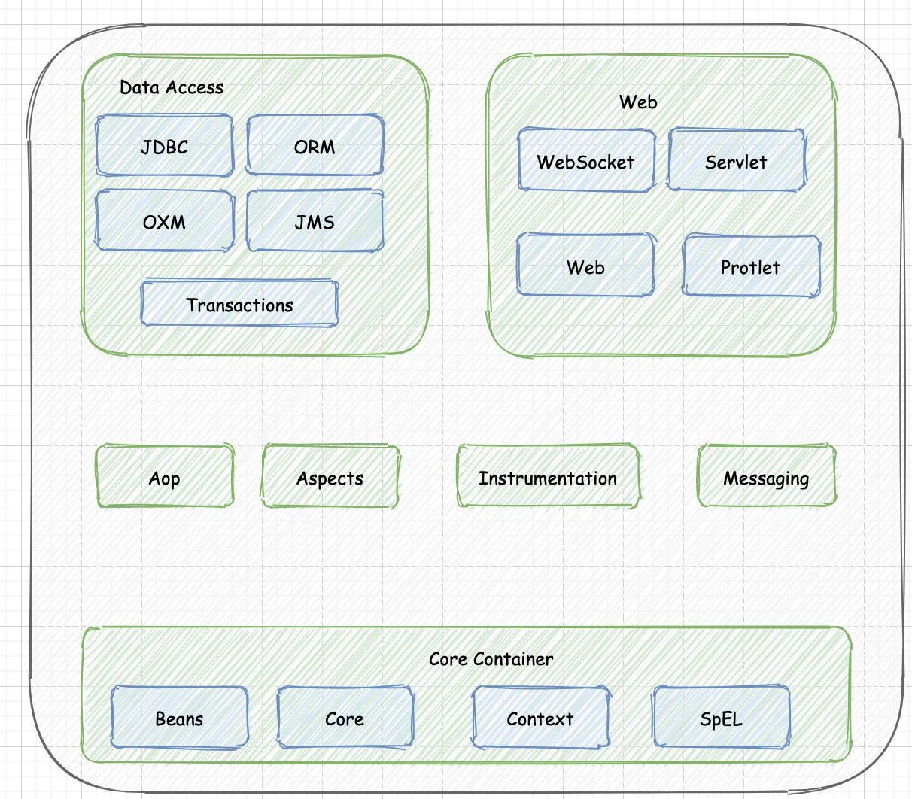
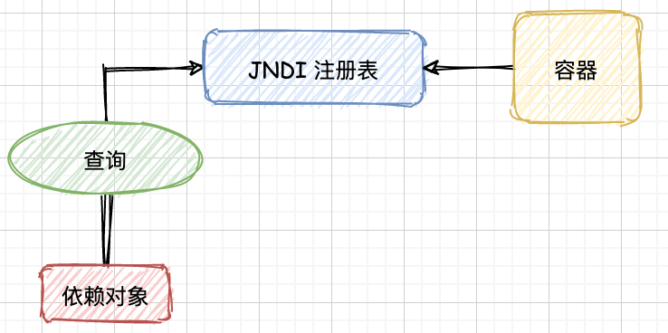
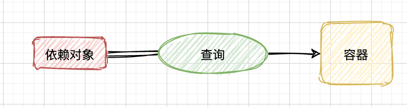

## 基础

Spring是一个轻量级的JEE开源IOC(DI)和AOP容器框架,Spring的优良特性包括:

- `非侵入式 (轻量级)`
  - 基于Spring开发的应用中的对象可以不依赖于Spring的API
- `依赖注入`
  - Dependency Injection(DI)，反转控制(IOC)最经典的实现
- `面向切面编程`
  - Aspect Oriented Programming(AOP)
- `容器`
  - Spring是一个容器，因为它包含并且管理应用对象的生命周期
- `组件化` 
  - Spring实现了使用简单的组件配置组合成一个复杂的应用
  - 在 Spring 中可以使用XML和Java注解组合这些对象。
- `一站式`
  - 在IOC和AOP的基础上可以整合各种企业应用的开源框架和优秀的第三方类库
  - 实际上Spring 自身也提供了表述层的SpringMVC和持久层的Spring JDBC




## Spring的使用

从一个简单的 Spring 应用程序说起,需要由下面的步骤
1. 引入 Spring 相关的依赖
1. 定义一个 Bean 对象
1. 创建一个 Spring 的容器配置文件
1. 在容器中设置 Bean 对象的 instance
   - **创建容器对象 [支持注解、配置文件等多种方式] **
     -  `ApplicationContext context=new ClassPathXmlApplicationContext(String fileName)`
   - **从容器中获取 Bean 对象的 instance**
     - `context.getBean(...)`

:::info 基本的示例

**1. 在 classpath 下定义Spring 容器的配置文件, 并且向容器中加入 Bean 的 instance**

```xml
<?xml version="1.0" encoding="UTF-8"?>
<beans xmlns="http://www.springframework.org/schema/beans"
       xmlns:xsi="http://www.w3.org/2001/XMLSchema-instance"
       xsi:schemaLocation="http://www.springframework.org/schema/beans http://www.springframework.org/schema/beans/spring-beans.xsd">
  	<!-- 在容器中设置 Bean 对象的 instance -->
    <bean id="person" class="Demo1.Person" name="huakucha">
        <property name="address" value="CZ"/>
        <property name="name" value="huakucha"/>
        <property name="age" value="1"/>
    </bean>
</beans>
```

**2.获取Spring的容器对象,以及容器中的 Bean 的 instance**

```java
public class Hello {
    public static void main(String[] args) {
      	// 创建一个 SpringIOC 容器对象(基于 XML 加载Bean对象)
        ApplicationContext ctx = new ClassPathXmlApplicationContext("app.xml");
        Person p = (Person) ctx.getBean("huakucha");
        System.out.println(p);
    }
}
```

:::


## IOC 或 DI

- Spring 框架的核心就是基于`控制反转(Inversion Of Control,IOC)` 的原理, IOC 是一种将**组件依赖项的创建和管理外部化的技术**。
  - 比如类 Foo 依赖于类Bar,传统方式中,我们需要 new 一个Bar的实例,但是在 IOC 中,Bar 的实例会**在运行的时候由外部 process 提供给 Foo**

  - 这种`运行时注入依赖项`的行为, [Martin Fowler](https://martinfowler.com/) *将 IOC重新命名为更具描述性的 `依赖注入(Dependency Injection ,DI)`*

- Spring 的 DI 实现基于两个 Java 核心概念`JavaBeans` 和 `Interface`

  - 当使用 Spring 作为 DI 提供程序时,可以通过不同方式(XML、Java 配置类、注解等)灵活的配置依赖项,**事实上被 Spring 管理的资源都统称为 `bean`**

  - 通过接口允许 Spring 利用 **JDK 动态代理(Proxy)**为横切关注点提供 `AOP` 的功能
    - Spring 的**事务管理**就是 AOP 的典型应用

### IOC 类型

- *IOC的核心是 DI* , 旨在提供一种更简单的机制来设置`组件依赖项`(对 IOC 来说则可以理解为目标对象),并且**在生命周期中管理这些对象**
- 从**操作对象的方式**来说, IOC 一般有两种类型:
  - `依赖查找`, 通常依赖查找有两种类型
    - **依赖拉取(dependency pull,DL)** 
    - **上下文依赖查找(contextualized dependency lookup,CDL)**
  - `依赖注入`,  通常依赖注入也有两种类型
    - **构造函数注入**
    - **setter注入**

#### 依赖拉取

依赖拉取是最常见的 IOC 类型。在依赖拉取的过程中,根据需要`从注册表中获取依赖项`,流程如下:



#### 上下文依赖查找

这种查找方式与 DL 相似,但是这种上下文依赖查找直接作用于容器,**而不是注册表**



我们可以看到**组件调用容器的查找方法查询依赖项,然后将依赖项设置到本身**

```java title="CDL 模拟代码"
/**
 * <b>容器接口</b>
 * @author <a href="mailto:zhuyuliangm@gmail.com">yuliang zhu</a>
 */
public interface Container {
    /**
     * 提供给外部根据依赖名称获取容器中的管理对象
     * @param dependencyName
     * @return Object
     */
    Object getDependency(String dependencyName);
}

/**
 * <b>组件的接口,直接作用于容器</b>
 * @author <a href="mailto:zhuyuliangm@gmail.com">yuliang zhu</a>
 */
public interface Component {
    /**
     * 利用容器查询组件,而不是注册表
     * @param container
     */
    void allowQuery(Container container);
}

/**
 * <b>组件</b>
 * @author <a href="mailto:zhuyuliangm@gmail.com">yuliang zhu</a>
 */
public class CDLComponent implements Component {
    private Dependency dependency;
    @Override
    public void allowQuery(Container container) {
      	// 直接利用容器的方法查询依赖
        // highlight-start
      	// 这个处理映射到 Spring api 上来说就是: beanfactory.getBean(...)
        this.dependency = (Dependency)container.getDependency("dependenceyName");
	      // highlight-end
    }
}
```

#### 构造函数注入

- **当组件的构造函数中提供了某些依赖项后,就会发生`构造函数依赖注入`**,即声明**一个或者一组构造函数,并且其他依赖项作为参数,然后该组件在实例化的时候会由`IOC容器`将依赖项作为构造函数的参数传入给组件**
- 构造函数有一个问题就是: <mark>如果某个依赖项不存在的话,那么该组件也无法被创建初始化</mark> 

```java title="构造函数注入的模拟代码"
public class ContructorInjection {
  	private Dependency dependency;
    // highlight-start
  	// 依赖项作为组件构造函数的参数
  	public ContructorInjection(Dependency dependency) {
      this.dependency = dependency;
    }
    // highlight-end
}
```

#### Setter 注入

- 相对于构造函数来说,Setter 注入则是利用的符合 JavaBean 规约的 `Setter 方法`,将依赖项注入到组件中
- Setter 注入的好处是: **即使组件的某个依赖不存在的话,这个组件也还可以被创建,后期需要的话再利用 setter 方法进行设置**
- Setter 注入还可以`在接口上声明依赖的组件,然后接口的实现类就必须使用或者知道有这个依赖的组件`
- <mark>所以 setter 注入是使用最为广泛的依赖注入方式</mark> 

```java title="Setter 注入的模拟代码"
	public class SetterInjection {
  	private Dependency dependency;
    // highlight-start
    public void setDependency(Dependency dependency) {
       this.dependency = dependency;
    }
    // highlight-end
  }
```

:::tip 说明

1. 事实上,在 Spring 中还提供了另外一种依赖注入方式: `字段注入(Field Injection)`,在后面的`@AutoWired` 注解的自动装配中会说明
2. 使用依赖查找还是依赖注入,大多数的情况下是由IOC容器确定的
   - 比如: 使用 EJB2.1 或者更早的版本的话,就必须使用依赖查找,通过 JNDI 从EJB 容器中获取 EJB
   - 在 Spring 中,除了初始 Bean 的查找, **组件及其依赖项使用使用依赖注入的方式**

3. 如果可以选择依赖查找还是依赖注入,那么依旧是依赖注入,因为依赖查找的耦合性较高,需要主动从容器获取,而依赖注入对组件代码没有任何影响

:::

## Spring 的依赖注入

> IOC 是 Spring 的重要组成部分,Spring 实现的核心是基于 DI,虽然也使用了 DL,但是DI 的优先级高于 DL
>
> Spring 对于 DI 的支持是很全面的,不仅仅支持 Setter 注入、构造函数注入,还支持方法注入

### BeanFactory

- Spring IOC容器的核心是`BeanFactory 接口`,BeanFactory 负责**管理组件,包括组件的依赖项以及组件的生命周期**。在 Spring 的术语中,我们将由容器管理的任何组件都称之为`Bean`
- 虽然 BeanFactory可以通过编程的方式设置,但是更加常见的方式就是使用*配置文件*
  - **Bean 的配置信息由 `BeanDefinition 接口`实现类的实例表示,Bean 的配置信息中还包含了该 Bean 的依赖项信息**
  - **对于实现了 BeanDefinitionReader 接口的 BeanFactory 实现类来说,通过 `PropertiesBeanDefinitionReader`或`XmlBeanDefinitionReader` 从配置文件中读取配置信息,前者利用properties 文件,后者则是 Xml 文件**

#### BeanFactory 实现

我们可以利用下面的方式初始化并且获取Bean, `DefaultListableBeanFactory` 是 Spring 提供的BeanFactory 两种主要实现之一

```java
public class XmlConfigWithBeanFactory {
     public static void main(String[] args) {
        // highlight-start
        DefaultListableBeanFactory factory = new DefaultListableBeanFactory();
        XmlBeanDefinitionReader reader = new XmlBeanDefinitionReader(factory);
        reader.loadBeanDefinitions("xml-config-with-beanFactory.xml");
       // highlight-end
        Address address = (Address)factory.getBean("CZ_Address");
        System.out.println(address);
    }
}
```

#### ApplicationContext

- 我们可以自定义 BeanFactory 的实现类来满足自己的业务需求,但是这个非常复杂。

- 在 Spring 中,`ApplicationContext` 接口是 BeanFactory 的一个拓展。除了常规的 DI 功能,还提供了其他功能,比如`事务、AOP、国际化(i18n)的消息源、事件处理...`所以实际开发的时候建议通过 ApplicationContext 接口与 Spring 交互

###  常见的注入方式

#### 基本配置

对于 Spring 的 XML 配置文件来说,需要使用 Spring 提供的*namespace*,下面的是最基本的示例:

```xml
<beans xmlns="http://www.springframework.org/schema/beans"
       xmlns:xsi="http://www.w3.org/2001/XMLSchema-instance"
       xsi:schemaLocation="http://www.springframework.org/schema/beans
        http://www.springframework.org/schema/beans/spring-beans.xsd">
 </beans>
```

但是除了 beans 的 namespace,Spring 还提供了很多其他的namespace,比如针对 ApplicationContext配置的`Context`,用于 AOP 支持的`aop`,用于事务支持的`tx`…

#### 注解扫描

如果需要对使用 Spring 的注解支持,可以在 XML 中进行使用`context的包扫描`配置,通过**Component-Scan**可以扫描指定包下面被<mark>@Component 以及派生注解标记的 Bean</mark>。当然,也支持对扫描进行过滤。

```xml
<?xml version="1.0" encoding="UTF-8"?>
<beans xmlns="http://www.springframework.org/schema/beans"
       xmlns:context="http://www.springframework.org/schema/context"
       xmlns:xsi="http://www.w3.org/2001/XMLSchema-instance"
       xsi:schemaLocation="http://www.springframework.org/schema/beans
       	http://www.springframework.org/schema/beans/spring-beans.xsd
        <!--highlight-start-->                   
        http://www.springframework.org/schema/context
        http://www.springframework.org/schema/spring-context.xsd">
  <!--highlight-end-->       
  <!-- 开启支持 Spring 的注解扫描,设置扫描的基础包路径 -->
  <!--highlight-start-->           
  <context:component-scan base-package="Demo2">
  </context:component-scan>
  <!--highlight-end-->    
</beans>
```

#### Setter 注入

Setter 可以使用**配置文件、配置文件+注解、注解**的方式

##### 配置文件

:::info 创建 Bean 的示例

1. 定义组件

```java title="Java 代码"
// 定义消息渲染和消息提供者接口
public interface MessageRender {
    void render();
    void setMessageProvider(MessageProvider messageProvider);
    MessageProvider getMessageProvider();
}
public interface MessageProvider {
    String getMessage();
}

// 消息渲染和消息提供者接口的实现类
public class StandMessageRender implements MessageRender{
    private MessageProvider messageProvider;

    @Override
    public void render() {
        System.out.println(messageProvider.getMessage());
    }

    @Override
    public void setMessageProvider(MessageProvider messageProvider) {
        this.messageProvider = messageProvider;
    }

    @Override
    public MessageProvider getMessageProvider() {
        return messageProvider;
    }
}
public class HelloMessageProvider implements MessageProvider {
    @Override
    public String getMessage() {
        return "Hello";
    }
}
```

2. 在 Spring 的配置文件中对组件进行配置,同时使用`p:`对**消息渲染组件中的属性字段 messageProvider 进行注入**
   - 注意: 除了 **p 命名空间**还可以使用 Bean 的 `<property>` 属性

```xml
<bean id="messageProvider" class="Demo3.HelloMessageProvider">
</bean>

<!--使用 Setter 注入(property 标签)-->
<bean id="messageRender2" class="Demo3.StandMessageRender">
  <property name="messageProvider" ref="messageProvider"/>
</bean>

<!--使用 Setter 注入(p命名空间)-->
<bean id="messageRender" class="Demo3.StandMessageRender" p:messageProvider-ref="messageProvider">
</bean>
```

3. 代码加载 Spring 的 IOC 容器,并且获取**消息渲染**的组件

```java
public static void main(String[] args) {
  DefaultListableBeanFactory beanFactory = new DefaultListableBeanFactory();
  XmlBeanDefinitionReader reader = new XmlBeanDefinitionReader(beanFactory);
  reader.loadBeanDefinitions("message.xml");
  StandMessageRender  messageRender= (StandMessageRender) beanFactory.getBean("messageRender");
  messageRender.render();  //out:Hello
  
  StandMessageRender  messageRender2= (StandMessageRender) beanFactory.getBean("messageRender2");
  messageRender2.render();  //out:Hello
}
```

:::

##### 配置文件+注解

> 我们除了可以在 Spring 的 xml 配置文件中手动定义组件,还可以使用 Spring 提供的**组件扫描**将 Component 派生注解扫描到 IOC 容器中
>
> 在 Setter 注入时,使用`@Autowired` 对该字段进行注入,当然还可以使用`@Resource`注解

```xml
<!--XMl 定义扫描的路径-->
<?xml version="1.0" encoding="UTF-8"?>
<beans xmlns="http://www.springframework.org/schema/beans"
      xmlns:xsi="http://www.w3.org/2001/XMLSchema-instance"
      xmlns:context="http://www.springframework.org/schema/context"
      xsi:schemaLocation="
      http://www.springframework.org/schema/beans
      http://www.springframework.org/schema/beans/spring-beans.xsd
      http://www.springframework.org/schema/context
      http://www.springframework.org/schema/context/spring-context.xsd">

    <!--扫描 Demo3/XMlAndAnnotation 下的 Component 派生注解标记的组件-->
    <context:component-scan base-package="Demo3.XMlAndAnnotation" annotation-config="true"/>
</beans>
```

```java
// 定义组件
@Component("provider")
public class XmlAnnotationMessageProvider implements MessageProvider {
    @Override
    public String getMessage() {
        return "XmlAnnotation";
    }
}
@Service("messageRender")
public class XmlAnnotationMessageRender implements MessageRender {
    private MessageProvider messageProvider;
    @Override
    public void render() {
        System.out.println(messageProvider.getMessage());
    }

    
  
    /*
    	注意这里将 Bean 的 id 等于 provider 的 Bean 组件通过 Setter 注入的方式注入进来
    */
   // highlight-start
  	@Override
	  @Autowired
    public void setMessageProvider(MessageProvider provider) {
        this.messageProvider = provider;
    }
		// highlight-end

    @Override
    public MessageProvider getMessageProvider() {
        return messageProvider;
    }
}

// 测试
public class XmlAnnotationTest {
    public static void main(String[] args) {
       // 这里的 GenericXmlApplicationContext 是 ApplicantContext 的实现类
        GenericXmlApplicationContext ctx = new GenericXmlApplicationContext();
        ctx.load("XmlAnnotation.xml");
        ctx.refresh();
        XmlAnnotationMessageRender render = ctx.getBean("messageRender", XmlAnnotationMessageRender.class);
        render.render();
    }
}
```

:::warning 注入的注意点

自动注入的时候一般以有两种方式:

1. `byType`
   - 将类型匹配的Bean 组件作为属性注入到另一个Bean 组件中
   - **但是这种方式的问题在于,IOC 容器中可能会存在多个类型相同的 Bean 组件,导致无法注入**
2. `byName`
   - 根据名称自动装配, 使用 Bean 的属性名 与IOC容器中 Bean 的 id 属性进行匹配,匹配成功则装配成功
   - **这种方式要求注入的属性名与Bean 的 id 完全一致**

所以在上述的示例中: 如果 byName 和 byType 的方式都不满足的话,就会抛异常。

当然,我们可以使用`@Resource` 注解来进行DI,**因为@Resource 注解的`name` 属性支持传入需要注入的 Bean 组件的 id实现精确匹配容器中的Bean组件**

```java

@Component("provider")
public class XmlAnnotationMessageProvider implements MessageProvider {
    @Override
    public String getMessage() {
        return "XmlAnnotation";
    }
}

@Component("provider2")
public class XmlAnnotationMessageProvider2 implements MessageProvider {
    @Override
    public String getMessage() {
        return "XmlAnnotation2";
    }
}

/*
	比如这里的容器中有两个 MessageProvider 类型的 Bean组件,但是它们的 id 不同
	通过@Resource 注解可以将指定的 Bean 组件注入进来
*/
@Override
@Resource(name = "provider")
public void setMessageProvider(MessageProvider providerOther) {
  this.messageProvider = providerOther;
}
```


:::

##### 注解

> 我们可以用配置类代替 xml 配置文件,有下面的一些方案:
>
> 1. 在 @Configuration 配置类中使用`@Bean`定义组件
> 2. 在 @Configuration 配置类上通过 `@ComponentScan` 注解进行包扫描
> 3. …

```java
// 自定义组件类
public class AnnotationMessageProvider implements MessageProvider {

    @Override
    public String getMessage() {
        return "annotation";
    }
}
public class AnnotationMessageRender implements MessageRender {
    private MessageProvider messageProvider;
    @Override
    public void render() {
        System.out.println(messageProvider.getMessage());
    }

    @Override
    public void setMessageProvider(MessageProvider messageProvider) {
        this.messageProvider = messageProvider;
    }

    @Override
    public MessageProvider getMessageProvider() {
        return messageProvider;
    }
}

// 定义容器配置类,使用 @Configuration 注解标识,组件用@Bean 标识
@Configuration
public class AnnotationConfiguration {
    @Bean
    public AnnotationMessageProvider provider() {
        return new  AnnotationMessageProvider();
    }

    @Bean
    public AnnotationMessageRender messageRender() {
        AnnotationMessageRender render = new AnnotationMessageRender();
        render.setMessageProvider(provider());
        return render;
    }
}

// 测试,用AnnotationConfigApplicationContext 加载注解配置类
public static void main(String[] args) {
  AnnotationConfigApplicationContext ctx = new AnnotationConfigApplicationContext(AnnotationConfiguration.class);
  AnnotationMessageRender messageRender = ctx.getBean("messageRender", AnnotationMessageRender.class);
  messageRender.render();
}
```

#### 构造函数注入

> 使用构造函数注入的好处就是**如果没有传入参数(除非是 Null),就无法创建Bean,就比如下面的代码:
>
> ```java
> public class ConfigurableMessageProvider implements MessageProvider {
>   private String message;
> 	
>   /*
>   	如果没有传入参数message,那么这个Bean就无法被初始化
>   */
>   // highlight-start
>   public ConfigurableMessageProvider(String message) {
>     this.message = message;
>   }
>   // highlight-end
> 
>   @Override
>   public String getMessage() {
>     return message;
>   }
> }
> ```

与 Setter 注入方式类似的,构造函数注入也支持**配置文件、配置文件+注解、注解**的方式向IOC容器注入 Bean

##### 配置文件

使用配置文件存在这么一个问题: **有两个构造函数,他们的入参数量都是一样的,但是入参的数据类型不一致。** 这个可以通过 `constructor-arg` 标签的`type、index` 的属性处理

:::info 使用示例

1. 定义 Bean 组件

```java title="java代码"
// 定义组件
public class XmlMessageProvider implements MessageProvider {
    private String message;

    public XmlMessageProvider (String message) {
        this.message = message;
    }

    @Override
    public String getMessage() {
        return message;
    }
}
```

2. 定义 Xml 配置文件

```xml
<!--  构造函数注入(使用constructor-arg标签)  -->
<bean id="xmlMessageProvider" class="Demo4.ConstructorInjection.XmlInjection.XmlMessageProvider">
  <constructor-arg name="message" value="xmlMessageProvider"/>
</bean>

<!--  构造函数注入(使用c命名空间)  -->
<bean id="xmlMessageProvider2"
      class="Demo4.ConstructorInjection.XmlInjection.XmlMessageProvider"
      c:message="xmlMessageProvider2">
</bean>
```

3. 测试代码

```java
DefaultListableBeanFactory beanFactory = new DefaultListableBeanFactory();
XmlBeanDefinitionReader reader = new XmlBeanDefinitionReader(beanFactory);
reader.loadBeanDefinitions("constructorXml.xml");
XmlMessageProvider messageProvider= (XmlMessageProvider) beanFactory.getBean("xmlMessageProvider");
System.out.println(messageProvider.getMessage());	// out:xmlMessageProvider

XmlMessageProvider messageProvider2= (XmlMessageProvider) beanFactory.getBean("xmlMessageProvider2");
System.out.println(messageProvider2.getMessage());	// out: xmlMessageProvider2
```

:::

##### 注解+配置文件

还是基本的三步走:

1. 开启注解扫描
2. 编写Bean 的组件并且注入到 IOC 容器中
3. 通过 BeanFactory 的子类获取容器中的 Bean 组件

:::info 代码实例

```xml
<!-- 开启注解扫描   -->
<context:component-scan base-package="Demo4.ConstructorInjection.XmlAndAnnotation">
</context:component-scan>
```

> 这里需要注意的是`@Value` 注解,通过该注解可以**将指定的值注入到 Bean 里面去**

```java
@Service("configurationXmlAnnotationMessageProvider")
public class ConfigurationXmlAnnotationMessageProvider implements MessageProvider{
    private String message;
  
    @Autowired
    public ConfigurationXmlAnnotationMessageProvider(@Value("annotation inject message")String message) {
        this.message = message;
    }

    @Override
    public String getMessage() {
        return message;
    }
}
```

```java
// 最后的测试
public static void main(String[] args) {
  GenericXmlApplicationContext ctx = new GenericXmlApplicationContext();
  ctx.load("Constructor/XmlAndAnnotation.xml");
  ctx.refresh();
  ConfigurationXmlAnnotationMessageProvider provider =
    ctx.getBean("configurationXmlAnnotationMessageProvider", 
                ConfigurationXmlAnnotationMessageProvider.class);
  System.out.println(provider.getMessage());  // out: annotation inject message
}
```

---

**虽然使用@Value 注解可以将固定的值注入到属性中,但是硬编码不是很好的选择,我们可以定义一个 String 类型的且 id 为 message 的 Bean 组件,然后 通过@Autowired 注入**

值得注意的是:<mark>构造函数注入中,不允许在两个构造函数上标记@Autowired,否则在启动 ApplicationContext 的时候就会报错</mark> 

```xml
<bean id="message" class="java.lang.String">
  <constructor-arg index="0" value="String Bean Injection"/>
</bean>
```

```java
@Service("configurationXmlAnnotationMessageProvider")
public class ConfigurationXmlAnnotationMessageProvider implements MessageProvider{
    private String message;
   // 注意:这里不再需要使用@Value 注解
    @Autowired
    public ConfigurationXmlAnnotationMessageProvider(String message) {
        this.message = message;
    }
    @Override
    public String getMessage() {
        return message;
    }
}
```

:::

##### 注解

>  该方式很简单,在上面的 Setter 注入中已经使用过


#### 字段注入

> 除了 Setter 注入以及构造函数注入,Spring 还支持第三种依赖的注入方式 - **字段注入(field injection)**

- <mark>字段注入是通过使用 @Autowired、@Resource 等注解来完成类成员变量的注入,即使该成员变量是私有的,因为 Spring 容器是通过反射来注入依赖项的</mark>
- 字段注入存在的缺点
  - **不要过度使用**, 字段注入很容易添加一个依赖项,但如果注入过多的依赖项,可能会违反*单一责任原则*,导致后期重构的时候难以分离的情况
  - 字段注入*引入了 Spring 的依赖项*, @Autowired 注解是 Spring 的组件,这个 Bean 不是一个POJO,无法独立初始化 ( 你需要添加额外的操作才能将依赖“注入进来" )

:::info 示例

1. 定义一个 Bean 的组件,由于开启了注解扫描,所以不需要再IOC 配置文件中进行配置

```java title="Bean组件"
@Service("inspiration")
public class Inspiration {
    private String msg = "field Injection [Inspiration]";

    public String getMsg() {
        return msg;
    }
    public void setMsg(String msg) {
        this.msg = msg;
    }
}
```

```xml title="开启注解扫描"
<context:component-scan base-package="Demo4.FieldInijection"/>
```

2. 在需要进行字段注入的成员变量上通过相关的注解将 Bean 组件注入进来

```java title="字段注入"
@Component("singer")
public class Singer {

    /**
     * 即使这里的 Inspiration 是私有的也没有关系,因为 Spring 利用反射的机制将Bean 组件注入进来
     */
    @Resource
    private Inspiration inspiration;

    public void sing () {
        System.out.println("sings:"+inspiration.getMsg());
    }
}
```

:::

### 注入参数

在上面的三种注入方式中,Spring 支持多种**注入参数选项**, 不仅仅可以注入简单的值和其他 Bean 组件,还可以注入**集合、外部定义的属性以及其他工厂中的 Bean**

#### 注入简单值

这种方式是最简单的,只需要将其配置在 `<value>` 中即可,默认情况下,不仅仅可以读取 String 值,还可以**将这些值转化为其他原始类型值以及其包装类**

:::info 示例

**1. 使用配置文件的方式**

```java
// 定义一个 Bean
public class InjectionSimple {
    private String name;
    private int age;
    private float height;
    private boolean programmer;
    private Long ageInSeconds;
		// getter、setter...
}

```

```xml
<!--注入简单的值,通过 value -->
<bean id="injectionSimple" class="Demo5.Simplevalue.InjectionSimple">
  <property name="name" value="Huhu"/>
  <property name="age"   value="22"/>
  <property name="ageInSeconds" value="123114011112"/>
  <property name="height" value="1.92"/>
  <property name="programmer" value="true"/>
</bean>
```

**2. 除了使用配置文件,也可以使用注解的方式(当然首先需要开启注解扫描) **

```java
@Component("injectionSimple2")
public class InjectionSimple2 {
    @Value("Huhu2")
    private String name;
    @Value("39")
    private int age;
    @Value("1.92")
    private float height;
    @Value("false")
    private boolean programmer;
    @Value("1241401113")
    private Long ageInSeconds;

    public static void main(String[] args) {
        GenericXmlApplicationContext ctx = new GenericXmlApplicationContext();
        ctx.load("SimpleValue2.xml");
        ctx.refresh();
        InjectionSimple2 ctxBean = ctx.getBean("injectionSimple2", InjectionSimple2.class);
        // out: InjectionSimple2{name='Huhu2', age=39, height=1.92, programmer=false, ageInSeconds=1241401113}
        System.out.println(ctxBean);
    }
    // getter、setter...
}
```

配置文件和注解的方式都可以实现同一个效果

:::

#### SpEL

Spring3 中有个很强大的功能,那就是 SpEL (Spring Expression Language),**它可以动态的计算表达式,并且在 Spring 的 Applicantion Context 中使用,并且将结果注入到 Bean 组件中**

:::info Bean组件的值外部化

> 开启注解扫描,避免复杂的代码

1. 首先在 Bean 中定义一个配置组件

   ```java
   @Component("InjectionConfigComponent")
   public class ConfigComponent {
       private String name = "Huhu2";
       private int age = 39;
       private float height = 1.92F;
       private boolean programmer = true;
       private Long ageInSeconds = 1241401113L;
     	// getter、setter
   }
   ```

2. 通过`#{xx.xx..}` 的方式可以访问容器中组件的属性值,并且 SpEL 支持对属性值进行**`重新计算`**

   ```java
   @Component("spELInjection")
   public class SpELInjection {
       @Value("#{injectionConfigComponent.name + 'EvaluationAfter '}")
       private String name;
   
       @Value("#{injectionConfigComponent.age + 100}")
       private int age;
   
       @Value("#{injectionConfigComponent.height * 2}")
       private float height;
   
       @Value("#{injectionConfigComponent.programmer}")
       private boolean programmer;
   
       @Value("#{injectionConfigComponent.ageInSeconds}")
       private Long ageInSeconds;
   
       public static void main(String[] args) {
           GenericXmlApplicationContext ctx = new GenericXmlApplicationContext();
           ctx.load("SpELInjection.xml");
           ctx.refresh();
           SpELInjection ctxBean = ctx.getBean("spELInjection", SpELInjection.class);
           // out: SpELInjection{name='Huhu2EvaluationAfter ', age=139, height=3.84, programmer=true, ageInSeconds=1241401113}
           System.out.println(ctxBean);
       }
       // getter、setter
   }
   ```

:::

#### 注入相同容器的 Bean

我们可以将处于同一个容器中的 Bean 相互注入其中,这种方式使用很简单,只需要通过`<ref>` 标签指向位于同一个 XML 配置文件的 Bean 组件即可

基本的代码如下:

```xml
<?xml version="1.0" encoding="UTF-8"?>
<beans xmlns="http://www.springframework.org/schema/beans"
       xmlns:xsi="http://www.w3.org/2001/XMLSchema-instance"
       xsi:schemaLocation="http://www.springframework.org/schema/beans http://www.springframework.org/schema/beans/spring-beans.xsd">
	
   <bean id="oracle" class="Virtual.Demo1.Oracle"></bean>
    <!--注入相同容器的 Bean -->
    <bean id="injectionSimple" class="Virtual.Demo1.InjectRef">
      	<!-- 这里 ref 指向位于同一个 XML 配置文件中 Bean 组件的 id -->
        <ref bean="oracle"/>
    </bean>
</beans>
```

#### ApplicationContext 嵌套

> 在上面的的示例中,我们知道了 Bean 组件可以引用位于同一个 IOC 容器中的 Bean 组件,但如果引用的 Bean 组件不在同一个 IOC 容器中的话,我们应该怎么办?
>
> <mark>Spring 支持 ApplicationContext 的层次结构,所以一个 Context (以及相关的 BeanFactory) 会被认定为是另一个ApplicationContext的父级</mark> 。
>
> 通过 ApplicationContext 的嵌套,可以将配置分成不同的文件,最常用的使用场景就是 Spring 的Context 与 Spring Web 的 Context 嵌套

- 在 ApplicationContext 嵌套的时候,Spring 允许**子 Context 中的 Bean** 引用**父 Context 中的 Bean 组件**
- 使用 `子上下文.setParent(父上下文)` 就可以实现 ApplicationContext 嵌套

:::info 示例

1. 我们定义一个父上下文的 XML 配置文件

   ```xml
   <?xml version="1.0" encoding="UTF-8"?>
   <beans xmlns="http://www.springframework.org/schema/beans"
          xmlns:xsi="http://www.w3.org/2001/XMLSchema-instance"
          xsi:schemaLocation="http://www.springframework.org/schema/beans http://www.springframework.org/schema/beans/spring-beans.xsd">
   		
     	<!--
   			定义了两个 Bean 组件: parent 和 children
   		-->
       <bean id="parent" class="java.lang.String">
          <constructor-arg index="0" value="parent"/>
       </bean>
       <bean id="children" class="java.lang.String">
           <constructor-arg index="0" value="children"/>
       </bean>
   </beans>
   ```

2. 定义子上下文的 XML 配置文件

   ```xml
   <?xml version="1.0" encoding="UTF-8"?>
   <beans xmlns="http://www.springframework.org/schema/beans"
          xmlns:xsi="http://www.w3.org/2001/XMLSchema-instance"
          xsi:schemaLocation="http://www.springframework.org/schema/beans http://www.springframework.org/schema/beans/spring-beans.xsd">
   	
       <bean id="hierarchicalSub" class="Demo5.HierarchicalAPPContextUsage.Sub">
         	<!-- 子 ApplicantContext 中引用了上面父 ApplicationContext 中的 Bean 组件-->
           <property name="name" ref="children"/>
       </bean>
   </beans>
   ```

3. 测试

   ```java
   public static void main(String[] args) {
     GenericXmlApplicationContext ctxParent = new GenericXmlApplicationContext();
     ctxParent.load("Hierarchical/ParentCtx.xml");
     ctxParent.refresh();
   
     GenericXmlApplicationContext ctxSub = new GenericXmlApplicationContext();
     ctxSub.load("Hierarchical/SubCtx.xml");
   
     // 设置父上下文
     ctxSub.setParent(ctxParent);
     ctxSub.refresh();
   
     String parent = ctxSub.getBean("parent", String.class);
     String children = ctxSub.getBean("children", String.class);
     Sub hierarchicalSub = ctxSub.getBean("hierarchicalSub", Sub.class);
   
     // out:parent
     System.out.println(parent);
     // out:children
     System.out.println(children);
     // out:children
     System.out.println(hierarchicalSub.getName());
   }
   ```

:::


