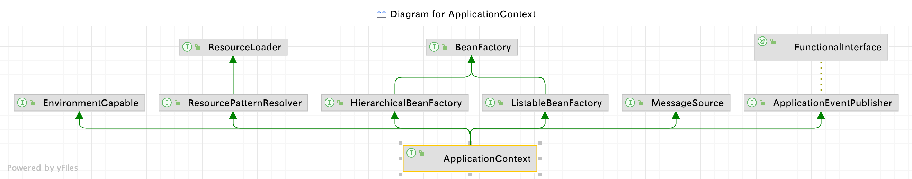

## IOC 概述

- <mark>IOC 容器的职责</mark> 

  - 依赖处理
    - 依赖查找
    - 依赖注入
  
  - 生命周期管理
    - 容器的生命周期
    - 托管的资源(JavaBeans 或者其他资源)
  
  - 配置
    - 容器的配置
    - 外部化的配置
    - 托管的资源(JavaBeans 或者其他资源)  

- <mark>主要实现</mark> 

  1. java SE
     - java Beans
     - java ServiceLoader SPI
     - JNDI (java naming and directory interface)
  2. java EE
     - EJB (Enterprise Java Beans)
     - Servlet
  3. 开源
     - Spring
     - Google Guice
     - Apache Avalon
     - PicoContainer
  


### JavaBeans 传统IOC容器

:::tip 注意

主要用于java awt图形化界面设计

:::

- <mark>JavaBean 作为 IOC 容器的特性？</mark>

  1. 依赖查找
  2. 生命周期管理
  3. 配置元信息
  4. 事件
  5. 自定义
  6. 资源管理
  7. 持久化
- <mark>常见类</mark>

  - **Introspector**:  内省, 用于操作Bean
    - `BeanInfo Introspector.getBeanInfo(Class<?> beanClass, Class<?> stopClass)`
  - **BeanInfo**: Java Beans 的API
    - `getBeanDescriptor()`
      - 获取Bean描述符: *BeanDescriptor*
    - `getEventSetDescriptors()`
      - 获取事件描述符: *EventSetDescriptor*
    - `getPropertyDescriptors()`
      - 获取属性描述符: *PropertyDescriptor*
        - 比如可写、可读方法名
      - <mark>PropertyDescriptor 允许添加属性编辑器: <strong>PropertyEditor</strong>,利用PropertyEditor 可以实现属性类型的转换 等属性的编辑操作</mark> 
    - `getMethodDescriptors()`
      - 获取方法描述符: *MethodDescriptor*

```java
// 一个简单的POJO,也叫做贫血模型(对象只有简单的get/set,没有复杂的业务操作)
public class Person {
    String name;
    Integer age;

    public String getName() {
        return name;
    }

    public void setName(String name) {
        this.name = name;
    }

    public Integer getAge() {
        return age;
    }

    public void setAge(Integer age) {
        this.age = age;
    }

    @Override
    public String toString() {
        return "Person{" +
                "name='" + name + '\'' +
                ", age=" + age +
                '}';
    }
}


public class BeanInfoDemo {
    public static void main(String[] args) throws IntrospectionException {
        Person person = new Person();
        person.setAge(22);
        person.setName("atu");

        // Introspector :Bean的自省
        BeanInfo info = Introspector.getBeanInfo(person.getClass(), Object.class);

        Stream.of(info.getPropertyDescriptors())
              .forEach(propertyDescriptor -> {
                  System.out.println(propertyDescriptor);
              });

        // 利用 PropertyEditor 对属性进行编辑
        Stream.of(info.getPropertyDescriptors())
                .forEach(propertyDescriptor -> {

                    // 获取属性的类型,比如这里就是 java.lang.Integer、java.lang.String
                    Class<?> propertyType = propertyDescriptor.getPropertyType();
                    System.out.println(propertyType);

                    // 获取属性名
                    String name = propertyDescriptor.getName();
                    // 这里进行类型转换
                    if (name.equals("age")) {
                        propertyDescriptor.setPropertyEditorClass(StringToIntegerPropertyEditor.class);
                    }
                });

    }
    static class StringToIntegerPropertyEditor extends PropertyEditorSupport {
        @Override
        public void setAsText(String text) throws IllegalArgumentException {
           Integer val = Integer.valueOf(text);
           setValue(val);
        }
    }
}


/**

java.beans.PropertyDescriptor[name=age; propertyType=class java.lang.Integer; readMethod=public java.lang.Integer ioc.java.beans.Person.getAge(); writeMethod=public void ioc.java.beans.Person.setAge(java.lang.Integer)]

java.beans.PropertyDescriptor[name=name; propertyType=class java.lang.String; readMethod=public java.lang.String ioc.java.beans.Person.getName(); writeMethod=public void ioc.java.beans.Person.setName(java.lang.String)]

class java.lang.Integer
class java.lang.String
*/
```


## Spring IOC

**依赖查找与依赖注入**

| 类型     | 依赖处理 | 便利性   | 代码侵入性   | API 依赖性     | 可读性 |
| -------- | -------- | -------- | ------------ | -------------- | ------ |
| 依赖查找 | 主动获取 | 相对繁琐 | 侵入业务逻辑 | 依赖容器 API   | 良好   |
| 依赖注入 | 被动提供 | 相对便利 | 低侵入性     | 不依赖容器 API | 一般   |


### 依赖查找

> 查找某个 Bean 组件,也可以称之为查找某个依赖组件

1. 根据 Bean 名称查找
   - 实时查找
   - 延迟查找
2. 根据 Bean 类型查找
   - 单个Bean对象
   - 集合Bean对象
3. 根据 Bean 名称+类型查找
4. 根据 Java 注解查找
   - 单个Bean对象
   - 集合Bean对象

#### 实时&延迟

进行依赖查找的时候,可以选择**实时查找和[延迟查找](依赖查找#延迟查找--非延迟加载的bean也能延迟查找)(给 Bean 包上一层)**

**1. 定义 XML**

> 这里的 **org.springframework.beans.factory.config.ObjectFactoryCreatingFactoryBean** 实现了**ObjectFactory**接口
>
> ObjectFactory  定义一个工厂，该工厂在调用时可以返回 Object 实例(可能是共享的或独立的)

```xml
<?xml version="1.0" encoding="UTF-8"?>
<beans xmlns="http://www.springframework.org/schema/beans"
       xmlns:xsi="http://www.w3.org/2001/XMLSchema-instance"
       xsi:schemaLocation="http://www.springframework.org/schema/beans http://www.springframework.org/schema/beans/spring-beans.xsd">

  <!-- 实时查找注入的 Bean 组件 -->
    <bean class="ioc.overview.Dependency.Domain.User" id="user">
        <property name="name" value="atu"/>
        <property name="id" value="10000"/>
    </bean>

    <!--通过 ObjectFactory 实现延迟查找-->
    <bean class="org.springframework.beans.factory.config.ObjectFactoryCreatingFactoryBean"
          id="objectFactory">
        <property name="targetBeanName" value="user"/>
    </bean>
</beans>
```

#### 单个&集合

```java
private static void lookUpByCollectionType(BeanFactory beanFactory) {
  if(beanFactory instanceof ListableBeanFactory) {
    ListableBeanFactory factory = (ListableBeanFactory)beanFactory;
    Map<String, User> users = factory.getBeansOfType(User.class);
    // 输出结果: 按类型实时查询集合 Bean 对象:{user=User{id=10000, name='atu'}}
    System.out.println("按类型实时查询集合 Bean 对象:"+users);
  }
}

private static void lookUpByType(BeanFactory beanFactory) {
  User user = beanFactory.getBean(User.class);
  // 输出结果: 按类型实时查询:User{id=10000, name='atu'}
  System.out.println("按类型实时查询:"+user);
}
```

#### 注解

> 除了支持查找某个类型的集合 Bean,Spring 的依赖查找还只是查找包含某个注解的 Bean 组件

**1. 定义一个注解**

```java
@Target(ElementType.TYPE)
@Retention(RetentionPolicy.RUNTIME)
public @interface Super {
	// ...
}
```

**2. 新建一个 Pojo 类以便区分**

```java
@Super
public class SuperUser extends User{
    private String address;

    public String getAddress() {
        return address;
    }

    public void setAddress(String address) {
        this.address = address;
    }

    @Override
    public String toString() {
        return "SuperUser{" +
                "address='" + address + '\'' +
                "} " + super.toString();
    }
}
```

**3.在Spring 的 XML 配置文件中配置 Bean 组件**

```xml
<bean class="ioc.overview.Dependency.Domain.User"
      id="user">
  <property name="name" value="atu"/>
  <property name="id" value="10000"/>
</bean>

<!--super user,这里的 parent 属性表示该Bean继承自 user(name、id 属性继承自 User 类)-->
<bean class="ioc.overview.Dependency.Domain.SuperUser"
      id="superUser"
      parent="user"
      primary="true">
  <property name="address" value="常州"/>
</bean>
```

**4. 测试用注解查询 Bean**

```java
private static void lookUpByAnnotationType(BeanFactory beanFactory) {
  if(beanFactory instanceof ListableBeanFactory) {
    ListableBeanFactory factory = (ListableBeanFactory)beanFactory;
    Map<String, Object> beans = factory.getBeansWithAnnotation(Super.class);
    // out: 按注解实时查询包含@Supper 注解的 Bean:{superUser=SuperUser{address='常州'} User{id=10000, name='atu'}}
    System.out.println("按注解实时查询包含@Supper 注解的 Bean:"+ beans);
  }
}
```


### 依赖注入

> 为组件注入依赖的 Bean以及非Bean对象

1. 根据Bean的名称注入
2. 根据Bean的类型注入
   - 单个Bean对象
   - 集合Bean对象
3. 注入容器内建 Bean对象
   - 比如: `environment、systemProperties、messageSource、applicationEventMulticaster...`
4. 注入内建 非Bean对象
   - 比如: `BeanFactory、ResourceLoader、ApplicationEventPublisher`
5. 注入类型
   - 实时注入
   - 延迟注入

#### 手动注入

> 这里依据 Bean 的类型进行注入,并且注入了集合对象

```xml
<!-- XML配置 1 (dependency-look-up)-->
<?xml version="1.0" encoding="UTF-8"?>
<beans xmlns="http://www.springframework.org/schema/beans"
       xmlns:xsi="http://www.w3.org/2001/XMLSchema-instance"
       xsi:schemaLocation="http://www.springframework.org/schema/beans http://www.springframework.org/schema/beans/spring-beans.xsd">

    <bean class="ioc.overview.Dependency.Domain.User"
          id="user">
        <property name="name" value="atu"/>
        <property name="id" value="10000"/>
    </bean>

    <!--通过 ObjectFactory 实现延迟查找-->
    <bean class="org.springframework.beans.factory.config.ObjectFactoryCreatingFactoryBean"
          id="objectFactory">
        <property name="targetBeanName" value="user"/>
    </bean>

    <!--super user-->
    <bean class="ioc.overview.Dependency.Domain.SuperUser"
          id="superUser"
          parent="user"
          primary="true">
        <property name="address" value="常州"/>
    </bean>
</beans>

<!-- XML配置 2 (dependency-injection)-->
<beans xmlns="http://www.springframework.org/schema/beans"
       xmlns:xsi="http://www.w3.org/2001/XMLSchema-instance" xmlns:util="http://www.springframework.org/schema/util"
       xsi:schemaLocation="http://www.springframework.org/schema/beans http://www.springframework.org/schema/beans/spring-beans.xsd http://www.springframework.org/schema/util https://www.springframework.org/schema/util/spring-util.xsd">

    <!--导入 dependency-look-up.xml 配置文件-->
    <import resource="dependency-look-up.xml"/>

  	 <!-- 
				手动注入UserRepository,并且 users 属性是 Collection
 				使用  `<util:list>` 可以更加便捷的操作 Collection
			-->
    <bean class="ioc.overview.Dependency.repository.UserRepository"
            id="userRepository">
        <property name="users">
            <util:list>
                <ref bean="superUser"/>
                <ref bean="user"/>
            </util:list>
        </property>
    </bean>
</beans>
```

#### 自动绑定/注入(AutoWiring)

> 依旧采用的是通过类型进行注入,但是用的是自动注入

`<bean>` 的 **autowire**属性有下面的可选值:

1. `byType`
   - 通过 Bean组件的**类型**自动装配
   - 如果 IOC 容器中只有一个属性类型的 Bean, 则自动装配。如果有多个, 则会抛出异常
2. `byName`
   - 通过 Bean组件的**名称**自动装配
3. `constructor`
4. `no`
   - Spring 默认的方式,某个属性所依赖的 Bean 组件必须通过 `<ref>`标签或者 `ref` 属性[手动指定](#手动注入)

```xml
<!-- XML配置 1 (dependency-look-up)-->
<?xml version="1.0" encoding="UTF-8"?>
<beans xmlns="http://www.springframework.org/schema/beans"
       xmlns:xsi="http://www.w3.org/2001/XMLSchema-instance"
       xsi:schemaLocation="http://www.springframework.org/schema/beans http://www.springframework.org/schema/beans/spring-beans.xsd">

    <bean class="ioc.overview.Dependency.Domain.User"
          id="user">
        <property name="name" value="atu"/>
        <property name="id" value="10000"/>
    </bean>

    <!--通过 ObjectFactory 实现延迟查找-->
    <bean class="org.springframework.beans.factory.config.ObjectFactoryCreatingFactoryBean"
          id="objectFactory">
        <property name="targetBeanName" value="user"/>
    </bean>

    <!--super user-->
    <bean class="ioc.overview.Dependency.Domain.SuperUser"
          id="superUser"
          parent="user"
          primary="true">
        <property name="address" value="常州"/>
    </bean>
</beans>

<!-- XML配置 2 (dependency-injection)-->
<beans xmlns="http://www.springframework.org/schema/beans"
       xmlns:xsi="http://www.w3.org/2001/XMLSchema-instance" xmlns:util="http://www.springframework.org/schema/util"
       xsi:schemaLocation="http://www.springframework.org/schema/beans http://www.springframework.org/schema/beans/spring-beans.xsd http://www.springframework.org/schema/util https://www.springframework.org/schema/util/spring-util.xsd">

    <!--导入 dependency-look-up.xml 配置文件-->
    <import resource="dependency-look-up.xml"/>

  	<!-- 自动注入（通过类型） -->
    <!--Auto-Wiring, 支持 byType 和 byName -->
    <bean id="userRepository"
          class="ioc.overview.Dependency.repository.UserRepository"
          autowire="byType">
    </bean>
</beans>
```

#### 注入容器内建Bean对象与非Bean对象

```java
public class UserRepository {
    // 集合
    private List<User> users;

    /**
     * 非Bean 对象 
     *  	其中 ResourceLoader、ApplicationEventPublisher、ApplicationContext 都是Spring应用上下文本身
     *  	beanFactory = ApplicationContext.getBeanFactory()
     */
    private BeanFactory beanFactory;
    private ResourceLoader resourceLoader; 
    private ApplicationEventPublisher applicationEventPublisher;
    private ApplicationContext applicationContext;
    private ObjectFactory<ApplicationContext> objectFactory;

    /**
     * 内建Bean
     */
    private Environment environment;

	 // getter、setter...
}
```

### Bean 的来源

#### 引入场景

**注入一个 BeanFactory 类型的 Bean**

```java title="Bean 对象"
public class UserRepository {
    private Collection<User> users;

  
  	// 这里定义了 BeanFactory 类型的变量,IOC 容器会注入一个 BeanFactory类型的 Bean
    private BeanFactory beanFactory;

    public BeanFactory getBeanFactory() {
        return beanFactory;
    }

    public void setBeanFactory(BeanFactory beanFactory) {
        this.beanFactory = beanFactory;
    }

    public Collection<User> getUsers() {
        return users;
    }

    public void setUsers(Collection<User> users) {
        this.users = users;
    }
}
```

```xml title="Spring IOC容器配置文件"
<!--
	Auto-Wiring:
	通过byType自动注入,为 UserRepository 的beanFactory注入了 BeanFactory 类型的Bean 组件
-->
<bean id="userRepository"
      class="ioc.overview.Dependency.repository.UserRepository"
      autowire="byType">
</bean>
```

**实际测试查询**

```java
public class DependencyInjectionDemo {
    public static void main(String[] args) {
        // 1.配置 XML 配置文件
        // 2.启动 Spring 应用上下文
        BeanFactory beanFactory = new ClassPathXmlApplicationContext("META-INF/dependency-injection.xml");

        UserRepository userRepository = beanFactory.getBean("userRepository", UserRepository.class);
        // 依赖注入的: org.springframework.beans.factory.support.DefaultListableBeanFactory@3f2a3a5
        System.out.println(userRepository.getBeanFactory());

        // 依赖查找的 : No qualifying bean of type 'org.springframework.beans.factory.BeanFactory
        System.out.println(beanFactory.getBean(BeanFactory.class));
    }
}
```

:::caution 依赖查找与依赖注入的来源并不相同?

我们看到依赖注入的 BeanFactory 类型的 Bean 是可以获取到的,但是依赖查询的 BeanFactory 类型的 Bean 则是抛出异常

所以可以推断出<mark>依赖查找 与 依赖注入的来源并不相同</mark> 

:::

#### 依赖的来源

> 我们知道依赖查找与依赖注入的来源并不相同,那么依赖的来源有哪些呢?

- `自定义的Bean`
- `容器内建 Bean对象`
  - 比如 Environment

- `容器内部的依赖(非 Bean 对象)`
  - 比如 BeanFactory


### Spring IOC 配置元信息

- **Bean定义信息**
  - 基于XMl
  - 基于Properties 文件
  - 基于 Java注解
  - 基于 Java Api
- **IOC 配置信息**
  - 基于XMl
  - 基于 Java注解
  - 基于 Java Api
- **外部化配置文件**
  - 基于 Java注解

### 谁是IOC容器？

>  问题: **BeanFactory 和 ApplicationContext 谁是IOC容器？**

1. BeanFactory 包含了 IOC 的底层实现
2. ApplicationContext 是 BeanFactory 的一个实现 (是 BeanFactory 的超集，实现一些企业化功能,比如事件监听、国际化等)
   - 虽然是 BeanFactory 的实现,但是 ApplicationContext 没有提供 *getBeanFactory* 的接口,而是在 *ConfigurableApplicationContext* 中提供
   - 最终在 `AbstractRefreshableApplicationContext`中采用了**组合模式**，传入一个`DefaultListableBeanFactory`,获取容器中的对象实际通过 这个传入的对象实现的
3. 获取了ApplicationContext 后，需要通过`getBeanFactory()` 方法才能得到最底层的实现**BeanFactory**，而不是直接强转为BeanFactory

注意: <mark>BeanFactory 是最底层的 IOC容器, 而 ApplicationContext 是具备应用特性的 BeanFactory 超集</mark>

```java
public abstract class AbstractRefreshableApplicationContext extends AbstractApplicationContext {

	@Nullable
	private Boolean allowBeanDefinitionOverriding;

	@Nullable
	private Boolean allowCircularReferences;

	/** Bean factory for this context. */
	@Nullable
	private DefaultListableBeanFactory beanFactory;

	// ...
}
```

:::tip 官方文档引用

The `org.springframework.beans` and `org.springframework.context` packages are the basis for Spring Framework’s IoC container. The [`BeanFactory`](https://docs.spring.io/spring-framework/docs/6.0.3/javadoc-api/org/springframework/beans/factory/BeanFactory.html) interface provides an advanced configuration mechanism capable of managing any type of object. [`ApplicationContext`](https://docs.spring.io/spring-framework/docs/6.0.3/javadoc-api/org/springframework/context/ApplicationContext.html) is a sub-interface of `BeanFactory`. It adds:

- Easier integration with Spring‘s AOP features
- Message resource handling (for use in internationalization)
- Event publication
- Application-layer specific contexts such as the `WebApplicationContext` for use in web applications.

In short, the `BeanFactory` provides the configuration framework and basic functionality, and the `ApplicationContext` adds more enterprise-specific functionality. The `ApplicationContext` is a complete superset of the `BeanFactory` and is used exclusively in this chapter in descriptions of Spring’s IoC container. For more information on using the `BeanFactory` instead of the `ApplicationContext,` see the section covering the [BeanFactory API](https://docs.spring.io/spring-framework/docs/current/reference/html/core.html#beans-beanfactory).

:::

我们可以看下 **ApplicationContext 的 Diagram**,可以看到 ApplicationContext 接口继承了下面的几个接口:

1. EnvironmentCapable
    - 让ApplicationContext 具有**“感知环境变量”**的能力
2. [ListableBeanFactory](依赖查找#集合类型依赖查找listablebeanfactory)
    - 它支持 Bean 的集合操作,比如通过类型、注解、获取 Bean集合
3. [HierarchicalBeanFactory](依赖查找#层次性依赖查找hierarchicalbeanfactory)
    - 它支持层次性的 Bean,比如支持父子 IOC 容器
4. MessageSource
    - 让ApplicationContext 具有 **“读取消息资源”**的能力
5. ApplicationEventPublisher
    - 让ApplicationContext 具有 **“发布事件”**的能力
6. ResourcePatternResolver
    - 让ApplicationContext 具有 **“解析资源”**的能力



我们再看下 ApplicantionContext 接口的定义的方法:

```java
@Nullable
String getId();
String getApplicationName();
// Return a friendly name for this context
String getDisplayName();
long getStartupDate();
// 获取父容器
@Nullable
ApplicationContext getParent();
// 获取具有自动装配能力的 BeanFactory
AutowireCapableBeanFactory getAutowireCapableBeanFactory() throws IllegalStateException;
```


#### Spring应用上下文特性

- ApplicationContext 除了提供 IOC容器的功能，还有提供以下功能：
  1. 面向切面: `AOP`
  2. 配置元信息: `Configuration MetaData`
  3. 资源管理: `Resource`
  4. 事件: `Events`
  5. 国际化: `i18n`
  6. 注解: `Annotations`
  7. Environment 抽象 

#### IOC容器的选择

问题: **BeanFactory 和 ApplicationContext 应该选择哪一个使用？**

**方式1：使用底层的IOC容器 - BeanFactory**

> 这种方式没有了 ApplicantContext 提供的国际化、事件、AOP 等功能

```java
public class IocContainerDemo {
    public static void main(String[] args) {
        // 创建 BeanFactory 容器
        DefaultListableBeanFactory beanFactory = new DefaultListableBeanFactory();
        XmlBeanDefinitionReader reader = new XmlBeanDefinitionReader(beanFactory);
        // 加载配置
        String location = "META-INF/dependency-look-up.xml";
        int loadBeans = reader.loadBeanDefinitions(location);
        System.out.println("Bean 定义加载的数量:" + loadBeans);

        // 依赖查找集合 Bean 对象
        Map<String, User> beans = beanFactory.getBeansOfType(User.class);
        System.out.println("查找到的所有 User 类型的 Bean 对象:" + beans);
    }
}
```

**方式2：使用 ApplicationContext**

> 这种方式对 BeanFactory 的功能进行了拓展,支持更加高级的企业级特性

```java
public class AnnotationedApplicationContextContainerDemo {
    public static void main(String[] args) {
        // 创建 ApplicationContext 上下文
        AnnotationConfigApplicationContext ctx = new AnnotationConfigApplicationContext();
        // 注册配置类
        ctx.register(AnnotationedApplicationContextContainerDemo.class);
        // 启动应用上下文
        ctx.refresh();
        // 依赖查找集合 Bean 对象
        Map<String, User> beans = ctx.getBeansOfType(User.class);
        System.out.println("查找到的所有 User 类型的 Bean 对象:" + beans);
    }

    @Bean
    public User user() {
        User user = new User();
        user.setId(22L);
        user.setName("atu");
        return user;
    }
}
```

:::tip ApplicantContext 生命周期

1. 启动 -> refresh()
2. 运行
3. 停止 -> close()

:::

**下面是应用上下文的启动**

```java title="AbstractApplicationContext#refresh"
public void refresh() throws BeansException, IllegalStateException {
  synchronized (this.startupShutdownMonitor) {
    /*
    	1. 创建并且初始化 BeanFactory,并且加入内建的 Bean 以及非 Bean 对象[prepareBeanFactory]
    */
    // Prepare this context for refreshing.
    prepareRefresh();

    // Tell the subclass to refresh the internal bean factory.
    ConfigurableListableBeanFactory beanFactory = obtainFreshBeanFactory();

    // Prepare the bean factory for use in this context.
    prepareBeanFactory(beanFactory);

    try {
      /*
        2.BeanFactory 的拓展 -> BeanFactoryPostProcessor
      */
      // Allows post-processing of the bean factory in context subclasses.
      postProcessBeanFactory(beanFactory);

      // Invoke factory processors registered as beans in the context.
      invokeBeanFactoryPostProcessors(beanFactory);

      /*
        3.Bean的拓展 -> BeanPostProcessor
       */
      // Register bean processors that intercept bean creation.
      registerBeanPostProcessors(beanFactory);

      // Initialize message source for this context.
      initMessageSource();

      // Initialize event multicaster for this context.
      initApplicationEventMulticaster();

      // Initialize other special beans in specific context subclasses.
      onRefresh();

      // Check for listener beans and register them.
      registerListeners();

      // Instantiate all remaining (non-lazy-init) singletons.
      finishBeanFactoryInitialization(beanFactory);

      // Last step: publish corresponding event.
      finishRefresh();
    }

    catch (BeansException ex) {
      if (logger.isWarnEnabled()) {
        logger.warn("Exception encountered during context initialization - " +
                    "cancelling refresh attempt: " + ex);
      }

      // Destroy already created singletons to avoid dangling resources.
      destroyBeans();

      // Reset 'active' flag.
      cancelRefresh(ex);

      // Propagate exception to caller.
      throw ex;
    }

    finally {
      // Reset common introspection caches in Spring's core, since we
      // might not ever need metadata for singleton beans anymore...
      resetCommonCaches();
    }
  }
}
```


### BeanFactory 依赖图


