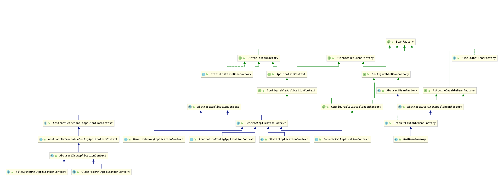

## 1. IOC 的主要实现

- **主要实现**
  1. java SE
     - java Beans
     - java ServiceLoader SPI
     - JNDI (java naming and directory interface)
  2. java EE
     - EJB (Enterprise Java Beans)
     - Servlet
  3. 开源
     - Spring
     - Google Guice

## 1.1 JavaBeans 传统IOC容器

:::tip tip
主要用于java awt图形化界面设计
:::

- <mark>特性？</mark>

  1. 依赖查找
  2. 生命周期管理
  3. 配置元信息
  4. 事件
  5. 自定义
  6. 资源管理
  7. 持久化
- <mark>常见类</mark>

  - <font color='red'><code>Introspector</code> 内省，用于操作Bean</font>
  - <font color='red'><code>BeanInfo</code>: Java Beans 的信息，包含以下的几个方法</font>

    - getBeanDescriptor(): 获取Bean描述符
    - getEventSetDescriptors(): 获取事件描述符
    - getPropertyDescriptors() : 获取属性描述符
      - 可写、可读方法名
    - getMethodDescriptors(): 获取方法描述符

```java
public class Person {
    String name;
    Integer age;

    public String getName() {
        return name;
    }

    public void setName(String name) {
        this.name = name;
    }

    public Integer getAge() {
        return age;
    }

    public void setAge(Integer age) {
        this.age = age;
    }

    @Override
    public String toString() {
        return "Person{" +
                "name='" + name + '\'' +
                ", age=" + age +
                '}';
    }
}


public class BeanInfoDemo {
    public static void main(String[] args) throws IntrospectionException {
        BeanInfo beanInfo = Introspector.getBeanInfo(Person.class,Object.class);
        Stream.of(beanInfo.getPropertyDescriptors()).forEach(System.out::println);
    }
}

/**

java.beans.PropertyDescriptor[name=age; propertyType=class java.lang.Integer; readMethod=public java.lang.Integer com.geekbang.demo.BeanInfo.Person.getAge(); writeMethod=public void com.geekbang.demo.BeanInfo.Person.setAge(java.lang.Integer)]

java.beans.PropertyDescriptor[name=name; propertyType=class java.lang.String; readMethod=public java.lang.String com.geekbang.demo.BeanInfo.Person.getName(); writeMethod=public void com.geekbang.demo.BeanInfo.Person.setName(java.lang.String)]
*/
```


# 2. Spring IOC

## 2.1 依赖查找->查找Bean对象

1. 根据Bean的 名称查找
2. 根据Bean的 类型查找
   - 单个Bean对象
   - 集合Bean对象
3. 根据Bean 名称+类型查找
4. 根据Java注解查找
   - 单个Bean对象
   - 集合Bean对象

## 2.2 依赖注入->注入Bean以及非Bean对象

1. 根据Bean的名称注入
2. 根据Bean的类型注入
   - 单个Bean对象
   - 集合Bean对象
3. 注入容器内建 Bean对象 与 非Bean对象
   - 内建Bean
     - 比如:environment、systemProperties、messageSource、applicationEventMulticaster...
   - 非Bean对象
     - 比如: BeanFactory、ResourceLoader、ApplicationEventPublisher
4. 注入类型
   - 实时注入
   - 延迟注入

**方式1. 手动注入**

```xml
<?xml version="1.0" encoding="UTF-8"?>
<beans xmlns="http://www.springframework.org/schema/beans"
       xmlns:xsi="http://www.w3.org/2001/XMLSchema-instance" xmlns:util="http://www.springframework.org/schema/util"
       xsi:schemaLocation="http://www.springframework.org/schema/beans http://www.springframework.org/schema/beans/spring-beans.xsd http://www.springframework.org/schema/util https://www.springframework.org/schema/util/spring-util.xsd">
    
  	<!-- Bean的名称注入 -->
  	<bean id="person" class="com.geekbang.demo.BeanInfo.Person" >
        <property name="age" value="18"/>
        <property name="name" value="yoey"/>
    </bean>
    <bean id="person2" class="com.geekbang.demo.BeanInfo.Person" >
        <property name="age" value="18"/>
        <property name="name" value="yoey2"/>
    </bean>
    <bean id="school" class="com.geekbang.demo.BeanInfo.School">
        <property name="name" value="cz"/>
        <property name="address" value="cz"/>
    </bean>
		
  <!-- 集合Bean 的注入 -->
    <bean id="userRepo" class="com.geekbang.demo.repository.UserRepository">
        <property name="users">
            <util:list id="user1">
                <ref bean="person"/>
                <ref bean="person2"/>
            </util:list>
        </property>
    </bean>
</beans>
```


**方式2. 自动注入 autowire**

```xml
<?xml version="1.0" encoding="UTF-8"?>
<beans xmlns="http://www.springframework.org/schema/beans"
       xmlns:xsi="http://www.w3.org/2001/XMLSchema-instance" xmlns:util="http://www.springframework.org/schema/util"
       xsi:schemaLocation="http://www.springframework.org/schema/beans http://www.springframework.org/schema/beans/spring-beans.xsd http://www.springframework.org/schema/util https://www.springframework.org/schema/util/spring-util.xsd">
    <bean id="person2" class="com.geekbang.demo.BeanInfo.Person" >
        <property name="age" value="18"/>
        <property name="name" value="yoey2"/>
    </bean>
    <bean id="person" class="com.geekbang.demo.BeanInfo.Person" >
        <property name="age" value="18"/>
        <property name="name" value="yoey"/>
    </bean>
    <bean id="school" class="com.geekbang.demo.BeanInfo.School">
        <property name="name" value="cz"/>
        <property name="address" value="cz"/>
    </bean>

  	<!-- 自动注入（通过类型） -->
    <bean id="userRepo" class="com.geekbang.demo.repository.UserRepository" autowire="byType">
    </bean>
</beans>
```


**方式3. 注入容器内建Bean对象与 非Bean对象**

```java
public class UserRepository {
    /**
     * 集合
     */
    private List<Person>   users;
    private String name;
    private School school;

    /**
     * 非Bean 对象 
     *  其中 ResourceLoader、ApplicationEventPublisher、ApplicationContext 都是Spring应用上下文本身
     *  beanFactory = ApplicationContext.getBeanFactory()
     */
    private BeanFactory beanFactory;
    private ResourceLoader resourceLoader; 
    private ApplicationEventPublisher applicationEventPublisher;
    private ApplicationContext applicationContext;

    /**
     * 内建Bean
     */
    private Environment environment;

	 // getter、setter...
}
```


## 2.3 依赖的来源

- <font color='red'>自定义的Bean</font>
- <font color='red'>容器内建 Bean对象</font>

  - 比如 Environment
- <font color='red'>容器内建依赖(非Bean对象)</font>

  - 比如BeanFactory

## 2.4 Spring IOC 配置元信息

- Bean定义信息
  - 基于XMl
  - 基于Properties 文件
  - 基于 Java注解
  - 基于 Java Api
- IOC 配置信息
  - 基于XMl
  - 基于 Java注解
  - 基于 Java Api
- 外部化配置文件
  - 基于 Java注解

## 2.5 谁是IOC容器？

- 问题: <font color='red'>BeanFactory 和 ApplicationContext 谁是IOC容器？</font> 

  1. BeanFactory 包含IOC的底层实现
  2. ApplicationContext 是 BeanFactory的一个实现 (是BeanFactory的超集，实现一些企业化功能)
     - <font color='red'>实现的方式采用了组合模式，传入一个 <code>DefaultListableBeanFactory</code>,获取容器中的对象实际通过 这个传入的对象实现的</font> 
  3. <font color='blue'>获取了ApplicationContext 后，需要通过<code>getBeanFactory()</code> 方法才能得到最底层的实现，而不是直接强转为BeanFactory</font> 

注意: <mark>BeanFactory 是底层的 IOC容器, 而 ApplicationContext也是IOC容器，并且基于BeanFactory进行了拓展</mark>

```java
public abstract class AbstractRefreshableApplicationContext extends AbstractApplicationContext {

	@Nullable
	private Boolean allowBeanDefinitionOverriding;

	@Nullable
	private Boolean allowCircularReferences;

	/** Bean factory for this context. */
	@Nullable
	private DefaultListableBeanFactory beanFactory;

	// ...
}
```


### 2.5.1 Spring应用上下文特性

- ApplicationContext 除了提供 IOC容器的功能，还有提供以下功能：
  1. 面向切面 -> AOP
  2. 配置元信息 -> Configuration MetaData
  3. 资源管理 -> Resource
  4. 事件 -> Events
  5. 国际化 -> i18n
  6. 注解 -> Annotations
  7. Environment 抽象 

### 2.5.2 IOC容器的选择

- 问题: <font color='red'>BeanFactory 和 ApplicationContext 应该选择哪一个使用？</font> 

**方式1：使用底层的IOC容器 - BeanFactory**

```java
public class IOCContainerDemo {
    public static void main(String[] args) {
        // 1. 创建BeanFactory
        DefaultListableBeanFactory listableBeanFactory = new DefaultListableBeanFactory();
        XmlBeanDefinitionReader reader = new XmlBeanDefinitionReader(listableBeanFactory);

        // 2. 加载配置
        int beanDefinitions = reader.loadBeanDefinitions("classpath:/META-INF/application.xml");
        System.out.println("Bean 加载的数量"+ beanDefinitions);

        // 3.获取Bean
        UserRepository userRepository = (UserRepository) listableBeanFactory.getBean("userRepo");
        System.out.println(userRepository);
    }
}
```


**方式2：使用 ApplicationContext**

```java
public class ApplicationContextContainer {
    public static void main(String[] args) {
        // 1. 创建pring应用上下文
        AnnotationConfigApplicationContext applicationContext = new AnnotationConfigApplicationContext();

        // 2. 将当前类作为配置类
        applicationContext.register(ApplicationContextContainer.class);

        // 3. 启动Spring应用上下文
        applicationContext.refresh();

        // 4.获取Bean
        Person person = (Person) applicationContext.getBean("person");
        System.out.println(person);
    }

    @Bean
    public Person person(){
        Person person = new Person();
        person.setName("11");
        person.setAge(22);
        return person;
    }
}
```


## 2.6 Spring应用上下文容器生命周期

- 包含以下生命周期
  1. 启动 -> refresh()
  2. 运行
  3. 停止 -> close()

## 2.7 BeanFactory 依赖图



