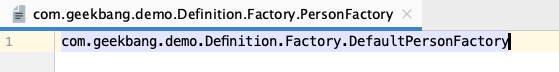

## 1. Spring Bean

### 1.1 BeanDefinition

- <font color='red'><code>BeanDefinition</code> 是Spring中定义Bean的配置元信息接口,用于存储Bean的定义信息，包含</font> 

  1. Bean 的类名
  2. Bean 的行为元素，比如作用域、自动绑定的模式、生命周期回调
  3. 其他Bean的引用，也叫做依赖（Dependencies）
  4. 配置设置，比如Bean的属性(Properties)

#### 1.1.2 BeanDefinition 元信息

| 属性                     | 说明                                           |
| ------------------------ | ---------------------------------------------- |
| Class                    | Bean全类名，必须是具体类，不能是抽象类或者接口 |
| Name                     | Bean的名称/ID                                  |
| Scope                    | Bean的作用域(singleton、propertype)            |
| Constructor arguments    | Bean 构造器参数（用于依赖注入）                |
| Properties               | Bean 属性设置 （用于依赖注入）                 |
| Autowiring mode          | Bean 自动绑定模式（比如： 通过名称 byName）    |
| Lazy initialazation mode | Bean 延迟初始化模式 （延迟和非延迟）           |
| Initialization method    | Bean 初始化回调方法名称                        |
| Destruction method       | Bean 销毁回调方法名称                          |


### 1.2 如何构建BeanDefinition？

* **包含以下的几种方式构建BeanDefinition**
  1. 通过 <font color='#f535e8'>`BeanDefinitionBuilder`</font> 
  2. 通过 <font color='#f535e8'>`AbstractBeanDefinition` 以及派生类</font> 

:::danger 注意
 BeanDefinition 并非Bean的最终态,还可以对Bean进行额外的设置

 比如: 设置Bean的初始化方法、销毁方法等等
:::

<br/>

**方式一： 通过BeanDefinitionBuilder**

:::caution GenericBeanDefinition 和 RootBeanDefinition的区别？
- GenericBeanDefinition 可以设置parent属性
- RootBeanDefinition 是根部、顶层的Bean定义信息，无法设置parent属性	
:::

```java
public void BeanDefinitionBuilderDemo(){
  // 1.通过 BeanDefinitionBuilder -> GenericBeanDefinition 可以设置parent,而 RootBeanDefinition 没有parent,已经是顶层的bean
  BeanDefinitionBuilder builder = BeanDefinitionBuilder.genericBeanDefinition(Person.class);
  
  // 2.进行属性设置
  builder.addPropertyValue("age",22);
  builder.addPropertyValue("name","yoey");
  
  // 3. 获取BeanDefinition 实例
  GenericBeanDefinition beanDefinition = (GenericBeanDefinition)builder.getBeanDefinition();
  
  // 4.BeanDefinition 并非Bean的最终态,还可以对Bean进行额外的设置
  beanDefinition.setInitMethodName("beanPostCon");
}
```


<br/>

**方式二： 通过AbstractBeanDefinition 以及派生类**

<font color='red'>GenericBeanDefinition 和RootBeanDefinition 都属于 AbstractBeanDefinition的子类</font>

```java
public void AbstractBeanDefinitionDemo(){
  // 1.创建一个AbstractBeanDefinition实现类 -> GenericBeanDefinition
  GenericBeanDefinition definition = new GenericBeanDefinition();

  // 2. 设置Bean的类型
  definition.setBeanClass(Person.class);

  // 3.设置Bean的属性,通过 MutablePropertyValues 进行批量的设置
  MutablePropertyValues propertyValues = new MutablePropertyValues();
  propertyValues.addPropertyValue("age",22);
  propertyValues.addPropertyValue("name","yoey");
  definition.setPropertyValues(propertyValues);

}
```


### 1.3 SpringBean 的命名？

:::tip Bean的名称

- <font color='blue'>每个Bean拥有一个或者多个标识符(identifiers)，这些标识符在Bean所在的容器必须是唯一的</font>

  - 通常，一个Bean只有一个标识符，也可以使用别名(Alias) 拓展
- 在基于XML的配置元信息中，通过 id/name 属性指定 Bean的标识符 -> 并非一定是 本地的Spring的配置文件，也可以是网络资源
  - 如果需要设置Bean的别名，可在 Bean的name属性后使用 逗号 分隔
- Bean的id/name 不是必须指定的，容器默认会为Bean生成一个唯一的名称
  - <font color='#f535e8'>通过 <code>BeanNameGenerator</code> 的实现类，比如注解注册使用 <code>AnnotationBeanNameGenerator</code></font> 

:::


#### 1.3.1 Bean的别名

- Bean别名的(Alias)的价值
  1. 复用现有的BeanDefinition
      - <font color='red'>即: 使用Bean的别名时，一定要存在这个Bean的定义</font>
  2. 更具有场景化的命名方法
      - `<alias name="Bean标识符" alias ="别名A"/>`
      - `<alias name="Bean标识符" alias ="别名B"/>`

①. 通过XML配置元信息指定Bean、配置Bean的别名

```xml
<!-- 通过name属性后面加上逗号区分name和别名 -->
<bean id="person2" class="com.geekbang.demo.BeanInfo.Person" name="person3,yoey2">
  <property name="age" value="18"/>
  <property name="name" value="yoey2"/>
</bean>
<bean id="person" class="com.geekbang.demo.BeanInfo.Person" >
  <property name="age" value="18"/>
  <property name="name" value="yoey"/>
</bean>
<alias name="person" alias="yoey"/>
```


②. 获取Bean

```java
public static void main(String[] args) {
  DefaultListableBeanFactory beanFactory = new DefaultListableBeanFactory();
  XmlBeanDefinitionReader reader = new XmlBeanDefinitionReader(beanFactory);
  int beanDefinitions = reader.loadBeanDefinitions("classpath:META-INF/application.xml");
  System.err.println("load Beans count:" + beanDefinitions);

  Person person = beanFactory.getBean("person", Person.class);
  Person yoey = beanFactory.getBean("yoey", Person.class);
  System.err.println("person别名指定的Bean 与 person是否相等:"+ (person == yoey));
  String[] names = beanFactory.getBeanNamesForType(Person.class);
  System.err.println("Person类型的Bean"+ Arrays.toString(names));

  Person person2 = beanFactory.getBean("person2", Person.class);
  Person yoey2 = beanFactory.getBean("yoey2", Person.class);
  System.err.println("person2别名指定的Bean 与 person2是否相等:"+ (person2 == yoey2));

}
/*
	load Beans count:3
	person别名指定的Bean 与 person是否相等:true
	Person类型的Bean[person2, person]
	person2别名指定的Bean 与 person2是否相等:true
*/
```


### 1.4 如何将BeanDefinition注册到IOC容器？

- 有以下的几种方式可以将BeanDefinition注册到IOC容器

  1. XML配置元信息
     - `<bean name="xxx"></bean>`
  2. Java 注解配置元信息
     - `@Bean`
     - `@Compoment`
     - `@Import`
  3. java api 配置元信息📌 -> < color='red'>Spring应用上下文一般都实现了 `BeanDefinitionRegistry`
     - 命名方式
       - `BeanDefinitionRegistry#registerBeanDefinition(String BeanName,BeanDefinition definition)`
     - 非命名方式
       - `BeanDefinitionReaderUtils#registerWithGeneratedName(AbstractBeanDefinition definition, BeanDefinitionRegistry registry)`
     - 配置类方式
       - `AnnotatedBeanDefinitionReader#register(...)`

#### 1.4.1 通过注解的方式注册

- <font color='red'>注意: 同一个Bean不会被多次注册!!</font>


  ```java
  @Import(AnnotationBeanDefinitionRegistryDemo.config.class)
  public class AnnotationBeanDefinitionRegistryDemo {
      public static void main(String[] args) {
          // 创建Spring 应用上下文
          AnnotationConfigApplicationContext ctx = new AnnotationConfigApplicationContext();
          // 注册config 为 ConfigurationClass (配置类)
          ctx.register(config.class);
          // 启动 Spring 应用上下文 -> 调用容器的刷新方法，会对Bean的定义信息进行初始化
          ctx.refresh();
  
          // 依赖查找
          System.err.println("config 类型的所有Beans"+ctx.getBeansOfType(config.class));
          System.err.println("Person 类型的所有Beans"+ctx.getBeansOfType(Person.class));
  
          // 关闭Spring 应用上下文
          ctx.close();
      }
  
      @Component  /** 采用@Component的方式注册Bean */
      public static class  config{
          @Bean
          public Person person(){
              Person person = new Person();
              person.setName("11");
              person.setAge(22);
              return person;
          }
      }
  }
  ```

  

#### 1.4.2 通过api的方式注册

:::tip 注意点

1. DefaultListableBeanFactory、GenericApplicationContext 实现了 BeanDefinitionRegistry接口，具有注册BeanDefinition的能力

2. AnnotationConfigApplicationContext 就是GenericApplicationContext的子类

:::

```java
public class APIBeanDefinitionDemo {
    public static void main(String[] args) {
        // 创建IOC容器
        DefaultListableBeanFactory beanFactory = new DefaultListableBeanFactory();
      
        // 通过api的方式注册Bean -> 当然这里也能传入Spring应用上下文对象
        registryByName(beanFactory,"yoey1");
        registryByType(beanFactory);
        registryByType(beanFactory);
        // 依赖查找
        String[] names = beanFactory.getBeanNamesForType(Person.class);
        System.err.println(Arrays.toString(names));
    }

    public static void registryByName(BeanDefinitionRegistry registry,String name){
        BeanDefinitionBuilder builder = BeanDefinitionBuilder.genericBeanDefinition(Person.class);
        builder.addPropertyValue("age",11);
        builder.addPropertyValue("name","yoey1");
        registry.registerBeanDefinition(name,builder.getBeanDefinition());
    }

    public static void registryByType(BeanDefinitionRegistry registry){
        BeanDefinitionBuilder builder = BeanDefinitionBuilder.genericBeanDefinition(Person.class);
        builder.addPropertyValue("age",22);
        builder.addPropertyValue("name","yoey2");
        BeanDefinitionReaderUtils.registerWithGeneratedName(builder.getBeanDefinition(),registry);
    }
}

/*
	[yoey1, com.geekbang.demo.BeanInfo.Person#0, com.geekbang.demo.BeanInfo.Person#1]
*/ 
```


#### 1.4.3 注册外部单体对象

- 将创建的对象注册到IOC容器中

```java
public class OutBeanDemo {
    public static void main(String[] args) {
        // 定义一个外部的单体类
        Person person = new Person();
        person.setName("11");
        person.setAge(22);

        // 通过IOC容器的 registerSingleton 注册 -> 或者通过Spring应用上下文获取底层IOC容器
        DefaultListableBeanFactory beanFactory = new DefaultListableBeanFactory();
        beanFactory.registerSingleton("person",person);

        //依赖查找
        Person bean = beanFactory.getBean("person", Person.class);
        System.out.println(bean);
    }
}
```


### 1.5 Bean的实例化方式有几种？

:::warning 注意

1、使用Spring应用上下文注册的BeanDefinition，只有通过调用上下文的`refresh()` 方法才能对Bean进行初始化/实例化

2、ClassPathXmlApplicationContext 加载Xml配置元信息时，内部会调用上下文的刷新方法实现Bean的实例化

:::

- <font color='red'>常规方式:</font> 

  1. 通过构造器 	  【 配置元信息:XML、java注解 和 java api 】
  2. 通过静态工厂方法  【 配置元信息:XML 和 java api 】
  3. 通过Bean工厂方法 【 配置元信息:XML 和 java api  】
  4. 通过FactoryBean 【 配置元信息:XML、java注解 和 java api 】
- <font color='red'>特殊方式</font>

  1. 通过<font color='#f535e8'>`ServiceLoaderFactoryBean`</font>  【 配置元信息:XML、java注解 和 java api 】
     - 也是FactoryBean 的一种方式
  2. 通过 <font color='#f535e8'>`AutowireCapableBeanFactory#createBean（Class，int，bool）`</font>  
  3. 通过<font color='#f535e8'>`BeanDefinitionRegistry#registryBeanDefinition(String,BeanDefinition)`</font> 向容器注册BeanDefinition，由容器实例化

#### 1.5.0 通过构造器、Setter注入

```xml
<!--通过属性Setter 注入-->
<bean id="yoey" class="com.geekbang.MyDemo1.Pojo.User">
  <property name="age" value="2"/>
  <property name="name" value="Yoey"/>
</bean>

<!-- 通过构造器注入 -->
<bean id="yoey2" class="com.geekbang.MyDemo1.Pojo.User">
  <constructor-arg name="age"  value="22"/>
  <constructor-arg name="name"  value="yoey"/>
</bean>
```


#### 1.5.1 静态工厂方法

- 操作步骤
  1. 在Bean类中定义静态方法，用于返回一个Bean
  2. 为Bean指定一个 <font color='#f535e8'>`factory-method`</font> 

①、 Bean类中指定静态方法，返回Bean对象

```java
public class Person {
    String name;
    Integer age;
  
    public static Person createUser(){
        Person person = new Person();
        person.setName("11");
        person.setAge(22);
        return person;
    }
}
```

②、 XML配置元信息时,通过 `factory-method` 指定 静态方法

```xml
<!--静态方法-->
<bean id="static-person" class="com.geekbang.demo.BeanInfo.Person" factory-method="createUser"/>
```


#### 1.5.2 Bean + 工厂方法

- 操作步骤
  1. 创建一个工厂类，其中定义返回Bean的方法
  2. 配置工厂类的Bean
  3. 在Bean的 <font color='#f535e8'>`factory-bean` </font>指定工厂类的Bean，<font color='#f535e8'>`factory-method`</font> 指定工厂类中返回Bean的方法

①、 创建一个工厂类，其中定义返回Bean对象的方法

```java
public interface PersonFactory {

    default Person createPerson(){
        return Person.createUser();
    }
}
```

②、 配置工厂类的Bean，并且 在Bean的`factory-bean` 指定工厂类的Bean，`factory-method` 指定工厂类中返回Bean的方法

```xml
<!--Bean工厂-->
<bean class="com.geekbang.demo.Definition.Factory.DefaultPersonFactory" id="factory"/>
<bean id="beanFactoryPerson" factory-bean="factory" factory-method="createPerson"/>
```


#### 1.5.3 FactoryBean

- 操作方式
  1. 创建一个类实现 <font color='#f535e8'>`FactoryBean<T>`</font> 接口
  2. 将上述的类注入到容器中
  3. 如果需要通过类型获取Bean时，这个类型就是 `T`

①、 创建一个类实现`FactoryBean<T>`
```java
public class PersonFactoryBean implements FactoryBean<Person> {
    @Override
    public Person getObject() throws Exception {
        Person person = new Person();
        person.setName("yoey");
        person.setAge(11);
        return person;
    }
    @Override
    public Class<?> getObjectType() {
        return null;
    }

    @Override
    public boolean isSingleton() {
        return true;
    }
}
```

②、 通过XML配置元信息的方式将FactoryBean的实现注入到容器中

```xml
<!--注入FactoryBean的实现-->
<bean id="personFactoryBean" class="com.geekbang.demo.Definition.PersonFactoryBean"/>
```

③、 获取FactoryBean的实现(类型就是FactoryBean 的泛型类型)

```java
public class FactoryBeanDemo {
    public static void main(String[] args) {
        ClassPathXmlApplicationContext ctx = new ClassPathXmlApplicationContext("classpath:/META-INF/application.xml");
        ctx.refresh();
        Person factoryBean = (Person)ctx.getBean("personFactoryBean");
        System.out.println(factoryBean);
    }
}
/*
	Person{name='yoey', age=11}
*/
```


#### 1.5.4 Java中的ServiceLoader

- 操作步骤
  1. 在classpath下创建 <font color='#f535e8'>`/META-INF/services`</font> 目录
  2. 在上述的目录中定义没有后缀的文件，文件名是接口的全类名
  3. 在上述的文件中配置该接口的实现类(全类名)
  4. 通过 <font color='#f535e8'>`ServiceLoader`</font>  加载类对象

①、 在`/META-INF/services` 中创建文件



②、 使用 ServiceLoader加载类对象

```java
 public static void main(String[] args) {
        ServiceLoader<PersonFactory> load = ServiceLoader.load(PersonFactory.class, ServiceLoaderFactoryBeanDemo.class.getClassLoader());
        Iterator<PersonFactory> iterator = load.iterator();
        while (iterator.hasNext()){
            PersonFactory next = iterator.next();
            System.out.println(next.createPerson());
        }
 }

/*
	Person{name='11', age=22}
*/

```


#### 1.5.5 ServiceLoaderFactoryBean

:::danger 注意

ServiceLoaderFactoryBean 也是FactoryBean 接口的一个实现类，其中返回的类型就是 `ServiceLoader`

:::

- 操作方式
  - 在classpath下创建 <font color='#f535e8'>`/META-INF/services`</font> 目录
  - 在上述的目录中定义没有后缀的文件，文件名是接口的全类名
  - 在上述的文件中配置该接口的实现类(全类名)
  - 在XML配置元信息中指定<font color='#f535e8'>`ServiceLoaderFactoryBean`</font> 的Bean，并且配置 <font color='#f535e8'>`serviceType`</font> 属性
  - 获取 ServiceLoaderFactoryBean 的Bean进行操作

①、 XML配置元信息

```xml
<!--ServiceLoadFactoryBean-->
<bean id="personServiceLoader" class="org.springframework.beans.factory.serviceloader.ServiceLoaderFactoryBean">
  <property name="serviceType" value="com.geekbang.demo.Definition.Factory.PersonFactory"/>
</bean>
```

②、 从容器中获取ServiceLoader

```java
public static void main(String[] args) {
  ClassPathXmlApplicationContext context = new ClassPathXmlApplicationContext("classpath:/META-INF/application-slh.xml");
  ServiceLoader<PersonFactory> loader = context.getBean("personServiceLoader", ServiceLoader.class);
  Iterator<PersonFactory> iterator = loader.iterator();
  while (iterator.hasNext()){
    PersonFactory next = iterator.next();
    System.out.println(next.createPerson());
  }
}
```


### 1.6 Bean的初始化方式有几种？

:::tip tip

- Bean的生命周期( Bean 的创建 -> 初始化 -> 销毁 )

  - 创建 Bean 实例
  - 为 Bean 的属性设置值和对其他 Bean 的引用

  - <font color='blue'>调用 Bean 的初始化方法</font> 
  - Bean 可以使用了
  - 当容器关闭时, 调用 Bean 的销毁方法

- Bean 的创建 ?

  - 单例的
    - 会在容器启动的时候创建 Bean 对象 , 同时会调用初始化方法

  - 多实例的  
    - 会在每次获取 Bean 的时候创建
    - 同时也会在 获取时调用初始化方法 ,但是容器不会将其进行销毁

:::

- Bean的初始化(Initialization)
  1. `@PostConstruct` 标注方法 -> 基于AnnotationConfigApplicationContext 调用
  2. 实现`InitializingBean`接口的afterPropertiesSet()
  3. 自定义初始化方法
     - XML配置: `<bean init-method="xxx"/>`
     - java 注解: `@Bean(initMethod=“xxx”)`
     - java api: `AbstractBeanDefinition#setInitMethodName(String)`

:::danger 注意:Bean各个初始化方法的执行顺序

<font color='blue'>@PostConstruct -> 实现InitializingBean -> 自定义初始化方法</font>

:::


①、 Bean对象

```java
public class Person implements InitializingBean {
    String name;
    Integer age;
    public static Person createUser(){
        Person person = new Person();
        person.setName("11");
        person.setAge(22);
        return person;
    }

    /**
     * 使用 {@link @PostConstruct} 注解标识的Bean 初始化方法
     */
    @PostConstruct
    public void init(){
        System.err.println("使用@PostConstruct 注解...");
    }

    public void  beanPostCon(){
        System.err.println("自定义初始化方法:@Bean initMethod...");
    }
	
 	 // 实现 InitializingBean的 afterPropertiesSet方法
    @Override
    public void afterPropertiesSet() throws Exception {
        System.err.println("实现SpringInitializingBean ...");
    }
}
```


②、 通过注解方式注入Bean对象

```java
public class BeanConstructDemo {
    public static void main(String[] args) {
        // 创建一个注解驱动的Spring应用上下文
        AnnotationConfigApplicationContext context = new AnnotationConfigApplicationContext();
        context.register(BeanConstructDemo.class);
        context.refresh();
        //依赖查找
        Person bean = context.getBean(Person.class);
        System.out.println(bean);
        context.close();
    }

   // 自定义初始化方法通过@Bean 的name属性指定初始化方法
    @Bean(initMethod = "beanPostCon")
    public Person person(){
        Person person = new Person();
        person.setAge(22);
        person.setName("Yoey22");
        return person;
    }
}

/*
	使用@PostConstruct 注解...
  实现SpringInitializingBean ...
  自定义初始化方法:@Bean initMethod...
*/
```


#### 1.6.1 延迟初始化的Bean

- <mark>Bean的延迟初始化（Lazy Initialization）</mark>

  1. XML 配置: `<bean  lasy-init="true|false"/>`
  2. java 注解: `@Lazy(true)`

:::danger 延迟初始化与非延迟初始化的区别？

- 延迟初始化的Bean
  - **只有在获取 Bean 的时候调用初始化方法**
  - 如果有其他非延迟加载的Bean依赖于这个Bean，也会立即对这个Bean初始化
- 非延迟初始化
  - 在Spring应用上下文启动完成后,就会调用初始化方法

:::

**延迟加载的Bean**

可以看到，容器刷新的时候没有对Bean进行初始化,只是将Bean注册到容器，当尝试从容器中获取Bean的时候才会对Bean进行初始化

```java
public class AnnotationBeanFactoryDemo {
    public static void main(String[] args) {
        AnnotationConfigApplicationContext ctx = new AnnotationConfigApplicationContext();
        ctx.register(AnnotationBeanFactoryDemo.class);
        System.out.println("refresh start...");
        ctx.refresh();
        System.out.println("refresh end...");
        Iterator<String> iterator = ctx.getBeanFactory().getBeanNamesIterator();
        while (iterator.hasNext()){
            String next = iterator.next();
            System.out.println(next);
        }
        System.out.println("-----");
        User user = (User)ctx.getBean("user");
        ctx.close();

    }
    @Lazy //Bean 的懒加载
    @Bean
    public User user(){
        User user  = new User(33,"create by DefaultUserFactory");
        user.setName("create by DefaultUserFactory");
        user.setAge(33);
        return user;
    }
}

/*
refresh start...
refresh end...
org.springframework.context.annotation.internalConfigurationAnnotationProcessor
org.springframework.context.annotation.internalAutowiredAnnotationProcessor
org.springframework.context.annotation.internalCommonAnnotationProcessor
org.springframework.context.event.internalEventListenerProcessor
org.springframework.context.event.internalEventListenerFactory
annotationBeanFactoryDemo
user
environment
systemProperties
systemEnvironment
org.springframework.context.annotation.ConfigurationClassPostProcessor.importRegistry
messageSource
applicationEventMulticaster
lifecycleProcessor
-----
User 有参构造器调用...
初始化 User name 属性...
初始化 User age 属性...
@PostConstruct ....
afterPropertiesSet ....
*/
```


### 1.7 Bean的销毁

- Bean的销毁
  1. `@PreDestroy`标注方法
  2. 实现`DisposableBean`接口的 destroy()方法
  3. 自定义销毁方法
     - XML配置: `<bean destroy="xxx"/>`
     - java 注解: `@Bean(destroy="xxx")`
     - Java api: `AbstractBeanDefinition#setDestroyMethodName(String)`

:::danger 注意:Bean各个销毁方法的执行顺序

<font color='blue'>@PreDestroy -> 实现DisposableBean -> 自定义销毁方法</font>

:::


### 1.8 IOC容器的Bean能够被垃圾回收吗？

- 可以，通过<font color='red'>关闭Spring容器(应用上下文)</font>


