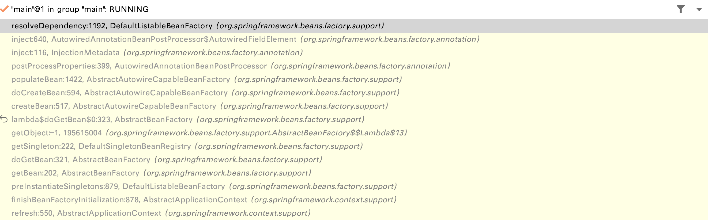
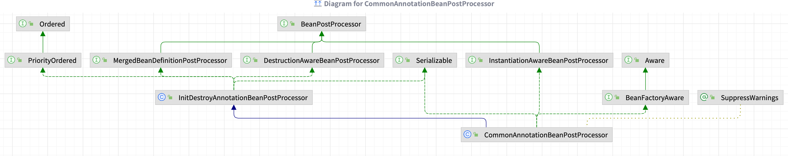
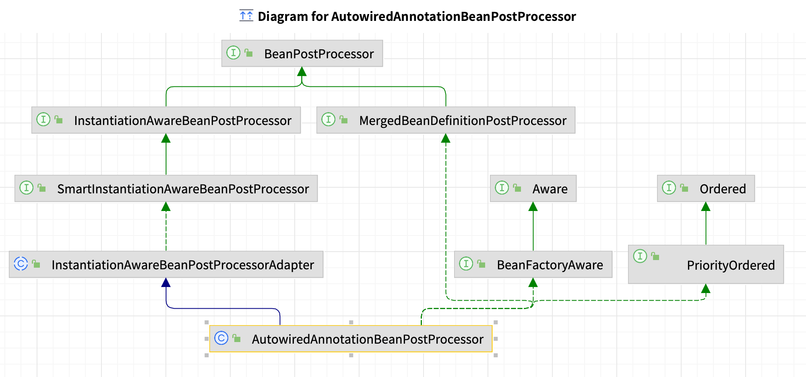

## 依赖注入的模式与类型

**依赖注入的模式**

1. 手动模式(配置或者编程的方式,提前安排注入规则)
    - XML资源配置元信息
    - java注解配置元信息
    - api配置元信息(手动定义 BeanDefinition,Spring 最底层的实现)
2. 自动模式(实现方提供依赖自动关联的方式,按照内建的方式注入规则)
    - Autowiring (自动绑定)

**`依赖注入的类型`**

| 依赖注入的类型    | 配置元数据举例    |
| -------------- | ----------------------------------------------- |
| `Setter方法`    | <property name="user" ref="userBean" / >        |
| `构造器`        | <constructor-arg name="user" ref="userBean" / > |
| `字段`          | @Autowired User user;                         |
| `方法`          | @Autowired public void user(User user){…}     |
| `接口回调`       | Class MyBean implements BeanFactoryAware{…}   |

## 自动绑定/注入（Autowiring）

**这里的 Autowiring 并不等价于 @Autowire 注解**,这里的 Autowiring 指的是AbstractBeanDefinition 的 autowireMode 不同属性值可能产生的问题。

对于自动绑定而言, 如果 autowireMode 的值等于 `byName/byType`,那么即使不使用@Autwired 注解,也会将依赖注入进来,这就是所谓的 **"自动绑定"**。

但是如果 autowireMode 使用默认的 `no`,那么就意味着需要手动的绑定依赖,比如说@Inject、@Resource、@Autowired。所以说 **@Autowired 还是属于手动注入**

### 自动绑定/注入的使用场景

| 模式          | 说明                                                         |
| ------------- | ------------------------------------------------------------ |
| `no`          | 默认值,没有激活自动装配,需要手动指定依赖注入的对象,比如 @Autwired、@Resource、手动设置值...         |
| `byName`      | 根据被注入属性的**名称**作为Bean名称进行依赖查找,并将查找到的对象设置到该属性 |
| `byType`      | 根据被注入属性的**类型**作为依赖类型进行依赖查找,并将查找到的对象设置到该属性 |
| `constructor` | 特殊的 **byType**类型,用于构造器参数 |

参考的枚举 : `org.springframework.beans.factory.annotation.Autowire`

### 自动绑定/注入的不足之处

1. `property`、`constructor-arg` 的配置信息会覆盖掉自动绑定,并且无法对`primitives`(基本类型)、String、Classes 进行自动绑定
2. 自动绑定并不精准,需要自己把控对依赖的定义
    - 比如 IOC 中有一个 name=user 的 Bean,且是 User 类型,如果有一个 Man 类型的,属性名也为 user 的 Bean,在设置 `autowire(no | byType | byName)` 的时候选择byName 的话,就会出错

### 自动绑定与@Autowired 区别

:::danger 区分自动绑定与 @Autowired

- 自动绑定是这个Bean的AbstractBeanDefinition#autowireMode 设置为 byName/byType,然后Spring会自动将容器中满足条件的Bean注入到属性中(**不用@Autowired 注解也会注入到容器中)**
- **@Autowired 则是手动从容器中查找指定的Bean进行注入**
  - 默认是以byType的方式进行查找
  - 如果有多个类型匹配的Bean,就会通过属性名+byName的方式进行依赖查找

:::

## Setter方法注入

**实现方法**

- 手动模式
  - XML资源配置信息
  - java注解配置元信息
  - api配置元信息
- ~~自动模式~~
  - byType
  - byName

### 基于XML资源的 Setter 方法依赖注入

**①、XML资源配置**

```xml
<!--基于 XML 资源的依赖 Setter 方法注入-->
<bean id="xml-dependency-injection"
      class="ioc.overview.Domain.User">
    <property name="id" value="22"/>
    <property name="name" value="xml-dependency-injection"/>
</bean>
```

**②、将Bean注入容器并且进行依赖查找**

```java
/**
 * <b>基于 XML 资源的依赖 Setter 方法注入示例</b>
 *
 * @author <a href="mailto:zhuyuliangm@gmail.com">yuliang zhu</a>
 */
public class XmlDependencyInjectionDemo {
  public static void main(String[] args) {
    // 创建一个 BeanFactory
    DefaultListableBeanFactory beanFactory = new DefaultListableBeanFactory();

    // 创建 XmlBeanDefinitionReader,并且读取 XML 资源文件
    XmlBeanDefinitionReader xmlBeanDefinitionReader = new XmlBeanDefinitionReader(beanFactory);
    xmlBeanDefinitionReader.loadBeanDefinitions("META-INF/XmlDependencyInjection.xml");

    User bean = beanFactory.getBean("xml-dependency-injection", User.class);
    // out: User{id=22, name='xml-dependency-injection'}
    System.out.println(bean);
  }
}

```

### 基于java注解的依赖注入

```java
/**
 * <b>基于 Java注解</b>
 * @author <a href="mailto:zhuyuliangm@gmail.com">yuliang zhu</a>
 */
public class AnnotationDependencyInjectionDemo {
  public static void main(String[] args) {
    // 创建注解的 Spring 应用上下文对象
    AnnotationConfigApplicationContext ctx = new AnnotationConfigApplicationContext();
    // 注册配置类
    ctx.register(UserConfig.class);
    // 刷新应用上下文
    ctx.refresh();

    // 获取 Bean 对象
    User user = ctx.getBean("user", User.class);
    // out: User{id=33, name='annotation-dependency-injection'}
    System.out.println(user);
  }
}

/**
 * 配置类
 */
class UserConfig {
  @Bean
  public User user() {
    User user = new User();
    user.setId(33L);
    user.setName("annotation-dependency-injection");
    return user;
  }
}
```

### 基于api配置元信息

```java
public static void main(String[] args) {
  DefaultListableBeanFactory beanFactory = new DefaultListableBeanFactory();

  // 创建一个 User 的 BeanDefinition
  RootBeanDefinition userBean = new RootBeanDefinition();
  userBean.setBeanClass(User.class);

  MutablePropertyValues values = new MutablePropertyValues();
  values.add("age",22);
  values.add("name","yoey");
  userBean.setPropertyValues(values);
  // 注册 User 的 BeanDefinition
  beanFactory.registerBeanDefinition("user",userBean);
  System.err.println("注入一个BeanDefinition...");
  // 没有初始化的Bean,在调用getBean方法时会进行初始化
  System.err.println(beanFactory.getBean("user"));
}

/*
  注入一个BeanDefinition...
  User 无参构造器调用...
  初始化 User name 属性...
  User{age=22, name='yoey'}
*/
```

### 自动模式

> 自动模式就是设置 Bean 的 autowire (默认是 no),byName/byType

- 创建一个 XML 的配置文件,在 Bean 的定义信息中设置了 autowire 模式诶 byType

  ```xml
  <!--
      导入 Spring 的配置文件(基于 XML 的 Setter 依赖注入)
      会注入 User 类型的 Bean 组件
  -->
  <import resource="XmlDependencyInjection.xml"/>

  <!--基于 XML 资源的依赖 Setter 方法注入-->
  <bean id="autowiring-dependency-injection"
        class="domain.UserHolder"
        autowire="byType">
  </bean>
  ```

- 测试代码

  ```java
  /**
  * <b>自动注入</b>
  *
  * @author <a href="mailto:zhuyuliangm@gmail.com">yuliang zhu</a>
  */
  public class AutoWiringInjectionDemo {
    public static void main(String[] args) {
      // 创建一个 BeanFactory
      DefaultListableBeanFactory beanFactory = new DefaultListableBeanFactory();
  
      // 创建 XmlBeanDefinitionReader,并且读取 XML 资源文件
      XmlBeanDefinitionReader xmlBeanDefinitionReader = new XmlBeanDefinitionReader(beanFactory);
      xmlBeanDefinitionReader.loadBeanDefinitions("META-INF/AutowiringDependencyInjection.xml");
  
      UserHolder userHolder = beanFactory.getBean("autowiring-dependency-injection", UserHolder.class);
      // out: UserHolder{user=User{id=22, name='xml-dependency-injection'}}
      System.out.println(userHolder);
    }
  }
  ```

## 构造器注入

**实现方法**

- 手动模式
  - XML资源配置信息
  - java注解配置元信息
  - api配置元信息
- ~~自动模式~~
  - constructor (autowire 模式设置为 constructor)

:::tip 说明

1. **Setter 注入的顺序是不确定的**,因为 java 反射 API 返回的 public 方法顺序并非定义顺序,所以无法控制 Setter 注入的先后顺序
2. 由于 Setter 注入的顺序的不确定性,所以如果字段之间存在依赖关系的话,容易出现问题
3. **构造器注入的顺序是确定的**

:::

### 基于Xml

```xml
<!--  constructor注入  -->
<bean id="constructor-dependency-injection"
      class="ioc.overview.Domain.User">
    <constructor-arg index="0" value="33"/>
    <constructor-arg index="1" value="constructor-dependency-injection"/>
</bean>
```

然后通过 BeanFactory 进行测试:

```java
/**
 * <b>基于 XML 的构造器的依赖注入</b>
 *
 * @author <a href="mailto:zhuyuliangm@gmail.com">yuliang zhu</a>
 */
public class ConstructorDependencyInjectionDemo {
  static final String CONFIG_PATH = "META-INF/ConstructorDependencyInjection.xml";
  public static void main(String[] args) {
    // 创建一个 BeanFactory
    DefaultListableBeanFactory beanFactory = new DefaultListableBeanFactory();
    // 创建一个 BeanDefinitionReader 读取 BeanDefinition
    XmlBeanDefinitionReader xmlBeanDefinitionReader = new XmlBeanDefinitionReader(beanFactory);
    xmlBeanDefinitionReader.loadBeanDefinitions(CONFIG_PATH);

    User user = beanFactory.getBean("constructor-dependency-injection", User.class);
    // out: User{id=33, name='constructor-dependency-injection'}
    System.out.println(user);
  }
}

```

### 基于java注解

下面示例的配置类中, **UserHolder userHolder (User user),容器会自动注入一个 User 类型的Bean组件**

```java
/**
 * 创建一个 User 的 Holder 类
 */
public class UserHolder {
    private User user;
    public UserHolder() {
    }
    public UserHolder(User user) {
        this.user = user;
    }
    // getter、setter、toString...
}

/**
 * <b>基于 Java 注解的构造器注入</b>
 *
 * @author <a href="mailto:zhuyuliangm@gmail.com">yuliang zhu</a>
 */
public class AnnotationDependencyInjectionDemo {
    static final String CONFIG_PATH = "META-INF/ConstructorDependencyInjection.xml";
    public static void main(String[] args) {
        AnnotationConfigApplicationContext ctx = new AnnotationConfigApplicationContext();
        ctx.register(UserConfig.class);

        // 通过 XMLBeanDefinitionReader 加载 XML 配置的 User Bean组检
        XmlBeanDefinitionReader reader = new XmlBeanDefinitionReader(ctx);
        reader.loadBeanDefinitions(CONFIG_PATH);
        // 刷新应用上下文
        ctx.refresh();

        UserHolder userHolder = ctx.getBean("userHolder", UserHolder.class);
        // out: UserHolder{user=User{id=33, name='constructor-dependency-injection'}}
        System.out.println(userHolder);
    }
}

/**
 * 创建一个配置类
 */

class UserConfig {
    @Bean
    public UserHolder userHolder (User user) {
        return new UserHolder(user);
    }
}

```

### 基于api的方式

> 值得注意的是,  beanFactory#getBean 时,如果这个 Bean 没有被初始化,会对这个 Bean 进行初始化

```java
public static void main(String[] args) {
  DefaultListableBeanFactory beanFactory = new DefaultListableBeanFactory();
  // 创建一个 User 的 BeanDefinition
  RootBeanDefinition userBean = new RootBeanDefinition();
  userBean.setBeanClass(User.class);

  ConstructorArgumentValues values = new ConstructorArgumentValues();
  values.addIndexedArgumentValue(0,22);
  values.addIndexedArgumentValue(1,"yoey2");
  userBean.setConstructorArgumentValues(values);
  beanFactory.registerBeanDefinition("user",userBean);
  System.err.println("注入一个BeanDefinition...");
  // 没有初始化化的Bean,在调用getBean方法时会进行初始化
  System.err.println(beanFactory.getBean("user"));
}

/*
  注入一个BeanDefinition...
  User 有参构造器调用...name:yoey2
  User{age=22, name='yoey2'}
*/
```

## 字段注入-> 实例字段/对象字段

**实现方式**

- 手动方式
  - Java 注解配置元信息
    - `@AutoWired`: **@Autowired 会忽略掉静态的字段**
    - `@Resource`
    - `@Inject`【可选,需要jsr330的依赖】

### @Autowired示例

- @Autowired 在非静态的字段上

  ```java
  /**
  * <b>字段注入(@Autowired 在非静态的字段上)</b>
  *
  * @author <a href="mailto:zhuyuliangm@gmail.com">yuliang zhu</a>
  */
  public class FieldInjectionDemo {
      @Autowired
      private User user;

      public static void main(String[] args) {
          AnnotationConfigApplicationContext ctx = new AnnotationConfigApplicationContext();
          // 注册配置类
          ctx.register(FieldInjectionDemo.class);
          ctx.refresh();

          // 注册的配置类也是一个 Bean 组件
          FieldInjectionDemo fieldInjectionDemo = ctx.getBean(FieldInjectionDemo.class);
          // out: User{id=22, name='constructor-annotation-injection'}
          System.out.println(fieldInjectionDemo.user);
      }

      @Bean
      public User user(){
          return new User(22L, "constructor-annotation-injection");
      }
  }
  ```

- @Autowired 在静态的字段上(忽略掉静态的字段)

  ```java
  /**
  * <b>字段注入(@Autowired 在静态的字段上)</b>
  *
  * @author <a href="mailto:zhuyuliangm@gmail.com">yuliang zhu</a>
  */
  public class FieldInjectionInStaticDemo {
      @Autowired
      private static User user;
  
      public static void main(String[] args) {
          AnnotationConfigApplicationContext ctx = new AnnotationConfigApplicationContext();
          // 注册配置类
          ctx.register(FieldInjectionInStaticDemo.class);
          ctx.refresh();
  
          // 注册的配置类也是一个 Bean 组件
          FieldInjectionInStaticDemo fieldInjectionDemo = ctx.getBean(FieldInjectionInStaticDemo.class);
          // out: null
          System.out.println(fieldInjectionDemo.user);
      }
  
      @Bean
      public User user(){
          return new User(22L, "constructor-annotation-injection");
      }
  }
  ```

## 方法注入

方法注入并不是@Autowired 的"专利",实际上有下面的实现方式(手动模式-java 注解):

1. `@Autowired`
2. `@Resource`
3. `@Bean`
4. `@Inject` [可选,需要jsr330的依赖]

:::tip 说明

1. **方法注入时,先把形参名作为 bean 的名称进行查找注入,如果查不到再通过 bean 的类型进行查找注入**

2. @Bean 注解本质上不是一个方法注入的注解手段,而是注册 BeanDefinition 的注解手段

:::

### @Bean的方式

> 在上面的[构造器 java 注解注的示例中有提到](依赖注入#基于java注解)

**①、xml中配置一个Bean**

注入两个User类型的Bean以及一个Address类型的Bean

```xml
<bean id="user"  class="com.geekbang.dependencyInjectionDemo.pojo.User">
  <property name="age" value="22"/>
  <property name="name" value="yoey"/>
</bean>

<bean id="user2"  class="com.geekbang.dependencyInjectionDemo.pojo.User">
  <property name="age" value="22"/>
  <property name="name" value="yoey2"/>
</bean>

<bean id="address" class="com.geekbang.MyDemo1.Pojo.Address">
  <property name="name" value="changzhou"/>
</bean>
```

**②、测试使用 @Bean进行方法注入**

- 由于有两个类型为User 的Bean[user、user2],所以方法注入时,把形参名称作为bean的名称从容器中查找并注入
- Address类型的bean只有一个,所以是通过默认的类型查找

```java
public static void byBeanAnnotation(){
  AnnotationConfigApplicationContext ctx = new AnnotationConfigApplicationContext();
  ctx.register(MethodInjectionDemo.class);
  // 加载xml中的bean
  String xmlResource = "classpath:/application-dependency-injection.xml";
  XmlBeanDefinitionReader reader = new XmlBeanDefinitionReader(ctx);
  reader.loadBeanDefinitions(xmlResource);
  ctx.refresh();
  System.err.println("bean1---->"+ctx.getBean("bean1"));
  /*
  	输出
  	User 无参构造器调用...
    初始化 User name 属性...
    User 无参构造器调用...
    初始化 User name 属性...
    bean1---->yoey:yoey2:changzhou
  */
}

/**
* 在 Xml资源配置中包含两个User类型的Bean[user与user2]以及一个Address类型的Bean[address]
*/
@Bean
public String bean1(User user, User user2, Address address2){
  return user.getName()+":"+user2.getName()+":"+address2.getName();
}
```

### @AutoWired的方式

```java
public static void byBeanAnnotation(){
  AnnotationConfigApplicationContext ctx = new AnnotationConfigApplicationContext();
  ctx.register(MethodInjectionDemo.class);
  // 加载xml中的bean
  String xmlResource = "classpath:/application-dependency-injection.xml";
  XmlBeanDefinitionReader reader = new XmlBeanDefinitionReader(ctx);
  reader.loadBeanDefinitions(xmlResource);
  ctx.refresh();
}

/**
* 通过 {@link Autowired} 进行方法注入
*/
private User user1;
private User user2;
private Address address;

@Autowired
public void byAutowired(User user2, User user, Address address2){
  this.user1 = user;
  this.user2 = user2;
  this.address = address2;
  System.out.println( "byAutowired->"+user1.getName()+":"+user2.getName()+":"+address.getName());
}

/*
	输出:
	User 无参构造器调用...
  初始化 User name 属性...
  User 无参构造器调用...
  初始化 User name 属性...
  byAutowired->yoey:yoey2:changzhou
*/
```

## Aware系列接口回调注入

**可以用于注入一些Spring内建的组件(Bean以及非 Bean)**

**自动模式**

| 内建接口                          | 作用说明                                    |
| ------------------------------- | ------------------------------------------ |
| `BeanFactoryAware`              | 获取IOC容器-BeanFactory                             |
| `ApplicationContextAware`       | 获取Spring应用上下文- ApplicationContext            |
| `ResourceLoaderAware`           | 获取资源加载器对象-ResourceLoader                   |
| `ApplicationEventPublisherAware`| 获取ApplicationEventPublisher对象,处理Spring的事件 |
| `EnvironmentAware`              | 获取Environment对象                                 |
| `BeanClassLoaderAware`          | 获取加载当前Bean Class 的ClassLoader                |
| `BeanNameAware`                 | 获取当前Bean的名称                                  |
| `MessageSourceAware`            | 获取MessageSource对象,用于Spring的国际化           |
| `EmbeddedValueResolverAware`    | 获取StringValueResolver对象,用于占位符处理         |

### 代码示例

```java
public class AwareInterfaceInjectionDemo implements BeanFactoryAware, ApplicationContextAware {
  private static BeanFactory beanFactory;
  private static ApplicationContext applicationContext;

  public static void main(String[] args) {
    AnnotationConfigApplicationContext ctx = new AnnotationConfigApplicationContext();
    ctx.register(AwareInterfaceInjectionDemo.class);
    ctx.refresh();
    System.err.println("通过ApplicationContextAware 注入的Spring应用上下文ApplicationContext 是否与当前的上下文对象相等:"+(ctx == applicationContext));
    System.err.println("通过BeanFactoryAware 注入的IOC容器 BeanFactory 是否与当前的IOC容器相等:"+(beanFactory == ctx.getBeanFactory()));
    ctx.close();
  }
  @Override
  public void setBeanFactory(BeanFactory beanFactory) throws BeansException {
    AwareInterfaceInjectionDemo.beanFactory = beanFactory;
  }

  @Override
  public void setApplicationContext(ApplicationContext applicationContext) throws BeansException {
    AwareInterfaceInjectionDemo.applicationContext = applicationContext;
  }
}

/*
	通过ApplicationContextAware 注入的Spring应用上下文ApplicationContext 是否与当前的上下文对象相等:true
	通过BeanFactoryAware 注入的IOC容器 beanFactory 是否与当前的IOC容器相等:true
*/

```

## 依赖注入类型的选择

- **注入选型**
  - 低依赖: 构造器注入
  - 多依赖: Setter注入
  - 便利性: 字段注入
  - 声明类: 方法注入

## 其他类型的注入

:::caution 注意
Spring进行依赖注入的时候,不仅仅可以是常见的对象,还可以有更加复杂的类型注入
:::

### 基础类型的注入

基础类型

1. 原生类型(Primitive): boolean、byte、char、short、int、float、double、long
2. 标量类型(Scalar): Number、Character、Boolean、Enum、Locale、Charset、Currency、Properties、UUID
3. 常规类型(General): Object、String、TimeZone、Calendar、Optional等
4. Spring类型: Resource、InputSource、Formatter等

#### 代码示例

**①、 定义JavaBean对象**

```java
public class Person {
    /**
     * 包含 原生类型:int /标量类型:Enum / 常规类型:String / Spring对象: Resource
     */
    private int age;
    private String name;
    private City city;
    private Resource configPath;
    // getter、setter、toString 方法
}
```

**②、 Xml资源配置**

在进行setter注入时,可以注入上述的类型 -> int、String、Enum、Resoure等等

```xml
<bean id = "basicInjectionBean" class="com.geekbang.dependencyInjectionDemo.pojo.Person">
  <property name="age" value="22"/>
  <property name="name" value="yoey"/>
  <property name="city" value="NanJing"/>
  <property name="configPath" value="classpath:/userConfig.properties"/>
</bean>
```

**③、容器加载XML配置信息并进行依赖查找**

```java
public class BasicInjectionDemo {
    public static void main(String[] args) {
        ClassPathXmlApplicationContext ctx = new ClassPathXmlApplicationContext();
        ctx.setConfigLocation("classpath:/application-dependency-injection.xml");
        ctx.refresh();
        Person person = ctx.getBean("basicInjectionBean", Person.class);
        System.err.println(person); 
        ctx.close();
    }
}
/*
  Person{age=22, name='yoey', city=NanJing, configPath=class path resource [userConfig.properties]}
*/
```

### 集合类型注入

- 集合类型
  - 数组类型(Array): 原生类型、标量类型、常规类型、Spring类型
  - 集合类型(Collection)
    - Collection: List、Set
    - Map: Properties

## 限定注入(@Qualifier)

- 使用注解 @Qualifier 限定
  - **通过Bean的名称 / ID 限定**
  - **通过分组限定**
- 基于注解 @Qualifier 拓展限定
  - 自定义 @Qualifier 注解的拓展(比如SpringCloud的 `@LoadBalanced`)

:::danger 注意

1. **默认情况下,一个Bean限定名就是Bean的名称,在进行依赖注入的时候可以通过@Qualifier注解指定注入哪个限定名的Bean【过滤】**
2. **可以手动的通过 @Qualifier 注解指定一个Bean的限定名,并且多个Bean的限定名可以相同**

:::

### Bean 名称限定

- 容器中包含两个User类型的Bean[user1、user2],通过@Qualifier注解,可以指定查找 bean 名称是user1的的Bean

- **操作步骤**
  - 在手动注入Bean的时候,加上 `@Qualifier` 注解,并且设置该注解的value属性为Bean的名称

```java
/**
 * <b>使用 Qualifier 注解来限定 Bean 的名称</b>
 *
 * @author <a href="mailto:zhuyuliangm@gmail.com">yuliang zhu</a>
 */
public class QualifierAnnotationInjectionDemo {
    @Autowired
    @Qualifier("user1")  // 指定 Bean 的名称或者 ID
    public User user;
    public static void main(String[] args) {
        AnnotationConfigApplicationContext ctx = new AnnotationConfigApplicationContext();
        ctx.register(QualifierAnnotationInjectionDemo.class);
        ctx.refresh();
        QualifierAnnotationInjectionDemo ctxBean = ctx.getBean(QualifierAnnotationInjectionDemo.class);
        // out: Qualifier限定Bean的名称查找:User{id=22, name='constructor-injection-user'}
        System.err.println("Qualifier限定Bean的名称查找:"+ctxBean.user);
        ctx.close();
    }

    @Bean
    public User user1(){
        return new User(22L,"constructor-injection-user");
    }

    @Bean
    public User user2() {
        User user = new User();
        user.setId(33L);
        user.setName("setter-injection-user");
        return user;
    }
}
```

### Qualifier 分组限定

> 分组限定就是将多个 Bean 组件划分到相同的一个逻辑分组里面

- 操作步骤
  1. 对多个Bean设置相同的限定名称(将 Bean 进行逻辑分组)
  2. 依赖注入的时候,通过 @Qualifier 注解,将符合限定名的一组 Bean 注入进来

**代码示例**

- 注入四个User类型的Bean,其中限定组名为"write"的有[userWriteable1、userWriteable2], [userNormal]的Bean也加上了@Qualifier注解,**没有指定限定名,默认是空**
- 在 @AutoWired 注解手动注入Bean的时候,通过指定 @Qualifier("write") 将限定名为"write"的Bean注入到 writeAbleUsers 集合中

```java
/**
 * <b>使用 @Qualifier 注解进行分组限定</b>
 *
 * @author <a href="mailto:zhuyuliangm@gmail.com">yuliang zhu</a>
 */
public class QualifierGroupInjectionDemo {

    @Autowired
    public List<User> allUsers;

    @Autowired
    @Qualifier
    public List<User> unGroupedUsers;

    @Autowired
    @Qualifier("write")
    public List<User> writeAbleUsers;

    public static void main(String[] args) {
        AnnotationConfigApplicationContext ctx = new AnnotationConfigApplicationContext();
        ctx.register(QualifierGroupInjectionDemo.class);
        ctx.refresh();
        QualifierGroupInjectionDemo ctxBean = ctx.getBean(QualifierGroupInjectionDemo.class);
        // out: Qualifier 所有的 User Bean :[
        //      User{id=11, name='userWriteable1'}, 
        //      User{id=22, name='userWriteable2'}, 
        //      User{id=44, name='userNormal'}, 
        //      User{id=44, name='user'}
        //   ]
        System.err.println("Qualifier 所有的 User Bean :"+ctxBean.allUsers);

        // out: Qualifier 分组限定[未分组的]查找:[User{id=44, name='userNormal'}]
        System.err.println("Qualifier 分组限定[未分组的]查找:"+ctxBean.unGroupedUsers);

        // out:Qualifier 分组限定[分组为write]查找:[
        //    User{id=11,name='userWriteable1'}, 
        //    User{id=22, name='userWriteable2'}
        //  ]
        System.err.println("Qualifier 分组限定[分组为write]查找:"+ctxBean.writeAbleUsers);
        ctx.close();
    }

    @Bean
    @Qualifier("write")
    public User userWriteable1() {
        return new User(11L, "userWriteable1");
    }
    @Bean
    @Qualifier("write")
    public User userWriteable2() {
        return new User(22L, "userWriteable2");
    }
    @Bean
    @Qualifier
    public User userNormal() {
        return new User(44L, "userNormal");
    }

    @Bean
    public User user() {
        return new User(55L, "user");
    }
}
```

### Qualifier 拓展

看下 @Qualifier 注解的信息:

```java
@Target({ ElementType.FIELD, 
          ElementType.METHOD,
          ElementType.PARAMETER,
          ElementType.TYPE,
          ElementType.ANNOTATION_TYPE})
@Retention(RetentionPolicy.RUNTIME)
@Inherited
@Documented
public @interface Qualifier {
  String value() default "";
}
```

- 可以看到, @Qualifier 可以标记在 *字段、方法、参数、类、注解*上。由于可以标记在**注解**上,所以我们可以**对 @Qualifier 注解进行拓展**

- 只需要定义一个注解,用 @Qualifier 注解标记即可

```java
/**
 * <b>基于 @Qualifier 注解进行拓展</b>
 * @author <a href="mailto:zhuyuliangm@gmail.com">yuliang zhu</a>
 */
@Target({ElementType.FIELD, ElementType.METHOD,
        ElementType.PARAMETER, ElementType.TYPE})
@Retention(RetentionPolicy.RUNTIME)
@Inherited
@Documented
@Qualifier
public @interface Write {
  String value() default "";
}

// 测试
/**
 * <b>使用 @Qualifier 拓展注解 @Write 进行分组限定</b>
 *
 * @author <a href="mailto:zhuyuliangm@gmail.com">yuliang zhu</a>
 */
public class QualifierGroupInjectionDemo2 {

    @Autowired
    @Qualifier
    public List<User> allUsers;

    @Autowired
    @Write
    public List<User> writeAbleUsers;

    public static void main(String[] args) {
        AnnotationConfigApplicationContext ctx = new AnnotationConfigApplicationContext();
        ctx.register(QualifierGroupInjectionDemo2.class);
        ctx.refresh();
        QualifierGroupInjectionDemo2 ctxBean = ctx.getBean(QualifierGroupInjectionDemo2.class);
        // out: Qualifier 注解限定分组的Bean  :[
        //  User{id=11, name='userWriteable1'},
        //  User{id=22, name='userWriteable2'},
        //  User{id=55, name='user'}]
        System.err.println("Qualifier 注解限定分组的Bean :"+ctxBean.allUsers);

        // out: Qualifier 拓展注解 @Write 的分组限定查找:[User{id=11, name='userWriteable1'}, 
        //  User{id=22, name='userWriteable2'}]
        System.err.println("Qualifier 拓展注解 @Write 的分组限定查找:"+ctxBean.writeAbleUsers);
        ctx.close();
    }

    @Bean
    @Write
    public User userWriteable1() {
        return new User(11L, "userWriteable1");
    }
    @Bean
    @Write
    public User userWriteable2() {
        return new User(22L, "userWriteable2");
    }

    @Bean
    @Qualifier
    public User user() {
        return new User(55L, "user");
    }
}
```

## 延迟依赖注入

我们知道可以通过 ObjectFactory/ObjectProvider 实现 Bean 的[延迟查找](依赖查找#bean-的延迟查找), 同样的还通过 ObjectFactory/ObjectProvider 的方式,**将容器中的依赖延迟注入进来,在要使用的时候,通过getXXX方法获取即可**

- 使用 api ObjectFactory 延迟注入
  - 单一类型
  - 集合类型
- 使用 api ObjectProvider 延迟注入 ✅
  - 单一类型
  - 集合类型

:::caution 注意
Bean 的延迟注入不等于延迟加载,延迟加载是在获取/使用 Bean 的时候才会调用初始化方法,而延迟注入则是使用的时候才会将依赖注入进来
:::

下面是利用 ObjectProvider 实现 Bean 的延迟注入:

```java
/**
 * <b>使用 ObjectProvider 实现依赖的延迟注入</b>
 *
 * @author <a href="mailto:zhuyuliangm@gmail.com">yuliang zhu</a>
 */
public class LazyInjectionDemo {

    // 由于 Spring 容器中存在两个 Person 类型的 Bean 对象,所以这里的 defaultPerson 是primary 的 Bean
    @Resource
    public Person defaultPerson;

    @Resource
    public ObjectProvider<Person> allPerson;

    public static void main(String[] args) {
        AnnotationConfigApplicationContext ctx = new AnnotationConfigApplicationContext();
        ctx.register(LazyInjectionDemo.class);
        ctx.refresh();
        LazyInjectionDemo injectionDemo = ctx.getBean(LazyInjectionDemo.class);
        // 获取实时注入的 Bean
        System.out.println("实时注入的 Bean: "+injectionDemo.defaultPerson);

        // 获取延迟注入的 Bean,其中延迟加载的 Bean 在获取的时候触发了 Bean 的初始化方法
        injectionDemo.allPerson.stream().forEach((bean) -> {
            System.out.println("延迟注入的 Bean:"+bean);
        });
        ctx.close();
        /*
          out:
          bean被初始化了
          实时注入的 Bean: Person{name='person2'}
          bean被初始化了
          延迟注入的 Bean:Person{name='person1'}
          延迟注入的 Bean:Person{name='person2'}
        */
    }

    @Bean
    @Lazy   // 延迟加载 不等于 延迟注入/延迟查找
    public Person person1() {
        return new Person("person1");
    }

    @Bean
    @Primary // 设置为默认 Bean
    public Person person2() {
        return new Person("person2");
    }
}

class Person implements InitializingBean {
    private String name;

    public Person() {
    }

    public Person(String name) {
        this.name = name;
    }

    @Override
    public String toString() {
        return "Person{" +
                "name='" + name + '\'' +
                '}';
    }

    // 定义 Bean 的初始化方法
    @Override
    public void afterPropertiesSet() throws Exception {
        System.out.println("bean被初始化了");
    }
}
```

---

## 依赖处理过程

1. **入口**:  `DefaultListableBeanFactory#resolveDependency`
2. **依赖描述符**:  `DependencyDescriptor`
3. **自动绑定候选对象处理器**:  `AutowireCandidateResolver`

### resolveDependency

```java title="DefaultListableBeanFactory#resolveDependency"
// DependencyDescriptor : 依赖描述符
// requestingBeanName: 请求的 Bean 名称
public Object resolveDependency(DependencyDescriptor descriptor, 
                                @Nullable String requestingBeanName,
                                @Nullable Set<String> autowiredBeanNames,
                                @Nullable TypeConverter typeConverter){
  descriptor.initParameterNameDiscovery(getParameterNameDiscoverer());
  // descriptor.getDependencyType => descriptor.field.getType()
  // 如果处理的依赖是 Option 类型
  if (Optional.class == descriptor.getDependencyType()) {
    return createOptionalDependency(descriptor, requestingBeanName);
  }
    // 如果处理的依赖是 ObjectFactory、ObjectProvider 类型
  else if (ObjectFactory.class == descriptor.getDependencyType() ||
      ObjectProvider.class == descriptor.getDependencyType()) {
    return new DependencyObjectProvider(descriptor, requestingBeanName);
  }
  // ..
  else {
    Object result = getAutowireCandidateResolver()
                    .getLazyResolutionProxyIfNecessary(descriptor,requestingBeanName);
    if (result == null) {
      // 进行依赖处理
      result = doResolveDependency(descriptor, 
                                    requestingBeanName, 
                                    autowiredBeanNames,
                                    typeConverter);
    }
    return result;
  }
}
```

在下面真正处理依赖的时候,会对多个依赖和单个依赖进行处理:

1. resolveMultipleBeans
2. findAutowireCandidates

```java title="DefaultListableBeanFactory#doResolveDependency"
@Nullable
public Object doResolveDependency(DependencyDescriptor descriptor, 
          @Nullable String beanName,
          @Nullable Set<String> autowiredBeanNames,
          @Nullable TypeConverter typeConverter) throws BeansException {

  try {
    // 获取依赖的类型
    Class<?> type = descriptor.getDependencyType();

    // 处理多个依赖的情况,比如上面的 type 是集合类型
    Object multipleBeans = resolveMultipleBeans(descriptor, beanName, autowiredBeanNames, typeConverter);
    if (multipleBeans != null) {
      return multipleBeans;
    }

    // 获取自动装配的依赖候选项
    Map<String, Object> matchingBeans = findAutowireCandidates(beanName, type, descriptor);

    // 如果没有,抛出 NoSuchBeanDefinitionException
    if (matchingBeans.isEmpty()) {
      if (isRequired(descriptor)) {
        raiseNoMatchingBeanFound(type, descriptor.getResolvableType(), descriptor);
      }
      return null;
    }

    String autowiredBeanName;
    Object instanceCandidate;
    // 如果有多个依赖候选项 
    if (matchingBeans.size() > 1) {
      // 选择唯一的依赖候选项 通过primary、Order...
      autowiredBeanName = determineAutowireCandidate(matchingBeans, descriptor);
      if (autowiredBeanName == null) {
        // 如果没有唯一的依赖,那么就抛出 NoUniqueBeanDefinitionException
        if (isRequired(descriptor) || !indicatesMultipleBeans(type)) {
          return descriptor.resolveNotUnique(descriptor.getResolvableType(), matchingBeans);
        }
        else {
          return null;
        }
      }
      // 通过依赖候选项的名称获取对应的示例对象
      instanceCandidate = matchingBeans.get(autowiredBeanName);
    }
    else {
      Map.Entry<String, Object> entry = matchingBeans.entrySet().iterator().next();
      autowiredBeanName = entry.getKey();
      instanceCandidate = entry.getValue();
    }

    if (autowiredBeanNames != null) {
      autowiredBeanNames.add(autowiredBeanName);
    }
    if (instanceCandidate instanceof Class) {
      // resolveCandidate方法实际是进行依赖查找: beanFactory.getBean
      instanceCandidate = descriptor.resolveCandidate(autowiredBeanName, type, this);
    }
    Object result = instanceCandidate;
    if (!ClassUtils.isAssignableValue(type, result)) {
      throw new BeanNotOfRequiredTypeException(autowiredBeanName, type, instanceCandidate.getClass());
    }
    // 返回 bean 对象
    return result;
  }
  finally {
    ConstructorResolver.setCurrentInjectionPoint(previousInjectionPoint);
  }
}
```

:::tip 分析 resolveMultipleBeans

```java
private Object resolveMultipleBeans(DependencyDescriptor descriptor, 
      @Nullable String beanName,
      @Nullable Set<String> autowiredBeanNames,
      @Nullable TypeConverter typeConverter) {

  final Class<?> type = descriptor.getDependencyType();

  if (descriptor instanceof StreamDependencyDescriptor) {
   // 如果依赖类型是 Stream
  }
  else if (type.isArray()) {
    // 如果依赖类型是 Array
  }
  else if (Collection.class.isAssignableFrom(type) && type.isInterface()) {
    // 如果依赖类型是 Collection
  }
  else if (Map.class == type) {
    // 如果依赖类型是 Map
    ResolvableType mapType = descriptor.getResolvableType().asMap();
    // 获取Map key 的类型
    Class<?> keyType = mapType.resolveGeneric(0);
    if (String.class != keyType) {
      return null;
    }
    // 获取Map value 的类型
    Class<?> valueType = mapType.resolveGeneric(1);
    if (valueType == null) {
      return null;
    }
    // 根据 value 的类型获取符合条件的依赖候选项
    Map<String, Object> matchingBeans = findAutowireCandidates(beanName, valueType,
        new MultiElementDescriptor(descriptor));
    if (matchingBeans.isEmpty()) {
      return null;
    }
    if (autowiredBeanNames != null) {
      autowiredBeanNames.addAll(matchingBeans.keySet());
    }
    return matchingBeans;
  }
  else {
    return null;
  }
}
```

:::

### 依赖描述符

> Spring4.3 之后出现了: `InjectionPoint`, 用于**描述方法、构造函数参数或字段的注入点**

```java
public class DependencyDescriptor extends InjectionPoint implements Serializable {
    // 使用依赖注入的类型(不是依赖的类型)
    private final Class<?> declaringClass;
    @Nullable
    private String methodName;
    @Nullable
    private Class<?>[] parameterTypes;
    private int parameterIndex;
    @Nullable
    private String fieldName;
    private final boolean required;
    private final boolean eager;
    private int nestingLevel = 1;
    @Nullable
    private Class<?> containingClass;
    @Nullable
    private transient volatile ResolvableType resolvableType;
    @Nullable
    private transient volatile TypeDescriptor typeDescriptor;

    //...
}
// 注入点
public class InjectionPoint {

  @Nullable
  protected MethodParameter methodParameter;
  @Nullable
  protected Field field;
  @Nullable
  private volatile Annotation[] fieldAnnotations;
}

```

:::info 以下面的代码为示例debug 查看描述符信息:

```java
public class LazyInjectionResolutionDemo {

    @Resource
    public Person defaultPerson;

    public static void main(String[] args) {
        AnnotationConfigApplicationContext ctx = new AnnotationConfigApplicationContext();
        ctx.register(LazyInjectionResolutionDemo.class);
        ctx.refresh();
        ctx.close();
    }

    @Bean
    @Lazy   // 延迟加载 不等于 延迟注入/延迟查找
    public Person person1() {
        return new Person("person1");
    }

    @Bean
    @Primary // 设置为默认 Bean
    public Person person2() {
        return new Person("person2");
    }
}
```

**下面是 debug 信息:**


:::

## @Autowired 注入基本过程

### 基本过程

@Autowired 注入的过程主要为下面几个过程:

1. **元信息解析**
2. **依赖查找**
3. **利用反射进行依赖注入(字段、方法)**

我们通过 debug 查看依赖注入调用 `resolveDependency()` 方法之前的线程调用栈:



查看堆栈中的`inject(Object bean, @Nullable String beanName, @Nullable PropertyValues pvs)` 方法:

- bean : 请求/需要进行进行依赖注入的 Bean 对象
- beanName: 上面 bean 的名称

然后还可以看出来[依赖描述符](依赖注入#依赖描述符)是在 inject 方法中创建的

```java
protected void inject(Object bean, @Nullable String beanName, @Nullable PropertyValues pvs) throws Throwable {
  Field field = (Field) this.member;
  Object value;
  if (this.cached) {
    value = resolvedCachedArgument(beanName, this.cachedFieldValue);
  }
  else {
    /* highlight-start */
    // 创建依赖描述符
    DependencyDescriptor desc = new DependencyDescriptor(field, this.required);
    desc.setContainingClass(bean.getClass());
    /* highlight-end */
    Set<String> autowiredBeanNames = new LinkedHashSet<>(1);
    Assert.state(beanFactory != null, "No BeanFactory available");
    TypeConverter typeConverter = beanFactory.getTypeConverter();
    try {
      /* highlight-start */
      // 处理依赖关系
      value = beanFactory.resolveDependency(desc, beanName, autowiredBeanNames, typeConverter);
      /* highlight-end */
    }
    catch (BeansException ex) {
      throw new UnsatisfiedDependencyException(null, beanName, new InjectionPoint(field), ex);
    }
    // ...
  }
  if (value != null) {
    /* highlight-start */
    // 获取到依赖 Bean 之后,通过反射实现依赖的注入
    ReflectionUtils.makeAccessible(field);
    field.set(bean, value);
    /* highlight-end */
  }
}
```

:::tip 说明
在`AutowiredFieldElement` 和 `AutowiredMethodElement`中都有 Inject 方法的定义, 从类名的定义上可以看出来分别是用于处理字段和方法的依赖注入的
:::

### Bean 的后置处理

`AutowiredAnnotationBeanPostProcessor` 实现了 `InstantiationAwareBeanPostProcessorAdapter`,重写了其后置属性处理方法`postProcessProperties` :

  ```java title="AutowiredAnnotationBeanPostProcessor#postProcessProperties"
  @Override
  public PropertyValues postProcessProperties(PropertyValues pvs, 
                                              Object bean,
                                              String beanName) {
    InjectionMetadata metadata = findAutowiringMetadata(beanName, bean.getClass(), pvs);
    try {
      /* highlight-start */
      // 在这里进行注入
      metadata.inject(bean, beanName, pvs);
      /* highlight-end */
    }
    catch (BeanCreationException ex) {
      throw ex;
    }
    catch (Throwable ex) {
      throw new BeanCreationException(beanName, "Injection of autowired dependencies failed", ex);
    }
    return pvs;
  }
  ```

:::caution 注意

1. 这里的 `PropertyValues`是一个接口,包含了**字段属性名和字段属性值的映射**,比如下面的 XML 配置

    ```xml
    <bean class="ioc.overview.Domain.User"
          id="user">
        <property name="name" value="atu"/>
        <property name="id" value="10000"/>
    </bean>
    ```

    那么它在调用`getPropertyValue()`方法的时候会获取到一个 `PropertyValue` 的数组, 里面一个是 name-atu,还有一个是 id-10000

2. 在 [BeanDefinition 的构建](Bean#beandefinitionbuilder)中也有 MutablePropertyValues,它就是 *PropertyValues* 的实现类
:::

## @Inject 注入原理

> 如果 JSR-330 存在于 ClassPath 中的话,@Inject 就会复用 AutowiredAnnotationBeanPostProcessor 的实现

通过[@Autowired 注解的处理过程](依赖注入#autowired-注入基本过程),可以看出来类 `AutowiredAnnotationBeanPostProcessor` 可以处理@Autowired 注解,同样的处理逻辑还可以处理 `@Inject`注解

### 获取 InjectionMetadata

和 @Autowired 注解的处理流程一样, 获取注入元信息(InjectionMetadata)的操作也是在 `findAutowiringMetadata` 中

```java title="AutowiredAnnotationBeanPostProcessor#findAutowiringMetadata"
private InjectionMetadata findAutowiringMetadata(String beanName, Class<?> clazz, @Nullable PropertyValues pvs) {
  String cacheKey = (StringUtils.hasLength(beanName) ? beanName : clazz.getName());
  // 从缓存中获取注入的元信息(InjectionMetadata)
  InjectionMetadata metadata = this.injectionMetadataCache.get(cacheKey);
  if (InjectionMetadata.needsRefresh(metadata, clazz)) {
    synchronized (this.injectionMetadataCache) {
      metadata = this.injectionMetadataCache.get(cacheKey);
      if (InjectionMetadata.needsRefresh(metadata, clazz)) {
        if (metadata != null) {
          metadata.clear(pvs);
        }
        metadata = buildAutowiringMetadata(clazz);
        this.injectionMetadataCache.put(cacheKey, metadata);
      }
    }
  }
  return metadata;
}
```

可以看到会从缓存中获取 InjectionMetadata,那么这个缓存是从哪里来的? AutowiredAnnotationBeanPostProcessor 除了继承InstantiationAwareBeanPostProcessorAdapter 类,还实现了 `MergedBeanDefinitionPostProcessor` 接口,它会在 `postProcessProperties` 方法执行之前被调用

```java
@Override
public void postProcessMergedBeanDefinition(RootBeanDefinition beanDefinition, Class<?> beanType, String beanName) {
  /* highlight-start */
  /*
    可以看到,同样调用了 findAutowiringMetadata 方法,这里就会对 InjectionMetadata 进行缓存
    此时的 beanDefinition 是 RootBeanDefinition 类型,是一个合并后的BeanDefinition(MergedBeanDefinition)
    假设一个 Bean 继承自另一个 Bean,那么和这个 MergedBeanDefinition 就会将父 Bean 的属性合并到子 Bean 中
  */
  InjectionMetadata metadata = findAutowiringMetadata(beanName, beanType, null);
  /* highlight-end */
  metadata.checkConfigMembers(beanDefinition);
}
```

所以依据上面,可以看出创建注入的元信息根本上是在 `buildAutowiringMetadata` 方法中进行处理:

```java title="AutowiredAnnotationBeanPostProcessor#buildAutowiringMetadata"
private InjectionMetadata buildAutowiringMetadata(final Class<?> clazz) {
  if (!AnnotationUtils.isCandidateClass(clazz, this.autowiredAnnotationTypes)) {
    return InjectionMetadata.EMPTY;
  }

  List<InjectionMetadata.InjectedElement> elements = new ArrayList<>();
  Class<?> targetClass = clazz;

  do {
    final List<InjectionMetadata.InjectedElement> currElements = new ArrayList<>();

    ReflectionUtils.doWithLocalFields(targetClass, field -> {
      /* highlight-start */
      // 这里递归的判断字段的注解是否符合 注入注解(不断向上到父类)
      MergedAnnotation<?> ann = findAutowiredAnnotation(field);
      /* highlight-end */
      if (ann != null) {
        // 如果符合,但是该字段是静态的,也无法注入
        if (Modifier.isStatic(field.getModifiers())) {
          if (logger.isInfoEnabled()) {
            logger.info("Autowired annotation is not supported on static fields: " + field);
          }
          return;
        }
        //判断是否是 required
        boolean required = determineRequiredStatus(ann);
        currElements.add(new AutowiredFieldElement(field, required));
      }
    });
    // 处理方法 注入元信息(InjectionMetadata)
    ReflectionUtils.doWithLocalMethods(targetClass, method -> {
      // ...
    });

    elements.addAll(0, currElements);
    targetClass = targetClass.getSuperclass();
  }
  while (targetClass != null && targetClass != Object.class);
  return InjectionMetadata.forElements(elements, clazz);
}

```

### 注解过滤

上面调用的 `findAutowiredAnnotation` 方法的处理如下,主要用于判断字段上的注解

```java title="AutowiredAnnotationBeanPostProcessor#findAutowiredAnnotation"
// 判断是否包含指定的注入相关的注解
private MergedAnnotation<?> findAutowiredAnnotation(AccessibleObject ao) {
  MergedAnnotations annotations = MergedAnnotations.from(ao);
  for (Class<? extends Annotation> type : this.autowiredAnnotationTypes) {
    MergedAnnotation<?> annotation = annotations.get(type);
    if (annotation.isPresent()) {
      return annotation;
    }
  }
  return null;
}

// AutowiredAnnotationBeanPostProcessor 的构造器
// 其中就初始化了 autowiredAnnotationTypes
public AutowiredAnnotationBeanPostProcessor() {
  /* highlight-start */
  // 添加了 @Autowired、@Value 、@Inject 注解的支持
  this.autowiredAnnotationTypes.add(Autowired.class);
  this.autowiredAnnotationTypes.add(Value.class);
  try {
    this.autowiredAnnotationTypes.add((Class<? extends Annotation>)
        ClassUtils.forName("javax.inject.Inject", AutowiredAnnotationBeanPostProcessor.class.getClassLoader()));
    logger.trace("JSR-330 'javax.inject.Inject' annotation found and supported for autowiring");
  }
  /* highlight-end */
  catch (ClassNotFoundException ex) {
  }
}
```

所以从这个逻辑可以明显看出, AutowiredAnnotationBeanPostProcessor 在构造的时候就添加了对 `@Autowired、@Value 、@Inject` 注解的支持

:::tip 提示

1. 可以看出来, AutowiredAnnotationBeanPostProcessor 可以处理 @Autowired、@Value 、@Inject
2. @Inject 注解需要引入 jar 包: **javax.inject.Inject**
3. <mark>postProcessMergedBeanDefinition 和 postProcessProperties的触发时机在AbstractAutowireCapableBeanFactory#doCreateBean中</mark> 

    - @Autowired 在 postProcessProperties 方法中执行,早于 setter注入、也早于@PostConstruct

:::

## Java通用注解注入原理

> 除了使用 AutowiredAnnotationBeanPostProcessor 来处理 @Autowired、@Inject 注解,还可以通过 `CommonAnnotationBeanPostProcessor` 来处理 `@Resource` 注解

CommonAnnotationBeanPostProcessor 的处理

- 注入注解
  - javax.xml.ws.WebServiceRef
  - javax.ejb.EJB
  - javax.annotation.Resource
- 生命周期注解
  - javax.annotation.PostConstruct
  - javax.annotation.PreDestroy

看下 *CommonAnnotationBeanPostProcessor* 的静态初始化方法与构造器:

```java
static {
  try {
    @SuppressWarnings("unchecked")
    Class<? extends Annotation> clazz = (Class<? extends Annotation>)
        ClassUtils.forName("javax.xml.ws.WebServiceRef", CommonAnnotationBeanPostProcessor.class.getClassLoader());
    webServiceRefClass = clazz;
  }
  catch (ClassNotFoundException ex) {
    webServiceRefClass = null;
  }
  // EJB 相关的处理
  try {
    @SuppressWarnings("unchecked")
    Class<? extends Annotation> clazz = (Class<? extends Annotation>)
        ClassUtils.forName("javax.ejb.EJB", CommonAnnotationBeanPostProcessor.class.getClassLoader());
    ejbRefClass = clazz;
  }
  catch (ClassNotFoundException ex) {
    ejbRefClass = null;
  }
  // 添加了 @Resource 的支持
  resourceAnnotationTypes.add(Resource.class);
  // 添加了 @WebServiceRef 的支持
  if (webServiceRefClass != null) {
    resourceAnnotationTypes.add(webServiceRefClass);
  }
  // 添加了 @EJB 的支持
  if (ejbRefClass != null) {
    resourceAnnotationTypes.add(ejbRefClass);
  }
}

// 构造器 -> 对生命周期注解的支持
public CommonAnnotationBeanPostProcessor() {
  setOrder(Ordered.LOWEST_PRECEDENCE - 3);
  setInitAnnotationType(PostConstruct.class);
  setDestroyAnnotationType(PreDestroy.class);
  ignoreResourceType("javax.xml.ws.WebServiceContext");
}
```

可以看出来 CommonAnnotationBeanPostProcessor 添加了对@Resource、@WebServiceRef、@EJB、@PostConstruct、@PreDestroy 的支持。

:::tip 提示

1. CommonAnnotationBeanPostProcessor 的类的层次上利用了 Java8 接口的 default 实现的特性,它实现的 InstantiationAwareBeanPostProcessor 接口中的方法都有 default 实现

    

---

2. 在 AutowiredAnnotationBeanPostProcessor 中则是使用了 Adapter 适配器的方式:

    

:::

同时它继承的  `InitDestroyAnnotationBeanPostProcessor` 也实现了MergedBeanDefinitionPostProcessor, 对应实现的 Bean 后处理器方法如下:

```java title="CommonAnnotationBeanPostProcessor#postProcessMergedBeanDefinition"
@Override
public void postProcessMergedBeanDefinition(RootBeanDefinition beanDefinition, Class<?> beanType, String beanName) {
  // highlight-start
  // 处理生命周期相关的注解
  super.postProcessMergedBeanDefinition(beanDefinition, beanType, beanName);
  // 可以看出来,这里的处理逻辑和 AutowiredAnnotationBeanPostProcessor 中是类似的
  InjectionMetadata metadata = findResourceMetadata(beanName, beanType, null);
  // highlight-end
  metadata.checkConfigMembers(beanDefinition);
}

```

从上面可以看出,它的处理和 AutowiredAnnotationBeanPostProcessor 类似,只不过加上了生命周期的处理

:::caution 多个 BeanPostProcessor 如何控制顺序

通过 `Order` 可以控制执行的顺序,Order 值越低,说明优先级越高,具体可以参看 `ConfigurationClassPostProcessor#processConfigBeanDefinitions` 对 BeanDefinition 的顺序进行排序

1. 对于*AutowiredAnnotationBeanPostProcessor*

    ```java
    private int order = Ordered.LOWEST_PRECEDENCE - 2;
    ```

2. 对于 *CommonAnnotationBeanPostProcessor*

  ```java
  setOrder(Ordered.LOWEST_PRECEDENCE - 3);
  ```

所以 CommonAnnotationBeanPostProcessor 优先于 AutowiredAnnotationBeanPostProcessor
:::

## 自定义依赖注入注解

大致可以分为两个方面:

1. 创建一个新注解,然后利用 @Autowired 进行元标注
2. 基于 `AutowiredAnnotationBeanPostProcessor` 实现
    - 向容器中注入一个 AutowiredAnnotationBeanPostProcessor 的 Bean,其中 Bean 的名称为 *org.springframework.context.annotation.internalAutowiredAnnotationProcessor*
      - 可以参看 `AnnotationConfigUtils`
      - 可以参看 [inject 注入](依赖注入#inject-注入原理) 中初始化 ***autowiredAnnotationTypes*** 的部分
    - 不替换原有的 AutowiredAnnotationBeanPostProcessor Bean,而是利用 Order 越低,越优先执行,将自定义的 AutowiredAnnotationBeanPostProcessor 提前执行

3. 自定义实现
    - 生命周期的处理
      - `InstantiationAwareBeanPostProcessor`
      - `MergedBeanDefinitionPostProcessor`
    - 元数据
      - `InjectedElement`
      - `InjectedMetadata`

### 元标注

> 类似的可以参看[qualifier 拓展](依赖注入#qualifier-拓展)

```java
/**
 * <b>使用{@link org.springframework.beans.factory.annotation.Autowired} 进行元标注</b>
 * 和 {@link org.springframework.beans.factory.annotation.Qualifier} 类似
 *
 * @author <a href="mailto:zhuyuliangm@gmail.com">yuliang zhu</a>
 */

@Target({ElementType.CONSTRUCTOR,
        ElementType.METHOD,
        ElementType.PARAMETER,
        ElementType.FIELD})
@Retention(RetentionPolicy.RUNTIME)
@Documented
@Autowired
public @interface MyAutowired {
}

```

利用 @Autowired 注解对自定义的注解进行元标注,这种方式下,**自定义的注解也属于 Autowired 类型**,下面进行测试

```java
public class MyAutowiredInjectionDemo {

    @MyAutowired
    public List<Person> allUser;

    public static void main(String[] args) {
        AnnotationConfigApplicationContext ctx = new AnnotationConfigApplicationContext();
        ctx.register(MyAutowiredInjectionDemo.class);
        ctx.refresh();
        MyAutowiredInjectionDemo injectionDemo = ctx.getBean(MyAutowiredInjectionDemo.class);
        // out: allUsers:[Person{name='person1', age=11}, Person{name='person2', age=22}]
        System.out.println("allUsers:"+ injectionDemo.allUser);
        ctx.close();
    }

    @Bean
    public Person person1() {
        Person person = new Person();
        person.setAge(11);
        person.setName("person1");
        return person;
    }
    @Bean
    public Person person2() {
        Person person = new Person();
        person.setAge(22);
        person.setName("person2");
        return person;
    }
}
```

### 替换容器的 Bean

:::tip 提示

- Spring 容器在启动的时候首先会刷新 BeanFactory,读取BeanDefinition,自定义的 BeanDefinition 会在此时注册到容器中。而 AutowiredAnnotationBeanPostProcessor 则是在后面注册到容器中的,并且它的注册是有条件的:

  ```java title="AnnotationConfigUtils#registerAnnotationConfigProcessors"
  if (!registry.containsBeanDefinition(AUTOWIRED_ANNOTATION_PROCESSOR_BEAN_NAME)) {
    RootBeanDefinition def = new RootBeanDefinition(AutowiredAnnotationBeanPostProcessor.class);
    def.setSource(source);
    beanDefs.add(registerPostProcessor(registry, def, AUTOWIRED_ANNOTATION_PROCESSOR_BEAN_NAME));
  }
  ```

  - 只需要容器中包含了 AutowiredAnnotationBeanPostProcessor 的 BeanDefinition,那么就不会再注册了。

- AnnotationConfigUtils#registerAnnotationConfigProcessors 有常见的一些应用场景:
  - AnnotationConfigBeanDefinitionParser: 注解配置,处理 XML 配置文件中 context 节点的 annotation-config 属性
  - ComponentScanBeanDefinitionParser :  包扫描, 处理 XML 配置文件中 context 节点的 component-scan 属性
  
:::

```java
// 自定义的注解类
/**
 * <b>自定义依赖注入的注解</b>
 * @author <a href="mailto:zhuyuliangm@gmail.com">yuliang zhu</a>
 */

@Target({ElementType.CONSTRUCTOR,
        ElementType.METHOD,
        ElementType.PARAMETER,
        ElementType.FIELD})
@Retention(RetentionPolicy.RUNTIME)
@Documented
public @interface CustomInject {
}

/**
 * 使用自定义的{@link org.springframework.beans.factory.annotation.AutowiredAnnotationBeanPostProcessor}
 * @see org.springframework.context.annotation.AnnotationConfigUtils
 * @author <a href="mailto:zhuyuliangm@gmail.com">yuliang zhu</a>
 */

public class CustomBeanPostPostProcessorInjectionDemo {
    public static final String CONFIG_PATH="META-INF/dependency-look-up.xml";

    @Autowired
    public List<User> userList;

    @CustomInject
    public List<User> userList2;

    public static void main(String[] args) {
        AnnotationConfigApplicationContext ctx = new AnnotationConfigApplicationContext();
        ctx.register(CustomBeanPostPostProcessorInjectionDemo.class);
        XmlBeanDefinitionReader reader = new XmlBeanDefinitionReader(ctx);
        // 加载两个BeanDefinition: User、SuperUser
        reader.loadBeanDefinitions(CONFIG_PATH);
        ctx.refresh();
        CustomBeanPostPostProcessorInjectionDemo injectionDemo = ctx.getBean(CustomBeanPostPostProcessorInjectionDemo.class);
        // 通过 @Autowired 注解注入
        // Autowired 注解注入:[User{id=10000, name='atu'},
        //      SuperUser{address='常州'} User{id=10000, name='atu'} ]
        System.out.println("Autowired 注解注入:" + injectionDemo.userList);
        // 通过 @CustomInject 注解注入
        // out: CustomInject 注解注入:[ User{id=10000, name='atu'},
        //      SuperUser{address='常州'} User{id=10000, name='atu'}]
        System.out.println("CustomInject 注解注入:" + injectionDemo.userList);
        ctx.close();
    }
    /**
     * 替换默认的 AutowiredAnnotationBeanPostProcessor,然后设置 autowiredAnnotationTypes
     * Bean 的名称是Spring固定的
     *
     * 注意: 这里的@Bean 必须是一个静态方法
     */
    @Bean(name= AnnotationConfigUtils.AUTOWIRED_ANNOTATION_PROCESSOR_BEAN_NAME)
    public static AutowiredAnnotationBeanPostProcessor beanPostProcessor() {
        AutowiredAnnotationBeanPostProcessor postProcessor = new AutowiredAnnotationBeanPostProcessor();
        // 使用 setAutowiredAnnotationType 配置注入注解类型
        Set<Class<? extends Annotation>> autowiredAnnotationTypes = new LinkedHashSet<>();
        // 配置自定义的依赖注入注解
        autowiredAnnotationTypes.add(CustomInject.class);
        autowiredAnnotationTypes.add(Autowired.class);
        autowiredAnnotationTypes.add(Value.class);
        autowiredAnnotationTypes.add(Inject.class);
        postProcessor.setAutowiredAnnotationTypes(autowiredAnnotationTypes);
        return postProcessor;
    }
}
```

在这里需要注意的是,采用 @Bean 的方式注入一个 *AutowiredAnnotationBeanPostProcessor* 类型的 Bean,需要使用 *static方法*,因为在调用 BeanPostProcessor 的时候,自定义 AutowiredAnnotationBeanPostProcessor Bean 还未实例化,那么**方法就无法被调用**。

如果使用 static 的方式,则可以通过类直接调用方法

### 利用 Order

> 上述的这种方式存在问题: 需要将原本的 Bean 中相关的注解支持添加进来,然而本支持的注解类可能不存在,比如 @Inject,就需要 JSR-330 的支持

- 利用 Order 越低,越是提前被执行的方法,可以注入 AutowiredAnnotationBeanPostProcessor 类型的 Bean,但是 Order 低于 容器默认的 Bean
- 这种方式相当于拷贝复用了 AutowiredAnnotationBeanPostProcessor 的处理流程,不过处理的是自定义的依赖注入注解,而 @Autowired 等注解依旧可以使用,不过优先顺序低而已

```java
/**
 * <b>使用自定义的{@link AutowiredAnnotationBeanPostProcessor} </b>
 * @see AnnotationConfigUtils
 * @author <a href="mailto:zhuyuliangm@gmail.com">yuliang zhu</a>
 */

public class CustomBeanPostPostProcessorInjectionDemo2 {
    public static final String CONFIG_PATH="META-INF/dependency-look-up.xml";

    @Autowired
    public List<User> userList;

    @CustomInject
    public List<User> userList2;

    public static void main(String[] args) {
        AnnotationConfigApplicationContext ctx = new AnnotationConfigApplicationContext();
        ctx.register(CustomBeanPostPostProcessorInjectionDemo2.class);
        XmlBeanDefinitionReader reader = new XmlBeanDefinitionReader(ctx);
        // 加载两个BeanDefinition: User、SuperUser
        reader.loadBeanDefinitions(CONFIG_PATH);
        ctx.refresh();
        CustomBeanPostPostProcessorInjectionDemo2 injectionDemo = ctx.getBean(CustomBeanPostPostProcessorInjectionDemo2.class);
        // 通过 @Autowired 注解注入
        // Autowired 注解注入:[User{id=10000, name='atu'},
        //      SuperUser{address='常州'} User{id=10000, name='atu'} ]
        System.out.println("Autowired 注解注入:" + injectionDemo.userList);
        // 通过 @CustomInject 注解注入
        // out: CustomInject 注解注入:[ User{id=10000, name='atu'},
        //      SuperUser{address='常州'} User{id=10000, name='atu'}]
        System.out.println("CustomInject 注解注入:" + injectionDemo.userList);
        ctx.close();
    }
    /**
     * 利用 Order 越低,BeanPostProcessor 越优先被调用
     * 默认 AutowiredAnnotationBeanPostProcessor Bean 的 Order 是: Ordered.LOWEST_PRECEDENCE - 2
     *
     * 注意: 这里的@Bean 必须是一个静态方法
     */
    @Bean
    @Order(Ordered.LOWEST_PRECEDENCE - 3)
    public static AutowiredAnnotationBeanPostProcessor customAutowiredAnnotationBeanPostProcessor() {
        AutowiredAnnotationBeanPostProcessor cusBeanPostProcessor = new AutowiredAnnotationBeanPostProcessor();
        // 只需要配置自定义的依赖注入注解
        cusBeanPostProcessor.setAutowiredAnnotationType(CustomInject.class);
        return cusBeanPostProcessor;
    }
}
```
