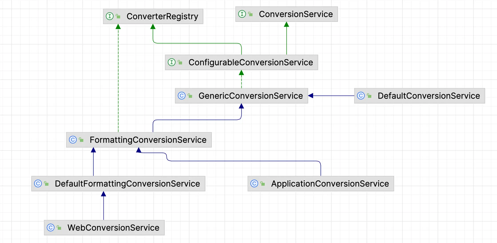

> Spring 在数据绑定 DataBinder 的时候,是如何将外部的配置转换为内部属性的状态的?

## 类型转实现方式

类型实现由两种方式:

1. Spring3.0 之前基于 JavaBeans 接口的类型转换实现
    - 基于`java.beans.PropertyEditor` 接口扩展
2. Spring3.0+ 通用类型转换实现
    - 基于 Converter 接口

第二种转换方式更具有现代化编程风格,并且一直使用至今.

## 类型转换使用场景

|         场景         | 基于 JavaBeans 接口的类型转换实现 | 通用类型转换实现 |
| :------------------: | :-------------------------------: | :--------------: |
|      `数据绑定`        | ✅ | ✅ |
|    `BeanWrapper`     | ✅ | ✅ |
| `Bean 属性类型转换`     | ✅ | ✅ |
| `外部化属性类型转换`     | ❌ | ✅ |

## JavaBeans 接口的类型转换(PropertyEditor)

- 主要作用: 将 String 类型的内容转换为目标类型的对象
- **拓展原理**

  1. Spring 将文本内容传递到 `PropertyEditor` 实现的 `setAsText(String)` 方法
  2. PropertyEditor#setAsText(String) 方法实现将 String 类型转换诶目标类型的对象
  3. 将目标类型的对象传入 `PropertyEditor#setValue(Object)`
  4. PropertyEditor#setValue(Object) 方法实现需要临时存储传入对象
  5. Spring 通过 `PropertyEditor#getValue()` 获取类型转换后的对象

### 基础示例

> 实现 `PropertyEditor` 接口,一般通过继承 `PropertyEditorSupport` 的方式,因为 PropertyEditorSupport 对接口方法提供了空实现

下面就是将字符串转为 Resource 资源:

```java
/**
 * 使用 {@link PropertyEditor} 的进行转换简单示例
 * @author <a href="mailto:zhuyuliangm@gmail.com">yuliang zhu</a>
 */
public class PropertyEditorDemo {
    public static void main(String[] args) throws IOException {
        String dir = System.getProperty("user.dir");
        String filepath = dir + "/spring-demo/Resource/src/main/java/EncodedFileSystemResourceDemo.java";
        PropertyEditor propertyEditor = new StringToResourcePropertyEditor();
        // 利用 propertyEditor 进行类型转换
        propertyEditor.setAsText(filepath);
        // 获取转换后的数据
        Resource resource = (Resource) propertyEditor.getValue();
        System.out.println(StreamUtils.copyToString(resource.getInputStream(), Charset.forName("UTF-8")));
    }

    // 实现 PropertyEditor接口
    static class StringToResourcePropertyEditor extends PropertyEditorSupport {
        /**
         * 重写 setAsText 方法,将 String 转为目标类型
         */
        @Override
        public void setAsText(String text) throws IllegalArgumentException {
            Resource resource = new FileSystemResource(text);
            setValue(resource);
        }
    }
}
```

### 内建 PropertyEditor 拓展

> 有哪些常见类型被 Spring 内建 PropertyEditor 实现?

Spring 的内建 PropertyEditor 拓展 主要位于: ***org.springframework.beans.propertyeditors*** 下面:

|      转换场景      | 实现类 |
| :----------------: | :----: |
| `String -> byte[]` | ByteArrayPropertyEditor |
| `String -> char` | CharacterEditor |
| `String -> char[]` | CharArrayPropertyEditor |
| `String -> Charset` | CharsetEditor |
| `String -> Class` | ClassEditor |
| `String -> Currency` | CurrencyEditor |
| `String -> Currency` | CurrencyEditor |
| ... | ... |

:::tip 提示
Spring 在拓展 PropertyEditor 的时候,除了实现 `setAsText`,还会实现 `getAsText`

```java title="org.springframework.beans.propertyeditors.ByteArrayPropertyEditor"
public class ByteArrayPropertyEditor extends PropertyEditorSupport {
  @Override
  public void setAsText(@Nullable String text) {
    setValue(text != null ? text.getBytes() : null);
  }

  @Override
  public String getAsText() {
    byte[] value = (byte[]) getValue();
    return (value != null ? new String(value) : "");
  }
}
```

:::

### 自定义 PropertyEditor

> 在自定义了 PropertyEditor 之后, 如何在 Spring 中使用呢?

操作步骤:

1. 自定义 PropertyEditor 类继承 `PropertyEditorSupport` 类
2. 自定义注册器类实现 `PropertyEditorRegistrar` 接口,并且实现`registerCustomEditors(PropertyEditorRegistry)`方法
3. 注册 `CustomEditorConfigurer` Bean,并且将 自定义注册器类 添加到 `propertyEditorRegistrars` 属性中
4. 向 `PropertyEditorRegistry` 中注册自定义 PropertyEditor 类
    - 通用类型实现: `registerCustomEditor(Class<?>, PropertyEditor);`
      - 只针对类型进行转换
    - JavaBean 属性类型实现: `registerCustomEditor(Class<?>, String, PropertyEditor);`
      - 针对 JavaBean 中的属性+类型进行转换

> 需求: 实现一个自定义的 PropertyEditor ,将字符串转为 Properties,并且在 Spring 中使用

首先,实现自定义的 PropertyEditor 来处理类型转换:

```java
/**
 * 自定义{@link PropertyEditor} 的实现,将 String 转为 Properties
 *
 * @author <a href="mailto:zhuyuliangm@gmail.com">yuliang zhu</a>
 * @see  PropertyEditor
 * @see PropertyEditorSupport
 */
public class CustomizedPropertyEditor extends PropertyEditorSupport{
    @Override
    public void setAsText(String text) throws IllegalArgumentException {
        Properties prop = new Properties();
        try {
          // highlight-start
          // 转为大写,用于区分 Spring 的 内建PropertyEditor
          prop.load(new StringReader(text.toUpperCase()));
          // highlight-end
        } catch (IOException e) {
            throw new RuntimeException(e);
        }
        setValue(prop);
    }

    @Override
    public String getAsText() {
        Properties prop = (Properties) getValue();
        StringBuilder sb = new StringBuilder();
        for(Map.Entry<Object, Object> entry:prop.entrySet()) {
            sb.append(entry.getKey()).append("=").append(entry.getValue()).append(System.lineSeparator());
        }
        return  sb.toString();
    }
}

```

然后,实现 `PropertyEditorRegistrar` 接口,用于注册自定义的 PropertyEditor

```java
/**
 * 自定义的 {@link PropertyEditor} 注册器{@link PropertyEditorRegistrar}
 * @author <a href="mailto:zhuyuliangm@gmail.com">yuliang zhu</a>
 * @see PropertyEditorRegistrar
 * @see PropertyEditor
 */
public class CustomizedPropertyEditorRegistrar implements PropertyEditorRegistrar {
    @Override
    public void registerCustomEditors(PropertyEditorRegistry registry) {
        // 针对 JavaBean 中的属性进行转换
        // 注册自定义的 PropertyEditor
        registry.registerCustomEditor(Properties.class, "dbProperties", new CustomizedPropertyEditor());
    }
}
```

然后,将 PropertyEditorRegistrar 的实现类注册到容器中:

```xml
<!--注册 PropertyEditorRegistrar 的实现类-->
<bean id="customEditorConfigurer" class="org.springframework.beans.factory.config.CustomEditorConfigurer">
    <property name="propertyEditorRegistrars">
        <list>
            <bean class="CustomizedPropertyEditorRegistrar"/>
        </list>
    </property>
</bean>

<!--注册 DbInfo 的测试 Bean-->
<bean id="dnInfo" class="Domain.DbInfo">
    <property name="id" value="1"/>
    <property name="userName" value="pacos"/>
    <property name="dbProperties">
        <value>
            port=3306
            password=12345
            user=pacos
        </value>
    </property>
</bean>
```

最后进行测试:

```java
/**
 * 拓展 Spring {@link PropertyEditor} 的实现
 *
 * @author <a href="mailto:zhuyuliangm@gmail.com">yuliang zhu</a>
 * @see PropertyEditor
 * @see PropertyEditorRegistrar
 * @see PropertyEditorRegistry
 */
public class SpringCustomizedPropertyEditorDemo {
    public static void main(String[] args) {
        ClassPathXmlApplicationContext context = new ClassPathXmlApplicationContext("META-INF/property-editors.xml");
        // 获取测试 Bean: DBInfo

        DbInfo dnInfo = context.getBean("dnInfo", DbInfo.class);
        /**
         *  out:DbInfo(id=1, userName=pacos,dbProperties={{PORT=}={3306=}, {USER=}={PACOS=}, {PASSWORD=}={12345=}})
         */
        System.out.println(dnInfo);
        context.close();
    }
}
```

### PropertyEditor 的设计缺陷

1. 违反单一原则: PropertyEditor 接口职责太多,除了类型转换,还有 JavaBeans 事件和 JavaBeans GUI 交互
2. PropertyEditor 实现类型局限,来源类型只能为 String
3. PropertyEditor 缺少类型安全,setValue 可以设置任意类型,所以 getValue 的时候只能通过类命名感知目标转换类型

## Spring3 通用类型转换接口(Converter)

> 为什么 Converter 接口比 PropertyEditor 更加合理?

- 类型转换接口: `Converter<S,T>`
  - 核心方法: `T convert(S)`
    - `S`: 来源类型, `T`: 目标类型
  - 一般在需要将简单类型进行转换的时候,会使用 Converter 接口

但是 Converter 接口存在局限性:

1. 缺少对 ***SourceType*** 和 ***TargetType*** 类型的前置判断
2. 仅能转换单一类型的 ***SourceType*** 和 ***TargetType***,无法处理多种、复杂类型

为了解决上面的两个问题, 可以分别使用下面两个接口

1. 前置的过滤接口: `ConditionalConverter`
    - 在转换之前有一个预判动作,判断来源和目标是否一致
    - 核心方法: `boolean matches(TypeDescriptor, TypeDescriptor)`
2. 通用类型转换接口: `GenericConverter`
    - 支持对多个输入、输出类型转换
    - 核心方法: `convert(Object, TypeDescriptor, TypeDescriptor)`
    - 核心组件
      - 配对类型: `ConvertiblePair`,描述了输出、输出类型的键值对
      - 类型描述: `TypeDescriptor`

:::caution 注意
**如果没有在 Spring 容器中注册 ConversionService，则会使用基于 PropertyEditor 的类型转换**
:::

### Spring 内建类型转换器

|      转换场景       |            实现类所在包名(package)            |
| :-----------------: | :-------------------------------------------: |
|    日期/时间有关    |      org.springframework.format.datetime      |
| Java8 日期/时间有关 | org.springframework.format.datetimel.standard |
|      通用实现       |   org.springframework.core.convert.support    |

### GenericConverter 接口

> GenericConverter 为什么比 Converter 接口更加通用?

- 核心要素
  - 使用场景: 用于 **"复合"** 类型转换场景,比如 Collection、Map、数组等
    - 在处理复合类型比如 Collection 的时候,内部的元素还是会采用基本 [Converter](类型转换#spring3-通用类型转换接口converter)
  - 转换范围
    - 通过 `Set<ConvertiblePair> getConvertibleTypes()` 确定可以转换的范围,即可以传入多个"类型组"
    - 配对类型: 通过 `ConvertiblePair` 来定义
  - 转换方法
    - 使用  `Object convert(Object source, TypeDescriptor sourceType, TypeDescriptor targetType)`
  - 类型描述
    - 通过 `TypeDescriptor` 描述输入、输出类型

### ConditionalConverter 接口

虽然 GenericConverter 可以实现多类型转换, 但是依旧存在局限性:

1. 缺少对 ***SourceType*** 和 ***TargetType*** 类型的前置判断
2. 单一类型转换比较复杂

为了处理这两个局限性,可以使用优化接口: `ConditionalGenericConverter`。可以看出来,它结合了下面两个接口的特点:

1. 复合类型转换: `GenericConverter`
2. 类型条件判断: `ConditionalConverter`

## 扩展 Spring 类型转换器

通过实现下面的几种转换器接口自定义转换器:

1. `Converter`
2. `ConverterFactory`
3. `GenericConverter`
4. `ConditionalConverter` [推荐]

通过下面两种方式可以注册自定义的转换器实现:

1. 通过 `ConversionServiceFactoryBean` 的方式
2. 通过 `ConversionService` API 的方式

:::caution 注意
注册到容器中的 ConversionService Bean 的名称必须是 `conversionService`, 从应用上下文初始化的时候就可以看出来

```java
String CONVERSION_SERVICE_BEAN_NAME = "conversionService";

protected void finishBeanFactoryInitialization(ConfigurableListableBeanFactory beanFactory) {
  // Initialize conversion service for this context.
  if (beanFactory.containsBean(CONVERSION_SERVICE_BEAN_NAME) &&
      beanFactory.isTypeMatch(CONVERSION_SERVICE_BEAN_NAME, ConversionService.class)) {
    beanFactory.setConversionService(beanFactory.getBean(CONVERSION_SERVICE_BEAN_NAME, ConversionService.class));
  }
  //...
}
```

:::

#### 基础示例

> 自定义将 Properties 转换为 String

首先定义一个 Converter 转换器,用于将Properties 转为 String,一般来说实现 `ConditionalGenericConverter` 接口

```java
/**
 * 自定义 {@link Converter} 将 Properties 转为 String
 *
 * @author <a href="mailto:zhuyuliangm@gmail.com">yuliang zhu</a>
 *
 * @see Converter
 */
public class PropertiesToStringConverter implements ConditionalGenericConverter {
    // 判断类型是否匹配
    @Override
    public boolean matches(TypeDescriptor sourceType, TypeDescriptor targetType) {
        return sourceType.getObjectType().equals(Properties.class) &&
                targetType.getObjectType().equals(String.class);
    }

    // 该 类型转换器支持的转换类型 Set 集合
    @Override
    public Set<ConvertiblePair> getConvertibleTypes() {
        ConvertiblePair convertiblePair = new ConvertiblePair(Properties.class, String.class);
        HashSet<ConvertiblePair> set = new HashSet<>();
        set.add(convertiblePair);
        return set;
    }

    // 实际的转换操作
    @Override
    public Object convert(Object source, TypeDescriptor sourceType, TypeDescriptor targetType) {
        Properties properties = (Properties) source;
        StringBuilder sb = new StringBuilder();
        for (Map.Entry<Object, Object> entry : properties.entrySet()) {
          sb.append("key:"+entry.getKey()).append(", value:").append(entry.getValue()).append(System.lineSeparator());
        }
        return sb.toString();
    }
}
```

然后再 XML 配置文件中利用 `ConversionService` 注册自定义的 Converter,这里通过 `ConversionServiceFactoryBean` 创建 ConversionService 对象。但是有一个注意点:**注册到容器中的 ConversionService Bean 的名称必须是 conversionService**

```xml
<!--定义一个 Properties 的 Bean-->
<util:properties id="propertiesInfo">
    <prop key="id">1</prop>
    <prop key="name">pacos</prop>
</util:properties>

<!--注册 ConversionServiceFactory ,将 自定义 Converter 添加到 ConversionService 中-->
<!--hightlight-start-->
<bean id="conversionService"
       class="org.springframework.context.support.ConversionServiceFactoryBean">
<!--hightlight-end-->
    <property name="converters">
        <set>
            <bean id="propertiesToStringConverter" class="Converter.PropertiesToStringConverter"/>
        </set>
    </property>
</bean>

<!--注册一个 DbInfo 的 Bean,其中的 context 引用 Properties 的 Bean-->
<bean class="Domain.DbInfo" id="dbInfo">
    <property name="id" value="1"/>
    <property name="userName" value="pacos"/>
    <property name="context" ref="propertiesInfo"/>
</bean>
```

然后进行测试:

```java
/**
 * 拓展 Spring {@link Converter} 的实现
 * @author <a href="mailto:zhuyuliangm@gmail.com">yuliang zhu</a>
 * @see Converter
 * @see ConditionalGenericConverter
 */
public class SpringCustomizedConverterDemo {
  public static void main(String[] args) {
      ClassPathXmlApplicationContext context = new ClassPathXmlApplicationContext("META-INF/converters.xml");
      DbInfo dnInfo = context.getBean("dbInfo", DbInfo.class);
      // out:DbInfo(id=1, userName=pacos, dbProperties=null,
      //            context=key:name,value:pacos
     //                    key:id, value:1)
      System.out.println(dnInfo);
      context.close();
  }
}
```

## 统一类型转换服务(ConversionService)

> 我们知道通过只有注册了转换器之后,该转换器才可以使用

- 类型转换服务接口: `ConversionService`
- 管理(注册、删除)类型转换器: `ConverterRegistry`
- 可配置的类型转换服务接口: `ConfigurableConversionService`

对于 ConversionService 来说, 有几个内建实现:

1. `GenericConversionService`
   - 通用 ConversionService 的模板实现,不内置转换器
2. `DefaultConversionService`
   - 基础 ConversionService 的实现,内置转换器
3. `FormattingConversionService`
   - 通用 Formatter + GenericConversionService 的实现,不内置转换器和 Formatter
4. `DefaultFormattingConversionService`
   - DefaultConversionService + Formatter 的实现(比如 JSR-354 Money & Currency,JSR-310 Data-Time)

它们的继承关系图:



```java
// ConversionService
public interface ConversionService {
  // 判断是否可以转换,与 ConditionalConverter 类似
  boolean canConvert(@Nullable Class<?> sourceType, Class<?> targetType);
  // 判断是否可以转换,与 ConditionGenericConverter
  boolean canConvert(@Nullable TypeDescriptor sourceType, TypeDescriptor targetType);
  // 转换单个,与 Converter 类似
  <T> T convert(@Nullable Object source, Class<T> targetType);
  // 和 GenericConverter 类似,可以转换多个
  Object convert(@Nullable Object source, @Nullable TypeDescriptor sourceType, TypeDescriptor targetType);
}

// ConverterRegistry
public interface ConverterRegistry {

	void addConverter(Converter<?, ?> converter);

	<S, T> void addConverter(Class<S> sourceType, Class<T> targetType, Converter<? super S, ? extends T> converter);

	void addConverter(GenericConverter converter);

	void addConverterFactory(ConverterFactory<?, ?> factory);

	void removeConvertible(Class<?> sourceType, Class<?> targetType);
}
```

## 类型转换底层接口

- 类型转换底层接口: [TypeConverter](类型转换#typeconverter)
- 类型转换底层抽象类实现: [TypeConverterSupport](类型转换#typeconvertersupport)
- 类型转换底层委派实现: [TypeConverterDelegate](类型转换#typeconverterdelegate)

### TypeConverter

它属于类型转换的底层接口,它有两个常见的实现类:

1. 抽象类实现: `TypeConverterSupport`
2. 简单实现: `SimpleTypeConverter`

TypeConverter 起始于 Spring2.0, 它只有一个核心方法`convertIfNecessary`。这个方法意味着具有判断类型是否匹配的能力:

```java
public interface TypeConverter {

  <T> T convertIfNecessary(@Nullable Object value, @Nullable Class<T> requiredType) throws TypeMismatchException;

  <T> T convertIfNecessary(@Nullable Object value, 
                           @Nullable Class<T> requiredType,
                           @Nullable MethodParameter methodParam) throws TypeMismatchException;

  <T> T convertIfNecessary(@Nullable Object value,
                           @Nullable Class<T> requiredType,
                           @Nullable Field field) throws TypeMismatchException;

  default <T> T convertIfNecessary(@Nullable Object value,
                                   @Nullable Class<T> requiredType,
                                   @Nullable TypeDescriptor typeDescriptor) throws TypeMismatchException {
    throw new UnsupportedOperationException("TypeDescriptor resolution not supported");
  }
}
```

:::tip 提示
[BeanWrapper](数据绑定#beanwrapper) 就是 TypeConverter 的一个子接口
:::

### TypeConverterSupport

- `TypeConverterSupport` 是 [TypeConverter 接口](类型转换#typeconverter) 的抽象实现类,并且实现了大部分方法。

- TypeConverterSupport 继承了 `PropertyEditorRegistrySupport`,所以具有注册[PropertyEditor](类型转换#基于-javabeans-接口的类型转换propertyeditor)的功能,具体参看[这里](类型转换#自定义-propertyeditor)

- TypeConverterSupport 中还使用了 TypeConverter 的委派实现: [TypeConverterDelegate](类型转换#typeconverterdelegate)

首先,我们查看 TypeConverterSupport:

```java
public abstract class TypeConverterSupport extends PropertyEditorRegistrySupport implements TypeConverter {

  // highlight-start
  // TypeConverter 的委派实现
  TypeConverterDelegate typeConverterDelegate;
  // highlight-end

  //...

  @Override
  public <T> T convertIfNecessary(@Nullable Object value,@Nullable Class<T> requiredType,
                                  @Nullable TypeDescriptor typeDescriptor) throws TypeMismatchException {
    try {
      // highlight-start
      // 调用 TypeConverterDelegate 进行转换
      return this.typeConverterDelegate.convertIfNecessary(null, null, value, requiredType, typeDescriptor);
      // highlight-end
    }
    catch (ConverterNotFoundException | IllegalStateException ex) {
      throw new ConversionNotSupportedException(value, requiredType, ex);
    }
    catch (ConversionException | IllegalArgumentException ex) {
      throw new TypeMismatchException(value, requiredType, ex);
    }
  }
}
```

然后我们查看 `PropertyEditorRegistrySupport`:

```java
public class PropertyEditorRegistrySupport implements PropertyEditorRegistry {

  // highlight-start
  private ConversionService conversionService;
  private Map<Class<?>, PropertyEditor> defaultEditors;
  // highlight-end
  private Map<Class<?>, PropertyEditor> customEditors;


  // Spring3.0 之后使用 ConversionService 进行类型转换
  public void setConversionService(@Nullable ConversionService conversionService) {
    this.conversionService = conversionService;
  }

  @Nullable
  public ConversionService getConversionService() {
    return this.conversionService;
  }
  // 创建默认的 PropertyEditor
  private void createDefaultEditors() {
    this.defaultEditors = new HashMap<>(64);
    // Simple editors, without parameterization capabilities.
    this.defaultEditors.put(Class.class, new ClassEditor());
    this.defaultEditors.put(Class[].class, new ClassArrayEditor());
    this.defaultEditors.put(Currency.class, new CurrencyEditor());
    // Default instances of collection editors.
    this.defaultEditors.put(Collection.class, new CustomCollectionEditor(Collection.class));
    // Default editors for primitive arrays.
    this.defaultEditors.put(byte[].class, new ByteArrayPropertyEditor());
    this.defaultEditors.put(char[].class, new CharArrayPropertyEditor());
    // Spring's CustomBooleanEditor accepts more flag values than the JDK's default editor.
    this.defaultEditors.put(boolean.class, new CustomBooleanEditor(false));
    this.defaultEditors.put(Boolean.class, new CustomBooleanEditor(true));
    // The JDK does not contain default editors for number wrapper types!
    this.defaultEditors.put(byte.class, new CustomNumberEditor(Byte.class, false));
    this.defaultEditors.put(Byte.class, new CustomNumberEditor(Byte.class, true));
  }

  @Override
  // 注册自定义的 PropertyEditor
  public void registerCustomEditor(Class<?> requiredType, PropertyEditor propertyEditor) {
    registerCustomEditor(requiredType, null, propertyEditor);
  }

  @Override
  // 根据 requiredType 获取自定义的  PropertyEditor 
  public PropertyEditor findCustomEditor(Class<?> requiredType, String propertyPath) {
    Class<?> requiredTypeToUse = requiredType;
    if (propertyPath != null) {
      if (this.customEditorsForPath != null) {
        PropertyEditor editor = getCustomEditor(propertyPath, requiredType);
        // ...
        if (editor != null) {
          return editor;
        }
      }
      if (requiredType == null) {
        requiredTypeToUse = getPropertyType(propertyPath);
      }
    }
    return getCustomEditor(requiredTypeToUse);
  }
}
```

可以看出来, PropertyEditorRegistrySupport 即支持 [PropertyEditor](类型转换#基于-javabeans-接口的类型转换propertyeditor)的方式进行类型转换,也支持 [ConversionService](类型转换#统一类型转换服务conversionservice) 的方式进行类型转换

:::tip 提示
BeanWrapperImpl 是 PropertyEditorRegistrySupport 的实现类
:::

### TypeConverterDelegate

`TypeConverterDelegate` 是 TypeConverter 接口的委派实现,有下面的注意点:

1. 构造来源: `AbstractNestablePropertyAccessor`
    - 实现: `BeanWrapperImpl`
2. 依赖:  `PropertyEditor`
    - 默认内建实现: `PropertyEditorRegistrySupport#registerDefaultEditors`
3. 可选依赖: `ConversionService`

它的核心实现就是 `convertIfNecessary`方法

```java
public <T> T convertIfNecessary(String propertyName, Object oldValue,
                                Object newValue, Class<T> requiredType,
                                TypeDescriptor typeDescriptor) throws IllegalArgumentException {

  // 为 requireType 寻找自定义的 PropertyEditor 实现
  PropertyEditor editor = this.propertyEditorRegistry.findCustomEditor(requiredType, propertyName);
  ConversionFailedException conversionAttemptEx = null;

  // No custom editor but custom ConversionService specified?
  // 没有自定义的 PropertyEditor 实现,但是有自定义的 ConversionService
  ConversionService conversionService = this.propertyEditorRegistry.getConversionService();
  if (editor == null && conversionService != null && newValue != null && typeDescriptor != null) {
    TypeDescriptor sourceTypeDesc = TypeDescriptor.forObject(newValue);
    if (conversionService.canConvert(sourceTypeDesc, typeDescriptor)) {
      try {
        return (T) conversionService.convert(newValue, sourceTypeDesc, typeDescriptor);
      }
      catch (ConversionFailedException ex) {
        conversionAttemptEx = ex;
      }
    }
  }
  Object convertedValue = newValue;
  // 使用  PropertyEditor 进行转换
  if (editor != null || (requiredType != null && !ClassUtils.isAssignableValue(requiredType, convertedValue))) {
    if (typeDescriptor != null && requiredType != null && Collection.class.isAssignableFrom(requiredType) &&
        convertedValue instanceof String) {
      TypeDescriptor elementTypeDesc = typeDescriptor.getElementTypeDescriptor();
      if (elementTypeDesc != null) {
        Class<?> elementType = elementTypeDesc.getType();
        if (Class.class == elementType || Enum.class.isAssignableFrom(elementType)) {
          convertedValue = StringUtils.commaDelimitedListToStringArray((String) convertedValue);
        }
      }
    }
    if (editor == null) {
      editor = findDefaultEditor(requiredType);
    }
    convertedValue = doConvertValue(oldValue, convertedValue, requiredType, editor);
  }
  // ...
  return (T) convertedValue;
}
```

## 原理流程

> 首先理清 BeanFactory 的[层次关系](IOC容器#beanfactory-依赖图)

下面是流程说明:

1. 容器在 refresh 的时候会调用 `finishBeanFactoryInitialization` 方法,该方法会判断容器中是否存在 `name=conversionService && type=ConversionService.class` 的 Bean,并且将这个 Bean 设置到容器中,通过 `getConversionService` 获取

    ```java
    String CONVERSION_SERVICE_BEAN_NAME = "conversionService";
    protected void finishBeanFactoryInitialization(ConfigurableListableBeanFactory beanFactory) {
      // Initialize conversion service for this context.
      if (beanFactory.containsBean(CONVERSION_SERVICE_BEAN_NAME) &&
          beanFactory.isTypeMatch(CONVERSION_SERVICE_BEAN_NAME, ConversionService.class)) {
        beanFactory.setConversionService(beanFactory.getBean(CONVERSION_SERVICE_BEAN_NAME, ConversionService.class));
      }
      //...
    }
    ```

<br/>

2. Bean 在创建的时候, 会创建 `BeanWrapper` 对象,在创建的时候会初始化 BeanWrapper: `initBeanWrapper`,初始化的时候有两步:
    1. 执行 *getConversionService* 方法,将获取的对象设置到 BeanWrapper 中,[原因在这](类型转换#typeconvertersupport)
    2. 注册自定义的 PropertyEditor, 因为 BeanWrapper 是 PropertyEditorRegistry 的子接口

    ```java
    bw.setConversionService(getConversionService());
    registerCustomEditors(bw);
    ```

<br/>

3. Bean 在初始化之前,会进行属性的填充: `populateBean`,填充的时候会进行类型的转换,这个转换依赖于 TypeConverter 接口

    ```java
    private Object convertForProperty(Object value, String propertyName,
                                      BeanWrapper bw, TypeConverter converter) {
    
      if (converter instanceof BeanWrapperImpl) {
        return ((BeanWrapperImpl) converter).convertForProperty(value, propertyName);
      }
      else {
        PropertyDescriptor pd = bw.getPropertyDescriptor(propertyName);
        MethodParameter methodParam = BeanUtils.getWriteMethodParameter(pd);
        return converter.convertIfNecessary(value, pd.getPropertyType(), methodParam);
      }
    }
    ```
