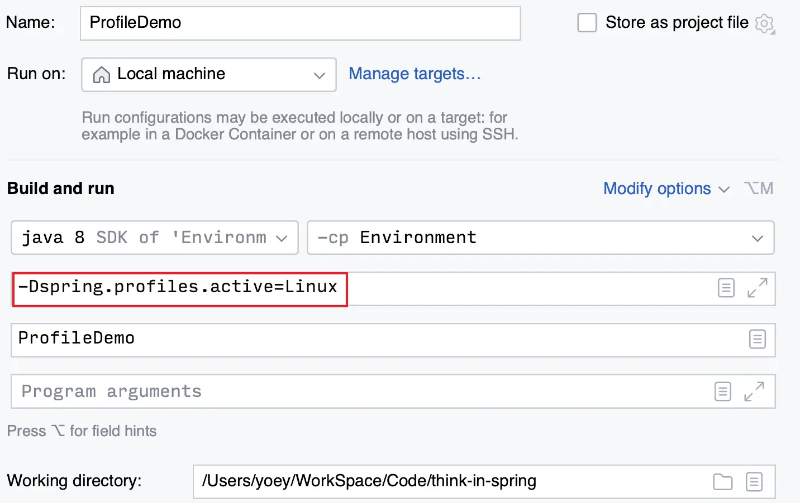

## Environment 抽象

### 引入原因

引入的 Environment 抽象主要有下面的职责:

1. 统一的 Spring 配置属性管理
    - Spring3.1 开始引入了 Environment 抽象,它**统一了 Spring 配置属性的存储**,包括:`占位符的处理 和 类型转化`,不仅完整地替换 PropertyPlaceholderConfigurer,而且还支持更加丰富的配置属性源: `PropertySource`

2. 条件化 Spring Bean 装配管理
    - 通过 Environment Profiles 信息,帮助 Spring 容器提供条件化地装配 Bean

### PropertyResolver 接口

PropertyResolver 接口用于解析 PropertyResource: 获取 Property 值、解析占位符 placeHolder

```
└── PropertyResolver
    ├── Environment
    │   └── ConfigurableEnvironment
    |       └── AbstractEnvironment
    |           └── StandardEnvironment
    ├── ConfigurablePropertyResolver
    |   ├── ConfigurableEnvironment
    │   └── AbstractPropertyResolver
    │       └── PropertySourcesPropertyResolver
```

下面是 PropertyResolver:

```java
public interface PropertyResolver {
  boolean containsProperty(String key);
  String getProperty(String key);
  // 包含默认值
  String getProperty(String key, String defaultValue);
  // 涉及到类型转换
  <T> T getProperty(String key, Class<T> targetType);
  <T> T getProperty(String key, Class<T> targetType, T defaultValue);
  <T> T getRequiredProperty(String key, Class<T> targetType) throws IllegalStateException;
  String getRequiredProperty(String key) throws IllegalStateException;
  // 处理占位符
  String resolvePlaceholders(String text);
  String resolveRequiredPlaceholders(String text) throws IllegalArgumentException;
}
```

### 使用场景

Environment 的使用场景主要有:

1. **属性占位符处理**
2. **转换 Spring 配置属性类型**
3. **存储 Spring 配置属性源(PropertySource)**
4. **Profiles 状态的维护**

我们查看下 Environment 接口以及父接口 `PropertyResolver`的方法,可以总结为以下几类:

- 获取/判断 profiles
- 获取 property,如果传入 targetType 则会涉及到类型转换
- 处理占位符

```java
// Environment
public interface Environment extends PropertyResolver {
  // 获取激活的 profiles
  String[] getActiveProfiles();
  // 获取默认的的 profiles
  String[] getDefaultProfiles();
  // 判断 profiles
  @Deprecated
  boolean acceptsProfiles(String... profiles);
  boolean acceptsProfiles(Profiles profiles);
}

```

Environment 有一个*可写* 的子接口`ConfigurableEnvironment`,这个接口除了继承 Environment,还继承了一个可写(可配置)的接口: `ConfigurablePropertyResolver`

```java
// ConfigurableEnvironment
public interface ConfigurableEnvironment extends Environment, ConfigurablePropertyResolver {
  void setActiveProfiles(String... profiles);
  void addActiveProfile(String profile);
  void setDefaultProfiles(String... profiles);
  // 获取 PropertySource
  MutablePropertySources getPropertySources();
  Map<String, Object> getSystemProperties();
  Map<String, Object> getSystemEnvironment();
  void merge(ConfigurableEnvironment parent);
}

// ConfigurablePropertyResolver
public interface ConfigurablePropertyResolver extends PropertyResolver {
  ConfigurableConversionService getConversionService();
  void setConversionService(ConfigurableConversionService conversionService);
  void setPlaceholderPrefix(String placeholderPrefix);
  void setPlaceholderSuffix(String placeholderSuffix);
  void setValueSeparator(@Nullable String valueSeparator);
  void setIgnoreUnresolvableNestedPlaceholders(boolean ignoreUnresolvableNestedPlaceholders);
  void setRequiredProperties(String... requiredProperties);
  void validateRequiredProperties() throws MissingRequiredPropertiesException;
}
```

## Environment 占位符处理

> Spring3.1 前后,占位符的处理是不同的

- Spring3.1 之前
  - 组件: `PropertyPlaceholderConfigurer`
  - 接口: `StringValueResolver`
- Spring3.1 之后
  - 组件: `PropertySourcesPlaceholderConfigurer`
  - 接口: `EmbeddedValueResolver`

### ~~基于 PropertyPlaceholderConfigurer~~

> 可以基于 Spring3.1 之前的 PropertyPlaceholderConfigurer

我们定义 XML 容器配置元信息文件,以及外部化的 properties 配置文件

```xml
<!--利用 PropertyPlaceholderConfigurer 注册外部化配置-->
<bean class="org.springframework.beans.factory.config.PropertyPlaceholderConfigurer">
    <!--设置 外部化配置文件的路径 -->
    <property name="location" value="classpath:/META-INF/default.properties"/>
    <property name="fileEncoding" value="UTF-8"/>
</bean>

<!--注册 User 对象, 对象属性值用 占位符表达-->
<bean id="user"  class="ioc.overview.Domain.User">
    <property  name="id" value="${user.id}"/>
    <property  name="name" value="${user.name}"/>
</bean>
```

```ini
user.id = 22
user.name = pacos
```

然后直接进行测试:

```java
/**
 * {@link PropertyPlaceholderConfigurer} 示例
 *
 * @author <a href="mailto:zhuyuliangm@gmail.com">yuliang zhu</a>
 * @see PropertyPlaceholderConfigurer
 */
public class PropertyPlaceholderConfigurerDemo {
  public static void main(String[] args) {
      ClassPathXmlApplicationContext context = new ClassPathXmlApplicationContext("META-INF/placeholders-replace.xml");
      // 依赖查找
      User user = context.getBean("user", User.class);
      // out: User{id=22, name='pacos'}
      System.out.println(user);
      context.close();
  }
}
```

### 基于 PropertySourcesPlaceholderConfigurer

> 基于 Spring3.1 之前的 PropertySourcesPlaceholderConfigurer

这里只需要对上面的示例调整 XML 容器配置元信息文件即可:

```xml
<!--利用 PropertySourcesPlaceholderConfigurer 注册外部化配置-->
<bean  class="org.springframework.context.support.PropertySourcesPlaceholderConfigurer">
  <property name="location" value="classpath:/META-INF/default.properties"/>
  <property name="fileEncoding" value="UTF-8"/>
</bean>
```

然后进行测试,可以看到 **${user.name} 在占位符处理下由 pacos 变成了 yoey**,具体原因从哪看[这里](配置元信息#基础示例)

```java
/**
 * {@link PropertySourcesPlaceholderConfigurer} 示例
 *
 * @author <a href="mailto:zhuyuliangm@gmail.com">yuliang zhu</a>
 * @see PropertySourcesPlaceholderConfigurer
 */
public class PropertySourcesPlaceholderConfigurerDemo {
  public static void main(String[] args) {
      ClassPathXmlApplicationContext context = new ClassPathXmlApplicationContext("META-INF/placeholders-replace.xml");
      // 依赖查找
      User user = context.getBean("user", User.class);
      // out: User{id=22, name='yoey'}
      System.out.println(user);
      context.close();
  }
}
```

## 理解条件配置 Spring Profiles

- 相关的 API
  - 接口: `ConfigurableEnvironment`
  - 获取: `getActiveProfiles()` 、`getDefaultProfiles`
  - 修改: `addActiveProfile` 、`setActiveProfiles`、`setDefaultProfiles`
  - 匹配: `acceptProfiles`
- 相关的注解: `@Profile`

### 基本示例

条件配置 Spring Profiles 有什么作用呢?

- 在 SpringBoot 中,我们可以通过外部化的参数 `--spring.profiles.active=xxx` 来表示激活哪些 profile,实际上,我们也可以在 Spring 下实现这种功能,不过需要通过 `-Dspring.profiles.active=xxx` 的方式
- 这部分操作入口在: ConfigurableEnvironment 的抽象实现类: `AbstractEnvironment` 中:

这里使用注解处理的[@Profile 示例](注解处理#profile-示例) 作为示例,没有设置 profiles

```java
/**
 * {@link Profile} 示例
 *
 * @author <a href="mailto:zhuyuliangm@gmail.com">yuliang zhu</a>
 * @see Profile
 * @see Environment
 * @see ConfigurableEnvironment#addActiveProfile(String)
 * @see ConfigurableEnvironment#setDefaultProfiles
 * @see ConfigurableEnvironment#getActiveProfiles()
 */
public class ProfileDemo {
    public static void main(String[] args) {
        AnnotationConfigApplicationContext ctx = new AnnotationConfigApplicationContext();
        ctx.register(ProfileDemo.class);
        ctx.refresh();
        // 依赖查找
        Map<String, String> beans = ctx.getBeansOfType(String.class);
        beans.forEach((key,value) -> {
            System.out.printf("beanName:%s,value:%s\n",key,value);
        });
        ctx.close();
    }
    @Bean
    @Profile({"Windows", "OS"})
    public String Windows() {
        return "Windows";
    }
    @Bean
    @Profile({"MacOs","OS"})
    public String MacOs() {
        return "MacOs";
    }
    @Bean
    @Profile({"Linux","OS"})
    public String Linux() {
        return "Linux";
    }
}
```

然后通过 *-D 参数* 的方式传入 *spring.profiles.active*



### @Profile 重构的原理

Spring4 基于 @Conditional 注解重构了 @Profile,主要的组件: `ProfileCondition` 是 Condition 接口的实现类:

```java
class ProfileCondition implements Condition {
  @Override
  public boolean matches(ConditionContext context, AnnotatedTypeMetadata metadata) {
    MultiValueMap<String, Object> attrs = metadata.getAllAnnotationAttributes(Profile.class.getName());
    if (attrs != null) {
      // 取出 @Profile 注解的 value 属性值
      for (Object value : attrs.get("value")) {
        // 将 value 属性值转为 Profiles 对象,并且判断是否与环境中的 Profiles 是否匹配
        if (context.getEnvironment().acceptsProfiles(Profiles.of((String[]) value))) {
          return true;
        }
      }
      return false;
    }
    return true;
  }
}
```

## 获取 Environment

可以通过依赖注入或者依赖查找的方式获取 Environment

### 依赖注入 Environment

> ApplicationContext 实现了 EnvironmentCapable,具有获取 Environment 的能力

一般有两种方式可以注入 Environment:

1. 直接的依赖注入
    - 实现 `EnvironmentAware` 接口,通过 Aware 接口回调的方式注入
    - 通过 `@Autowired` 等注解注入 Environment
2. 间接的依赖注入
    - 实现 `ApplicationContextAware` 接口,通过 Aware 接口回调的方式注入
    - 通过 `@Autowired` 等注解注入 ApplicationContext

```java
public class InjectingEnvironmentDemo implements EnvironmentAware, ApplicationContextAware {
    // 间接的注入
    private ApplicationContext awareApplicationContext;
    @Resource
    private ApplicationContext annotationApplicationContext;

    // 直接的注入
    private Environment awareEnvironment;
    @Resource
    private Environment annotationEnvironment;

    @Override
    public void setApplicationContext(ApplicationContext applicationContext) throws BeansException {
        this.awareApplicationContext = applicationContext;
    }

    @Override
    public void setEnvironment(Environment environment) {
        this.awareEnvironment = environment;
    }
}
```

### 依赖查找 Environment

一般有两种方式可以查找到 Environment:

- 直接依赖查找: 查找 beanName 为 `environment`, 且beanClass为 *Environment.class* 的 Bean
- 间接依赖查找: 通过 *ApplicationContext#getEnvironment* (这里并不意味着 ApplicationContext 可以被依赖查找,它是游离对象,只能被注入)

```java
/**
 * {@link Environment} 的依赖查找
 *
 * @author <a href="mailto:zhuyuliangm@gmail.com">yuliang zhu</a>
 */
public class LookUpEnvironmentDemo {
    public static void main(String[] args) {
        GenericApplicationContext context = new GenericApplicationContext();
        context.refresh();
        // 依赖查找
        Environment environment = context.getBean("environment", Environment.class);
        ConfigurableEnvironment contextEnvironment = context.getEnvironment();
        // out:  environment == contextEnvironment :true
        System.out.println("environment == contextEnvironment :" + (environment == contextEnvironment));
        context.close();
    }
}
```

## @Value 基本流程

@Value 注解的处理和 @Autowired 注解类似,都是在 *AutowiredAnnotationBeanPostProcessor* 中处理的,并且依赖注入的操作是在填充 Bean 属性(*populateBean*) 中进行操作的

在 [使用 @Autowired 进行依赖注入中](依赖注入#resolvedependency), 会调用 dodoResolveDependency** 方法进行处理依赖,这里还会处理 @Value 注解

```java title="DefaultListableBeanFactory#doResolveDependency"
public Object doResolveDependency(DependencyDescriptor descriptor, String beanName,
                                Set<String> autowiredBeanNames,TypeConverter typeConverter) 
                                throws BeansException {

  InjectionPoint previousInjectionPoint = ConstructorResolver.setCurrentInjectionPoint(descriptor);
  try {
    Object shortcut = descriptor.resolveShortcut(this);
    if (shortcut != null) {
      return shortcut;
    }

    Class<?> type = descriptor.getDependencyType();
    Object value = getAutowireCandidateResolver().getSuggestedValue(descriptor);
    if (value != null) {
      if (value instanceof String) {
        // highlight-start
        // 处理占位符
        String strVal = resolveEmbeddedValue((String) value);
        // highlight-end
        BeanDefinition bd = (beanName != null && containsBean(beanName) ? getMergedBeanDefinition(beanName) : null);
        value = evaluateBeanDefinitionString(strVal, bd);
      }
      TypeConverter converter = (typeConverter != null ? typeConverter : getTypeConverter());
      try {
        // 类型转换
        return converter.convertIfNecessary(value, type, descriptor.getTypeDescriptor());
      }
      catch (UnsupportedOperationException ex) {
        // ...
      }
    }
    // ...
  }
}

// AbstractBeanFactory#resolveEmbeddedValue
public String resolveEmbeddedValue(@Nullable String value) {
  if (value == null) {
    return null;
  }
  String result = value;
  for (StringValueResolver resolver : this.embeddedValueResolvers) {
    // highlight-start
    result = resolver.resolveStringValue(result);
    // highlight-end
    if (result == null) {
      return null;
    }
  }
  return result;
}
```

在 `resolveEmbeddedValue` 处理中, 实际会调用到 *AbstractApplicationContext* 中的一个 lambda 内部类表达式:

```java title="AbstractApplicationContext#finishBeanFactoryInitialization"
if (!beanFactory.hasEmbeddedValueResolver()) {
  beanFactory.addEmbeddedValueResolver(strVal -> getEnvironment().resolvePlaceholders(strVal));
}
```

在这段处理会调用到 `doResolvePlaceholders` 方法

```java title="AbstractPropertyResolver#doResolvePlaceholders"
private String doResolvePlaceholders(String text, PropertyPlaceholderHelper helper) {
  return helper.replacePlaceholders(text, this::getPropertyAsRawString);
}
```

而调用 *replacePlaceholders* 的时候,传入了 `this::getPropertyAsRawString`,这个表示真正处理占位符的则是在`PropertySourcesPropertyResolver` 中

```java title="PropertySourcesPropertyResolver"
// 解析占位符
protected String getPropertyAsRawString(String key) {
  return getProperty(key, String.class, false);
}
protected <T> T getProperty(String key, Class<T> targetValueType, boolean resolveNestedPlaceholders) {
  if (this.propertySources != null) {
    for (PropertySource<?> propertySource : this.propertySources) {
      // highlight-start
      // 占位符处理
      Object value = propertySource.getProperty(key);
      //highlight-end
      if (value != null) {
        if (resolveNestedPlaceholders && value instanceof String) {
          value = resolveNestedPlaceholders((String) value);
        }
        // 类型转换
        return convertValueIfNecessary(value, targetValueType);
      }
    }
  }
  return null;
}

// 类型转换方法,实际上会直接调用 ConversionService
protected <T> T convertValueIfNecessary(Object value, @Nullable Class<T> targetType) {
  ConversionService conversionServiceToUse = this.conversionService;
  if (conversionServiceToUse == null) {
    // ...
    conversionServiceToUse = DefaultConversionService.getSharedInstance();
  }
  return conversionServiceToUse.convert(value, targetType);
}
```

## 配置属性源 PropertySource

- 相关 API
  - 单配置属性源: `PropertySource`
  - 多配置属性源: `PropertySources`
- 相关注解
  - 单配置属性源: `@PropertySource`
  - 多配置属性源: `@PropertySources`
- 关联
  - 存储对象: `MutablePropertySources`
  - 关联方法: `ConfigurableEnvironment#getPropertySources()`

**PropertySource 是一个带有泛型的抽象类,这里抽取它内部的关键部分:**

1. 每个 PropertySource 都会有一个 **name**
2. PropertySource 通过 **source** 属性表达配置属性源的来源, 不同实现类的这个 source 来源的类型不相同,所以使用泛型类型代替
    - 比如对于 **MapPropertySource** 来说,这个 source 就是 Map 类型

```java
// PropertySource
public abstract class PropertySource<T> {
  // PropertySource 的名称
  protected final String name;
  
  // PropertySource 的来源
  protected final T source;

  // 不同实现类会各自去实现 getProperty 方法
  public abstract Object getProperty(String name);

  public boolean containsProperty(String name) {
    return (getProperty(name) != null);
  }
}

// PropertySource 的实现类 MapPropertySource
public class MapPropertySource extends EnumerablePropertySource<Map<String, Object>> {
  public Object getProperty(String name) {
    return this.source.get(name);
  }

  public boolean containsProperty(String name) {
    return this.source.containsKey(name);
  }

  public String[] getPropertyNames() {
    return StringUtils.toStringArray(this.source.keySet());
  }
}
```

多配置属性源 PropertySources 可以存储多个 PropertySource,**并且多个 PropertySource 之间存在先后关系(获取数据是按添加顺序逐一迭代)**,我们大致看下 PropertySources 的实现类: `MutablePropertySources`

```java
public class MutablePropertySources implements PropertySources {
  private final List<PropertySource<?>> propertySourceList = new CopyOnWriteArrayList<>();
  // ...
}
```

可以看出来: 存储 PropertySource 的是一个 ArrayList,所以存在先后关系。SpringBoot 中所谓的多种外部化配置文件的优先级就在这里体现!

### 内建的配置属性源

Spring 内建的 PropertySource:

|         PropertySource 类型         |           说明            |
| :---------------------------------: | :-----------------------: |
|     `CommandLinePropertySource`     |     命令行配置属性源      |
|        `JndiPropertySource`         |      JNDI 配置属性源      |
|     `PropertiesPropertySource`      |   Properties 属性配置源   |
| `ServletConfigurablePropertySource` | ServletContext 配置属性源 |
|  `SystemEnvironmentPropertySource`  |    环境变量配置属性源     |
|                  …                  |             …         |

### 配置属性源的基本原理

#### 基于 @PropertySource 注解

实现 @PropertySource 注解功能主要有下面的几个组件:

- 入口
  - 总入口: `ConfigurationClassParser#doProcessConfigurationClass`
  - 处理 @PropertySource 注解的入口: `ConfigurationClassParser#`
- Spring 4.3 新增
  - 可配置属性字符编码: encoding
  - 接口: `PropertySourceFactory`
- 适配对象: `CompositePropertySource`

默认情况下, `PropertySourceFactory` 接口的实现类只有一个`DefaultPropertySourceFactory`,只能处理 *properties* 文件,当然也可以拓展其他类型,比如 [Yaml](配置元信息#基于-yaml-文件)

下面是处理 @PropertySource 注解的代码:

```java
private static final PropertySourceFactory DEFAULT_PROPERTY_SOURCE_FACTORY = new DefaultPropertySourceFactory();

private void processPropertySource(AnnotationAttributes propertySource) throws IOException {
  // 获取 @PropertySource 注解的属性值
  String name = propertySource.getString("name");
  String encoding = propertySource.getString("encoding");
  String[] locations = propertySource.getStringArray("value");
  boolean ignoreResourceNotFound = propertySource.getBoolean("ignoreResourceNotFound");
  Class<? extends PropertySourceFactory> factoryClass = propertySource.getClass("factory");
  // 如果配置了 factory(自定义 PropertySourceFactory 接口的实现类)
  PropertySourceFactory factory = (factoryClass == PropertySourceFactory.class ?
      DEFAULT_PROPERTY_SOURCE_FACTORY : BeanUtils.instantiateClass(factoryClass));
  // 遍历传入的所有 配置属性源文件的路径
  for (String location : locations) {
    try {
      String resolvedLocation = this.environment.resolveRequiredPlaceholders(location);
      Resource resource = this.resourceLoader.getResource(resolvedLocation);
      // 将配置属性源文件转为 PropertySource
      addPropertySource(factory.createPropertySource(name, new EncodedResource(resource, encoding)));
    }
    catch (IllegalArgumentException | FileNotFoundException | UnknownHostException ex) {
      // ...
    }
  }
}
```

#### 基于 API

我们可以在 Spring 应用上下文启动前/后调整 *PropertySource*,基本操作步骤如下:

1. 首先, 通过 ApplicationContext 获取 ConfigurableEnvironment
2. 然后, 通过 ConfigurableEnvironment 获取 MutablePropertySources
3. 动态操作 MutablePropertySources

下面是 Spring 应用上下文启动前调整 PropertySource,*user.name* 从默认的 "yoey" 被调整替换为 "pacos"

```java
public class PropertySourceAPIDemo {
    @Value("${user.name}")
    private String userName;

    public static void main(String[] args) {
        AnnotationConfigApplicationContext context = new AnnotationConfigApplicationContext();
        context.register(PropertySourceAPIDemo.class);

        // 1. 获取 ConfigurableEnvironment 对象
        ConfigurableEnvironment environment = context.getEnvironment();
        // 2. 获取 MutablePropertySources 对象
        MutablePropertySources propertySources = environment.getPropertySources();
        // 动态操作 MutablePropertySources

        Map<String,Object> map = new HashMap<>();
        map.put("user.name", "pacos");
        propertySources.addFirst(new MapPropertySource("add-property-sources",map));

        context.refresh();
        PropertySourceAPIDemo bean = context.getBean(PropertySourceAPIDemo.class);
        // out: pacos
        System.out.println(bean.userName);
        context.close();
    }
}
```
