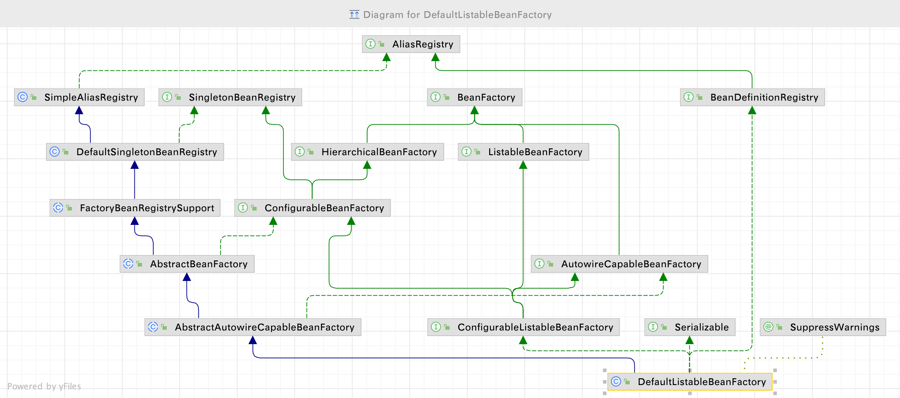

## 依赖查找的历史（传统java）

- <mark>单一类型依赖查找</mark>

  - `JNDI`
    - javax.naming.Context#lookup(javax.naming.Name)

  - `JavaBeans`: java.beans.beancontext.BeanContext
  
- <mark>集合类型查找</mark>

  - java.beans.beancontext.BeanContext
  
- <mark>层次性依赖查找</mark>

  - java.beans.beancontext.BeanContext

## 单一类型依赖查找(BeanFactory)

> 所谓的单一类型指的是,某个类型的 Bean 在 Spring IOC 容器中只有一个

- 根据Bean的名称查找
  - `getBean(String beanName)`
  - ~~Spring 2.5 覆盖默认参数: getBean(String beanName,Object…)~~
- 根据Bean的类型查找
  - Bean的实时查找
    - Spring 3.0 getBean(Class beanClass)
    - ~~Spring 4.1 覆盖默认参数: getBean(Class,Object…)~~

  - **Spring5.1 Bean的延迟查找**
    - `getBeanProvider(Class)`
    - `getBeanProvider(ResolvableType)`

- 根据Bean的名称+类型查找
  - getBean(String beanName,Class beanClass)

### Bean 的延迟查找

> 查询单一类型的 Bean 的时候,既可以实时的查询,也支持延迟查询,比如使用 ObjectProvider、ObjectFactory
>
> **注意: ObjectProvider 实际是 ObjectFactory 的子接口,但是具有"集合"的能力**
>
> ```java
> public interface ObjectProvider<T> extends ObjectFactory<T>, Iterable<T> {
> 	T getObject(Object... args) throws BeansException;
>   default Stream<T> stream() {
> 		throw new UnsupportedOperationException("Multi element access not supported");
> 	}
>   // ...[省略部分接口方法]
> }
> ```

- 延迟查找的一般使用场景
  - 用于暂时性地获取某个 BeanHolder 对象，如果过早的加载，可能会引起未知的状态
  - 比如，当 A组件 依赖 B组件时，如果过早地初始化 A，那么 B 组件 里面的状态可能是中间状态或者并不存在，这样容易导致一些错误。如果使用延迟加载的话,就可以在判断 B 组件是否存在,如果存在再去初始化 A 组件

代码示例

- 可以看到,如果是延迟加载的 Bean,在获取这个 Bean 的时候(比如 迭代获取、getObject…)就会触发这个延迟加载 Bean 的初始化过程
- ObjectProvider 还提供 **getIfAvailable()**,如果尝试获取这个 Bean 的时候,发现没有这个 Bean,则会返回 Null,有的话就返回这个 Bean

```java
package dependency.lookup;

import org.springframework.beans.factory.InitializingBean;
import org.springframework.beans.factory.ObjectProvider;
import org.springframework.context.annotation.AnnotationConfigApplicationContext;
import org.springframework.context.annotation.Bean;
import org.springframework.context.annotation.Lazy;

import javax.annotation.PostConstruct;
import java.util.Iterator;

/**
 * <b>{@link ObjectProvider} 的依赖查找(延迟查找)</b>
 *
 * @author <a href="mailto:zhuyuliangm@gmail.com">yuliang zhu</a>
 */
public class ObjectProviderDemo {
    public static void main(String[] args) {
        // 创建 Spring 应用上下文
        AnnotationConfigApplicationContext ctx = new AnnotationConfigApplicationContext();
        // 将当前类 ObjectProviderDemo 作为配置类注册到 Spring 的 IOC 容器中
        ctx.register(ObjectProviderDemo.class);
        // 启动 Spring 应用上下文
        ctx.refresh();
        /*
        * 利用 Spring5.1 提供的 ObjectProvider 进行延迟的依赖查找
        * */
        // 分别获取 lazyPersonInit、eagerPersonInit
        ObjectProvider<Person> provider = ctx.getBeanProvider(Person.class);
        Iterator<Person> iterator = provider.iterator();
        // 开始从 ObjectProvider 中获取数据,如果是延迟加载的 Bean,则会开始进行实例化+初始化
        System.out.println("尝试从ObjectProvider 中获取Bean对象[懒加载没有初始化的话,则会触发Bean的初始化流程...]");
        while (iterator.hasNext()) {
            iterator.next();
        }

        // 关闭 Spring 应用上下文
        ctx.close();
      
        /*
          out:
          Common init method:Person  @postConstruct...
          Common init method:Person  afterPropertiesSet...
          eagerPersonInit...
          尝试从ObjectProvider 中获取Bean对象[懒加载没有初始化的话,则会触发Bean的初始化流程...]
          Common init method:Person  @postConstruct...
          Common init method:Person  afterPropertiesSet...
          lazyPersonInit..
        */
    }

    // 延迟Bean 
    @Lazy
    @Bean(initMethod = "lazyPersonInit")
    public Person lazyPerson() {
        Person user = new Person();
        user.setId(22L);
        user.setName("lazy");
        return user;
    }
    // 非延迟的 Bean
    @Bean(initMethod = "eagerPersonInit")
    public Person eagerPerson() {
        Person user = new Person();
        user.setId(33L);
        user.setName("eagerPerson");
        return user;
    }
}
class Person implements InitializingBean {
    public Long id;
    public String name;

    private void lazyPersonInit() {
        System.out.println("lazyPersonInit...");
    }
  
    private void eagerPersonInit() {
        System.out.println("eagerPersonInit...");
    }
     @PostConstruct
    public void postConstruct() {
        System.out.println("Common init method:Person  @postConstruct...");
    }

    @Override
    public void afterPropertiesSet() throws Exception {
        System.out.println("Common init method:Person  afterPropertiesSet...");
    }
  // ...
}
```

### 拓展延迟查找

延迟查找相关的接口

1. <mark>ObjectFactory</mark>

2. <mark>ObjectProvider</mark>

    - `getIfAvailable(Supplier)`
      - lambda 的支持,提供一个 Supplier 函数接口实现,返回一个对象
    - `ifAvailable(Consumer)`
      - lambda 的支持,提供一个 Consumer 函数接口实现, 对ObjectProvider#getObject 返回的对象进行消费

代码示例

:::tip 使用建议

- 一些第三方框架中，某些组件的属性是非必须的，且可以定制化的。这些定制化的组件通过延迟查找的方式获取，并且交由框架使用者配置，这样就能提前定义延迟对象将来的一系列行为事件(实际上该对象尚未被实例化)。

- **通过提前定义的方式，事先规定好该对象要做些什么，而对象本身交由使用者去定义它的创建内容，从而实现在固定流程下进行个性化配置**

:::

```java
public class ObjectProviderDemo2 {
    public static void main(String[] args) {
        AnnotationConfigApplicationContext ctx = new AnnotationConfigApplicationContext();
        ctx.register(ObjectProviderDemo2.class);
        ctx.refresh();
        System.err.println("尝试从ObjectProvider 中获取Bean对象[没有初始化则会触发Bean的初始化流程...]");
    
        // 尝试从容器中获取Address 的Bean
        ObjectProvider<Address> addressObjectProvider = ctx.getBeanProvider(Address.class);
      
         // 此时由于容器中没有这个类型的Bean,返回Null
        System.out.println(addressObjectProvider.getIfAvailable());   

        // 个性化的注入一个Address 的Bean -> 这里可以交由下层实现
        ctx.getBeanFactory().registerSingleton("address",new Address("add"));
        System.out.println(addressObjectProvider.getIfAvailable());
        ctx.close();
    }
}

/*
 null
 Address{name='add'}
*/
```

## 集合类型依赖查找(ListableBeanFactory)

- 根据 Bean 类型查找
  - 获取同类型 Bean 名称列表
    - `getBeanNameForType(Class<?> type )`
    - Spring4.2 `getBeanNamesForType(ResolvableType)`
  - 获取同类型 Bean 实例列表
    - `getBeansOfType(Class)` 以及重载方法
- 根据注解类型查找
  - Spring3.0 获取注解类型的 Bean名称列表
    - `getBeanNamesForAnnotation(Class<? extends Annotation>)`
  - Spring3.0 获取注解类型的 Bean实例列表
    - `getBeansWithAnnotation(Class<? extends Annotation>)`
  - Spring3.0 获取指定名称 + 注解类型的Bean实例
    - `findAnnotationOnBean(String,Class<? extends Anootation>)`

:::caution 注意点

- **Spring 默认情况下,Bean 的定义是可以被覆盖的,也就是说之前定义的 Bean 后面用相同的名称是可以覆盖的!**

- `getBeanNamesForType`是通过与`BeanDefinition` 中的`getClassName()` 、FactoryBean#getObjectType 等进行比较判断的
  - 即: 即使Bean没有被初始化，仅仅处于Bean的注册阶段，也能通过该方法获取到这个 bean 的名称信息,但是无法获取到Bean的实例

- 通过`getBeansOfType` 这种方式是通过获取Bean实例对象,然后判断 Bean 对象的类型是否与给定的类型一直，所以这个方法可能会导致Bean的提前初始化，比如懒加载的Bean提前初始化

**建议: 通过获取Bean的`名称列表`来判断某个Bean是否存在，而不是获取Bean的`实例列表`,因为可能会导致Bean的提前初始化，从而出现一些错误！**
:::

**获取Bean的名称与Bean的实例**

> 可以看到,懒加载的 Bean 通过调用`getBeansOfType`方法后,会对该Bean进行初始化

```java
public class ListableBeanFactoryDemo {
    public static void main(String[] args) {
        GenericBeanDefinition user1 = new GenericBeanDefinition();
        user1.setBeanClass(User.class);
        // 采用构造器初始化Bean
        ConstructorArgumentValues user1Args = new ConstructorArgumentValues();
        user1Args.addIndexedArgumentValue(0,11);
        user1Args.addIndexedArgumentValue(1,"user1");
        user1.setConstructorArgumentValues(user1Args);
        user1.setLazyInit(true);  //设置User1 为延迟加载的Bean

        GenericBeanDefinition user2 = new GenericBeanDefinition();
        user2.setBeanClass(User.class);
        // 采用Setter初始化Bean
        MutablePropertyValues user2Args = new MutablePropertyValues();
        user2Args.add("age",22).add("name","user2");
        user2.setPropertyValues(user2Args);

        // 向 Spring IOC 容器中注册 BeanDefinition
        AnnotationConfigApplicationContext context = new AnnotationConfigApplicationContext();
        context.registerBeanDefinition("user1",user1);
        context.registerBeanDefinition("user2",user2);

        context.refresh();

        // 1.获取同类型的Bean的名称列表
        String[] userBeanNames = context.getBeanNamesForType(User.class);
        System.err.println("类型为User 的Bean名称列表"+Arrays.toString(userBeanNames));
        System.err.println(">>>>>>>>>>>>>>尝试获取User类型的Bean<<<<<<<<<<<<<");
        //2.获取同类型的Bean实例
        Map<String, User> userBeans = context.getBeansOfType(User.class);
        System.err.println("类型为User 的Bean实例列表"+userBeans);
    }
}
/*
  User 无参构造器调用...
  初始化 User age 属性...
  初始化 User name 属性...
  @PostConstruct ....
  afterPropertiesSet ....
  类型为User 的Bean名称列表[user1, user2]
  >>>>>>>>>>>>>>尝试获取User类型的Bean<<<<<<<<<<<<<
  User 有参构造器调用...name:user1
  @PostConstruct ....
  afterPropertiesSet ....
  类型为User 的Bean实例列表{user1=User{age=11, name='user1'}, user2=User{age=22, name='user2'}}

*/
```

## 层次性依赖查找(HierarchicalBeanFactory)

- HierarchicalBeanFactory 有下面两个主要实现:
  - `ApplicationContext`
    - 常见的子类 **GenericApplicationContext**

  - `ConfigurableBeanFactory`
    - 下面是 DefaultListableBeanFactory 的继承树,可以看到 **DefaultListableBeanFactory  同时具有 ListableBeanFactory 和 HierarchicalBeanFactory 的能力**



- 双亲BeanFactory: HierarchicalBeanFactory#getBeanFactory()
- 层次性查找(不断向上查找)  -> <mark>BeanFactory的实现类没有提供具体的实现</mark>
  - 根据Bean 的名称查找
    - `containsLocalBean(String)`
  - 根据Bean 类型查找Bean的实例列表
    - 单一类型: `BeanFactoryUtils#beanOfType()`
    - 集合类型: `BeanFactoryUtils#beansOfTypeIncludingAncestors()`
  - 根据 java 注解查找Bean的名称列表
    - `BeanFactoryUtils#beanNamesForTypeIncludingAncestors()`

:::tip 使用场景: 查询整个上下文中是否包含某个Bean

比如SpringMVC 中，业务组件放在 Root ApplicationContext，而 Web 组件放在 DispatcherServlet 的 ApplicationContext，后者是前者的子 ApplicationContext，所以，子 ApplicationContext 可以读取父 ApplicationContext中的Bean对象

:::

**采用类双亲委派机制的方式查找 Bean**

```java
/**
 * <b>层次性 BeanFactory</b>
 *
 * @author <a href="mailto:zhuyuliangm@gmail.com">yuliang zhu</a>
 */
public class HierarchicalDependencyLookup {
    public static void main(String[] args) {
        // 一个子容器(包含 subUser)
        AnnotationConfigApplicationContext ctx = new AnnotationConfigApplicationContext();
        ctx.register(HierarchicalDependencyLookup.class);

        // 获取当前的 BeanFactory
        ConfigurableListableBeanFactory beanFactory = ctx.getBeanFactory();
        // out: 当前 BeanFactory 的 Parent BeanFactory:null
        System.out.println("当前 BeanFactory 的 Parent BeanFactory:" + beanFactory.getParentBeanFactory());

        // 创建一个父容器(包含 parentUser)
        BeanFactory parentContainer = new ClassPathXmlApplicationContext("META-INF/parent.xml");
        // 设置父容器
        beanFactory.setParentBeanFactory(parentContainer);
        ctx.refresh();
        // out: 当前 BeanFactory 的 Parent BeanFactory:org.springframework.context.support.ClassPathXmlApplicationContext@4411d970
        System.out.println("当前 BeanFactory 的 Parent BeanFactory:" + beanFactory.getParentBeanFactory());
        System.out.println(findBean(ctx,"parentUser"));  // true
        System.out.println(findBean(ctx,"subUser"));   // true
        ctx.close();
    }

    /**
     * 逻辑: 不断的向上获取父容器,如果是Root容器,就从Root 容器中获取Bean(类似于双亲委派)
     * @param factory
     * @param name
     */
    private static boolean findBean(HierarchicalBeanFactory factory,String name){
        BeanFactory beanFactory = factory.getParentBeanFactory();
        if(beanFactory instanceof  HierarchicalBeanFactory){  //可以获取父容器,且父容器不为空 -> 获取父容器
            return findBean((HierarchicalBeanFactory)beanFactory,name);
        }
        return factory.containsBean(name);
    }

    @Bean
    public User subUser() {
        User user = new User();
        user.setId(22L);
        user.setName("subUser");
        return user;
    }
}
```

## 依赖查找安全比对

| 依赖查找类型 | 代表实现                              | 是否安全  |
| ------------ | --------------------------------- | -------- |
| 单一类型查找   | BeanFactory#getBean               | ❌        |
|              | ObjectFactory#getObject           | ❌        |
|              | ObjectProvider#getIfAvailable     | ✅        |
|              |                                   |           |
| 集合类型查找   | ListableBeanFactory#getBeanOfType | ✅        |
|              | ObjectProvider#stream             | ✅        |

## 内建可查找的依赖

### AbstractApplicationContext 内建可查找的依赖

| Bean名称        | Bean实例        | 使用场景               |
| -------------- | --------------- | -------------------- |
| `environment`         | Environment         | 外部化配置以及Profiles   |
| `systemProperties`    | Properties          | java系统属性            |
| `systemEnvironment`   | Map                 | 操作系统环境变量          |
| `messageSource`       | MessageSource        | 国际化                 |
| `lifecycleProcessor`  | LifecycleProcessor   | Lifecycle Bean处理器   |
| `applicationEventMulticaster` | ApplicationEventMulticaster | Spring 事件广播器      |

### 注解驱动Spring应用上下文 内建可查找的依赖（部分）

注入的Bean见于 -> `AnnotationConfigUtils`

| Bean名称                                   | Bean实例                             | 使用场景                      |
| ------------------------------------------ | ------------------------------------ | -------------------------- |
| `internalConfigurationAnnotationProcessor` | ConfigurationClassPostProcessor      | 处理Spring配置类                                             |
| `internalAutowiredAnnotationProcessor`     | AutowiredAnnotationBeanPostProcessor | 处理@Autowired以及@Value 注解                                |
| `internalCommonAnnotationProcessor`        | CommonAnnotationProcessor            | (条件激活) 处理JSR-250注解，比如 @PostConstruct、@PreDestroy等 |
| `internalEventListenerProcessor` | EventListenerMethodProcessor               | 处理标注@EventListener 注解的Spring事件间监听方法            |

## 依赖查找的一些异常？

### BeansException 子类型

| 异常类型       | 触发条件（举例）      | 场景举例                   |
| ------------- | ------------------ | -------------------------- |
| `NoSuchBeanDefinitionException`   | 当查找的Bean不在IOC容器中                           | BeanFactory#getBean        |
| `NoUniqueBeanDefinitionException` | 通过类型查找Bean的时候，IOC容器中存在多个Bean的实例 | BeanFactory#getBean(Class) |
| `BeanInitializationException`     | 当Bean所对应的类型不是具体类                        | BeanFactory#getBean        |
| `BeanCreationException`           | 在Bean的初始化过程中                                | Bean 初始化方法异常        |
| `BeanDefinitionStoreException`    | 在BeanDefinition 配置元信息非法的时候               | Xml配置资源无法打开        |
