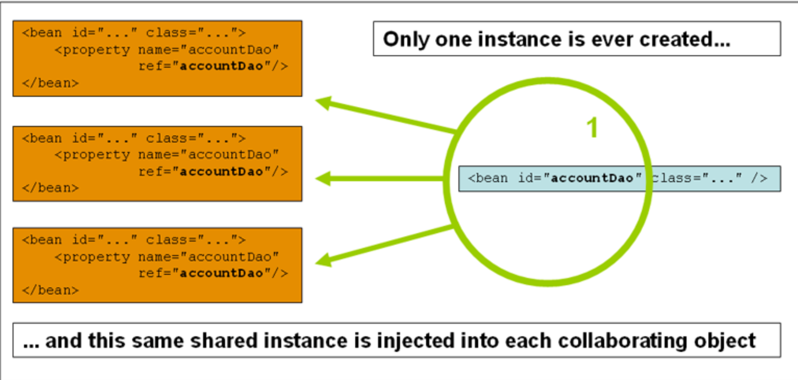
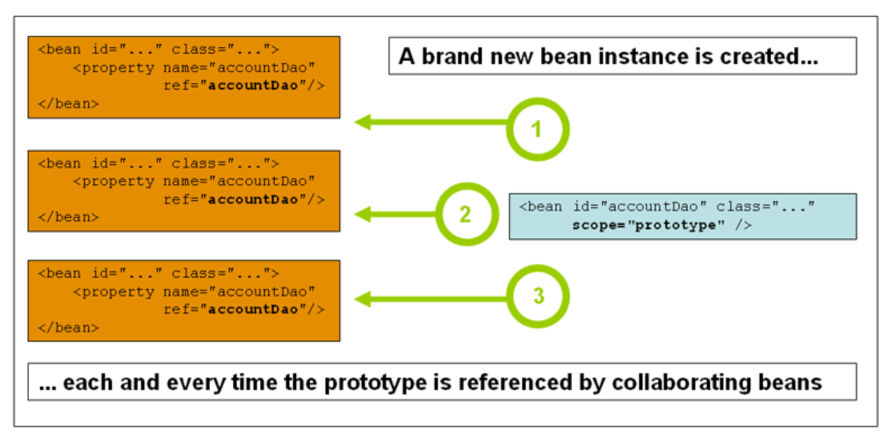

> 1. 作用域指的是一个范围,也就是在一个 Spring 的容器中
> 2. Bean 的作用域中 Bean 的来源指的是 BeanDefinition

下面是 Spring 的几种作用域:

| 来源        | 说明                                                      |
| ----------- | --------------------------------------------------------- |
| `singleton`   | Spring 默认的作用域,一个 BeanFactory 有且仅有一个实例     |
| `prototype`   | 原型作用域,每次依赖查找、注入的时候生成一个新的 bean 对象 |
| request     | 将 Spring Bean 存储在 ServletRequest 上下文中             |
| session     | 将 Spring Bean 存储在 HttpSession 中                      |
| application | 将 Spring Bean 存储在 ServletContext 中                   |

request、session、application 一般用于模板引擎渲染技术,目前前后端分离的架构下这些作用域基本只需要了解即可

## singleton



在 BeanDefinition 中可以看到定义了两个方法: `isSingleton、isPrototype`:

```java title=BeanDefinition
/**
 * Return whether this a <b>Singleton</b>, with a single, shared instance
 * returned on all calls.
 * @see #SCOPE_SINGLETON
 */
boolean isSingleton();

/**
 * Return whether this a <b>Prototype</b>, with an independent instance
 * returned for each call.
 * @since 3.0
 * @see #SCOPE_PROTOTYPE
 */
boolean isPrototype();
```

:::tip 说明
判断一个 Bean 的作用域是否是单例的,从本质上来说是判断该 Bean 的 BeanDefinition 中 isSingleton 的返回信息
:::

## prototype

> 原型模式下,每次请求都会生成一个新的 Bean 对象



### 依赖查找

可以看出来, 对于依赖查找来说: singleton 作用域的 Bean 每次都是同一个 Bean, prototype 作用域的 Bean 每次都会新生成一个

```java
/**
 * 测试 Bean 的作用域
 * @author <a href="mailto:zhuyuliangm@gmail.com">yuliang zhu</a>
 */
public class BeanScopeDemo {
  @Bean
  public static User singletonBean() {
      return getUser();
  }
  @Bean
  @Scope(ConfigurableBeanFactory.SCOPE_PROTOTYPE)
  public static User prototypeBean() {
      return getUser();
  }

  private static User getUser() {
      User user = new User();
      user.setId(System.nanoTime());
      user.setName("athu");
      return user;
  }
  public static void main(String[] args) {
      AnnotationConfigApplicationContext ctx = new AnnotationConfigApplicationContext();
      ctx.register(BeanScopeDemo.class);
      ctx.refresh();
      // 单例 singleton 作用域
      // out: user1 == user2:true
      compareBean(ctx, "singletonBean");

      // 测试 prototype 作用域
      // out: user1 == user2:false
      compareBean(ctx, "prototypeBean");
      ctx.close();
  }
  private static  void compareBean(AnnotationConfigApplicationContext ctx, String beanName) {
      // 第 1 次获取 Bean
      User user1 = ctx.getBean(beanName, User.class);
      // 第 2 次获取 Bean
      User user2 = ctx.getBean(beanName, User.class);

      System.out.println("user1 == user2:" + (user1 == user2));
  }
}
```

### 依赖注入

可以看出来,对于依赖注入来说:

1. <mark>对于普通的字段</mark>

    - singleton 作用域下,每次都是同一个 Bean 对象
    - prototype 作用域下,每次都是新的 Bean 对象
2. <mark>对于集合字段</mark>

    - singleton 作用域下,每次都是同一个 Bean 对象
    - prototype 作用域下,虽然经过多次请求生成了多个 Bean 对象,但是注入到集合中的只有一个,且与其他生成的对象也不是同一个

```java
/**
 * 测试依赖注入下的 Bean 的作用域
 * @author <a href="mailto:zhuyuliangm@gmail.com">yuliang zhu</a>
 */
public class BeanScopeDemo2 {
    @Bean
    public static User singletonBean() {
        return getUser();
    }
    @Bean
    @Scope(ConfigurableBeanFactory.SCOPE_PROTOTYPE)
    public static User prototypeBean() {
        return getUser();
    }

    // 注入单例的 Bean
    @Resource
    @Qualifier("singletonBean")
    private User singletonBean1;

    @Resource
    @Qualifier("singletonBean")
    private User singletonBean2;

    // 注入 prototype 的 Bean
    @Resource
    @Qualifier("prototypeBean")
    private User prototypeBean1;

    @Resource
    @Qualifier("prototypeBean")
    private User prototypeBean2;

    @Resource
    private Map<String, User> users;

    private static User getUser() {
        User user = new User();
        user.setId(System.nanoTime());
        user.setName("athu");
        return user;
    }
    public static void main(String[] args) {
        AnnotationConfigApplicationContext ctx = new AnnotationConfigApplicationContext();
        ctx.register(BeanScopeDemo2.class);
        ctx.refresh();
        BeanScopeDemo2 instance = ctx.getBean(BeanScopeDemo2.class);
        System.out.println("instance.singletonBean1 = " + instance.singletonBean1);
        System.out.println("instance.singletonBean2 = " + instance.singletonBean2);
        System.out.println("instance.prototypeBean1 = " + instance.prototypeBean1);
        System.out.println("instance.prototypeBean2 = " + instance.prototypeBean2);

        System.out.println("instance.users = " + instance.users);
        ctx.close();
    }
}
/**
  out:
    instance.singletonBean1 = User{id=17762563652422, name='athu'}
    instance.singletonBean2 = User{id=17762563652422, name='athu'}
    instance.prototypeBean1 = User{id=17762568187297, name='athu'}
    instance.prototypeBean2 = User{id=17762569134091, name='athu'}
    instance.users = {
      singletonBean=User{id=17762563652422, name='athu'}, 
      prototypeBean=User{id=17762575016227, name='athu'}
    }
 */
```

### 特殊性

- Spring 容器没有办法管理 prototype Bean 的完整生命周期,也没有办法记录实例的存在,Spring 只能拥有 prototype Bean 的元信息(BeanDefinition)
- prototype Bean **一旦注入后,就不再被 Spring 容器托管**
- ~~prototype Bean 的销毁方法也不会被执行,但是可以利用 BeanPostProcessor进行清理~~(不建议这么做)

下面通过示例展现如何进行 Singleton、Prototype Bean 的销毁:

1. 创建一个 POJO 对象

  ```java
  @Setter
  @Getter
  // 通过实现 BeanNameAware 可以知道 Bean 的名称
  public class User implements BeanNameAware {
    public Long id;
    public String name;

    private transient String beanName;

    @PostConstruct
    public void init() {
      System.out.printf("Bean[%s] 被初始化了...%n", beanName);
    }

    @PreDestroy
    public void destroy() {
      System.out.printf("Bean[%s] 被销毁了...%n", beanName);
    }

    @Override
    public void setBeanName(String name) {
      this.beanName = name;
    }
  }
  ```


2. 进行测试,通过测试可以看出来Singleton Bean 只会被初始化一次,Prototype Bean 则会被初始化多次,但是无法被销毁

    ```java
    public class DestroyPrototypeBeanDemo {
      @Bean
      public static User singletonBean() {
          return getUser();
      }
      @Bean
      @Scope(ConfigurableBeanFactory.SCOPE_PROTOTYPE)
      public static User prototypeBean() {
        return getUser();
      }

      // 注入单例的 Bean
      @Resource
      @Qualifier("singletonBean")
      private User singletonBean1;

      @Resource
      @Qualifier("singletonBean")
      private User singletonBean2;

      // 注入 prototype 的 Bean
      @Resource
      @Qualifier("prototypeBean")
      private User prototypeBean1;

      @Resource
      @Qualifier("prototypeBean")
      private User prototypeBean2;

      @Resource
      private Map<String, User> users;

      private static User getUser() {
        User user = new User();
        user.setId(System.nanoTime());
        user.setName("athu");
        return user;
      }
      public static void main(String[] args) {
        AnnotationConfigApplicationContext ctx = new AnnotationConfigApplicationContext();
        ctx.register(DestroyPrototypeBeanDemo.class);
        ctx.refresh();
        // Singleton Bean 的生命周期会被 Spring 接管
        ctx.close();
      }
    }
    /**
     * out:
        Bean[singletonBean] 被初始化了...
        Bean[prototypeBean] 被初始化了...
        Bean[prototypeBean] 被初始化了...
        Bean[prototypeBean] 被初始化了...
        Bean[singletonBean] 被销毁了...
     */
    ```


3. 销毁 Prototype Bean, 一般对注入了 Prototype Bean 依赖的类添加销毁方法,比如实现 `DisposableBean` 接口

    ```java
    @Override
    public void destroy() throws Exception {
        // Prototype Bean 的生命周期仅限于初始化,初始化之后就不会被 Spring 管理
        // 所以需要在销毁方法中手动的清理
        this.prototypeBean1.destroy();
        this.prototypeBean2.destroy();
        // 对于 Map 中的 Prototype Bean,则通过 BeanDefinitionName 判断是不是 Prototype
        for(Map.Entry<String, User> entry: this.users.entrySet()) {
            String beanName = entry.getKey();
            BeanDefinition beanDefinition = this.beanFactory.getBeanDefinition(beanName);
            // 如果是 Prototype 
            if (beanDefinition.isPrototype()) {
                entry.getValue().destroy();
            }
        }
    }

    /**
     * out:
        Bean[singletonBean] 被初始化了...
        Bean[prototypeBean] 被初始化了...
        Bean[prototypeBean] 被初始化了...
        Bean[prototypeBean] 被初始化了...
        Bean[prototypeBean] 被销毁了...
        Bean[prototypeBean] 被销毁了...
        Bean[prototypeBean] 被销毁了...
        Bean[singletonBean] 被销毁了...
     */
    ```

:::tip 提示
我们可以简单的认为 Prototype Bean 是一次性的,使用完的话建议进行清理
:::

## request

> 问题: 在 Request Scope 下,每次创建 HTTP 请求都会创建新的实例吗?

- 配置
  - XML: `<bean class="..." scope="request" />`
  - Java 注解: `@RequestScope / @Scope(WebApplicationContext.SCOPE_REQUEST)`
- 具体的实现
  - API: `AbstractRequestAttributesScope`

以简单的 Servlet 为例:

``` title="目录结构"
├── pom.xml
├── src
│   └── main
│       ├── java
│       │   ├── Domain
│       │   │   └── User.java
│       │   └── Request
│       │       ├── Controller
│       │       │   └── IndexController.java
│       │       └── WebConfiguration.java
│       ├── resources
│       │   └── META-INF
│       └── webapp
│           └── WEB-INF
│               ├── dispatcher-servlet.xml
│               ├── index.jsp
│               └── web.xml
```

①、 web.xml 配置 Servlet

```xml
<?xml version="1.0" encoding="UTF-8"?>
<web-app xmlns:xsi="http://www.w3.org/2001/XMLSchema-instance" 
          xmlns="http://java.sun.com/xml/ns/javaee"
         xsi:schemaLocation="http://java.sun.com/xml/ns/javaee http://java.sun.com/xml/ns/javaee/web-app_3_0.xsd"
         version="3.0">

    <!--配置 Servlet-->
    <servlet>
        <servlet-name>dispatcher</servlet-name>
        <servlet-class>org.springframework.web.servlet.DispatcherServlet</servlet-class>
    </servlet>

    <!--建立 Servlet 映射-->
    <servlet-mapping>
        <servlet-name>dispatcher</servlet-name>
        <url-pattern>/</url-pattern>
    </servlet-mapping>
</web-app>
```

②、配置 dispatcher-servlet,配置注解扫描

```xml
<?xml version="1.0" encoding="UTF-8"?>
<beans
        xmlns="http://www.springframework.org/schema/beans"
        xmlns:context="http://www.springframework.org/schema/context"
        xmlns:xsi="http://www.w3.org/2001/XMLSchema-instance"
        xsi:schemaLocation="http://www.springframework.org/schema/beans
        https://www.springframework.org/schema/beans/spring-beans.xsd
        http://www.springframework.org/schema/context
        https://www.springframework.org/schema/context/spring-context.xsd">


    <!-- 激活 Spring 注解驱动,扫描 -->
    <context:component-scan base-package="Request"/>

    <bean class="org.springframework.web.servlet.view.InternalResourceViewResolver">
        <property name="prefix" value="/WEB-INF/"/>
        <property name="suffix" value=".jsp"/>
    </bean>
</beans>
```

③、配置 Spring MVC 的配置信息,将 Bean 的作用域设置 Request

```java

@Configuration
// 启用 Spring MVC 
@EnableWebMvc
public class WebConfiguration {

    @Bean
    @RequestScope
    public User user() {
        User user = new User();
        user.setId(22L);
        user.setBeanName("athu");
        return  user;
    }
}
```

④、在 Controller 中配置映射

```java
@Controller
public class IndexController {

    // highlight-start
    @Resource
    private User user;  // CGLIB 代理后对象（不变的）
    // highlight-start

    @GetMapping("/index")
    public String index(Model model) {
        model.addAttribute("user", user)
        return "index";
    }
}
```

⑤、在 index.jsp 中访问 RequestScope 的 Bean 对象

```html
<html>
<body>
\${user.name} : ${user}
</body>
</html>
```

⑥、多次创建 HTTP 请求, 可以看到每次请求时,都会创建新的 User 对象

```shell
~ ➜ curl http://localhost:8080/index
<html>
<body>
${user.name} : Domain.User@2f0ce96
</body>
</html>

~ ➜ curl http://localhost:8080/index
<html>
<body>
${user.name} : Domain.User@119b397
</body>
</html>
```

## session

为了保持与服务端的会话状态, 在 Session Scope 下,每次创建 HTTP 请求都会使用同一个实例

- 配置
  - XML: `<bean class="..." scope="session" />`
  - Java 注解: `@SessionScope / @Scope(WebApplicationContext.SCOPE_SESSION)`
- 具体的实现
  - API: `SessionScope` (继承了 *AbstractRequestAttributesScope*)

## application

- 配置
  - XML: `<bean class="..." scope="application" />`
  - Java 注解: `@ApplicationScope / @Scope(WebApplicationContext.SCOPE_APPLICATION)`
- 具体的实现
  - API: `ServletContextScope`

## 自定义作用域

需要下面两步:

1. 实现 Scope : `org.springframework.beans.factory.config.Scope`
2. 注册 Scope(有两种方式来注册 Scope)
    - API: `ConfigurableBeanFactory#registerScope`
    - XML 配置: `CustomScopeConfigurer`

      ```xml
      <bean class="org.springframework.beans.factory.config.CustomScopeConfigurer">
        <property name="scopes">
          <map>
            <entry key="..."/>
          </map>
        </property>
      </bean>
      ```

:::info 实现基于 ThreadLocal 的 Scope

> 1. 基于 ThreadLocal 的作用域可以处理一些线程不安全的对象,但避免使用 prototype scope 带来的重复创建问题,比如SimpleDateFormat
>
> 2. Scope 的 get 方法用于返回一个 bean 对象,获取 bean 的方式决定了这个作用域的范围
>     - 获取 bean 的方式有很多,比如每次都返回一个 bean,每次返回同一个 bean,以及下面每一个线程返回同一个 bean

**1. 实现 Scope 接口**

```java
/**
 * 自定义基于ThreadLocal 的 Scope 作用域
 *
 * @author <a href="mailto:zhuyuliangm@gmail.com">yuliang zhu</a>
 */
public class ThreadLocalScope implements Scope {
    public static final String SCOPE_NAME = "thread-local";

    private static final NamedThreadLocal<Map<String,Object>> threadLocal = new NamedThreadLocal("thread-local-scope"){
        @Override
        protected Object initialValue() {
            return new HashMap<String,Object>();
        }
    };


    /**
     * 返回当前作用域中 name 对应的 bean 对象
     * @param name 需要查找的 bean 的名称
     * @param objectFactory 如果在当前作用域中无法通过name 找到 bean 对象,就用 ObjectFactory 查找
     * @return
     */
    @Override
    public Object get(String name, ObjectFactory<?> objectFactory) {
        Object bean = threadLocal.get().get(name);
        // 如果当前作用域中没有目标bean
        if (bean == null) {
            bean = objectFactory.getObject();
            threadLocal.get().put(name,bean);
        }
        return bean;
    }

    /**
     * 将 name 对应的bean 从当前作用域中移除
     * @param name 需要移除的bean 的名称
     * @return
     */
    @Override
    public Object remove(String name) {
        return threadLocal.get().remove(name);
    }

    /**
     * 用于注册销毁的回调
     */
    @Override
    public void registerDestructionCallback(String name, Runnable callback) {
        // TODO
    }

    /**
     * 用于解析上下文的数据,比如 Request 作用域将返回 request中的属性
     */
    @Override
    public Object resolveContextualObject(String key) {
        return threadLocal.get().get(key);
    }

    /**
     * 作用域会话标识,比如在 Session Scope 中,就是 sessionId
     */
    @Override
    public String getConversationId() {
        return String.valueOf(Thread.currentThread().getId());
    }
}
```

**2.注册 Scope 并进行测试**

通过测试可以看到,在同一个线程中,bean对象是同一个,在不同线程中,则是不同的 bean 对象

```java
public class ThreadLocalScopeDemo {

    @Bean
    @Scope(ThreadLocalScope.SCOPE_NAME)
    public User user() {
        User user = new User();
        user.setId(System.nanoTime());
        return user;
    }


    public static void main(String[] args) throws InterruptedException {
        AnnotationConfigApplicationContext ctx = new AnnotationConfigApplicationContext();
        ctx.register(ThreadLocalScopeDemo.class);
        // 注册 Scope
        ctx.addBeanFactoryPostProcessor(beanFactory -> {
            beanFactory.registerScope(ThreadLocalScope.SCOPE_NAME, new ThreadLocalScope());
        });

        ctx.refresh();
        // 循环创建线程获取 bean
        for (int i = 0; i < 2; i++) {
            Thread thread = new Thread(() -> {
                // 第一次获取 bean
                User user = ctx.getBean("user", User.class);
                System.out.printf("第一次获取Bean===> Thread[%d],user:%s%n", Thread.currentThread().getId(), user);

                User user2 = ctx.getBean("user", User.class);
                System.out.printf("第二次获取Bean===> Thread[%d],user:%s%n", Thread.currentThread().getId(), user2);
            });
            thread.start();
            thread.join();
        }
        ctx.close();
    }
}
/**
 * Bean[user] 被初始化了...
    第一次获取Bean===> Thread[12],user:User(id=10656030645682, name=null, beanName=user)
    第二次获取Bean===> Thread[12],user:User(id=10656030645682, name=null, beanName=user)
    Bean[user] 被初始化了...
    第一次获取Bean===> Thread[13],user:User(id=10656054164522, name=null, beanName=user)
    第二次获取Bean===> Thread[13],user:User(id=10656054164522, name=null, beanName=user)
 */
```

:::
