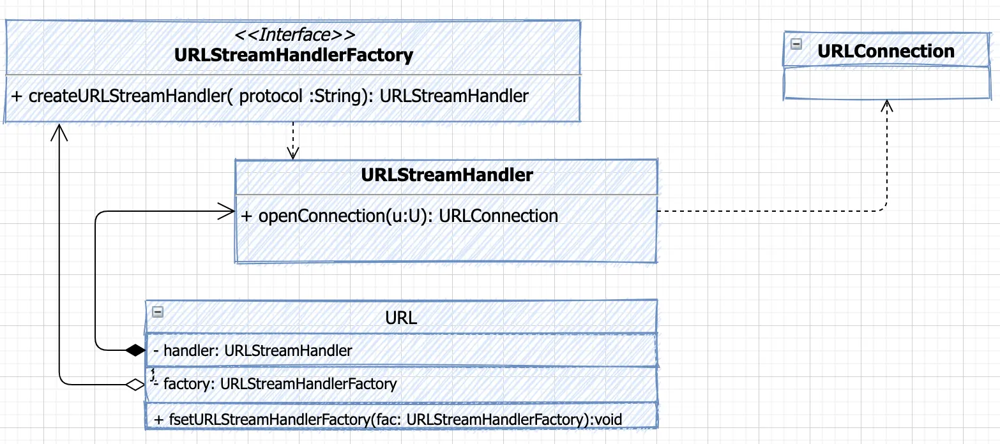

> 为什么 Spring 不使用 Java 标准资源管理,而是重新"造轮子"?
>
> 1. Java 标准资源管理很强大,但是扩展复杂,资源存储方式并不统一
> 2. Spring 需要"自理门户"

## Java 标准资源管理接口

Java 标准资源定位:

1. 面向资源
    - 文件系统
    - artifact(jar、war等文件)
    - 远程资源(HTTP、FTP 等)
    - ...
2. API 整合
    - java.lang.ClassLoader#getResource
    - java.io.File
    - java.net.URL
3. 资源定位
   - java.net.URL
   - java.net.URI
4. 面向流式存储
    - URLConnection
5. URL 协议拓展
    - java.net.URLStreamHandler
    - java.net.URLStreamHandlerFactory



### URLStreamHandlerFactory

可以看出来, `URLStreamHandlerFactory`是一个接口,在 java 中它有唯一的实现 `sun.misc.Launcher.Factory`,位于 `rt.jar` 目录之下

```java
  private static class Factory implements URLStreamHandlerFactory {
      private static String PREFIX = "sun.net.www.protocol";

      private Factory() {
      }

      public URLStreamHandler createURLStreamHandler(String protocol) {
          String clsName = PREFIX + "." + protocol + ".Handler";

          try {
              // 创建 URLStreamHandler对象:  加载 sun.net.www.protocol.[protocol].Handler
              Class cls = Class.forName(clsName);
              return (URLStreamHandler)cls.newInstance();
          } catch (ReflectiveOperationException var4) {
              throw new InternalError("could not load " + var1 + "system protocol handler", var4);
          }
      }
  }
```

可以看出来,在启动的时候,URLStreamHandlerFactory 的实现就会被 **Bootstrap ClassLoader** 所加载,并且会通过加载 `sun.net.www.protocol.[protocol].Handler` 来创建 **URLStreamHandler 对象**。

### URL

在 `java.net.URL` 中,通过以下的步骤创建 **URLStreamHandler 对象**:

1. 首先从 `URLStreamHandlerFactory#createURLStreamHandler` 创建 URLStreamHandler 对象(如果有的话)
    - 这一步会加载 `rt.jar` 下 `sun.net.www.protocol.${protocol} `路径的 `Handler` 类,并返回一个 URLStreamHandler 对象
2. 第 1 步没有创建成功的话,去加载自定义的 Handler 对象。定义了 packagePrefixList,将 Handler 路径字符串拼接起来,有下面的注意点:
    - 首先读取 Java Properties 的 `java.protocol.handler.pkgs` 变量,将其添加得到 packagePrefixList 中
    - 然后添加固定的 Handler 路径: `sun.net.www.protocol`
    - 多个 Handler 路径用 "|" 分隔
3. 第 2 步的基础上,得到 Handler 类的全路径,最后反射创建 URLStreamHandler 对象

```java
private static final String protocolPathProp = "java.protocol.handler.pkgs";

static URLStreamHandler getURLStreamHandler(String protocol) {
    URLStreamHandler handler = handlers.get(protocol);
    if (handler == null) {
        boolean checkedWithFactory = false;
        if (factory != null) {
            // 加载 sun.net.www.protocol.[protocol].Handler 路径的 URLStreamHandler 对象
            handler = factory.createURLStreamHandler(protocol);
        }
        if (handler == null) {
            String packagePrefixList = null;
            // 读取环境变量 java.protocol.handler.pkgs 的值
            packagePrefixList = java.security.AccessController.doPrivileged(
                new sun.security.action.GetPropertyAction(protocolPathProp,""));
            if (packagePrefixList != "") {
                packagePrefixList += "|";
            }
            packagePrefixList += "sun.net.www.protocol";
            StringTokenizer packagePrefixIter = new StringTokenizer(packagePrefixList, "|");
            while (handler == null && packagePrefixIter.hasMoreTokens()) {
                String packagePrefix = packagePrefixIter.nextToken().trim();
                try {
                    String clsName = packagePrefix + "." + protocol + ".Handler";
                    Class<?> cls = null;
                    try {
                        cls = Class.forName(clsName);
                    } catch (ClassNotFoundException e) {
                        ClassLoader cl = ClassLoader.getSystemClassLoader();
                        if (cl != null) {
                            cls = cl.loadClass(clsName);
                        }
                    }
                    if (cls != null) {
                        handler  = (URLStreamHandler)cls.newInstance();
                    }
                } catch (Exception e) {
                }
            }
        }
        // ...
    }
    return handler;
}
```

### 关于拓展协议

#### 内建的拓展协议

基于 `java.net.URLStreamHandler` 拓展协议, 在 jdk1.8 中的 rt.jar 中有下面几个内建的协议的实现:

| 协议   | 实现类                                |
| ------ | ------------------------------------- |
| file   | `sun.net.www.protocol.file.Handler`   |
| ftp    | `sun.net.www.protocol.ftp.Handler`    |
| http   | `sun.net.www.protocol.http.Handler`   |
| https  | `sun.net.www.protocol.https.Handler`  |
| jar    | `sun.net.www.protocol.jar.Handler`    |
| mailto | `sun.net.www.protocol.mailto.Handler` |
| netdoc | `sun.net.www.protocol.netdoc.Handler` |

#### 自定义拓展协议

当然,也可以基于 `java.net.URLStreamHandler` 自定义拓展协议,但是需要遵循下面的的原则

1. **实现类名必须为 `Handler`**
2. 默认情况下,类命名路径可以为 `sun.net.www.protocol.${protocol}.Handler`
3. 也可以通过 Java Properties `java.protocol.handler.pkgs` 指定实现类的包名,如果存在多包名指定,使用分隔符 "|"

实现方式主要有下面 3 种 :

1. 简单实现
    - 实现 URLStreamHandler 接口,且类名为 Handler,然后放在 `sun.net.www.protocol.${protocol}` 路径下
2. 自定义实现
    - 实现 URLStreamHandler 接口,且类名为 Handler
    - 添加 `-Djava.protocol.handler.pkgs` 启动参数,指向 URLStreamHandler 实现类的全类名
3. 高级实现
    - 实现 URLStreamHandlerFactory,并且传递到 URL 中

##### 示例

下面是简单的实现示例:

首先,实现自定义的 URLConnection

```java
/**
 * X 协议 对应的 URLConnection
 * 假定该协议是从 Classpath 获取资源,这里对具体的协议进行逻辑处理,比如如何获取 Stream
 *
 * @author <a href="mailto:zhuyuliangm@gmail.com">yuliang zhu</a>
 */
public class XURLConnection extends URLConnection {

    private final ClassPathResource resource;

    protected XURLConnection(URL url) {
        super(url);
        this.resource = new ClassPathResource(url.getPath());
    }

    @Override
    public void connect() throws IOException {
    }

    @Override
    public InputStream getInputStream() throws IOException {
        return resource.getInputStream();
    }
}
```

然后,在 sun.net.www.protocol.${protocol} 路径下创建 URLStreamHandler 的实现类 `Handler`

```java title='sun.net.www.protocol.x.Handler'
/**
 * 处理 X 协议的 {@link URLStreamHandler} 的实现
 *
 * @author <a href="mailto:zhuyuliangm@gmail.com">yuliang zhu</a>
 */
public class Handler extends URLStreamHandler {
    @Override
    protected URLConnection openConnection(URL u) throws IOException {
        return new XURLConnection(u);
    }
}
```

最后,我们进行测试:

```java
/**
 * 测试自定义的 X 协议实现
 *
 * @author <a href="mailto:zhuyuliangm@gmail.com">yuliang zhu</a>
 */
public class XProtocolDemo {
    public static void main(String[] args) throws IOException {
        URL url = new URL("x:///META-INF/prod.properties");
        InputStream inputStream = url.openStream();
        //out: name = pacos
        System.out.println(StreamUtils.copyToString(inputStream, Charset.forName("UTF-8")));
    }
}

```

## Spring 资源接口

Spring 的常见资源接口有下面几个:

- 输入流: `InputStreamSource`
- 只读资源: `Resource`
- 可写资源: `WritableResource`
- 编码资源: `EncodedResource`
- 上下文资源: `ContextResource`
  - 这个上下文指的是 ServletContext

## Spring 内建 Resource 实现

> Spring 提供了多少种内建的 Resource 实现呢?

Spring 提供了很多的内建 Resource 实现:

| 资源来源       | 资源协议       | 实现类                   |
|:--------------:|:--------------:|:------------------------:|
| Bean 定义       | 无             | `BeanDefinitionResource` |
| 数组            | 无             | `ByteArrayResource`      |
| 类路径           | classpath:/    | `ClasspathResource`      |
| 文件系统         | file:/         | `FileSystemResource`     |
| URL            | URL 支持的协议  | `UrlResource`            |
| ServletContext | 无            | `ServletContextResource` |

## Spring Resource 接口拓展(可写入+字符编码)

> Resource 能否支持写入以及字符集编码?

- 可写资源接口(WritableResource)
  - FileSystemResource
  - FileUrlResource(since 5.0.2) : 识别 file 协议的 URL
- 编码资源接口(EncodedResource)

这里借助 FileSystemResource 和 WritableResource 读取带有编码的文件:

```java
/**
 * 带有字符编码的{@link FileSystemResource} 示例
 * @author <a href="mailto:zhuyuliangm@gmail.com">yuliang zhu</a>
 * @see FileSystemResource
 * @see EncodedResource
 */
public class EncodedFileSystemResourceDemo {
    public static void main(String[] args) throws IOException {
        // 指定文件的路径
        // 获取当前 java 程序的根目录:  /Users/yoey/WorkSpace/Code/think-in-spring
        String dir = System.getProperty("user.dir");
        String filepath = dir + "/spring-demo/Resource/src/main/java/EncodedFileSystemResourceDemo.java";

        // 利用 FileSystemResource 读取资源
        FileSystemResource resource = new FileSystemResource(filepath);

        // 利用 EncodedResource 读取有字符编码的资源,传入 FileSystemResource
        EncodedResource encodedResource = new EncodedResource(resource, "UTF-8");

        String res = StreamUtils.copyToString(encodedResource.getInputStream(), Charset.forName("UTF-8"));
        System.out.println(res);
    }
}
```

:::tip 提示
通过 `System#getProperties` 可以获取当前 jvm 的系统变量,而系统变量中的`user.dir` 则是当前 java 程序的根目录
:::

## Spring 资源加载器

> 为什么 Spring 应用上下文也是一种 Spring 资源?

Spring 资源加载器的大致层次结构:

- ResourceLoader
  - DefaultResourceLoader(默认实现)
    - FileSystemResourceLoader
    - ClassRelativeResourceLoader
    - `AbstractApplicationContext`
  - ResourcePatternResolver
    - PathMatchingResourcePatternResolver

可以看出来 Spring 应用上下文也是一种 Spring 资源

### 文件资源加载器

这里使用ResourceLoader 对上面的示例进行重构:

```java
/**
 * 带有字符编码的{@link FileSystemResourceLoader} 示例
 * @author <a href="mailto:zhuyuliangm@gmail.com">yuliang zhu</a>
 * @see FileSystemResourceLoader
 * @see FileSystemResource
 * @see EncodedResource
 */
public class EncodedFileSystemResourceLoaderDemo {
    public static void main(String[] args) throws IOException {
        // 指定文件的路径
        // 获取当前 java 程序的根目录:  /Users/yoey/WorkSpace/Code/think-in-spring
        String dir = System.getProperty("user.dir");
        String filepath = "/" + dir + "/spring-demo/Resource/src/main/java/EncodedFileSystemResourceLoaderDemo.java";

        // 利用 ResourceLoader 加载资源
        FileSystemResourceLoader loader = new FileSystemResourceLoader();

        // 用过 ResourceLoader 获取 Resource 对象
        Resource resource = loader.getResource(filepath);

        // 利用 EncodedResource 读取有字符编码的资源,传入 FileSystemResource
        EncodedResource encodedResource = new EncodedResource(resource, "UTF-8");

        String res = StreamUtils.copyToString(encodedResource.getInputStream(), Charset.forName("UTF-8"));
        System.out.println(res);
    }
}
```

### 通配路径资源加载器和匹配器

> 如何理解路径通配 Ant 模式?

- **通配路径资源加载器**
  - 接口: `ResourcePatternResolver`
    - 它继承自 ResourceLoader,相较于ResourceLoader,支持传入单个参数 pattern,返回多个 Resource 资源
  - 实现: `PathMatchingResourcePatternResolver`
<br/>

  ```java
  public interface ResourcePatternResolver extends ResourceLoader {
    // classpath*: 的前缀可以匹配所有的 classpath,而不带*则只能匹配单签 classpath
    String CLASSPATH_ALL_URL_PREFIX = "classpath*:";
    Resource[] getResources(String locationPattern) throws IOException;
  }
  ```

- **路径匹配器**
  - 接口: `PathMatcher`
  - 实现: `AntPathMatcher`
<br/>

  ```java
  public interface PathMatcher {
    boolean isPattern(String path);
    boolean match(String pattern, String path);
    boolean matchStart(String pattern, String path);
    String extractPathWithinPattern(String pattern, String path);
    Map<String, String> extractUriTemplateVariables(String pattern, String path);
    Comparator<String> getPatternComparator(String path);
    String combine(String pattern1, String pattern2);
  }
  ```

#### 源码示例

这里我们查看下 ResourcePatternResolver 接口的实现类 PathMatchingResourcePatternResolver 的源码,可以简单的看到有几点:

1. 可以传入自定义的 ResourceLoader,默认使用 `DefaultResourceLoader`
2. 可以设置路径匹配器(PathMatcher), 默认使用 `AntPathMatcher`
3. 方法返回的是资源数组(Resource[]),所以是递归的获取 Resource
4. ...

```java
public class PathMatchingResourcePatternResolver implements ResourcePatternResolver {
  // 将 ResourceLoader 定义为不可变的
  private final ResourceLoader resourceLoader;
  // 定义路径匹配器(默认实现只有一个 AntPathMatcher)
  private PathMatcher pathMatcher = new AntPathMatcher();

  // 通配路径资源加载器,默认使用 DefaultResourceLoader
  public PathMatchingResourcePatternResolver() {
    this.resourceLoader = new DefaultResourceLoader();
  }
  // 也支持传入 ResourceLoader 的实现
  public PathMatchingResourcePatternResolver(ResourceLoader resourceLoader) {
    this.resourceLoader = resourceLoader;
  }

  // 设置 路径匹配器
  public void setPathMatcher(PathMatcher pathMatcher) {
    this.pathMatcher = pathMatcher;
  }

  // 获取资源本质上也是通过 ResourceLoader 去加载资源并获取 Resource 对象
  @Override
  public Resource getResource(String location) {
    return getResourceLoader().getResource(location);
  }

  // 利用 通配符去匹配获取资源
  @Override
  public Resource[] getResources(String locationPattern) throws IOException {
    // 如果是
    if (locationPattern.startsWith(CLASSPATH_ALL_URL_PREFIX)) {
      if (getPathMatcher().isPattern(locationPattern.substring(CLASSPATH_ALL_URL_PREFIX.length()))) {
        return findPathMatchingResources(locationPattern);
      }
      else {
        return findAllClassPathResources(locationPattern.substring(CLASSPATH_ALL_URL_PREFIX.length()));
      }
    }
    else {
     // ...
    }
  }
  protected Resource[] findAllClassPathResources(String location) throws IOException {
    String path = location;
    if (path.startsWith("/")) {
      path = path.substring(1);
    }
    // 获取 classpath 下的资源(一定是递归的获取)
    Set<Resource> result = doFindAllClassPathResources(path);
    if (logger.isTraceEnabled()) {
      logger.trace("Resolved classpath location [" + location + "] to resources " + result);
    }
    return result.toArray(new Resource[0]);
  }
  // ...
}
```

#### 基础示例

> 利用 PathMatchingResourcePatternResolver 获取资源的操作流程与 ResourceLoader 类似

```java
/**
 * {@link PathMatchingResourcePatternResolver} 的简单示例,通过通配符获取资源数组
 *
 * @author <a href="mailto:zhuyuliangm@gmail.com">yuliang zhu</a>
 * @see PathMatcher
 * @see ResourcePatternResolver
 * @see PathMatchingResourcePatternResolver
 */
public class PathMatchingResourcePatternResolverDemo {
    public static void main(String[] args) throws IOException {
        // 创建 FileSystemResourceLoader
        FileSystemResourceLoader loader = new FileSystemResourceLoader();

        // 创建一个 PathMatchingResourcePatternResolver 对象
        PathMatchingResourcePatternResolver resolver = new PathMatchingResourcePatternResolver(loader);

        // 定义通配路径字符串
        String dir = System.getProperty("user.dir");
        String pattern = "/" +dir + "/spring-demo/Resource/src/main/java/*.java";

        // 获取资源数组
        Resource[] resources = resolver.getResources(pattern);

        // out: 3
        System.out.println(resources.length);
    }
}

```

#### 自定义匹配器

> 如何拓展路径匹配的规则?

一般来说通过下面两个步骤来拓展路径匹配的规则:

1. 实现 `PathMatcher` 接口
2. "重置/替换" PathMatcher,通过 *PathMatchingResourcePatternResolver#setPathMatcher* 来设置自定义的路径匹配器

首先实现 PathMatcher 接口:

```java
/**
 * 自定义 {@link PathMatcher} 的实现
 *
 * @author <a href="mailto:zhuyuliangm@gmail.com">yuliang zhu</a>
 */
public class CustomizePathMatcher implements PathMatcher {
    @Override
    public boolean isPattern(String path) {
        return path.endsWith(".java");
    }
    @Override
    public boolean match(String pattern, String path) {
        return path.endsWith(".java");
    }
   // ...
}
```

然后进行测试:

```java
/**
 * 拓展通配路径资元: 实现{@link PathMatcher} 接口,并且自定义匹配模式
 *
 * @author <a href="mailto:zhuyuliangm@gmail.com">yuliang zhu</a>
 * @see PathMatcher
 * @see PathMatchingResourcePatternResolver
 */
public class CusPathMatchingResourcePatternResolverDemo {
    public static void main(String[] args) throws IOException {
        // 创建 FileSystemResourceLoader
        FileSystemResourceLoader loader = new FileSystemResourceLoader();

        // 创建一个 PathMatchingResourcePatternResolver 对象
        PathMatchingResourcePatternResolver resolver = new PathMatchingResourcePatternResolver(loader);

        // 设置自定义的 PathMatcher 实现类
        resolver.setPathMatcher(new CustomizePathMatcher());

        // 定义通配路径字符串
        String dir = System.getProperty("user.dir");
        String pattern = "/" +dir + "/spring-demo/Resource/src/main/java/*.java";

        // 获取资源数组
        Resource[] resources = resolver.getResources(pattern);

        // out: 5
        System.out.println(resources.length);
    }
}
```

## 依赖注入 Spring Resource

> 如何在 XML 和 Java 注解的场景下注入 Resource 对象,而不是通过 API 的方式

- 基于 `@Value` 实现

  ```java
  @Value("classpath:/...")
  private Resource resource;
  ```

下面使用  @Value 注解进行注入测试:

```java
/**
 * 通过 {@link Value} 注入 Resource
 *
 * @author <a href="mailto:zhuyuliangm@gmail.com">yuliang zhu</a>
 * @see Value
 * @see Resource
 * @see AnnotationConfigApplicationContext
 */
public class InjectingResourceDemo {
    //highlight-start
    @Value("classpath:/META-INF/default.properties")
    public Resource resource;

    @Value("classpath*:/META-INF/*.properties")
    public Resource[] resources;

    @Value("${user.dir}")
    public String dir;
    //highlight-end

    @PostConstruct
    public void init () throws IOException {
        // out: name = athu
        System.out.println(StreamUtils.copyToString(resource.getInputStream(), Charset.forName("UTF-8")));
        System.out.println("---------");
        Stream.of(resources).forEach((item) -> {
            try {
                // out: name = athu , name = pacos
                System.out.println(StreamUtils.copyToString(item.getInputStream(), Charset.forName("UTF-8")));
            } catch (IOException e) {
                throw new RuntimeException(e);
            }
        });
        System.out.println("---------");
        // out: /Users/yoey/WorkSpace/Code/think-in-spring
        System.out.println(dir);
    }
    public static void main(String[] args) {
        AnnotationConfigApplicationContext ctx = new AnnotationConfigApplicationContext();
        ctx.register(InjectingResourceDemo.class);
        ctx.refresh();
        ctx.close();
    }
}
```

:::tip 提示

1. @Value 注解除了可以获取外部化配置,还可以依赖注入,比如注入 Resource 资源
2. @Value 注解的处理和@Autowired 注解类似,都是在 *AutowiredAnnotationBeanPostProcessor* 中处理的,并且依赖注入的操作是在填充 Bean 属性(populateBean) 中进行操作的

:::

## 依赖注入 ResourceLoader

> 除了通过 ResourceLoaderAware 的方式,还有哪些注入方法?

注入 ResourceLoader 的方式有下面 3 种:

1. 实现 `ResourceLoaderAware` 接口,这个需要依赖于 Spring 应用上下文环境
2. 通过 `@Autowired` 注解注入 ResourceLoader
3. 注入 `ApplicationContext` 作为 ResourceLoader,具体参看[这里](Bean生命周期#依赖applicationcontext)

```java
/**
 * 注入 {@link ResourceLoader}
 *
 * @author <a href="mailto:zhuyuliangm@gmail.com">yuliang zhu</a>
 * @see AnnotationConfigApplicationContext
 * @see ApplicationContext
 * @see ResourceLoader
 * @see ResourceLoaderAware
 */
public class InjectingResourceLoaderDemo implements ResourceLoaderAware{

    private ResourceLoader resourceLoader;

    @Autowired
    private ResourceLoader autowiredResourceLoader;

    @Autowired
    private ApplicationContext applicationContext;

    @PostConstruct
    public void init() {
        // out: resourceLoader == autowiredResourceLoader:true
        System.out.println("resourceLoader == autowiredResourceLoader:" + (resourceLoader == autowiredResourceLoader));
        // out: resourceLoader == applicationContext:true
        System.out.println("resourceLoader == applicationContext:" + (resourceLoader == applicationContext));
    }

    @Override
    public void setResourceLoader(ResourceLoader resourceLoader) {
        this.resourceLoader = resourceLoader;
    }

    public static void main(String[] args) {
        AnnotationConfigApplicationContext ctx = new AnnotationConfigApplicationContext();
        ctx.register(InjectingResourceLoaderDemo.class);
        ctx.refresh();
        ctx.close();
    }
}
```
