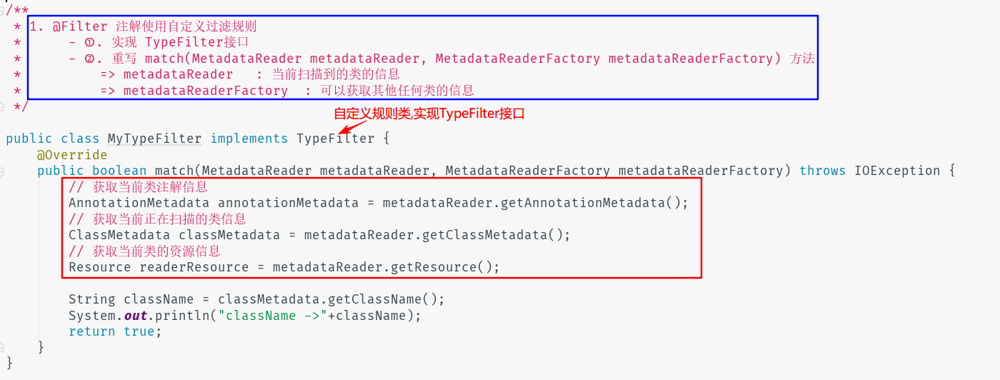

## @Configuration和@Bean

- **标注在类上**
- **作用 : 可以`向IOC 容器中注册组件 ( 代替之前的配置文件 `)**
- **注解的含义?**
   - `@Configuration`
      - **标注在配置类上, 表明这是一个配置类**
      - 等同于之前Spring的配置文件
   - `@Bean`
      - **标注在获取Bean 对象的方法上 , 用于给容器注册一个Bean**
      - 等同于Spring 配置文件中的 `<bean id="xxx" class="xxxx"> </bean>`
         - `返回值类型` : 就是bean 的类型class
         - `方法名` : 就是bean 的唯一标识id

:::info 注解使用步骤?
1. **定义一个配置类 , 并且使用 @Configuration 注解在该类上进行标注**

2. **定义一个获取Bean对象的方法,并且使用 @Bean 对该方法进行标注**

3. **使用AnnotationConfigApplicationContext 指定配置类的位置,并获取bean对象**
    - 可以通过 `annotationConfigApplicationContext.getBeanDefinitionNames()` 获取IOC容器中所有注册的bean


:::


## @ComponentScan(包扫描注册)

- **标注在配置类上面**

- **作用: 通过包扫描的方式向 IOC中注入Bean**
  - 相当于配置文件中的 `<context:component-scan>`, 以及包含排除bean 的 子节点
   
- **注解的属性?**
  
   - `value` :   指定要扫描的包
    
   - `excludeFilters`  : 扫描时 指定需要排除的bean
    
   - 是一个 `@Filter 注解的数组` , 包含以下属性
     
      - `type` : 按什么方式进行排除,**默认是 Annotation**
      - `classes` : 哪些类型的需要排除 (比如可以指定不扫描带有 @Controller注解的类)
    
   - `includeFilters`    : 需要扫描的包
    
   - `useDefaultFilters`  : 是否使用默认过滤,使用@includeFilters 时必须使用这个注解

::::info 使用步骤

1. 在配置类上 标注上 @ComponentScan 注解 , 通过 value 属性指定要扫描的包
2. 可以通过 excludeFilters /  includeFilters  属性指定扫描规则


:::


### @Filter注解详解

- **作用 : @Filter 注解 可以在包扫描时, 指定扫描规则**

- **@Filter的type属性**
   - `FilterType.Annotation`  :  按照注解过滤
   - `FilterType.Assignable_Type` : 按照指定的类过滤
   - `FilterType.Custom`       : 按照自定义规则
   - `FilterType.Regex` : 使用正则表达式过滤
   - `FilterType.AspectJ`    : 使用AspectJ表达式过滤
- **如何自定义过滤规则?**
   1. **实现 TypeFilter接口**

   2. 重写 `match(MetadataReader metadataReader, MetadataReaderFactory metadataReaderFactory)`方法
      - `metadataReader`  : 当前扫描到的类的信息

         - `metadataReader.getAnnotationMetadata()` : 获取当前类的注解信息

         - `metadataReader.getClassMetadata()`      : 获取当前类的类信息

         - `metadataReader.getResource()`: 获取当前类的资源信息

       - `metadataReaderFactory`  : 可以获取其他任何类的信息
   3. **在@Filter 注解中使用**
      - type 就是  FilterType.Custom 
      - classes 就是自定义规则类

:::info 代码实现

**1.自定义TypeFilter实现类**



<br/>

**2. 自定义TypeFilter实现类**


:::


## 其他针对Bean对象的注解

1. `@Scope`
2. `@Lazy`

### @Scope

- **标注在 获取Bean 对象的方法上面**
- **作用 : 指定组件的作用域 ( 默认IOC容器中的组件都是单例的! )**
  -  相当于 `<bean>` 的 `scope` 属性
- 通过 @Scope 的 `value` 属性**指定作用域**有两个可选值

   - `singleton    `
     - 单例的 , 默认值 
     - **初始化IOC容器时 , 就会创建bean 的实例**
   - `prototype`
     - 原型的 ( 多实例的! )
     - **每次从IOC容器中获取bean对象时 , 都会创建bean的实例**

- **使用方式?**
  - 在获取Bean对象的方法上面进行标注 @Scope 注解

**代码示例:**

```java
/**
  @Scope 注解的使用
*/
@Configuration
public class MyConfig2 {

    //@Scope(value = "prototype")  //prototype : 原型的,每次从IOC容器中获取bean对象时,都会创建bean的实例
    @Scope(value = "singleton")   //singleton  : 单例的,初始化IOC容器时,就会创建bean的实例,然后使用
    @Bean(value = "person")
    public Person person(){
        return new Person("Lucy",25);
    }
}
```

### @Lazy

- **标注在 获取Bean 对象的方法上面**
- **作用 : 针对@Scope 作用域是 singleton 的单实例bean , 可以在容器初始化时不创建对象,而是在第一次获取这个bean 的时候再去创建**


