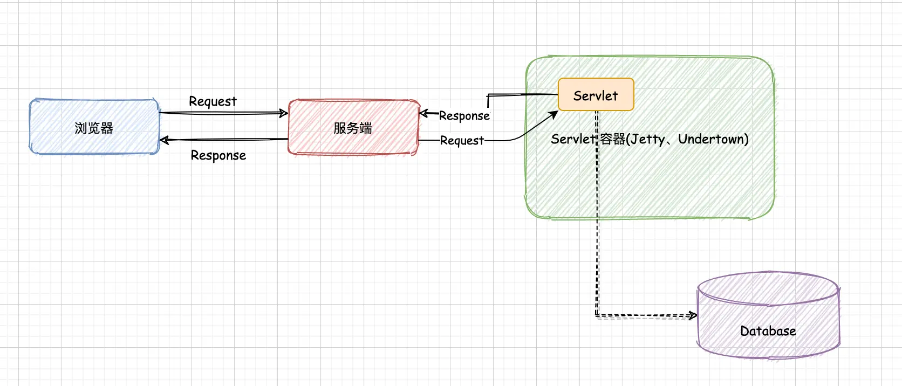
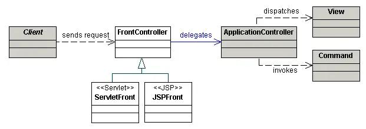
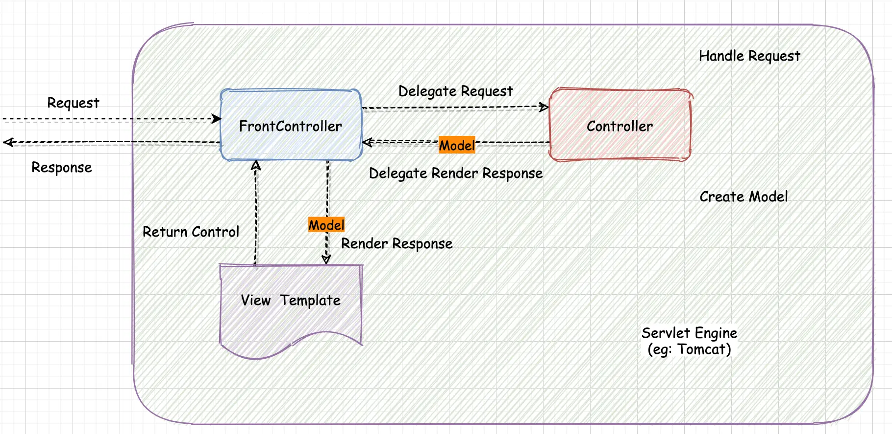
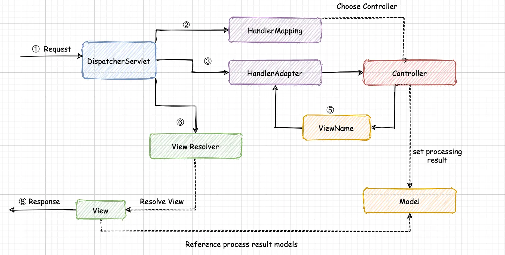
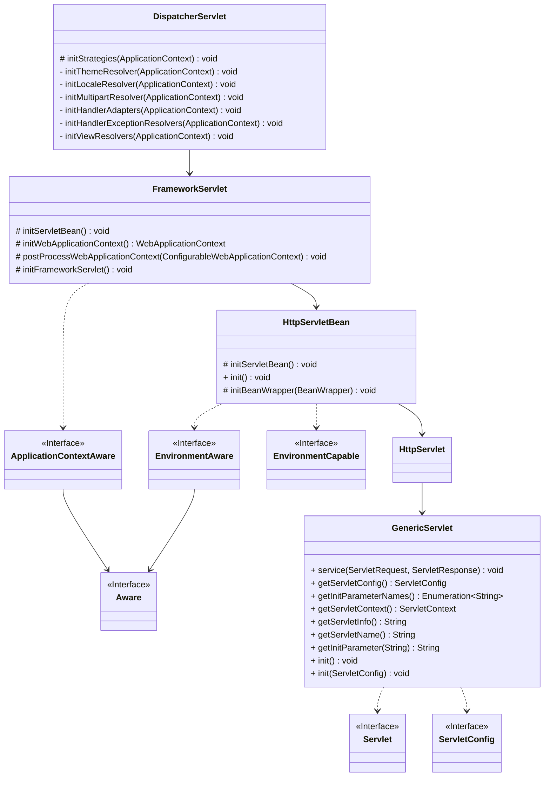

## SpringMvc 架构

### 基础架构-Servlet



Servlet 有以下的特点:

1. 请求模式: 请求/响应式(Request/Response)
2. 会屏蔽网络通信的细节,无需关注底层请求的处理
3. 包含完整的生命周期

Servlet 有以下的职责:

1. 处理请求
2. 资源管理 (连接数据库,处理本地资源...)
3. 视图的渲染

### 核心架构-前端控制器

> SpringMvc 核心架构使用 *前端控制器(FrontController)* 的模式



- 大致流程
  - 首先客户端发送请求给前端控制器(FrontController)
  - 然后前端控制器将请求"委派"给应用控制器(ApplicationController)处理
  - 应用控制器收到请求后会将请求转发给具体的视图(View),同时还可能会执行某个服务,并将该服务产生的数据给到视图去"渲染"
- SpringMVC 中的具体实现类: `DispatcherServlet`

### SpringMvc 架构



## 认识 SpringMvc

### 一般认识

一般情况下,我们需要通过以下步骤来处理一个 http 请求:

1. 实现 Controller
2. 配置 Web MVC 组件
    - ComponentScan
    - RequestMappingHandlerMapping
    - RequestMappingHandlerAdapter
    - InternalResourceViewResolver
3. 部署 DispatcherServlet

首先需要创建一个 Controller:

```java
@Controller  
public class AddressController {  
    /**  
     * 返回一个 View 的字符串名称  
     */  
    @GetMapping("")  
    public String index() {  
        return "index";  
    }  
}
```

然后在 webapp 目录下创建 WEB-INF/jsp 目录,用于存放 jsp 文件,然后新建 `WEB-INF/app-context.xml` 文件,也就是 MVC 的应用上下文配置文件

```xml
<?xml version="1.0" encoding="UTF-8"?>  
<beans xmlns="http://www.springframework.org/schema/beans"  
       xmlns:xsi="http://www.w3.org/2001/XMLSchema-instance"  
       xmlns:context="http://www.springframework.org/schema/context"  
       xsi:schemaLocation="http://www.springframework.org/schema/beans
                           http://www.springframework.org/schema/beans/spring-beans.xsd        	
                           http://www.springframework.org/schema/context
                           http://www.springframework.org/schema/context/spring-context.xsd">  
  
    <!--配置组件扫描-->  
    <context:component-scan base-package="com.pacos"/>  
  
    <!--配置 RequestMappingHandler-->    <bean class="org.springframework.web.servlet.mvc.method.annotation.RequestMappingHandlerMapping"/>  
    <bean class="org.springframework.web.servlet.mvc.method.annotation.RequestMappingHandlerAdapter"/>  
  
    <!--配置视图解析器:jsp-->  
    <bean class="org.springframework.web.servlet.view.InternalResourceViewResolver">  
        <!-- 相对于 webapp 目录下-->  
        <property name="prefix" value="/WEB-INF/jsp/"/>  
        <property name="suffix" value=".jsp"/>  
    </bean>  
</beans>
```

最后在 webapp 下新建 web.xml, 来配置 `DispatcherServlert`

```xml
<web-app>
    <servlet>
        <servlet-name>app</servlet-name>
        <servlet-class>org.springframework.web.servlet.DispatcherServlet</servlet-class>
        <load-on-startup>1</load-on-startup>
        <init-param>
            <param-name>contextConfigLocation</param-name>
            <param-value>/WEB-INF/app-context.xml</param-value>
        </init-param>
    </servlet>
    <servlet-mapping>
        <servlet-name>app</servlet-name>
        <url-pattern>/</url-pattern>
    </servlet-mapping>
</web-app>
```

### 重新认识

#### 核心组件

1. 处理器管理
    - 映射: `HandlerMapping`
    - 适配器: `HandlerAdapter`
    - 执行链: `HandlerExecutionChain`
2. 页面渲染
    - 视图解析: `ViewResolver`
    - 国际化: `LocaleResolver`、`LocalContextResolver`
    - 个性化: `ThemeResolver`
3. 异常处理
    - 异常解析: `HandlerExceptionResolver`

下面是组件的说明:

1. [HandlerMapping](https://docs.spring.io/spring/docs/5.2.2.RELEASE/spring-framework-reference/web.html#mvc-handlermapping)
   - 请求(Request) 与 处理器(Handler)和拦截器 (HandlerInterceptor) 的映射列表，其映射关系基于不同的 `HandlerMapping` 有不同的实现细节
     - Handler 就是自定义的处理方法
   - 有两种主要的 HandlerMapping 实现:
     - `RequestMappingHandlerMapping` :支持标注 `@RequestMapping` 的方法
     - SimpleUrlHandlerMapping:  维护精确的URI 路径与处理器的映射
2. HandlerAdapter
   - 帮助 `DispatcherServlet` 调用请求处理器(Handler), 无需关注其中实际的调用细节。比如，调用注解实现的 Controller 需要解析其关联的注解
   - **HandlerAdapter 的主要目的是为了屏蔽与 `DispatcherServlet` 之间的诸多细节**
3. [HandlerExceptionResolver](https://docs.spring.io/spring/docs/5.2.2.RELEASE/spring-framework-reference/web.html#mvc-exceptionhandlers)
   - 解析异常相关
   - 可能策略是将异常处理映射到其他处理器(Handlers), 或到某个 HTML 错误页面,或者其他
4. [ViewResolver](https://docs.spring.io/spring/docs/5.2.2.RELEASE/spring-framework-reference/web.html#mvc-viewresolver)
   - 从处理器(Handler)返回字符类型的逻辑视图名称解析出实际的 `View` 对象,该对象将渲染后的内容输出到HTTP 响应中
5. LocaleResolver、LocaleContextResolver
   - 从客户端解析出 `Locale`, 为其实现国际化视图
6. [MultipartResolver](https://docs.spring.io/spring/docs/5.2.2.RELEASE/spring-framework-reference/web.html#mvc-multipart)
   - 解析多部分请求(如 Web 浏览器文件上传)的抽象实现

组件之间的交互在 `DispatcherServlet#doDispatch`,其中的大致流程如下:



#### 注解驱动

> 注解驱动下, 可以通过以下的注解、类来拓展 SpringMvc,其中很重要的就是 `@EnableWebMvc`

1. 配置注解: `@Configuration`
2. 组件激活: `@EnableWebMvc`
    - 该注解会注册一些核心组件,比如*RequestMappingHandlerMapping*、*RequestMappingHandlerAdapter*...
1. 自定义组件: 实现 `WebMvcConfigurer` 接口中的目标方法,比如 *addInterceptors*

下面是 @EnableWebMvc 注解的基本处理功能,它 *@Import* 了 `DelegatingWebMvcConfiguration` 及其父类 `WebMvcConfigurationSupport`

```java
// @EnableWebMvc 注解
@Retention(RetentionPolicy.RUNTIME)
@Target(ElementType.TYPE)
@Documented
@Import(DelegatingWebMvcConfiguration.class)
public @interface EnableWebMvc {
  
}

// DelegatingWebMvcConfiguration 类
@Bean
public RequestMappingHandlerMapping requestMappingHandlerMapping(...) {
  // ... [注册 RequestMappingHandlerMapping]
}

@Bean
@Nullable
public HandlerMapping viewControllerHandlerMapping() {
  // ... [注册 HandlerMapping]
}

@Bean
public RequestMappingHandlerAdapter requestMappingHandlerAdapter(...){
  // ... [注册 RequestMappingHandlerAdapter]
}

// ...

// WebMvcConfigurationSupport 类
@Bean
public HttpRequestHandlerAdapter httpRequestHandlerAdapter() {
  return new HttpRequestHandlerAdapter();
}

@Bean
public HandlerExceptionResolver handlerExceptionResolver(...) {
  // ...
}

// ...
```

下面使用注解的方式修改[代码](Web%20MVC%20核心#一般认识):

首先定义一个 SpringMvc 的配置注解类,**@EnableWebMvc 默认 注册的 ViewResolver 没有配置 prefix 和 suffix,所以需要调整**:

```java
/**
 * SpringMvc 的配置注解类
 *
 * @author <a href="mailto:zhuyuliangm@gmail.com">yuliang zhu</a>
 *
 * @see Configuration
 * @see EnableWebMvc
 */

@Configuration
@EnableWebMvc
public class WebMvcConfig {
    @Bean
    public ViewResolver viewResolver() {
        InternalResourceViewResolver viewResolver = new InternalResourceViewResolver();
        viewResolver.setPrefix("/WEB-INF/jsp/");
        viewResolver.setSuffix(".jsp");
        return viewResolver;
    }
}
```

然后在 WEB-INF 下 的 SpringMvc 应用上下文配置文件中,配置启用包扫描(也会启用注解功能)

```xml
<!--配置组件扫描-->
<context:component-scan base-package="com.pacos"/>
```

#### 其他注解

SpringMvc 还有其他的一些注解:

1. 模型属性: `@ModelAttribute`
2. 请求头: `@RequestHeader`
3. Cookie: `@CookieValue`
4. 参数校验: `@Valid、@Validated` ,这个依赖于 Spring 本身的数据校验绑定
5. 异常处理: `@ExceptionHandler`
   - 对应的 Resolver:  `ExceptionHandlerExceptionResolver`
   - 在 [WebMvcConfigurationSupport](Web%20MVC%20核心#注解驱动) 中进行注册
6. 切面通知: `@ControllerAdvice`

SpringMvc 中, 通常会注册 `RequestMappingHandlerAdapter`,它是[核心组件-HandlerAdapter 接口](Web%20MVC%20核心#核心组件) 的实现类,它还实现了 *InitializingBean*,所以在 它进行初始化的时候的时候会执行 *afterPropertiesSet* 方法,其中会有几个重要方法:

1. **getDefaultArgumentResolvers**: 返回处理方法参数的 Resolver,比如处理 @RequestParam、@RequestBody、@RequestHeader…
2. **getDefaultInitBinderArgumentResolvers**: 返回处理方法参数绑定的 Resolver,比如处理  @RequestParam、@PathVariable …
3. **getDefaultReturnValueHandlers**: 返回处理返回值的 Handler,比如处理@ResponseBody、@ModelAttribute、@RequestResponseBody…

```java

	@Override
	public void afterPropertiesSet() {
		// Do this first, it may add ResponseBody advice beans
		initControllerAdviceCache();

		if (this.argumentResolvers == null) {
      // 返回处理方法参数的 Resolver
			List<HandlerMethodArgumentResolver> resolvers = getDefaultArgumentResolvers();
			this.argumentResolvers = new HandlerMethodArgumentResolverComposite().addResolvers(resolvers);
		}
		if (this.initBinderArgumentResolvers == null) {
      // 返回处理方法参数绑定的 Resolver
			List<HandlerMethodArgumentResolver> resolvers = getDefaultInitBinderArgumentResolvers();
			this.initBinderArgumentResolvers = new HandlerMethodArgumentResolverComposite().addResolvers(resolvers);
		}
		if (this.returnValueHandlers == null) {
      // 返回处理返回值的 Handler
			List<HandlerMethodReturnValueHandler> handlers = getDefaultReturnValueHandlers();
			this.returnValueHandlers = new HandlerMethodReturnValueHandlerComposite().addHandlers(handlers);
		}
	}
```

### SpringMvc 的启动

> 这里的 Servlet 容器以 Tomcat 为例

在 Servlet3.0 之前,我们需要定义 `web.xml`,比如下面的:

```xml
<web-app>
	<!-- 
			配置contextConfigLocation 初始化参数：指定Spring IoC容器配置文件路径
 	-->
  <context-param>
      <param-name>contextConfigLocation</param-name>
      <param-value>/WEB-INF/applicationContext.xml</param-value>
  </context-param>

  <!-- 配置 ContextLoaderListerner：Spring MVC在Web容器中的启动类，负责Spring IoC容器在Web上下文中的初始化 -->
  <listener>
      <listener-class>org.springframework.web.context.ContextLoaderListener</listener-class>
  </listener>

  <servlet>
      <servlet-name>court</servlet-name>
      <servlet-class>org.springframework.web.servlet.DispatcherServlet</servlet-class>
      <init-param>
          <!-- court-servlet.xml：定义WebAppliactionContext上下文中的bean -->
          <param-name>contextConfigLocation</param-name>
          <param-value>classpath*:court-servlet.xml</param-value>
      </init-param>
      <load-on-startup>0</load-on-startup>
  </servlet>

  <servlet-mapping>
      <servlet-name>court</servlet-name>
      <url-pattern>/</url-pattern>
  </servlet-mapping>
</web-app>
```

在 上述的 web.xml 配置文件中,有两个主要的配置:

1. `ContextLoaderListener` : SpringMvc 的 Web 容器中的启动类,并且负责 Spring IOC 容器在 Web 上下文中的初始化
2. `DispatcherServlet`: 前端控制器,主要用于接受的 HTTP 请求和转发 HTTP 请求

#### Tomcat 的启动

Tomcat 使用的 web.xml 有下面的节点(按照解析顺序)

- `context-param`: 为 ServletContext 提供键值对，即应用程序上下文信息
- `listener`
- `filter`
- `servlet`
  - 用于定义 Servlet 的名称 和 类的限定名
  - servlet 的初始化顺序按照 `load-on-startup` 元素指定的值
    - 如果值为正数或零，则按照从小到大的顺序初始化
    - 如果值为负数或未定义，则在第一次请求时初始化
  - servlet-mapping 用于访问指定 servlet 的 URL, 且 servlet-mapping 必须出现在 servlet 之后

Tomcat 大致流程解析流程:

1. Tomcat 启动的时候会解析 `context-param`,然后创建 `ServletContext` 对象,并且将 context-param 转为键值对赋给 ServletContext
2. 然后解析 `listener` 标签,并且根据 listener-class 创建监听器实例
   - 如果监听器类实现了 `ServletContextListener` 接口,那么它的 `contextInitialized(ServletContextEvent sce)` 和 `contextDestroyed(ServletContextEvent sce)`会在  ServletContext 对象创建和销毁时被调用
   - Spring 的 `ContextLoaderListener` 就实现了  ServletContextListener 接口

#### 上下文的层次性

> **关于 DispatcherServlet、WebApplicationContext、ServletContext 的关系?**

首先看下 DispatcherServlet 的继承关系:



首先需要了解 SpringMvc 的启动过程:

1. 首先对于一个 Web 应用来说, 我们会将其部署在 Tomcat 这种 Servlet 容器中, 容器提供了一个全局的上下文环境,这个上下文环境就是 `ServletContext`, 它为 SpringIOC 容器提供一个宿主环境
2. 然后在 Tomcat 启动的时候,会触发容器初始化事件, 配置的 `ContextLoaderListener` 会监听到这个事件,然后会触发 `contextInitialized` 方法

    - SpringMvc 会创建一个 Spring Web 应用上下文(*根上下文*): `WebApplicationContext`, 它有一个实现类: `XmlWebApplicationContext`

    - 在创建 WebApplicationContext 的时候,会通过 `ServletContext` 获取到 web.xml 中的 context-param 的值 [ param-name= contextConfigLocation], 然后在读取到值之后,就会将其设置给 Spring Web 应用上下文
    - 当 Spring Web 应用上下文初始化完成后, 会将器存储在 `ServletContext` 中
3. 其次 ContextLoaderListener 监听器初始化完成之后, Tomcat 会开始初始化 web.xml 中配置的 Servlet,并执行其 `init` 方法,比如 `DispatcherServlet`:

    - DispatcherServlet 就是前端控制器,用于转发、匹配、处理每一个 Servlet 请求, **并且它在初始化的时候会建立自己的 应用上下文**
- 它的`init` 方法在 `HttpServletBean` 这个类中实现,其主要工作是:
      - 做一些初始化工作，将我们在web.xml中配置的参数书设置到Servlet中
      - 然后再触发 `FrameworkServlet#initServletBean`方法,它有下面的作用:
        - 初始化Spring子上下文，设置其父上下文，并将其放入ServletContext中
        - 在调用 initServletBean() 的过程中同时会触发 DispatcherServlet#onRefresh()方法, 这个方法会初始化 SpringMvc 的各个功能组件。比如异常处理器、视图处理器、请求映射处理等。
- DispatcherServlet 初始化完成后,SpringMvc 会**以 Servlet 的名称作为 *key*, 也将其存储在 `ServletContext`中**, 这样每个 Servlet 都会有自己的 ApplicationContext 上下文

```java
// ContextLoaderListener
public class ContextLoaderListener extends ContextLoader implements ServletContextListener {
  public ContextLoaderListener() {
  }
  public ContextLoaderListener(WebApplicationContext context) {
      super(context);
  }
  // highlight-start
  public void contextInitialized(ServletContextEvent event) {
    this.initWebApplicationContext(event.getServletContext());
  }
  public void contextDestroyed(ServletContextEvent event) {
    this.closeWebApplicationContext(event.getServletContext());
    ContextCleanupListener.cleanupAttributes(event.getServletContext());
  }
  // highlight-end
}

// 初始化 WebApplicationContext
public WebApplicationContext initWebApplicationContext(ServletContext servletContext) {
  try {
    if (this.context == null) {
       // highlight-start
      // 创建 WebApplicationContext
      this.context = createWebApplicationContext(servletContext);
       // highlight-end
    }
    if (this.context instanceof ConfigurableWebApplicationContext) {
      // Servlet 自己的上下文
      ConfigurableWebApplicationContext cwac = (ConfigurableWebApplicationContext) this.context;
      if (!cwac.isActive()) {
        if (cwac.getParent() == null) {
          ApplicationContext parent = loadParentContext(servletContext);
          // highlight-start
          cwac.setParent(parent);
          // highlight-end
        }
        // 配置和刷新 WebApplicationContext
        configureAndRefreshWebApplicationContext(cwac, servletContext);
      }
    }
    // 将 WebApplicationContext 存储到 ServletContext
    servletContext.setAttribute(WebApplicationContext.ROOT_WEB_APPLICATION_CONTEXT_ATTRIBUTE, this.context);
    ClassLoader ccl = Thread.currentThread().getContextClassLoader();
    if (ccl == ContextLoader.class.getClassLoader()) {
      currentContext = this.context;
    }
    else if (ccl != null) {
      currentContextPerThread.put(ccl, this.context);
    }
    return this.context;
  }
  catch (RuntimeException | Error ex) {
    // ...
  }
}
```

:::tip WebApplicationContext 和 DispatcherServlet 上下文的区别

1. WebApplicationContext 主要用于整个 Web 应用共享一些组件,而 DispatcherServlet 创建的 WebApplicationContext 主要用于该 Servlet 相关的组件,比如 Controller、ViewResolver

2. **对于作用范围而言，在 DispatcherServlet 中可以引用由 ContextLoaderListener 所创建的ApplicationContext, 而反过来不行**

3. 这两个 ApplicationContext 都通过 **ServletContext#setAttribute** 放在 ServletContext 中,但是 WebApplicationContext 会先存储进去,并且 DispatcherServlet 上下文会将 WebApplicationContext 作为自己的 parent-context

:::

#### 自动装配

##### ServletContainerInitializer

> - 自动装配依赖于 Servlet 3.0+, 在 Servlet 3.0 之后可以使用注解,比如 [@WebSevlet](基础知识#注册servlet组件注解)
> - 这种自动装配也是 SpringBoot 实现 web 应用部署在 嵌入式 Servlet 容器的实现方式

- Servlet 容器初始化接口: `ServletContainerInitializer`
  - SpringMvc 的实现类: `SpringServletContainerInitializer`
- 处理类型注解: `@HandlesTypes`
- Spring Web 应用初始化器: `WebApplicationInitializer`
  - 对应 ContextListener: `AbstractContextLoaderInitializer`
  - 对应 DispatcherServlet [编码驱动]: `AbstractDispatcherServletInitializer`
  - 对应 DispatcherServlet [注解驱动]: `AbstractAnnotationConfigDispatcherServletInitializer`

ServletContainerInitializer 是 Servlet 3.0+ 规范中提出 一个 **容器初始化器, 运行 Web 应用程序在启动的时候,通过编程的方式注册 Web 三大组件(Listener、Servlet、Filter),以取代 web.xml 配置**。并且 ServletContainerInitializer 是基于 java *SPI* 机制的,所以 Servlet 容器在启动的时候,通过 *SPI* 获取 放在 META-INF/service 目录下的 SPI 文件,然后执行其 `onStartUp` 方法,比如 SpringMvc 的  SpringServletContainerInitializer :

```txt title=spring-web-5.2.2.RELEASE.jar!/META-INF/services/javax.servlet.ServletContainerInitializer
org.springframework.web.SpringServletContainerInitializer
```

在 ServletContainerInitializer 上还可以使用 `@HandlesTypes` 注解,这样在执行 onStartup(Set<?>, ServletContext) 时,就会将指定处理类型的实现作为一个集合参数传入到方法中

##### SpringServletContainerInitializer

我们观察 SpringServletContainerInitializer 的源码:

1. Tomcat 会扫描所有实现了 `WebApplicationInitializer` 接口的子类，然后作为参数传给onStartup 方法中的第一个参数 Set 集合中
2. SpringMvc 获取到所有的实现类之后, 会分别调用实现类的 `onStartup` 方法,并且将 ServletContext 作为参数传入

```java
// highlight-start
@HandlesTypes(WebAp¬plicationInitializer.class)
// highlight-end
public class SpringServletContainerInitializer implements ServletContainerInitializer {

	@Override
	public void onStartup(Set<Class<?>> webAppInitializerClasses, 
                        ServletContext servletContext) throws ServletException {

		List<WebApplicationInitializer> initializers = new LinkedList<>();

		if (webAppInitializerClasses != null) {
			for (Class<?> waiClass : webAppInitializerClasses) {
				if (!waiClass.isInterface() && 
            !Modifier.isAbstract(waiClass.getModifiers()) &&
						WebApplicationInitializer.class.isAssignableFrom(waiClass)) {
					try {
						initializers.add((WebApplicationInitializer)ReflectionUtils.accessibleConstructor(waiClass).newInstance());
					}
					catch (Throwable ex) {
						throw new ServletException("Failed to instantiate WebApplicationInitializer class", ex);
					}
				}
			}
		}

		if (initializers.isEmpty()) {
			servletContext.log("No Spring WebApplicationInitializer types detected on classpath");
			return;
		}

		servletContext.log(initializers.size() + " Spring WebApplicationInitializers detected on classpath");
		AnnotationAwareOrderComparator.sort(initializers);
		for (WebApplicationInitializer initializer : initializers) {
			initializer.onStartup(servletContext);
		}
	}
}
```

##### 基本示例

> 通过 SpringServletContainerInitializer 可以替代 web.xml,所以这里我们将 web.xml 注释掉,使用 WebApplicationInitializer 进行初始化

下面是使用示例,需要有以下的注意点:

1. 创建一个类实现抽象类: **AbstractAnnotationConfigDispatcherServletInitializer**
2. 定义 DispatcherServlet 配置类
   - 由于没有 web.xml,所以不会SpringMvc 找不到根上下文的配置文件路径
   - 可以通过重写 `getRootConfigClasses` 对根上下文进行配置
   - `getServletConfigClasses` 方法返回的类会在 Servlet 应用上下文中进行注册,所以可以通过一些方式注册组件,比如 @ComponentScan 组件扫描

```java
// DispatcherServlet 配置类, ComponentScan 扫描组件
@ComponentScan("com.pacos")
public class DispatcherServletConfiguration {
}


/**
 * {@link AbstractAnnotationConfigDispatcherServletInitializer} 的默认实现
 *  用于配置 Servlet 组件
 *
 * @author <a href="mailto:zhuyuliangm@gmail.com">yuliang zhu</a>
 * @see DispatcherServlet
 */
public class DefaultAbstractAnnotationConfigDispatcherServletInitializer extends AbstractAnnotationConfigDispatcherServletInitializer {

    /**
     * 用于注册根应用上下文
     * @return
     */
    @Override
    protected Class<?>[] getRootConfigClasses() {
        return new Class[0];
    }

    /**
     * 配置 servlet 配置类,用于注册 Servlet 应用上下文
     * @return
     */
    @Override
    protected Class<?>[] getServletConfigClasses() {
        return new Class[] { DispatcherServletConfiguration.class };
    }

    @Override
    protected String[] getServletMappings() {
        return new String[] {"/"};
    }
}
```

:::tip 为什么不直接实现 WebApplicationInitializer 接口?

WebApplicationInitializer 接口是顶层接口, 而 AbstractAnnotationConfigDispatcherServletInitializer 是子抽象类,已经实现了很多功能,所以只需要实现它进行拓展即可!

:::

### SpringBoot 的简化

> 在 SpringBoot 时代,我们既不需要定义 web.xml,也不需要手动实现 WebApplicationInitializer,而是引入 web 的 starter 就可以!

SpringBoot 中的 Mvc 有以下的特点:

1. 自动装配
   - DispatcherServlet: DispatcherServletAutoConfiguration
   - 替换 @EnableWebMvc: WebMvcAutoConfiguration
   - Servlet 容器: ServletWebServerFactoryAutoConfiguration
2. 条件化装配
   - Web 类型: @ConditionOnWebApplication
   - API 依赖
   - Bean 是否存在: @ConditionOnBean、@ConditionOnMissingBean
3. 外部化配置
   - WebMvcProperties

以 SpringMvc 的 WebMvcAutoConfiguration 来说,它是 Mvc 相关 Bean 的自动装配配置类,并且在该配置类上还会标注 `@ConditionalOnMissingBean(WebMvcConfigurationSupport.class)`,该注解表示如果 IOC 容器中不存在 WebMvcConfigurationSupport 类型的 Bean,则自动装配该配置类。而 WebMvcConfigurationSupport 则是为 @EnableWebMvc 注解提供自动装配的能力的类,这也是 SpringBoot 的条件化装配的能力。

#### 重构示例

首先需要引入 `tomcat-embed-jasper` 和 `jstl` 的依赖

```xml
<!-- 依赖引入 -->
<dependency>
    <groupId>org.apache.tomcat.embed</groupId>
    <artifactId>tomcat-embed-jasper</artifactId>
</dependency>
<dependency>
    <groupId>javax.servlet</groupId>
    <artifactId>jstl</artifactId>
</dependency>

<!-- 引入插件 -->
<build>
    <plugins>
        <plugin>
            <groupId>org.springframework.boot</groupId>
            <artifactId>spring-boot-maven-plugin</artifactId>
        </plugin>
    </plugins>
</build>
```

然后创建 SpringBoot 的启动引导类:

```java
// scanBasePackages 会扫描指定的路径的组件,包括 config/WebMvcConfig
@SpringBootApplication(scanBasePackages={"com.pacos"})
public class SpringBootWebMvcBootStrap {
    public static void main(String[] args) {
        new SpringApplicationBuilder(SpringBootWebMvcBootStrap.class)
                .web(WebApplicationType.SERVLET)
                .build()
                .run(args);
    }
}
```

然后为 ViewResolver 配置 prefix 和 suffix:

```yaml
spring:
  mvc:
    view:
      prefix: /WEB-INF/jsp/
      suffix: .jsp
```

:::caution 说明

如果使用了 @EnableWebMvc 注解启用 Mvc 功能,那么 SpringMvc 的自动装配就不会执行

```java
@AutoConfiguration(after = { 
  	DispatcherServletAutoConfiguration.class,
  	TaskExecutionAutoConfiguration.class,
		ValidationAutoConfiguration.class })
@ConditionalOnWebApplication(type = Type.SERVLET)
@ConditionalOnClass({ Servlet.class, DispatcherServlet.class, WebMvcConfigurer.class })
// highlight-start
// 这里的 WebMvcConfigurationSupport 就是 @EnableWebMvc 导入的类
@ConditionalOnMissingBean(WebMvcConfigurationSupport.class)
// highlight-end
@AutoConfigureOrder(Ordered.HIGHEST_PRECEDENCE + 10)
public class WebMvcAutoConfiguration {
	// ...
}
```

:::
