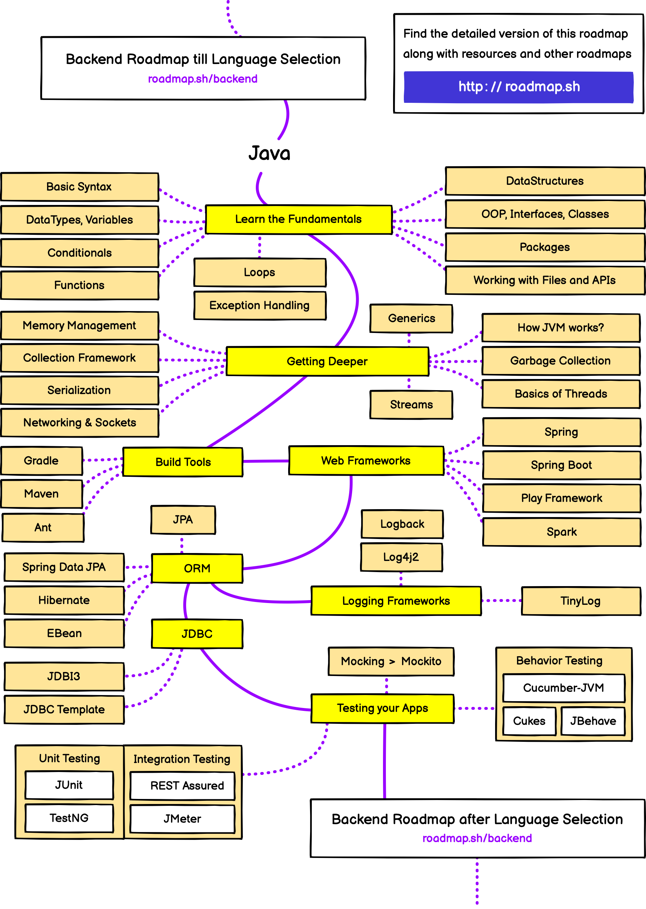

> 分享一些简单好用的资源

## 开发资源
1. [Tabler Icons](https://tablericons.com) 免费和开源的图标，设计时注重细节，使您的设计脱颖而出。
2. [Dev Resources](https://devresourc.es/) 一个供开发人员使用的协作资源列表，以策划的类别呈现。
3. [Font Awesome](https://fontawesome.com/) 世界上最受欢迎和最容易使用的图标集刚刚得到升级。有更多的图标、更多风格、更多选项。
4. [DevDocs](https://devdocs.io/) 为开发者提供快速、离线和免费的文档浏览器。在一个网络应用中搜索 100 多个文档。HTML, CSS, JavaScript, PHP, Ruby, Python, Go, C, C++等等。
5. [Feather Icons](https://feathericons.com/) Feather 是一个简单漂亮的开源图标集合。每个图标都是在 24×24 的网格上设计的，强调简单性、一致性和可读性。
6. [Vercel](https://vercel.com/) 以最佳的前端开发者体验和最高的终端用户性能部署您的项目。
7. [Simple Icons](https://simpleicons.org/) 1400 多个流行品牌的免费 SVG 图标。
8. [Public APIs](https://public-apis.io/)为开发者提供的 1000 多个免费开放的 REST APIs 列表，如电影 API、动漫 API、天气 API、音乐 API、游戏和漫画 API、货币 API、体育 API、科学 API、开放数据 API 等。
9. [Devhints](https://devhints.io/) Web 开发速查表集合。
10. [Tailwind Components](https://tailwindcomponents.com/) Tailwind 图表、网格、输入、表格、模板及更多。
11. [DrawKit](https://drawkit.com/) 免费的矢量 SVG 插图，供您在下一个项目中使用，不需要署名。
12. [unDraw](https://undraw.co/illustrations) 具有开源插图的设计项目，适用于您能想象和创造的任何想法。用您喜欢的颜色创建美丽的网站、产品和应用程序，免费的。
13. [RoadMap](https://roadmap.sh/) 学习路径

## java 学习路径
