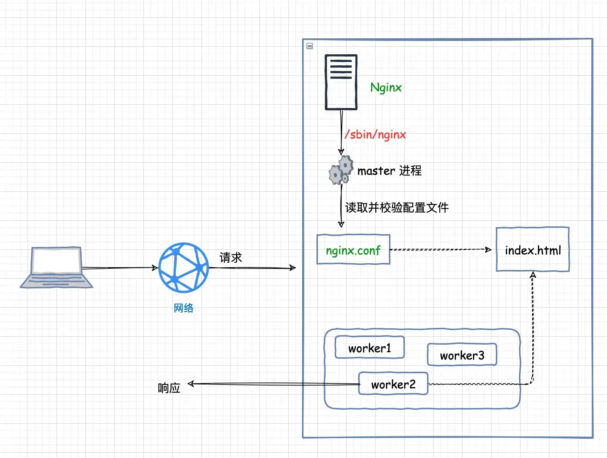

## 概述

Nginx 常用发行版本分为四大阵营:

1. [Nginx开源版](http://nginx.org/)
2. [Nginx plus 商业版](https://www.nginx.com)

3. [Openresty](http://openresty.org/cn) 
   - 是一个基于 Nginx 与 Lua 的高性能 Web 平台
   - 内部集成了大量精良的 Lua 库、第三方模块以及大多数的依赖项。用于方便地搭建能够处理超高并发、扩展性极高的动态 Web 应用、Web 服务和动态网关

4. [Tengine](http://tengine.taobao.org/)
   - 是由淘宝发起的 Web 服务器项目

## 安装开源版

开源版本 Nginx 的安装步骤:

1. 下载

2. 安装依赖

   ```bash
   # 安装 gcc 环境
   yum install -y gcc-c++
   
   # 安装perl库,用于解析正则表达式
   yum install -y pcre pcre-devel
   
   # zlib 压缩与解压缩依赖
   yum install -y zlib zlib-devel
   
   # SSL安全的加密套接字,用于 Http传输
   yum install -y openssl openssl-devel
   ```

   

3. 编译安装

   - `\` 在命令行中表示换行,以提高可读性
   - 可以输入如下的配置
     - `--prefix` : 指定 nginx 安装目录,一般安装在`/usr/local/` 目录下面
     - `--pid-path` :  指向 nginx的pid
     - `--error-log-path` : 错误日志路径
     - `--http-log-path` : http 日志路径
     - `--with-http_gzip_static_module ` :启用 gzip 模块 , 在线实时压缩输出数据流

   ```bash
   # 安装包的解压缩
   tar -zxvf nginx-xxx.tar.gz	
   
   # 在 nginx 解压缩后的目录下进行配置,创建 makefile文件
   ./configure \
   --prefix=/usr/local/nginx \
   --with-http_gzip_static_module
   
   # 执行编译
   make
   # 执行安装
   make install
   ```
   
   
   
4. Nginx 启动与停止(进入`sbin`目录)

   ```bash
   # 进入安装好的目录 /usr/local/nginx/sbin
   cd /usr/local/nginx/sbin
   
   # 启动
   ./nginx
   
   # 快速停止
   ./nginx -s stop
   
   # 优雅关闭，在退出前完成已经接受的连接请求
   ./nginx -s quit
   
   # 重新加载配置
   ./nginx -s reload
   ```

   

5. 关于防火墙

   ```bash
   # 关闭防火墙
   systemctl stop firewalld.service
   
   # 禁止防火墙开机启动
   systemctl disable firewalld.service
   
   # 防火墙开放 80 端口(nginx 默认端口)
   firewall-cmd --zone=public --add-port=80/tcp --permanent
   
   # 重启防火墙
   firewall-cmd --reload
   ```

   

6. 注册为系统服务

   ```bash
   # 进入系统服务设定目录
   cd /usr/lib/systemd/system
   
   # 创建服务脚本
   vi nginx.service
   
   # 添加以下的内容
   [Unit]
   Description=nginx
   After=network.target remote-fs.target nss-lookup.target
   [Service]
   Type=forking
   ExecStartPre=/usr/local/nginx/sbin/nginx -t -c /usr/local/nginx/conf/nginx.conf
   ExecStart=/usr/local/nginx/sbin/nginx -c /usr/local/nginx/conf/nginx.conf
   ExecReload=/usr/local/nginx/sbin/nginx -s reload
   ExecStop=/usr/local/nginx/sbin/nginx -s stop
   ExecQuit=/usr/local/nginx/sbin/nginx -s quit
   PrivateTmp=true
   [Install]
   WantedBy=multi-user.target
   
   # 重新加载系统服务
   systemctl daemon-reload
   
   # 启动 Nginx 服务
   systemctl start nginx.service
   
   # 开机启动
   systemctl enable nginx.service
   ```

## 目录结构

下面是 nginx 的基本命令结构:

1. `conf` 
   - 存放 nginx 的配置文件
   - `nginx.conf` 是 nginx 的主配置文件,它可以引用该命令下的其他 `conf` 配置文件。所以,可以**将配置文件切割为多个,然后再引用**
2. `html`
   - 访问 nginx 的界面,以及一些静态资源
3. `sbin`
   - nginx 主进程文件
4. `logs`
   - 安装时如果没有特别指定,nginx 的相关日志会放在这里这里

```txt
├── conf
│   ├── fastcgi.conf
│   ├── fastcgi.conf.default
│   ├── fastcgi_params
│   ├── fastcgi_params.default
│   ├── koi-utf
│   ├── koi-win
│   ├── mime.types
│   ├── mime.types.default
│   ├── nginx.conf
│   ├── nginx.conf.default
│   ├── scgi_params
│   ├── scgi_params.default
│   ├── uwsgi_params
│   ├── uwsgi_params.default
│   └── win-utf
├── html
│   ├── 50x.html
│   └── index.html
├── sbin
│   ├── nginx
│   └── nginx.old
```

## 基本运行原理

- 首先 nginx 在启动的时候首先会**读取并校验** `nginx.conf`,然后创建一个 `master 主进程`,然后会 *fork*出 `worker 子进程`
- 然后请求访问 nginx 的时候, woker 子进程会处理该请求,处理请求的时候也会读取 `nginx.conf` 来获取基本配置信息等 

```bash
# nginx 启动后查看后台 nginx 的相关进程
[root@localhost nginx]# ps -ef | grep nginx
root      12190      1  0 14:55 ? 00:00:00 nginx: master process /usr/local/nginx/sbin/nginx -c /usr/local/nginx/conf/nginx.conf
nobody    12191  12190  0 14:55 ? 00:00:00 nginx: worker process
```

通过 `ps -ef | grep nginx` 可以看到有一个 matser进程,还有一个 woerker 子进程,它们两个有以下的区别

1. `master 主进程`
   - 不负责业务请求的处理,它主要负责**管理工作进程**
   - 它会接收用户发送的客户端指令,将指令分发给相应的 worker 进程
     - 比如用户输入 *./nginx -s stop* 的命令,master 会将这个指令发送给相应的 worker 进程进行处理
2. `worker 子进程`
   - 工作进程
   - 它主要接收 master 进程发送的客户端指令,以及处理对应的用户的请求



## 基本配置

### 配置文件说明

nginx 的初始配置文件中包含了下面的内容:

1. `worker_processes`
   - 开启的 worker 子进程的数量,默认 `1` 个
2. `http { ... }`
   - nginx 的 HTTP 模块配置,包含几个基本的配置
     - *include  mime.types* : **引入**http mime类型
     - *default_type  application/octet-stream* : 如果 mime 类型没匹配上，默认使用二进制流的方式传输
     - *sendfile on* : 使用linux的 *sendfile(socket, file, len)*高效网络传输，也就是**零拷贝**
     - *keepalive_timeout* : 保持活跃的时间
   - **http 模块中还包含 server 模块**
3. `server {}`
   - nginx 虚拟主机配置模块, 表示一个虚拟 Server 主机的配置,包含几个基本的配置
     - *listen* : 监听的端口号
     - *server_name* : 主机名,可以配置 `ip 地址、域名、主机名`
     - *location*: 用于匹配的 URI 路径(域名后面的一段),有多种匹配方式
     - *error_page* : 错误页
   - **location /** 下的配置说明
     - *root   html*
       - 设置请求路由的 root 根目录, 默认是 html(是一个`相对路径`,和 `conf` 文件夹同一级)
       - 用户访问 `/` 路由时, nginx 会将 `/` 拼接在 root 目录后面
     - *index  index.html index.htm*
       - 设置请求路由的首页
       - 也是一个`相对路径`,相对于 root 根目录
4. `event { ... }`
   - nginx 的事件处理模块,包含几个基本的配置
     - *worker_connections* : 每个 worker 子进程可以接受的连接数

```nginx
worker_processes  1;

events {
    worker_connections  1024;
}

http {
		# 引入 conf 目录下的 mime.types 文件
    include       mime.types;
    default_type  application/octet-stream;
    sendfile        on;
    keepalive_timeout  65;

    server {
        listen       80;
        server_name  localhost;
				# 匹配 URI, 比如 http://www.baidu.com/xx/yyy 中的 "/xx/yyy"
        location / {
            root   html;
            index  index.html index.htm;
        }
				# 出错后,将请求重定向到 /50x.html 目录
        error_page   500 502 503 504  /50x.html;
        location = /50x.html {
            root   html;
        }
    }
}
```

### 基本使用

> 背景: 在Nginx 中创建多个虚拟主机,并且监听除 80 以外的其他端口

新建主机目录: */usr/www/www* 和 */usr/www/void*

```bash
[root@localhost www]# tree
├── void
└── www

[root@localhost www]# pwd
/usr/www/www
[root@localhost www]# ls -la
总用量 4
drwxr-xr-x. 2 root root 24 3月  23 14:19 .
drwxr-xr-x. 4 root root 29 3月  23 14:10 ..
-rw-r--r--. 1 root root 24 3月  23 14:19 index.html
[root@localhost www]# cat index.html 
This is www index page!
```

然后就需要配置 `nginx.conf` 文件:

```nginx
worker_processes  1;
events {
    worker_connections  1024;
}

http {
    include       mime.types;
    default_type  application/octet-stream;
    sendfile        on;
    keepalive_timeout  65;

    server {
        listen       80;
        server_name  localhost;
      	location / {
            root   html;
            index  index.html index.htm;
        }
        error_page   500 502 503 504  /50x.html;
        location = /50x.html {
            root   html;
        }
    }
    
    # 虚拟主机2: root 目录为/usr/www/www
    server {
      # 监听 81 端口
      listen  81;
      # 域名、主机名
      server_name nginx1.com;
      # 定义请求路径 location
      location / {
          # 根目录
          root /usr/www/www;
          # 访问 / 时的首页
          index index.html;	
      }
    }
 
}
```

然后用 curl 命令访问新的 nginx 主机:

```bash
➜ curl http://nginx1.com:81/
This is www index page!
```

## 匹配server_name

> server_name 用于表示一个虚拟主机的名称,可以设置为域名或者主机名

Server_name 有以下的几种匹配规则:

1. **完整匹配**
2. **通配符匹配**
3. **正则匹配**
