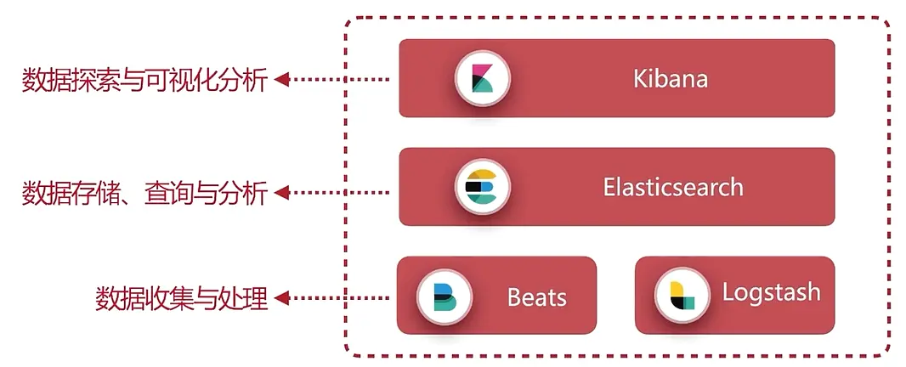
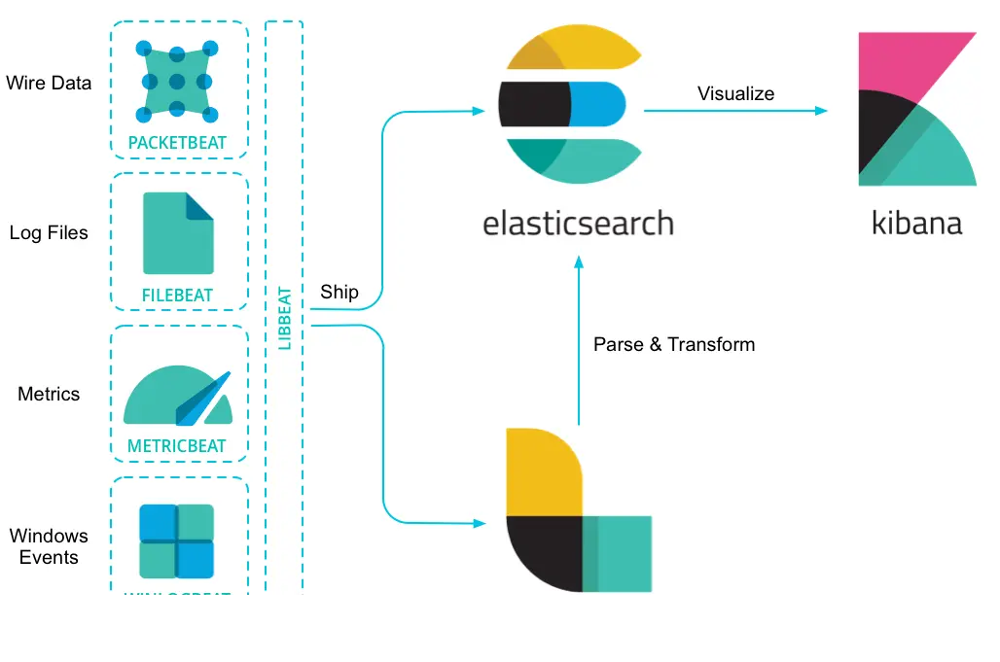
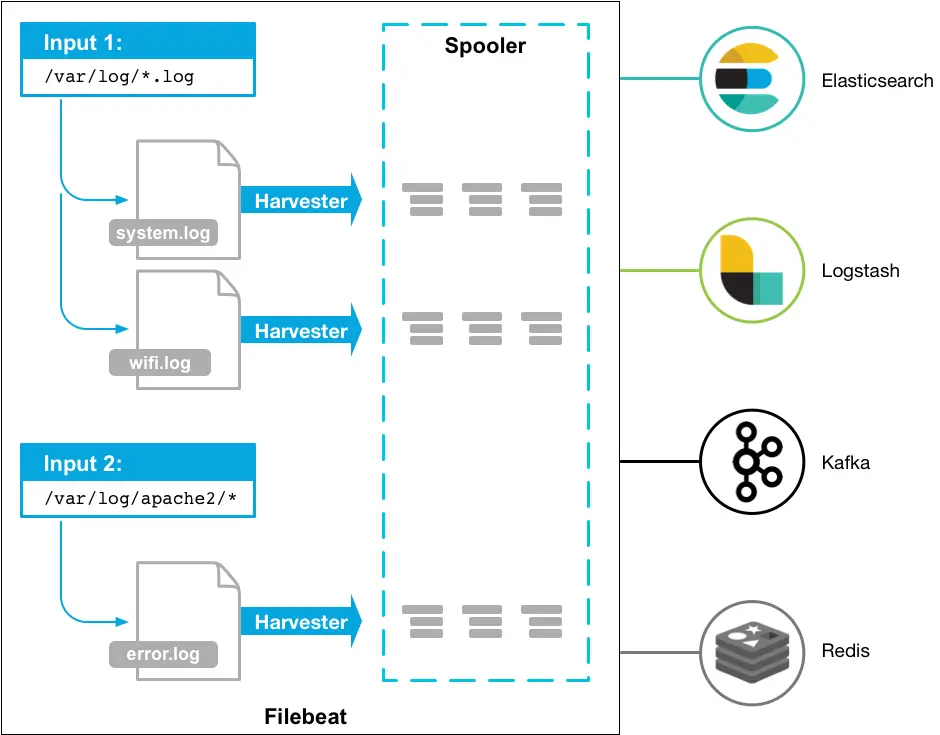

## Elastic Stack 体系

1. `Elastic Search` : 核心引擎
2. `LogStash / Beats`
    - 数据收集与处理
    - 数据源多样性
      - 数据文件 -> 日志 / excel
      - 数据库 -> mysql,sqlserver ...
      - http服务
      - 网络数据
    - 支持自定义拓展
3. Kibana
    - 数据探索与可视化分析



## Elastic Search

### 安装与启动

ES 的安装操作步骤如下

1. ES 依赖于JDK1.8,需配置 JDK 环境
2. 进入 Es 的`bin` 目录,启动 `elasticsearch.bat`
3. ES  的默认端口是`9200`，所以在 ES 启动后, 打开 `http://127.0.0.1:9200/`。然后会看到如下的返回如下的 JSON 数据

  ```json
  {
    "name": "master",
    "cluster_name": "Elasticsearch",
    "cluster_uuid": "FlYswTv8RT-Efu4hckrE9A",
    "version": {
      "number": "6.1.1",
      "build_hash": "bd92e7f",
      "build_date": "2017-12-17T20:23:25.338Z",
      "build_snapshot": false,
      "lucene_version": "7.1.0",
      "minimum_wire_compatibility_version": "5.6.0",
      "minimum_index_compatibility_version": "5.0.0"
    },
    "tagline": "You Know, for Search"
  }
  ```

### ES 配置文件说明

1. Elastic Search的配置文件位于 `Config` 目录
    - `elasticsearch.yml` : Es 的相关配置
    - `jvm.options` : jvm的相关参数
    - `log4j2.properties` : 日志相关的配置
2. **elasticsearch.yml关键配置说明**
    - `cluster.name` : 集群名称,判断是否是同一个集群
    - `node.master` : 节点是否是master
    - `node.name`: 节点名称
    - `network.host` : 网络地址
    - `http.port`  : ES服务端口,默认9200
    - `path.data`  : 数据存储地址
    - `path.log` : 日志存储地址

### ES 常用术语

1. `Index`
    - 索引
    - Document 存在于 Index中, 类比于数据库
2. ~~`Type`~~
    - 数据类型,类比于数据库的表
    - 基本废弃
3. `Document`
    - 文档数据
4. `Field`
    - 字段, 文档的属性

```js
/*
  表示在 Index 为 accounts 中,创建Type为person
  并创建一个文档为 demo,文档中包含了两个字段 [name,sex]
*/
POST /accounts/person/demo
{
    "name":"yoey",
    "sex":"male"
}
```

## Kibana

### Kibana 配置文件说明

1. Kibana 的配置文件位于 `Config` 目录 [kibana.yml]
    - `server.host`  : 地址
    - `server.port`  : 端口号,默认5601
    - `elasticsearch.url` : Es地址
2. Kibana 常用的功能简介
    - Discover   : 数据搜索查看
    - Visualize  :  图表制作
    - Dashboard  : 仪表盘
    - Timelion   : 时序数据的高级可视化分析
    - DevTools   : 开发者工具
    - Management : 配置

## Beats

- Beats 常用于收集数据
  - FileBeat : 日志文件
  - Metricbeat :  度量数据
  - Packetbeat :  网络数据
  - Winlogbeat :  windows数据
  - Heartbeat  : 健康检查



### FileBeat

> FileBeat 处理流程 : 输入-> 处理->输出

- 输入的配置
  - `input_type` => 输入类型
    - log
    - stdin
  - `path` => 数据路径
  
  ```yaml
  # 一个简单的 filebeat 输入 配置
  filebeat.prospectors:
  - input_type: log
    paths:
      - /var/log/*.log
      #- c:\programdata\elasticsearch\logs\*
  ```
  
- 输出的配置,支持输出到以下的路径
  - Consle
  - ElasticSearch
  - Logstash
  - Kafka
  - Redis
  - File
  
  ```yml
  output.elasticsearch:
    # Array of hosts to connect to.
    hosts: ["localhost:9200"]
    # Optional protocol and basic auth credentials.
    #protocol: "https"
    #username: "elastic"
    #password: "changeme"
  ```
  
- Filter 配置
  - **Input时处理**
    - `Include_lines`
    - `exclude_lines`
    - `exclude_files`
  - **Output前处理**
    - `drop_event`
    - `drop_fields`
    - `Decode_json_fields`
    - `Include_fields`


